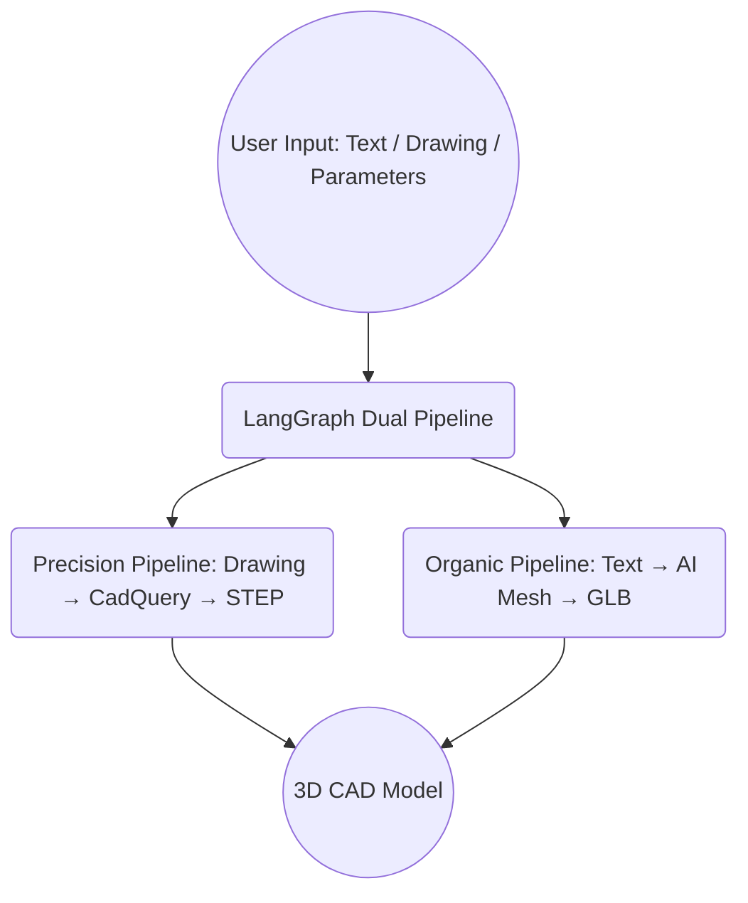

# cad3dify

AI-driven natural language / engineering drawing → industrial-grade 3D CAD model generation platform.

## Getting started

```bash
git clone git@github.com:neka-nat/cad3dify.git
cd cad3dify
uv sync
cp .env.sample .env  # Configure API keys
```

## Run

```bash
# Start backend + frontend
./scripts/start.sh

# Backend only (:8780)
./scripts/start.sh backend

# Frontend only (:3001)
./scripts/start.sh frontend

# Stop all
./scripts/start.sh stop
```

## Architecture



## Demo

We will use the sample file [here](http://cad.wp.xdomain.jp/).

### Input image


### Generated 3D CAD model


