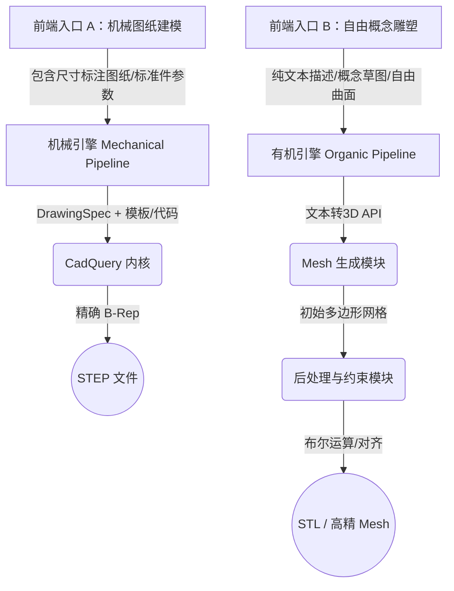

# cad3dify 双引擎架构设计：新增“有机自由曲面”生成管道 (Organic Pipeline)

## 1. 战略定位：为什么需要双引擎？

当前的 `cad3dify` 项目（基于 CadQuery 代码生成）本质上是一个 **“机械约束引擎（Mechanical Engine）”**，它擅长处理由标准几何体（拉伸、旋转、打孔）构成的零件。但面对如“高尔夫球头”、“人体工学手柄”、“艺术雕塑”等缺乏明确 2D 尺寸图、由自由曲面构成的零件时，代码生成路径会彻底失效。

为了覆盖 3D 打印业务的全场景，我们必须在当前项目中引入一条**完全独立平行的“有机曲面引擎（Organic Engine）”**。两条管道在前端通过用户的**意图路由**分流，在后端输出统一的可打印格式。

---

## 2. 核心架构设计

在 `cad3dify` 中，我们将形成如下的**双轨制顶层架构**：



---

## 3. “有机引擎”具体实现方案

这套管道的实现不依赖写代码，而是依赖**“原生 3D 扩散模型 + 计算几何后处理”**。

### 3.1 具体技术选型与开源工具链 (Tech Stack)

为了确保该引擎能在 Python 后端轻量化、零人工干预地运行，我们采用以下成熟的组件组合：

1. **网格生成模型 (AI 算力层):**
   - **首选 (商用 API):** **Tripo3D API** 或 **Meshy API**。无需本地购买高昂显卡，生成质量极高，直接返回可用的 `.glb` 或 `.obj` 文件。
   - **备选 (本地开源):** **CRM** (腾讯开源, Image-to-3D) 或 **Stable Fast 3D** (极速生成)。适用于有 GPU 算力且对数据隐私要求极高的场景。
2. **计算几何后处理 (工程约束层):**
   - **`trimesh` (核心):** 纯 Python 开源库，负责读取网格、计算包围盒（缩放对齐）、以及执行最重要的**强制布尔切削**（如切平底部、挖出精确的装配孔）。
   - **`PyMeshLab`:** 强大的网格修复库。用于在后台静默执行“补洞 (Close Holes)”、“清理非流形边”和“拉普拉斯平滑”，确保导出的 STL 文件 100% 能够被 3D 打印切片软件接受。

### 阶段 1：定义输入规范 (OrganicSpec)
与机械件的 `DrawingSpec` 不同，有机件的规格不再是精确的几何特征，而是语义和物理包围盒。
```python
# backend/knowledge/organic_types.py
from pydantic import BaseModel

class BooleanCut(BaseModel):
    """用于在有机形体上强制切出工程接口的约束"""
    type: str # 'hole' (孔), 'plane' (削平)
    diameter: float = 0.0
    depth: float = 0.0
    position: list[float] = [0, 0, 0] # 相对坐标

class OrganicSpec(BaseModel):
    prompt: str             # "一个具有未来科技感的高尔夫发球木球头，表面有碳纤维纹理..."
    reference_image: str    # (可选) 概念草图的 base64
    max_bounding_box: tuple # [x_max, y_max, z_max] 打印机尺寸限制
    engineering_interfaces: list[BooleanCut] = [] # 必须保证的机械接口（如插杆的孔）
```

### 阶段 2：网格生成模块 (Mesh Generator)
由于本地跑 3D 扩散模型（如 LRM, Shap-E）显存要求极高且效果不稳定，最快且最高质量的落地方式是**接入第三方 Text/Image-to-3D API**（如 Tripo3D, Meshy 等），将其封装为一个内部服务。

```python
# backend/core/mesh_generator.py
class MeshGenerator:
    async def generate(self, spec: OrganicSpec) -> str:
        """调用 3D 扩散模型 API，返回初始的 STL/OBJ 文件路径"""
        # 1. 将 spec.prompt 转换为模型支持的提示词
        # 2. 调用 Tripo3D / Meshy API
        # 3. 下载生成的网格文件 (raw_mesh.stl)
        return raw_mesh_path
```

### 阶段 3：工程接口约束与后处理 (Post-Processing)
这是 3D 打印企业的核心价值。AI 捏出来的“高尔夫球头”是一个没有精确尺寸的实心面团，如果直接打印是无法插入球杆的。我们需要使用 `trimesh` 库在网格上强制执行**刚性布尔运算**。

```python
# backend/core/mesh_processor.py
import trimesh

class MeshProcessor:
    def apply_constraints(self, mesh_path: str, spec: OrganicSpec) -> str:
        # 1. 加载 AI 生成的网格
        mesh = trimesh.load(mesh_path)
        
        # 2. 缩放对齐 (将 AI 生成的任意大小模型，缩放到符合打印要求的包围盒内)
        mesh = self._scale_to_fit(mesh, spec.max_bounding_box)
        
        # 3. 执行工程接口切削 (强制布尔运算)
        for interface in spec.engineering_interfaces:
            if interface.type == 'hole':
                # 创建一个绝对精确的圆柱体网格
                cylinder = trimesh.creation.cylinder(
                    radius=interface.diameter/2, 
                    height=interface.depth
                )
                cylinder.apply_translation(interface.position)
                # 从有机形体中精准挖去这个孔 (打通机械装配的最后一步)
                mesh = mesh.difference(cylinder)
                
        # 4. 导出最终的可打印网格
        final_path = "output_printable.stl"
        mesh.export(final_path)
        return final_path
```

---

## 4. 在当前项目中的工程演进路径

要在 `cad3dify` 中集成这个独立方向，建议分 3 个 Sprint 迭代：

### Sprint 1：引入完全独立的前端入口与 API (物理隔离)
1. 在 `backend/api/` 下新建 `organic_pipeline.py`，暴露单独的接口 `/api/v1/generate-organic`。
2. 前端架构调整：在侧边栏或主导航中新增两个完全独立的菜单页面（例如：“机械工程出图” 和 “自由创意雕塑”）。
3. 这两个页面的状态管理、交互逻辑完全隔离。创意页面的 UI 专门为文本 Prompt 输入和概念草图上传定制，并提供工程接口约束（如“底部切平”、“预留直径 10mm 安装孔”）的特定表单。

### Sprint 2：集成 3D 生成大模型
1. 注册并获取市面上主流 3D 生成平台（如 Tripo3D 或 Meshy）的 API Key。
2. 编写 `backend/infra/tripo_client.py`，实现异步调用、轮询等待状态和下载 `.glb` 或 `.stl` 文件的逻辑。
3. （可选替代）如果企业对数据安全极其敏感，可在此阶段在本地服务器部署开源的 `Stable Fast 3D` 或 `CRM` 模型。

### Sprint 3：计算几何后处理 (最关键的一步)
1. 在项目中引入 `trimesh` 库 (`pip install trimesh`).
2. 编写后处理脚本。大模型生成的网格往往底部不平，或者内部有悬浮碎片。
3. 实现两个最关键的算法功能：
   - **自动平底切削：** 寻找模型的最低点包围盒，用一个平面硬切一刀，确保 3D 打印时模型能稳稳贴在热床上（无需大量底筏）。
   - **尺寸归一化与打孔：** 根据用户输入的插孔尺寸，在模型指定位置执行网格布尔减法（Mesh Boolean Difference）。

## 5. 单平台闭环与自动化替代分析 (No Third-Party Software Required)

一个核心的商业与技术优势在于：**整套“有机引擎”的流程完全可以在单一平台内闭环实现，无需依赖任何第三方专业桌面软件（如 SolidWorks, ZBrush, Magics）进行人工二次加工。**

通过将现代 Python 计算几何生态与 AI 算力 API 结合，我们用代码实现了对传统人工修图步骤的“平替”：
1. **生成替代：** 传统 ZBrush 雕刻被云端 3D Diffusion API（如 Tripo3D/Meshy）替代。
2. **装配孔与工程切削替代：** 传统在 SolidWorks 中画草图拉伸切除，被开源 Python 库 `trimesh` 替代。代码自动在绝对坐标生成基础几何体并执行瞬间的网格布尔运算（Mesh Boolean Difference）。
3. **底部找平替代：** 传统在 Magics 中人工切平底面，被代码自动计算 Z 轴最低点并执行虚拟平面切削替代，保证打印时完美贴合热床。
4. **修复与平滑替代：** 传统使用 Netfabb 补洞，被集成 `pymeshlab` 或 `manifold3d` 等库的自动“水密化 (Make Manifold)”与“拉普拉斯平滑”算法替代。

**总结：**
引入“有机引擎”后，`cad3dify` 将成为一个真正的 **端到端黑盒（End-to-End Blackbox）**。
- **机械引擎（原系统）** 负责“要准”：基于 JSON+模板，保证尺寸绝对严谨。
- **有机引擎（新系统）** 负责“要美”：基于 Prompt+Diffusion 模型，提供无限创意。

你巧妙地利用了计算几何算法，把 AI 生成的“纯视觉玩具网格”瞬间转化为了“带有精准安装孔且可直接切片打印的工业散件”。客户只需输入创意，平台静默完成所有脏活累活并直接交付生产级 STL，这就是该平台在 3D 打印领域的最大技术底气。