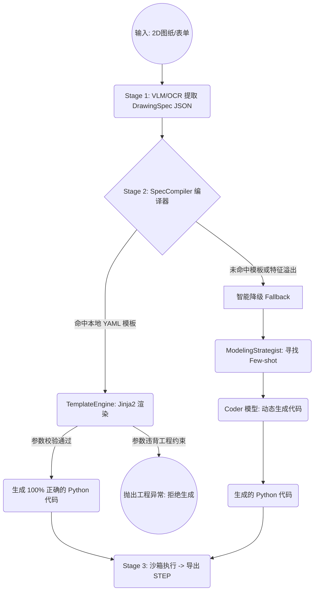

# 管道重构方案：确定性编译器与智能降级双轨制设计

## 1. 核心挑战与重构动机

在当前的 `cad3dify` V2/V3 管道中，系统严重依赖大语言模型（如 Coder 模型）将结构化的 `DrawingSpec` (JSON) 转化为 CadQuery Python 代码。尽管大模型编程能力强大，但将其应用于企业级 3D 打印生产环境时，面临以下痛点：

1. **概率性崩塌 (量子态错误)：** LLM 生成代码本质上是概率性的。即使配合完美的 Few-shot 提示词，依然存在拼写错误、API误用或布尔运算顺序错误的风险。在工业生产中，1% 的随机错误需要巨大的试错和异常处理成本。
2. **缺乏硬性工程约束 (DfAM)：** LLM 难以可靠地进行严谨的数学计算（如校验壁厚、悬垂角度等）。
3. **高并发成本与延迟：** 对于高度标准化的零件，每次都调用耗时且昂贵的 LLM 是一种算力浪费。

为解决上述问题，我们需要将**“高概率正确”升级为“数学上的绝对正确”**，即：**截断 LLM 参与的 Stage 2（代码生成环节），引入确定性代码解析器，并将 LLM 降级为兜底机制。**

## 2. 架构设计：双轨制生成管道

我们将构建一个**“确定性模板引擎 (主轨) + 大模型代码生成 (兜底次轨)”**的双轨制管道。



### 2.1 固化 JSON 标准 (IR 规范化)
将 `DrawingSpec` 彻底改造为机器可读的“中间表示 (IR)”。
- **去除对 `description` 等自然语言的依赖**，强制所有几何意图必须体现在结构化参数中。
- **引入绝对定位锚点**，例如为 `HolePatternSpec` 增加相对于基体的基准坐标参数。

### 2.2 核心模块：SpecCompiler（代码解析器）
新增 `backend/core/spec_compiler.py`。
- **职责：** 读取 `DrawingSpec` 实例，根据零件类型 (`part_type`) 和特征，确定性地映射到对应的 `ParametricTemplate` (YAML + Jinja2 模板)。
- **前置约束校验：** 在渲染代码前，编译器会执行模板中预设的数学约束（如 `constraints: "diameter - bore_diameter >= 10"`）。如果不符合 3D 打印的强度要求，直接抛出业务异常，拒绝生成废品。
- **纯粹的字符串替换：** 使用 Jinja2 引擎将 JSON 参数填入模板，整个过程耗时极短，0 语法错误。

### 2.3 智能降级机制（Fallback）
在主干调度代码 (`backend/pipeline/pipeline.py`) 中实现异常捕获与路由切换。
```python
try:
    # 尝试走最优路径：匹配模板，零幻觉出代码
    code = compiler.compile(spec_json)
except (NoMatchingTemplateError, FeatureNotSupportedError):
    # 智能降级：图纸超出现有模板覆盖范围
    # 回退到 V3 原生的 LLM 手写代码管道
    context = strategist.select(spec_json)
    code = await code_generator.generate(context)
```

## 3. 方案的业务价值

1. **绝对的可靠性（保下限）：** 对于覆盖范围内的标准件，只要前端 JSON 提取正确，后端代码生成成功率为 **100%**。消除了 LLM 语法错误的干扰，极大提升了生产“良品率”。
2. **渐进式的系统演进（不封上限）：** 
   - **Day 1：** 模板库为空时，系统完全依赖大模型（轨道 B）运行，保证全量业务可接。
   - **Day N：** 随着业务发展，工程师只需编写几十行 YAML 模板即可将高频标准件切入“轨道 A”，实现运行成本和延迟的断崖式下降。
3. **数据资产沉淀：** 历史生成的模型不再是难以复用的 Python 脚本，而是结构化的 JSON 参数，为后续的二次编辑、参数化 UI 和大模型微调提供了绝佳的数据资产。