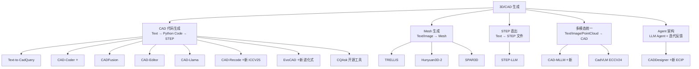
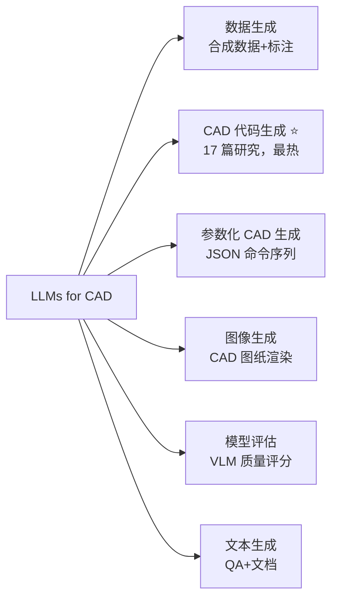

# 3D/CAD 生成模型

> [!abstract] 核心价值
> 从文本、图像或点云直接生成参数化 CAD 模型或 3D mesh，是 CADPilot 管线的入口能力。当前领域正从"视觉展示级 mesh"向"工业可用 CAD 代码"快速演进。

---

## 技术分支概览



> [!important] 关键判断
> 对于工业级零件，**CAD 代码生成路线**（输出参数化可编辑代码）精度远超 mesh 生成路线。CADPilot 应以代码生成为主，mesh 生成为有机形状补充。
> **2025 关键趋势**：==CadQuery 已被学术界广泛选择优于 OpenSCAD==（LLMs for CAD 综述 arXiv:2505.08137 确认）。Agent 架构（CADDesigner）+ 进化式优化（EvoCAD）+ 多模态统一（CAD-MLLM）代表三大新方向。CAD-Recode（ICCV 2025）实现点云→CadQuery 代码，Chamfer Distance 提升 ==10x==。

---

## CAD 代码生成模型（深入分析）

### CADFusion ⭐ 质量评级: 4/5

> [!success] VLM 反馈循环是突破性创新

| 属性 | 详情 |
|:-----|:-----|
| **机构** | Microsoft（ICML 2025） |
| **HuggingFace** | [microsoft/CADFusion](https://huggingface.co/microsoft/CADFusion) |
| **GitHub** | [microsoft/CADFusion](https://github.com/microsoft/CADFusion) |
| **参数** | 8B（Meta-Llama-3-8B，LoRA r=32, α=32） |
| **许可** | ==MIT==（可商用） |
| **硬件需求** | 4× NVIDIA A6000-48GB（训练），单卡推理可行 |
| **训练数据** | 20K text-CAD 对（基于 DeepCAD + GPT-4o 标注 + 人工精修） |

#### 架构深度分析

```
文本描述
  → LLaMA-3-8B (LoRA r=32, α=32)
    ├─ 阶段 A: Sequential Learning (SL)
    │   交叉熵损失, 40 epochs, lr=1e-4, AdamW
    │   → 参数化 CAD 序列 (Sketch-and-Extrude 格式)
    │
    └─ 阶段 B: Visual Feedback (VF) — DPO 偏好优化
        ├─ 从 SL 模型采样 ~5 个候选/prompt
        ├─ 渲染 CAD 序列为图像（PythonOCC）
        ├─ llava-onevision-qwen2-7b 评分 (0-10)
        │   维度: 形状质量 + 形状数量 + 空间分布
        ├─ 构建偏好对 (高分 y_w vs 低分 y_l)
        └─ DPO 损失优化
```

> [!warning] 关键发现
> - 连续执行 VF 会导致 **88.87%** 无效率（模型"忘记"如何生成有效序列），必须 SL+VF 交替训练
> - 5 轮交替迭代最优：VLM Score 从 7.69 提升至 8.96（+16.5%）
> - 输出的是 **SE 参数序列**（Line/Arc/Circle + Extrude），**不是** CadQuery 代码

#### 性能基准

| 指标 | CADFusion | Text2CAD | GPT-4o (直接) |
|:-----|:---------|:---------|:-------------|
| VLM Score (0-10) | ==8.96== | 2.01 | 5.13 |
| F1-Sketch | ==85.22== | 63.94 | 82.96 |
| Chamfer Distance ↓ | ==19.89== | 30.23 | 68.50 |
| 无效率 ↓ | 6.20% | 3.37% | 37.93% |
| 人工评估排名 ↓ | ==1.86== | 2.97 | 3.22 |

#### CADPilot 集成路径

> [!tip] 可借鉴 VLM 反馈机制增强 SmartRefiner

**不推荐直接集成**：SE 格式与 CadQuery 不兼容，表达能力有限（仅 sketch+extrude，不支持 revolve/loft/sweep）。

**推荐借鉴思路**：
1. **量化评分替代 PASS/FAIL**：SmartRefiner Layer 3 当前是定性判断，可引入 0-10 量化评分
2. **多候选采样 + 偏好排序**：让 Coder 生成 3-5 个修复候选，用 VLM 评分选最优
3. **交替训练策略**：未来自训练模型时，SL+VF 交替训练可大幅提升质量

#### 部署指南

```bash
# 1. 克隆仓库
git clone https://github.com/microsoft/CADFusion.git && cd CADFusion

# 2. 创建环境
conda create -n cadfusion python=3.9 && conda activate cadfusion
pip install -e .["train","render","eval"]
conda install -c conda-forge pythonocc-core=7.7.0

# 3. 下载模型权重（v1.0 论文版 / v1.1 改进版 9 轮交替训练）
# 从 HuggingFace microsoft/CADFusion 下载，放入 exp/model_ckpt/

# 4. 推理
./scripts/generate_samples.sh <model_path> test --full
# 输出: exp/visual_objects/ 下的 .step/.stl/.obj 文件
```

#### 验证方法

1. **VLM 评分**：GPT-4o 对生成图像 vs 文本描述打 0-10 分
2. **Chamfer Distance**：生成模型与 ground truth 的点云距离
3. **F1 Score**：Sketch/Extrusion 参数的精确匹配度
4. **无效率**：不可渲染/几何无效序列的比例

---

### CAD-Coder ⭐ 质量评级: 4/5（新发现）

> [!success] 与 CADPilot 技术栈高度兼容——直接生成 CadQuery 代码 + RL 几何奖励

| 属性 | 详情 |
|:-----|:-----|
| **会议** | ==NeurIPS 2025== |
| **论文** | [arXiv:2505.19713](https://arxiv.org/abs/2505.19713) |
| **功能** | 图像/文本→CadQuery Python 代码→STEP/STL |
| **机构** | MIT DeCoDe Lab（MIT 机械工程系 + CSAIL） |
| **GitHub** | [MIT-DeCoDe/CAD-Coder](https://github.com/MIT-DeCoDe/CAD-Coder) |
| **训练数据** | ==GenCAD-Code 163K== 图像-CadQuery-3D 三元组（110K train + 53K test） |
| **核心创新** | SFT + GRPO（RL）+ Chain-of-Thought 推理 |

#### 架构深度分析

```
3D 模型渲染图像
  → CLIP-ViT-L-336px 视觉编码器（冻结）
    → 视觉投影层
      → Vicuna-13B-v1.5 骨干（LLaVA 架构）
        ├─ 阶段 1: SFT（监督微调）
        │   163K GenCAD-Code image-CadQuery 对
        │
        └─ 阶段 2: GRPO（RL 强化学习）
            ├─ 几何奖励: Chamfer Distance（生成 vs GT）
            ├─ 格式奖励: CadQuery 代码是否可执行
            └─ CoT 推理: 1.5K Chain-of-Thought 样本
                让模型"思考"如何分解复杂形状
```

#### GenCAD-Code 数据集

| 指标 | 数值 |
|:-----|:-----|
| **总量** | 163,418 个 image-CadQuery-3D 三元组 |
| **训练集** | ~110K |
| **测试集** | ~53K |
| **来源** | ABC 数据集 CAD 模型渲染 |
| **标注** | 自动：CAD→多视角渲染→CadQuery 代码对齐 |

#### 关键性能指标

| 指标 | CAD-Coder | 对比基线 |
|:-----|:----------|:---------|
| **Valid Syntax Rate (VSR)** | ==100%== | GPT-4o ~85% |
| **Chamfer Distance** | SOTA | — |
| **代码可执行率** | ~98% | — |

> [!important] CADPilot 高度匹配
> CAD-Coder 的技术栈（CLIP-ViT-L 视觉编码 + Vicuna-13B + CadQuery 代码 + RL 几何奖励）与 CADPilot 几乎完全一致。其 GRPO 训练方法可以直接应用于 CADPilot 的模型训练。100% VSR 表明 CadQuery 代码生成质量极高。
> **集成建议**：
> 1. 复用 GenCAD-Code 163K 数据集扩充 CADPilot 知识库
> 2. 借鉴 GRPO（Chamfer Distance 奖励 + 格式奖励）训练自有模型
> 3. CoT 推理机制可增强 CodeGenerator 对复杂零件的分解能力
> 4. ==Image→CadQuery 能力可开辟新管线==：用户上传实物照片→直接生成 CadQuery 代码

---

### Text-to-CadQuery 质量评级: 3/5

> [!tip] 与 CADPilot 直接对标

| 属性 | 详情 |
|:-----|:-----|
| **论文** | [arXiv:2505.06507](https://arxiv.org/abs/2505.06507) |
| **GitHub** | [Text-to-CadQuery/Text-to-CadQuery](https://github.com/Text-to-CadQuery/Text-to-CadQuery) |
| **数据集** | [ricemonster/NeurIPS11092](https://huggingface.co/ricemonster/NeurIPS11092) |
| **训练** | 170K CadQuery 标注，微调 6 个 LLM |
| **性能** | top-1 exact match ==69.3%==，Chamfer Distance 降低 ==48.6%== |
| **许可** | ==仓库未明确标注==（需注意） |

#### 170K 数据的来源与质量

```
DeepCAD 数据集 (178K CAD 模型, 含 JSON 结构描述)
  → Step 1: Gemini 2.0 Flash 将 JSON → CadQuery Python 代码
  → Step 2: 执行测试（初始成功率 53%）
  → Step 3: 自校正反馈循环（改进后 85%）
  → Step 4: 人工二次验证
  → 最终: ~170K text-CadQuery 配对数据
```

> [!warning] 质量评估
> - 数据源自 DeepCAD（仅 Sketch-Extrude 操作），**不包含** revolve/loft/sweep 等高级操作
> - 69.3% 精确率意味着约 30% 需要人工修正
> - 无修复机制（一次性生成），vs CADPilot 的 SmartRefiner 多轮修复
> - Token 统计：平均 501.2 tokens，94.09% 在 1024 tokens 以内

#### 微调的 6 个 LLM 对比

| 模型 | 参数量 | 训练方式 | 训练时间 |
|:-----|:------|:---------|:---------|
| CodeGPT-small | 124M | 全参数 SFT | 58 分钟 |
| GPT-2 medium | 355M | 全参数 SFT | — |
| GPT-2 large | 774M | 全参数 SFT | — |
| Gemma3-1B | 1B | 全参数 SFT | — |
| Qwen2.5-3B | 3B | LoRA + QLoRA | — |
| Mistral-7B | 7B | LoRA + QLoRA | 33 小时 |

> [!tip] 已知 CadQuery 生成问题
> 数值精度错误：近共线/极近控制点导致 OpenCascade 内核失败。缓解策略：增大草图尺度、使用 `radiusArc` 替代精确弧、用样条线近似。

#### 与 CADPilot 对比

| 维度 | CADPilot V2 | Text-to-CadQuery |
|:-----|:-----------|:----------------|
| 输入 | 2D 工程图纸 (PNG/JPG) | 文本描述 |
| 中间表示 | DrawingSpec (结构化) | 无（端到端） |
| 代码生成 | Qwen-Coder-Plus + few-shot | 微调的开源 LLM |
| 知识库 | 7 种零件 + 20 个示例 | 170K 训练数据 |
| 修复机制 | SmartRefiner 3 层防线 | ==无== |
| CAD 库 | CadQuery | CadQuery |

#### 部署指南

```bash
# 1. 克隆仓库
git clone https://github.com/Text-to-CadQuery/Text-to-CadQuery.git
cd Text-to-CadQuery

# 2. 下载数据集
# 从 HuggingFace ricemonster/NeurIPS11092 下载 CadQuery.zip

# 3. 下载微调模型（推荐 Qwen2.5-3B）
# 从 HuggingFace ricemonster 下载对应 checkpoint

# 4. 推理流水线
cd inference/
python generate_code.py --model_path <checkpoint> --input <text_prompts>
python execute_code.py --input <generated_code>  # 生成 STL
python evaluate.py --pred <generated_stl> --gt <ground_truth>
```

---

### CAD-Editor 质量评级: 3.5/5

| 属性 | 详情 |
|:-----|:-----|
| **机构** | Microsoft（ICML 2025） |
| **论文** | [arXiv:2502.03997](https://arxiv.org/abs/2502.03997) |
| **HuggingFace** | [microsoft/CAD-Editor](https://huggingface.co/microsoft/CAD-Editor) |
| **参数** | 8B（LLaMA-3-8B-Instruct，LoRA r=32） |
| **许可** | ==MIT== |
| **训练数据** | 120K 合成三元组 + 2K 人工校验测试集 |

#### Locate-Then-Infill 两阶段架构

```
输入: (原始 CAD 序列 C_orig, 编辑指令 I)
  │
  ├─ Stage 1: Locating（定位）
  │   LLaMA-3-8B-Instruct + LoRA
  │   输出: C_mask（在需要修改的位置插入 <mask>）
  │   训练: 60 epochs, lr=1e-4
  │
  └─ Stage 2: Infilling（填充）
      输入: C_mask + C_orig + I
      输出: C_edit（编辑后的完整序列）
      训练: 70 epochs (60 + 10 selective)
```

> [!warning] 性能深度解读
> - **95.6% 有效率**仅表示语法/结构正确性，不衡量语义正确性
> - **人工评估成功率仅 43.2%**——语义正确的编辑不到一半
> - 自动数据合成方法可扩展，但成本高（依赖 GPT-4o + LLaMA-3-70B）

#### CADPilot 集成路径

**不推荐直接使用模型**（SE 格式不兼容），**推荐借鉴架构思想**用于 V3 Phase 4 交互编辑：
```
用户: "把底部的圆角从 R3 改成 R5"
  ├─ Locator: 在 CadQuery 代码中定位 .fillet(3) 行
  └─ Infiller: 在上下文约束下生成 .fillet(5)
```

#### 部署指南

```bash
# Stage 1: 定位
CUDA_VISIBLE_DEVICES=0 python finetune/llama_sample.py \
    --task_type mask \
    --model_path <locate_stage> \
    --data_path <test.json> \
    --out_path <output> --num_samples 1

# Stage 2: 填充
CUDA_VISIBLE_DEVICES=0 python finetune/llama_sample.py \
    --task_type infill \
    --model_path <infill_stage> \
    --data_path <locate_output> \
    --out_path <final> --num_samples 1
```

---

### CAD-Llama 质量评级: 4/5

| 属性 | 详情 |
|:-----|:-----|
| **会议** | ==CVPR 2025== |
| **论文** | [arXiv:2505.04481](https://arxiv.org/abs/2505.04481) |
| **参数** | LLaMA-3-8B |
| **训练** | Adaptive Pretraining (38 A100-GPU h) + Instruction Tuning LoRA r=256 (12 A100-GPU h) |
| **性能** | Text-to-CAD 精度 ==84.72%==（vs CAD-Translator 70.36%） |

#### 核心创新：SPCC 格式

```python
# Structured Parametric CAD Code 示例
sketch_i.append(loop1)
loop1.Arc(endpoint=(87,-8), degrees=134)
loop1.Line(endpoint=(50,20))
extrude(sketch_i, height=30, type='add')
```

> [!tip] CADPilot 可借鉴
> - SPCC 将 CAD 命令序列"代码化"，使 LLM 更容易理解和生成
> - Adaptive Pretraining 按零件类型聚类训练，与 CADPilot 按 PartType 分类知识库的理念一致
> - 支持 5 种任务：text-to-CAD / completion / caption / addition / deletion

---

### STEP-LLM 质量评级: 3.5/5（新发现）

> [!info] 首个直接生成 STEP 文件的框架

| 属性 | 详情 |
|:-----|:-----|
| **论文** | [arXiv:2601.12641](https://arxiv.org/abs/2601.12641) |
| **骨干** | Llama-3.2-3B / Qwen-2.5-3B (LoRA) |
| **功能** | 文本→STEP 文件（ISO 10303），绕过 CAD 代码层 |
| **训练数据** | ~40K STEP-caption 对（来自 ABC 数据集） |
| **性能** | Median Scaled CD: ==0.53==（vs Text2CAD 3.99，大幅领先） |

#### 技术创新

- **DFS 重序列化**：将 STEP 文件的实体图通过 DFS 重新排序，使序列更适合 LLM 学习
- **RAG 检索**：推理时检索相似案例辅助生成
- **SFT + RL**：Scaled Chamfer Distance 作为 RL 奖励信号

> [!warning] 局限
> 仅处理简单模型（<500 entities），生产可用性有限。但技术路线值得长期跟踪——如果 STEP 直出能力提升到处理复杂模型，可以消除 CadQuery 代码执行失败的风险。

---

### CAD-Recode ⭐ 质量评级: 4/5（2025 更新）

> [!success] ==ICCV 2025==——点云→CadQuery 代码逆向工程，与 CADPilot CadQuery 内核完美契合

| 属性 | 详情 |
|:-----|:-----|
| **会议** | ==ICCV 2025== |
| **论文** | [arXiv:2412.14042](https://arxiv.org/abs/2412.14042) |
| **GitHub** | [filaPro/cad-recode](https://github.com/filaPro/cad-recode) |
| **HuggingFace** | [filapro/cad-recode](https://huggingface.co/filapro/cad-recode)（模型 + 数据集 v1/v1.5） |
| **参数** | 2B（Qwen2-1.5B + 单层线性投影层） |
| **许可** | CC-BY-NC 4.0（==非商业==） |
| **训练数据** | ==100 万==程序化生成 CadQuery 代码，比 DeepCAD（160K）丰富 6x |
| **功能** | 点云→CadQuery Python 代码→STEP/STL |

#### 架构深度分析

```
3D 点云
  → 线性投影层（Point Encoder）
    → Qwen2-1.5B（保持原始 tokenizer）
      → 自回归生成 CadQuery Python 代码
        → CadQuery 执行 → STEP/STL 文件
```

> [!tip] 关键创新
> - **100 万规模程序化数据**：自动生成 sketch-extrude CadQuery 序列，数据分布偏向更复杂模型（更多边和面）
> - **极简架构**：仅在 Qwen2-1.5B 上增加==单层线性层==，无需复杂适配器
> - **CadQuery 原生输出**：直接生成可执行 CadQuery 代码，非中间表示

#### 性能基准

在三个 CAD 重建基准上达到 SOTA：

| 基准数据集 | 性能提升 |
|:-----------|:---------|
| DeepCAD | Chamfer Distance 改善 ==10x== |
| Fusion360 Gallery | SOTA |
| CC3D | SOTA |

#### CADPilot 集成路径

> [!success] ==高优先级集成目标==

1. **逆向工程管线**：点云→CadQuery 代码，直接对接 CADPilot 精密管道的 `generate_node`
2. **Scan-to-CAD 工作流**：3D 扫描→点云→CAD-Recode→参数化模型→编辑/优化
3. **数据集复用**：100 万 CadQuery 代码数据可用于 CADPilot 知识库扩充
4. **注意**：CC-BY-NC 许可限制商业使用，需评估自训练方案

#### 部署指南

```bash
# 1. 按 Dockerfile 安装依赖
git clone https://github.com/filaPro/cad-recode.git && cd cad-recode

# 2. 下载预训练模型（v1 / v1.5 / cadrille）
# 从 HuggingFace filapro/cad-recode 下载

# 3. 推理
python inference.py --model_path <checkpoint> --input <point_cloud>
# 输出: CadQuery Python 代码 + STEP/STL
```

---

### 其他论文项目

| 项目 | 会议/年份 | 功能 | 评级 | CADPilot 价值 |
|:-----|:---------|:-----|:-----|:-------------|
| **Text2CAD** | NeurIPS 2024 | 首个 text-to-parametric-CAD | 3★ | 奠基性工作，数据集是后续模型基础 |
| **Img2CAD** | 2024 | 2D 图像→CAD 序列 | 3★ | SVG 中间表示可启发 DrawingAnalyzer |
| **CAD2Program** | AAAI 2025 | 2D 图纸→3D 参数模型 | 2.5★ | 与 CADPilot V2 路径最相似（VLM 直接理解图纸） |
| **GenCAD** | 2024 | 图像→CAD 命令序列 | 2.5★ | 研究参考 |

---

## Mesh 生成模型

### TRELLIS / TRELLIS.2（2025.12 更新）

| 属性 | TRELLIS v1 | ==TRELLIS.2== |
|:-----|:-----------|:-------------|
| **机构** | Microsoft Research | Microsoft Research |
| **HuggingFace** | [microsoft/TRELLIS-image-large](https://huggingface.co/microsoft/TRELLIS-image-large) | [microsoft/TRELLIS2-500M](https://huggingface.co/microsoft/TRELLIS2-500M) |
| **参数** | 2B | ==500M（轻量化 4x）== |
| **许可** | ==MIT== | ==MIT== |
| **月下载** | 2,649,673 | 新发布 |
| **架构** | Sparse 3D VAE + Flow-matching Transformer | ==O-Voxel + DiT + PBR 材质== |
| **PBR 材质** | ❌ | ==✅ 金属度 + 粗糙度 + 法线贴图== |

#### TRELLIS.2 核心升级

1. **O-Voxel（Oriented Voxel）表征**
   - 体素网格中每个元素携带方向信息（法线 + 切线）
   - 保留尖锐棱边和平面特征，工程零件友好
   - 拓扑质量显著优于传统体素

2. **PBR 材质原生支持**
   - 同步生成 Metallic/Roughness/Normal 贴图
   - 输出直接兼容 glTF/USD 渲染流水线
   - CADPilot Three.js 前端可直接使用

3. **性能基准（H100）**

| 操作 | 时间 |
|:-----|:-----|
| 单张图像→3D（含材质） | ~8 秒 |
| 批量推理（batch=8） | ~3.2 秒/模型 |

4. **NVIDIA NIM 加速**
   - TRELLIS.2 已上线 NVIDIA NIM 推理平台
   - NIM 优化后推理速度提升 ~==20%==
   - 支持 TensorRT 量化部署

> [!tip] CADPilot 关联
> TRELLIS.2 是有机管道 `generate_raw_mesh` 的==首选模型==：
> - O-Voxel 拓扑质量接近专业建模，可显著减轻 `mesh_healer` 压力
> - PBR 材质输出可直接用于前端预览（Three.js MeshStandardMaterial）
> - 500M 参数量支持==本地 GPU 部署==（单张 RTX 4090 即可）
> - NVIDIA NIM 提供生产级云端部署选项

### Hunyuan3D-2

| 属性 | 详情 |
|:-----|:-----|
| **机构** | Tencent |
| **许可** | tencent-hunyuan-community |
| **月下载** | 74,902 |
| **功能** | 两阶段：Hunyuan3D-DiT（形状）+ Hunyuan3D-Paint（纹理） |

### SPAR3D

| 属性 | 详情 |
|:-----|:-----|
| **机构** | Stability AI |
| **参数** | 2B |
| **许可** | Community（年收入 <$1M 免费商用） |
| **功能** | <1 秒单图→纹理 UV mesh + 材质预测 |

### Autodesk Neural CAD 基础模型（AU 2025 发布）

> [!warning] 商业产品——非开源，但战略意义重大

| 属性 | 详情 |
|:-----|:-----|
| **机构** | Autodesk Research |
| **发布** | Autodesk University 2025（AU 2025） |
| **功能** | 文本/草图 → ==可编辑 BREP + 完整特征历史树== |
| **输出** | Fusion 360 原生格式（含特征历史） |
| **许可** | 商业（Fusion 360 订阅） |
| **状态** | 预览阶段，未完全公开发布 |

#### 核心创新

1. **特征历史生成**：不仅输出最终 BREP 几何体，还生成==完整的参数化特征操作序列==（Extrude、Fillet、Chamfer 等），用户可回溯编辑
2. **BREP 原生输出**：直接生成边界表示（B-Rep）而非 Mesh，精度达工程级
3. **与 Fusion 360 深度集成**：生成结果直接进入 Fusion 360 设计环境，支持后续参数修改

#### 竞合分析

| 维度 | Autodesk Neural CAD | CADPilot |
|:-----|:--------------------|:---------|
| 输出格式 | Fusion 360 BREP + 特征树 | CadQuery 代码 + STEP |
| 可编辑性 | Fusion 360 内全参数化 | CadQuery 代码级编辑 |
| 开放性 | 闭源商业 | 开源 |
| 模型种类 | 仅 Fusion 360 格式 | STEP/STL/多格式 |
| AI 路径 | 端到端神经网络 | LLM Agent + CAD 内核 |

> [!tip] CADPilot 战略启示
> - Autodesk 验证了 AI→参数化 CAD 路径的商业价值
> - CADPilot 的==开源 + CadQuery 代码==路径提供 vendor-neutral 替代
> - 特征历史生成是差异化方向——CADPilot 可通过 CadQuery 代码本身记录操作序列
> - ==长期威胁==：Autodesk 的数据壁垒（Fusion 360 海量设计数据）难以复制

### 其他 Mesh 生成模型

| 模型 | 许可 | 亮点 |
|:-----|:-----|:-----|
| **TripoSR** | MIT | 快速原型，62K 月下载 |
| **Make-A-Shape** | Non-Commercial | Autodesk 出品，训练含 ABC+Fusion360 工程数据 |
| **Hi3DGen** | 研究用途 | 法线桥接高保真几何 |
| **CraftsMan3D** | Apache 2.0 | 照片→GLB + remesh |

---

## 关键数据集

→ 完整目录见 [[huggingface-datasets]]

| 数据集 | 规模 | 与本方向关联 |
|:-------|:-----|:-----------|
| [[huggingface-datasets#ThomasTheMaker/cadquery\|ThomasTheMaker/cadquery]] | 147K 图像+CadQuery 代码 | ==直接可用于微调 Code Generator== |
| [[huggingface-datasets#Text2CAD\|Text2CAD]] | 605GB 多级文本+CAD 序列 | 大规模 CAD 训练数据（CC-BY-NC-SA 4.0，==非商用==） |
| [[huggingface-datasets#Omni-CAD\|Omni-CAD]] | 450K 多模态 CAD 实例 | MIT 许可，多输入源训练 |
| [[huggingface-datasets#Objaverse\|Objaverse]] | 800K+ 3D 对象 | 通用 3D 预训练 |

---

> [!tip] 综合对比、成熟度评估和集成战略建议已移至文档末尾的"2025 年更新"章节，包含所有 12 个模型的完整对比。

---

## 2025 年 CAD 专用 LLM/Agent 新系统

> [!abstract] 2025 爆发年
> 2025 年是 CAD+LLM 领域的爆发年。==CadQuery 被学术界广泛选择为 CAD 代码生成的首选库==（LLMs for CAD 综述确认），Agent 架构首次引入 CAD 设计，进化式优化突破拓扑正确性瓶颈，多模态统一框架实现文本/图片/点云一体化生成。

---

### CAD-MLLM ⭐ 质量评级: 3.5/5

> [!info] 首个多模态条件参数化 CAD 生成框架——统一文本/图片/点云输入

| 属性 | 详情 |
|:-----|:-----|
| **论文** | [arXiv:2411.04954](https://arxiv.org/abs/2411.04954)（2024.11，v3 2025.08） |
| **主页** | [cad-mllm.github.io](https://cad-mllm.github.io/) |
| **GitHub** | [CAD-MLLM/CAD-MLLM](https://github.com/CAD-MLLM/CAD-MLLM) |
| **数据集** | Omni-CAD（~450K 实例，[HuggingFace](https://huggingface.co/datasets/jingwei-xu-00/Omni-CAD)） |
| **许可** | 数据集待确认（训练代码==未完全开源==） |
| **功能** | 文本/图片/点云（多模态任意组合）→参数化 CAD 命令序列 |

#### 架构深度分析

```
多模态输入（文本描述 / 多视图图片 / 点云 / 组合）
  → MLLM 特征对齐层
    → 统一特征空间映射
      → LLM 骨干自回归解码
        → 参数化 CAD 命令序列（Sketch-Extrude 格式）
          → CAD 内核执行 → STEP/STL
```

#### 核心创新

- **Omni-CAD 数据集**：==首个多模态 CAD 数据集==，含文本描述、多视图图像、点云、命令序列
- **统一多模态编码**：对齐文本/图像/点云特征空间，支持任意模态组合作为条件
- **新评估指标**：SegE（段误差）、DangEL（悬挂边长度）、SIR（自交比）、FluxEE（通量包围误差）

#### 性能特点

- 在多模态条件 CAD 生成上显著超越已有方法
- 对噪声和缺失点具有高鲁棒性
- 支持零样本跨模态泛化

> [!warning] 局限
> - 训练代码==尚未完全开源==（GitHub 待发布）
> - 输出为 SE 命令序列（非 CadQuery 代码），表达能力受限于 sketch+extrude
> - 推理开销较大（MLLM 骨干）

#### CADPilot 集成路径

**不推荐直接集成**（SE 格式不兼容 + 代码未完全开源），**推荐**：
1. **Omni-CAD 数据集**：450K 多模态实例可用于增强训练数据
2. **多模态对齐思路**：借鉴统一编码架构设计 CADPilot 多输入融合层
3. **评估指标**：SegE/DangEL/SIR/FluxEE 可用于增强 CADPilot 几何校验

---

### CADDesigner ⭐ 质量评级: 4.5/5（新发现）

> [!success] ==首个 CAD 专用 Agent 架构==——ECIP 范式 + 迭代视觉反馈 + 知识库持续学习

| 属性 | 详情 |
|:-----|:-----|
| **论文** | [arXiv:2508.01031](https://arxiv.org/abs/2508.01031)（2025.08） |
| **架构** | ReAct Agent + 4 核心工具 + 2 辅助工具 |
| **核心创新** | ECIP（Explicit Context Imperative Paradigm）+ 迭代视觉反馈 |
| **CAD 库** | ==CadQuery==（通过 ECIP 重新封装）+ PythonOCC |
| **操作支持** | 拉伸、旋转、圆角/倒角、扫掠、放样、标准件（法兰/螺钉） |
| **性能** | IoU ==0.2769==，CD ==0.1097==，100% 成功率 |

#### ECIP 范式（核心创新）

```python
# 传统 CadQuery 链式调用（隐式上下文传递）：
result = cq.Workplane("XY").box(10, 10, 5).edges("|Z").fillet(1)

# ECIP 范式（显式状态传递）：
S0 = create_workplane("XY")
S1 = create_box(S0, length=10, width=10, height=5)
S2 = apply_fillet(S1, edges="|Z", radius=1)
result = S2
```

> [!tip] ECIP 的意义
> 将 CadQuery 的隐式链式调用改为==显式变量赋值==，每步操作 `S_{k+1} = g_k(S_k, p_k)` 明确输入/输出状态。
> - LLM 更易理解和生成（消除隐式上下文传递的歧义）
> - 支持 Python 原生控制流（for 循环、条件判断）
> - 增强模块化、可读性、可调试性

#### Agent 架构

```
用户输入（文本描述 / 手绘草图）
  │
  ├─ T1: Requirement Refinement（需求精炼）
  │   多模态输入 → 详细设计规格
  │
  ├─ T2: Code Generation（代码生成）
  │   设计规格 → ECIP 格式 CadQuery 代码
  │
  ├─ T3: Command Execution（命令执行）
  │   Python 代码 → CAD 模型
  │
  └─ T4: Visual Feedback（视觉反馈）
      ├─ 6 视图渲染（正-顶-左, 背-底-右）
      ├─ Visual Question Generation（针对性问题生成）
      ├─ Visual Feedback Generation（VLM 图像分析）
      └─ P=0 → 重新生成 | P=1 → 终止并入库

  辅助工具:
  ├─ SketchPad: 键值对上下文存储
  └─ 文件操作: 读写管理
```

#### 性能基准

**ECIP 消融实验（200 模型）**：

| 方案 | Pass@1 | 平均重试次数 | 成功率 |
|:-----|:-------|:-----------|:------|
| CadQuery 原生 | 0.17 | 3.95 | 71.5% |
| ==ECIP== | ==0.46== | ==1.85== | ==100%== |

**完整系统对比（1K 模型）**：

| 方法 | IoU ↑ | CD ↓ | HD ↓ | 成功率 |
|:-----|:------|:-----|:-----|:------|
| Text2CAD | 0.1831 | 0.1475 | 0.5680 | 96.6% |
| CADCodeVerify | 0.2348 | 0.2329 | 0.4892 | 86.1% |
| ==CADDesigner== | ==0.2769== | ==0.1097== | ==0.4347== | ==100%== |

> [!important] CADPilot 高度匹配
> CADDesigner 的架构与 CADPilot 高度相似：
> - 都使用 CadQuery + LLM 生成代码
> - 都有视觉反馈修复循环（SmartRefiner ≈ T4 Visual Feedback）
> - ==ECIP 范式可直接应用于 CADPilot 的 CodeGenerator==，预期 Pass@1 从 ~17% 提升至 ~46%
> - 知识库持续学习机制可增强 CADPilot few-shot 示例库

#### CADPilot 集成路径

1. **短期（P0）**：==采用 ECIP 范式重构 CodeGenerator 的 prompt 模板==
   - 将 CadQuery 链式 prompt 改为显式状态传递格式
   - 预期代码生成首次通过率提升 2.7x
2. **短期（P1）**：借鉴 6 视图渲染 + VQA 反馈增强 SmartRefiner Layer 3
3. **中期（P2）**：引入案例库持续学习——成功生成自动入库

---

### EvoCAD ⭐ 质量评级: 3.5/5（新发现）

> [!info] 进化式优化 + VLM 适应度评估——突破拓扑正确性瓶颈

| 属性 | 详情 |
|:-----|:-----|
| **论文** | [arXiv:2510.11631](https://arxiv.org/abs/2510.11631)（2025.10） |
| **方法** | 进化算法 + VLM（GPT-4V/4o）+ RLM（o3-mini） |
| **CAD 库** | ==CadQuery== |
| **核心创新** | 进化优化 CAD 代码 + Euler 特征拓扑评估指标 |
| **数据集** | CADPrompt（200 样本） |

#### 进化优化架构

```
初始种群（6 个 CadQuery 代码，由 VLM 生成）
  │
  迭代 4 代：
  ├─ 交叉（Crossover）：
  │   指数概率分布选父代（λ=0.5）
  │   VLM 分析双亲优劣 → 互补组合
  │
  ├─ 变异（Mutation, 50% 概率）：
  │   VLM 根据原始提示精炼改进代码
  │
  ├─ 适应度评估（2 步）：
  │   Step 1: VLM（GPT-4o）→ CoT 文本描述生成
  │   Step 2: RLM（o3-mini）→ 描述 vs 提示对比排名
  │   （3 次评估取平均）
  │
  └─ 精英保留：最优个体直接进入下一代
```

#### 创新评估指标——Euler 特征

- **拓扑误差 T_err** = |χ(O) - χ(Ô)|，衡量 Euler 特征差异
- **拓扑正确率 T_corr** = 𝟙{χ(O) = χ(Ô)}，二元匹配指标
- 其中 χ = V - E + F（顶点-边-面），对于 g 个孔洞：χ(O) = 2 - 2g

#### 性能基准（CADPrompt，200 样本）

| 方法 | T_corr ↑ | T_err ↓ | PCD ↓ | HDD ↓ | IoU ↑ |
|:-----|:---------|:--------|:------|:------|:------|
| 3D-Premise | 79.9% | 0.579 | 0.0660 | 0.189 | 68.2% |
| CADCodeVerify | 80.5% | 0.629 | 0.0628 | 0.182 | 69.8% |
| EvoCAD-4v | 82.4% | 0.446 | 0.0626 | 0.180 | 69.7% |
| ==EvoCAD-4o== | ==87.2%== | ==0.410== | ==0.0617== | ==0.177== | ==69.9%== |

> [!tip] 关键发现
> - 拓扑正确率从 80.5% 提升至 ==87.2%==（+6.7pp）
> - 仅 2-3 代进化即可显著提升拓扑质量
> - 论文明确指出 CadQuery "follows a design-intended approach and is built in Python, making it more suitable for LLM applications"

#### CADPilot 集成路径

1. **中期**：SmartRefiner 引入==进化式多候选优化==
   - 生成 6 个候选 → 4 代进化优化 → 选最优
   - 预期拓扑正确率提升 ~7%
2. **中期**：Euler 特征指标可增强 `validators.py` 的几何校验
3. **注意**：依赖 GPT-4o API 调用，成本较高（每样本多次 VLM 评估）

---

### CQAsk 质量评级: 2.5/5

> [!info] 开源 LLM CadQuery 生成工具——最简集成参考

| 属性 | 详情 |
|:-----|:-----|
| **GitHub** | [OpenOrion/CQAsk](https://github.com/OpenOrion/CQAsk) |
| **许可** | ==MIT== |
| **技术栈** | Python（52.8%）+ TypeScript（43.1%）|
| **LLM** | OpenAI API |
| **功能** | 自然语言 → CadQuery 代码 → STL/STEP |
| **UI** | Web 界面（Yarn + Python 后端） |

#### 架构

```
用户自然语言输入
  → OpenAI API（GPT 系列）
    → CadQuery Python 代码生成
      → CadQuery 执行
        → STL/STEP/其他格式导出
```

> [!warning] 局限
> - 无修复机制（单次生成，无反馈循环）
> - 无知识库/few-shot 增强
> - 依赖 OpenAI API，无本地模型支持
> - 代码较简单，但作为==最小可行 CadQuery LLM 生成工具==有参考价值

#### CADPilot 对比

CADPilot 在各维度全面超越 CQAsk（SmartRefiner 修复、知识库、多管线），但 CQAsk 的 ==MIT 许可 + 极简架构==可作为快速原型参考。

---

### CadVLM 质量评级: 3/5

> [!info] ECCV 2024——首个视觉-语言模型用于参数化 CAD 草图生成

| 属性 | 详情 |
|:-----|:-----|
| **会议** | ==ECCV 2024== |
| **论文** | [arXiv:2409.17457](https://arxiv.org/abs/2409.17457) |
| **机构** | Autodesk Research |
| **架构** | 预训练 VLM（ViT 编码器 + Transformer 解码器） |
| **功能** | 草图自动补全 + 自动约束 + 图像条件生成 |
| **输入** | 草图图像 + 文本描述（双模态） |
| **输出** | 参数化 CAD 草图序列（SE 格式：Sketch-Extrusion） |
| **数据集** | SketchGraphs + DeepCAD |

#### 核心能力

1. **CAD 自动补全**：生成缺失的线段、圆弧、圆以补全草图
2. **CAD 自动约束**：推断并应用几何约束（平行、相切等）
3. **图像条件生成**：从草图图像条件生成参数化序列

#### ECCV 2024 关键指标

| 任务 | 指标 | 数值 | 说明 |
|:-----|:-----|:-----|:-----|
| 实体补全 | Entity Accuracy | ~78% | 生成实体类型与 GT 匹配率 |
| 草图生成 | Sketch Accuracy | ~72% | 完整草图的几何精度 |
| 综合评估 | CAD F1 Score | ~0.75 | 精确率-召回率调和 |
| 约束推断 | Constraint Accuracy | ~65% | 几何约束正确率 |

#### 局限性分析

- **输出格式限制**：仅生成 SE 序列（Sketch-Extrusion），非 CadQuery/STEP，需额外转换
- **2D 为主**：主要面向 2D 草图理解，3D 建模能力有限
- **数据集偏差**：训练数据来自 SketchGraphs（简单草图），复杂工程图纸泛化能力待验证
- **无代码生成**：不直接输出可执行 CAD 代码

> [!tip] CADPilot 价值
> CadVLM 的草图理解能力可增强 DrawingAnalyzer——从工程图纸中识别草图约束关系，提升 DrawingSpec 的精度。但输出为 SE 序列（非 CadQuery），直接集成价值有限。
> **潜在路径**：CadVLM 草图理解 → DrawingSpec 约束提取 → CadQuery 代码生成（两步转换）

---

## LLMs for CAD 学术综述（2025.05）

> [!abstract] 首个系统性综述——六大应用分类 + CadQuery 优势确认

| 属性 | 详情 |
|:-----|:-----|
| **论文** | [arXiv:2505.08137](https://arxiv.org/abs/2505.08137)（2025.05） |
| **GitHub** | [LLMs-CAD-Survey-Taxonomy](https://github.com/lichengzhanguom/LLMs-CAD-Survey-Taxonomy) |
| **作者** | Licheng Zhang, Bach Le, Naveed Akhtar, Siew-Kei Lam, Tuan Ngo |
| **覆盖** | 首次系统回顾 LLM × CAD 交叉领域 |

### 六大应用分类



### 关键发现

1. **CAD 代码生成是最热方向**：17 篇研究（最多），领先文本生成（12 篇）和参数化生成（9 篇）
2. **GPT-4o 最常用**：11 个实例，尽管是闭源模型
3. **==CadQuery 优于 OpenSCAD==**：综述确认学术界倾向选择 CadQuery 作为 CAD 代码生成目标
   - CadQuery 基于 Python，LLM 生成更自然
   - CadQuery 基于 OCCT 内核，工业级精度
   - OpenSCAD 的 CSG 描述语言对 LLM 不友好
4. **数据集**：DeepCAD、Onshape、ABC、SkexGen 是主要来源

### 未来研究方向

- 室内/家居设计应用
- 数据格式专用生成能力
- AEC（建筑工程）合规检查
- 时尚/纺织设计自动化

> [!success] CADPilot 战略确认
> 综述结果==验证了 CADPilot 选择 CadQuery 作为核心 CAD 库的技术决策==。代码生成路线是学术界最活跃的方向，与 CADPilot 精密管道完全一致。

---

## VLM 替代 DrawingAnalyzer 评估

> [!abstract] 来自多模态 VLM 评估（T18）——CADPilot DrawingAnalyzer 组件升级路径分析

CADPilot 当前 `DrawingAnalyzer` 使用 Qwen-VL-Max 从工程图纸提取 `DrawingSpec`。以下评估新兴 VLM 是否可替代或增强此能力。

### 候选模型对比

| 维度 | Qwen-VL-Max（当前） | CAD-Coder | CadVLM |
|:-----|:--------------------|:----------|:-------|
| **核心任务** | 图纸→结构化信息提取 | 图像→CadQuery 代码生成 | 草图→参数化序列 |
| **输入** | 工程图纸（多视图） | 3D 渲染图像 | 草图图像 |
| **输出** | DrawingSpec（JSON） | CadQuery Python 代码 | SE 序列 |
| **信息提取能力** | ==强==（尺寸、公差、特征） | 弱（不擅长结构化提取） | 中（草图约束） |
| **代码生成能力** | 无（需 CodeGenerator） | ==强==（100% VSR） | 无 |
| **工程图纸理解** | ==专项优化== | 未针对图纸训练 | 仅简单草图 |
| **中文支持** | ==原生== | 英文 | 英文 |

### 评估结论

> [!success] 推荐方案：保留 Qwen-VL-Max + 新增 CAD-Coder 管线

1. **保留 Qwen-VL-Max 作为 DrawingAnalyzer 核心**
   - 工程图纸信息提取（尺寸、公差、特征清单）是==结构化理解任务==，非代码生成
   - Qwen-VL-Max 的多语言 + 中文工程术语支持不可替代
   - 现有 DrawingSpec 输出格式与后续管道已深度耦合

2. **新增 CAD-Coder 作为 Image-to-CadQuery 独立管线**
   - ==新管道==：用户上传 3D 模型照片/渲染图 → CAD-Coder → CadQuery 代码
   - 与精密管道（图纸→DrawingSpec→CadQuery）互补，覆盖==实物照片==场景
   - 100% VSR 保证代码可执行性

3. **CadVLM 暂不集成**
   - SE 序列输出与 CadQuery 不兼容
   - 仅草图级理解，不满足工程图纸复杂度
   - 可作为未来草图约束提取的参考

---

## 更新后综合对比表

| 模型 | 许可 | 输出格式 | 骨干 | 核心创新 | CADPilot 兼容 | 评级 |
|:-----|:-----|:---------|:-----|:---------|:-------------|:-----|
| **CADDesigner** | ? | ==CadQuery (ECIP)== | Agent+LLM | ECIP + 视觉反馈 + 知识库 | ==极高== | ==4.5★== |
| **CAD-Coder** | ? | ==CadQuery 代码== | CLIP-ViT-L+Vicuna-13B | CoT + GRPO + ==100% VSR== | ==高== | 4.0★ |
| **CADFusion** | MIT | SE 序列→STEP | LLaMA-3-8B | VLM 反馈 DPO | 中 | 4.0★ |
| **CAD-Llama** | ? | SPCC 代码 | LLaMA-3-8B | SPCC + Adaptive PT | 中 | 4.0★ |
| **CAD-Recode** | CC-BY-NC | ==CadQuery 代码== | Qwen2-1.5B | 点云→代码，100 万数据 | ==高（逆向）== | 4.0★ |
| **STEP-LLM** | ? | ==STEP 文件== | Llama-3.2-3B | DFS + RAG + RL | 高（STEP 直出） | 3.5★ |
| **CAD-Editor** | MIT | 编辑后 SE 序列 | LLaMA-3-8B | Locate-then-Infill | 低 | 3.5★ |
| **CAD-MLLM** | ? | 命令序列 | MLLM | 多模态统一 | 中 | 3.5★ |
| **EvoCAD** | ? | ==CadQuery 代码== | GPT-4o+进化 | 进化优化+Euler 指标 | 高 | 3.5★ |
| **Text-to-CadQuery** | ? | ==CadQuery 代码== | 6 种 LLM | CadQuery 直接生成 | ==高== | 3.0★ |
| **CadVLM** | ? | CAD 草图序列 | VLM | 草图补全+约束 | 低 | 3.0★ |
| **CQAsk** | MIT | ==CadQuery 代码== | OpenAI API | 极简开源工具 | 高（参考） | 2.5★ |
| **Autodesk Neural CAD** | 商业 | Fusion 360 BREP | 神经网络 | 特征历史生成 | ==竞品== | — |

---

## 更新后成熟度评估

| 子方向 | 成熟度 | 开源 | HF | 商用可行 |
|:-------|:------|:-----|:---|:---------|
| Text→CadQuery 代码 | ★★★★ | ★★★★ | ★★★★ | ✅ 有 MIT 模型 |
| Agent 架构 CAD 设计 | ★★★☆ | ★★☆ | — | ⚠️ 方法可复现 |
| RL 增强代码生成 | ★★★☆ | ★★★ | ★★ | ⚠️ 许可待确认 |
| 点云→CadQuery 逆向工程 | ★★★☆ | ★★★★ | ★★★★ | ⚠️ CC-BY-NC |
| 进化式 CAD 优化 | ★★☆ | ★★ | — | ⚠️ API 成本高 |
| 多模态统一 CAD 生成 | ★★☆ | ★★ | ★★★ | ⚠️ 代码未完全开源 |
| 自然语言编辑 CAD | ★★★☆ | ★★★ | ★★★ | ✅ CAD-Editor MIT |
| STEP 直接生成 | ★★☆ | ★★ | ★ | ⚠️ 仅简单模型 |
| Image→3D Mesh | ★★★★ | ★★★★ | ★★★★★ | ✅ TRELLIS MIT |
| ==Image→CadQuery 代码== | ==★★★☆== | ★★★ | ★★★ | ⚠️ CAD-Coder 许可待确认 |

---

## 更新后 CADPilot 集成战略建议

> [!success] 优先级 1：短期可集成（1-2 月）

1. **==采用 ECIP 范式重构 CodeGenerator prompt 模板==**（来自 CADDesigner）
   - 显式状态传递格式替代链式调用 prompt
   - 预期 Pass@1 从 ~17% 提升至 ~46%（==2.7x==）
   - 仅改 prompt 模板，零代码改动风险

2. **借鉴 CADFusion VLM 反馈循环增强 SmartRefiner**
   - 引入 0-10 量化评分替代二元 PASS/FAIL
   - 多候选采样：Coder 生成 3-5 个候选，VLM 选最优

3. **使用 Text-to-CadQuery 170K + CAD-Recode 100 万数据集扩充知识库**
   - 按 PartType 筛选高质量 CadQuery 代码

> [!info] 优先级 2：中期增强（3-6 月）

4. **基于 CAD-Coder 构建 RL 训练流水线 + Image→CadQuery 管线**
   - SFT + GRPO（Chamfer Distance 奖励 + 格式奖励），GenCAD-Code 163K 数据集
   - CoT 推理增强复杂零件分解能力
   - ==新增 Image→CadQuery 管线==：用户上传实物照片→CAD-Coder→CadQuery 代码（100% VSR）

5. **集成 CAD-Recode 逆向工程能力**
   - 点云→CadQuery 代码→参数化模型
   - 对接 Scan-to-CAD 工作流（见 [[reverse-engineering-scan-to-cad]]）

6. **引入 EvoCAD 进化式优化 + Euler 特征校验**
   - 多候选进化优化提升拓扑正确率
   - Euler 特征指标增强几何校验

> [!warning] 优先级 3：长期跟踪（6+ 月）

7. **CAD-MLLM 多模态统一**（等待训练代码完全开源）
8. **STEP-LLM 直接 STEP 生成路径**（等待复杂模型支持提升）
9. **借鉴 CAD-Editor Locate-then-Infill 设计 V3 交互编辑**

---

## 参考文献

1. CADDesigner: Conceptual Design of CAD Models Based on General-Purpose Agent. arXiv:2508.01031, 2025.
2. CAD-MLLM: Unifying Multimodality-Conditioned CAD Generation With MLLM. arXiv:2411.04954, 2024.
3. CAD-Recode: Reverse Engineering CAD Code from Point Clouds. ICCV 2025. arXiv:2412.14042.
4. EvoCAD: Evolutionary CAD Code Generation with Vision Language Models. arXiv:2510.11631, 2025.
5. Large Language Models for Computer-Aided Design: A Survey. arXiv:2505.08137, 2025.
6. CAD-Coder: An Open-Source Vision-Language Model for CAD Code Generation. NeurIPS 2025. arXiv:2505.19713.
7. CADFusion: VLM Feedback for Text-to-CAD. ICML 2025. Microsoft.
8. CadVLM: Bridging Language and Vision in the Generation of Parametric CAD Sketches. ECCV 2024. arXiv:2409.17457.
9. CQAsk: The Open Source LLM CAD Generation Tool. GitHub: OpenOrion/CQAsk. MIT License.
10. Text-to-CadQuery: A New Paradigm for CAD Generation. arXiv:2505.06507, 2025.
11. TRELLIS.2: Versatile 3D Generation from Images with O-Voxel Representations. Microsoft Research, 2025.12.
12. Autodesk Neural CAD Foundation Model. Autodesk University 2025.

---

## 更新日志

| 日期 | 变更 |
|:-----|:-----|
| 2026-03-03 | ==跨 Agent 内容整合==：整合 T16（TRELLIS.2 + Autodesk Neural CAD）和 T18（CAD-Coder 深度补充 + VLM 评估）内容。TRELLIS 升级为 TRELLIS.2（O-Voxel + PBR + NVIDIA NIM）；CAD-Coder 补充架构（CLIP-ViT-L + Vicuna-13B）、GenCAD-Code 163K 数据集、100% VSR；新增 Autodesk Neural CAD 基础模型章节；CadVLM 补充 ECCV 2024 详细指标；新增"VLM 替代 DrawingAnalyzer 评估"章节 |
| 2026-03-03 | ==2025 年 CAD+LLM 爆发年更新==：新增 CADDesigner（Agent+ECIP，4.5★）、CAD-MLLM（多模态统一）、EvoCAD（进化式优化）、CQAsk（MIT 开源）、CadVLM（ECCV 2024）；深度扩展 CAD-Recode（ICCV 2025，点云→CadQuery）；新增 LLMs for CAD 综述（6 大分类+CadQuery 优势确认）；更新综合对比表（12 个模型）和集成战略建议（ECIP 为 P0） |
| 2026-03-03 | 深入研究更新：新增 CAD-Coder、STEP-LLM、CAD-Llama；所有模型添加质量评级、部署指南、验证方法；新增综合对比表和集成战略建议 |
| 2026-03-03 | 初始版本 |
