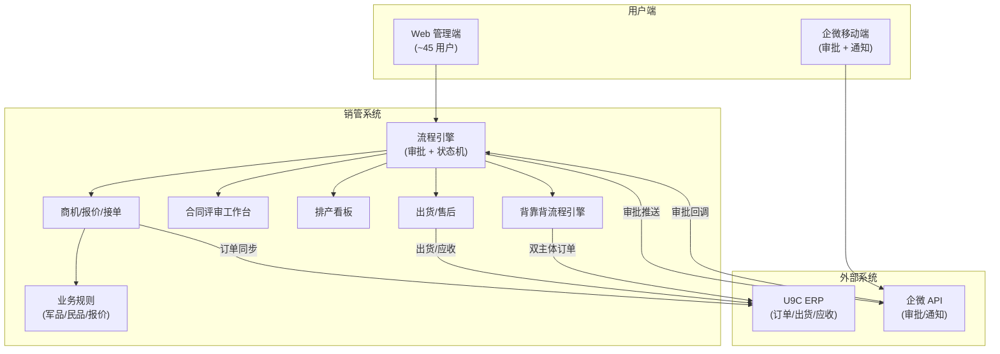
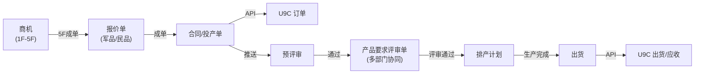
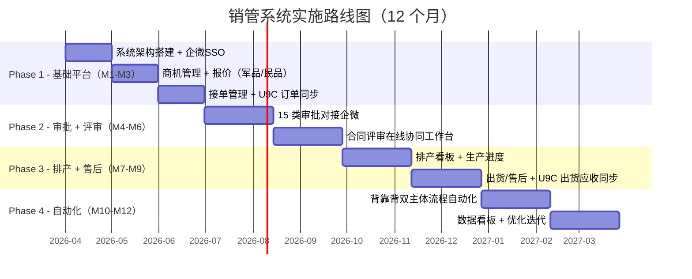

# PRD: 市场-销售-计划流程管理系统

---

## 1. Executive Summary

### 1.1 Problem Statement

公司当前 **无 CRM 系统**，市场-销售-计划全流程（商机 → 报价 → 接单 → 合同评审 → 计划排产 → 生产 → 售后）几乎完全依赖线下操作，仅 U9C ERP 承担部分订单和财务功能。约 **45 名核心用户**（销售 20 人 + 评审 20 人 + 排产 5 人）每日面临以下痛点：

1. **无统一业务平台**：商机、报价、接单全靠 Excel/纸质流转，信息散落在个人电脑和微信群中，无法追溯
2. **审批效率低**：15 类审批依赖企微简单审批或纸质签字，缺乏流程引擎，无法自动流转、催办和统计
3. **双主体流程不透明**：快速制造公司与飞而康新材料公司之间的背靠背流程（外协、内部转售）完全人工协调，易出错
4. **军品/民品报价混乱**：两套报价逻辑无系统支撑，报价模板靠人工维护，历史报价难以追溯
5. **合同评审线下协同困难**：多部门评审需线下传递纸质评审单，评审状态不透明，阻塞排产
6. **生产进度不可见**：排产、上机、外协、发货状态无实时看板，重点客户交期管理依赖人工盯

### 1.2 Proposed Solution

从零构建**市场-销售-计划一体化流程管理系统**（以下简称"销管系统"），一年内实现：

- **全流程数字化**：7 个核心环节从线下迁移至线上，建立统一数据底座
- **U9C 深度集成**：通过 U9C 开放 API 实现订单、出货、应收单双向同步
- **企微审批集成**：15 类审批流程对接企微审批，支持移动端操作
- **双主体流程自动化**：快速制造 ↔ 飞而康新材料的背靠背流程中 4 个环节自动化
- **军品/民品分类管理**：两套报价模板 + 客户分类 + 差异化流程

### 1.3 Success Criteria

| KPI | 基线（当前） | 目标值 | 衡量方式 |
|:----|:------------|:-------|:---------|
| 流程数字化覆盖率 | ~10%（仅 U9C 订单/财务） | 100%（7 环节全部线上） | 系统功能覆盖审计 |
| 审批平均处理时长 | 2-3 天（纸质/企微） | ≤ 4 小时 | 审批流程日志统计 |
| 订单信息传递错误率 | ~5%（人工转录） | < 0.5% | 月度 U9C 对账差异率 |
| 背靠背流程自动化率 | 0 | ≥ 4 个环节自动化 | 自动化环节计数 |
| 商机→成单全流程可追溯 | 不可追溯 | 100% 商机有完整生命周期记录 | 系统数据完整性检查 |
| 报价响应时间 | 1-2 天 | ≤ 4 小时 | 报价创建到发出时间差 |

---

## 2. User Experience & Functionality

### 2.1 User Personas

| 角色 | 人数 | 描述 | 核心诉求 | 使用频率 |
|:-----|:-----|:-----|:---------|:---------|
| **销售人员** | ~20 | 商机跟进、报价、接单、客户维护 | 快速报价，订单全流程状态可见 | 每日 |
| **销售经理** | 2-3 | 审批、团队管理、业绩监控 | 批量审批（企微），销售漏斗看板 | 每日 |
| **技术评审员** | ~20 | 合同评审：工艺、材料、质量评估 | 在线协同评审，评审历史可查 | 每周 3-5 次 |
| **计划排产员** | ~5 | 3D 打印排产、外协管理、进度跟踪 | 排产看板，产能可视化 | 每日 |
| **仓库/物流人员** | 3-5 | 入库、出货、发货 | 与 U9C 自动同步，减少重复录入 | 每日 |
| **财务人员** | 2-3 | 开票、应收管理 | 自动关联订单合同 | 每周 |
| **管理层** | 3-5 | 全流程监控、决策 | 实时看板，异常预警，经营分析 | 每周 |

### 2.2 User Stories

#### 2.2.1 商机管理

**US-001：商机创建与跟进**
> As a 销售人员, I want to 在系统中创建商机并按 1F-5F 跟进, so that 商机信息集中管理、不丢失。

| AC | 验收标准 |
|:---|:---------|
| AC-1 | 商机必填字段：商机分类、客户名称、商机内容、产品模型、客户联系方式 |
| AC-2 | 进度分级：1F（潜在商机开发）→ 2F（客户需求挖掘）→ 3F（产品方案呈现）→ 4F（客户异议解决）→ 5F（成单或流失） |
| AC-3 | 支持按进度等级筛选、排序、统计转化率 |
| AC-4 | 支持关联出差记录和分配销售人员 |
| AC-5 | 5F 成单后自动流转至报价环节；5F 流失需填写流失原因 |

**US-002：商机阶段审批**
> As a 销售经理, I want to 通过企微审批免费订单、研发费用、销售费用和出差申请, so that 移动端即可完成审批。

| AC | 验收标准 |
|:---|:---------|
| AC-1 | 审批推送至企微，支持企微内直接审批（通过/驳回 + 意见） |
| AC-2 | 审批超时提醒：24h 未处理 → 企微提醒；48h → 升级至上级 |
| AC-3 | 3D 打印调试验证申请自动关联研发费用预算 |

#### 2.2.2 报价管理

**US-003：军品/民品分类报价**
> As a 销售人员, I want to 根据客户类型（军品/民品）选择对应报价模板生成报价单, so that 报价标准化且符合不同客户要求。

| AC | 验收标准 |
|:---|:---------|
| AC-1 | 系统内置军品、民品两套报价模板，模板可由管理员维护 |
| AC-2 | 报价单自动关联零件信息（材料、工艺、数量）计算基础价格 |
| AC-3 | 报价历史可查询，支持按客户、时间、产品筛选 |
| AC-4 | 报价环节不设审批，销售人员可直接生成和发送 |
| AC-5 | 报价单支持导出 PDF/Excel |

#### 2.2.3 接单管理

**US-004：合同/投产单拟定与 U9C 同步**
> As a 销售人员, I want to 在系统中拟定合同或投产单，成单后自动同步至 U9C 创建订单, so that 不需要在两个系统间重复录入。

| AC | 验收标准 |
|:---|:---------|
| AC-1 | 合同/投产单包含：正式报价单、订单号、产品类型、模型文件、技术大纲（客户产品要求标准） |
| AC-2 | 成单后通过 U9C API 自动创建销售订单（客户名称、品名/品号、订货数量、价格） |
| AC-3 | U9C 订单创建成功后回写订单号至销管系统 |
| AC-4 | 支持按军品/民品、客户分类管理订单 |

**US-005：接单阶段审批**
> As a 销售经理, I want to 对新客户和销售订单进行企微审批, so that 风控流程有据可查。

| AC | 验收标准 |
|:---|:---------|
| AC-1 | 新客户首次合作触发新客户审批 |
| AC-2 | 每笔销售订单需销售经理审批 |
| AC-3 | 审批通过后可选择发起产品预评审（接单阶段的初步产品可行性评估） |

**US-006：产品预评审**
> As a 技术人员, I want to 在接单阶段对产品进行初步可行性评估, so that 在进入正式合同评审前识别技术风险。

| AC | 验收标准 |
|:---|:---------|
| AC-1 | 预评审为接单阶段的轻量评估，关注产品技术可行性 |
| AC-2 | 预评审结论：可行 / 有风险（附说明）/ 不可行 |
| AC-3 | 预评审通过后，订单信息自动推送至合同评审环节 |

#### 2.2.4 合同评审

**US-007：多部门在线协同评审**
> As a 技术评审员, I want to 在线完成合同评审，各部门在同一评审单上填写各自负责的内容, so that 替代线下传递纸质评审单。

| AC | 验收标准 |
|:---|:---------|
| AC-1 | 系统生成「产品要求评审单」，各部门在线填写对应板块 |
| AC-2 | 评审单内容：模型文件、材料牌号、工艺工序、工艺大纲、质量检测大纲 |
| AC-3 | 技术大纲转化：客户产品要求标准 → 内部生产要求（系统记录映射关系） |
| AC-4 | 评审状态实时更新：待评审 → 各部门评审中 → 评审完成 |
| AC-5 | 记录评审时间、项目组/负责人、预计交期 |
| AC-6 | 合同审批 + 保密协议线上签署流程 |
| AC-7 | 评审通过后信息自动推送至计划排产 |

#### 2.2.5 计划排产

**US-008：排产与生产进度管理**
> As a 计划排产员, I want to 在排产看板上查看评审通过的订单并安排 3D 打印排产, so that 排产和生产进度实时可见。

| AC | 验收标准 |
|:---|:---------|
| AC-1 | 生产准备信息：设计后模型、设计完成时间、设计人员、零件尺寸（高度/体积/重量）、切片文件 |
| AC-2 | 排产看板：上机时间、外协状态、交付清单，支持拖拽排期 |
| AC-3 | 重点客户订单高亮显示，交期预警（≤ 3 天自动标红） |
| AC-4 | 生产完成后自动推送「可发货通知」至仓库人员 |
| AC-5 | 支持同步生产实时进度给销售人员（可查看但不可编辑） |

#### 2.2.6 售后管理

**US-009：出货与应收管理**
> As a 仓库人员, I want to 根据仓库发货台账自动触发 U9C 出货流程, so that 减少手工操作。

| AC | 验收标准 |
|:---|:---------|
| AC-1 | 销管系统出货计划自动同步至 U9C 出货单 |
| AC-2 | U9C 应收单自动关联销管系统订单 |
| AC-3 | 线下单据（签收单、验收单、物流单据）支持拍照/扫码上传存档 |

**US-010：售后审批**
> As a 相关业务人员, I want to 在线发起售后阶段各类审批, so that 特殊情况有据可查。

| AC | 验收标准 |
|:---|:---------|
| AC-1 | 成品发货申请（当天发货需审批） |
| AC-2 | 产品紧急放行申请（质检未完成但需紧急交货） |
| AC-3 | 取消订单审批（客户取消，需记录原因和影响评估） |
| AC-4 | 特殊开票审批（提前开票） |
| AC-5 | 特殊发货审批（提前发货） |

#### 2.2.7 背靠背双主体流程

**US-011：快速制造 ↔ 飞而康新材料 背靠背流程**
> As a 计划排产员, I want to 在双主体背靠背模式下，系统自动完成外协申请→新材料接单、新材料入库→发货环节, so that 两个公司主体间的流转不再依赖人工。

**背景说明**：
- **快速制造公司**：面向客户的接单主体
- **飞而康新材料有限责任公司**：生产主体，以 **95 折** 内部转让价向快速制造公司供货
- 两种流程因接单主体不同而产生差异

**流程一：快速制造接单 → 含后道处理**

**流程二：新材料接单 → 简化流程（95 折内部转售）**

> 绿色标注环节为==可自动化环节==，系统自动完成但保留人工确认兜底。

| AC | 验收标准 |
|:---|:---------|
| AC-1 | 系统识别接单主体（快速制造 / 飞而康新材料）自动路由对应流程 |
| AC-2 | 外协申请 → 新材料接单：系统自动生成外协单并推送至新材料公司接单 |
| AC-3 | 新材料入库 → 发货至快递：入库完成自动触发发货流程 |
| AC-4 | 95 折内部转售：系统自动按原价 × 0.95 生成内部转售单 |
| AC-5 | 自动化环节异常时降级为人工处理，并发送企微告警 |

### 2.3 Non-Goals（本期不做）

- ❌ U9C ERP 系统本身的改造（仅 API 集成）
- ❌ 3D 打印设备控制系统（切片软件、打印参数由设备端管理）
- ❌ 客户门户 / 客户自助查询（本期仅内部使用）
- ❌ 财务核算逻辑（开票金额、应收款计算由 U9C 财务模块负责）
- ❌ 供应商管理系统（外协供应商管理维持现状）
- ❌ BI 报表 / 经营分析（Phase 2 考虑，本期仅提供基础看板）

---

## 3. Technical Specifications

### 3.1 Architecture Overview

### 3.2 Data Flow: 主流程

### 3.3 Integration Points

| 集成对象 | 协议/方式 | 数据方向 | 具体场景 |
|:---------|:---------|:---------|:---------|
| **U9C ERP** | REST API（U9C Open API） | 双向 | 创建销售订单、查询订单状态、出货单同步、应收单回写 |
| **企微审批** | 企微审批应用 API | 双向 | 15 类审批推送至企微 → 企微审批结果回调至销管系统 |
| **企微消息** | 企微应用消息 API | 单向推送 | 审批提醒、可发货通知、交期预警、异常告警 |
| **文件存储** | 对象存储（OSS/MinIO） | 上传/下载 | 模型文件、技术大纲、合同、评审单附件、签收单照片 |

### 3.4 Security & Privacy

| 维度 | 方案 |
|:-----|:-----|
| 身份认证 | 企微 SSO 单点登录，统一账号体系 |
| 权限控制 | RBAC 角色权限，按部门 + 职能分配数据和功能权限 |
| 军品数据保护 | 军品客户信息和订单数据加密存储，访问需额外授权 |
| 保密协议/合同 | 文件加密存储，下载需审计日志记录 |
| 客户信息脱敏 | 非授权角色不可见客户完整联系方式 |
| 审计日志 | 全流程操作留痕，支持按人员/时间/操作类型查询 |
| API 安全 | U9C / 企微 API 通信使用 TLS 1.2+，密钥轮转 |

---

## 4. 审批流程矩阵

### 4.1 全量审批清单

| # | 审批事项 | 所属阶段 | 发起人 | 审批人 | 触发条件 | 企微模板 |
|:--|:---------|:---------|:-------|:-------|:---------|:---------|
| 1 | 免费订单审批 | 商机 | 销售人员 | 销售经理 | 订单金额 = 0 | 需新建 |
| 2 | 研发费用审批 | 商机 | 销售人员 | 部门经理 | 涉及研发投入 | 需新建 |
| 3 | 销售费用审批 | 商机 | 销售人员 | 销售经理 | 费用报销申请 | 需新建 |
| 4 | 3D打印调试验证申请 | 商机 | 销售/技术 | 研发经理 | 需打印验证（关联研发预算） | 需新建 |
| 5 | 出差审批 | 商机 | 销售人员 | 销售经理 | 关联出差 | 已有/改造 |
| 6 | 新客户审批 | 接单 | 销售人员 | 销售经理 | 首次合作客户 | 需新建 |
| 7 | 销售订单审批 | 接单 | 销售人员 | 销售经理 | 每笔订单 | 需新建 |
| 8 | 产品预评审 | 接单 | 销售人员 | 技术评审组 | 新产品/复杂产品/销售主动发起 | 需新建 |
| 9 | 合同审批 | 合同评审 | 项目负责人 | 法务 → 管理层 | 合同签署前 | 需新建 |
| 10 | 保密协议审批 | 合同评审 | 项目负责人 | 法务 | 涉密客户 | 需新建 |
| 11 | 成品发货申请 | 售后 | 仓库人员 | 销售经理 | 当天发货 | 需新建 |
| 12 | 产品紧急放行申请 | 售后 | 生产/质检 | 质量经理 | 质检未完成需紧急交货 | 需新建 |
| 13 | 取消订单审批 | 售后 | 销售人员 | 销售经理 | 客户取消（需填原因和影响） | 需新建 |
| 14 | 特殊开票审批 | 售后 | 财务人员 | 财务经理 | 提前开票 | 需新建 |
| 15 | 特殊发货审批 | 售后 | 仓库人员 | 销售经理 | 提前发货 | 需新建 |

### 4.2 审批规则

| 场景 | 规则 |
|:-----|:-----|
| **通过** | 审批人在企微确认 → 系统自动流转至下一环节 |
| **驳回** | 退回发起人 → 必须附驳回原因 → 发起人可修改后重新提交 |
| **超时** | 24h 未处理 → 企微消息提醒 → 48h 未处理 → 自动升级至上级审批人 |
| **撤回** | 发起人在审批人处理前可主动撤回 |
| **会签** | 合同评审涉及多部门时，采用会签模式（所有部门通过方可通过） |
| **转审** | 审批人可转交给指定人员审批（需记录转审原因） |

### 4.3 产品预评审 vs 产品要求评审单（区别说明）

| 维度 | 产品预评审 | 产品要求评审单 |
|:-----|:----------|:---------------|
| **阶段** | 接单阶段 | 合同评审阶段 |
| **性质** | 轻量初步评估 | 多部门详细评估 |
| **目的** | 快速判断产品技术可行性 | 全面评估并转化为内部生产要求 |
| **参与人** | 技术评审组（1-2 人） | 技术 + 工艺 + 质量 + 计划等多部门 |
| **产出** | 可行/有风险/不可行 | 完整的评审单（含材料、工艺、质检大纲、交期） |
| **流转** | 通过 → 推送至合同评审 | 通过 → 推送至计划排产 |

---

## 5. Risks & Roadmap

### 5.1 Phased Rollout（12 个月）

| 阶段 | 周期 | 范围 | 交付物 | 验收标准 |
|:-----|:-----|:-----|:-------|:---------|
| **Phase 1** | M1-M3 | 商机 + 报价 + 接单 + U9C 基础集成 | Web 端核心 CRM 功能，U9C 订单 API 对接 | 20 名销售可在线管理商机→报价→接单全流程 |
| **Phase 2** | M4-M6 | 15 类审批企微对接 + 合同评审协同 | 企微审批模板 × 15，多部门评审工作台 | 所有审批 100% 线上化，评审协同替代纸质 |
| **Phase 3** | M7-M9 | 排产看板 + 售后 + U9C 出货/应收 | 排产看板，出货管理，U9C 双向同步 | 排产员可在线排期，出货自动同步 U9C |
| **Phase 4** | M10-M12 | 背靠背自动化 + 数据看板 | 双主体自动流转，经营分析看板 | 4 个环节自动化，全流程数据可追溯 |

### 5.2 Technical Risks

| # | 风险 | 影响 | 等级 | 概率 | 缓解措施 |
|:--|:-----|:-----|:-----|:-----|:---------|
| R1 | U9C API 接口能力不足或文档不全 | 订单/出货同步受阻 | 🔴 高 | 中 | 立项前完成 U9C API 能力调研；准备中间表降级方案 |
| R2 | 企微审批模板限制（字段数/复杂度） | 复杂审批无法完整展示 | 🟡 中 | 中 | 复杂审批在 Web 端填写，仅在企微端展示摘要+审批按钮 |
| R3 | 双主体背靠背流程涉及两套 U9C 账套 | 跨账套数据同步复杂 | 🔴 高 | 高 | 确认两个主体是否在同一 U9C 实例；如分离则需中间服务 |
| R4 | 用户习惯迁移（线下→线上） | 推广初期使用率低 | 🟡 中 | 高 | Phase 1 选 5 名种子用户试用；设 2 周过渡期并行运行 |
| R5 | 军品数据合规要求 | 安全审查不通过 | 🟡 中 | 低 | 军品数据隔离存储，提前了解合规要求 |
| R6 | 历史数据迁移 | 数据不一致 | 🟠 低 | 中 | 新系统从零开始，历史数据按需分批导入，不做全量迁移 |

---

## 6. Appendix

### 6.1 术语表

| 术语 | 说明 |
|:-----|:-----|
| **U9C** | 用友 U9 Cloud ERP 系统，承担订单、财务、库存管理 |
| **快速制造公司** | 面向客户的接单主体 |
| **飞而康新材料** | 飞而康新材料有限责任公司，生产主体 |
| **背靠背流程** | 快速制造 ↔ 飞而康新材料之间的内部转单流程 |
| **95 折转售** | 飞而康新材料以原价 × 0.95 向快速制造公司供货 |
| **1F-5F** | 商机跟进阶段：1F 潜在开发 → 2F 需求挖掘 → 3F 方案呈现 → 4F 异议解决 → 5F 成单/流失 |
| **技术大纲** | 客户输出的产品要求标准，评审后转化为内部生产要求 |
| **产品预评审** | 接单阶段的轻量技术可行性评估 |
| **产品要求评审单** | 合同评审阶段多部门协同填写的详细评估文档 |
| **后道处理** | 3D 打印后的后处理工序（打磨、热处理、表面处理等） |
| **外协** | 委托外部供应商或内部关联公司完成部分工序 |

### 6.2 关联文档

- [[市场-销售-计划流程]]（原始流程图）
- U9C Open API 文档（待获取）
- 企微审批应用开发文档（待调研）
- 军品/民品报价模板（待业务方提供）

### 6.3 Open Questions

| # | 问题 | 影响范围 | 状态 |
|:--|:-----|:---------|:-----|
| Q1 | 快速制造和飞而康新材料是否在同一 U9C 实例/账套？ | 背靠背流程技术方案 | ⏳ 待确认 |
| Q2 | 军品订单是否有特殊的数据存储合规要求（等保/密评）？ | 系统架构、部署方案 | ⏳ 待确认 |
| Q3 | 现有企微审批模板是否可以迁移/复用？ | Phase 2 工作量 | ⏳ 待确认 |
| Q4 | 报价模板的定价规则细节（军品/民品差异点）？ | 报价模块设计 | ⏳ 待业务方提供 |
| Q5 | 合同评审涉及哪些具体部门？每部门评审什么内容？ | 评审工作台字段设计 | ⏳ 待确认 |
