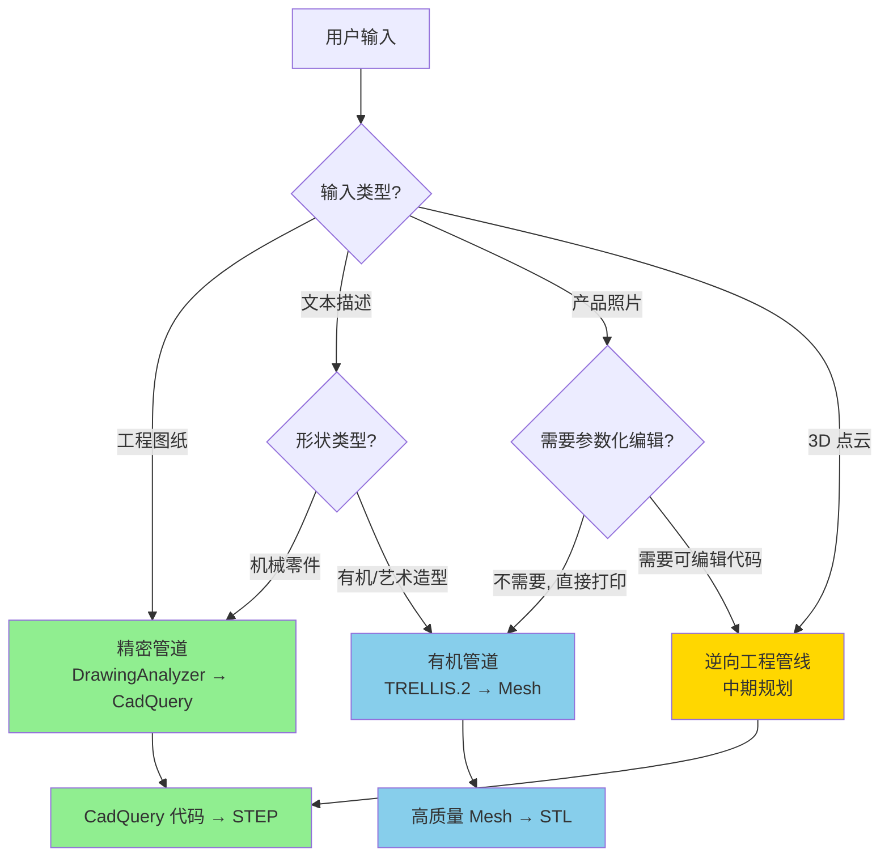
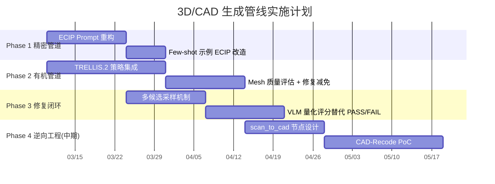
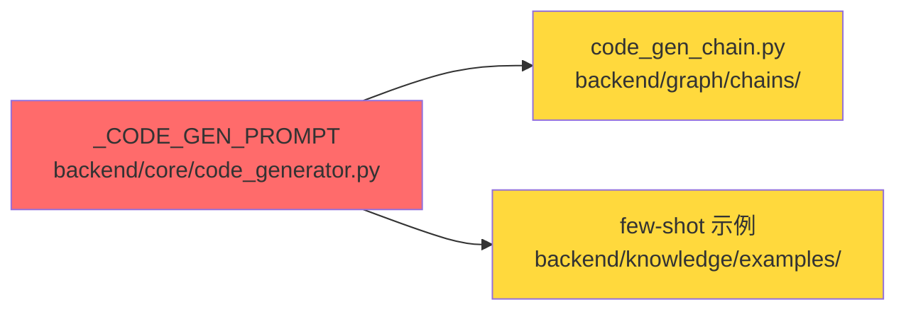
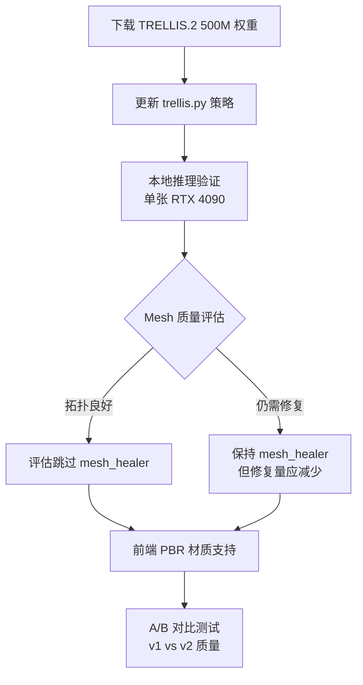
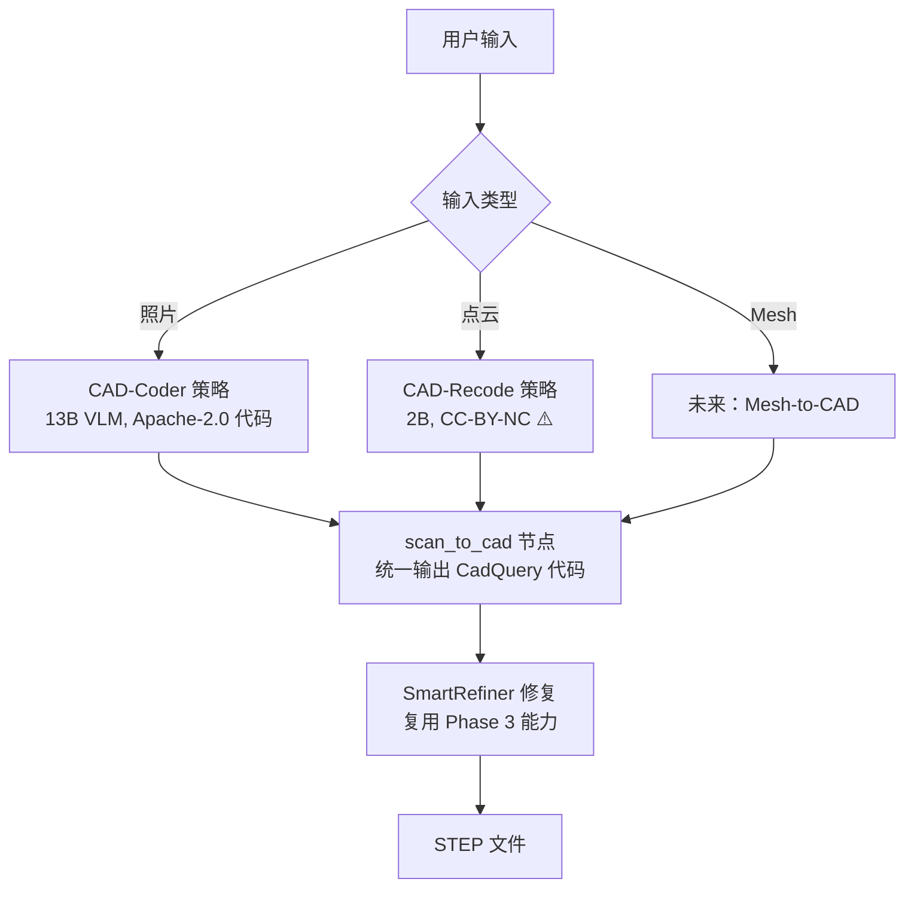
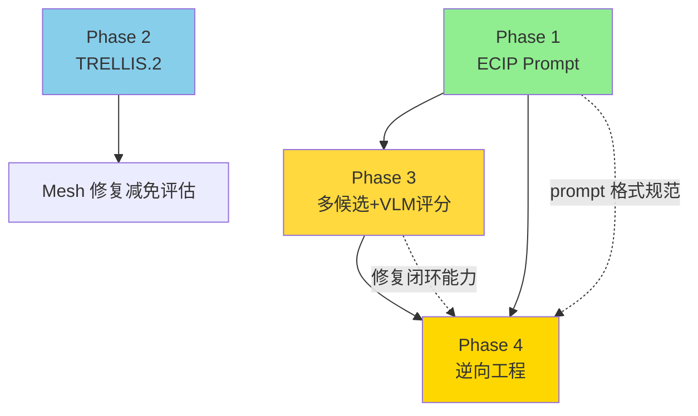

# 3D/CAD 生成管线实施行动计划

> [!abstract] 核心价值
> 基于 [[3d-cad-generation]] 全部 12 个模型的深度分析和技术路线讨论，制定 CADPilot 3D/CAD 生成管线的==分阶段实施行动计划==。本文档是 [[roadmap]] 在生成管线方向的具体落地指引，作为开发流程的启动输入。

> [!warning] Phase 2 已被取代
> 本文 Phase 2（TRELLIS.2 有机管道升级）的初步规划已被 [[action-plan-organic-pipeline]] 完全取代。后者基于 [[image-text-to-3d-generation]] 30+ 模型横向对比，做出了更深入的架构决策（淘汰 Tripo3D/SPAR3D、3 模型并列、Replicate 统一 API、两步法等）。请以该文档为准。

> [!important] 决策背景
> 经过对 CAD-Coder、CAD-Recode、CADDesigner、TRELLIS.2 等技术路线的对比分析，确立以下核心判断：
> 1. **正向工程优先**：先提升现有精密管道 + 有机管道质量，再新增逆向工程能力
> 2. **ECIP 是最高 ROI**：仅改 prompt 模板，预期首次通过率 ==2.7x== 提升
> 3. **有机管道做好后，短期不需要 CAD-Coder**：同样的照片输入，有机管道覆盖面更广且不受 CadQuery 表达限制
> 4. **逆向工程是新能力而非增强**：CAD-Coder / CAD-Recode 归入中期规划

---

## 技术路线决策树



> [!tip] 核心洞察
> CAD-Coder（照片→CadQuery）和 CAD-Recode（点云→CadQuery）本质上都是==逆向工程==——从已有物体还原参数化模型。有机管道也能接受照片输入直接生成 Mesh，且不受 CadQuery 表达能力限制。因此「照片→直接打印」场景优先走有机管道，逆向工程仅在"需要参数化编辑"时才有独特价值。

---

## 实施阶段总览



| Phase | 目标 | 管线 | 预期收益 | 周期 |
|:-----:|------|:----:|---------|:----:|
| **1** | ECIP Prompt 重构 | 精密 | Pass@1 ==2.7x==，重试次数减半 | 2-3 周 |
| **2** | TRELLIS.2 有机管道升级 | 有机 | Mesh 拓扑质量↑，PBR 材质，减轻 mesh_healer | 3-5 周 |
| **3** | 多候选 + VLM 评分 SmartRefiner | 精密 | 修复闭环效率↑，无效 refine 轮次↓ | 3-4 周 |
| **4** | 逆向工程节点（中期） | 新增 | 照片/点云→参数化 CadQuery 代码 | 5-7 周 |

---

## Phase 1：ECIP Prompt 重构（精密管道）

> [!success] 最高 ROI——仅改 prompt 模板，零代码逻辑风险

### 背景与依据

CADDesigner（arXiv:2508.01031）提出 ECIP（Explicit Context Imperative Paradigm），将 CadQuery 的隐式链式调用改为显式状态传递格式，在 200 模型消融实验中：

| 指标 | CadQuery 原生链式 | ECIP 显式状态 | 提升 |
|:-----|:-----------------|:-------------|:----:|
| Pass@1 | 0.17 | ==0.46== | 2.7x |
| 平均重试次数 | 3.95 | ==1.85== | -53% |
| 最终成功率 | 71.5% | ==100%== | +28.5pp |

→ 详见 [[3d-cad-generation#CADDesigner]]

### 改动范围



| 文件 | 改动类型 | 说明 |
|:-----|:--------|:-----|
| `backend/core/code_generator.py` | ==核心改动== | `_CODE_GEN_PROMPT` 模板改为 ECIP 格式 |
| `backend/graph/chains/code_gen_chain.py` | 联动 | 引用同一 prompt，无需额外修改 |
| `backend/knowledge/examples/*.py` | 示例改造 | 所有 few-shot 代码示例改写为 ECIP 风格 |

### ECIP 格式规范

```python
# 现有 prompt 引导 LLM 生成的代码风格（隐式链式）：
result = (
    cq.Workplane("XY")
    .box(10, 10, 5)
    .edges("|Z")
    .fillet(1)
    .faces(">Z")
    .workplane()
    .hole(3)
)

# ECIP 格式（显式状态传递，每步操作明确输入/输出）：
S0 = cq.Workplane("XY")
S1 = S0.box(length=10, width=10, height=5)
S2 = S1.edges("|Z").fillet(radius=1)
S3 = S2.faces(">Z").workplane()
S4 = S3.hole(diameter=3)
result = S4
```

> [!warning] ECIP 的核心价值
> 不是"代码风格偏好"，而是==消除 LLM 的链式调用歧义==。CadQuery 的链式 API 中，每一步的上下文（当前选中的面/边/体）是隐式传递的，LLM 很难正确追踪。ECIP 让每步操作的状态边界清晰，LLM 生成准确率大幅提升。

### 验收标准

- [ ] `_CODE_GEN_PROMPT` 改为 ECIP 格式（显式 `S_k = f(S_{k-1}, params)` 赋值）
- [ ] prompt 中的代码示例全部为 ECIP 风格
- [ ] `backend/knowledge/examples/` 下至少 7 种 PartType 的 few-shot 示例改写
- [ ] 现有 pytest 全量通过（`uv run pytest tests/ -v`）
- [ ] 选 3-5 个典型工程图纸做 A/B 测试，对比旧 prompt vs ECIP prompt 的首次通过率

### 风险评估

| 风险 | 概率 | 影响 | 缓解 |
|:-----|:----:|:----:|:-----|
| ECIP 格式 LLM 不适应 | 低 | 中 | 学术实验已验证有效；可逐步切换 |
| few-shot 示例改写遗漏 | 低 | 低 | 枚举 `EXAMPLES_BY_TYPE` 全量覆盖 |
| 输出代码格式变化影响下游 | 极低 | 低 | CadQuery 执行不关心变量命名风格 |

---

## Phase 2：TRELLIS.2 有机管道升级

> [!info] 提升有机管道核心 Mesh 生成质量，可能减免 mesh_healer 步骤

### 背景与依据

TRELLIS.2 相比 v1 的核心升级：

| 维度 | TRELLIS v1（当前） | TRELLIS.2 |
|:-----|:-------------------|:----------|
| 参数量 | 2B | ==500M==（轻量化 4x） |
| 表征 | Sparse 3D VAE | ==O-Voxel==（方向体素，保留尖锐棱边） |
| PBR 材质 | 无 | ==金属度 + 粗糙度 + 法线贴图== |
| 推理速度 | ~15s | ==~8s==（H100），NIM 加速再 +20% |
| 许可 | MIT | ==MIT== |

→ 详见 [[3d-cad-generation#TRELLIS / TRELLIS.2]]

### 关键洞察：有机管道 vs CAD-Coder

> [!tip] 为什么升级有机管道优先于集成 CAD-Coder
> 对于「照片→3D 打印」场景，两者都能接受照片输入。但：
> - 有机管道**不受 CadQuery 表达限制**，任何形状都能处理
> - TRELLIS.2 O-Voxel 拓扑质量接近专业建模，==可能使 mesh_healer 从"必须"变为"可选"==
> - CAD-Coder 的独特价值（参数化可编辑代码）仅在逆向工程场景有意义
>
> 因此短期内把有机管道做好，覆盖面更广，投入产出比更高。

### 改动范围

| 文件 | 改动类型 | 说明 |
|:-----|:--------|:-----|
| `backend/graph/strategies/generate/trellis.py` | ==核心改动== | 升级 API 调用到 TRELLIS.2 |
| `backend/graph/configs/generate_raw_mesh.py` | 配置更新 | 新增 TRELLIS.2 配置项（O-Voxel 参数、PBR 开关） |
| `backend/graph/nodes/mesh_healer.py` | 评估调整 | 评估 O-Voxel 输出是否可跳过/简化修复 |
| 前端 Three.js Viewer | 联动 | 支持 PBR 材质渲染（MeshStandardMaterial） |

### 实施步骤



### 验收标准

- [ ] TRELLIS.2 策略可正常推理，输出 O-Voxel Mesh + PBR 贴图
- [ ] 在 10 个测试用例上对比 v1 vs v2 的 Mesh 质量（面数、非流形边数、自交数）
- [ ] 评估 O-Voxel 输出是否可跳过 mesh_healer（记录跳过率）
- [ ] PBR 材质在前端 Three.js Viewer 正确渲染
- [ ] fallback_chain 正常工作：TRELLIS.2 失败时降级到其他策略

### 风险评估

| 风险 | 概率 | 影响 | 缓解 |
|:-----|:----:|:----:|:-----|
| TRELLIS.2 本地部署显存不足 | 低 | 中 | 500M 参数仅需 ~4GB 显存；可 fallback 到 API |
| O-Voxel 对有机形状效果不如 v1 | 低 | 中 | 保留 v1 策略，A/B 对比决定默认版本 |
| PBR 贴图格式不兼容 Three.js | 低 | 低 | glTF 标准 PBR，Three.js 原生支持 |

---

## Phase 3：多候选 + VLM 量化评分（SmartRefiner 增强）

> [!info] 从"单次生成 + 二元判断"升级为"多候选采样 + 量化择优"

### 背景与依据

CADFusion（ICML 2025）和 EvoCAD（arXiv:2510.11631）验证了多候选 + VLM 评分的有效性：

- CADFusion：多候选采样 + VLM 0-10 评分 + DPO 偏好优化，VLM Score +16.5%
- EvoCAD：6 候选 × 4 代进化，拓扑正确率从 80.5% 提升至 ==87.2%==

→ 详见 [[3d-cad-generation#CADFusion]]、[[3d-cad-generation#EvoCAD]]

### 当前 SmartRefiner 架构

```
当前（单次 + 二元判断）：
  CodeGenerator → 1 个代码 → 执行 → 渲染
    → SmartRefiner Layer 1（静态校验）
    → SmartRefiner Layer 2（包围盒）
    → SmartRefiner Layer 3（VL 对比）→ PASS / FAIL
      → FAIL → 重新生成（最多 N 轮）
```

### 目标架构

```
升级后（多候选 + 量化择优）：
  CodeGenerator → 3~5 个候选代码 → 并行执行 → 并行渲染
    → SmartRefiner Layer 1/2（快速过滤无效候选）
    → SmartRefiner Layer 3（VLM 0-10 量化评分）
      → 选最高分候选
        → 分数 >= 阈值 → PASS
        → 分数 < 阈值 → 基于最高分候选继续 refine
```

### 改动范围

| 文件 | 改动类型 | 说明 |
|:-----|:--------|:-----|
| `backend/core/smart_refiner.py` | ==核心改动== | Layer 3 从 PASS/FAIL 改为 0-10 评分 |
| `backend/graph/nodes/generation.py` | 核心改动 | 支持多候选生成 + 并行执行 |
| `backend/graph/subgraphs/refiner.py` | 核心改动 | refiner 子图支持多候选输入 |
| `backend/core/vl_feedback.py` | 改动 | `parse_vl_feedback` 输出量化分数 |
| `backend/core/candidate_scorer.py` | 扩展 | 整合 VLM 评分到候选排序 |

### 验收标准

- [ ] CodeGenerator 支持 N 候选生成（N 可配置，默认 3）
- [ ] SmartRefiner Layer 3 输出 0-10 量化分数（含维度：形状准确度、尺寸符合度、特征完整性）
- [ ] 多候选中选最高分候选作为 refine 基础
- [ ] A/B 测试：多候选模式 vs 单候选模式的平均 refine 轮次和最终质量
- [ ] 推理成本可控：N=3 时 LLM 调用量增加 3x，但 refine 轮次应减少 >50%

### 风险评估

| 风险 | 概率 | 影响 | 缓解 |
|:-----|:----:|:----:|:-----|
| 多候选推理成本过高 | 中 | 中 | N 可配置；简单零件 N=1，复杂零件 N=3-5 |
| VLM 量化评分不稳定 | 中 | 低 | 多次评估取平均（参考 EvoCAD 3 次取平均） |
| 并行执行 CadQuery 资源竞争 | 低 | 低 | CadQuery 是 CPU-bound，可线程池并行 |

---

## Phase 4：逆向工程节点（中期规划）

> [!warning] 中期新增能力——依赖 Phase 1-3 完成后的管线成熟度

### 定位

逆向工程（照片/点云→参数化 CadQuery 代码）是==新增能力==，不是现有管线增强。仅在以下场景有独特价值：
- 用户有实物零件照片/3D 扫描数据
- 用户需要==可编辑的参数化模型==（不只是打印）
- 有机管道无法满足（需要精确尺寸控制）

### 统一节点设计



### 候选技术

| 策略 | 模型 | 输入 | 许可 | 成熟度 | 备注 |
|:-----|:-----|:-----|:-----|:------:|:-----|
| `cad-coder` | CAD-Coder 13B | 照片 | 代码 Apache-2.0，==模型许可待确认== | ★★★ | 100% VSR，HF 有权重 |
| `cad-recode` | CAD-Recode 2B | 点云 | ==CC-BY-NC==（非商用） | ★★★ | ICCV 2025，CD 改善 10x |

→ 详见 [[reverse-engineering-scan-to-cad]]、[[3d-cad-generation#CAD-Recode]]、[[3d-cad-generation#CAD-Coder]]

### 前置依赖

| 依赖 | 来源 | 原因 |
|:-----|:-----|:-----|
| ECIP prompt 格式 | Phase 1 | 逆向生成的代码也应遵循 ECIP 格式 |
| SmartRefiner 多候选 + 量化评分 | Phase 3 | 逆向生成质量不稳定，依赖修复闭环兜底 |
| routing_node 扩展 | 现有 | 需新增第三条路径分流 |

### 许可风险

> [!danger] 商用许可需提前确认
> - **CAD-Coder**：代码 Apache-2.0，但 HuggingFace 模型权重==无 model card、许可未标注==
> - **CAD-Recode**：CC-BY-NC 4.0，==明确禁止商业使用==
> - **缓解**：CAD-Recode 的训练方法论（100 万程序化数据生成 + Qwen2 微调）可自行复现

### 验收标准

- [ ] `scan_to_cad` 节点注册到 registry，支持策略切换
- [ ] CAD-Coder 策略：照片输入→CadQuery 代码→STEP 全链路跑通
- [ ] 10 个机械零件照片 A/B 测试：逆向管线 vs 有机管道（比较可编辑性和几何精度）
- [ ] routing_node 正确分流到第三条路径

---

## 全局依赖关系



> [!tip] Phase 1 和 Phase 2 可并行启动
> - Phase 1（精密管道 prompt）和 Phase 2（有机管道 TRELLIS.2）改动范围完全不重叠
> - Phase 3 依赖 Phase 1（ECIP 格式确定后再做多候选）
> - Phase 4 依赖 Phase 1 + Phase 3

---

## 数据资产清单

以下数据集可在各 Phase 中复用：

| 数据集 | 规模 | 许可 | 用途 | Phase |
|:-------|:-----|:-----|:-----|:-----:|
| [[huggingface-datasets#ThomasTheMaker/cadquery\|ThomasTheMaker/cadquery]] | 147K | 待确认 | ECIP 示例挖掘 + 知识库扩充 | 1, 3 |
| [GenCAD-Code](https://huggingface.co/datasets/CADCODER/GenCAD-Code) | 163K | 待确认 | CAD-Coder 评估 + 代码质量基准 | 4 |
| [CAD-Recode v1.5](https://huggingface.co/filapro/cad-recode) | 100 万 | CC-BY-NC | 逆向工程训练/评估 | 4 |
| [[huggingface-datasets#Text2CAD\|Text2CAD]] | 605GB | CC-BY-NC-SA | 大规模 CAD 训练（非商用） | 长期 |
| [[huggingface-datasets#Omni-CAD\|Omni-CAD]] | 450K | MIT | 多模态 CAD 训练 | 长期 |

---

## 与 Roadmap 的映射

本计划对应 [[roadmap]] 中以下行动项的具体落地：

| 本文 Phase | Roadmap 编号 | Roadmap 行动 |
|:----------:|:----------:|:-------------|
| Phase 1 | S3 | CADDesigner ECIP 参考 |
| Phase 1 | S1 | CadQuery 数据集评估（数据辅助） |
| Phase 2 | M4 | TRELLIS.2 集成评估 |
| Phase 2 | S2 | MeshAnythingV2 集成（mesh 后处理关联） |
| Phase 3 | S3 | CADFusion VLM 反馈机制参考 |
| Phase 4 | M8 | CAD-Recode Scan-to-CAD PoC |

---

## 决策记录

| 日期 | 决策 | 理由 |
|:-----|:-----|:-----|
| 2026-03-04 | ==CAD-Coder 降为中期优先级== | 有机管道同样接受照片输入且覆盖面更广；CAD-Coder 独特价值仅限逆向工程场景 |
| 2026-03-04 | ==ECIP prompt 重构定为最高优先级== | 零代码风险 + 2.7x 首次通过率提升，投入产出比最高 |
| 2026-03-04 | ==有机管道升级优先于逆向工程== | 正向工程是当前核心场景，先提升现有能力再扩展新能力 |
| 2026-03-04 | CAD-Coder 和 CAD-Recode 归入统一 `scan_to_cad` 节点 | 两者本质相同（逆向工程），仅输入模态不同 |

---

## 参考文献

1. CADDesigner: Conceptual Design Based on General-Purpose Agent. arXiv:2508.01031, 2025.
2. CADFusion: VLM Feedback for Text-to-CAD. ICML 2025. Microsoft.
3. EvoCAD: Evolutionary CAD Code Generation. arXiv:2510.11631, 2025.
4. TRELLIS.2: Versatile 3D Generation with O-Voxel. Microsoft Research, 2025.12.
5. CAD-Coder: Open-Source VLM for CAD Code Generation. arXiv:2505.14646, 2025.
6. CAD-Recode: Reverse Engineering CAD Code from Point Clouds. ICCV 2025.
7. LLMs for CAD: A Survey. arXiv:2505.08137, 2025.

---

## 更新日志

| 日期 | 变更 |
|:-----|:-----|
| 2026-03-04 | 初始版本：基于技术路线讨论创建 4 阶段实施行动计划 |
