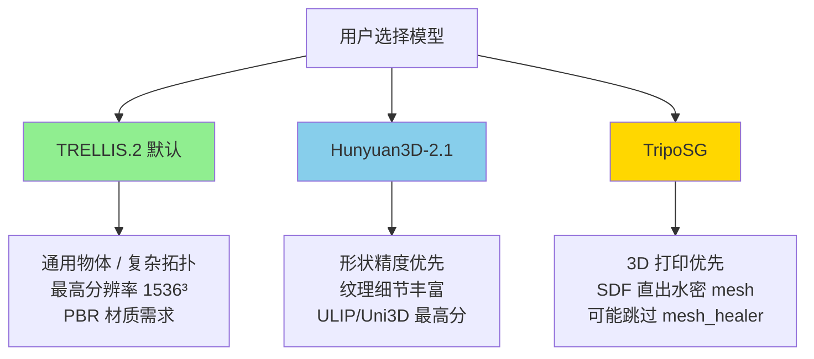
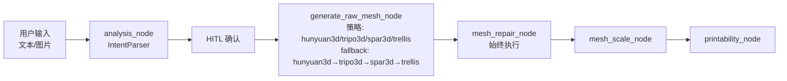
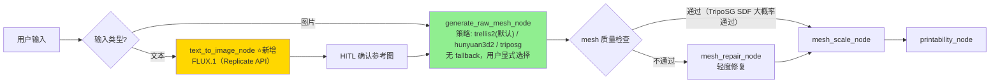
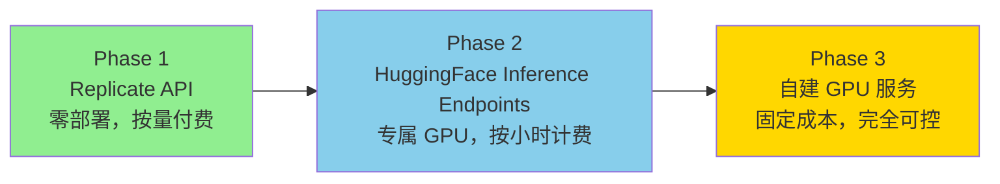
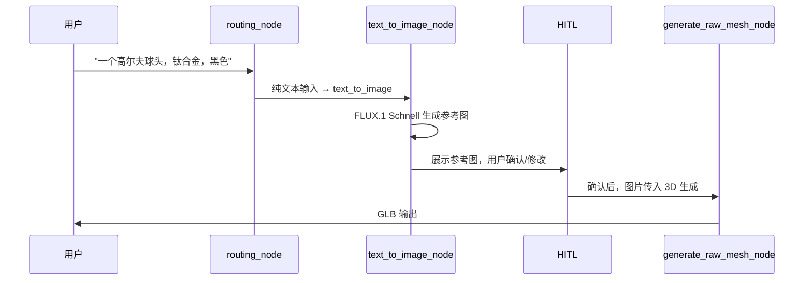
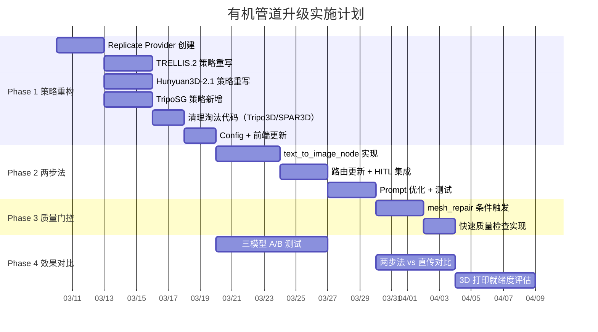
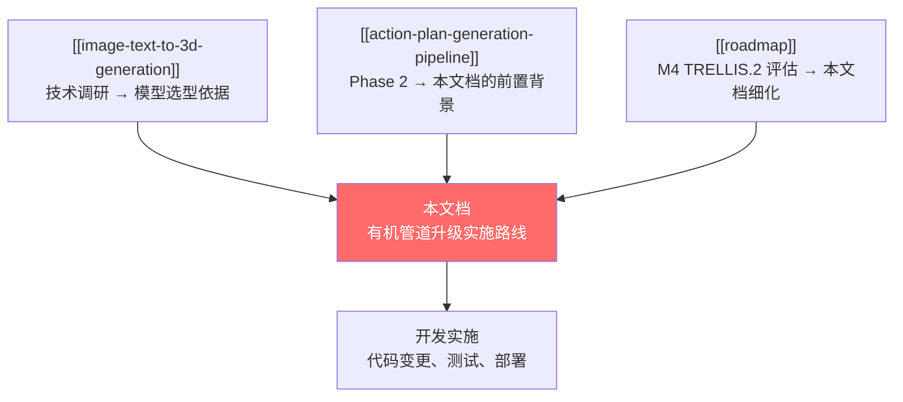

# 有机管道升级实施路线图

> [!abstract] 核心价值
> 基于 [[image-text-to-3d-generation]] 30+ 模型的横向对比和技术路线成功率排名，制定 CADPilot ==有机管道==从当前 Tripo3D 方案到新一代 ==TRELLIS.2 + Hunyuan3D-2.1 + TripoSG 三模型架构==的具体实施路线。本文档是开发阶段的直接输入。

> [!important] 关键决策
> 1. **放弃 Tripo3D**：上一代技术（TripoSR ~0.3B），几何/纹理质量落后，黑盒 SaaS 不可控
> 2. **三模型并列，用户显式选择**：TRELLIS.2（默认）、Hunyuan3D-2.1、TripoSG——各有擅长场景
> 3. **去掉自动 fallback**：此节点为管道首节点，决定后续全部质量上限；自动降级产出不可预测结果，不如报错让用户切换
> 4. **两步法（Text→Image→3D）是纯文本场景最优路径**：新增 `text_to_image_node`
> 5. **API 优先，自部署后置**：短期 Replicate API 快速验证，中期按需自建 GPU 推理

---

## 一、决策依据

### 1.1 模型横向对比

> [!tip] 来源
> 全部数据来自 [[image-text-to-3d-generation#第五部分：技术路线成功率排名 ⭐]]

| 维度 | Tripo3D（淘汰） | ==TRELLIS.2==（默认） | Hunyuan3D-2.1 | TripoSG |
|:-----|:---------------|:---------------------|:--------------|:--------|
| **模型参数** | ~0.3B（TripoSR） | 4B | 未公开（大） | ~1B |
| **技术路线** | 前馈 LRM | O-Voxel SLAT | Shape+Texture 双阶段 | ==SDF 直出== |
| **最大分辨率** | 中 | ==1536³== | 中高 | 中高 |
| **几何质量** | ★★★ | ==★★★★★== | ==★★★★★== | ★★★★ |
| **纹理质量** | ★★★ | ★★★★☆ | ==★★★★★== | ★★★★ |
| **PBR 材质** | 无 | ==有== | ==有== | 有 |
| **3D 打印就绪** | 中（需重度修复） | ==高==（轻度修复） | ==高==（轻度修复） | ==高==（SDF 天然水密） |
| **推理速度** | ~10-30s | ~60s（H100） | ~10s | ~10s |
| **许可证** | 商用需付费 | ==MIT== | 腾讯社区许可 | ==MIT== |
| **集成成功率** | 未评级 | ==95%== | ==93%== | ==90%== |

### 1.2 三模型各自擅长场景



> [!warning] 去掉 fallback 的理由
> `generate_raw_mesh` 是有机管道的**首节点**，其输出质量决定后续 `mesh_healer`、`mesh_scale`、`printability` 所有节点的效果上限。自动 fallback 意味着用户期望 TRELLIS.2 的效果，却静默拿到了 Hunyuan3D 完全不同风格的结果——这对设计类工具是不可接受的。
>
> **正确做法**：API 不可用时报错，提示用户切换模型。

### 1.3 放弃 Tripo3D 的理由

| 理由 | 说明 |
|:-----|:-----|
| **底层模型落后** | 对应 TripoSR（0.3B），三项替代方案均为 1B-4B 新一代模型 |
| **黑盒 SaaS** | `api.tripo3d.ai` 底层模型版本不透明，质量无法对齐基准 |
| **许可不友好** | 商用收费，而 TRELLIS.2/TripoSG 均为 MIT 许可 |
| **无增量价值** | 三个新模型覆盖了 Tripo3D 的全部场景且质量更优 |

> [!note] 代码清理
> 淘汰 Tripo3D 后需清理的文件：
> - `backend/graph/strategies/generate/tripo3d.py`
> - `backend/infra/mesh_providers/tripo.py`
> - `backend/config.py` 中 `tripo3d_api_key` 配置
> - `backend/graph/nodes/generate_raw_mesh.py` 中的 strategy 注册和 fallback_chain
> - SPAR3D 一并移除（研究排名不在 Tier 1，且为 local-only 无 API）

---

## 二、架构变更

### 2.1 当前架构



**问题**：
- Tripo3D 是唯一有完整 SaaS Provider 的策略，其他三个都需要本地 GPU
- 自动 fallback 链导致不可预测的输出
- 缺少 `text_to_image` 环节，纯文本输入直接传给 3D 模型效果差
- `mesh_repair_node` 始终执行，即使上游 mesh 质量已足够好

### 2.2 目标架构



### 2.3 代码变更总览

| 变更类型 | 文件 | 说明 |
|:---------|:-----|:-----|
| ==新增== | `backend/graph/nodes/text_to_image.py` | FLUX.1 Text→Image 节点 |
| ==新增== | `backend/infra/mesh_providers/replicate.py` | Replicate 通用 API Provider |
| ==重写== | `backend/graph/strategies/generate/trellis.py` | 从 local-only → Replicate SaaS |
| ==重写== | `backend/graph/strategies/generate/hunyuan3d.py` | 适配 Replicate API |
| ==新增== | `backend/graph/strategies/generate/triposg.py` | TripoSG 新策略 |
| 修改 | `backend/graph/configs/generate_raw_mesh.py` | 配置模型更新、移除旧项 |
| 修改 | `backend/graph/nodes/generate_raw_mesh.py` | 移除 fallback，更新策略注册 |
| ==删除== | `backend/graph/strategies/generate/tripo3d.py` | 淘汰 |
| ==删除== | `backend/graph/strategies/generate/spar3d.py` | 淘汰 |
| ==删除== | `backend/infra/mesh_providers/tripo.py` | 淘汰 |
| 修改 | `backend/config.py` | 新增 `replicate_api_token`，移除 `tripo3d_api_key` |
| 修改 | `backend/graph/routing.py` | 新增文本→`text_to_image_node` 路由 |

---

## 三、API Provider 策略

### 3.1 Replicate 统一 Provider

> [!tip] 设计原则
> 三个 3D 模型 + FLUX.1 全部通过 ==Replicate API== 统一调用，一个 API Token 搞定全部。

| 模型 | Replicate Model ID | 单次成本 | 输出格式 |
|:-----|:-------------------|:---------|:---------|
| **FLUX.1 Schnell** | `black-forest-labs/flux-schnell` | ~$0.003 | WebP/PNG |
| **TRELLIS** | `firtoz/trellis` | ~$0.05 | GLB + MP4 |
| **Hunyuan3D** | 待确认（搜索 Replicate） | ~$0.05-0.10 | GLB |
| **TripoSG** | 待确认（搜索 Replicate） | ~$0.05-0.10 | GLB |

```python
# backend/infra/mesh_providers/replicate.py 核心设计
class ReplicateProvider:
    """统一 Replicate API Provider，支持多模型调用。"""

    def __init__(self, api_token: str):
        self._client = replicate.Client(api_token=api_token)

    async def generate_image(self, prompt: str, model: str = "flux-schnell") -> bytes:
        """Text → Image (FLUX.1)"""
        ...

    async def generate_3d(self, image: bytes, model: str = "trellis") -> Path:
        """Image → 3D (TRELLIS.2 / Hunyuan3D / TripoSG)"""
        ...
```

### 3.2 部署路径演进



| 阶段 | 适用场景 | 成本模型 | 延迟 |
|:-----|:---------|:---------|:-----|
| **Phase 1**（当前） | 测试 + 低频使用（<100 次/天） | 按次付费 ~$0.05/次 | ~30-120s |
| **Phase 2** | 中频使用（100-1000 次/天） | GPU 按小时 ~$1-4/h | ~10-60s |
| **Phase 3** | 高频/生产环境 | 固定 GPU（A100/H100） | ~3-10s |

> [!note] 环境变量
> ```bash
> # .env
> REPLICATE_API_TOKEN=r8_xxxxxxxx  # Phase 1 唯一需要的配置
> ```

---

## 四、实施阶段

### Phase 1：Replicate Provider + 策略重构（1-2 周）

> [!success] 目标：跑通 Replicate API 调用全链路，验证三模型实际效果

#### 1.1 新建 Replicate Provider

| 任务 | 文件 | 说明 |
|:-----|:-----|:-----|
| 创建 `ReplicateProvider` | `backend/infra/mesh_providers/replicate.py` | 统一封装 `replicate` Python SDK |
| 配置管理 | `backend/config.py` | 新增 `replicate_api_token` |
| 依赖安装 | `pyproject.toml` | `uv add replicate` |

#### 1.2 重写三个生成策略

**TRELLIS.2 策略**（从 local-only → Replicate SaaS）：

```python
# backend/graph/strategies/generate/trellis.py（目标状态）
class TRELLISGenerateStrategy(NodeStrategy):
    """TRELLIS.2 via Replicate API. Default strategy."""

    def check_available(self) -> bool:
        return bool(getattr(self.config, "replicate_api_token", None))

    async def execute(self, ctx: Any) -> None:
        provider = ReplicateProvider(self.config.replicate_api_token)
        image_bytes = ctx.get_data("reference_image")
        result_path = await provider.generate_3d(
            image=image_bytes,
            model="firtoz/trellis",
            output_format="glb",
        )
        ctx.put_asset("raw_mesh", str(result_path), "glb")
```

**Hunyuan3D-2.1 策略**和 **TripoSG 策略**结构类似，仅 `model` 参数不同。

#### 1.3 更新 `generate_raw_mesh_node`

```python
# backend/graph/nodes/generate_raw_mesh.py（目标状态）
@register_node(
    name="generate_raw_mesh",
    display_name="网格生成",
    requires=["confirmed_params"],
    produces=["raw_mesh"],
    input_types=["organic"],
    config_model=GenerateRawMeshConfig,
    strategies={
        "trellis2": TRELLISGenerateStrategy,      # 默认
        "hunyuan3d2": Hunyuan3DGenerateStrategy,   # 形状精度
        "triposg": TripoSGGenerateStrategy,        # 3D 打印优先
    },
    default_strategy="trellis2",
    # 无 fallback_chain
    description="3D 生成：TRELLIS.2（默认）/ Hunyuan3D-2.1 / TripoSG，用户显式选择",
)
async def generate_raw_mesh_node(ctx: NodeContext) -> None:
    strategy = ctx.get_strategy()  # 用户选择或默认 trellis2
    await strategy.execute(ctx)
```

#### 1.4 清理淘汰代码

- [ ] 删除 `backend/graph/strategies/generate/tripo3d.py`
- [ ] 删除 `backend/graph/strategies/generate/spar3d.py`
- [ ] 删除 `backend/infra/mesh_providers/tripo.py`
- [ ] 清理 `backend/config.py` 中 `tripo3d_api_key`、`organic_default_provider`
- [ ] 更新 `tests/test_generate_raw_mesh.py`、`tests/test_mesh_providers.py`

#### 验收标准

- [ ] `uv run pytest tests/ -v` 全量通过
- [ ] TRELLIS.2 策略：图片输入 → GLB 输出 → 文件可用 Three.js 打开
- [ ] Hunyuan3D-2.1 策略：同上
- [ ] TripoSG 策略：同上
- [ ] 无 API Token 时 `check_available()` 返回 False，节点报错而非静默 fallback
- [ ] 前端策略选择器（`QualitySelector.tsx`）更新选项

---

### Phase 2：text_to_image_node 两步法（1-2 周）

> [!info] 目标：纯文本输入时先生成高质量参考图，再走 Image→3D

#### 2.1 节点设计



#### 2.2 代码设计

| 文件 | 说明 |
|:-----|:-----|
| `backend/graph/nodes/text_to_image.py` | 新节点：调用 FLUX.1 生成参考图 |
| `backend/graph/routing.py` | 路由更新：文本输入 → `text_to_image_node` → `generate_raw_mesh` |
| `backend/graph/state.py` | State 扩展：新增 `reference_image_url`、`reference_image_confirmed` 字段 |

```python
# backend/graph/nodes/text_to_image.py（核心逻辑）
@register_node(
    name="text_to_image",
    display_name="文本→参考图",
    requires=["confirmed_params"],
    produces=["reference_image"],
    input_types=["organic"],
)
async def text_to_image_node(ctx: NodeContext) -> None:
    """纯文本输入时，用 FLUX.1 生成 Image→3D 的参考图。"""
    prompt_en = ctx.get_data("prompt_en")
    provider = ReplicateProvider(ctx.config.replicate_api_token)

    image_bytes = await provider.generate_image(
        prompt=_build_3d_optimized_prompt(prompt_en),
        model="black-forest-labs/flux-schnell",
    )

    # 存储参考图供 HITL 确认
    ctx.put_asset("reference_image", image_bytes, "png")
    await ctx.dispatch_progress(1, 1, "参考图生成完成")
```

#### 2.3 Prompt 优化

> [!tip] 关键细节
> 用户的自然语言描述需要转化为适合 3D 重建的参考图 prompt——需要==白色背景、正视角、产品摄影风格==。

```python
def _build_3d_optimized_prompt(user_prompt: str) -> str:
    """将用户描述转化为适合 Image→3D 重建的 FLUX.1 prompt。"""
    return (
        f"{user_prompt}, "
        "product photography, studio lighting, "
        "clean white background, front view, "
        "high detail, 8k, professional 3D reference"
    )
```

#### 2.4 路由更新

```python
# routing_node 逻辑变更
if input_type == "organic":
    if has_image:
        next_node = "generate_raw_mesh"     # 图片直接走 3D 生成
    else:
        next_node = "text_to_image"         # 纯文本先生成参考图
```

#### 验收标准

- [ ] 纯文本输入 → FLUX.1 生成参考图 → 展示给用户确认
- [ ] 用户确认参考图后 → 自动进入 `generate_raw_mesh_node`
- [ ] 图片输入 → 跳过 `text_to_image_node`，直接进入 `generate_raw_mesh_node`
- [ ] HITL 中断点正常工作（用户可重新生成参考图）

---

### Phase 3：mesh_repair 条件触发 + 质量评估（1 周）

> [!info] 目标：根据 3D 模型来源决定是否需要 mesh 修复

#### 3.1 设计

不同模型生成的 mesh 质量差异大：

| 模型 | 预期 mesh 质量 | mesh_healer 需求 |
|:-----|:-------------|:----------------|
| TRELLIS.2 | O-Voxel 输出，拓扑较好 | 轻度（法线修正、小孔填补） |
| Hunyuan3D-2.1 | 高质量但偶有自交 | 轻度 |
| TripoSG | ==SDF 直出水密 mesh== | ==可能完全跳过== |

#### 3.2 质量门控

```python
# mesh_healer_node 前置检查
def _should_skip_repair(mesh_path: str, source_strategy: str) -> bool:
    """基于上游策略 + 快速几何检查决定是否跳过修复。"""
    if source_strategy == "triposg":
        # TripoSG SDF 直出，大概率水密
        metrics = quick_mesh_check(mesh_path)
        if metrics.is_watertight and metrics.non_manifold_edges == 0:
            return True
    return False
```

#### 验收标准

- [ ] TripoSG 输出的水密 mesh 能跳过 `mesh_healer`（减少延迟）
- [ ] TRELLIS.2/Hunyuan3D 输出仍经过轻度修复
- [ ] 跳过/执行的决策记录到 `_reasoning` 字段

---

### Phase 4：效果对比与参数调优（持续）

> [!warning] 必须在 Phase 1 完成后 API 可用时执行

#### 4.1 测试用例矩阵

| 类别 | 测试输入 | 评估维度 |
|:-----|:---------|:---------|
| 工业零件 | 高尔夫球头、齿轮、法兰盘 | 几何精度、壁厚、表面光滑度 |
| 有机造型 | 花瓶、雕塑、手办 | 拓扑正确性、纹理细节 |
| 3D 打印验证 | 上述全部 | 水密性、非流形边数、最小壁厚 |
| 两步法 vs 直传 | 纯文本 "齿轮" | 比较 FLUX→3D vs 直接文本→3D |

#### 4.2 量化指标

| 指标 | 工具 | 阈值 |
|:-----|:-----|:-----|
| 水密性 | trimesh `is_watertight` | 100% |
| 非流形边 | trimesh `non_manifold_edges` | 0 |
| 面数 | trimesh `faces.shape[0]` | <100K |
| 最小壁厚 | PySLM 分析 | ≥0.8mm |
| 生成延迟 | time.monotonic() | <120s（含 API 网络） |

---

## 五、配置模型更新

### 5.1 目标 Config

```python
# backend/graph/configs/generate_raw_mesh.py（目标状态）
class GenerateRawMeshConfig(BaseNodeConfig):
    """generate_raw_mesh 节点配置。

    支持 3 个模型策略，全部通过 Replicate API 调用。
    """
    strategy: str = "trellis2"  # trellis2 | hunyuan3d2 | triposg

    # Replicate API（统一 Token）
    replicate_api_token: str | None = Field(
        default=None, json_schema_extra={"x-sensitive": True},
    )

    # 未来本地部署 endpoint（Phase 2/3 启用）
    trellis_endpoint: str | None = None
    hunyuan3d_endpoint: str | None = None
    triposg_endpoint: str | None = None

    # Common
    timeout: int = 120
    output_format: str = "glb"
```

### 5.2 全局配置

```python
# backend/config.py（变更）
class Settings(BaseSettings):
    # Organic engine
    organic_enabled: bool = True
    replicate_api_token: str | None = None        # 新增
    organic_default_strategy: str = "trellis2"     # 替换 organic_default_provider
    # 删除：tripo3d_api_key, hunyuan3d_api_key, organic_default_provider
```

### 5.3 前端策略选择器

`frontend/src/pages/OrganicGenerate/QualitySelector.tsx` 更新选项：

| 选项 | 标签 | 描述 |
|:-----|:-----|:-----|
| `trellis2` | TRELLIS.2（推荐） | 综合最优，1536³ 高分辨率，PBR 材质 |
| `hunyuan3d2` | Hunyuan3D-2.1 | 形状精度最高，纹理细节丰富 |
| `triposg` | TripoSG | 3D 打印首选，SDF 直出水密 mesh |

---

## 六、Gantt 图



---

## 七、风险评估

| 风险 | 概率 | 影响 | 缓解措施 |
|:-----|:----:|:----:|:---------|
| Replicate 上 Hunyuan3D/TripoSG 模型不可用 | 中 | 中 | 提前确认 Replicate Model ID；备选 fal.ai |
| Replicate API 延迟过高（>120s） | 低 | 中 | timeout 可配置；Phase 2 迁移到专属 GPU |
| FLUX.1 生成的参考图风格不适合 3D 重建 | 中 | 低 | Prompt 优化（白背景+正视角）；HITL 让用户确认 |
| 三模型实际效果不如论文宣称 | 低 | 高 | Phase 4 严格量化对比，保留回退到 Replicate 上其他模型的灵活性 |
| 删除 Tripo3D 后遗留引用 | 低 | 低 | grep 全局搜索 `tripo` 确保清理干净 |

---

## 八、与现有文档关系



| 文档 | 关系 |
|:-----|:-----|
| [[image-text-to-3d-generation]] | 技术输入——模型评估数据、成功率排名、3D 打印就绪度 |
| [[action-plan-generation-pipeline]] | 同级计划——Phase 2（TRELLIS.2 有机管道升级）在本文中完全展开 |
| [[roadmap]] | 全局路线图——本文档对应 M4 行动项的详细实施 |
| [[practical-tools-frameworks]] | 工具参考——Replicate SDK、trimesh 质量检查 |
| [[mesh-processing-repair]] | 下游影响——mesh_repair 条件触发策略 |

---

## 九、决策记录

| 日期 | 决策 | 理由 |
|:-----|:-----|:-----|
| 2026-03-04 | ==放弃 Tripo3D== | 上一代技术（TripoSR），三个替代方案全面超越 |
| 2026-03-04 | ==放弃 SPAR3D== | 研究排名不在 Tier 1，local-only 无 API，移除减少维护负担 |
| 2026-03-04 | ==去掉自动 fallback== | 首节点质量决定管道上限，自动降级产出不可预测结果 |
| 2026-03-04 | ==TRELLIS.2 为默认策略== | 综合成功率最高（95%），MIT 许可，最高分辨率 |
| 2026-03-04 | ==用户显式选择模型== | 三模型各有擅长场景，由用户按需选择而非系统猜测 |
| 2026-03-04 | ==Replicate API 优先== | 零部署成本，单 Token 覆盖全部模型，快速验证 |
| 2026-03-04 | ==两步法用于纯文本场景== | FLUX→TRELLIS.2 成功率 95%，远优于直接 Text→3D |

---

## 参考文献

1. Microsoft TRELLIS.2: [GitHub](https://github.com/microsoft/TRELLIS.2) | MIT License
2. Tencent Hunyuan3D-2.1: [GitHub](https://github.com/Tencent-Hunyuan/Hunyuan3D-2)
3. VAST AI TripoSG: [GitHub](https://github.com/VAST-AI-Research/TripoSG) | MIT License
4. Black Forest Labs FLUX.1: [Replicate](https://replicate.com/black-forest-labs/flux-schnell)
5. Replicate Python SDK: [Docs](https://replicate.com/docs/get-started/python)
6. firtoz/trellis on Replicate: [Model](https://replicate.com/firtoz/trellis)

---

## 更新日志

| 日期 | 变更 |
|:-----|:-----|
| 2026-03-04 | 初始版本：基于技术路线决策和代码分析，制定 4 阶段有机管道升级实施路线图 |
