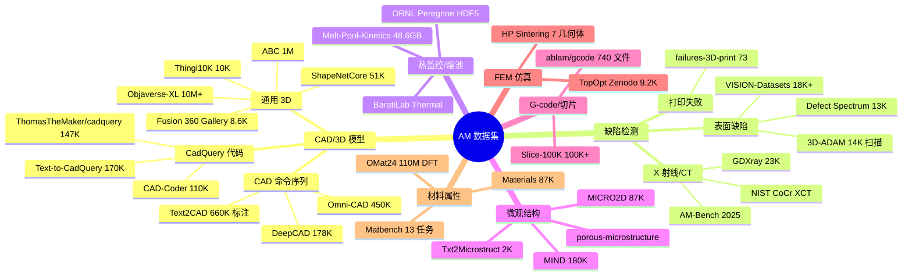

# AM 数据集全景目录

> [!abstract] 定位
> 本文档是 CADPilot 项目 7 个 AI 研究方向的**统一数据集参考手册**。从 [[3d-cad-generation]]、[[mesh-processing-repair]]、[[defect-detection-monitoring]]、[[surrogate-models-simulation]]、[[gnn-topology-optimization]]、[[reinforcement-learning-am]]、[[generative-microstructure]] 以及 [[huggingface-datasets]] 中提取并整合所有已记录数据集，同时通过 Web 搜索补充 2024-2026 年最新公开数据集。每个条目包含规模、许可证、下载方式、与 CADPilot 管线节点的关联及数据质量评估。

---

## 数据集总览

> [!info] 统计摘要
> - 共收录 ==35 个== 主要数据集，覆盖 7 个研究方向
> - HuggingFace Hub 上可直接 `load_dataset()` 获取的：==12 个==
> - 商业友好许可（MIT/Apache 2.0/CC-BY 4.0/ODC-By）：==16 个==
> - 总数据体量估计：>==60 TB==（含 Objaverse-XL 原始资源）

---

## CAD/3D 模型数据集

本分类覆盖参数化 CAD 代码、CAD 命令序列和通用 3D 模型三个子方向，对应 CADPilot 管线的 `generate_cadquery` 和 `generate_raw_mesh` 节点。

### ThomasTheMaker/cadquery

> [!success] ==唯一直接可用的 CadQuery 代码数据集==

| 属性 | 详情 |
|:-----|:-----|
| **发布机构** | 社区（CADCODER/GenCAD-Code 子集） |
| **规模** | ==147,289== 条（图像 + CadQuery Python 代码） |
| **大小** | ~670MB 磁盘 / 896MB 内存（Parquet） |
| **许可证** | 未明确标注（源自 GenCAD） |
| **下载** | [HuggingFace](https://huggingface.co/datasets/ThomasTheMaker/cadquery) |
| **用途** | CadQuery 代码生成微调 |
| **管线关联** | `generate_cadquery` |

> [!warning] 数据质量评估
> - ==仅覆盖约 12 个 CadQuery API 函数==（lineTo/moveTo/extrude/circle/union/cut 等）
> - ==无 revolve、sweep、loft、fillet、chamfer、shell==
> - 尺寸归一化至 0-1.5 范围，非工程实际尺寸
> - user 字段无自然语言描述，全为相同指令模板
> - CADPilot 回转体(ROTATIONAL)、齿轮(GEAR)等核心零件类型==无法从此数据集获得训练数据==

详见 [[huggingface-datasets#ThomasTheMaker/cadquery]]

---

### CAD-Coder 110K 三元组

| 属性 | 详情 |
|:-----|:-----|
| **发布机构** | NeurIPS 2025 |
| **规模** | ==110,000== text-CadQuery-3D 三元组 + 1,500 CoT 样本 |
| **许可证** | ==待确认==（论文未明确） |
| **论文** | [arXiv:2505.19713](https://arxiv.org/abs/2505.19713) |
| **下载** | 需查阅论文补充材料或联系作者 |
| **用途** | SFT + GRPO 训练 text-to-CadQuery 模型 |
| **管线关联** | `generate_cadquery` |

> [!tip] 数据质量评估
> - 自动化 pipeline 构建，包含 CadQuery 代码可执行性验证
> - 含 Chain-of-Thought 推理样本（1.5K），分解复杂形状的思维链
> - 几何奖励（Chamfer Distance）确保 3D 模型与文本语义对齐
> - ==与 CADPilot 技术栈高度兼容==——直接生成 CadQuery 代码

详见 [[3d-cad-generation#CAD-Coder]]

---

### Text-to-CadQuery 170K

| 属性 | 详情 |
|:-----|:-----|
| **发布机构** | ricemonster（社区） |
| **规模** | ~==170,000== text-CadQuery 配对 |
| **许可证** | ==未明确标注== |
| **下载** | [HuggingFace ricemonster/NeurIPS11092](https://huggingface.co/ricemonster/NeurIPS11092) |
| **用途** | CadQuery 代码生成微调 |
| **管线关联** | `generate_cadquery` |

> [!warning] 数据质量评估
> - 源自 DeepCAD（仅 sketch-extrude），==不包含 revolve/loft/sweep==
> - 由 Gemini 2.0 Flash 转换 JSON→CadQuery，初始成功率 53%，自校正后 85%
> - Token 统计：平均 501.2 tokens，94% 在 1024 tokens 以内
> - 数据风格非标准（`wp.add(loop).extrude()` 模式）

详见 [[3d-cad-generation#Text-to-CadQuery]]

---

### DeepCAD

| 属性 | 详情 |
|:-----|:-----|
| **发布机构** | Columbia University (ICCV 2021) |
| **规模** | ==178,238== CAD 模型（JSON 格式命令序列） |
| **许可证** | MIT |
| **下载** | [GitHub](https://github.com/ChrisWu1997/DeepCAD) / [Kaggle](https://www.kaggle.com/datasets/vitalygladyshev/deepcad) |
| **用途** | CAD 命令序列生成、CAD 补全 |
| **管线关联** | `generate_cadquery`（需格式转换） |

> [!info] 数据质量评估
> - 是 Text2CAD、Text-to-CadQuery 等多个下游数据集的==基础数据源==
> - 仅包含 sketch+extrude 操作（Line/Arc/Circle + Extrude）
> - 模型来自 Onshape 平台，覆盖多样化机械零件
> - JSON 格式需要转换才能用于 CadQuery 训练

---

### Text2CAD (SadilKhan)

| 属性 | 详情 |
|:-----|:-----|
| **发布机构** | NeurIPS 2024 Spotlight |
| **规模** | 170K 模型 + ==660K 多级文本标注==（==605 GB== 总量，核心 JSON ==246MB==） |
| **许可证** | ==CC-BY-NC-SA 4.0==（非商用） |
| **下载** | [HuggingFace SadilKhan/Text2CAD](https://huggingface.co/datasets/SadilKhan/Text2CAD) |
| **用途** | 多级文本标注参考、CAD 序列学习 |
| **管线关联** | `generate_cadquery`（间接） |

> [!warning] 数据质量评估
> - 4 级文本标注（Abstract→Expert）设计精巧，值得借鉴
> - 605GB 中 397GB 为渲染图像，核心 JSON 仅 246MB
> - GitHub Issue #38 反映 minimal_json ==缩放不一致问题==
> - CAD 序列为 DeepCAD JSON 格式，==非 CadQuery 代码==
> - 文本标注由 LLM/VLM 自动生成，存在幻觉风险

详见 [[huggingface-datasets#Text2CAD]]

---

### Omni-CAD

| 属性 | 详情 |
|:-----|:-----|
| **发布机构** | CAD-MLLM 项目 |
| **规模** | ~==450,000== 实例 |
| **许可证** | ==MIT== |
| **下载** | [HuggingFace jingwei-xu-00/Omni-CAD](https://huggingface.co/datasets/jingwei-xu-00/Omni-CAD) |
| **用途** | 多模态 CAD 训练（文本+多视图图像+点云+命令序列+STEP） |
| **管线关联** | `generate_cadquery`、`generate_raw_mesh` |

> [!tip] 数据质量评估
> - ==MIT 许可==，商用友好
> - 首个包含 ==STEP 文件== 的多模态 CAD 数据集
> - 多模态覆盖与 CADPilot V3 多输入设计高度一致
> - 命令序列非 CadQuery 格式，需转换

详见 [[huggingface-datasets#Omni-CAD]]

---

### ABC Dataset

| 属性 | 详情 |
|:-----|:-----|
| **发布机构** | NYU (CVPR 2019) |
| **规模** | ==1,000,000== CAD 模型（参数化曲线和曲面） |
| **许可证** | 学术研究使用 |
| **下载** | [官网](https://deep-geometry.github.io/abc-dataset/) / [GitHub](https://github.com/deep-geometry/abc-dataset) |
| **用途** | 几何深度学习、形状重建、特征检测、分割 |
| **管线关联** | `generate_raw_mesh`、`mesh_healer` |

> [!info] 数据质量评估
> - 规模最大的参数化 CAD 数据集（==百万级==）
> - 每个模型提供显式参数化曲线和曲面的 ground truth
> - 提供微分几何量（法线、曲率）、patch 分割、特征点等标注
> - STEP-LLM 训练使用了约 40K STEP-caption 对（来自 ABC 子集）
> - Autodesk Make-A-Shape 也在训练中使用了 ABC 数据

---

### Fusion 360 Gallery

| 属性 | 详情 |
|:-----|:-----|
| **发布机构** | Autodesk AI Lab (SIGGRAPH 2021) |
| **规模** | ==8,625== 人类设计序列（sketch+extrude） |
| **许可证** | 研究使用 |
| **下载** | [GitHub](https://github.com/AutodeskAILab/Fusion360GalleryDataset) |
| **用途** | 序列化 CAD 建模学习、CAD 重建 |
| **管线关联** | `generate_cadquery` |

> [!info] 数据质量评估
> - 真实人类 Fusion 360 设计序列（非合成数据）
> - 仅限 sketch+extrude 操作（同 DeepCAD）
> - 提供 Fusion 360 Gym 交互环境（MDP 形式）
> - 含组装件层级和关节连接信息
> - 模型数量较少（8.6K），适合研究参考而非大规模训练

---

### Objaverse / Objaverse-XL

| 属性 | Objaverse | Objaverse-XL |
|:-----|:---------|:------------|
| **发布机构** | Allen AI | Allen AI (NeurIPS 2023) |
| **规模** | ==800K+== 3D 对象 | ==10M+== 3D 对象 |
| **许可证** | ODC-By | ODC-By |
| **下载** | [HuggingFace](https://huggingface.co/datasets/allenai/objaverse) | [HuggingFace](https://huggingface.co/datasets/allenai/objaverse-xl) |
| **月下载** | 525K | - |
| **管线关联** | `generate_raw_mesh` | `generate_raw_mesh` |

> [!tip] 数据质量评估
> - Objaverse-XL 是所有其他 3D 数据集总和的 ==100 倍==
> - 来源多样：GitHub 50 万+ 仓库、Thingiverse、Sketchfab、Polycam、Smithsonian
> - ==2025 新增==：**Objaverse++** (ICCV 2025) 手动标注 10K 对象质量评分，训练分类器为整个 XL 集打标
> - Slice-100K 数据集的 STL 来源之一
> - 适合 3D 预训练，但非 CAD 级精度

---

### ShapeNetCore

| 属性 | 详情 |
|:-----|:-----|
| **发布机构** | Stanford / Princeton / TU Munich |
| **规模** | ==51,300== 模型 / ==55== 类 (v1) / ==57== 类 (v2) |
| **许可证** | ==非商用==（ShapeNet 条款） |
| **下载** | [HuggingFace](https://huggingface.co/datasets/ShapeNet/ShapeNetCore) / [官网](https://shapenet.org/) |
| **用途** | 3D 分类/分割/重建基准 |
| **管线关联** | `generate_raw_mesh`（基准参考） |

> [!info] 数据质量评估
> - 经典 3D 基准数据集，被大量论文引用
> - 2025 年扩展：**3DCoMPaT200** 增加类别、部件、材料标注
> - 新版 ShapeTalk 提供 30 个类别的文本描述
> - 日常物体为主，工业零件覆盖有限

---

### Thingi10K

| 属性 | 详情 |
|:-----|:-----|
| **发布机构** | NYU |
| **规模** | ==10,000== STL / ==72== 类 |
| **许可证** | 学术研究使用 |
| **下载** | [HuggingFace](https://huggingface.co/datasets/Thingi10K/Thingi10K) / [GitHub](https://github.com/Thingi10K/Thingi10K) |
| **Python API** | `pip install thingi10k` |
| **月下载** | 1,271 |
| **管线关联** | ==`mesh_healer`==（核心测试基准） |

> [!success] 数据质量评估
> - ==天然的 mesh 修复算法测试集==——50% 非实体、45% 自相交、22% 非流形
> - 含详细缺陷统计和 Python API，可按缺陷类型精确筛选
> - 建议选取 100 个模型构建 `mesh_healer` 测试基准
> - 详见 [[mesh-processing-repair#Thingi10K 测试基准]]

---

### thingiverse-openscad

| 属性 | 详情 |
|:-----|:-----|
| **发布机构** | 社区 |
| **规模** | ==7,378== 条 |
| **许可证** | CC-BY-NC-SA 4.0 |
| **下载** | [HuggingFace](https://huggingface.co/datasets/redcathode/thingiverse-openscad) |
| **用途** | 参数化设计模式参考、OpenSCAD→CadQuery 转换 |
| **管线关联** | `generate_cadquery` |

> [!tip] 特殊价值
> - 包含 `rotate_extrude()`（==可映射到 CadQuery `revolve()`==）
> - 包含 `hull()`、`minkowski()` 等高级操作
> - ==真实世界参数化设计==（非合成数据），含 Customizer 注释

---

### 其他 CAD/3D 数据集

| 数据集 | 规模 | 许可 | 下载 | 管线关联 |
|:-------|:-----|:-----|:-----|:---------|
| openscad-vision | 1,963 条 | - | [HuggingFace](https://huggingface.co/datasets/adrlau/openscad-vision) | generate_cadquery |
| MeshCoderDataset | 10万-100万 | - | [HuggingFace](https://huggingface.co/datasets/InternRobotics/MeshCoderDataset) | generate_raw_mesh |
| Cap3D | - | - | [HuggingFace](https://huggingface.co/datasets/tiange/Cap3D) | generate_raw_mesh |

---

## 缺陷检测数据集

本分类覆盖 AM 过程中的表面缺陷、体积缺陷（CT/XCT）和打印失败检测，对应 CADPilot 管线的过程监控和质量控制节点。

### 3D-ADAM

> [!success] ==AM 领域最大的 RGB+3D 缺陷检测数据集==

| 属性 | 详情 |
|:-----|:-----|
| **发布机构** | 学术界 |
| **规模** | ==14,120== 高分辨率扫描、217 零件、29 类别 |
| **标注** | ==27,346== 缺陷标注（12 类）+ 27,346 机械特征标注（16 类） |
| **传感器** | 4 种工业深度传感器（MechMind LSR-L/Nano, Intel RealSense D455, Zed2i） |
| **许可证** | ==CC-BY-NC-SA 4.0==（非商用） |
| **下载** | [HuggingFace](https://huggingface.co/datasets/pmchard/3D-ADAM) |
| **月下载** | 15,411 |
| **管线关联** | 过程监控、`mesh_healer`（缺陷检测训练） |

**12 类缺陷**：cuts, bulges, holes, gaps, burrs, cracks, scratches, marks, warping, roughness, over-extrusion, under-extrusion

**16 类机械元素特征**：faces, edges, fillets, chamfers, holes, kerfs, tapers, indents, counterbores, countersinks, 4 种齿轮

> [!warning] 数据质量评估
> - 挑战性极高——SOTA 模型表现显著低于 MVTec3D-AD
> - RGB + XYZ 点云 (.PLY) 1:1 映射
> - 分割方案：无缺陷→训练，有缺陷 60:40→测试:验证
> - 配套 benchmark: [GitHub 3D-ADAMBench](https://github.com/PaulMcHard/3D-ADAMBench)

详见 [[defect-detection-monitoring#3D-ADAM]]

---

### NIST AM-Bench 2025

| 属性 | 详情 |
|:-----|:-----|
| **发布机构** | NIST（美国国家标准与技术研究院） |
| **规模** | 8 组金属 AM + 1 组聚合物 AM 基准测量和挑战问题 |
| **周期** | AM Bench 2018→2022→==2025==→2028 |
| **许可证** | 公共领域（美国政府数据） |
| **下载** | [NIST PDR](https://www.nist.gov/ambench/direct-am-bench-data-links-and-referencing-guidance) |
| **管线关联** | 过程监控、`thermal_simulation` |

> [!info] 数据质量评估
> - ==最权威的 AM 基准数据源==——85 个提交方案、80% 问题已出解答密钥
> - AMB2025-03：Ti64 ==XCT 孔隙数据==→缺陷检测训练
> - AMB2025-06/07：IN718 ==高速热成像==→熔池监控验证
> - 完整测量数据集正在以 NIST 数据出版物形式逐步发布
> - 永久归档，公共免费使用

---

### NIST CoCr XCT

| 属性 | 详情 |
|:-----|:-----|
| **发布机构** | NIST + Stanford |
| **规模** | CoCr 圆柱体 LPBF 打印 XCT 重建切片 |
| **格式** | 16-bit TIFF（raw + segmented） |
| **许可证** | 公共领域 |
| **下载** | [NIST PDR mds2-2162](https://data.nist.gov/pdr/lps/ark:/88434/mds2-2162) |
| **管线关联** | 过程监控（3D 体积缺陷分割） |

> [!info] 3D U-Net 在此数据上达到 IOU ==88.4%==（Residual Symmetric 变体）

---

### GDXray

| 属性 | 详情 |
|:-----|:-----|
| **发布机构** | 智利天主教大学 |
| **规模** | ==23,189== X 射线图像（5 组：铸造/焊缝/行李/自然/设置） |
| **铸造子集** | 2,727 图像（汽车铝轮毂/转向节） |
| **许可证** | ==学术研究和教育使用== |
| **下载** | [官网](https://domingomery.ing.puc.cl/material/gdxray/) |
| **管线关联** | 过程监控（X 射线缺陷检测参考） |

> [!info] 数据质量评估
> - 含紧密边界框标注（如 C0001 系列 226 个小缺陷）
> - 2024 年研究表明 GenAI 合成数据可增强此数据集的缺陷检测性能
> - 主要用于铸造缺陷，与 AM 缺陷有一定相似性

---

### VISION-Datasets

| 属性 | 详情 |
|:-----|:-----|
| **发布机构** | VISION Workshop |
| **规模** | ==14== 子数据集，==18K+== 图像，==44== 种缺陷 |
| **许可证** | CC-BY-NC 4.0 |
| **下载** | [HuggingFace](https://huggingface.co/datasets/VISION-Workshop/VISION-Datasets) |
| **涵盖** | Cable, Capacitor, ==Casting==, Console, ==Cylinder==, Electronics 等 |
| **管线关联** | 过程监控（通用工业缺陷参考） |

---

### Defect Spectrum

| 属性 | 详情 |
|:-----|:-----|
| **发布机构** | DefectSpectrum 项目 |
| **规模** | ==13,069== 条 / 1.95 GB |
| **许可证** | ==MIT== |
| **下载** | [HuggingFace](https://huggingface.co/datasets/DefectSpectrum/Defect_Spectrum) |
| **月下载** | 7,882 |
| **管线关联** | 过程监控 |

> [!tip] MIT 许可 + VLM 字幕的组合使其特别适合多模态缺陷检测研究

---

### failures-3D-print

| 属性 | 详情 |
|:-----|:-----|
| **规模** | 73 张 / 3.55 MB |
| **分类** | error / extrusor / part / spaghetti |
| **下载** | [HuggingFace](https://huggingface.co/datasets/Javiai/failures-3D-print) |
| **管线关联** | 过程监控 |

> [!warning] 规模极小，仅适合快速 PoC 或数据增强种子。

---

## 热监控与熔池数据集

本分类覆盖 AM 过程中的热成像、熔池监控数据，对应 CADPilot 管线的 `thermal_simulation` 节点和未来过程监控能力。

### Melt-Pool-Kinetics

> [!success] ==2025 年发布的最大熔池监控统一数据集==

| 属性 | 详情 |
|:-----|:-----|
| **发布机构** | 多机构联合（Nature Scientific Data 2025） |
| **规模** | 32 个数据集编译，原始 ==1.9TB== → 发布 ==48.6GB== HDF5 |
| **处理** | 裁剪、居中、缩放、灰度化、去噪 |
| **格式** | HDF5（层级结构：实验→源→数据集） |
| **许可证** | 需确认（发布在 Figshare） |
| **下载** | [Figshare](https://figshare.com)（具体链接见论文） |
| **论文** | [Nature Scientific Data](https://www.nature.com/articles/s41597-025-05597-2) |
| **管线关联** | `thermal_simulation`、过程监控 |

> [!tip] 数据质量评估
> - ==首个将 32 个分散数据源统一为标准 HDF5 格式的熔池数据编译==
> - HDF5 支持 chunking/compression/并行处理，高效子集访问
> - 覆盖视觉、热成像等多模态熔池签名
> - 适合训练熔池视觉分析 ML 模型

详见 [[defect-detection-monitoring#Melt-Pool-Kinetics]]

---

### ORNL Peregrine

| 属性 | 详情 |
|:-----|:-----|
| **发布机构** | 橡树岭国家实验室（ORNL）制造示范工厂 |
| **格式** | ==HDF5== |
| **访问** | [Globus](https://doi.ccs.ornl.gov) 文件传输 |
| **管线关联** | `thermal_simulation`、过程监控 |

**版本演进**：

| 版本 | 工艺 | 关键内容 |
|:-----|:-----|:---------|
| v2021-03 | LPBF | 逐层可见光/NIR/IR + 扫描路径 + XCT + 力学 |
| v2023-09 | ==EB-PBF== | 首次 E-Beam，Inconel 738 |
| v2023-11 | LPBF | + 拉伸力学性能 + DSCNN 异常检测预生成结果 |

> [!info] 数据质量评估
> - 成像模态：VL（可见光）、TI-NIR（时间积分近红外）、IR（热成像）
> - 包含 XCT 体积数据和力学性能数据
> - 通过 Globus 传输，需要注册账户

详见 [[defect-detection-monitoring#ORNL Peregrine]]

---

### BaratiLab Thermal-Image-Pretraining

| 属性 | 详情 |
|:-----|:-----|
| **发布机构** | CMU BaratiLab |
| **规模** | 7,812 张无标注热成像 + 1,447 张标注（正常 1,371 + 异常 76） |
| **下载** | [HuggingFace](https://huggingface.co/datasets/baratilab/Thermal-Image-Pretraining) |
| **管线关联** | `thermal_simulation`、过程监控 |

> [!tip] MAE 自监督预训练——仅 76 个异常标注即可达 ==99%== 准确率

详见 [[defect-detection-monitoring#ViT + MAE 熔池监控]]

---

### MeltpoolNet 数据

| 属性 | 详情 |
|:-----|:-----|
| **发布机构** | CMU BaratiLab |
| **用途** | 熔池特征预测（深度、宽度、长度、温度） |
| **下载** | [GitHub BaratiLab/MeltpoolNet](https://github.com/BaratiLab/MeltpoolNet) |
| **管线关联** | `thermal_simulation` |

---

## 微观结构数据集

本分类覆盖材料微观结构生成和逆设计所需的训练数据，对应 CADPilot 管线的 `apply_lattice` 节点和未来材料优化能力。

### MICRO2D

| 属性 | 详情 |
|:-----|:-----|
| **发布机构** | Georgia Tech MINED Group |
| **规模** | ==87,379== 二相微观结构（256x256 像素） |
| **内容** | 微观结构图像 + 均质化弹性和热性能（多对比度比） |
| **格式** | HDF5 |
| **许可证** | ==CC-BY 4.0== |
| **论文** | [IMMI 2024](https://link.springer.com/article/10.1007/s40192-023-00340-4) |
| **下载** | [官网](https://arobertson38.github.io/MICRO2D/) |
| **管线关联** | `apply_lattice`（微观结构-性能映射） |

> [!success] 数据质量评估
> - 目前==最大的公开二相微观结构数据集==
> - 统计多样性极高：覆盖极广的二点统计和局部邻域分布
> - CC-BY 4.0 许可，商用友好
> - 包含两点相关函数等统计描述符

---

### MIND 180K

| 属性 | 详情 |
|:-----|:-----|
| **发布机构** | Shandong University + ETH Zurich + CrownCAD (SIGGRAPH 2025) |
| **规模** | ==180,000== 微观结构 mesh + 弹性张量 |
| **内容** | 桁架(33%)/管(38%)/壳(17%)/板(12%)，体积分数 5%-65% |
| **许可证** | ==待开源==（代码已在 [GitHub](https://github.com/TimHsue/MIND)） |
| **管线关联** | `apply_lattice` |

> [!warning] 数据集承诺开源但尚未完全公开，需持续跟踪

详见 [[generative-microstructure#MIND]]

---

### Txt2Microstruct

| 属性 | 详情 |
|:-----|:-----|
| **发布机构** | NIMS（日本）+ EPFL |
| **规模** | ==2,000== 对（3D 微观结构 + 文本描述） |
| **许可证** | ==Apache-2.0==（代码）/ 数据另有协议 |
| **下载** | [NIMS MDR](https://mdr.nims.go.jp/datasets/15bfc8f2-a582-4bcf-a1b5-6871e31e414e) |
| **管线关联** | `apply_lattice`（文本→微观结构思路） |

> [!info] 覆盖 7 类材料：金属、合金、聚合物、复合材料、陶瓷、架构材料、超材料

详见 [[generative-microstructure#Txt2Microstruct-Net]]

---

### porous-microstructure-strain-fields

| 属性 | 详情 |
|:-----|:-----|
| **发布机构** | CMU DeCoDe Lab |
| **许可证** | ==CC-BY 4.0== |
| **下载** | [HuggingFace](https://huggingface.co/datasets/cmudrc/porous-microstructure-strain-fields) |
| **内容** | 多种缺陷形状的微观结构 + 应变场 |
| **管线关联** | `apply_lattice` |

### SFEM

| 属性 | 详情 |
|:-----|:-----|
| **下载** | [HuggingFace cmudrc/SFEM](https://huggingface.co/datasets/cmudrc/SFEM) |
| **管线关联** | `apply_lattice`、`thermal_simulation` |

---

## G-code 与切片数据集

本分类覆盖 3D 打印切片文件和 G-code 指令数据，对应 CADPilot V3 管线的 `slice_to_gcode` 节点。

### Slice-100K

> [!success] ==首个大规模多模态 G-code 数据集== (NeurIPS 2024)

| 属性 | 详情 |
|:-----|:-----|
| **发布机构** | Iowa State University (NeurIPS 2024 D&B Track) |
| **规模** | ==100,000+== G-code 文件 + 对应 STL + LVIS 类别 + 几何属性 + 渲染 |
| **来源** | Objaverse-XL + Thingi10K 的三角化 mesh |
| **许可证** | 需确认 |
| **下载** | [GitHub idealab-isu/Slice-100K](https://github.com/idealab-isu/Slice-100K) |
| **论文** | [arXiv:2407.04180](https://arxiv.org/abs/2407.04180) |
| **管线关联** | `slice_to_gcode` |

> [!tip] 数据质量评估
> - ==首个将 CAD 模型与 G-code 一一对应的大规模数据集==
> - 含 STL→G-code 完整映射，可用于训练 G-code 生成/翻译模型
> - 已验证：GPT-2 微调后可完成 G-code 格式翻译（Sailfish→Marlin）
> - 定位为"数字制造基础模型"的第一步

---

### ablam/gcode

| 属性 | 详情 |
|:-----|:-----|
| **规模** | ==442,674,171 行==（仅对应 ==400 模型 / 740 切片文件==） |
| **切片器** | 仅 PrusaSlicer 2.1.1+ |
| **打印机** | 仅 Original Prusa i3 MK3S |
| **许可证** | - |
| **下载** | [HuggingFace](https://huggingface.co/datasets/ablam/gcode) |
| **管线关联** | `slice_to_gcode` |

> [!danger] 数据质量评估
> - 逐行拍平 Parquet 单列文本，==丢失文件边界信息==
> - 442M 行的"大"是假象——平均每文件 ~60 万行移动指令
> - 无对应 STL/STEP 源文件
> - 单一切片器 + 单一打印机 + 单一类别（Art & Design）
> - 实际仅 400 个模型，价值密度极低

详见 [[huggingface-datasets#ablam/gcode]]

---

## FEM 仿真数据集

本分类覆盖有限元仿真和拓扑优化训练数据，对应 CADPilot 管线的 `thermal_simulation` 节点和 `apply_lattice` 优化。

### TopOpt Zenodo (拓扑优化)

| 属性 | 详情 |
|:-----|:-----|
| **规模** | ==9,240== 信息组（悬臂梁拓扑优化） |
| **格式** | 单个 HDF5 文件 |
| **内容** | 载荷位置/方向/大小变化 + 域信息 + 最优结果 |
| **许可证** | 需确认 |
| **下载** | [Zenodo](https://zenodo.org/records/15243092) |
| **管线关联** | `apply_lattice`（拓扑优化参考） |

> [!info] 基于 SIMP 框架生成的悬臂梁优化数据集，适合 ML 拓扑优化初步研究

---

### HP Sintering Physics (PhysicsNeMo)

| 属性 | 详情 |
|:-----|:-----|
| **发布机构** | HP + NVIDIA |
| **规模** | ==7== 个几何体的烧结仿真数据 |
| **格式** | TFRecord（仿真→图数据） |
| **许可证** | ==Apache 2.0== |
| **代码** | [GitHub PhysicsNeMo sintering_physics](https://github.com/NVIDIA/physicsnemo/tree/main/examples/additive_manufacturing/sintering_physics) |
| **管线关联** | `thermal_simulation` |

> [!warning] 仅 7 个几何体，专为 Metal Jet 烧结设计。迁移到其他 AM 工艺需要从 FEM 仿真重新生成训练数据。

详见 [[surrogate-models-simulation#HP Virtual Foundry Graphnet]]

---

## 材料属性数据集

本分类覆盖材料性能预测和材料选择所需的数据，属于 CADPilot 长期战略储备。

### Matbench

| 属性 | 详情 |
|:-----|:-----|
| **发布机构** | Materials Project |
| **规模** | ==13== ML 任务（312~132K 样本/任务） |
| **来源** | 10 个 DFT 计算和实验数据源 |
| **许可证** | 开源 |
| **下载** | [官网](https://matbench.materialsproject.org/) / [GitHub](https://github.com/materialsproject/matbench) |
| **管线关联** | 材料选择（长期） |

> [!info] 材料科学 ML 的标准基准。2025 年 Matbench Discovery 扩展为晶体稳定性预测框架。

---

### OMat24 (Open Materials 2024)

| 属性 | 详情 |
|:-----|:-----|
| **发布机构** | Meta AI |
| **规模** | ==1.1 亿== DFT 计算 |
| **许可证** | ==CC-BY 4.0==（数据）+ 开源许可（代码/模型） |
| **论文** | [arXiv:2410.12771](https://arxiv.org/abs/2410.12771) |
| **管线关联** | 材料选择（长期） |

> [!info] 目前最大的开放材料 DFT 计算数据集，关注结构和成分多样性。

---

### Materials (Allanatrix)

| 属性 | 详情 |
|:-----|:-----|
| **规模** | ==86,988== 条 |
| **许可证** | ==CC-BY 4.0== |
| **下载** | [HuggingFace](https://huggingface.co/datasets/Allanatrix/Materials) |
| **管线关联** | 材料选择（长期） |

---

## 数据集对比矩阵（按管线节点分组）

> [!example] 读法：每行是一个数据集，标注其关联的管线节点和关键属性

### generate_cadquery / generate_raw_mesh 节点

| 数据集 | 规模 | 格式 | 许可 | CadQuery 兼容 | API 覆盖 | 推荐度 |
|:-------|:-----|:-----|:-----|:-------------|:---------|:------|
| **ThomasTheMaker/cadquery** | 147K | CadQuery 代码 | ? | ==直接== | 12 函数（仅 sketch+extrude） | ★★★☆ |
| **CAD-Coder 110K** | 110K | CadQuery 代码 | ? | ==直接== | 含 RL 验证 | ★★★★ |
| **Text-to-CadQuery** | 170K | CadQuery 代码 | ? | ==直接== | sketch+extrude only | ★★★☆ |
| **Omni-CAD** | 450K | 多模态+STEP | ==MIT== | 需转换 | 含 STEP 文件 | ★★★★ |
| **DeepCAD** | 178K | JSON 命令序列 | MIT | 需转换 | sketch+extrude | ★★★☆ |
| **Text2CAD** | 660K 标注 | JSON | CC-BY-NC-SA | 需转换 | sketch+extrude | ★★★ |
| **ABC** | 1M | 参数化曲面 | 学术 | 需处理 | 完整参数化 | ★★★☆ |
| **Objaverse-XL** | 10M+ | Mesh | ODC-By | 不兼容 | N/A | ★★★（预训练） |
| **thingiverse-openscad** | 7.4K | OpenSCAD | CC-BY-NC-SA | LLM 转换 | ==含 revolve== | ★★★☆ |

### mesh_healer 节点

| 数据集 | 规模 | 缺陷分布 | 许可 | Python API | 推荐度 |
|:-------|:-----|:---------|:-----|:----------|:------|
| **Thingi10K** | 10K STL | 50% 非实体, 45% 自相交, 22% 非流形 | 学术 | `pip install thingi10k` | ==★★★★★== |
| **3D-ADAM** | 14K 扫描 | 12 类 AM 缺陷 | CC-BY-NC-SA | HuggingFace API | ★★★★ |

### thermal_simulation 节点

| 数据集 | 规模 | 格式 | 许可 | 模态 | 推荐度 |
|:-------|:-----|:-----|:-----|:-----|:------|
| **Melt-Pool-Kinetics** | 48.6GB | HDF5 | 需确认 | 视觉/热成像 | ==★★★★★== |
| **ORNL Peregrine** | 多版本 | HDF5 | 公共 | VL/NIR/IR/XCT | ★★★★ |
| **BaratiLab Thermal** | 7.8K+1.4K | 图像 | - | 热成像 | ★★★★ |
| **NIST AM-Bench 2025** | 8+1 组 | 多种 | 公共 | XCT/热成像/力学 | ★★★★ |
| **HP Sintering** | 7 几何体 | TFRecord | Apache 2.0 | 图数据 | ★★★ |

### apply_lattice 节点

| 数据集 | 规模 | 格式 | 许可 | 内容 | 推荐度 |
|:-------|:-----|:-----|:-----|:-----|:------|
| **MICRO2D** | 87K | HDF5 | ==CC-BY 4.0== | 二相微观结构+弹性/热性能 | ==★★★★★== |
| **MIND** | 180K | Mesh+张量 | 待开源 | 桁架/壳/管/板 | ★★★★ |
| **TopOpt Zenodo** | 9.2K | HDF5 | 需确认 | 悬臂梁拓扑优化 | ★★★ |
| **porous-microstructure** | 30+ | zip | CC-BY 4.0 | 微观结构+应变场 | ★★★ |

### slice_to_gcode 节点

| 数据集 | 规模 | 格式 | STL 对应 | 推荐度 |
|:-------|:-----|:-----|:---------|:------|
| **Slice-100K** | 100K+ | G-code+STL | ==完整映射== | ==★★★★★== |
| **ablam/gcode** | 740 文件 | 逐行 Parquet | ==无== | ★☆ |

---

## 推荐获取优先级

> [!success] 第一优先级（立即获取，直接可用）

| # | 数据集 | 理由 | 获取方式 | 估计大小 |
|:--|:-------|:-----|:---------|:---------|
| 1 | **ThomasTheMaker/cadquery** | 唯一直接 CadQuery 代码数据集 | `load_dataset("ThomasTheMaker/cadquery")` | ~670MB |
| 2 | **Thingi10K** | mesh_healer 核心测试基准 | `pip install thingi10k` | ~2GB |
| 3 | **3D-ADAM** | AM 缺陷检测训练+评估 | `load_dataset("pmchard/3D-ADAM", streaming=True)` | ~50GB |
| 4 | **Omni-CAD** | MIT 许可多模态 CAD 数据 | `load_dataset("jingwei-xu-00/Omni-CAD")` | 大 |
| 5 | **Defect Spectrum** | MIT 许可工业缺陷 | `load_dataset("DefectSpectrum/Defect_Spectrum")` | 1.95GB |

> [!info] 第二优先级（中期获取，需处理或注册）

| # | 数据集 | 理由 | 获取方式 | 备注 |
|:--|:-------|:-----|:---------|:-----|
| 6 | **Melt-Pool-Kinetics** | 最大统一熔池数据 | Figshare 下载 | 48.6GB HDF5 |
| 7 | **Slice-100K** | G-code 多模态训练 | GitHub clone | 需确认许可 |
| 8 | **MICRO2D** | 微观结构-性能映射 | 官网下载 | CC-BY 4.0 |
| 9 | **Text2CAD minimal_json** | 多级文本标注参考 | HuggingFace | 仅 246MB 核心 JSON |
| 10 | **ORNL Peregrine** | 权威 LPBF 过程数据 | Globus 传输 | 需注册 |

> [!warning] 第三优先级（长期跟踪，待开源或许可限制）

| # | 数据集 | 状态 | 跟踪理由 |
|:--|:-------|:-----|:---------|
| 11 | **CAD-Coder 110K** | 下载方式待确认 | ==CadQuery + RL 几何奖励==，与 CADPilot 高度兼容 |
| 12 | **MIND 180K** | 数据集承诺开源 | SIGGRAPH 2025，逆设计最高精度 |
| 13 | **NIST AM-Bench 2025** | 逐步发布中 | 最权威 AM 基准 |
| 14 | **Objaverse++** | ICCV 2025 | 10K 质量标注，分类器可打标整个 XL |

---

## 关键缺口分析

> [!danger] CADPilot 训练数据关键缺口
>
> **缺口 1：高级 CadQuery API 覆盖**
> 所有公开 CadQuery 数据集都严重偏向 ==sketch+extrude==，缺少 `revolve`/`fillet`/`chamfer`/`shell`/`sweep`/`loft` 等高级操作。CADPilot 的回转体(ROTATIONAL)、壳体(HOUSING)、齿轮(GEAR)等核心零件类型==无法从现有数据集获得训练数据==。
>
> **缓解策略**：自建高级操作数据集（利用 CADPilot 现有知识库的 7 种零件类型 + few-shot 示例自动扩展）
>
> **缺口 2：CAD-G-code 端到端数据**
> 从参数化 CAD 模型到 G-code 的端到端配对数据极度稀缺。Slice-100K 仅从 mesh 开始，不含参数化 CAD 源。
>
> **缓解策略**：组合 Omni-CAD(STEP) + PySLM(切片) 自动生成 CAD→G-code 配对
>
> **缺口 3：中文工程描述**
> 所有数据集的文本标注均为英文，无中文工程术语描述。CADPilot V3 面向中国制造业用户，需要中文 NL→CAD 能力。
>
> **缓解策略**：LLM 翻译 + 人工校验构建中英双语标注

---

## 许可证速查表

| 许可证 | 商用 | 代表数据集 |
|:-------|:-----|:---------|
| ==MIT== | ✅ 完全可商用 | Omni-CAD, DeepCAD, Defect Spectrum |
| ==Apache 2.0== | ✅ 完全可商用 | HP Sintering (PhysicsNeMo), Txt2Microstruct 代码 |
| ==CC-BY 4.0== | ✅ 可商用（需署名） | MICRO2D, OMat24, porous-microstructure, Materials |
| ==ODC-By== | ✅ 可商用（需署名） | Objaverse, Objaverse-XL |
| ==CC-BY-NC 4.0== | ❌ 非商用 | VISION-Datasets |
| ==CC-BY-NC-SA 4.0== | ❌ 非商用 | 3D-ADAM, Text2CAD, thingiverse-openscad |
| ==AGPL-3.0== | ⚠️ 需开源 | YOLOv8 (Ultralytics) |
| ==ShapeNet 条款== | ❌ 非商用 | ShapeNetCore |
| 未声明/待确认 | ⚠️ 风险 | ThomasTheMaker/cadquery, CAD-Coder, Text-to-CadQuery |

> [!warning] 在生产环境使用许可未明确的数据集前，务必联系数据发布方确认许可条款。

---

## 更新日志

| 日期 | 变更 |
|:-----|:-----|
| 2026-03-03 | 初始版本：从 7 篇研究文档 + 2 篇 HuggingFace 目录中提取 35 个数据集；Web 搜索补充 ABC Dataset/Objaverse++/NIST AM-Bench 2025/Slice-100K/Melt-Pool-Kinetics/MICRO2D/Matbench/OMat24/GDXray 等最新信息；建立按管线节点分组的对比矩阵；完成许可证速查和推荐获取优先级排序；识别 3 个关键数据缺口并提出缓解策略 |
