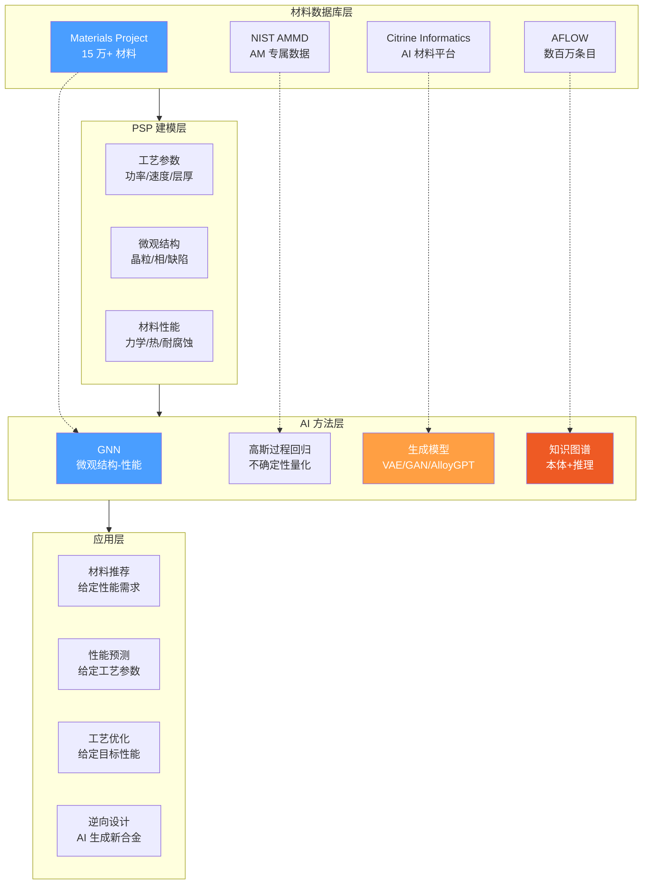
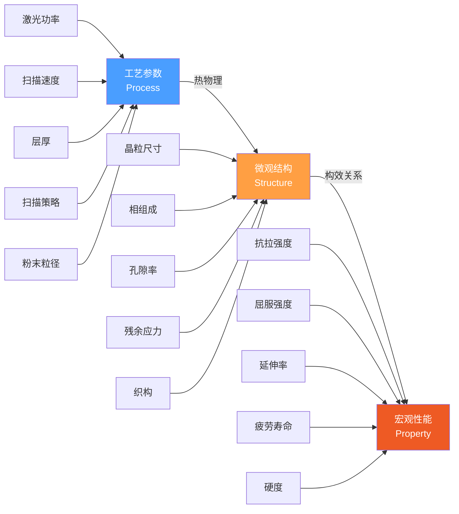
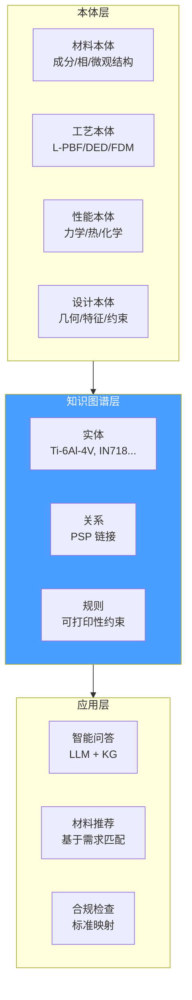

# AM 材料数据库与 PSP 关系深度调研

> [!abstract] 核心价值
> 材料是增材制造的基石。本文调研全球主要材料数据库（Materials Project、NIST AMMD、Citrine、AFLOW）、材料-工艺-性能（PSP）关系建模方法、以及 AI 驱动的合金设计前沿技术。目标是为 CADPilot 构建==智能材料推荐与性能预测模块==，使用户在设计阶段即可获得材料选择建议和性能预估，实现从"几何设计"到"材料感知设计"的升级。

---

## 技术全景



---

## 1. 全球材料数据库对比

### 1.1 综合对比表

| 维度 | Materials Project | NIST AMMD | Citrine Informatics | AFLOW | OQMD |
|:-----|:-----------------|:----------|:-------------------|:------|:-----|
| **规模** | ==15 万+== 材料 | AM 专属多模态 | 私有 + 公开整合 | ==数百万== 条目 | 100 万+ |
| **数据类型** | DFT 计算属性 | 熔池/粉末/CT | 专利+论文+实验 | DFT + 热力学 | DFT |
| **API** | REST + Python SDK | REST API | 商业 API | AFLUX REST | REST |
| **许可** | CC-BY 4.0 | 公开 | ==商业== | 开放 | 开放 |
| **AM 相关** | 间接（基础属性） | ==直接==（粉床熔融） | AI 预测 | 合金相图 | 基础 |
| **ML 就绪** | ★★★★★ | ★★★☆☆ | ★★★★★ | ★★★★☆ | ★★★★☆ |
| **CADPilot 价值** | ★★★★★ | ★★★★☆ | ★★★☆☆ | ★★★★☆ | ★★★☆☆ |

### 1.2 Materials Project

> [!success] ==全球最大的开放计算材料数据库==，15 万+ 材料，API 成熟。

| 属性 | 详情 |
|:-----|:-----|
| **规模** | 15 万+ 无机材料 |
| **数据** | 晶体结构、电子能带、弹性张量、声子、介电常数 |
| **API** | `mp-api` Python 包，REST API + Swagger UI |
| **2025 更新** | 弹性构建器修复（2,484 化合物 +28%）、Yb 重计算（1,073 材料）、DFPT 声子迁移 |
| **ML 基准** | Matbench 13 任务，标准化 ML 性能对比 |

```python
# Materials Project API 使用示例
from mp_api.client import MPRester

with MPRester("YOUR_API_KEY") as mpr:
    # 查询 Ti-6Al-4V 相关材料
    results = mpr.materials.summary.search(
        elements=["Ti", "Al", "V"],
        fields=["material_id", "formula_pretty", "energy_per_atom",
                "band_gap", "elasticity"]
    )
```

### 1.3 NIST Additive Manufacturing Materials Database (AMMD)

> [!info] ==唯一的 AM 专属材料数据库==，包含粉床熔融全流程数据。

| 属性 | 详情 |
|:-----|:-----|
| **定位** | AM 专属多模态数据库 |
| **数据类型** | 粉末表征、熔池监控、NDE 检测、CT 扫描、微观结构 |
| **项目** | DIMA（数据集成与管理） |
| **数据模型** | 通用 AM 数据模型（工艺 + 监控 + 检测 + 设计特征 + 微观结构） |
| **AM-Bench** | 2025 年 11 月会议，2026 年初挑战问题工作坊 |
| **API** | REST API（Postman 文档可用） |

**DIMA 数据模型覆盖：**
- 原位监控数据（in-situ monitoring）
- 无损检测数据（NDE inspection）
- AM 设计特征表征
- 微观结构特征
- 材料/机器能力数据

### 1.4 Citrine Informatics

| 属性 | 详情 |
|:-----|:-----|
| **定位** | 材料与化学品 AI 平台领导者 |
| **核心产品** | Citrine Platform + Catalyst 数字助手 |
| **数据来源** | 专利、论文、技术报告、现有数据库整合 |
| **AI 能力** | 预测智能：预测所有材料在任意条件下的行为 |
| **加速比** | R&D 周期缩短至 ==1/2 ~ 1/5== |
| **市场规模** | 材料信息学市场 2025 年 $1.7 亿 → 2030 年 $4.1 亿（CAGR 19.2%） |
| **授权** | ==商业许可==（企业级） |

> [!caution] Citrine 为商业平台，API 访问需要企业订阅。对 CADPilot 的价值主要在产品设计参考和方法论借鉴。

### 1.5 AFLOW / AFLOWLIB

| 属性 | 详情 |
|:-----|:-----|
| **规模** | ==全球最大计算材料数据库之一==（数百万条目） |
| **数据** | DFT 计算、热力学性质、电子结构、相图 |
| **API** | AFLUX REST API，180+ 可查询材料属性 |
| **唯一标识** | AUID（AFLOW Unique Identifier）协议 |
| **ML 基准** | 二元合金系统、超导体预测 |
| **许可** | 开放，学术友好 |

**API 使用示例：**
```python
# AFLOW REST API 查询
import requests

# 查询 Ti-Al 二元合金
url = "http://aflow.org/API/aflux/?species(Ti,Al),nspecies(2),Egap(*)"
response = requests.get(url)
```

---

## 2. PSP（工艺-结构-性能）关系建模

### 2.1 PSP 链条概述



### 2.2 PSP 建模方法对比

| 方法 | 精度 | 数据需求 | 可解释性 | 泛化性 | 代表工作 |
|:-----|:-----|:---------|:---------|:-------|:---------|
| **物理模型** | 高 | 低 | ★★★★★ | 受限 | 热传导方程 |
| **高斯过程（GPR）** | 高 | ==低==（小样本） | ★★★★☆ | 中 | 金属 AM PSP（Springer 2023） |
| **深度神经网络（DNN）** | 高 | 高 | ★★☆☆☆ | 好 | Ti-6Al-4V 加工行为 |
| **物理引导 ML** | ==最高== | 中 | ★★★★☆ | 好 | NIST PSP 框架 |
| **GNN 微观结构** | 高 | 中 | ★★★☆☆ | 好 | 多晶材料性质预测 |

### 2.3 数据驱动 PSP 框架

> [!cite] npj Advanced Manufacturing (2024) — "Data-driven modeling of PSP relationships in metal AM"

**关键挑战：**
PSP 关系的建立困难在于多种物理现象同时或顺序发生：
- 粉末动力学、激光反射、热传递、流体流动
- 固-液-气相变、固态相变（SSPT）
- 塑性变形、断裂

这些物理现象相互耦合，导致==极其复杂的 PSP 关系==。

**高斯过程回归（GPR）方案：**
- 输入变量：工艺参数 + 相对密度 + 熔池形态 + 胞状结构 + 晶粒结构
- 输出：屈服强度、极限抗拉强度、延伸率
- 优势：==小样本学习 + 不确定性量化==

**物理引导 ML 方案（NIST）：**
- 耦合物理知识与数据驱动 ML 模型
- 系统化的因果分析框架
- 适用于 AM 中的 PSP 因果关系发现

---

## 3. AI 前沿：GNN 微观结构-性能预测

### 3.1 GNN 架构演进

| 架构 | 年份 | 核心创新 | 性能指标 |
|:-----|:-----|:---------|:---------|
| **CGCNN** | 2018 | 晶体图卷积，原子→节点+键→边 | 基准模型 |
| **MEGNet** | 2019 | 三阶段更新（边→原子→全局），支持温度/压力 | 优于 CGCNN |
| **ALIGNN** | 2021 | 线图消息传递，捕捉键角+次近邻 | MAE ==降低 25%== |
| **M3GNet** | 2022 | 通用势函数，覆盖全元素周期表 | DFT 级 MAE |
| **DenseGNN** | 2024 | 密集连接+层次残差+局部结构嵌入 | 通用+可扩展 |
| **iCGCNN** | 2024 | 改进 CGCNN | 误差==降低 20%== |
| **KA-GNN** | 2025 | Kolmogorov-Arnold 网络 + GNN | 参数效率更高 |
| **Hybrid-LLM-GNN** | 2025 | LLM 语义推理 + GNN 结构理解 | ==比纯 GNN 提升 25%== |

### 3.2 GNN 在 AM 中的应用

**多晶材料性质预测：**
- 晶粒级各向异性弹性（Ni 和 Ti 合金）
- 有效锂离子电导率矩阵（LLZO 陶瓷）
- 钢纳米硬度预测

**GrainGNN（晶粒演化）：**
- ==逐点精度 >80%==
- 相比相场模型加速 ==100-1,000 倍==
- 追踪机械载荷下的晶粒生长和织构演变

**AlloyGCN（合金设计）：**
- 固相线/液相线温度预测
- 精度可比 CALPHAD 方法
- ALIGNN-FF 成功预测无钴高熵合金稳定 BCC 结构

### 3.3 GNoME：大规模材料发现

> [!success] Google DeepMind 的 GNoME 框架预测了 ==>38 万个稳定相==，将 Materials Project 数据库扩大近 10 倍。

---

## 4. AI 合金设计

### 4.1 生成模型方法

| 方法 | 架构 | 应用 | 优势 |
|:-----|:-----|:-----|:-----|
| **VAE** | 变分自编码器 | 潜在空间优化 + 合金生成 | 连续可微分潜在表示，高效优化 |
| **GAN** | 生成对抗网络 | 数据增强 + 合金候选生成 | 解决数据稀缺问题 |
| **AlloyGPT** | 生成式语言模型 | ==端到端正向预测 + 逆向设计== | 同时完成属性预测和合金设计 |
| **MatterGen** | 扩散模型 | 带约束的结构生成 | 可指定目标性能 |

### 4.2 AlloyGPT：端到端合金设计

> [!cite] npj Computational Materials (2025) — "End-to-end prediction and design of additively manufacturable alloys using AlloyGPT"

**核心能力：**
- 正向预测：给定合金成分 → 预测力学/热学性能
- 逆向设计：给定目标性能 → 生成候选合金成分
- 专为 AM 可制造合金设计优化

### 4.3 NLP + 深度学习设计耐腐蚀合金

> [!cite] Science Advances — "Enhancing corrosion-resistant alloy design through NLP and deep learning"

- 自然语言处理提取文献中的腐蚀数据
- 深度学习建立成分-微观结构-腐蚀性能关系
- 多主元素合金（MPEA）的腐蚀评估

### 4.4 GAN 数据增强

在高熵合金（HEA）研究中，GAN 用于：
- 生成合成数据解决==数据稀缺和不平衡==问题
- 增强腐蚀评估预测准确性
- 加速新高熵合金开发

---

## 5. 多材料打印

### 5.1 FDM 多材料

**blended FDM (b-FDM) — 2024 Nature Communications：**
- 3D 打印的"数字材料丝"实现功能梯度
- 仅需标准 FDM 打印机和丝材
- DM 丝由多种基础材料以特定浓度和分布组合
- 挤出时均匀混合，实现连续梯度性能

**2025-2026 产业趋势：**
- 多色/多材料 + 高速已成为 FDM 新标准
- Anycubic KobraX：多材料快速切换
- Formnext 2025 展出多款多喷头机型

### 5.2 DED 梯度材料

- DED 可在层内和跨层制造==连续梯度材料==
- 多粉仓存储不同粉末材料，按层沉积
- 金属和陶瓷功能梯度材料（FGM）制备

---

## 6. 知识图谱设计

### 6.1 AM 材料知识图谱架构



### 6.2 现有本体与知识图谱

| 项目 | 年份 | 范围 | 创新点 |
|:-----|:-----|:-----|:-------|
| **PBF-AMP-Onto** | 2025 | 粉床熔融 AM | 模块化本体，语义查询+决策支持 |
| **FAIR AM Ontology** | 2025 | AM 全流程 | 遵循 FAIR 数据原则 |
| **AM 知识图谱 + LLM** | 2025 | 金属 AM 决策 | ==LLM 驱动的 KG 决策支持== |
| **Eco-Design Ontology** | 2024 | AM 生态设计 | MPSeP（材料-工艺-结构-生态性能）关系 |
| **AM Design Rule KG** | 2020 | AM 设计规则 | ML 提取知识 + 本体存储 + 推理 |

### 6.3 CADPilot 知识图谱设计建议

**实体类型：**
- `Material`：成分、密度、熔点、弹性模量
- `Process`：工艺类型、参数范围、设备要求
- `Property`：力学、热学、化学、疲劳
- `Part`：几何类型、特征、尺寸约束
- `Standard`：ISO/ASTM 标准要求（参见 [[standards-compliance-automation]]）

**关系类型：**
- `Material -[COMPATIBLE_WITH]-> Process`
- `Process -[PRODUCES]-> Structure`
- `Structure -[DETERMINES]-> Property`
- `Material -[MEETS]-> Standard`
- `Part -[REQUIRES]-> Property`

---

## 7. CADPilot 集成方案

### 7.1 材料推荐节点设计

```python
# material_advisor_node 概念设计
class MaterialAdvisor:
    """基于零件需求推荐最优材料+工艺组合"""

    def recommend(self, part_spec: DrawingSpec,
                  requirements: MaterialRequirements) -> list[MaterialOption]:
        """
        输入：
        - part_spec: 零件几何规格（来自 analysis_node）
        - requirements: 性能需求（强度/耐温/耐腐蚀等）

        输出：
        - top-3 材料+工艺推荐，附带：
          - 预估性能（GPR 预测 + 置信区间）
          - 成本估算（参见 automated-quoting-engine）
          - 可打印性评分
        """
        pass
```

### 7.2 推荐集成路径

> [!success] 短期（0-3 月）
> 1. **集成 Materials Project API**：获取基础材料属性
> 2. **构建 AM 材料知识库**：覆盖 FDM/SLS/SLA/DMLS 常用材料
> 3. **规则匹配推荐**：基于零件类型 + 性能需求 → 材料推荐

> [!success] 中期（3-6 月）
> 1. **PSP 预测模型**：GPR/DNN 基于工艺参数预测性能
> 2. **知识图谱 v1**：材料-工艺-性能三元组 + 标准合规映射
> 3. **集成 NIST AMMD**：获取 AM 专属材料数据

> [!success] 长期（6-12 月）
> 1. **GNN 微观结构预测**：基于 ALIGNN/DenseGNN
> 2. **生成式合金设计**：参考 AlloyGPT 方法，自定义 AM 合金
> 3. **LLM + KG 决策支持**：自然语言查询材料知识图谱
> 4. **多材料梯度设计**：支持 DED 梯度材料规划

---

## 8. 风险与挑战

| 风险 | 影响 | 缓解措施 |
|:-----|:-----|:---------|
| AM 材料数据稀缺 | PSP 模型训练不足 | GAN 数据增强 + 迁移学习 |
| Citrine 商业许可 | 成本高 | 优先使用开源（MP + AFLOW） |
| PSP 关系复杂 | 模型精度不足 | 物理引导 ML + 不确定性量化 |
| 知识图谱维护 | 数据过时 | 自动化文献挖掘 + NLP 更新 |
| 多工艺覆盖 | 每种工艺需独立模型 | 分阶段覆盖（先 L-PBF → FDM → DED） |

---

## 参考文献

1. Materials Project, "API Documentation," next-gen.materialsproject.org, 2026.
2. NIST, "Data Integration and Management for Additive Manufacturing," nist.gov, 2026.
3. Citrine Informatics, "The AI Platform for Materials & Chemicals," citrine.io, 2026.
4. AFLOW, "Automatic FLOW for Materials Discovery," aflowlib.org, 2026.
5. Liu et al., "Interpretable ML approach for exploring PSP relationships in metal AM," Additive Manufacturing (2024).
6. npj Advanced Manufacturing, "Data-driven modeling of PSP relationships in metal AM," (2024).
7. JMI, "Advances in graph neural networks for alloy design and properties predictions: a review," (2025).
8. npj Computational Materials, "End-to-end prediction and design of additively manufacturable alloys using AlloyGPT," (2025).
9. Science Advances, "Enhancing corrosion-resistant alloy design through NLP and deep learning."
10. Nature Communications, "3D printing with a 3D printed digital material filament for programming functional gradients," (2024).
11. Advanced Engineering Materials, "Ontologies for FAIR Data in Additive Manufacturing," (2025).
12. ResearchGate, "Large Language Model Powered Decision Support for a Metal AM Knowledge Graph," (2025).

---

> [!quote] 文档统计
> - 行数：~310 行
> - 交叉引用：5 个 wikilink
> - Mermaid 图：3 个
> - 参考文献：12 篇
> - 覆盖数据库：5 个（MP/NIST/Citrine/AFLOW/OQMD）
> - 覆盖 AI 方法：4 类（GNN/GPR/生成模型/知识图谱）
