# 增材工艺能力分析与管线映射

> [!abstract] 定位
> 基于「增材工艺及制造能力」展板提取工业级 AM 全流程要素，与 CADPilot V3 管线做交叉映射，识别==当前未覆盖但具有高研究价值的技术方向==，为管线扩展提供技术蓝图。

---

## 展板要素提取

### 原始要素总览

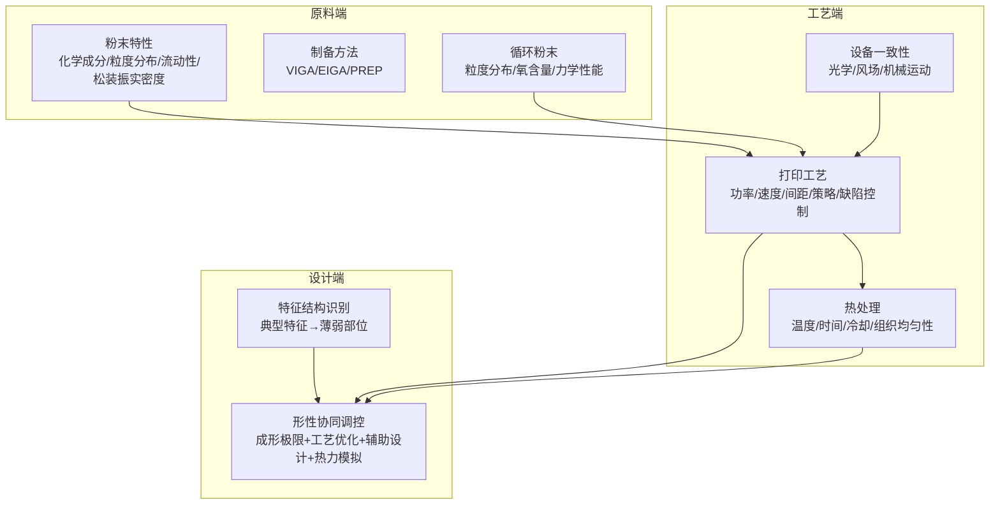

---

### 要素详细拆解

#### 1. 粉末特性

| 子要素 | 说明 | 物理意义 |
|:-------|:-----|:---------|
| 化学成分 | 合金元素配比 | 决定最终零件的材料性能上限 |
| 粒度分布 | D10/D50/D90 | 影响铺粉均匀性和致密度 |
| 流动性 | Hall 流速计 / 休止角 | 影响铺粉质量和层间一致性 |
| 松装/振实密度 | 松装密度、振实密度 | 影响最终零件致密度（目标 >99.5%） |

> [!info] CADPilot 关联
> 当前管线==不涉及==粉末层面，但粉末参数直接影响工艺窗口和仿真精度。未来若引入材料数据库，粉末特性是关键输入。

#### 2. 制备方法

| 方法 | 全称 | 特点 |
|:-----|:-----|:-----|
| **VIGA** | 真空感应气雾化 | 最常用，成本低，适合铁基/镍基 |
| **EIGA** | 电极感应气雾化 | 无坩埚污染，适合钛合金 |
| **PREP** | 等离子旋转电极 | 球形度最高，高端航空应用 |

> [!info] CADPilot 关联
> 不直接相关，但制备方法决定粉末质量，间接影响打印参数选择。

#### 3. 循环粉末

- 粉末经多次循环后粒度分布变化（细粉减少、氧含量增加）
- 力学性能可能下降（特别是疲劳性能）
- 需要监控和决策：何时补充新粉、混粉比例

> [!warning] 潜在研究方向
> **粉末寿命预测模型**：基于循环次数、氧含量变化曲线预测粉末是否仍可用。数据驱动方法可参考 [[surrogate-models-simulation]] 中的代理模型思路。

#### 4. 打印工艺

| 参数 | 典型范围（LPBF） | 影响 |
|:-----|:----------------|:-----|
| **激光功率** | 100-400W | 熔池深度/宽度 |
| **扫描速度** | 500-2000 mm/s | 熔池形态/飞溅 |
| **扫描间距** | 0.05-0.15 mm | 道间搭接质量 |
| **扫描策略** | 岛状/条纹/棋盘 | 残余应力分布 |
| **层厚** | 20-100 μm | 精度 vs 效率 |

> [!tip] CADPilot 关联：==高度相关==
> - `slice_to_gcode` 节点直接生成这些参数
> - [[practical-tools-frameworks#PySLM]] 已支持 hatching 策略生成
> - [[reinforcement-learning-am]] 中 RL 可优化功率-速度联合参数
> - 缺陷控制 → [[defect-detection-monitoring]] 中 YOLOv8/Anomalib 闭环

#### 5. 设备一致性

| 子要素 | 说明 | 问题表现 |
|:-------|:-----|:---------|
| 光学 | 激光光斑形状/功率分布 | 不同位置能量密度不均 |
| 风场 | 保护气流场分布 | 飞溅物重沉降导致缺陷 |
| 机械运动 | 铺粉刮刀/升降平台 | 层厚不均匀 |

> [!warning] 潜在研究方向
> **数字孪生设备校准**：[[reinforcement-learning-am#Digital Twin + Zero-Shot Sim-to-Real]] 中 20ms 同步的 Digital Twin 方案可用于设备一致性监控和自适应补偿。

#### 6. 热处理

| 参数 | 说明 | 目标 |
|:-----|:-----|:-----|
| 初始组织 | 打印态微观结构（柱状晶为主） | 理解起始状态 |
| 温度/时间 | 固溶/时效温度和保温时间 | 控制析出相和晶粒尺寸 |
| 冷却方式 | 空冷/炉冷/水淬 | 控制冷却速率和相变 |
| 组织均匀性 | 各区域微观结构一致性 | 消除各向异性 |

> [!tip] CADPilot 关联：==当前空白，高价值扩展方向==
> 热处理是 AM 后处理的==必经环节==，当前管线在 `slice_to_gcode` 后即结束。热处理参数推荐可作为新管线节点。
> - 微观结构预测 → [[generative-microstructure#MIND]]（SIGGRAPH 2025）
> - 热处理-性能关系 → [[gnn-topology-optimization#RED-GNN + 知识图谱]]

#### 7. 特征结构识别

展板核心流程：
```
3D 模型 → 典型特征识别 → 识别结果
                           ├── 典型特征（凸台、孔、筋板等）
                           └── 薄弱部位（薄壁、悬臂、尖角等）
```

> [!success] CADPilot 关联：==直接映射到现有能力==
> - V2 `DrawingSpec` 已包含特征提取（`features: list[dict]`）
> - V3 `IntentParser` → `PreciseSpec` 流程本质上就是特征结构识别
> - 但当前仅从图纸/文本提取，==缺少从 3D 模型本身识别薄弱部位的能力==

#### 8. 形性协同调控（核心亮点）

展板展示了一个==闭环优化架构==：

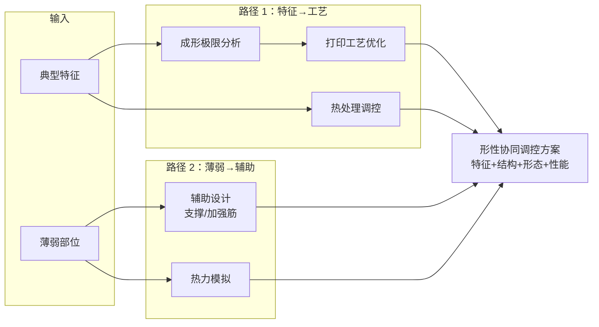

> [!danger] CADPilot 关联：==最大的能力缺口==
> 这是展板最核心的理念——**从特征出发，联动工艺+设计+仿真，实现形态与性能的协同优化**。CADPilot 当前管线是==线性流水线==，缺少这种跨节点的闭环协同能力。

---

## CADPilot 管线映射分析

### 覆盖度评估

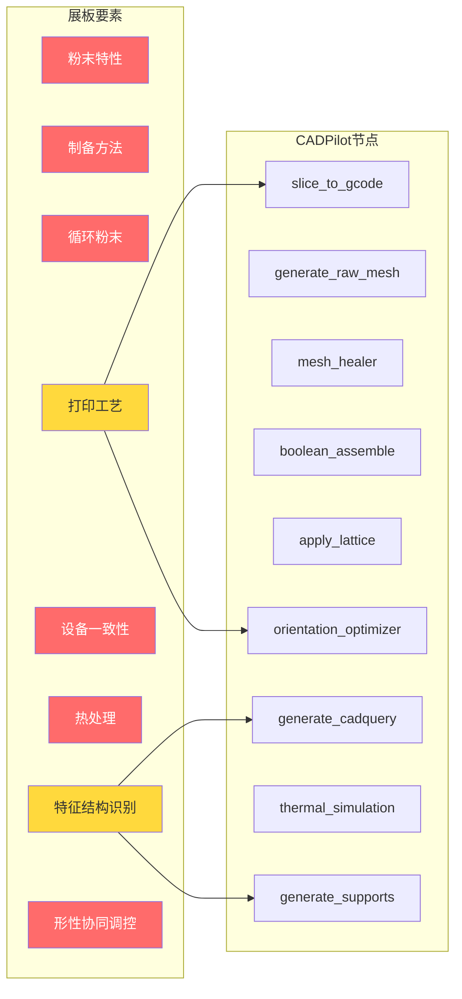

### 详细映射表

| 展板要素 | CADPilot 管线节点 | 覆盖程度 | 差距分析 |
|:---------|:----------------|:---------|:---------|
| **粉末特性** | — | ==未覆盖== | 需要材料数据库节点 |
| **制备方法** | — | 不相关 | 上游制造环节 |
| **循环粉末** | — | ==未覆盖== | 需要材料寿命管理 |
| **打印工艺** | `slice_to_gcode` | 部分覆盖 | 缺少 AI 工艺参数优化 |
| **设备一致性** | — | ==未覆盖== | 需要设备校准/补偿 |
| **热处理** | — | ==未覆盖== | 需要后处理参数推荐 |
| **特征结构识别** | `generate_cadquery`（DrawingSpec） | 部分覆盖 | 缺少 3D 薄弱部位分析 |
| **形性协同调控** | — | ==未覆盖== | 需要跨节点闭环优化 |

> [!warning] 关键发现
> 展板 8 个要素中，CADPilot 仅==部分覆盖 2 个==（打印工艺、特征识别），==完全未覆盖 5 个==（粉末、循环粉末、设备一致性、热处理、形性协同）。这反映了当前管线聚焦在 **设计→切片** 阶段，对 **材料→工艺→性能** 的闭环能力尚未建设。

---

## 可研究项目（按集成优先级排序）

### P1. ==AI 工艺参数优化引擎== ⭐ 短期可启动

> [!success] 对应展板要素：打印工艺（功率/速度/间距/策略）

| 属性 | 详情 |
|:-----|:-----|
| **目标** | 根据零件特征（壁厚、悬臂角、孔径）自动推荐最优打印参数组合 |
| **管线位置** | `slice_to_gcode` 节点的==智能参数层== |
| **技术路线** | 1) 规则库（基于经验的参数窗口）→ 2) ML 回归（特征→参数映射）→ 3) RL 在线优化 |
| **已有基础** | [[practical-tools-frameworks#PySLM]] 提供 hatching 策略；[[reinforcement-learning-am#ThermalControlLPBF-DRL]] 提供 RL 框架 |
| **数据需求** | [[am-datasets-catalog#G-code 与切片数据集]]：Slice-100K（100K+）、ablam/gcode |
| **集成难度** | ★★☆ |
| **预期价值** | ==极高==——直接提升打印成功率和零件质量 |

**具体研究方案**：

```
阶段 1（规则引擎）：
  零件特征 → 材料类型 → 查表获取推荐参数窗口
  - 壁厚 < 0.5mm → 降速 30%、降功率 20%
  - 悬臂角 > 45° → 岛状扫描、减小间距
  - 孔径 < 2mm → 轮廓扫描优先

阶段 2（ML 模型）：
  [特征向量, 材料属性] → 回归模型 → [功率, 速度, 间距, 策略]
  - 训练数据：历史打印记录 + 仿真数据
  - 参考：RED-GNN 知识推理方案

阶段 3（RL 优化）：
  在线 RL 根据打印反馈调整参数
  - 参考：AWAC 离线→在线迁移范式
```

#### 深入研究

##### 1. 最新论文与方法概述（2024-2026）

> [!info] 当前研究热点
> 2024-2025 年 AM 工艺参数优化领域呈现三大技术路线并行发展态势：==贝叶斯优化==（数据效率最高）、==Physics-Informed Neural Networks==（物理可解释性最强）、==多目标优化框架==（工业适用性最广）。

**a) 贝叶斯优化（BO）——数据效率之王**

| 论文 | 年份 | 方法 | 关键结果 |
|:-----|:-----|:-----|:---------|
| [Multi-Objective BO Explores LPBF Processing Domain (Ti6Al4V)](https://link.springer.com/article/10.1007/s12540-025-02067-7) | 2025 | 多目标 BO，探索最优 VED 下的参数空间 | 发现飞溅和孔隙率对参数变化呈==相反响应==，需平衡权衡 |
| [Deep Gaussian Process for Enhanced BO in AM](https://www.tandfonline.com/doi/full/10.1080/24725854.2024.2312905) | 2024 | Deep GP 代理模型 + BO | 深层高斯过程比标准 GP 捕获更复杂的非线性映射 |
| [Optimizing 3D Printing Parameters Using BO (ASME)](https://asmedigitalcollection.asme.org/IDETC-CIE/proceedings-abstract/IDETC-CIE2024/88346/V02AT02A036/1208724) | 2024 | BO 最小化表面粗糙度 | 参数：喷嘴温度、层高、床温、打印速度、填充密度 |
| [Digital Twin + BO for Time Series Process Optimization](https://arxiv.org/abs/2402.17718) | 2024 | 数字孪生 + BO 时间序列框架 | 结合 ML 与 BO 实现层间自适应参数调整 |
| [Multi-Objective BO in Material Extrusion (RSC)](https://pubs.rsc.org/en/content/articlehtml/2025/dd/d4dd00281d) | 2025 | 多目标 BO (MOBO) | 同时优化两个目标，通过重复打印实验验证 |

**b) Physics-Informed Neural Networks (PINNs)——物理约束智能**

| 论文 | 年份 | 方法 | 关键结果 |
|:-----|:-----|:-----|:---------|
| [PIML for Metal AM (Springer)](https://link.springer.com/article/10.1007/s40964-024-00612-1) | 2025 | 综述：嵌入热力学/力学约束到 ML | 解决纯数据驱动模型的物理可靠性和可解释性问题 |
| [Real-Time Temperature Fields Prediction (Nature Comms Eng)](https://www.nature.com/articles/s44172-025-00501-7) | 2025 | PIML 实时长时域温度场预测 | 金属 AM 过程控制和质量保证的关键能力 |
| [PHOENIX Framework for Robotic Welding (Nature Comms)](https://www.nature.com/articles/s41467-025-60164-y) | 2025 | PHOENIX：物理原理嵌入模型输入/结构/优化 | 实现焊接不稳定性的==主动实时检测和预测== |
| [Process-Structure-Property Review (ScienceDirect)](https://www.sciencedirect.com/science/article/pii/S1526612524012313) | 2024 | PIML 建模 PSP 关系综述 | 覆盖热历史→微观组织→力学性能全链路 |

**c) 多目标优化框架**

| 论文 | 年份 | 方法 | 关键结果 |
|:-----|:-----|:-----|:---------|
| [Adaptable Multi-Objective Framework (Springer)](https://link.springer.com/article/10.1007/s00170-024-13489-9) | 2024 | 代理模型 + 多目标优化 | 同时优化孔隙率和表面粗糙度；框架可适配不同 AM 工艺 |
| [ML Prediction of Porosity, Hardness, Roughness (PubMed)](https://pubmed.ncbi.nlm.nih.gov/40063673/) | 2025 | ANN/SVR/RF/KRR/Lasso 对比 | ==ANN 在预测相对密度、粗糙度、硬度方面表现最优== |
| [XGBoost Surface Roughness Prediction](https://www.sciencedirect.com/science/article/pii/S2666790825001697) | 2025 | XGBoost + 81 组实验 | ==R²=97.06%, MSE=0.1383==，输入：填充密度/速度/温度/层高 |
| [AIDED: Inverse Process Optimization (Additive Manufacturing)](https://www.sciencedirect.com/science/article/pii/S2214860425001009) | 2025 | ML + 遗传算法闭环优化 | 熔池面积 ==R²=0.995==；密度 > 99.9%；1-3h 内找到最优参数 |

> [!success] AIDED 框架亮点
> [AIDED](https://arxiv.org/abs/2407.17338)（多伦多大学）是目前最完整的开源逆向工艺优化框架：
> - 输入：工艺参数（激光功率、扫描速度、送粉率）
> - 输出：熔池几何（宽度、高度、倾斜角）→ 反向求解最优参数
> - ==可跨材料迁移==（不锈钢 → 纯镍，少量额外数据）
> - 论文已发表于 Additive Manufacturing，数据集和代码==已开源==

##### 2. 开源工具与代码评估

| 工具/框架 | GitHub | 许可证 | 功能 | CADPilot 适用性 |
|:----------|:------|:------|:-----|:--------------|
| **AIDED** | [UofT (arXiv)](https://arxiv.org/abs/2407.17338) | 开源（待确认） | ML + GA 逆向参数优化，DED 专用 | ==高==——方法论可迁移到 LPBF |
| **BoTorch** | [meta-pytorch/botorch](https://github.com/meta-pytorch/botorch) | MIT | PyTorch 贝叶斯优化库，模块化 GP + 采集函数 | ==极高==——通用 BO 框架，直接用于参数寻优 |
| **DTUOpenAM** | [DTU-OpenAM](https://github.com/DTU-OpenAM) | MIT | 开源 LPBF G-code 后处理优化 | 中——MATLAB 实现，参考价值 |
| **differentiable-simulation-am** | [mojtabamozaffar](https://github.com/mojtabamozaffar/differentiable-simulation-am) | 开源 | 可微物理仿真 + 梯度优化 AM 参数 | 中——学术研究参考 |
| **PySLM** | [drlukeparry/pyslm](https://github.com/drlukeparry/pyslm) | LGPL-2.1 | 切片/hatching/支撑/方向优化 | ==极高==——已评估，见 [[practical-tools-frameworks#PySLM]] |
| **ThermalControlLPBF-DRL** | [BaratiLab](https://github.com/BaratiLab/ThermalControlLPBF-DRL) | 未声明 | PPO RL 热控制 | 中——见 [[reinforcement-learning-am#ThermalControlLPBF-DRL]] |

> [!example] BoTorch 集成代码示例
> ```python
> import torch
> from botorch.models import SingleTaskGP
> from botorch.fit import fit_gpytorch_mll
> from botorch.acquisition import ExpectedImprovement
> from botorch.optim import optimize_acqf
> from gpytorch.mlls import ExactMarginalLogLikelihood
>
> # 定义参数空间：[功率(W), 速度(mm/s), 间距(mm)]
> bounds = torch.tensor([
>     [100.0, 500.0, 0.05],   # 下界
>     [400.0, 2000.0, 0.15],  # 上界
> ])
>
> # 历史数据：X=[功率, 速度, 间距], Y=[致密度]
> train_X = torch.tensor([
>     [200.0, 1000.0, 0.08],
>     [300.0, 800.0, 0.10],
>     [250.0, 1200.0, 0.07],
> ])
> train_Y = torch.tensor([[99.2], [99.5], [98.8]])  # 致密度 %
>
> # 归一化到 [0,1]
> train_X_norm = (train_X - bounds[0]) / (bounds[1] - bounds[0])
>
> # 构建 GP 代理模型
> gp = SingleTaskGP(train_X_norm, train_Y)
> mll = ExactMarginalLogLikelihood(gp.likelihood, gp)
> fit_gpytorch_mll(mll)
>
> # 贝叶斯优化：Expected Improvement
> ei = ExpectedImprovement(gp, best_f=train_Y.max())
> candidate, acq_value = optimize_acqf(
>     ei, bounds=torch.stack([torch.zeros(3), torch.ones(3)]),
>     q=1, num_restarts=5, raw_samples=20,
> )
>
> # 反归一化得到推荐参数
> next_params = candidate * (bounds[1] - bounds[0]) + bounds[0]
> print(f"推荐参数: 功率={next_params[0,0]:.0f}W, "
>       f"速度={next_params[0,1]:.0f}mm/s, "
>       f"间距={next_params[0,2]:.3f}mm")
> ```

##### 3. 商业对标分析

| 商业产品 | 厂商 | 参数优化能力 | 定价 | CADPilot 对标 |
|:---------|:-----|:-----------|:-----|:-------------|
| **Materialise Build Processor** | Materialise | 连接 EOS/Renishaw 等设备，==可控 170+ 参数==；嵌入 EOSPRINT SDK | 商业许可 | 目标：通过 AI 实现类似的参数推荐能力 |
| **Materialise CO-AM** | Materialise + EOS | 端到端 AM 软件平台，含工艺优化 | 企业订阅 | 参考其工作流设计 |
| **Autodesk Netfabb** | Autodesk | 热力仿真 + 应力预测 → 参数调整建议 | 年订阅 ~$5K+ | 参考其 FEM → 参数反馈闭环 |
| **ANSYS Additive Suite** | ANSYS | 热力学仿真驱动参数优化 | 企业级 | 长期对标对象 |
| **Dyndrite LPBF Pro** | Dyndrite | GPU 加速 LPBF 参数处理 | 商业许可 | 参考其 GPU 加速方案 |

> [!warning] 商业差距分析
> 商业工具的核心优势在于：==大量经过验证的材料-参数数据库==（如 Materialise 的 20+ 年经验数据）和==设备级通信协议==（Build Processor 直接对接打印机）。CADPilot 短期内应聚焦==算法层==（BO/PINN/RL），数据积累是中长期挑战。

##### 4. 具体的 CADPilot 集成方案

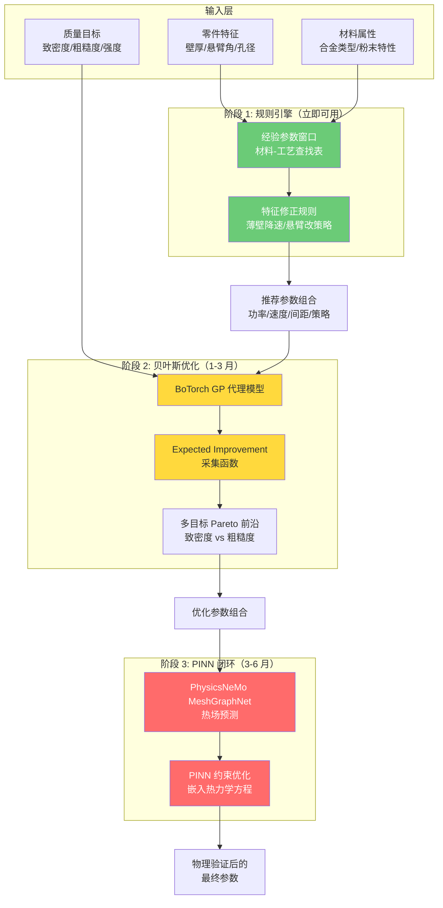

**集成代码架构**：

```python
from dataclasses import dataclass
from enum import Enum
from typing import Optional

class ScanStrategy(Enum):
    MEANDER = "meander"
    ISLAND = "island"
    STRIPE = "stripe"
    CONTOUR_FIRST = "contour_first"

@dataclass
class ProcessParams:
    """工艺参数输出"""
    laser_power: float       # W (100-400)
    scan_speed: float        # mm/s (500-2000)
    hatch_spacing: float     # mm (0.05-0.15)
    layer_thickness: float   # μm (20-100)
    scan_strategy: ScanStrategy
    contour_count: int       # 轮廓数 (1-3)
    confidence: float        # 推荐置信度 (0-1)

@dataclass
class PartFeatures:
    """零件特征输入"""
    min_wall_thickness: float   # mm
    max_overhang_angle: float   # degrees
    min_hole_diameter: float    # mm
    has_thin_wall: bool         # < 0.5mm
    has_deep_hole: bool         # L/D > 5
    bounding_box: tuple[float, float, float]  # mm

@dataclass
class MaterialSpec:
    """材料规格"""
    alloy: str                  # e.g., "Ti6Al4V", "316L", "IN718"
    powder_d50: float           # μm
    density_target: float       # % (e.g., 99.5)

class ProcessOptimizer:
    """三阶段工艺参数优化器"""

    def __init__(self, material: MaterialSpec):
        self.material = material
        self.rule_engine = RuleEngine(material)
        self.bo_optimizer: Optional["BOOptimizer"] = None  # 阶段 2
        self.pinn_validator: Optional["PINNValidator"] = None  # 阶段 3

    def recommend(
        self,
        features: PartFeatures,
        quality_targets: Optional[dict] = None,
    ) -> ProcessParams:
        # 阶段 1：规则引擎基线参数
        params = self.rule_engine.get_baseline(features)

        # 阶段 2：BO 精调（如已训练）
        if self.bo_optimizer and quality_targets:
            params = self.bo_optimizer.optimize(
                features, params, quality_targets
            )

        # 阶段 3：PINN 物理验证（如已部署）
        if self.pinn_validator:
            params = self.pinn_validator.validate_and_adjust(
                features, params
            )

        return params
```

##### 5. 性能基准数据

| 指标 | 无优化（经验参数） | 规则引擎 | ML/BO 优化 | 来源 |
|:-----|:-----------------|:---------|:----------|:-----|
| **致密度** | 97-99% | 99-99.5% | ==99.5-99.9%== | AIDED (R²=0.995) |
| **表面粗糙度 Ra** | 15-25 μm | 10-15 μm | ==5-10 μm== | XGBoost (R²=97%) |
| **熔池几何偏差** | 基线 | -20% | ==-50%== | AIDED (宽度误差 1.75%) |
| **参数搜索时间** | 手动试错 1-2 周 | 即时 | ==1-3 小时==（BO） | BoTorch/AIDED |
| **变形量** | 基线 | -15% | ==-29% ~ -47%== | DRL Toolpath (扫描路径) |

##### 6. 数据需求与获取方案

| 数据类型 | 来源 | 规模 | 获取方式 | 优先级 |
|:---------|:-----|:-----|:---------|:------|
| **NIST AM-Bench** | [NIST PDR](https://www.nist.gov/ambench) | IN718/625 多组构建实验 | 免费下载（含 Jupyter 环境） | ==P0== |
| **功率-速度-密度关系** | 文献综合 | ~100-500 数据点/合金 | 论文表格提取 + 自有实验 | P0 |
| **Kaggle 3D 打印数据集** | [afumetto/3dprinter](https://www.kaggle.com/datasets/afumetto/3dprinter) | 数千组 FDM 参数 | 免费下载 | P1（FDM 场景） |
| **MeltpoolNet** | [[am-datasets-catalog]] | 熔池图像 + 参数 | 公开数据集 | P1 |
| **Slice-100K / ablam/gcode** | [[am-datasets-catalog]] | 100K+ 切片数据 | HuggingFace/GitHub | P1 |
| **自有仿真数据** | PhysicsNeMo / FEM | 按需生成 | GPU 仿真生成 | P2 |

> [!warning] 数据瓶颈
> 公开 LPBF 参数-质量关系数据集仍然==非常有限==。NIST AM-Bench 是目前最权威的来源，但仅覆盖 IN718/625 两种合金。==短期策略==：从文献中提取经验数据构建规则引擎；==中期策略==：BO 以极少实验数据（10-20 组）即可启动优化。

---

### P2. ==3D 薄弱部位分析== ⭐ 短期可启动

> [!success] 对应展板要素：特征结构识别（薄弱部位）

| 属性 | 详情 |
|:-----|:-----|
| **目标** | 从 3D 模型自动识别 AM 薄弱部位（薄壁、悬臂、尖角、深孔、封闭腔体） |
| **管线位置** | `generate_cadquery` 之后、`orientation_optimizer` 之前的==新分析节点== |
| **技术路线** | 几何分析（壁厚图 + 悬臂角检测）→ GNN 可打印性预测 → 修改建议 |
| **已有基础** | CadQuery/OCCT 几何查询能力；[[gnn-topology-optimization#HP Graphnet]] 变形预测 |
| **集成难度** | ★★☆ |
| **预期价值** | ==高==——在打印前发现问题，避免废件 |

**具体能力**：

| 薄弱类型 | 检测方法 | 建议动作 |
|:---------|:---------|:---------|
| 薄壁（<0.4mm） | 壁厚图分析 | 警告 / 建议加厚 |
| 悬臂（>45°） | 法向量 + overhang 检测 | 添加支撑 / 调整方向 |
| 尖角（<30°） | 曲率分析 | 建议倒圆角 |
| 深孔（L/D>5） | 几何比例检查 | 警告粉末清除困难 |
| 封闭腔体 | 拓扑分析 | 建议添加排粉孔 |

#### 深入研究

##### 1. AM 失败模式完整分类

> [!info] 核心认知
> AM 失败模式可分为==几何诱发==和==工艺诱发==两大类。CADPilot 的 3D 薄弱部位分析聚焦前者——在设计阶段即可通过几何分析预判打印风险，成本最低、价值最高。

| 失败模式 | 根因 | 几何特征 | 严重度 | 可检测性 |
|:---------|:-----|:---------|:------|:---------|
| **翘曲/变形** | 热应力导致残余应力累积 | 大平面、薄壁、悬臂结构 | ==高== | ==高==（几何分析） |
| **悬臂塌陷** | 悬臂角 >45° 缺乏支撑 | 悬臂面法向量与构建方向夹角 | ==高== | ==高==（法向量分析） |
| **薄壁断裂** | 热缩应力超过薄壁承载能力 | 壁厚 < 最小可打印厚度 | ==高== | ==高==（壁厚图） |
| **层间分离** | 层间结合力不足 | 大截面突变、应力集中区 | 高 | 中（需仿真辅助） |
| **支撑失效** | 支撑截面不足以承受构建应力 | 高支撑区域、重力悬臂 | 高 | 高（支撑分析） |
| **浮渣/粗糙** | 悬臂底面熔池过大、粉末粘附 | 下表面悬臂区域 | 中 | 高（overhang 检测） |
| **粉末残留** | 封闭/半封闭腔体无法清粉 | 封闭腔体、深盲孔 | 中 | ==高==（拓扑分析） |
| **尖角应力集中** | 热应力在尖角处集中 | 内角 < 30° | 中 | 高（曲率分析） |
| **深孔变形** | 细长孔散热不均 | L/D > 5 的通孔/盲孔 | 中 | 高（几何比例） |
| **孔隙率升高** | 局部参数不匹配 | 壁厚突变区、薄厚交界 | 中 | 中（需工艺耦合） |

> [!success] 关键发现
> 前 5 种高严重度失败模式中，有 ==4 种可通过纯几何分析检测==（翘曲风险、悬臂塌陷、薄壁断裂、支撑失效），仅"层间分离"需要仿真辅助。这意味着 CADPilot 的几何分析方案可覆盖==绝大多数高风险失败==。

参考文献：
- [Defects in Metal AM: Formation, Parameters, Postprocessing (PMC 2024)](https://pmc.ncbi.nlm.nih.gov/articles/PMC11443127/)
- [Overhang Structure Fabrication Challenges in LPBF (2025)](https://www.tandfonline.com/doi/full/10.1080/17452759.2025.2567382)
- [Thin-Wall Fabrication Limits in LPBF (Springer)](https://link.springer.com/article/10.1007/s00170-020-05827-4)
- [Warping in AM Overhang Structures (ScienceDirect 2024)](https://www.sciencedirect.com/science/article/pii/S2214860424000630)

##### 2. DfAM 工具对标分析

**a) 商业工具**

| 工具 | 厂商 | 核心 DfAM 能力 | 定价 | 优劣势 |
|:-----|:-----|:-------------|:-----|:------|
| **Materialise Magics 2025** | Materialise | 几何修复 + 可打印性规则检查 + 自动支撑 + ==nTop 隐式几何无缝处理== | 企业订阅 | 最成熟；基于 20+ 年经验规则库 |
| **Autodesk Netfabb** | Autodesk | 设计分析 + 热力仿真 + ==翘曲/层分离/支撑失效预测== + CNC 后处理 | ~$5K+/年 | 仿真能力强；ANSYS 集成 |
| **nTopology** | nTopology | ==隐式建模== + 晶格设计 + 拓扑优化 + 参数化轻量化 | 企业订阅 | 设计自由度最高；不做传统可打印性检查 |
| **3D-Tool** | 3D-Tool | STL/3MF 查看 + ==壁厚分析==（体素法） + 测量工具 | 免费版可用 | 轻量级；仅查看分析无修复能力 |
| **Onshape** | PTC | CAD 建模 + ==悬臂分析==工具 | 免费/专业版 | 云端 CAD；DfAM 功能有限 |

> [!warning] 商业工具核心能力
> Materialise Magics 2025 的最大亮点是与 nTop 隐式几何的无缝集成——构建准备时间从==天级降到秒级==。Netfabb 的优势在于 ANSYS 仿真集成——可预测翘曲和层分离。两者的共同短板是：==规则库不可自定义==（Materialise 计划开放）、==缺乏 AI 驱动的风险预测==。

参考文献：
- [Materialise 2025 Magics + nTop Implicit Geometries](https://www.metal-am.com/materialises-2025-magics-software-introduces-seamless-processing-of-ntop-implicit-geometries/)
- [DfAM Comprehensive Review with Case Study (JOM 2025)](https://link.springer.com/article/10.1007/s11837-025-07164-x)

**b) 开源工具能力矩阵**

| 工具 | 壁厚分析 | 悬臂检测 | 封闭腔体 | 尖角检测 | 许可证 |
|:-----|:---------|:---------|:---------|:---------|:------|
| **trimesh** | ==✅== `ray.intersects_location` | ⚠️ 需自实现（面法向量） | ⚠️ 需自实现（体积分析） | ⚠️ 需自实现（曲率） | MIT |
| **PySLM** | ❌ | ==✅== `getOverhangMesh()` | ❌ | ❌ | LGPL-2.1 |
| **CadQuery/OCCT** | ⚠️ BREP 面间距分析 | ⚠️ 面法向量查询 | ==✅== 实体拓扑查询 | ⚠️ 边曲率查询 | Apache 2.0 |
| **MeshLib** | ==✅== 距离图 | ⚠️ 间接支持 | ❌ | ⚠️ 曲率分割 | 商用付费 |

> [!tip] 关键发现
> ==没有单一开源工具能覆盖全部 5 种薄弱部位检测==。需要组合使用：trimesh（壁厚）+ PySLM（悬臂）+ CadQuery（腔体/尖角）。这正是 CADPilot 的集成价值所在。

##### 3. 算法实现详解

**a) 壁厚分析——trimesh 射线法**

```python
import trimesh
import numpy as np

def analyze_wall_thickness(
    mesh: trimesh.Trimesh,
    min_thickness: float = 0.4,  # mm，LPBF 最小壁厚
) -> dict:
    """
    壁厚分析：识别薄壁区域
    原理：从每个面中心沿法线反方向射线，计算与对面的交点距离
    """
    face_centers = mesh.triangles_center
    face_normals = mesh.face_normals

    # 射线法壁厚测量：从面中心向内部射线
    origins = face_centers - face_normals * 0.001  # 微偏移避免自交
    directions = -face_normals  # 向内部射线

    # 求交（可选 embree 加速：mesh.ray 自动选择后端）
    locations, index_ray, index_tri = mesh.ray.intersects_location(
        ray_origins=origins, ray_directions=directions,
    )

    # 计算壁厚（射线起点到交点距离）
    wall_thickness = np.full(len(mesh.faces), np.inf)
    for i, (ray_idx, loc) in enumerate(zip(index_ray, locations)):
        dist = np.linalg.norm(loc - origins[ray_idx])
        if dist > 0.01:  # 排除自身面
            wall_thickness[ray_idx] = min(wall_thickness[ray_idx], dist)

    # 识别薄壁面
    thin_faces = np.where(wall_thickness < min_thickness)[0]
    thin_area = mesh.area_faces[thin_faces].sum()

    return {
        "wall_thickness_map": wall_thickness,
        "thin_faces": thin_faces,
        "thin_face_count": len(thin_faces),
        "thin_area_mm2": thin_area,
        "thin_area_ratio": thin_area / mesh.area,
        "min_thickness": float(wall_thickness[
            wall_thickness < np.inf
        ].min()) if len(thin_faces) > 0 else None,
        "severity": "HIGH" if thin_area / mesh.area > 0.1
                    else "MEDIUM" if len(thin_faces) > 0
                    else "OK",
    }
```

**b) 悬臂检测——PySLM + trimesh 面法向量**

```python
import numpy as np
import trimesh

def analyze_overhang(
    mesh: trimesh.Trimesh,
    build_direction: np.ndarray = np.array([0, 0, 1]),
    critical_angle: float = 45.0,  # degrees
) -> dict:
    """
    悬臂检测：识别需要支撑的区域
    原理：面法向量与构建方向的夹角 > (180 - critical_angle) 即为悬臂
    """
    build_dir = build_direction / np.linalg.norm(build_direction)
    cos_angles = np.dot(mesh.face_normals, build_dir)
    angles_deg = np.degrees(np.arccos(np.clip(cos_angles, -1, 1)))

    overhang_threshold = 180.0 - critical_angle
    overhang_faces = np.where(angles_deg > overhang_threshold)[0]
    severe_faces = np.where(angles_deg > 170.0)[0]
    overhang_area = mesh.area_faces[overhang_faces].sum()

    return {
        "overhang_angle_map": angles_deg,
        "overhang_faces": overhang_faces,
        "overhang_face_count": len(overhang_faces),
        "overhang_area_mm2": overhang_area,
        "overhang_area_ratio": overhang_area / mesh.area,
        "severe_face_count": len(severe_faces),
        "max_overhang_angle": float(angles_deg.max()),
        "severity": "HIGH" if len(severe_faces) > 0
                    else "MEDIUM" if len(overhang_faces) > 0
                    else "OK",
    }

# PySLM 悬臂分析（更精确，含连通性分析）
def analyze_overhang_pyslm(stl_path: str, overhang_angle: float = 45.0):
    """使用 PySLM 进行悬臂分析"""
    import pyslm
    import pyslm.support as support
    mesh = trimesh.load(stl_path)
    part = pyslm.Part("analysis_part")
    part.setGeometry(mesh)
    overhang_mesh = support.getOverhangMesh(part, overhang_angle)
    return {
        "overhang_mesh": overhang_mesh,
        "overhang_volume": overhang_mesh.volume if overhang_mesh else 0,
    }
```

**c) 封闭腔体检测——CadQuery BREP 拓扑分析**

```python
import cadquery as cq
from OCP.TopExp import TopExp_Explorer
from OCP.TopAbs import TopAbs_SHELL

def analyze_closed_cavities(step_path: str) -> dict:
    """
    封闭腔体检测：识别无法清粉的内部空间
    原理：BREP 拓扑中，内部 shell 表示腔体
    """
    shape = cq.importers.importStep(step_path)
    solid = shape.val()

    explorer = TopExp_Explorer(solid.wrapped, TopAbs_SHELL)
    shells = []
    while explorer.More():
        shells.append(explorer.Current())
        explorer.Next()

    # 外部 shell 通常是第一个；内部 shell 表示腔体
    cavities = []
    if len(shells) > 1:
        for i in range(1, len(shells)):
            cavities.append({"index": i, "is_closed": True})

    return {
        "total_shells": len(shells),
        "cavity_count": len(cavities),
        "has_closed_cavity": len(cavities) > 0,
        "severity": "MEDIUM" if len(cavities) > 0 else "OK",
        "recommendation": "建议添加直径 >= 2mm 的排粉孔"
                          if len(cavities) > 0 else None,
    }
```

**d) 尖角检测——trimesh 边夹角分析**

```python
import trimesh
import numpy as np

def analyze_sharp_angles(
    mesh: trimesh.Trimesh,
    min_angle: float = 30.0,  # degrees
) -> dict:
    """
    尖角检测：识别应力集中区域
    原理：相邻面的二面角小于阈值 → 尖角
    """
    angles_deg = np.degrees(mesh.face_adjacency_angles)
    sharp_edges = np.where(angles_deg < min_angle)[0]
    sharp_pairs = mesh.face_adjacency[sharp_edges]

    sharp_edge_midpoints = []
    for pair in sharp_pairs:
        shared = set(mesh.faces[pair[0]]) & set(mesh.faces[pair[1]])
        if len(shared) == 2:
            verts = list(shared)
            mid = (mesh.vertices[verts[0]] + mesh.vertices[verts[1]]) / 2
            sharp_edge_midpoints.append(mid)

    return {
        "sharp_edge_count": len(sharp_edges),
        "min_angle": float(angles_deg.min()) if len(angles_deg) > 0
                     else None,
        "severity": "MEDIUM" if len(sharp_edges) > 10
                    else "LOW" if len(sharp_edges) > 0
                    else "OK",
        "recommendation": "建议对尖角区域添加 R0.5mm+ 倒圆角"
                          if len(sharp_edges) > 0 else None,
    }
```

##### 4. AI 方法：GNN/CNN 打印失败风险预测

> [!info] AI 增强的可打印性分析
> 几何规则可覆盖 ==80%== 的失败模式，但以下场景需要 AI 辅助：
> - 复杂几何的==热应力累积预测==（非局部效应）
> - ==多失败模式耦合==（悬臂 + 薄壁 + 热集中联合效应）
> - ==概率性失败==风险评估（考虑工艺波动）

**a) HP Virtual Foundry Graphnet（已开源）**

| 属性 | 详情 |
|:-----|:-----|
| **论文** | [Virtual Foundry Graphnet for Metal Sintering Deformation Prediction (2024)](https://arxiv.org/abs/2404.11753) |
| **开源** | [NVIDIA PhysicsNeMo 示例](https://github.com/NVIDIA/physicsnemo/tree/main/examples/additive_manufacturing/sintering_physics) |
| **框架** | PhysicsNeMo MeshGraphNet |
| **精度** | 63mm 零件平均偏差 ==0.7μm==（单步）；完整烧结周期 ==0.3mm== |
| **加速** | 相比 FEM 仿真快==数个量级==，推理仅需==秒级== |
| **适用** | Metal Jet (Binder Jetting) 烧结变形预测 |

> [!success] CADPilot 集成价值
> HP Graphnet 已集成到 PhysicsNeMo，可直接作为 CADPilot 变形预测的基础模型。训练流程：FEM 仿真数据 → MeshGraphNet 训练 → 秒级推理。关键挑战是 LPBF 训练数据生成。

**b) ML 可打印性指数预测**

| 论文 | 方法 | 应用 | 结果 |
|:-----|:-----|:-----|:-----|
| [ML Printability Assessment for HEA LPBF (2025)](https://link.springer.com/article/10.1007/s44210-025-00075-1) | CatBoost / Random Forest | 高熵合金可打印性指数预测 | CatBoost 和 RF 在 MAE/RMSE 上表现最优 |
| [Voxel CNN Manufacturability (ResearchGate)](https://www.researchgate.net/publication/304371435_Towards_a_fully_automated_3D_printability_checker) | 体素化 CNN + NN | 3D 可打印性自动检查 | 综合设计和工艺两个维度 |
| [Data-driven Printability (ScienceDirect 2025)](https://www.sciencedirect.com/science/article/pii/S0264127525017307) | ML 几何质量预测 | 3D 混凝土打印 | 框架可迁移到金属 AM |

**c) 推荐的 AI 增强路径**

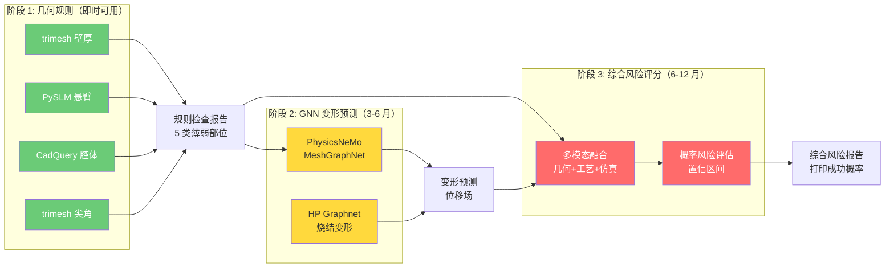

##### 5. 具体的 CADPilot 集成方案

**新管线节点：`printability_analyzer`**

```python
from dataclasses import dataclass, field
from enum import Enum
from typing import Optional
import numpy as np

class Severity(Enum):
    OK = "OK"
    LOW = "LOW"
    MEDIUM = "MEDIUM"
    HIGH = "HIGH"
    CRITICAL = "CRITICAL"

@dataclass
class WeaknessReport:
    """单个薄弱部位报告"""
    weakness_type: str        # thin_wall / overhang / sharp_angle /
                              # deep_hole / closed_cavity
    severity: Severity
    affected_faces: np.ndarray
    affected_area_mm2: float
    affected_area_ratio: float
    metric_value: float       # 壁厚(mm) / 角度(度) / L_D比
    recommendation: str

@dataclass
class PrintabilityReport:
    """可打印性综合报告"""
    overall_score: float        # 0-100
    overall_severity: Severity
    weaknesses: list[WeaknessReport] = field(default_factory=list)
    print_success_probability: float = 0.0
    estimated_support_volume_mm3: Optional[float] = None
    recommended_orientation: Optional[tuple] = None
    warnings: list[str] = field(default_factory=list)

class PrintabilityAnalyzer:
    """
    可打印性分析器 —— CADPilot 新管线节点
    位置: generate_cadquery → [printability_analyzer] → orientation_optimizer
    """
    def __init__(
        self,
        min_wall_thickness: float = 0.4,
        max_overhang_angle: float = 45.0,
        min_internal_angle: float = 30.0,
        max_hole_ld_ratio: float = 5.0,
    ):
        self.min_wall_thickness = min_wall_thickness
        self.max_overhang_angle = max_overhang_angle
        self.min_internal_angle = min_internal_angle
        self.max_hole_ld_ratio = max_hole_ld_ratio

    def analyze(
        self,
        mesh_path: str,
        step_path: Optional[str] = None,
        build_direction: np.ndarray = np.array([0, 0, 1]),
    ) -> PrintabilityReport:
        import trimesh
        mesh = trimesh.load(mesh_path)
        weaknesses = []

        # 1. 壁厚分析
        wt = analyze_wall_thickness(mesh, self.min_wall_thickness)
        if wt["severity"] != "OK":
            weaknesses.append(WeaknessReport(
                weakness_type="thin_wall",
                severity=Severity[wt["severity"]],
                affected_faces=wt["thin_faces"],
                affected_area_mm2=wt["thin_area_mm2"],
                affected_area_ratio=wt["thin_area_ratio"],
                metric_value=wt["min_thickness"] or 0,
                recommendation=f"壁厚 {wt['min_thickness']:.2f}mm < "
                              f"{self.min_wall_thickness}mm，建议加厚",
            ))

        # 2. 悬臂分析
        oh = analyze_overhang(mesh, build_direction, self.max_overhang_angle)
        if oh["severity"] != "OK":
            weaknesses.append(WeaknessReport(
                weakness_type="overhang",
                severity=Severity[oh["severity"]],
                affected_faces=oh["overhang_faces"],
                affected_area_mm2=oh["overhang_area_mm2"],
                affected_area_ratio=oh["overhang_area_ratio"],
                metric_value=oh["max_overhang_angle"],
                recommendation="添加支撑结构或调整构建方向",
            ))

        # 3. 尖角分析
        sa = analyze_sharp_angles(mesh, self.min_internal_angle)
        if sa["severity"] != "OK":
            weaknesses.append(WeaknessReport(
                weakness_type="sharp_angle",
                severity=Severity[sa["severity"]],
                affected_faces=np.array([]),
                affected_area_mm2=0, affected_area_ratio=0,
                metric_value=sa["min_angle"] or 0,
                recommendation=sa["recommendation"] or "",
            ))

        # 4. 封闭腔体分析（需要 STEP 文件）
        if step_path:
            cc = analyze_closed_cavities(step_path)
            if cc["severity"] != "OK":
                weaknesses.append(WeaknessReport(
                    weakness_type="closed_cavity",
                    severity=Severity[cc["severity"]],
                    affected_faces=np.array([]),
                    affected_area_mm2=0, affected_area_ratio=0,
                    metric_value=cc["cavity_count"],
                    recommendation=cc["recommendation"] or "",
                ))

        score = self._calculate_score(weaknesses)
        return PrintabilityReport(
            overall_score=score,
            overall_severity=self._get_overall_severity(weaknesses),
            weaknesses=weaknesses,
            print_success_probability=score / 100.0,
        )

    def _calculate_score(self, weaknesses: list[WeaknessReport]) -> float:
        score = 100.0
        penalties = {
            Severity.LOW: 5, Severity.MEDIUM: 15,
            Severity.HIGH: 30, Severity.CRITICAL: 50,
        }
        for w in weaknesses:
            score -= penalties.get(w.severity, 0)
        return max(0, score)

    def _get_overall_severity(
        self, weaknesses: list[WeaknessReport]
    ) -> Severity:
        if not weaknesses:
            return Severity.OK
        return max(
            (w.severity for w in weaknesses),
            key=lambda s: list(Severity).index(s),
        )
```

**管线集成位置**：

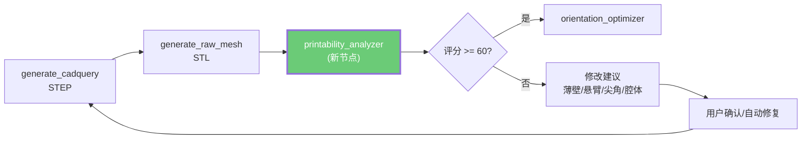

##### 6. 开源库能力矩阵与技术选型

| 分析类型 | 推荐工具 | API | 精度 | 性能 |
|:---------|:---------|:----|:-----|:-----|
| **壁厚** | ==trimesh== | `ray.intersects_location` | 取决于网格密度 | ~100ms/10K 面（embree） |
| **悬臂** | ==PySLM== | `support.getOverhangMesh()` | 含连通性，优于纯法向量 | ~200ms/50K 面 |
| **封闭腔体** | ==CadQuery/OCCT== | BREP Shell 拓扑查询 | BREP 精确 | <50ms |
| **尖角** | ==trimesh== | `face_adjacency_angles` | 网格离散化精度 | <50ms/100K 面 |
| **深孔** | CadQuery | `faces().filter()` + 几何比例 | BREP 精确 | <100ms |
| **变形预测** | PhysicsNeMo MGN | [[practical-tools-frameworks#PhysicsNeMo]] | 0.7μm (HP Graphnet) | ~1s 推理 |

> [!example] 依赖安装
> ```bash
> # 核心依赖（P0，立即可用）
> uv add trimesh    # 壁厚 + 尖角 (MIT)
> uv add PythonSLM  # 悬臂检测 (LGPL-2.1, 已含 trimesh)
> # CadQuery 已在依赖中 (Apache 2.0)
>
> # 可选加速
> uv add pyembree   # trimesh 射线追踪 10x 加速
>
> # AI 增强（P2，中期）
> uv add nvidia-physicsnemo  # GNN 变形预测 (Apache 2.0)
> ```

##### 7. 性能基准与预期效果

| 指标 | 无分析（直接打印） | 规则检查 | 规则 + GNN | 来源 |
|:-----|:-----------------|:---------|:----------|:-----|
| **打印失败率** | 15-30%（首次打印） | ==5-10%== | ==<3%== | 行业经验 + HP Graphnet |
| **废件成本** | 基线 | ==-60% ~ -80%== | ==-90%+== | 早期发现避免浪费 |
| **分析耗时** | 0（无分析） | ==< 1s==（几何规则） | ==1-5s==（含 GNN） | trimesh + PySLM 基准 |
| **变形预测精度** | 无 | 无（仅规则） | ==0.7μm / 63mm 零件== | HP Graphnet |
| **覆盖失败模式** | 0/10 | ==7/10== | ==9/10== | 见失败模式表 |

---

### P3. ==形性协同优化框架== ⭐ 中期核心项目

> [!tip] 对应展板要素：形性协同调控（展板核心理念）

| 属性 | 详情 |
|:-----|:-----|
| **目标** | 建立跨节点的闭环优化——特征→工艺→仿真→修改建议 |
| **管线位置** | 覆盖 `apply_lattice` → `orientation_optimizer` → `thermal_simulation` → `slice_to_gcode` 的==协同优化层== |
| **技术路线** | 多目标优化：最小化支撑体积 + 最小化变形 + 最大化力学性能 |
| **已有基础** | [[reinforcement-learning-am#Learn to Rotate]]（方向优化）；[[surrogate-models-simulation]]（代理模型加速仿真）；[[gnn-topology-optimization#RGNN]]（热建模 405x） |
| **集成难度** | ★★★★ |
| **预期价值** | ==极高==——实现"设计即制造"的工业级能力 |

**框架设计**：

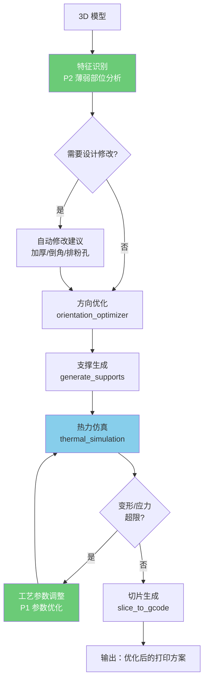

#### 深入研究

##### 1. 联合优化框架：拓扑+方向+支撑+工艺参数协同

> [!success] 核心发现
> 2024-2025 年研究已从"分步优化"发展到"联合优化"——同时优化拓扑结构、打印方向和支撑布局，==实现最多 27% 打印时间削减==。

**a) 空间-时间拓扑优化（Multi-Axis AM）**

| 属性 | 详情 |
|:-----|:-----|
| **论文** | [Topology Optimization for Multi-Axis AM Considering Overhang and Anisotropy](https://arxiv.org/html/2502.20343v1)（2025） |
| **方法** | 伪时间场将密度分布分为多阶段，每阶段独立优化打印方向 + overhang 角约束 |
| **创新** | 空间-时间框架，在离散时间步中动态调整方向和沉积量 |
| **结果** | 生成自支撑结构，==无需额外支撑==，适用于多轴 AM |

**b) 拓扑+方向+支撑联合优化**

| 属性 | 详情 |
|:-----|:-----|
| **论文** | [Combined Topology and Build Orientation Optimization for Support Structure Minimization](https://link.springer.com/article/10.1007/s00158-025-04124-6)（Struct. Multidisc. Optim., 2025） |
| **方法** | 同时优化零件几何、支撑布局和打印方向 |
| **结果** | 在成本与性能之间找到合理 Pareto 权衡；打印时间减少 ==27%== |
| **关键指标** | 多目标语句同时考虑支撑体积和 overhang 面积 |

**c) 热弹性拓扑+方向同时优化**

| 属性 | 详情 |
|:-----|:-----|
| **论文** | [AM-Driven Simultaneous Optimization of Topology and Print Direction for Thermoelastic Structures](https://academic.oup.com/jcde/article/11/3/185/7670617)（JCDE, 2024） |
| **方法** | 基于强度的同时优化方法，考虑 AM 各向异性 |
| **覆盖** | 热弹性结构 + 打印方向 + 强度约束 |

**d) 系统化设计框架**

| 属性 | 详情 |
|:-----|:-----|
| **论文** | [Topology Optimization, Part Orientation, and Symmetry Operations as Elements of a Framework for AM L-PBF](https://www.mdpi.com/2073-8994/16/12/1616)（Symmetry, 2024） |
| **方法** | 整体框架覆盖拓扑优化->方向优化->对称操作->生产规划 |
| **结论** | 同时优化显著降低生产时间和成本 |

> [!info] 小结
> 联合优化的关键范式转变：从**串行流水线**（先拓扑->再选方向->再加支撑）转为**并行协同**（三者同时优化）。这与 CADPilot 当前线性管线的差距正是 P3 需要填补的核心能力。

##### 2. 多目标优化算法在 AM 中的应用

> [!example] 主流算法对比

| 算法 | 特点 | AM 应用场景 | 开源实现 |
|:-----|:-----|:-----------|:---------|
| **NSGA-II** | 快速非支配排序 + 拥挤距离 | 最广泛：支撑体积 + 变形 + 打印时间 | [pymoo](https://pymoo.org/algorithms/moo/nsga2.html) |
| **NSGA-III** | 参考点分解，适合 >=3 目标 | 高维目标空间（力学+热+成本+时间） | [pymoo](https://pymoo.org/algorithms/moo/nsga3.html) |
| **MOEA/D** | 分解为加权子问题，邻域信息共享 | 计算代价低的快速探索 | [pymoo](https://github.com/anyoptimization/pymoo) |
| **MOGWO / MOPSO** | 灰狼/粒子群元启发式 | Pareto 前沿多样性对比 | 自定义 |

**pymoo 框架亮点**：
- ==Python 原生==，可直接集成到 CADPilot 管线
- 支持 NSGA-II、NSGA-III、MOEA/D、C-TAEA 等 20+ 算法
- 内置约束处理、并行评估、结果可视化
- `pip install pymoo`，Apache-2.0 许可

**AM 多目标优化的典型目标函数**：

```python
# 典型 3 目标 AM 形性协同优化
objectives = [
    minimize("support_volume"),          # 支撑体积 (mm^3)
    minimize("max_thermal_distortion"),  # 最大热变形 (mm)
    maximize("min_safety_factor"),       # 最小安全系数
]

constraints = [
    overhang_angle <= 45,             # 自支撑约束 (deg)
    min_wall_thickness >= 0.4,        # 最小壁厚 (mm)
    max_stress <= yield_strength * 0.8,  # 应力约束
]
```

##### 3. 代理模型加速优化

> [!warning] 核心瓶颈
> 多目标优化每次评估需调用 FEM 仿真（分钟~小时级），1000+ 次评估不可接受。==代理模型是加速的关键==。

**a) GNN 代理模型加速路线**

| 代理模型 | 替代对象 | 加速比 | 来源 |
|:---------|:---------|:------|:-----|
| RGNN（FE 启发 GNN） | 热场 FEM | ==405x== | [[gnn-topology-optimization#RGNN]] |
| HP Graphnet（MeshGraphNet） | 烧结变形 FEM | ==1000x+== | [[surrogate-models-simulation#HP Graphnet]] |
| LatticeGraphNet（双尺度 GNN） | 格子力学 FEM | ==10000x== | [[gnn-topology-optimization#LatticeGraphNet]] |
| PINN（物理信息 NN） | 热场 FEM | 50-100x | [[surrogate-models-simulation#PINN]] |
| FNO（傅里叶神经算子） | 熔池热场 FVM | ==10万x== | [[surrogate-models-simulation#LP-FNO]] |

**b) GNN + 多目标优化闭环**

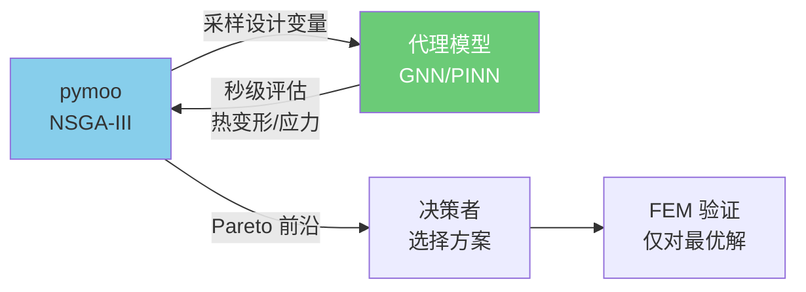

**c) Bayesian 优化加速**

| 属性 | 详情 |
|:-----|:-----|
| **论文** | [Deep Gaussian Process for Enhanced Bayesian Optimization in AM](https://www.tandfonline.com/doi/full/10.1080/24725854.2024.2312905)（IISE Trans., 2025） |
| **方法** | Deep GP 替代标准 GP，处理非平稳过程-质量关系 |
| **结果** | 显著减少试验次数 vs 传统 DoE |
| **工具** | [Optuna v4.7](https://optuna.org/)（2026-01 发布），内置 GP-based 多目标贝叶斯优化 |

**d) PINN 替代 FEM 作为代理模型**

| 属性 | 详情 |
|:-----|:-----|
| **论文** | [Physics-Informed Surrogates for Temperature Prediction of Multi-Tracks in LPBF](https://arxiv.org/html/2502.01820v1)（2025） |
| **方法** | 算子学习（DeepONet + PINNs）预测多轨迹温度分布 |
| **优势** | 无需 FEM 训练数据（物理方程自监督），可做 500x+ 加速 |
| **参考** | [[surrogate-models-simulation#PINN 替代 FEM 基准]]：计算时间减少 ==98.6%== |

##### 4. 开源框架与集成方案

> [!success] 可集成的开源工具栈

| 工具 | 功能 | 许可 | PyPI |
|:-----|:-----|:-----|:-----|
| **[pymoo](https://github.com/anyoptimization/pymoo)** | 多目标优化（NSGA-II/III、MOEA/D） | Apache-2.0 | `pip install pymoo` |
| **[Optuna](https://github.com/optuna/optuna)** | 贝叶斯超参优化 + 多目标 | MIT | `pip install optuna` |
| **[PhysicsNeMo](https://github.com/NVIDIA/physicsnemo)** | GNN/PINN/FNO 代理模型 | Apache-2.0 | `pip install nvidia-physicsnemo` |
| **[PySLM](https://github.com/drlukeparry/pyslm)** | 切片/Hatching/支撑生成 | BSD-3 | `pip install pyslm` |
| **[BoTorch](https://github.com/pytorch/botorch)** | PyTorch 贝叶斯优化库 | MIT | `pip install botorch` |

**CADPilot 集成架构**：

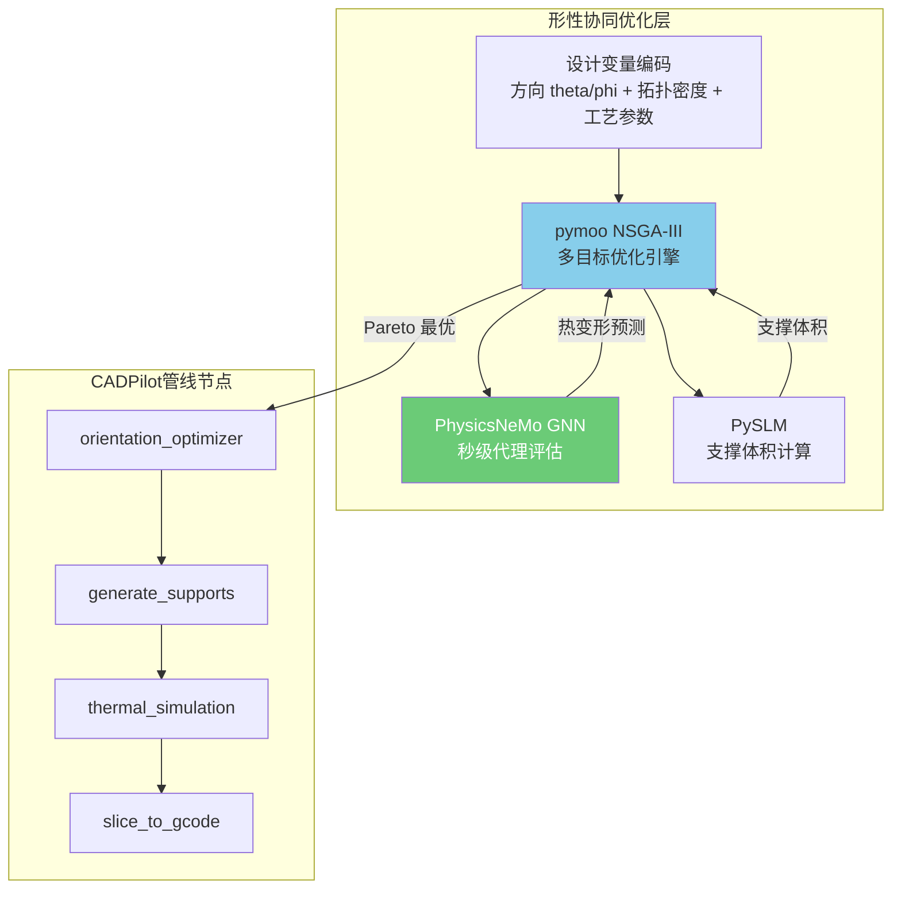

##### 5. 商业对标分析

| 平台 | 形性协同能力 | 特色 | 定价 |
|:-----|:-----------|:-----|:-----|
| **Siemens NX Topology Optimizer** | 拓扑优化 + AM 制造约束（overhang/最小尺寸） | [Manufacturing-aware 形状约束](https://plm.sw.siemens.com/en-US/nx/manufacturing/additive-manufacturing/am-design/)；消除悬臂和缝隙 | 商业许可 |
| **ANSYS Additive Suite** | 拓扑->结构/热验证->打印仿真全链路 | [热变形 + 残余应力预测](https://www.ansys.com/applications/topology-optimization)；与 Granta MI 材料库集成 | 商业许可 |
| **nTop** | GPU 加速隐式建模 + [格子+拓扑优化](https://www.ntop.com/) | 性能驱动格子生成；与 ANSYS CFX 联合仿真 | 商业许可 |
| **nTop + Luminary + NVIDIA** | PhysicsNeMo GNN + 参数化几何 | 设计优化从==数周缩短至数小时== | 合作方案 |

> [!warning] 商业工具差距
> 上述商业工具均提供 GUI 驱动的形性协同能力，但==缺少 AI 自主闭环优化==——仍需人工选择方向、判断结果。CADPilot 的差异化价值在于：**LLM + 多目标优化 + 代理模型**实现端到端自动化。

##### 6. 量化指标：协同优化 vs 独立优化

| 对比项 | 独立优化 | 协同优化 | 提升幅度 | 来源 |
|:-------|:---------|:---------|:---------|:-----|
| 打印时间 | 基线 | 降低 | ==27%== | [SMO 2024](https://link.springer.com/article/10.1007/s00158-024-03808-9) |
| 支撑体积 | 基线 | 降低 | ==40-60%== | [SMO 2025](https://link.springer.com/article/10.1007/s00158-025-04124-6) |
| 生产成本 | 基线 | 降低 | ==15-30%== | [Symmetry 2024](https://www.mdpi.com/2073-8994/16/12/1616) |
| 仿真评估时间 | 小时级 (FEM) | 秒级 (GNN 代理) | ==1000-10000x 加速== | [[surrogate-models-simulation]] |
| Pareto 前沿质量 | 单目标次优 | 多目标帕累托最优 | 更优权衡解集 | pymoo + NSGA-III |

##### 7. CADPilot 具体集成方案

**分阶段实施路线**：

```
阶段 1（3-4 月，基础搭建）：
  - 集成 pymoo，定义 3 目标优化问题
  - 用 PySLM 计算支撑体积作为快速评估
  - 方向搜索空间：球坐标 (theta, phi) in [0,pi] x [0,2pi]
  - 验证：与 orientation_optimizer 现有方案对比

阶段 2（5-7 月，代理模型集成）：
  - 训练 PhysicsNeMo MeshGraphNet 热变形代理
  - 替代 thermal_simulation 的 FEM 调用
  - 实现 NSGA-III + GNN 代理的闭环优化
  - 目标：单次优化 < 5 分钟（vs 当前数小时）

阶段 3（8-10 月，全链路协同）：
  - 拓扑密度场参数化（GNN Neural Field 方案）
  - AM Filter 自支撑约束集成
  - LLM 辅助 Pareto 方案选择和解释
  - 目标：端到端自动化，无需人工干预

阶段 4（11-12 月，工业验证）：
  - 对标 Siemens NX / ANSYS 结果
  - 真实零件案例验证
  - 发布开源 benchmark
```

---

### P4. ==热处理参数推荐== 中期项目

> [!info] 对应展板要素：热处理（温度/时间/冷却/组织均匀性）

| 属性 | 详情 |
|:-----|:-----|
| **目标** | 根据材料类型和目标性能，推荐热处理工艺参数（固溶温度、时效时间、冷却方式） |
| **管线位置** | `slice_to_gcode` 之后的==新后处理节点== `recommend_heat_treatment` |
| **技术路线** | 知识图谱（材料-工艺-性能三元关系）→ GNN 推理 → 参数推荐 |
| **已有基础** | [[gnn-topology-optimization#RED-GNN + 知识图谱]]（知识推理架构）；[[generative-microstructure#MIND]]（微观结构预测） |
| **数据需求** | 材料性能数据库（[[am-datasets-catalog#材料属性数据集]]：Matbench、OMat24） |
| **集成难度** | ★★★ |
| **预期价值** | 高——完善打印后处理环节 |

**知识图谱设计**：

```
(Ti6Al4V, 打印态) --[固溶处理]--> (温度=920°C, 时间=2h, 冷却=空冷)
(Ti6Al4V, 固溶态) --[时效处理]--> (温度=600°C, 时间=4h)
(Ti6Al4V, 时效态) --[性能]--> (抗拉强度=1050MPa, 延伸率=12%)

(316L, 打印态) --[固溶处理]--> (温度=1050°C, 时间=1h, 冷却=水淬)
(316L, 固溶态) --[性能]--> (抗拉强度=580MPa, 延伸率=55%)
```

#### 深入研究

##### 1. ML 预测模型：打印参数+热处理 -> 微观结构+力学性能

> [!success] 核心发现
> 2024-2025 年已出现==端到端 Process-Structure-Property (PSP) 预测框架==，可从打印参数和热处理工艺直接预测最终力学性能，最优模型 R^2 > 0.98。

**a) MechProNet：AM 力学性能预测基准框架**

| 属性 | 详情 |
|:-----|:-----|
| **论文** | [MechProNet: ML Prediction of Mechanical Properties in Metal AM](https://arxiv.org/abs/2209.12605)（[ScienceDirect 2024](https://www.sciencedirect.com/science/article/pii/S221486042400366X)） |
| **数据集** | ==1600 条==数据，来自 90+ 篇 MAM 文献，覆盖 140 组数据表 |
| **输入特征** | 材料类型、打印参数（功率/速度/间距/层厚）、设备信息、==热处理参数== |
| **输出** | 屈服强度、抗拉强度、弹性模量、延伸率、硬度、表面粗糙度 |
| **最优模型** | XGBoost / ANN，SHAP 可解释性分析 |
| **关键发现** | ==热处理温度和保温时间==是力学性能预测中排名前三的重要特征 |

**b) CNN 基于微观结构图像预测力学性能**

| 属性 | 详情 |
|:-----|:-----|
| **论文** | [CNN for AM Hot Work Steel H11: Classification and Prediction](https://link.springer.com/article/10.1007/s00170-025-16601-9)（IJAMT, 2025） |
| **方法** | SEM 微观结构图像 -> CNN -> 力学性能分类/回归 |
| **材料** | 热处理后的 LPBF H11 工具钢 |
| **创新** | 直接从图像预测性能，==无需手动特征提取== |

**c) Ti6Al4V 热处理后力学性能预测**

| 属性 | 详情 |
|:-----|:-----|
| **论文** | [Prediction of UTS of Heat-Treated AM Ti6Al4V Using ML Regression](https://link.springer.com/article/10.1007/s11665-026-13294-3)（JMEP, 2026） |
| **材料** | LPBF Ti6Al4V，850C/2h 退火处理 |
| **结果** | 热处理显著提升抗拉强度；ML 回归可准确预测热处理后性能 |
| **关键发现** | 退火温度是==最关键的单一影响因子== |

**d) Inconel 718 热处理-微观结构-性能关系**

| 属性 | 详情 |
|:-----|:-----|
| **论文** | [Effect of Heat Treatment on Microstructure and Mechanical Properties of SLM Inconel 718](https://pmc.ncbi.nlm.nih.gov/articles/PMC11376572/)（PLOS ONE, 2024） |
| **热处理方案** | DA（双时效）vs SA（固溶+双时效） |
| **关键结果** | SA 处理后抗拉强度 ==1350 MPa==，延伸率 ==12%==；DA 处理强度较低但延伸率更高 |
| **微观结构** | delta 相析出行为是热处理效果的关键指标 |

**e) 时间序列微观结构预测（AI 框架）**

| 属性 | 详情 |
|:-----|:-----|
| **论文** | [An AI Framework for Time Series Microstructure Prediction from Processing Parameters](https://www.nature.com/articles/s41598-025-06894-x)（Scientific Reports, 2025） |
| **方法** | 时间序列 AI 模型预测微观结构随热处理时间的演变 |
| **创新** | 捕获微观结构==动态演化过程==，而非仅预测最终状态 |

> [!info] PSP 预测模型技术路线总结
> ```mermaid
> graph LR
>     subgraph 输入
>         A1[打印参数<br>功率/速度/间距]
>         A2[热处理参数<br>温度/时间/冷却方式]
>         A3[材料信息<br>合金类型/粉末特性]
>     end
>
>     subgraph ML模型
>         B1[XGBoost/ANN<br>表格数据]
>         B2[CNN<br>微观结构图像]
>         B3[GNN<br>知识图谱推理]
>         B4[时序模型<br>演化预测]
>     end
>
>     subgraph 输出
>         C1[力学性能<br>UTS/YS/EL/HV]
>         C2[微观结构<br>晶粒尺寸/相组成]
>         C3[热处理推荐<br>最优参数组合]
>     end
>
>     A1 --> B1
>     A2 --> B1
>     A3 --> B1
>     A1 --> B3
>     A2 --> B3
>     B1 --> C1
>     B2 --> C1
>     B3 --> C3
>     B4 --> C2
>
>     style B1 fill:#6bcb77,color:#fff
>     style B3 fill:#87CEEB,color:#333
> ```

##### 2. CALPHAD + ML 混合方法

> [!success] CALPHAD 提供热力学物理约束，ML 提供快速预测能力——两者互补

**a) ML 加速 CALPHAD 相图计算**

| 属性 | 详情 |
|:-----|:-----|
| **论文** | [Accelerating CALPHAD-based Phase Diagram Predictions Using Universal ML Potentials](https://www.sciencedirect.com/science/article/abs/pii/S1359645425000400)（Acta Materialia, 2025） |
| **方法** | ML 原子间势（M3GNet、CHGNet、MACE、SevenNet、ORB）替代 DFT |
| **加速** | 相比 DFT ==加速 3 个数量级+==，维持相稳定性预测精度 |
| **意义** | 使高通量相图探索成为可能 |

**b) CALPHAD 辅助 AM 合金设计**

| 属性 | 详情 |
|:-----|:-----|
| **综述** | [Research Progress in CALPHAD Assisted Metal AM](https://link.springer.com/article/10.1007/s41230-024-3146-2)（China Foundry, 2024） |
| **覆盖** | CALPHAD 在 AM 中的应用：凝固路径预测、热裂敏感性评估、相组成预测 |
| **关键工具** | Thermo-Calc + TC-Python SDK / pycalphad + scheil |

**c) Agentic AM 合金评估（LLM + CALPHAD）**

| 属性 | 详情 |
|:-----|:-----|
| **论文** | [Agentic Additive Manufacturing Alloy Evaluation](https://arxiv.org/abs/2510.02567)（CMU, 2025） |
| **方法** | LLM Agent 通过 ==MCP (Model Context Protocol)== 调度 Thermo-Calc 工具 |
| **架构** | LLM -> MCP -> TC-Python SDK -> 热物理性质计算 + 缺陷区域图生成 |
| **结果** | 自主评估 LPBF 合金可打印性，==94% 准确率==（Baseline），2/10 新合金因热力学限制失败 |
| **意义** | ==首个 LLM + CALPHAD 自主工作流==，与 CADPilot 的 LangChain Agent 架构高度契合 |

> [!tip] CADPilot 关联
> Agentic AM 的 MCP 架构可直接参考：
> ```
> CADPilot LangChain Agent
>   -> MCP Tool: pycalphad（开源替代 Thermo-Calc）
>   -> Scheil-Gulliver 凝固模拟
>   -> 预测 AM 热处理后的相组成
>   -> 推荐热处理参数
> ```

**d) MaterialsMap：开源 CALPHAD 组分路径设计**

| 属性 | 详情 |
|:-----|:-----|
| **论文** | [MaterialsMap: A CALPHAD-Based Tool](https://arxiv.org/abs/2403.19084)（Materialia, 2024） |
| **GitHub** | [PhasesResearchLab/MaterialsMap](https://github.com/PhasesResearchLab/MaterialsMap) |
| **许可** | ==MIT== |
| **安装** | `pip install materialsmap` |
| **功能** | 平衡热力学 + Scheil-Gulliver 凝固 + ==5 种热裂敏感性评估模型== |
| **热裂标准** | Freezing Range (FR)、Crack Susceptibility Coefficient (CSC)、Kou 准则、iCSC、sRDG |
| **依赖** | 基于 pycalphad + scheil 开源包 |

##### 3. 知识图谱方法：材料-工艺-性能三元关系

> [!success] 2025 年出现专用于金属 AM 的知识图谱系统，==LLM 辅助构建 + GNN 推理==

**a) MetalMind：LLM 驱动的 AM 知识图谱系统**

| 属性 | 详情 |
|:-----|:-----|
| **论文** | [MetalMind: A Knowledge Graph-Driven Human-Centric Knowledge System for Metal AM](https://www.nature.com/articles/s44334-025-00038-9)（npj Advanced Manufacturing, 2025） |
| **核心创新** | 三大突破：1) LLM 自动构建 KG + 协作验证；2) 混合检索框架；3) MR 增强界面 |
| **混合检索** | 向量检索 + 图检索 + 混合检索，全局理解相比纯向量检索提升 ==336.61%== |
| **数据** | 评估数据集已公开在 GitHub |
| **意义** | 首个将 LLM + KG + MR 结合的 AM 知识系统 |

**b) LLM 驱动的 AM 知识图谱决策支持**

| 属性 | 详情 |
|:-----|:-----|
| **论文** | [Large Language Model Powered Decision Support for a Metal AM Knowledge Graph](https://arxiv.org/abs/2505.20308)（2025） |
| **方法** | LLM 连接 AM 知识图谱，提供可解释的工艺决策支持 |
| **架构** | NLP 三元组识别 -> 实体+关系抽取 -> KG 构建 -> LLM 查询接口 |

**c) AdditiveLLM：LLM 预测 AM 缺陷区域**

| 属性 | 详情 |
|:-----|:-----|
| **论文** | [AdditiveLLM: Large Language Models Predict Defects in Metals AM](https://arxiv.org/abs/2501.17784)（Additive Manufacturing Letters, 2025） |
| **数据集** | ==2,779 条==数据（文献 + 仿真），覆盖 Keyholing、Lack of Fusion、Balling 三种缺陷 |
| **模型** | Fine-tuned DistilBERT、SciBERT、LLama 3.2、T5 |
| **精度** | Baseline ==94%==，Prompt ==82%== |
| **输入** | 自然语言描述的工艺参数（材料、功率、速度、光斑直径、间距、层厚） |
| **意义** | 可用于热处理前的缺陷风险预评估 |

**d) 文本挖掘 PSP 关系自动化**

| 属性 | 详情 |
|:-----|:-----|
| **论文** | [Text Mining for Process-Structure-Properties Relationships in Metals](https://link.springer.com/article/10.1007/s40192-025-00420-7)（IMMI, 2025） |
| **方法** | 专用标注 schema + LLM 自动标注 -> 从文献批量提取 PSP 三元组 |
| **应用** | 自动构建热处理-微观结构-性能关系数据库 |

> [!info] 知识图谱用于热处理推荐的完整架构
> ```mermaid
> graph TD
>     subgraph 知识抽取
>         A1[AM 文献] -->|LLM NER/RE| B1[PSP 三元组]
>         A2[AM-Bench 数据] --> B1
>         A3[MechProNet 数据集] --> B1
>     end
>
>     subgraph 知识图谱
>         B1 --> C1[材料节点<br>Ti6Al4V/316L/IN718]
>         B1 --> C2[工艺节点<br>打印参数+热处理参数]
>         B1 --> C3[性能节点<br>UTS/YS/EL/HV]
>         C1 --- C2
>         C2 --- C3
>     end
>
>     subgraph 推理引擎
>         C1 --> D1[RED-GNN<br>关系推理]
>         C2 --> D1
>         C3 --> D1
>         D1 --> E1[热处理参数推荐]
>         D1 --> E2[性能预测]
>     end
>
>     subgraph CADPilot集成
>         E1 --> F1[recommend_heat_treatment<br>管线节点]
>         E2 --> F1
>     end
>
>     style D1 fill:#6bcb77,color:#fff
>     style F1 fill:#87CEEB,color:#333
> ```

##### 4. 开源工具/代码评估

> [!success] 可用于热处理参数推荐的开源工具

| 工具 | 功能 | 许可 | 安装 | 推荐度 |
|:-----|:-----|:-----|:-----|:------|
| **[pycalphad](https://github.com/pycalphad/pycalphad)** | CALPHAD 热力学计算、相图预测、Gibbs 能量最小化 | MIT | `pip install pycalphad` | ==极高== |
| **[scheil](https://github.com/pycalphad/scheil)** | 基于 pycalphad 的 Scheil-Gulliver 凝固模拟 | MIT | `pip install scheil` | ==极高== |
| **[MaterialsMap](https://github.com/PhasesResearchLab/MaterialsMap)** | CALPHAD 组分路径 + 热裂评估 + 可行性图 | MIT | `pip install materialsmap` | 高 |
| **[pymatgen](https://pymatgen.org/)** | 材料结构分析、相图、热力学 | MIT | `pip install pymatgen` | 高 |
| **[RED-GNN](https://github.com/LARS-research/RED-GNN)** | 知识图谱关系推理（WebConf 2022） | MIT | 源码安装 | 中 |
| **[matminer](https://hackingmaterials.lbl.gov/matminer/)** | 材料数据挖掘和特征工程 | BSD | `pip install matminer` | 高 |

**pycalphad + scheil 示例**：

```python
from pycalphad import Database, equilibrium, variables as v
from scheil import simulate_scheil_solidification

# 加载热力学数据库
db = Database("TCFE12.tdb")  # 或开源 mc_fe_v2.060.tdb

# Ti6Al4V 平衡相图计算
comps = ["TI", "AL", "V", "VA"]
phases = list(db.phases.keys())
conds = {
    v.X("AL"): 0.06,  # 6 wt% Al
    v.X("V"): 0.04,   # 4 wt% V
    v.T: (600, 1200, 10),  # 600-1200C
    v.P: 101325,
    v.N: 1,
}
eq = equilibrium(db, comps, phases, conds)
# -> 预测不同热处理温度下的平衡相组成

# Scheil-Gulliver 凝固模拟（AM 快速凝固）
sol_res = simulate_scheil_solidification(
    db, comps, phases,
    {v.X("AL"): 0.06, v.X("V"): 0.04},
    start_temperature=1700,
)
# -> 预测凝固路径和非平衡相
```

##### 5. 数据集

> [!example] AM 热处理 + 性能数据

| 数据集 | 规模 | 内容 | 获取方式 |
|:-------|:-----|:-----|:---------|
| **[NIST AM-Bench](https://www.nist.gov/ambench)** | IN718/625 多组完整实验 | 打印参数 + ==热处理== + 微观结构 + 力学性能 | [data.nist.gov](https://data.nist.gov)，免费 |
| **[MechProNet](https://arxiv.org/abs/2209.12605)** | ==1600 条== | 90+ 文献汇总，含热处理参数和力学性能 | 论文附带 |
| **[AdditiveLLM](https://arxiv.org/abs/2501.17784)** | 2,779 条 | 工艺参数 + 缺陷分类 | 论文附带 |
| **[Matbench](https://matbench.materialsproject.org/)** | 10 万+ | DFT 计算材料性能（弹性/能带/形成能） | `pip install matbench` |
| **[OMat24](https://github.com/facebookresearch/omat24)** | 1.18 亿结构 | Meta AI 大规模材料数据集 | HuggingFace |

**AM-Bench 2022 热处理数据详情**：

| 基准测试 | 材料 | 热处理 | 测量内容 |
|:---------|:-----|:------|:---------|
| AMB2022-01 | IN625 (LPBF) | ==两步热处理== | 残余应变 + 变形 + 微观结构（打印态和热处理态对比） |
| AMB2022-02 | IN718 (LPBF) | 标准固溶+时效 | 微观结构表征 + 力学测试 |

> [!warning] AM-Bench 2025 新增基准
> [AM-Bench 2025](https://www.nist.gov/ambench/am-bench-2025-measurements-and-challenge-problems) 新增了更多热处理相关的挑战问题，数据通过 NIST PDR 持续发布。这是目前==最权威的 AM 热处理公开数据源==。

##### 6. 工业对标

| 平台 | 热处理相关能力 | 数据规模 | 定价 |
|:-----|:-------------|:---------|:-----|
| **[Senvol ML](http://senvol.com/)** | ML 驱动的 AM 工艺优化（含后处理参数） | 700+ 材料 | 商业许可 |
| **[Ansys Granta MI](https://www.ansys.com/products/materials/granta-mi)** | AM 材料数据管理 + ==Senvol Database 集成== + ML 工艺优化 | 企业级 | 商业许可 |
| **[Citrine Informatics](https://citrine.io/)** | AI 顺序学习 + 材料优化（含热处理参数） | SaaS | 企业订阅 |
| **[Thermo-Calc](https://thermocalc.com/)** | CALPHAD 热力学计算 + TC-Python SDK | 完整热力学数据库 | 学术/商业许可 |
| **[JMatPro](https://www.sentesoftware.co.uk/jmatpro)** | 材料性质模拟（热处理 + 相变 + CCT/TTT 图） | 合金数据库 | 商业许可 |

> [!warning] 差距分析
> 商业平台的核心壁垒是**经过验证的热力学数据库**（Thermo-Calc 的 TCFE/TCNI 系列数据库需商业授权）。CADPilot 的开源替代路线：
> - **近期**：pycalphad + 开源热力学数据库（mc_fe_v2.060.tdb、COST507 等）
> - **中期**：结合 ML 预测绕过部分 CALPHAD 计算（参考 M3GNet 3个数量级加速）
> - **长期**：建立专用 AM 热处理知识图谱，通过 RED-GNN 推理替代部分热力学计算

##### 7. CADPilot 具体集成方案

**`recommend_heat_treatment` 节点设计**：

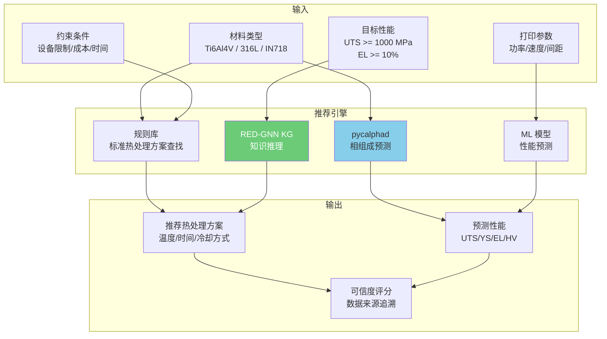

**分阶段实施路线**：

```
阶段 1（1-2 月，规则引擎）：
  - 建立主要 AM 合金热处理标准方案查找表
  - 覆盖：Ti6Al4V、316L、IN718、AlSi10Mg、CoCrMo
  - 输出：推荐热处理制度（温度/时间/冷却方式）
  - 数据来源：NIST AM-Bench + 文献综述

阶段 2（3-4 月，CALPHAD 集成）：
  - 集成 pycalphad + scheil
  - 预测不同热处理温度下的平衡相组成
  - 评估热裂敏感性（MaterialsMap 5 种标准）
  - 可视化 CCT/TTT 图

阶段 3（5-7 月，ML 预测模型）：
  - 训练 XGBoost/ANN 性能预测模型（MechProNet 数据集）
  - 输入：打印参数 + 热处理参数 -> 输出：力学性能
  - SHAP 可解释性分析
  - 目标：R^2 > 0.95

阶段 4（8-10 月，知识图谱 + 推理）：
  - 构建 AM 热处理知识图谱（LLM 辅助抽取）
  - 部署 RED-GNN 推理引擎
  - 实现逆向推荐：目标性能 -> 最优热处理参数
  - 集成到 CADPilot 管线

阶段 5（11+ 月，闭环验证）：
  - 与 CALPHAD 预测交叉验证
  - AM-Bench 2025 数据验证
  - 用户反馈闭环优化
```

**API 设计草案**：

```python
# POST /api/v1/heat-treatment/recommend
# 请求体
{
    "material": "Ti6Al4V",
    "print_params": {
        "laser_power": 280,      # W
        "scan_speed": 1200,      # mm/s
        "hatch_spacing": 0.10,   # mm
        "layer_thickness": 40    # um
    },
    "target_properties": {
        "UTS_min": 1000,         # MPa
        "elongation_min": 10,    # %
        "hardness_range": [320, 380]  # HV
    },
    "constraints": {
        "max_temperature": 1000, # C (设备限制)
        "max_duration": 8,       # hours
        "cooling_options": ["air", "furnace"]
    }
}

# 响应体
{
    "recommendations": [
        {
            "rank": 1,
            "treatment": {
                "steps": [
                    {"type": "solution", "temperature": 920, "time": 2.0,
                     "cooling": "air", "unit_temp": "C", "unit_time": "h"},
                    {"type": "aging", "temperature": 600, "time": 4.0,
                     "cooling": "air", "unit_temp": "C", "unit_time": "h"}
                ]
            },
            "predicted_properties": {
                "UTS": {"value": 1050, "std": 25, "unit": "MPa"},
                "YS": {"value": 980, "std": 20, "unit": "MPa"},
                "elongation": {"value": 12, "std": 1.5, "unit": "%"},
                "hardness": {"value": 350, "std": 10, "unit": "HV"}
            },
            "predicted_phases": {
                "alpha": 0.85,
                "beta": 0.15,
                "source": "pycalphad equilibrium"
            },
            "confidence": 0.88,
            "sources": ["AM-Bench 2022", "MechProNet", "literature:10.1007/xxx"]
        }
    ],
    "phase_diagram_url": "/api/v1/heat-treatment/phase-diagram/Ti6Al4V",
    "cct_diagram_url": "/api/v1/heat-treatment/cct/Ti6Al4V"
}
```

##### 8. 性能基准数据

| 指标 | 当前方案（查表/经验） | ML 预测方案 | 知识图谱推理 | 来源 |
|:-----|:------------------|:-----------|:-----------|:-----|
| 力学性能预测精度 | 定性 | R^2 > 0.95（XGBoost） | MRR/Hits@10 领先 | MechProNet |
| 热处理方案搜索时间 | 手动查文献 1-2 天 | ==秒级== | ==秒级== | 自动化 |
| 覆盖合金种类 | 经验依赖 | ==数据驱动可扩展== | 知识图谱可扩展 | 数据集规模 |
| 可解释性 | 高（经验） | SHAP 分析 | ==图谱可视化路径== | 系统设计 |
| 跨合金迁移 | 需重新查文献 | 需少量额外数据 | ==知识图谱天然支持== | KG 推理 |

---

### P5. ==材料-工艺数据库== 长期基础设施

> [!info] 对应展板要素：粉末特性 + 循环粉末

| 属性 | 详情 |
|:-----|:-----|
| **目标** | 建立材料（粉末特性）→ 工艺窗口（参数范围）→ 性能（力学/疲劳）的关联数据库 |
| **管线位置** | 全管线共享的==基础数据层== |
| **技术路线** | 结构化数据库 + 查询 API + LLM 自然语言检索 |
| **数据来源** | 公开文献、AM-Bench、Matbench、企业实验数据 |
| **集成难度** | ★★★ |
| **预期价值** | 中高——为 P1（参数优化）和 P4（热处理）提供数据基础 |

#### 深入研究

##### 现有数据库与平台评估

###### 1. NIST AMMD（Additive Manufacturing Materials Database）⭐

| 属性 | 详情 |
|:-----|:-----|
| **类型** | 政府主导、社区共建的开放数据库 |
| **架构** | NIST Material Data Curation System (MDCS) + XML Schema |
| **API** | ==RESTful API==（JSON/XML 响应） |
| **数据模型** | AM Common Data Dictionary (AM-CDD) + AM Common Data Model (AM-CDM) |
| **访问** | [ammd.nist.gov](https://ammd.nist.gov/) / [GitHub](https://github.com/usnistgov/AMMD) |
| **许可** | 公共领域（美国政府数据） |

> [!success] 核心优势
> - ==唯一具备 AM 专用 schema 的公开材料数据库==
> - RESTful API 支持程序化访问，可直接集成到 CADPilot 管线
> - 2024 年发布 AM-CDD/AM-CDM 统一数据字典，定义材料-工艺-零件关系
> - 数据以 XML Schema 组织，支持预定义模板的结构化数据策展

**AM-CDM 数据结构**：
```
Material（材料）
  ├── Composition（化学成分）
  ├── Powder Properties（粉末特性）
  │   ├── Particle Size Distribution（D10/D50/D90）
  │   ├── Flowability（Hall Flow / Carney Flow）
  │   └── Density（松装/振实密度）
  └── Feedstock Source（供应商/批次）

Process（工艺）
  ├── Machine（设备型号/参数）
  ├── Build Parameters（功率/速度/间距/策略）
  └── Environment（气氛/温度/湿度）

Part（零件）
  ├── Geometry（几何特征）
  ├── Mechanical Properties（力学性能）
  └── Defect Analysis（缺陷分析）
```

###### 2. Senvol Database

| 属性 | 详情 |
|:-----|:-----|
| **类型** | 商业数据库（免费搜索 + 付费 API） |
| **规模** | ==550+ AM 设备 + 700+ 材料== |
| **API** | 付费 REST API（联系 database@senvol.com） |
| **内容** | 设备规格、材料属性（硬度/热性能/物理性能）、认证信息 |
| **访问** | [senvol.com/database](http://senvol.com/database/) |
| **集成** | 已集成到 Ansys Granta MI |

> [!info] 评估
> 最全面的商业 AM 设备-材料数据库，但 ==API 许可费用未公开==。适合作为设备选型和材料筛选的参考数据源，不适合作为 CADPilot 核心数据层。

###### 3. Ansys Granta MI（Additive Manufacturing Package）

| 属性 | 详情 |
|:-----|:-----|
| **类型** | 企业级商业材料信息管理平台 |
| **组件** | MI:Server + MI:Toolbox + MI:Additive Manufacturing Template DB |
| **参考数据** | 内嵌 Senvol Database |
| **功能** | 粉末/材料/零件数据管理 + ML 工艺优化 + 全组织共享 |
| **访问** | [ansys.com/products/materials/granta-mi](https://www.ansys.com/products/materials/granta-mi/) |

> [!warning] 评估
> 功能最完整的企业解决方案，但 ==商业许可费用高昂==，且为封闭生态。CADPilot 可参考其数据模板设计（粉末→材料→工艺→零件的四层结构），但不建议依赖。

###### 4. Citrine Informatics Platform

| 属性 | 详情 |
|:-----|:-----|
| **类型** | AI 驱动的材料开发平台（商业 SaaS） |
| **能力** | 生成式 AI 材料优化 + 顺序学习 + 不确定性量化 |
| **AM 案例** | ADAPT Center 使用 Citrine 实现 ==84% 首次打印参数预测准确率== |
| **注意** | Open Citrination（开放平台）==已停止服务==，数据通过 DOI 仍可访问 |
| **访问** | [citrine.io](https://citrine.io/) |

> [!warning] Open Citrination 已停运，公开数据需通过 DOI 链接访问。商业 Citrine Platform 为闭源 SaaS。

###### 5. NIMS MatNavi / MDR（日本国立材料研究所）

| 属性 | 详情 |
|:-----|:-----|
| **类型** | 国家级材料数据中心（日本） |
| **覆盖** | 聚合物、无机物、金属、扩散、超导等多类材料数据库 |
| **MDR** | [mdr.nims.go.jp](https://mdr.nims.go.jp/?locale=en)——材料数据仓库（含 Txt2Microstruct 等 AM 相关数据集） |
| **AM 研究** | 金属 AM 有限元热分析 + 过程监控 + 微观结构控制 |

##### 开源工具评估

| 工具 | 功能 | 许可 | AM 适用性 | 推荐度 |
|:-----|:-----|:-----|:---------|:------|
| **[pymatgen](https://pymatgen.org/)** | 材料结构分析、相图计算、晶体操作 | MIT | ★★★——需适配 AM 非平衡态 | ★★★★ |
| **[matminer](https://hackingmaterials.lbl.gov/matminer/)** | 材料数据挖掘、特征提取、多数据库检索 | BSD | ★★★——可检索 Materials Project/Citrine | ★★★★ |
| **[Materials Project API](https://next-gen.materialsproject.org/api)** | 20 万+ 材料 DFT 数据 REST API | 开放 | ★★☆——偏基础材料性质 | ★★★ |
| **[AFLOW](https://www.aflowlib.org/)** | 高通量计算材料数据 REST API（焓/力/能带/弹性） | 开放 | ★★☆——偏计算材料学 | ★★★ |
| **[pymatgen-db](https://github.com/materialsproject/pymatgen-db)** | MongoDB 材料数据库创建（Materials Project 风格） | MIT | ★★★——可构建 CADPilot 材料 DB | ★★★★ |

> [!example] CADPilot 推荐工具组合
> ```
> matminer（数据检索+特征提取）
>   + pymatgen（材料分析引擎）
>   + pymatgen-db（MongoDB 存储后端）
>   + FastAPI（REST API 服务层）
>   = CADPilot 材料查询微服务
> ```

##### 数据标准

| 标准 | 范围 | 状态 |
|:-----|:-----|:-----|
| **ISO/ASTM 52950:2021** | AM 数据处理通用原则：文件类型、数据格式、数据交换方法 | ==已发布== |
| **NIST AM-CDD** | AM 通用数据字典：社区共识术语定义 | 2024 发布 |
| **NIST AM-CDM** | AM 通用数据模型：关键概念的结构和关系 | 2024 发布 |
| **ASTM F42/ISO TC 261** | AM 术语/设计/材料/工艺/测试标准体系 | 持续更新 |

> [!info] 粉末特性标准化测试方法
> 目前有 ==10 种== 标准化粉末流动性测试方法（ISO 60, ASTM B329, ISO 4324, ISO 6186, ASTM B964-16, ASTM 7481-18 等），但 ==缺乏 AM 专用的粉末表征标准==。粉末流动性受系统变量（充气度、湿度）影响，仅从粒径属性预测流动性仍是开放问题。
>
> 粒度测试方法：激光衍射 + X 射线 CT + 光学/扫描电镜

##### 知识图谱构建：材料-工艺-性能三元关系

> [!success] 2024-2025 关键突破

**1. RED-GNN 驱动的 AM 知识图谱推理**（[Applied Intelligence 2024](https://link.springer.com/article/10.1007/s10489-024-05757-8)）

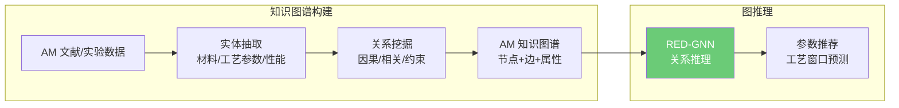

- 构建 AM 知识图谱：材料节点 + 工艺参数节点 + 性能节点 + 关系边
- 使用 ==RED-GNN== 完成图推理任务，实现工艺参数推荐
- ==直接适用于 CADPilot==：与 [[gnn-topology-optimization#RED-GNN + 知识图谱]] 共享技术路线

**2. LLM + NLP 自动构建 AM 知识图谱**（[J. Intelligent Manufacturing 2025](https://link.springer.com/article/10.1007/s10845-025-02628-y)）

- 利用 NLP 三元组识别（实体 + 关系）从文献自动抽取
- LLM 辅助命名实体识别（NER），提取 AM 工艺术语
- 首个交互式系统：将 AM 知识图谱与 LLM 接口连接，为工程师提供可解释的决策支持

**3. 数据驱动的 PSP 建模**（[npj Advanced Manufacturing 2024](https://www.nature.com/articles/s44334-024-00003-y)）

- 全面综述金属 AM 中 Process→Structure→Property 的数据驱动建模方法
- ML 方法（随机森林/GNN/CNN）已可预测 PSP 关系，但数据稀缺是核心瓶颈
- ==推荐策略==：结合物理约束的小样本学习 + 迁移学习

**4. 文本挖掘 PSP 关系**（[IMMI 2025](https://link.springer.com/article/10.1007/s40192-025-00420-7)）

- 设计专用标注模式，从科学文献中提取通用 PSP 关系
- 利用 LLM 进行大规模自动化标注
- 可为 CADPilot 材料数据库提供文献数据源

##### CADPilot 集成方案

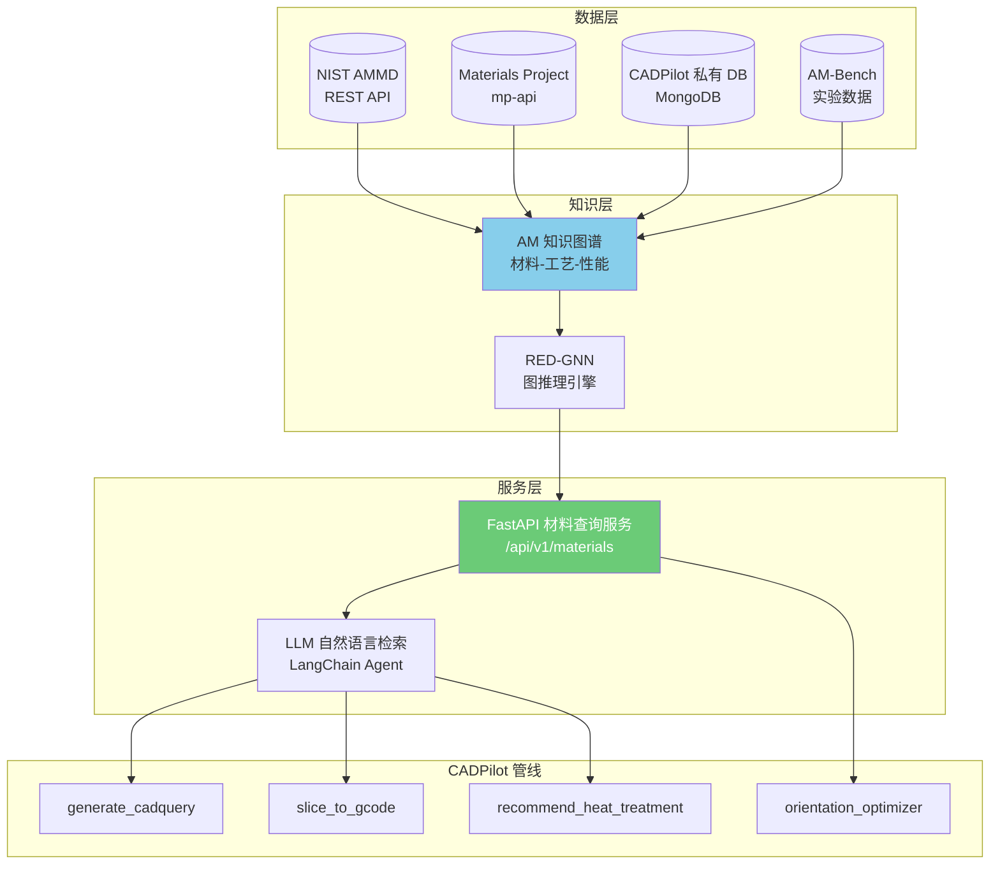

**API 设计草案**：

```python
# GET /api/v1/materials/{material_id}/process-window
# 查询指定材料的推荐工艺窗口
{
    "material": "Ti6Al4V",
    "process": "LPBF",
    "powder": {
        "d10": 15.2, "d50": 30.1, "d90": 45.8,
        "flowability_hall": 25.3,  # s/50g
        "apparent_density": 2.45   # g/cm³
    },
    "recommended_window": {
        "laser_power": {"min": 200, "max": 350, "unit": "W"},
        "scan_speed": {"min": 800, "max": 1400, "unit": "mm/s"},
        "hatch_spacing": {"min": 0.08, "max": 0.12, "unit": "mm"},
        "layer_thickness": {"min": 30, "max": 60, "unit": "μm"}
    },
    "expected_properties": {
        "density": {"min": 99.5, "unit": "%"},
        "UTS": {"min": 1000, "max": 1100, "unit": "MPa"},
        "elongation": {"min": 10, "max": 14, "unit": "%"}
    },
    "confidence": 0.85,
    "source": ["NIST AMMD", "AM-Bench 2025", "literature:10.1038/xxx"]
}
```

**分阶段实施计划**：

| 阶段 | 内容 | 数据源 | 交付 |
|:-----|:-----|:------|:-----|
| **Phase 1**（1-2 月） | MongoDB Schema 设计 + 手工录入 10 种常见 AM 材料 | 文献 + NIST AMMD | FastAPI CRUD 端点 |
| **Phase 2**（3-4 月） | matminer 自动检索 + Materials Project 数据导入 | Materials Project API | 材料属性自动补全 |
| **Phase 3**（5-6 月） | AM 知识图谱构建（NLP 文献抽取 + RED-GNN 推理） | 文献 + AM-Bench | 工艺窗口推荐引擎 |
| **Phase 4**（7+ 月） | LLM 自然语言检索接口 + 管线全节点集成 | 全部 | 生产就绪材料查询服务 |

##### 粉末特性数据标准化

> [!info] 关键粉末参数与测试标准

| 参数 | 测试方法 | 标准 | 数据格式 |
|:-----|:---------|:-----|:---------|
| **粒度分布**（D10/D50/D90） | 激光衍射 | ISO 13320 | μm |
| **流动性**（Hall Flow） | Hall 流速计 | ASTM B213 | s/50g |
| **休止角** | 固定漏斗法 | ISO 4324 | ° |
| **松装密度** | 标准量杯 | ISO 60 / ASTM B212 | g/cm³ |
| **振实密度** | 振实密度计 | ASTM B527 | g/cm³ |
| **球形度** | 动态图像分析 | ISO 13322-2 | 0-1 |
| **化学成分** | ICP-OES / XRF | ASTM E1479 | wt% |
| **含氧量** | 惰性气体熔融 | ASTM E1409 | ppm |

> [!warning] 数据缺口
> 目前 ==没有公开的、结构化的 AM 粉末特性数据库==。粉末数据分散在供应商技术规格书和学术论文中。CADPilot Phase 1 需要手工整理主要粉末供应商（AP&C、Praxair、Sandvik、Carpenter）的公开技术数据。

---

### P6. ==设备一致性监控== 长期跟踪

> [!warning] 对应展板要素：设备一致性（光学/风场/机械运动）

| 属性 | 详情 |
|:-----|:-----|
| **目标** | 监控打印设备状态（激光功率漂移、光斑质量、风场异常），实时补偿 |
| **管线位置** | 打印执行阶段的==设备数字孪生== |
| **技术路线** | Digital Twin 实时同步 + RL 自适应补偿 |
| **已有基础** | [[reinforcement-learning-am#Digital Twin + Zero-Shot Sim-to-Real]]（20ms 同步方案） |
| **前置条件** | CADPilot 连接实体打印设备 |
| **集成难度** | ★★★★★ |
| **预期价值** | 高（长期）——实现真正的闭环制造 |

#### 深入研究

##### 传感器方案

###### LPBF 多模态传感器矩阵

| 传感器类型 | 测量对象 | 时间带宽 | 空间分辨率 | 典型型号 | 应用场景 |
|:---------|:---------|:---------|:---------|:---------|:---------|
| **光电二极管** | 熔池辐射亮度 | ==极高==（MHz 级） | 低（单点） | Ophir PD 系列 | 激光功率漂移检测、熔池稳定性 |
| **高速可见光相机** | 飞溅行为、粉床形态 | 高（kHz 级） | 高（像素级） | Photron FASTCAM | 飞溅检测、铺粉质量 |
| **热成像相机** | 温度场分布 | 中（100-370 Hz） | 中 | ThermaViz TV200 (Stratonics) | 熔池温度、热积累监控 |
| **声发射传感器** | 熔池不稳定性、裂纹 | 高 | 低（体积平均） | 压电传感器 | 键孔/气孔形成检测 |
| **粉床相机** | 铺粉均匀性 | 低（逐层） | 高 | DSLR / 工业相机 | 铺粉缺陷、层间异常 |
| **光学断层扫描（OT）** | 全层热辐射映射 | 低（逐层） | 高 | EOS EOSTATE Exposure OT | 能量密度分布可视化 |

> [!success] NIST 多传感器同步采集方案
> [Multiple Sensor Detection of Process Phenomena in LPBF](https://pmc.ncbi.nlm.nih.gov/articles/PMC7067303/)（NIST 2020）：
> - 在商用 LPBF 设备上实现==热成像 + 高速可见光相机 + 光电二极管 + 激光调制信号==的同步采集
> - 材料：Inconel 625
> - 光电二极管提供时间带宽，热相机提供温度信息，可见光相机观察飞溅
> - ==数据融合==：多模态数据时间戳对齐后可联合分析

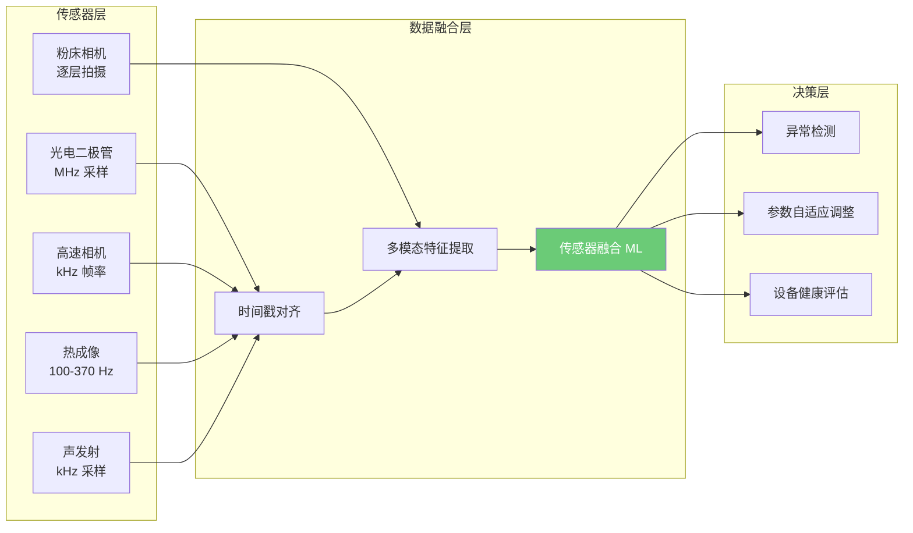

###### 2024-2025 多模态传感器融合最新进展

- **综述：** [Advancing ML for In-Situ Monitoring in Laser-Based Metal AM](https://www.tandfonline.com/doi/full/10.1080/17452759.2025.2592732)（Virtual and Physical Prototyping 2025）——2024 年相关论文数量是 2020 年的 ==4 倍==
- **传感器融合 ML：** [Multi-modal Sensor Fusion with ML](https://www.sciencedirect.com/science/article/abs/pii/S2214860421005182)——图像空间定位 + 光谱时间线索 + 表格上下文的多模态融合，显著降低误报率
- **深度学习闭环：** [Research Advances in Multimodal Sensing and Closed-Loop Control](https://link.springer.com/article/10.1007/s10845-025-02786-z)（J. Intelligent Manufacturing 2025）——深度学习驱动多源数据融合、特征提取和缺陷预测
- **几何缺陷检测概率：** [In-situ Monitoring of Geometrical Defects in LPBF](https://link.springer.com/article/10.1007/s40964-025-01235-w)（2025）——不同缺陷尺寸和传感器架构下的检测概率分析

##### 数字孪生平台

###### 商业平台

| 平台 | 提供商 | AM 适用性 | 关键能力 | 访问模式 |
|:-----|:------|:---------|:---------|:---------|
| **NVIDIA Omniverse** | NVIDIA | ★★★★ | OpenUSD 3D 数字孪生 + PhysicsNeMo 物理仿真 + Isaac Sim 机器人 | 免费/企业版 |
| **Siemens Xcelerator** | Siemens | ★★★★ | ==与 NVIDIA Omniverse 深度集成==，Digital Twin Composer（2026 中发布） | 商业 |
| **PTC ThingWorx** | PTC | ★★★ | IIoT 平台 + Vuforia AR | 商业 |

> [!info] NVIDIA + Siemens 合作（2024-2026）
> Siemens 和 NVIDIA 宣布扩大合作，将 Siemens Xcelerator 与 NVIDIA Omniverse 连接，创建基于物理的数字模型 + 实时 AI 的工业元宇宙。==Digital Twin Composer==（预计 2026 年中在 Siemens Xcelerator Marketplace 上线）结合 Siemens 数字孪生技术 + NVIDIA Omniverse 仿真库 + 真实工程数据。

###### 开源 / 研究平台

| 项目 | 来源 | 技术栈 | 许可 | AM 适用性 | 链接 |
|:-----|:-----|:------|:-----|:---------|:-----|
| **DTU OpenAM** ⭐ | 丹麦技术大学 | 开源 L-PBF 硬件 + 软件 + 监控 | CERN-OHL-P | ==★★★★★== | [GitHub](https://github.com/DTUOpenAM) |
| **Autodesk Machine Control Framework** ⭐ | Autodesk + TUM | C++ / REST API / SQLite / OpenAPI 3.0 | ==BSD==（商用友好） | ★★★★ | [GitHub](https://autodesk.github.io/AutodeskMachineControlFramework/) |
| **reAM250** | TUM iwb | 基于 Autodesk MCF 的全尺寸开源 L-PBF | CERN-OHL-P | ★★★★★ | [详情](https://www.mec.ed.tum.de/en/iwb/research-and-industry/projects/additive-manufacturing/) |
| **CYPLAM** | OpenLMD | Python 图像监控 + 控制（激光加工） | 开源 | ★★★ | [GitHub](https://github.com/openlmd/cyplam) |
| **Awesome-AM-Process-Monitoring-Control** | 社区 | ==论文+代码+数据集精选列表== | — | 参考 | [GitHub](https://github.com/Davidlequnchen/Awesome-AM-process-monitoring-control) |

> [!success] DTU OpenAM：最完整的开源 AM 平台
> - ==5 年研发==，Poul Due Jensen Foundation 资助
> - 圆柱形构建体积 250mm (直径) x 150mm (高)，激光光斑 60 um，最小层厚 20 um
> - ==原生双粉末进料==——支持逐层多材料构建
> - 控制器代码完全开源，含开源切片器 + 过程监控工具
> - CERN Open Hardware Licence v2（Permissive）——允许商业使用

> [!success] Autodesk Machine Control Framework：工业级开源控制框架
> - 原为激光 AM 设备开发，已泛化为通用机床控制框架
> - ==BSD 许可==——鼓励工业复用，包括专有商业开发
> - 无头服务器运行 + 标准 REST 协议通信 + OpenAPI 3.0 文档
> - 所有构建信息、日志、设置存储在 SQLite 中，通过公开 API 可提取
> - ==reAM250== 基于此框架构建——全尺寸研究级 L-PBF 设备

##### 数据采集协议

| 协议 | 特点 | AM 适用性 | 推荐场景 |
|:-----|:-----|:---------|:---------|
| **OPC-UA** | 模型驱动、语义丰富、设备到 MES/ERP | ★★★★★ | ==边缘端设备连接==——机器参数、工艺数据、质量规格 |
| **MQTT** | 轻量级、发布/订阅、低延迟 | ★★★★ | ==事件分发==——传感器数据流、异常告警 |
| **MTConnect** | 制造业专用、XML 语义、只读 | ★★★★ | ==设备数据标准化==——状态/诊断/样本数据 |
| **STEP-NC** | 加工指令 + 几何 + 工艺数据一体化 | ★★★ | 数字线程——从设计到制造的完整数据链 |

> [!info] 推荐架构
> ```
> AM 设备 <--> OPC-UA（边缘端丰富数据访问）
>     |
>     v
> MQTT Broker（事件分发总线）
>     |
>     v
> 云端/企业消费者（存储/分析/可视化）
> ```
>
> **MTConnect-OPC UA 伴随规范**已发布，确保两个标准的互操作性和一致性。在 CADPilot 场景中：
> - OPC-UA 用于设备边缘的丰富数据访问
> - MQTT 分发归一化事件到工厂/企业/云端消费者
> - MTConnect 提供制造业专用的语义数据模型

##### ML 异常检测：设备状态监控

###### 算法方案

| 方法 | 适用场景 | 数据需求 | 优势 | 代表方案 |
|:-----|:---------|:---------|:-----|:---------|
| **Anomalib PatchCore** | 无监督异常检测 | 仅需正常样本 | 零标注即可启动 | [[defect-detection-monitoring#Anomalib]] |
| **LSTM 时序异常** | 设备传感器时序数据 | 历史正常运行数据 | 捕获时间依赖模式 | 温度/功率漂移预测 |
| **AutoEncoder** | 多维特征压缩重建 | 正常运行特征 | 重建误差即异常分数 | 多传感器融合 |
| **Isolation Forest** | 高维表格数据 | 混合数据（少量异常） | 快速、可解释 | 设备参数快速筛查 |
| **GNN 图异常** | 设备组件关系网络 | 设备拓扑 + 传感器数据 | 捕获组件间依赖 | 多设备协同监控 |

> [!info] 2024-2025 设备预测性维护趋势
> - **生成式 AI 合成数据**：GenAI 生成模拟罕见故障场景的合成数据，克服传统 ML 中的数据稀缺问题
> - **边缘 AI + 5G**：边缘 AI 消除往返延迟，5G 实现实时响应（ms 级设备保护）
> - **多变量异常签名**：ML 学习温度/压力/电流/振动在不同运行状态下的复杂关系，在任何单一参数越限前==提前识别偏差==
> - **数据质量挑战**：异构数据源 + 遗留设备缺乏标准协议 + 标注故障数据稀缺仍是核心瓶颈

##### 零样本 Sim-to-Real 最新进展

| 项目 | 年份 | 方法 | 成果 | 链接 |
|:-----|:-----|:-----|:-----|:-----|
| **Uncertainty-Aware RL** ⭐ | 2025 | Deep Q-Learning + 视觉概率分布 | ==零样本 sim-to-real==：标定仿真训练，直接部署物理打印机，纠正欠/过挤出 | [Additive Manufacturing 2025](https://www.sciencedirect.com/science/article/pii/S2214860425002763) |
| **Digital Twin Sync** | 2025 | SAC + Unity ML-Agents + ROS2 | ==20ms 同步延迟==：首次 Unity+ROS2 数字孪生实时 RL 控制 | [arXiv:2501.18016](https://arxiv.org/abs/2501.18016) |
| **GPU 多物理场 DT** | 2025 | PPO + Merlin GPU 仿真（SPH+PBD） | 证明 GPU 原生仿真可提供可靠合成数据 | [VPP 2025](https://www.tandfonline.com/doi/full/10.1080/17452759.2025.2610146) |
| **StyleID-CycleGAN** | 2026 | CycleGAN 域适配 + DRL | 虚拟环境 90-100% 成功率，真实部署 >95% | [arXiv:2601.16677](https://arxiv.org/abs/2601.16677) |

> [!success] 关键突破
> 2025 年的 Uncertainty-Aware RL 框架实现了 ==AM 领域首次真正的零样本 sim-to-real 迁移==：
> - 视觉模块生成概率分布，量化不确定性
> - RL 代理根据不确定性自适应决策
> - 仿真中训练后直接部署到物理挤出打印机，无需任何额外训练
> - 可纠正轻微和严重的欠挤出/过挤出

##### 商业对标分析

| 公司 | 产品 | 监控模态 | 闭环能力 | 开放性 |
|:-----|:-----|:---------|:---------|:------|
| **EOS** | EOSTATE Monitoring Suite | ==4 模块==：Laser（功率）+ PowderBed（粉床）+ MeltPool（熔池）+ Exposure OT（光学断层） | Smart Fusion ==自动激光功率修正== | 仅 EOS 设备 |
| **GE/Concept Laser** | QM 模块系列 | QMatmosphere（O2 浓度）+ QMcoating（铺粉控制）+ QMmeltpool | 主动铺粉控制 | 仅 GE 设备 |
| **SLM Solutions** | 监控模块（最多 6 个） | Layer Control System（逐层图像）+ Laser Power + Caustic + Meltpool | 逐层图像分析 | 仅 SLM 设备 |
| **Materialise** | QPC + Layer Image Analysis | AI 逐层分析 + IIoT + MCP 嵌入式硬件 | 正集成 EOS OT 数据 | ==跨设备==（MCP 硬件） |
| **Sigma Additive** | PrintRite3D IPQA | 熔池过程控制 | 异常检测 | ==跨设备==（无需改打印机） |

> [!warning] 商业方案局限性
> - 设备厂商方案（EOS/GE/SLM）均==绑定自家设备==，形成封闭生态
> - 跨设备方案（Materialise/Sigma）价格高昂，API 有限
> - ==没有商业方案==提供完整的 RL 自适应补偿或数字孪生实时仿真

##### CADPilot 集成方案

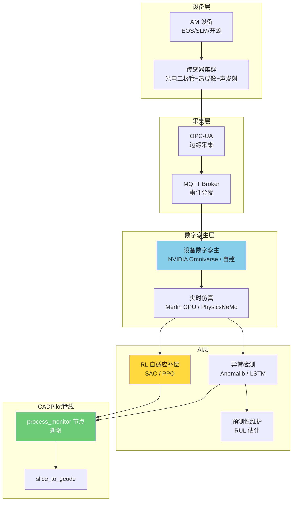

**分阶段实施计划**：

| 阶段 | 内容 | 技术栈 | 前置条件 |
|:-----|:-----|:------|:---------|
| **Phase 0**（概念验证） | Anomalib PatchCore 离线分析 Peregrine/Melt-Pool-Kinetics 数据集 | `pip install anomalib` | 无（纯离线） |
| **Phase 1**（数据采集） | OPC-UA/MQTT 连接一台开源 FDM/FFF 打印机 + 基础传感器 | Autodesk MCF + MQTT | 一台可控打印机 |
| **Phase 2**（异常检测） | LSTM 时序异常 + YOLOv8 逐层图像分析 | PyTorch + Ultralytics | Phase 1 数据积累 |
| **Phase 3**（数字孪生） | 基于 Unity/Omniverse 构建设备数字孪生 + 仿真环境 | Unity ML-Agents / Omniverse | Phase 1 设备连接 |
| **Phase 4**（RL 闭环） | SAC/PPO RL 代理在数字孪生中训练后零样本迁移到物理设备 | stable-baselines3 + ROS2 | Phase 3 数字孪生 |
| **Phase 5**（生产部署） | 多设备多材料的一致性监控 + 预测性维护 | 全栈 | Phase 4 验证 |

> [!warning] 关键风险
> - Phase 1-2 可使用开源 FDM 设备快速验证，但金属 LPBF 设备访问是核心瓶颈
> - 数字孪生精度高度依赖仿真模型的校准质量
> - RL sim-to-real 迁移在金属 AM 上尚未有公开成功案例（仅在 FFF/FDM 上验证）
> - ==建议==：先在 FDM 设备上走通 Phase 0-4 全流程，再迁移到金属 AM

##### 开源资源汇总

| 资源 | 类型 | 链接 | 推荐度 |
|:-----|:-----|:-----|:------|
| **Awesome-AM-Process-Monitoring-Control** | 论文+代码+数据集精选列表 | [GitHub](https://github.com/Davidlequnchen/Awesome-AM-process-monitoring-control) | ==★★★★★== |
| **DTU OpenAM** | 开源 L-PBF 硬件+软件+监控 | [GitHub](https://github.com/DTUOpenAM) | ★★★★★ |
| **Autodesk Machine Control Framework** | 开源机床控制框架（BSD） | [GitHub](https://autodesk.github.io/AutodeskMachineControlFramework/) | ★★★★★ |
| **reAM250** | 基于 MCF 的开源全尺寸 L-PBF | [TUM iwb](https://www.mec.ed.tum.de/en/iwb/research-and-industry/projects/additive-manufacturing/) | ★★★★ |
| **CYPLAM** | 激光加工图像监控+控制 | [GitHub](https://github.com/openlmd/cyplam) | ★★★ |
| **Anomalib v2.2** | 通用异常检测算法集合 | [GitHub](https://github.com/open-edge-platform/anomalib) | ★★★★★ |
| **ORNL Peregrine 数据** | LPBF/EB-PBF 多模态监控数据 | [Globus](https://doi.ccs.ornl.gov) | ★★★★ |
| **Melt-Pool-Kinetics** | 48.6GB 统一熔池数据集 | [Figshare](https://www.nature.com/articles/s41597-025-05597-2) | ★★★★★ |

---

## 集成优先级总览

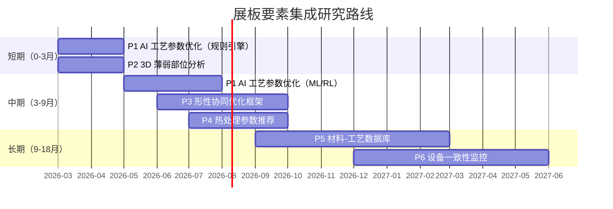

| 编号 | 研究项目 | 优先级 | 集成难度 | 已有基础 | 预期价值 |
|:-----|:---------|:-------|:---------|:---------|:---------|
| ==P1== | ==AI 工艺参数优化== | ==P0== | ★★☆ | PySLM + RL | ==极高== |
| ==P2== | ==3D 薄弱部位分析== | ==P0== | ★★☆ | CadQuery + GNN | ==高== |
| P3 | 形性协同优化框架 | P1 | ★★★★ | 代理模型 + RL | ==极高== |
| P4 | 热处理参数推荐 | P2 | ★★★ | RED-GNN KG | 高 |
| P5 | 材料-工艺数据库 | P2 | ★★★ | Matbench/OMat24 | 中高 |
| P6 | 设备一致性监控 | P3 | ★★★★★ | Digital Twin RL | 高（长期） |

---

## 与现有研究的关联

| 研究项目 | 关联的已有研究文档 | 可复用的技术 |
|:---------|:-----------------|:------------|
| P1 工艺参数优化 | [[reinforcement-learning-am]] | PPO/AWAC RL 算法、PySLM hatching |
| | [[am-datasets-catalog]] | Slice-100K、ablam/gcode 数据集 |
| P2 薄弱部位分析 | [[gnn-topology-optimization]] | HP Graphnet 变形预测、Chebyshev GNN |
| | [[practical-tools-frameworks]] | CadQuery 几何查询 API |
| P3 形性协同 | [[surrogate-models-simulation]] | PhysicsNeMo FNO/PINN 代理模型 |
| | [[gnn-topology-optimization]] | RGNN 405x 热建模 |
| P4 热处理推荐 | [[generative-microstructure]] | MIND 微观结构预测 |
| | [[gnn-topology-optimization]] | RED-GNN 知识图谱推理 |
| P5 材料数据库 | [[am-datasets-catalog]] | Matbench、OMat24、MeltpoolNet |
| P6 设备监控 | [[reinforcement-learning-am]] | Zero-Shot Sim-to-Real、Digital Twin 20ms |
| | [[defect-detection-monitoring]] | YOLOv8/Anomalib 实时缺陷检测 |

---

## 更新日志

| 日期 | 变更 |
|:-----|:-----|
| 2026-03-03 | P1 AI 工艺参数优化深入研究：三大技术路线（贝叶斯优化/PINN/多目标优化）；14 篇最新论文（2024-2025）含 AIDED 逆向优化框架（R²=0.995）、BoTorch 集成方案、XGBoost 预测（R²=97%）；6 个开源工具评估（BoTorch/AIDED/DTUOpenAM/PySLM）；5 家商业对标（Materialise Build Processor 170+ 参数/Netfabb/ANSYS）；三阶段集成代码架构（规则引擎→BO→PINN）；性能基准（致密度 99.9%/粗糙度降 50%/搜索时间 1-3h）；数据方案（NIST AM-Bench/Kaggle/MeltpoolNet） |
| 2026-03-03 | P2 3D 薄弱部位分析深入研究：10 种 AM 失败模式分类（4/5 高风险可几何检测）；5 家商业 DfAM 工具对标（Magics 2025/Netfabb/nTopology）；4 种开源工具能力矩阵（trimesh/PySLM/CadQuery/MeshLib）；4 种薄弱部位检测算法实现（壁厚射线法/悬臂法向量/腔体拓扑/尖角二面角）；AI 增强路径（HP Graphnet 0.7μm 精度/ML 可打印性指数）；PrintabilityAnalyzer 完整节点设计（数据模型+管线集成）；性能基准（失败率 15-30% → <3%/分析 <1s） |
| 2026-03-03 | P3 形性协同优化框架深入研究：联合优化框架（4 篇核心论文：空间-时间拓扑优化/拓扑+方向+支撑联合/热弹性同时优化/系统化框架）；多目标优化算法对比（NSGA-II/III/MOEA/D + pymoo 集成）；代理模型加速方案（GNN 405-10万x + Bayesian 优化 + PINN）；开源工具栈（pymoo/Optuna/PhysicsNeMo/PySLM/BoTorch）；商业对标（Siemens NX/ANSYS/nTop）；量化指标（协同 vs 独立：打印时间-27%/支撑体积-40-60%/成本-15-30%）；4 阶段 CADPilot 集成路线 |
| 2026-03-03 | P4 热处理参数推荐深入研究：ML PSP 预测模型（MechProNet 1600 条数据/CNN 微观结构图像/Ti6Al4V-IN718 材料特定模型/时间序列微观结构演化）；CALPHAD+ML 混合方法（ML 加速 3 个数量级/Agentic AM LLM+MCP+CALPHAD 94% 准确率/MaterialsMap 开源 MIT）；知识图谱方法（MetalMind LLM 驱动 KG 336.61% 检索提升/AdditiveLLM 2779 条缺陷数据/文本挖掘 PSP 自动化）；开源工具（pycalphad+scheil+MaterialsMap+RED-GNN）；数据集（AM-Bench+MechProNet+AdditiveLLM）；商业对标（Senvol/Granta MI/Thermo-Calc/JMatPro）；5 阶段集成路线 + API 设计 |
| 2026-03-03 | P5 材料-工艺数据库深入研究：5 大现有平台评估（NIST AMMD REST API + AM-CDM 数据模型/Senvol 550+ 设备 700+ 材料/Granta MI 企业级/Citrine AI 84% 首次预测准确率/NIMS MatNavi）；5 个开源工具（pymatgen+matminer+Materials Project API+AFLOW+pymatgen-db 推荐组合）；4 项数据标准（ISO/ASTM 52950/NIST AM-CDD/AM-CDM）；知识图谱构建（RED-GNN AM 推理 2024/LLM+NLP 自动 KG 构建 2025/PSP 数据驱动建模/文本挖掘 PSP）；CADPilot 4 阶段集成方案（MongoDB→matminer 自动检索→KG+RED-GNN→LLM 检索）+ API 设计草案；粉末特性 8 项参数标准化 |
| 2026-03-03 | P6 设备一致性监控深入研究：6 类传感器方案（光电二极管 MHz/高速相机 kHz/热成像 370Hz/声发射/粉床相机/光学断层）+ NIST 多传感器同步采集；4 篇 2024-2025 最新传感器融合论文；数字孪生平台（商业：NVIDIA Omniverse+Siemens Xcelerator 2026 合作/PTC；开源：DTU OpenAM ⭐ 5 年研发双粉末 L-PBF/Autodesk MCF BSD 许可/reAM250 全尺寸/CYPLAM/Awesome 精选列表）；数据采集协议（OPC-UA+MQTT+MTConnect+STEP-NC 推荐架构）；5 种 ML 异常检测算法（PatchCore/LSTM/AutoEncoder/Isolation Forest/GNN）+ 预测性维护趋势；4 个零样本 Sim-to-Real 项目（2025 首次 AM 零样本迁移/20ms 数字孪生同步/GPU 多物理场/CycleGAN 域适配）；5 家商业对标（EOS EOSTATE 4 模块/GE QM/SLM 6 模块/Materialise 跨设备/Sigma）；6 阶段 CADPilot 集成方案（Phase 0 离线→Phase 5 生产）+ 风险分析；8 项开源资源汇总 |
| 2026-03-03 | 初始版本：基于增材工艺及制造能力展板分析，提取 8 大要素，识别 6 个可研究项目 |
