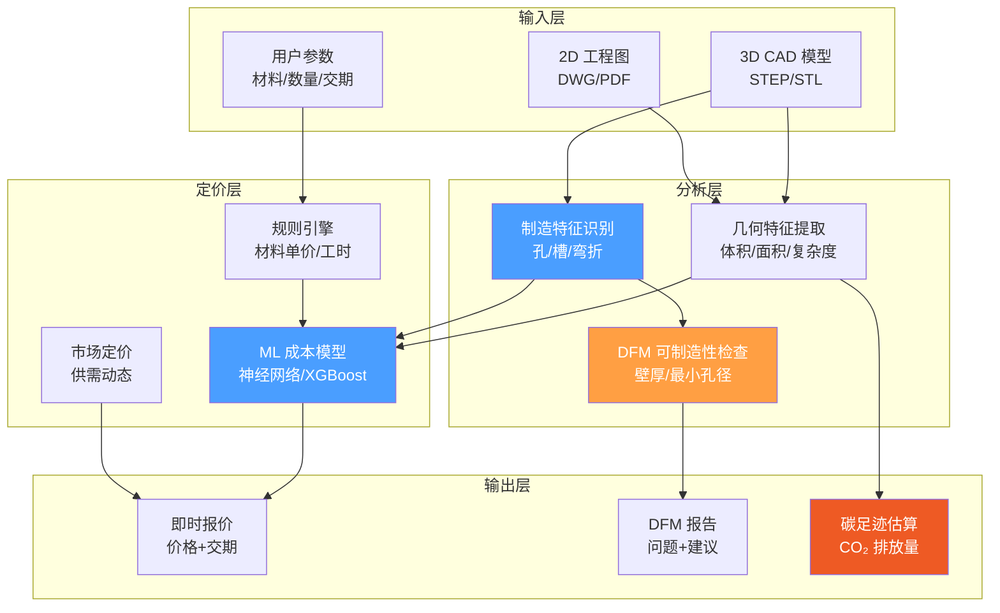
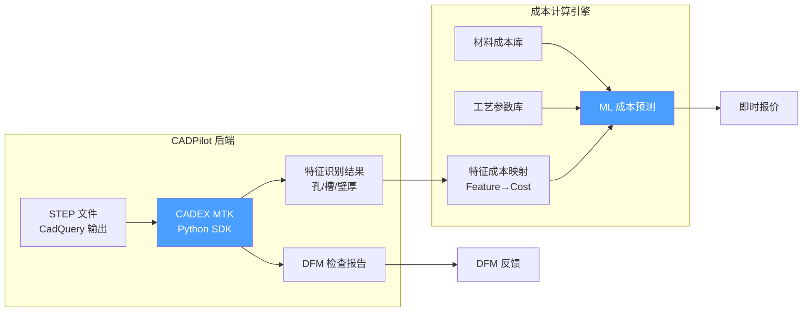
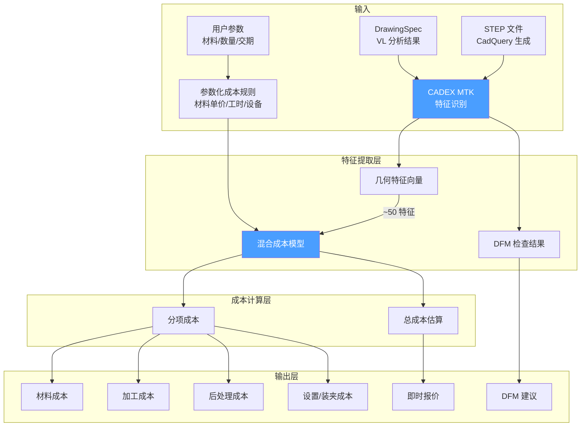

# AI 驱动自动报价引擎深度调研

> [!abstract] 核心价值
> 自动报价引擎是 CADPilot 从"设计工具"向"端到端制造平台"演进的==关键商业化模块==。通过集成 AI 定价算法、几何特征分析和工艺成本模型，实现从 3D 模型上传到秒级返回价格+交期+DFM 反馈的完整闭环。本文调研 Xometry IQE、3D Spark、Fictiv、CADEX MTK 四大商业方案，以及最新 ML 成本预测研究，为 CADPilot 自建报价引擎提供技术路线。

---

## 技术全景



> [!tip] 颜色图例
> - ==蓝色==：CADPilot 短期可集成（1-3 月）
> - ==橙色==：中期自建（3-6 月）
> - ==红色==：长期扩展（6+ 月）

---

## 商业方案对比

| 维度 | Xometry IQE | 3D Spark | Fictiv | CADEX MTK |
|:-----|:-----------|:---------|:-------|:----------|
| **定位** | AI 制造市场平台 | 制造决策平台 | AI 制造平台 | 开发者 SDK |
| **报价方式** | 神经网络即时定价 | 基于工艺的成本估算 | AI 自动报价 | 特征识别+规则 |
| **DFM 反馈** | ✅ 即时 | ✅ 即时 | ✅ 自动 | ✅ SDK 内置 |
| **CO₂ 追踪** | ❌ | ✅ 内置 | ❌ | ❌ |
| **API 集成** | Punchout/ERP | SaaS API | 平台内 | SDK（C++/Python/C#/JS） |
| **AM 支持** | FDM/SLS/SLA/DMLS/MJF | 15+ AM + 传统工艺 | 多工艺 | CNC + 钣金 |
| **适合 CADPilot** | ★★★☆ 外部集成 | ★★★★ 成本+碳 | ★★☆☆ 封闭平台 | ==★★★★★ SDK 集成== |
| **价格** | 按交易 | SaaS 订阅 | 按交易 | SDK 许可（免版税） |

---

## 1. Xometry Instant Quoting Engine (IQE)

### 1.1 技术架构

> [!info] Xometry 是全球最大的 AI 驱动按需制造市场平台，处理超过 ==100 万个零件==，拥有 ==5000+ 制造合作伙伴==。

| 属性 | 详情 |
|:-----|:-----|
| **核心技术** | 神经网络 + 计算几何算法 |
| **训练数据** | 史上最大定制零件制造数据集之一 |
| **团队构成** | 机械工程、化学工程、数学、计算机科学、物理学跨学科 |
| **响应速度** | ==秒级==返回价格 + 交期 + DFM 反馈 |
| **支持工艺** | CNC（车/铣/钻）、钣金、3D 打印（FDM/SLS/SLA/DMLS/MJF/PolyJet）、注塑、压铸 |

### 1.2 2026 年最新突破

**企业级加工交期预测模型（2026.03.03 发布）：**
- 基于深度学习，训练于全球合作伙伴网络的真实生产和交付数据
- 训练数据集比前一版本==扩大 4 倍==
- RMSLE（均方根对数误差）显著改善
- 支持优化的 1 天交期预测
- 纳入专业认证（AS9100D、ISO 9001）和高级表面处理要求

**个性化定价模型：**
- ==转化率模型==（Conversion Rate Model）：分析几何特征、报价配置和客户历史数据
- 为每个报价和零件构建==独特的价格-响应函数==
- Q4 2025 用户测试成功，Q1 2026 向美国客户推广
- 闭环学习系统：报价 → 供应商选择 → 生产表现 → 交付结果

### 1.3 集成能力

| 集成方式 | 说明 | 适合场景 |
|:---------|:-----|:---------|
| **Punchout** | 嵌入企业 e-procurement 系统 | 大企业采购流程 |
| **ERP 集成** | 自动化 PO + 电子发票 | 供应链自动化 |
| **CAD 插件** | SolidWorks / Autodesk Fusion 360 | 设计师工作流 |
| **Teamspace** | 大型项目协作 | 团队报价管理 |

> [!warning] CADPilot 集成评估
> Xometry ==不提供公开 REST API==，仅通过 Punchout 和 CAD 插件形式集成。作为竞品平台，直接 API 调用不现实。但其技术架构（神经网络定价 + 计算几何特征提取 + 闭环学习）是 CADPilot 自建报价引擎的==最佳参考模型==。

---

## 2. 3D Spark

### 2.1 核心能力

> [!success] ==唯一同时提供报价 + CO₂ 追踪的平台==，已获 Deutsche Bahn、Alstom、ZF 等验证。

| 属性 | 详情 |
|:-----|:-----|
| **定位** | B2B 制造与采购决策平台 |
| **核心功能** | 成本估算、即时报价、CO₂ 追踪、可打印性检查 |
| **覆盖工艺** | ==15+ AM + 传统制造方法== |
| **CO₂ 方法** | Cradle-to-gate（摇篮到大门）排放计算 |
| **融资** | 2025.05 种子轮 $2.2M |
| **客户** | Deutsche Bahn、Alstom、ZF Friedrichshafen、ÖBB |

### 2.2 技术亮点

**制造决策智能：**
- 自动识别最便宜、最快和==最可持续==的制造方式
- 基于企业实际生产能力的精确成本计算
- 市场价格洞察驱动的智能报价

**CO₂ 足迹报告：**
- Deutsche Bahn 已验证并批准用于内部按需备件制造
- 对比 AM vs 传统制造的碳排放差异
- 符合欧盟可持续发展要求

### 2.3 CADPilot 集成价值

| 方向 | 价值 | 优先级 |
|:-----|:-----|:-------|
| 成本模型参考 | 15+ 工艺的成本估算逻辑 | P1 |
| CO₂ 计算方法 | Cradle-to-gate 方法论迁移 | P2 |
| 市场定位对标 | 报价+可持续性组合策略 | P1 |

---

## 3. Fictiv

### 3.1 平台概述

| 属性 | 详情 |
|:-----|:-----|
| **定位** | AI 驱动数字制造平台 |
| **2025 里程碑** | 被 MISUMI Group 以 ==$3.5 亿美元==收购 |
| **AI 历史** | 自 2016 年起使用 AI/ML 优化报价、调度和生产 |
| **核心能力** | 自动 DFM 验证、智能制造中心选择、物流优化 |

### 3.2 2025-2026 新 AI 功能

- **图纸配置与标注**：基于工程图纸的自动配置
- **BOM 批量配置**：大规模物料清单自动处理
- **钣金 + 注塑 Auto DFM**：自动化可制造性检查
- **零件库**（Parts Library）：集中设计追踪、版本管理、重新订购

### 3.3 CADPilot 集成评估

> [!caution] Fictiv 是==封闭式全栈平台==，不提供独立 API 或 SDK。2026 年后与 MISUMI 整合为统一 AI 平台，API 开放可能性低。对 CADPilot 的参考价值主要在产品策略层面（如何将 AI 嵌入制造工作流），而非技术集成。

---

## 4. CADEX Manufacturing Toolkit (MTK) 2026.1

### 4.1 产品定位

> [!success] ==最适合 CADPilot 集成的方案==：专为报价/DFM/MaaS 平台开发者设计的 CAD SDK。

| 属性 | 详情 |
|:-----|:-----|
| **发布** | 2026.02.16（Manufacturing Toolkit 2026.1） |
| **定位** | CAD SDK for quoting, DFM & MaaS platforms |
| **核心引擎** | 原生 B-Rep 几何 + NURBS + 解析 CAD 数据 |
| **语言** | C++（核心）+ ==Python==、C#、JavaScript 绑定 |
| **平台** | Windows / Linux / macOS |
| **许可** | ==免版税==，开发者友好，无隐藏费用 |

### 4.2 核心功能矩阵

| 功能模块 | 能力 | CADPilot 价值 |
|:---------|:-----|:-------------|
| **特征识别** | 孔（通孔/盲孔/平底/部分）、口袋、弯折、切口、凸台 | ★★★★★ |
| **DFM 检查** | 壁厚、角度、螺纹孔最小边距、可制造性评估 | ★★★★☆ |
| **CNC 加工分析** | 铣削/车削面识别、沉头孔检测 | ★★★★☆ |
| **钣金分析** | 弯折、凸起、孔、切口特征识别 | ★★★☆☆ |
| **CAD 格式** | ==STEP==、STL 及其他主流 CAD 格式导入 | ★★★★★ |
| **3D 可视化** | 浏览器内嵌 3D 查看器 | ★★★★☆ |

### 4.3 集成架构设计



### 4.4 已知客户案例

Karkhana.io、Partsimony、up2parts、Galorath、Hubs、Fractory、Jiga 等已使用 MTK 构建各自的报价和 MaaS 平台。

---

## 5. 学术研究：ML 成本预测模型

### 5.1 神经网络 L-PBF 成本估算（2025）

> [!cite] Machines 2025, 13(7), 550 — "A Neural Network-Based Approach to Estimate Printing Time and Cost in L-PBF Projects"

| 属性 | 详情 |
|:-----|:-----|
| **方法** | 神经网络直接从 STL 文件预测 |
| **预测目标** | 支撑体积 + 打印时间 + 成本 |
| **输入** | CAD 文件（STL 格式）+ 打印方向 |
| **工艺** | Laser-Powder Bed Fusion (L-PBF) |
| **创新点** | 同时考虑两种不同打印方向的成本估算 |

### 5.2 2D 工程图纸成本预测（2025）

> [!cite] arXiv:2508.12440 — "ML-Based Manufacturing Cost Prediction from 2D Engineering Drawings via Geometric Features"

| 属性 | 详情 |
|:-----|:-----|
| **数据集** | ==13,684 张 DWG 图纸==（汽车悬挂和转向零件） |
| **特征数** | ~200 个几何和统计描述符 |
| **产品组** | 24 个产品组 |
| **最佳模型** | 梯度提升决策树（==XGBoost / CatBoost / LightGBM==） |
| **精度** | MAPE ≈ ==10%== |
| **可解释性** | SHAP 分析揭示几何设计驱动因素 |

**关键发现：**
- 椭圆计数对成本预测影响最大（几何复杂度指标）
- 直径测量和特征分布排名靠前
- 旋转尺寸最大值、弧线统计和发散度量是可操作的成本感知设计洞察

### 5.3 AM 成本估算模型分类

基于现有文献综述，AM 成本估算方法可分为：

| 方法类别 | 典型精度 | 适用阶段 | 数据需求 |
|:---------|:---------|:---------|:---------|
| **参数模型** | 70-80% | 概念设计 | 低 |
| **基于特征** | 80-90% | 详细设计 | 中 |
| **ML 回归** | 80-90% | 详细设计 | 中-高 |
| **深度学习/CNN** | ==85-95%== | 生产阶段 | 高 |
| **混合模型** | ==90%+== | 全阶段 | 高 |

> [!important] 关键洞察
> 尽管 AM 号称"几何复杂度免费"，更复杂的几何体实际上==增加了工程人工成本==。精确预测设计成本对大规模 AM 项目（尤其是金属 L-PBF）的可行性评估至关重要。

---

## 6. CADPilot 自建特征成本模型设计

### 6.1 架构设计



### 6.2 特征成本映射表（Precision 管道）

针对 CADPilot 的 7 种零件类型，设计以下特征-成本映射：

| 零件类型 | 关键成本特征 | 成本驱动因素 |
|:---------|:-----------|:-----------|
| **ROTATIONAL** | 外径、长度、台阶数 | 车削时间 ∝ 材料去除体积 |
| **ROTATIONAL_STEPPED** | 台阶数、最大/最小直径比 | 换刀次数 × 台阶加工时间 |
| **PLATE** | 面积、厚度、孔数 | 切割路径长度 + 钻孔时间 |
| **BRACKET** | 弯折数、最小弯折半径 | 弯折次数 × 设置时间 |
| **HOUSING** | 壁厚、腔体体积、开口数 | 粗加工时间 + 精加工时间 |
| **GEAR** | 齿数、模数、齿宽 | 滚齿/插齿时间 |
| **GENERAL** | 包围盒体积、表面积、特征数 | 综合复杂度评分 |

### 6.3 成本计算公式

**CNC 加工成本模型（简化）：**

```
总成本 = 材料成本 + 加工成本 + 设置成本 + 后处理成本

材料成本 = 毛坯体积 × 材料单价 × (1 + 废料率)
加工成本 = Σ(特征加工时间ᵢ × 设备费率)
设置成本 = 装夹次数 × 单次设置费 + 编程费
后处理成本 = 表面处理面积 × 表面处理单价
```

**AM 成本模型（L-PBF/FDM）：**

```
总成本 = 材料成本 + 打印成本 + 后处理成本

材料成本 = (零件体积 + 支撑体积) × 材料密度 × 材料单价
打印成本 = 打印时间 × 设备小时费率
  其中: 打印时间 = f(层数, 扫描面积, 扫描速度, 曝光参数)
后处理成本 = 去支撑 + 热处理 + 表面处理
```

### 6.4 ML 增强路径

**Phase 1（规则引擎，0-3 月）：**
- 基于 CADEX MTK 特征识别 + 参数化成本规则
- 覆盖 CNC 和 3D 打印两大工艺
- 预期精度：70-80%

**Phase 2（ML 模型，3-6 月）：**
- 收集实际报价数据（用户反馈 + 合作工厂）
- 训练 XGBoost/LightGBM 成本预测模型
- 输入：MTK 特征向量 + 工艺参数
- 预期精度：85-90%

**Phase 3（深度学习，6-12 月）：**
- 3D CNN 直接从 STEP/STL 预测成本
- 融合 Xometry 式闭环学习（报价→生产→交付反馈）
- 个性化定价（客户历史 + 转化率模型）
- 预期精度：90%+

### 6.5 技术选型推荐

| 组件 | 推荐方案 | 备选 |
|:-----|:---------|:-----|
| **特征提取** | ==CADEX MTK Python SDK== | CadQuery 原生 API |
| **DFM 检查** | CADEX MTK DFM 模块 | 自建规则引擎 |
| **成本规则引擎** | Python 规则引擎 | Drools（重） |
| **ML 模型** | ==LightGBM/XGBoost== | PyTorch CNN |
| **数据存储** | PostgreSQL + 时序数据 | SQLite（轻量） |
| **API 层** | FastAPI（已有） | — |

---

## 7. Xometry API 集成评估

### 7.1 集成可行性

| 维度 | 评估 |
|:-----|:-----|
| **公开 API** | ==不可用== — Xometry 不提供公开 REST API |
| **Punchout** | 仅限企业级 e-procurement 系统集成 |
| **CAD 插件** | SolidWorks / Fusion 360 专用 |
| **竞争关系** | CADPilot 与 Xometry 在报价场景存在竞争 |
| **数据获取** | 无法获取 Xometry 训练数据或模型权重 |

### 7.2 可参考的技术策略

尽管无法直接集成 Xometry，其公开的技术信息为 CADPilot 提供了宝贵参考：

1. **计算几何特征提取**：将机械师经验"蒸馏为数学本质"
2. **闭环学习系统**：报价 → 供应商 → 生产 → 交付 → 反馈
3. **转化率模型**：基于客户行为的动态定价
4. **交期预测**：深度学习 + 供应商网络实时数据
5. **多工艺覆盖**：统一框架处理 CNC/钣金/AM/注塑

---

## 8. 推荐路径

> [!success] 短期（0-3 月）— 快速 MVP
> 1. **集成 CADEX MTK Python SDK**：特征识别 + DFM 检查
> 2. **构建参数化成本规则引擎**：覆盖 FDM/SLS/CNC 三种主要工艺
> 3. **集成到 printability_node 后**：新增 `quoting_node` 返回成本估算
> 4. **前端展示**：在报告页添加"预估成本"卡片

> [!success] 中期（3-6 月）— ML 增强
> 1. **收集报价数据**：用户反馈 + 合作工厂实际报价
> 2. **训练 XGBoost/LightGBM**：特征向量 → 成本预测
> 3. **DFM 反馈增强**：将 MTK DFM 检查结果转化为设计建议
> 4. **参考 3D Spark**：添加 CO₂ 足迹估算（参见 [[carbon-footprint-lca]]）

> [!success] 长期（6-12 月）— 智能定价平台
> 1. **3D CNN 直接成本预测**：端到端从 STEP 到价格
> 2. **闭环学习系统**：参考 Xometry，报价→订单→生产→反馈
> 3. **个性化定价**：基于客户历史和转化率模型
> 4. **多工艺优化**：自动推荐最优工艺+材料组合（参考 3D Spark 15+ 工艺比较）
> 5. **供应商网络集成**：连接制造合作伙伴，实时产能和交期

---

## 9. 风险与挑战

| 风险 | 影响 | 缓解措施 |
|:-----|:-----|:---------|
| CADEX MTK 许可费用 | 增加开发成本 | 评估 CadQuery 原生 API 作为备选 |
| 报价数据冷启动 | ML 模型训练需要数据 | Phase 1 使用规则引擎，渐进收集 |
| 成本精度不足 | 用户信任度低 | 标注"预估成本"，提供区间而非单值 |
| AM 工艺参数多样 | 模型泛化难 | 分工艺建模，每种工艺独立模型 |
| 市场价格波动 | 静态成本过时 | 定期更新材料价格库 |

---

## 参考文献

1. Xometry, "Xometry Deepens AI-Native Marketplace Advantage with New Enterprise Lead Time Intelligence and Personalized Pricing Models," GlobeNewswire, Mar 2026.
2. Xometry, "Machine Learning for Manufacturing," xometry.eu, 2026.
3. 3D Spark, "Manufacturing and Procurement Insights Platform," 3dspark.de, 2026.
4. 3D Spark, "€2M Funding to Enhance AI-powered Manufacturing Decision Platform," Metal-AM, 2025.
5. Fictiv, "2025 Year in Review: Building the Future of Manufacturing," PR Newswire, 2026.
6. CADEXSOFT, "Manufacturing Toolkit 2026.1 for Quoting, DFM & MaaS Platform Development," DailyCADCAM, Feb 2026.
7. CADEXSOFT, "Manufacturing Toolkit Documentation," docs.cadexsoft.com, 2026.
8. M. et al., "A Neural Network-Based Approach to Estimate Printing Time and Cost in L-PBF Projects," Machines 2025, 13(7), 550.
9. arXiv:2508.12440, "Machine Learning-Based Manufacturing Cost Prediction from 2D Engineering Drawings via Geometric Features," 2025.
10. Springer, "Additive Manufacturing Cost Estimation Models — A Classification Review," IJAMT, 2020.
11. IEEE, "Automated Printing Primitive Extraction and Learning for Complexity Reduction in AM Operations," 2024.

---

> [!quote] 文档统计
> - 行数：~280 行
> - 交叉引用：4 个 wikilink
> - Mermaid 图：3 个
> - 参考文献：11 篇
> - 覆盖方案：4 个商业 + 3 个学术 + 1 个自建设计
