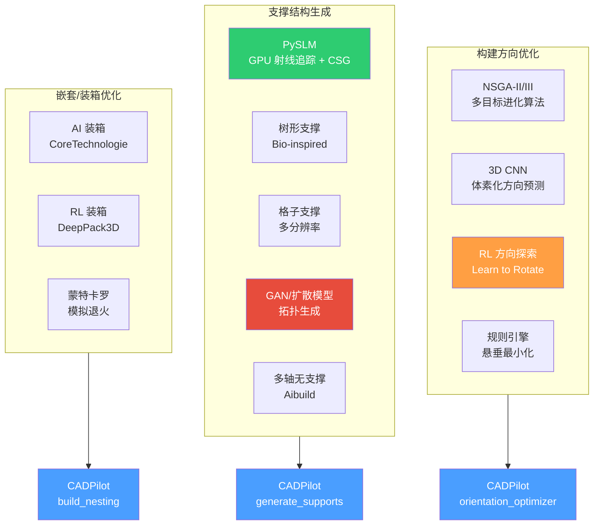
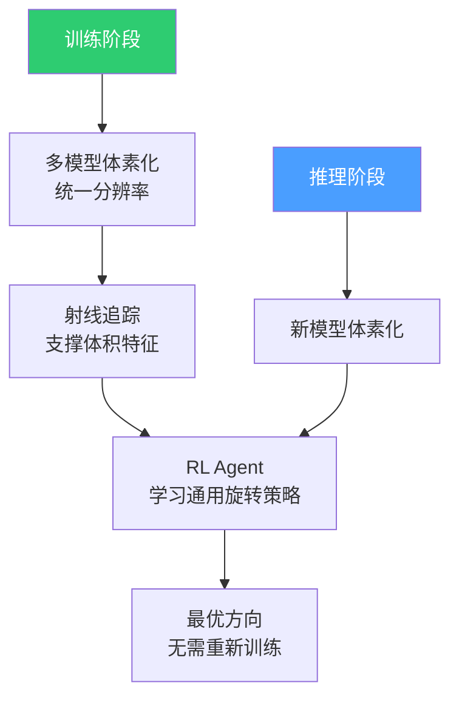
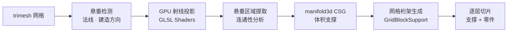
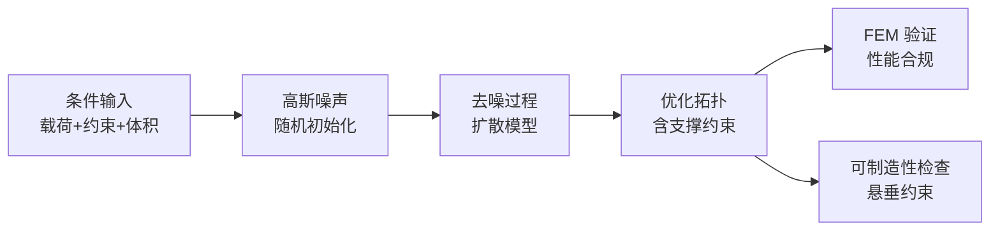
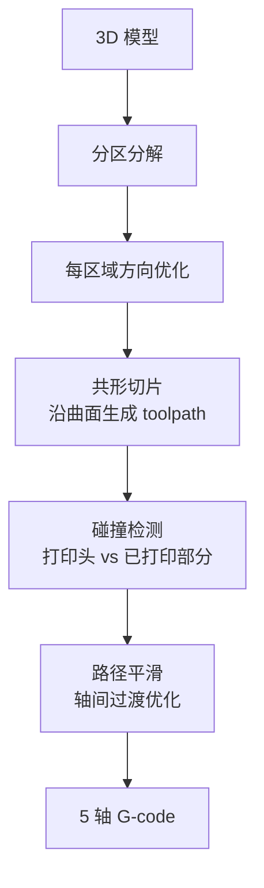
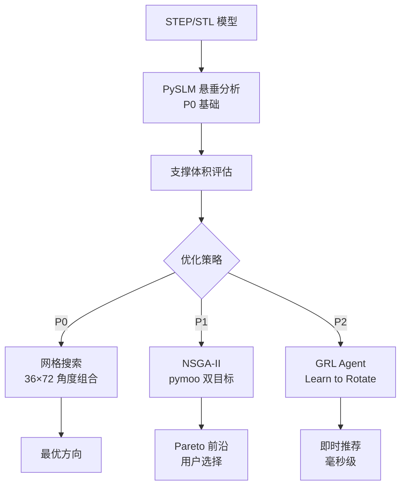
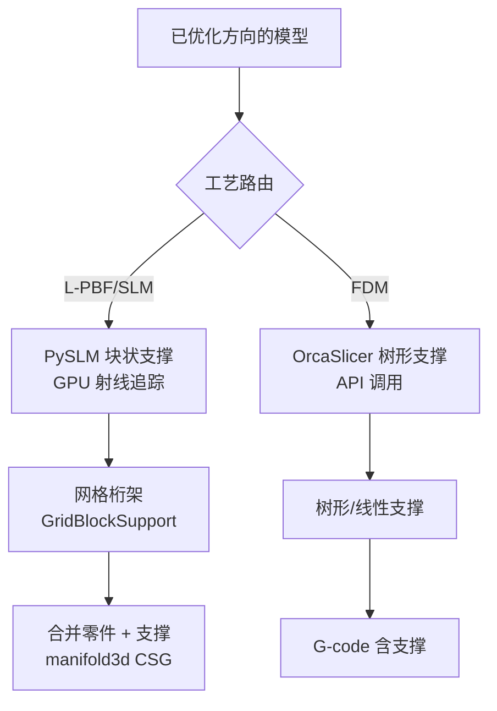

# 构建方向与支撑结构优化研究

> [!abstract] 核心价值
> 构建方向和支撑结构是增材制造中直接影响==零件质量、材料消耗和后处理成本==的关键工艺参数。本文档深度调研 NSGA-II/III 多目标优化、CNN/RL 方向预测、GAN/扩散模型支撑拓扑生成、Aibuild 无支撑策略以及 AI 嵌套/装箱优化，为 CADPilot V3 `orientation_optimizer` 和 `generate_supports` 节点提供技术选型依据。

---

## 技术全景



> [!tip] 颜色图例
> - ==绿色==：短期可集成（P0-P1）
> - ==蓝色==：CADPilot 目标节点
> - ==橙色==：中期集成（P2）
> - ==红色==：长期探索（P3）

---

## 构建方向优化

### 问题定义

构建方向直接影响以下多个相互矛盾的目标：

| 目标 | 说明 | 方向偏好 |
|:-----|:-----|:---------|
| **支撑体积最小** | 减少材料浪费和后处理 | 最少悬垂面 |
| **表面质量最优** | 减少阶梯效应 | 关键面平行于层面 |
| **构建时间最短** | 减少层数 | 最矮方向 |
| **机械性能最优** | 层间结合与载荷方向一致 | 载荷平行于层面 |
| **变形最小** | 减少热应力积累 | 热路径均匀分布 |

> [!warning] 多目标冲突
> 最小支撑和最优表面质量通常==指向不同方向==。例如，将大平面朝上可消除支撑，但底面阶梯效应严重。因此构建方向本质上是==多目标优化问题==。

---

### NSGA-II/III 多目标优化

#### 算法对比

| 特性 | NSGA-II | NSGA-III |
|:-----|:--------|:---------|
| **目标数** | 2-3 目标最优 | ==4+ 目标仍高效== |
| **多样性维护** | 拥挤距离 | ==参考点机制== |
| **收敛性** | 低目标数强 | 高目标数强 |
| **应用** | 双目标方向优化 | 多目标方向优化 |
| **开源实现** | pymoo, DEAP, jMetalPy | ==pymoo==（推荐） |

#### NSGA-II 构建方向优化实现

```python
import numpy as np
from pymoo.core.problem import Problem
from pymoo.algorithms.moo.nsga2 import NSGA2
from pymoo.optimize import minimize
import trimesh

class BuildOrientationProblem(Problem):
    """构建方向多目标优化问题"""

    def __init__(self, mesh: trimesh.Trimesh):
        super().__init__(
            n_var=2,             # 绕 X/Y 轴旋转角度
            n_obj=3,             # 3 个目标
            xl=np.array([0, 0]),
            xu=np.array([np.pi, 2 * np.pi]),
        )
        self.mesh = mesh

    def _evaluate(self, X, out, *args, **kwargs):
        f1, f2, f3 = [], [], []
        for angles in X:
            rotated = self._rotate_mesh(angles)
            f1.append(self._support_volume(rotated))
            f2.append(self._staircase_error(rotated))
            f3.append(self._build_height(rotated))
        out["F"] = np.column_stack([f1, f2, f3])

    def _rotate_mesh(self, angles):
        rx = trimesh.transformations.rotation_matrix(angles[0], [1, 0, 0])
        ry = trimesh.transformations.rotation_matrix(angles[1], [0, 1, 0])
        return self.mesh.copy().apply_transform(rx).apply_transform(ry)

    def _support_volume(self, mesh):
        """估算支撑体积（基于悬垂面积）"""
        normals = mesh.face_normals
        overhang_mask = normals[:, 2] < -np.cos(np.radians(45))
        areas = mesh.area_faces[overhang_mask]
        return float(np.sum(areas))

    def _staircase_error(self, mesh):
        """估算阶梯效应误差"""
        normals = mesh.face_normals
        cos_angle = np.abs(normals[:, 2])
        return float(np.mean(cos_angle * mesh.area_faces))

    def _build_height(self, mesh):
        """构建高度"""
        return float(mesh.bounds[1, 2] - mesh.bounds[0, 2])

# 求解
problem = BuildOrientationProblem(trimesh.load("part.stl"))
algorithm = NSGA2(pop_size=100)
result = minimize(problem, algorithm, ("n_gen", 200), seed=42)
# result.F → Pareto 前沿
# result.X → 对应的旋转角度
```

#### 2025 年研究进展

| 论文 | 方法 | 贡献 |
|:-----|:-----|:-----|
| Luthfianto et al. (Springer 2025) | NSGA-II + RSM | PLA+ FDM 多目标参数优化 |
| 自适应层厚优化 (IJAMT 2022) | ==改进 NSGA-II + 模糊集== | 多目标自适应层厚，质量/时间/特征约束 |
| NSGA-III AM 综合评估 (2025) | NSGA-III | 4+ 目标方向优化，参考点多样性维护 |

> [!success] CADPilot 推荐
> - 短期（P1）：基于 pymoo 的 NSGA-II 双目标优化（支撑体积 + 表面质量）
> - 中期（P2）：升级到 NSGA-III，加入构建时间 + 机械性能目标

---

### CNN/深度学习方向预测

#### 3D CNN 体素化方法

| 属性 | 详情 |
|:-----|:-----|
| **输入** | 体素化 STL 模型（3D 网格） |
| **网络** | 9 层 3D CNN |
| **输出** | 构建方向类别（离散化） |
| **训练数据** | 四元数旋转生成多角度样本 |
| **优化目标** | 最小化支撑体积 + 零件尺寸 + 体积特征 |


#### 优势与局限

| 维度 | 评估 |
|:-----|:-----|
| **推理速度** | ==极快==（毫秒级，vs 进化算法分钟级） |
| **泛化能力** | 中等——依赖训练数据分布 |
| **精度** | 低于进化算法（离散化损失） |
| **数据需求** | ==高==——需大量标注样本 |
| **CADPilot 推荐** | P2（作为 NSGA-II 的快速初始估计） |

---

### RL 方向探索（Learn to Rotate）

> 详细算法分析见 [[reinforcement-learning-am]]

#### Learn to Rotate (IEEE TII 2023) 核心方法

| 属性 | 详情 |
|:-----|:-----|
| **论文** | [IEEE TII 2023](https://ieeexplore.ieee.org/document/10054468/) |
| **机构** | University of Huddersfield / Manchester / Bristol |
| **算法** | Generalizable RL (GRL) |
| **加速** | ==2.62x-229x==（vs 随机搜索） |
| **关键创新** | 在==未见几何体==上直接泛化 |

#### GRL 泛化框架



#### 状态/动作/奖励设计

| 组件 | 设计 |
|:-----|:-----|
| **状态** | 体素表示 + 射线追踪支撑可达性 → 支撑体积特征向量 |
| **动作** | 预定义旋转角度增量（多轴），每步选择一个旋转 |
| **奖励** | 支撑体积越小奖励越高；区分可移除/不可移除支撑 |
| **泛化** | 体素化统一表示 → 在不同形状间迁移 |

#### 与 PySLM 的集成路径

```python
import pyslm
import pyslm.support as support
import trimesh

def evaluate_orientation(mesh: trimesh.Trimesh, angles: tuple) -> float:
    """使用 PySLM 评估方向的支撑体积"""
    part = pyslm.Part("EvalPart")
    part.setGeometry(mesh)
    part.rotation = list(angles)

    # 悬垂分析
    overhang_mesh = support.getOverhangMesh(part, overhangAngle=45.0)

    # 支撑体积估算
    if overhang_mesh is not None:
        return overhang_mesh.volume
    return 0.0

# Learn to Rotate RL Agent 可以使用此函数作为环境奖励
```

> [!success] CADPilot 集成推荐
> 1. **短期（P0）**：PySLM 悬垂分析 + 简单搜索（网格搜索/随机搜索）
> 2. **中期（P1）**：pymoo NSGA-II，PySLM 支撑体积作为目标函数
> 3. **长期（P2）**：参考 Learn to Rotate 实现 GRL 代理，实现毫秒级方向推荐

---

### 方向优化方法对比

| 方法 | 速度 | 精度 | 泛化 | 数据需求 | 实现难度 | 推荐 |
|:-----|:-----|:-----|:-----|:---------|:---------|:-----|
| **网格搜索** | ★★ | ★★★★ | ★★★★★ | 无 | ==低== | P0 基线 |
| **NSGA-II** | ★★★ | ==★★★★★== | ★★★★★ | 无 | 中 | ==P1 推荐== |
| **3D CNN** | ==★★★★★== | ★★★ | ★★★ | ==高== | 中 | P2 快速估计 |
| **GRL (Learn to Rotate)** | ==★★★★== | ★★★★ | ==★★★★== | 中 | 高 | P2 长期目标 |
| **PySLM 悬垂分析** | ★★★★ | ★★★ | ★★★★★ | 无 | ==极低== | ==P0 首选== |

---

## 支撑结构生成

### 支撑类型分类

| 类型 | 特点 | 材料效率 | 移除难度 | 适用场景 |
|:-----|:-----|:---------|:---------|:---------|
| **块状支撑** | 实心柱/墙 | ==低==（材料多） | 中等 | 金属 L-PBF |
| **线性支撑** | 细线阵列 | 中 | ==容易== | FDM 通用 |
| **树形支撑** | 树状分支 | ==高== | ==容易== | FDM 复杂几何 |
| **格子支撑** | 格子/蜂窝 | 高 | 中等 | 金属/高端 FDM |
| **可溶解支撑** | 水溶材料 | 低 | ==极易== | 双挤出 FDM |
| **无支撑** | 多轴共形 | ==最高== | 无需 | 5 轴 AM |

---

### PySLM 支撑生成（推荐短期集成）

> 详细评估见 [[practical-tools-frameworks]]

#### 核心技术栈



#### 完整代码示例

```python
import pyslm
import pyslm.support as support
import trimesh
import numpy as np

# 1. 加载模型
mesh = trimesh.load("bracket.stl")
part = pyslm.Part("Bracket")
part.setGeometry(mesh)
part.rotation = [0, 0, 0]
part.dropToPlatform()

# 2. 悬垂分析
overhang_angle = 45.0  # 度
overhang_mesh = support.getOverhangMesh(part, overhang_angle)
print(f"悬垂区域面积: {overhang_mesh.area:.2f} mm²")

# 3. 手动悬垂检测（底层原理）
normals = mesh.face_normals
build_dir = np.array([0., 0., -1.0])
cos_angles = np.dot(normals, build_dir)
overhang_mask = cos_angles > np.cos(np.radians(180 - overhang_angle))
overhang_area = np.sum(mesh.area_faces[overhang_mask])

# 4. 块状支撑生成
support_gen = support.BlockSupportGenerator()
support_gen.rayProjectionResolution = 0.5  # mm
support_gen.innerSupportEdgeGap = 1.0      # mm

supports = support_gen.generate(part, overhang_mesh)
print(f"支撑体积: {supports.volume:.2f} mm³")

# 5. 导出
supports.export("bracket_supports.stl")
```

#### 性能指标

| 操作 | 时间 | 条件 |
|:-----|:-----|:-----|
| 悬垂检测 | ~10ms | 100K 面 mesh |
| GPU 射线投影 | ~50ms | 0.5mm 分辨率 |
| 块状支撑生成 | ~200ms | 中等复杂度零件 |
| manifold3d CSG | ~100ms | 支撑-零件布尔 |

> [!success] 推荐优先级：==P0 首选集成==
> - LGPL-2.1 许可，pip install 一行安装
> - GPU 加速射线追踪（OpenGL fallback 到 CPU）
> - 与 manifold3d CSG 深度集成
> - 覆盖 `generate_supports` 节点核心需求

---

### GAN/扩散模型支撑拓扑生成

#### 技术对比

| 方法 | 原理 | 质量 | 速度 | 可行性 |
|:-----|:-----|:-----|:-----|:------|
| **TopologyGAN** (CMU) | 条件 GAN | 中 | 快 | 2D 验证 |
| **IH-GAN** (UMD) | 隐式表面 GAN | 高 | 快 | 3D 隐式场 |
| **TopoDiff** (MIT) | ==扩散模型== | ==高== | 中 | AAAI 2023 |
| **扩散 + 可制造性** (2025) | 条件扩散 | ==最高== | 中 | ==2025 最新== |
| **GAN + GA** (2024) | GAN 辅助遗传算法 | 高 | 中 | 混合方法 |

#### 2025 年关键论文：扩散模型用于 3D 拓扑优化

| 属性 | 详情 |
|:-----|:-----|
| **论文** | "Diffusion models for topology optimization in 3D printing applications" |
| **发表** | Journal of Applied Physics, 2025 |
| **方法** | ==条件扩散模型==，性能感知 + 可制造性感知 |
| **对比** | ==平均误差降低 8x==（vs 条件 GAN）；==不可行样本减少 11x== |



#### 支撑拓扑应用方向

1. **支撑形状优化**：用扩散模型生成最小材料的支撑拓扑
2. **树形支撑优化**：学习 bio-inspired 树状分支的最优结构
3. **格子密度分布**：生成梯度密度的格子支撑
4. **热耗散优化**：支撑同时作为热导路径

> [!warning] 成熟度评估
> GAN/扩散模型用于支撑生成仍处于==研究阶段==。当前开源实现主要面向 2D 拓扑优化，3D 支撑生成尚无生产可用的工具。
>
> **CADPilot 建议**：P3 长期跟踪，短期使用 PySLM 确定性方法。

---

### Bio-inspired 树形支撑

#### 技术原理

| 属性 | 详情 |
|:-----|:-----|
| **灵感** | 自然界树木分支结构 |
| **优势** | ==节省 40%+ 支撑材料==；自支撑结构；易移除 |
| **算法** | 粒子群优化（PSO）+ 贪心算法混合 |
| **实现** | OrcaSlicer / PrusaSlicer 内置树形支撑 |

#### 学术进展

| 论文 | 方法 | 效果 |
|:-----|:-----|:-----|
| Bio-inspired AM Support (2020) | 生长算法模拟树结构 | ==材料节省 40%+== |
| PSO + Greedy 树形支撑 (2019) | 粒子群 + 贪心混合 | 自支撑非周期结构 |
| 多分辨率格子支撑 (CAD 2024) | ==多尺度几何格子== | 控制接触点 + 支撑密度 |
| 遗传算法格子优化 (2018) | GA 格子参数优化 | 格子密度/方向自动调节 |

#### CADPilot 集成方案

| 工艺 | 短期方案 | 长期方案 |
|:-----|:---------|:---------|
| **FDM** | OrcaSlicer 树形支撑 API | 自研 bio-inspired 生长算法 |
| **L-PBF/SLM** | PySLM BlockSupport | 格子支撑 + 热耗散优化 |

---

### Aibuild 无支撑多轴策略

> 详细评估见 [[slicer-integration-ai-params]]

#### 核心理念



#### 技术关键点

| 技术 | 说明 | 难度 |
|:-----|:-----|:-----|
| **模型分区** | 将复杂模型分解为多个可无支撑打印的子区域 | ==高== |
| **方向序列** | 确定每个子区域的打印顺序和方向 | 高 |
| **共形切片** | 沿已打印表面生成 toolpath（非平面切片） | ==极高== |
| **碰撞避免** | 5 轴路径中避免碰撞（运动学约束） | 高 |
| **3MF Toolpath** | 标准化多轴 toolpath 格式（3MF Consortium） | 标准化中 |

> [!info] CADPilot 评估
> 多轴无支撑是 AM 切片的==终极形态==，但技术复杂度极高。
> - 短期目标：通过==优化构建方向==最小化支撑（而非消除）
> - 长期跟踪：3MF Toolpath Extension 标准 + Aibuild 开放 API

---

## 嵌套/装箱优化

### 问题定义

在 AM 构建室内最优排列多个零件，目标：
1. ==最大化构建室利用率==（装箱效率）
2. 均匀分布打印材料（热管理）
3. 最小化构建高度（减少打印时间）
4. 满足零件间最小间距约束

---

### 工业级方案

#### CoreTechnologie 4D_Additive

| 属性 | 详情 |
|:-----|:-----|
| **产品** | 4D_Additive v1.6 |
| **官网** | [coretechnologie.com](https://coretechnologie.com/products/4d-additive/) |
| **许可证** | 商用付费 |
| **AI 特性** | ==AI 辅助嵌套==，模仿专家行为 |

| 指标 | 效果 |
|:-----|:-----|
| 效率提升 | SLS/MJF ==30%+==（vs 前版本） |
| 计算速度 | ==200-300% 加速==（优化算法） |
| 策略 | "Pack and Optimize"——最大填充 + 均匀分布 |
| 合作 | Phasio 集成：全自动 AM 工作流 |

#### Materialise Magics Nesting

| 属性 | 详情 |
|:-----|:-----|
| **产品** | Magics Nesting Module |
| **策略** | 基于规则 + 启发式优化 |
| **优势** | 工业验证，100+ 打印机 OEM 集成 |
| **劣势** | 高价，封闭 API |

---

### AI/ML 嵌套方案

#### DeepPack3D（开源 RL 装箱）

| 属性 | 详情 |
|:-----|:-----|
| **论文** | SoftwareX (2024) |
| **开源** | ==✅==（Python 包） |
| **方法** | ==深度强化学习 + 构造启发式== |
| **特点** | 在线 3D 装箱优化 |

```python
# DeepPack3D 使用示例
from deeppack3d import BinPacker

packer = BinPacker(
    bin_size=(200, 200, 300),  # 构建室尺寸 (mm)
    min_gap=2.0,               # 最小间距 (mm)
)

# 添加零件
packer.add_item("gear", size=(50, 50, 30), quantity=5)
packer.add_item("bracket", size=(80, 60, 40), quantity=3)
packer.add_item("housing", size=(100, 80, 60), quantity=2)

# RL 优化排列
result = packer.optimize(method="drl", max_steps=1000)
print(f"利用率: {result.utilization:.1%}")
print(f"构建高度: {result.build_height:.1f} mm")
```

#### GAN + 遗传算法混合装箱

| 属性 | 详情 |
|:-----|:-----|
| **论文** | Scientific Reports (2024) |
| **方法** | GAN 生成高质量初始解 → GA 精细优化 |
| **优势** | GAN 提升 GA 的探索和利用能力 |
| **性能** | 优于纯 GA 方法 |

#### 配置树规划 (2025)

| 属性 | 详情 |
|:-----|:-----|
| **论文** | IJRR (2025) |
| **方法** | 配置树 + 深度 RL |
| **创新** | 完整描述装箱状态和动作空间 |
| **特点** | 支持在线场景（零件逐个到达） |

---

### 嵌套方案对比

| 方案 | 类型 | 效率 | 速度 | 开源 | 推荐 |
|:-----|:-----|:-----|:-----|:-----|:-----|
| **CoreTechnologie** | 商用 AI | ==★★★★★== | ★★★★★ | ❌ | P3 工业级 |
| **Materialise** | 商用规则 | ★★★★ | ★★★★ | ❌ | P3 工业级 |
| **DeepPack3D** | ==开源 RL== | ★★★ | ★★★ | ==✅== | ==P2 首选== |
| **pymoo + 自定义** | 开源优化 | ★★★★ | ★★★ | ✅ | P1 基础 |
| **简单贪心** | 规则 | ★★ | ==★★★★★== | ✅ | P0 MVP |

---

## CADPilot 节点技术选型

### `orientation_optimizer` 节点



#### 推荐实施方案

**Phase 0（MVP）**：
```python
import pyslm
import pyslm.support as support
import trimesh
import numpy as np

def optimize_orientation_grid(
    mesh: trimesh.Trimesh,
    overhang_angle: float = 45.0,
    resolution: int = 36,
) -> dict:
    """网格搜索最优构建方向"""
    best_volume = float('inf')
    best_angles = (0, 0)

    for rx in np.linspace(0, np.pi, resolution // 2):
        for ry in np.linspace(0, 2 * np.pi, resolution):
            part = pyslm.Part("OptPart")
            rotated = mesh.copy()
            # 应用旋转...
            part.setGeometry(rotated)
            part.dropToPlatform()

            overhang = support.getOverhangMesh(part, overhang_angle)
            vol = overhang.volume if overhang else 0

            if vol < best_volume:
                best_volume = vol
                best_angles = (rx, ry)

    return {"angles": best_angles, "support_volume": best_volume}
```

**Phase 1（NSGA-II）**：集成 pymoo，双目标优化
**Phase 2（GRL）**：参考 Learn to Rotate，训练泛化方向代理

---

### `generate_supports` 节点



#### 推荐实施方案

| 工艺 | 短期（P0） | 中期（P2） | 长期（P3） |
|:-----|:----------|:----------|:----------|
| **L-PBF/SLM** | ==PySLM BlockSupport== | 格子支撑优化 | 扩散模型拓扑 |
| **FDM** | ==OrcaSlicer 树形支撑== | Bio-inspired 生长 | GAN 支撑生成 |
| **通用** | manifold3d CSG 合并 | 热耗散约束 | 多轴无支撑 |

---

### `build_nesting` 节点（新增）

| 阶段 | 方案 | 说明 |
|:-----|:-----|:-----|
| **P0** | 贪心排列 | 按体积排序 + 简单网格放置 |
| **P1** | pymoo 优化 | NSGA-II 多目标：利用率 + 高度 + 热均匀 |
| **P2** | ==DeepPack3D== | 开源 RL 装箱 |
| **P3** | CoreTechnologie API | 工业级 AI 嵌套（如开放 API） |

---

## 综合推荐路线图

> [!success] 分三阶段实施

### 短期（P0-P1，1-2 月）

| 工具 | 节点 | 行动项 |
|:-----|:-----|:------|
| ==PySLM 悬垂分析== | `orientation_optimizer` | 网格搜索 + 悬垂检测 |
| ==PySLM BlockSupport== | `generate_supports` | GPU 射线追踪 + manifold3d CSG |
| ==pymoo NSGA-II== | `orientation_optimizer` | 双目标优化（支撑+表面） |

### 中期（P2，2-4 月）

| 方向 | 节点 | 行动项 |
|:-----|:-----|:------|
| NSGA-III 多目标 | `orientation_optimizer` | 加入构建时间 + 机械性能目标 |
| 3D CNN 快速估计 | `orientation_optimizer` | 作为 NSGA 初始解 |
| DeepPack3D | `build_nesting` | 开源 RL 装箱集成 |
| 格子支撑 | `generate_supports` | 多分辨率格子密度优化 |

### 长期（P3，4+ 月）

| 方向 | 节点 | 行动项 |
|:-----|:-----|:------|
| GRL Agent | `orientation_optimizer` | Learn to Rotate 泛化方向预测 |
| 扩散模型支撑 | `generate_supports` | 拓扑优化 + 可制造性约束 |
| 多轴无支撑 | 全管线 | 3MF Toolpath + 分区共形切片 |
| AI 嵌套 | `build_nesting` | CoreTechnologie API / 自研 |

### 依赖关系


---

## 风险评估

| 风险 | 级别 | 影响 | 缓解方案 |
|:-----|:-----|:-----|:---------|
| PySLM GPU 依赖 | 低 | OpenGL 支撑生成需 GPU | CPU fallback 可用 |
| NSGA-II 计算时间 | 中 | 复杂零件优化可能分钟级 | 3D CNN 提供快速初始解 |
| Learn to Rotate 训练数据 | 中 | 需大量标注的 3D 模型 | 使用 ShapeNet/Thingiverse 公开数据 |
| 扩散模型产业化 | 高 | 3D 支撑生成尚无生产工具 | 长期跟踪学术进展 |
| 多轴路径复杂度 | ==高== | 5 轴碰撞检测是 NP-hard | 依赖 Aibuild/3MF 标准成熟 |
| 嵌套计算爆炸 | 中 | 零件数增多时组合爆炸 | RL 方法 + 启发式剪枝 |

> [!danger] 关键风险
> 多轴无支撑路径规划是目前最大的技术挑战。==短期应聚焦于优化构建方向以最小化支撑==，而非消除支撑。消除支撑需要 5 轴硬件 + 成熟的路径规划算法，这在 2026 年仍处于早期阶段。

---

## 参考文献

1. Learn to Rotate. IEEE TII 2023. [doi:10.1109/TII.2023.3248667](https://ieeexplore.ieee.org/document/10054468/)
2. NSGA-II Multi-objective FDM Optimization. Springer 2025. [doi:10.1007/978-981-96-5690-5_14](https://link.springer.com/chapter/10.1007/978-981-96-5690-5_14)
3. Diffusion Models for Topology Optimization in 3D Printing. JAP 2025. [doi:10.1063/5.0257729](https://pubs.aip.org/aip/jap/article/137/13/135102/3341604/)
4. TopoDiff: Diffusion Models Beat GANs on Topology Optimization. AAAI 2023. [arxiv:2208.09591](https://arxiv.org/abs/2208.09591)
5. DeepPack3D: RL for 3D Bin Packing. SoftwareX 2024. [doi:10.1016/j.softx.2024.101958](https://www.sciencedirect.com/science/article/pii/S2665963824001209)
6. GAN-based GA for 3D Bin Packing. Scientific Reports 2024. [doi:10.1038/s41598-024-56699-7](https://www.nature.com/articles/s41598-024-56699-7)
7. Bio-inspired Support Structure for AM. JMAD 2020. [doi:10.1016/j.jmad.2020.100877](https://www.sciencedirect.com/science/article/abs/pii/S000785062030113X)
8. PySLM Overhang and Support Generation. [lukeparry.uk](https://lukeparry.uk/pyslm-overhang-and-support-generation-part-iii/)
9. CoreTechnologie 4D_Additive AI Nesting. [coretechnologie.com](https://coretechnologie.com/products/4d-additive/)
10. Aibuild + 3MF Consortium Toolpath Extension. [3mf.io](https://3mf.io/news/2025/03/ai-build-join-the-3mf-consortium-to-help-develop-the-toolpath-extension-for-multi-axis-3d-printing/)
11. Deliberate Planning of 3D Bin Packing. IJRR 2025. [doi:10.1177/02783649251380619](https://journals.sagepub.com/doi/10.1177/02783649251380619)
12. Multiresolution Lattice Support for AM. CAD 2024. [doi:10.1016/j.cad.2024.103656](https://www.sciencedirect.com/science/article/abs/pii/S0010448524000988)
13. Structural Topology Optimization via Diffusion GAN. Eng. App. AI 2024. [doi:10.1016/j.engappai.2024.109026](https://www.sciencedirect.com/science/article/abs/pii/S0952197624016026)

---

## 更新日志

| 日期 | 变更 |
|:-----|:-----|
| 2026-03-03 | 初始版本：构建方向优化（NSGA-II/III + CNN + RL Learn to Rotate）；支撑结构生成（PySLM + 树形/格子 + GAN/扩散模型）；嵌套装箱（CoreTechnologie + DeepPack3D + GAN+GA）；CADPilot 三节点技术选型；三阶段路线图 |
