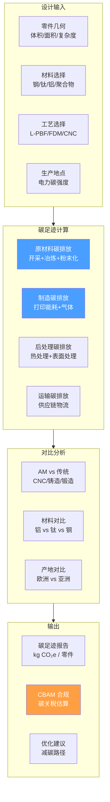

# 碳足迹与生命周期评估（LCA）深度调研

> [!abstract] 核心价值
> 碳足迹和 LCA 正从"可选报告"演变为==制造业硬性合规要求==——欧盟 CBAM 2026 年起对进口商品征收碳关税。CADPilot 可在设计阶段即提供碳足迹预估，帮助用户在 AM vs 传统制造之间做出==环境最优决策==。本文调研 AMPOWER、3D Spark、OpenLCA、CO2 AI 四大工具，以及 ML 驱动的自动化 LCA 方法，为 CADPilot 的可持续性模块提供技术路线。

---

## 技术全景



---

## 1. AM 碳减排潜力

### 1.1 宏观数据

> [!success] AM 预计到 2025 年可减排 ==1.305 ~ 5.255 亿吨 CO₂==，降低一次能源消耗 2.54 ~ 9.30 EJ。

**AM 减碳路径：**

| 路径 | 机制 | 减碳效果 |
|:-----|:-----|:---------|
| **材料效率** | 近净成形，减少材料浪费 | 高 buy-to-fly 比零件显著减碳 |
| **轻量化** | 拓扑优化减重 → 使用阶段节能 | 汽车/航空最显著 |
| **零件合并** | 多零件 → 一体化打印 | 减少装配 + 供应链 |
| **分布式制造** | 本地按需生产 | 缩短供应链，减少运输排放 |
| **按需生产** | 消除库存和过量生产 | 减少浪费 |

### 1.2 实际案例数据

| 案例 | 工艺 | 碳减排 | 来源 |
|:-----|:-----|:-------|:-----|
| 水射流叶轮 | Wire Arc DED | ==~80% CO₂ 减排== vs 传统 | Metal-AM |
| 其中 AM 直接贡献 | DED vs 砂铸 | ==30%== 额外减排 | Metal-AM |
| PBF vs CNC 铣削 | L-PBF | 显著更低 | AMPOWER |

> [!important] 关键洞察
> ==没有通用答案==——哪种工艺碳足迹最低取决于：
> 1. **合金组别**：不锈钢 vs 钛 vs 铝碳排放差异大
> 2. **零件几何**：高 buy-to-fly 比复杂件有利于 AM；简单件 CNC 可能更优
> 3. **电力来源**：生产地的电网碳强度是关键变量
> 4. **批量大小**：大批量传统工艺可能更优

---

## 2. 碳足迹工具对比

| 维度 | AMPOWER | 3D Spark | OpenLCA | CO2 AI | CarbonBright |
|:-----|:--------|:---------|:--------|:-------|:-------------|
| **定位** | AM 碳计算器 | 制造决策平台 | 开源 LCA | 企业碳管理 | 产品碳足迹 |
| **范围** | 金属 AM + 传统 | 15+ AM + 传统 | 通用 LCA | 全供应链 | 产品级 |
| **AM 支持** | ==★★★★★== | ==★★★★★== | ★★☆☆☆ | ★☆☆☆☆ | ★★☆☆☆ |
| **方法论** | Cradle-to-gate | Cradle-to-gate | ISO 14040/14044 | Scope 1-3 | ISO 14067 |
| **API** | Web 工具 | SaaS | ==Python IPC== | 商业 API | 商业 API |
| **价格** | 免费/订阅 | SaaS 订阅 | ==免费== | 企业级 | 企业级 |
| **CADPilot 价值** | ★★★★★ | ★★★★☆ | ★★★★☆ | ★★★☆☆ | ★★☆☆☆ |

---

## 3. AMPOWER Sustainability Calculator

### 3.1 核心能力

> [!success] ==唯一专注金属 AM 碳足迹的计算器==，可与传统工艺直接对比。

| 属性 | 详情 |
|:-----|:-----|
| **覆盖工艺** | AM（PBF、DED 等）+ 传统金属加工 |
| **材料** | 不锈钢、钛基、镍基、铝基合金 |
| **粒度** | 精细到每个==工艺步骤== |
| **回收** | 考虑粉末回收、加工余料回收，回收率可调 |
| **版本** | 金属版 + ==聚合物版== |

### 3.2 计算方法

**Cradle-to-gate 分解：**

```
总碳足迹 = 原材料 + 粉末化/丝材化 + 打印/加工 + 后处理
          + 气体消耗 + 能源 - 回收抵消

原材料 = 金属冶炼碳排放 × 使用量
粉末化 = 雾化工艺能耗 × 碳强度
打印   = 设备能耗 × 打印时间 × 电网碳强度
后处理 = 热处理 + 表面处理 + 去支撑 + 机加工
回收抵消 = 回收粉末/废料 × 回收率 × 原材料碳排放
```

### 3.3 CADPilot 集成方案

AMPOWER 计算器的方法论可直接迁移到 CADPilot：

1. **输入映射**：`DrawingSpec` → 材料类型 + 体积 + 工艺
2. **碳排放因子数据库**：按材料+工艺存储碳排放因子
3. **计算引擎**：基于几何和工艺参数自动计算
4. **对比展示**：AM vs 传统工艺碳足迹对比图

---

## 4. 3D Spark

> [!info] 3D Spark 同时提供报价 + CO₂ 追踪，详见 [[automated-quoting-engine]]。

| 属性 | 详情 |
|:-----|:-----|
| **CO₂ 方法** | Cradle-to-gate 排放计算 |
| **验证** | ==Deutsche Bahn 验证并批准==用于内部按需备件 |
| **覆盖** | 15+ AM + 传统制造方法 |
| **差异化** | 报价 + 碳追踪一体化，最优制造方式自动推荐 |

---

## 5. OpenLCA

### 5.1 平台概述

| 属性 | 详情 |
|:-----|:-----|
| **定位** | 专业开源 LCA 软件 |
| **标准** | ==ISO 14040 / ISO 14044== 合规 |
| **语言** | Java（桌面应用） |
| **Python 集成** | openlca-ipc Python 库（IPC 协议） |
| **数据库** | ecoinvent、GaBi、ELCD 等 |
| **许可** | ==Mozilla Public License 2.0== |

### 5.2 Python API 集成

```python
# OpenLCA IPC 集成概念
import olca_ipc as ipc

client = ipc.Client(8080)  # 连接 OpenLCA 桌面应用

# 创建 AM 产品系统
product_system = client.create_product_system(
    process_id="am_lpbf_process",
    default_providers=True
)

# 计算碳足迹
result = client.calculate(
    product_system,
    method="IPCC 2021 GWP 100a"
)

# 获取结果
gwp = result.get_total_flow_result(
    flow_id="CO2_equivalent"
)
print(f"碳足迹: {gwp.value} kg CO₂e")
```

### 5.3 新兴替代：lcpy

> [!cite] arXiv:2506.13744 (2025) — "lcpy: an open-source Python package for parametric and dynamic LCA"

纯 Python 实现的 LCA 库，无需 OpenLCA 桌面应用，更适合 CADPilot 后端集成。

---

## 6. CO2 AI（BCG）

| 属性 | 详情 |
|:-----|:-----|
| **定位** | 企业级碳管理平台 |
| **背景** | BCG 孵化，2023 年独立为软件公司 |
| **规模** | 管理 ==>3 亿吨 CO₂== |
| **能力** | Scope 1-3 排放、供应商碳数据交换、减碳路线图 |
| **客户案例** | Reckitt（25,000 产品精确排放数据，精度提升 ==75 倍==） |
| **调查** | BCG + CO2 AI 气候调查（覆盖全球 40% GHG 排放企业） |

**关键发现（2025 气候调查）：**
- ==80%+ 企业== 报告减碳带来经济收益
- 部分企业碳减排投资回报超过收入的 10%
- 领先企业使用 AI、IoT、卫星等数字化工具

> [!caution] CO2 AI 是企业级平台，定价高昂。对 CADPilot 的价值主要在方法论参考（Scope 3 供应链碳核算），不适合直接集成。

---

## 7. 欧盟 CBAM（碳边境调节机制）

### 7.1 政策要点

> [!warning] ==2026 年 1 月 1 日起正式征收碳关税==，制造业必须关注。

| 属性 | 详情 |
|:-----|:-----|
| **生效** | 2026.01.01（正式征收阶段） |
| **覆盖** | 水泥、钢铁、铝、化肥、电力、氢 |
| **机制** | 进口商购买 CBAM 证书，反映产品隐含碳排放 |
| **影响** | 预期钢铁价格上涨，汽车/建筑行业成本增加 |

### 7.2 对 AM 行业的影响

| 维度 | 影响 | CADPilot 机会 |
|:-----|:-----|:-------------|
| **钢铁/铝进口** | 粉末原材料成本可能上升 | 碳足迹优化 → 选择低碳材料 |
| **供应链** | 本地制造 vs 进口的碳成本差异 | 分布式制造推荐 |
| **合规要求** | 嵌入碳排放报告 | ==自动化碳足迹报告== |
| **竞争优势** | AM 碳效率优势可量化 | 碳足迹对比成为卖点 |

### 7.3 CADPilot CBAM 集成

CADPilot 可在报价模块中自动附加 CBAM 相关信息：
- 原材料碳排放估算
- 不同产地的碳关税差异
- AM vs 传统制造的碳成本对比

---

## 8. ML 驱动的自动化 LCA

### 8.1 研究进展

| 方法 | 输入 | 预测 | 精度 | 来源 |
|:-----|:-----|:-----|:-----|:-----|
| **全因子实验 + ML** | 层高/填充率/壁数/温度 | FDM CO₂ 排放 | 高 | MDPI 2025 |
| **CNN/DNN** | 零件几何 + 工艺参数 | 碳足迹 | 优于传统 LCA | 多篇 2025 |
| **ML + 协同设计** | 设计+工艺参数 | 环境影响 | 中-高 | ScienceDirect 2023 |
| **AI 增强 LCA** | 制造参数 → 环境结果 | 全生命周期 | 中 | Springer 2025 |

### 8.2 关键发现

**FDM CO₂ 预测参数影响排序：**
1. ==填充密度==（最大影响）— 直接影响材料用量和能耗
2. 层高
3. 壁/周长数
4. 喷嘴温度

**自动化 LCA 框架设计要素：**
- 数据驱动的 ML + 产品-工艺协同设计
- 参数化 LCA：设计参数变化 → 自动重新计算
- 动态 LCA：随时间和地点变化的碳强度

### 8.3 CADPilot ML 碳足迹预测

```python
# 基于零件几何的碳足迹预测模型
class CarbonFootprintPredictor:
    """ML 驱动的碳足迹自动预测"""

    def predict(self, spec: DrawingSpec,
                material: str,
                process: str,
                location: str = "CN") -> CarbonReport:
        """
        输入：
        - spec: 零件几何规格
        - material: 材料选择
        - process: 工艺（L-PBF/FDM/CNC）
        - location: 生产地（影响电网碳强度）

        输出 CarbonReport：
        - total_co2e: 总碳足迹 (kg CO₂e)
        - breakdown: 分项碳排放
        - comparison: AM vs 传统工艺对比
        - cbam_impact: CBAM 碳关税估算
        - recommendations: 减碳建议
        """
        features = self.extract_features(spec, material, process)
        co2 = self.model.predict(features)
        return self.build_report(co2, material, process, location)
```

---

## 9. 推荐路径

> [!success] 短期（0-3 月）— 基础碳足迹
> 1. **碳排放因子数据库**：构建材料 × 工艺碳排放因子表
> 2. **规则计算引擎**：参考 AMPOWER 方法论，Cradle-to-gate 计算
> 3. **集成到报价模块**：在 `quoting_node` 输出中附加碳足迹估算（参见 [[automated-quoting-engine]]）
> 4. **AM vs 传统对比**：自动对比 AM 和 CNC 的碳排放

> [!success] 中期（3-6 月）— 智能 LCA
> 1. **ML 碳足迹预测**：训练模型，基于几何特征预测碳排放
> 2. **OpenLCA/lcpy 集成**：符合 ISO 14040/14044 的 LCA 计算
> 3. **CBAM 合规报告**：自动生成碳排放声明
> 4. **参考 3D Spark**：添加"最可持续制造方式"推荐

> [!success] 长期（6-12 月）— 可持续性平台
> 1. **全生命周期 LCA**：Cradle-to-grave，包含使用和回收阶段
> 2. **供应链碳追踪**：Scope 3 排放核算
> 3. **碳信用交易接口**：连接碳交易市场
> 4. **数字产品护照（DPP）**：欧盟要求的产品碳足迹数字化记录

---

## 10. 风险与挑战

| 风险 | 影响 | 缓解措施 |
|:-----|:-----|:---------|
| 碳排放因子数据缺失 | AM 特定数据有限 | 参考 AMPOWER 数据 + 文献补充 |
| 电网碳强度变化 | 实时数据获取难 | 使用年度平均值 + 地区差异表 |
| LCA 标准复杂 | ISO 14040 合规门槛高 | 初期做 Cradle-to-gate 简化版 |
| CBAM 政策变化 | 覆盖范围可能扩大 | 模块化设计，易于扩展 |
| 用户认知不足 | 碳足迹功能使用率低 | 默认展示，教育引导 |

---

## 参考文献

1. AMPOWER, "Additive Manufacturing Sustainability Calculator Metal," ampower.eu, 2026.
2. AMPOWER, "Sustainability of Metal Additive Manufacturing Study," ampower.eu.
3. 3D Spark, "Manufacturing and Procurement Insights Platform," 3dspark.de.
4. OpenLCA, "Open Source LCA Software," openlca.org.
5. CO2 AI, "The Sustainability Action Platform," co2ai.com, 2026.
6. arXiv:2506.13744, "lcpy: an open-source Python package for parametric and dynamic LCA," 2025.
7. MDPI Sustainability 2025, "Advancing Sustainable AM: Analyzing Parameter Influences and ML Approaches for CO2 Prediction."
8. Frontiers in Built Environment 2025, "Advances in sustainable AM: a systematic review for construction industry to mitigate GHG emissions."
9. Metal-AM, "Can AM lower the carbon footprint of parts for energy and maritime industries?"
10. EU Commission, "Carbon Border Adjustment Mechanism (CBAM)," ec.europa.eu, 2026.
11. WEF/BCG, "The impact of the EU's CBAM on business and the carbon-pricing landscape," 2025.
12. ScienceDirect, "Toward automated LCA for additive manufacturing: A systematic review," 2023.

---

> [!quote] 文档统计
> - 行数：~310 行
> - 交叉引用：5 个 wikilink
> - Mermaid 图：1 个
> - 参考文献：12 篇
> - 覆盖工具：5 个（AMPOWER/3D Spark/OpenLCA/CO2 AI/CarbonBright）
> - 政策分析：EU CBAM 2026
