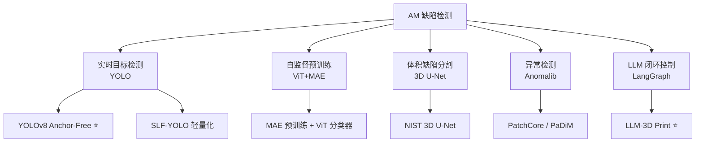

# 缺陷检测与过程监控

> [!abstract] 核心价值
> 利用 CNN/ViT 等视觉模型对 AM 过程进行原位实时缺陷检测（孔隙、未熔合、飞溅、键孔），实现从"事后检测"到"过程中闭环控制"的质量升级。LLM 多智能体方案（基于 LangGraph）为 CADPilot 提供天然集成路径。

---

## 技术路线概览



---

## 模型架构对比

| 架构 | 代表 | 任务 | 精度 | 速度 | 适用 |
|:-----|:-----|:-----|:-----|:-----|:-----|
| **YOLO v8** | Anchor-Free + 解耦头 | 实时目标检测 | mAP ==91.7-95.7%== | ==71.9 FPS== | 逐层监控（最成熟） |
| **ViT + MAE** | MAE-Base + ViT 分类器 | 熔池缺陷分类 | ==95-99%== | 近实时 | DED 热成像（标注少） |
| **3D U-Net** | Residual Symmetric | 体积缺陷分割 | IOU ==88.4%== | 离线 | XCT 三维分析 |
| **Anomalib** | PatchCore/PaDiM | 异常检测 | SOTA | 实时 | 快速 PoC |
| **LLM Agent** | GPT-4o + LangGraph | 闭环控制 | 承载力 ==1.3-5x== | 逐层 | FDM 闭环修正 |

---

## 关键模型（深入分析）

### YOLOv8 缺陷检测 ⭐ 质量评级: 4/5

> [!success] 最成熟的 AM 缺陷检测方案——Anchor-Free + 一行安装

| 属性 | 详情 |
|:-----|:-----|
| **安装** | `pip install ultralytics` |
| **许可** | AGPL-3.0（开源）/ 企业许可（商用） |
| **架构** | Anchor-Free + 解耦检测头 |
| **最佳性能** | mAP@0.5 ==91.7-95.7%==，帧率 ==71.9 FPS== |

#### 架构深度分析

| 组件 | 详情 |
|:-----|:-----|
| **Backbone** | CSPDarknet 变体，**C2f 模块**（Cross Stage Partial + Feature fusion）替代 YOLOv5 C3 |
| **C2f** | 特征图 split → 2 个带残差连接的卷积 bottleneck → concatenate → 1×1 conv |
| **Neck** | PAN-FPN + SPPF（Spatial Pyramid Pooling Fast） |
| **检测头** | ==Anchor-Free + 解耦头==，独立预测置信度/类别/边框 |
| **损失** | CIoU Loss（可替换 WIoU 改善小目标） |
| **增强** | Letterbox + Mosaic 4 宫格 + MixUp + Copy-Paste |

#### AM 领域性能基准

**FDM/ME 缺陷检测（最成熟）**：

| 指标 | 数值 |
|:-----|:-----|
| 缺陷类别 | 拉丝、欠挤出、过挤出、翘曲、层分离、飞溅、裂纹、凸起 |
| 典型数据规模 | 600-4,366 图像 |
| 训练配置 | Adam, lr=0.001, batch=32, epochs=300, conf=0.5 |
| mAP@0.5 | ==91.7-92.1%== |
| 帧率 | ==71.9 FPS== |

**金属 AM 缺陷检测**：

| 工艺 | 模型 | 性能 |
|:-----|:-----|:-----|
| WAAM | YOLOv5s | F1 ==88%==，检测 3-15ms/图像 |
| LPBF | YOLOv5 | mAP 0.932（vs Faster R-CNN 0.872） |
| L-DED | YOLOv7/v8/v9 | 多缺陷分类检测 |
| LPBF 微孔隙 | YOLOv8 + ECA 注意力 + WIoU | 改善小目标检测 |

#### 与商业方案对比

| 维度 | YOLO 开源 | Materialise QPC | EOS EOSTATE |
|:-----|:---------|:---------------|:------------|
| 成本 | 免费 | 商业许可 | 绑定 EOS 设备 |
| 覆盖工艺 | 通用 | 金属 LPBF | 仅 EOS |
| 检测精度 | mAP 85-95% | 商业级 | OT 全层映射 |
| 闭环控制 | 需自建 | MCP 硬件+API | Smart Fusion 自动修正 |
| 定制性 | ==完全可定制== | 有限 API | 封闭生态 |
| 数据所有权 | 完全自有 | 需评估 | 需评估 |

#### 部署指南

```bash
# 1. 安装
pip install ultralytics

# 2. 数据准备（YOLO 格式：class_id x_center y_center width height）
# 过滤无标注图像 + 统一命名 + Train/Val/Test 分割

# 3. 训练
yolo detect train data=defects.yaml model=yolov8s.pt \
    epochs=300 imgsz=640 batch=32

# 4. 导出（跨框架部署）
yolo export model=best.pt format=onnx

# 5. 边缘部署：ONNX Runtime / TensorRT / OpenVINO
# 6. 闭环：Raspberry Pi → G-code 注入 → 调整挤出速度
```

#### SLF-YOLO（轻量化变体）

| 属性 | 详情 |
|:-----|:-----|
| **GitHub** | [zacianfans/SLF-YOLO](https://github.com/zacianfans/SLF-YOLO) |
| **创新** | SC_C2f 通道门控 + Light-SSF_Neck + FIMetal-IoU |
| **性能** | NEU-DET mAP ==80.0%==（vs YOLOv8 75.9%）；AL10-DET mAP ==86.8%== |
| **定位** | 资源受限设备（移动端部署） |

---

### ViT + MAE 熔池监控 ⭐ 质量评级: 3.5/5

> [!success] 自监督预训练——仅 76 个异常标注即可达 99% 准确率

| 属性 | 详情 |
|:-----|:-----|
| **论文** | [arXiv:2411.12028](https://arxiv.org/abs/2411.12028) |
| **工艺** | DED (Directed Energy Deposition) |
| **GPU** | NVIDIA A10, 23GB VRAM |
| **MAE 微调时间** | ~25 小时 |
| **性能** | 准确率 ==95.44-99.17%== |

#### 完整架构参数

| 参数 | 值 |
|:-----|:---|
| 模型基础 | MAE-Base（ImageNet 预训练 800 epochs） |
| Patch 大小 | ==16×16== |
| Mask Ratio | ==75%==（仅 25% patches 可见） |
| Encoder | ==12 Transformer blocks==，宽度 768 |
| Decoder | ==8 Transformer blocks==，宽度 512 |
| Embedding 维度 | D=768 |
| 输入 | 400×400 RGB → resize 224×224 |

#### 训练流程

| 阶段 | 配置 |
|:-----|:-----|
| MAE Fine-tuning | lr=0.0001, Adam, epochs=100, batch=32, MSE Loss |
| MAE 数据 | 7,812 张==无标注==图像 |
| 分类器数据 | 1,447 张标注（正常 1,371 + 异常 ==76==） |
| 分割 | MAE 80/20; 分类器 85/15 + 6-fold CV |

#### 两种分类器

| 分类器 | 架构 | 性能 |
|:-------|:-----|:-----|
| ViT Classifier | MAE encoder + [CLS] token + MLP 头 | ==95.44-99.17%== |
| MAE Encoder Classifier | MAE encoder + max-pooling + 2 层 MLP | 略低 |

#### 热成像传感器

| 参数 | 值 |
|:-----|:---|
| 型号 | ThermaViz TV200 (Stratonics) |
| 安装角度 | 离轴 57° |
| 帧率 | 370 Hz / 64 Hz |
| 温度阈值 | Inconel 718: 1336°C |

---

### 3D U-Net 体积缺陷检测 质量评级: 3/5

> [!info] NIST 首个 AM 领域 3D 体积缺陷分割

| 属性 | 详情 |
|:-----|:-----|
| **论文** | AAAI Spring Symposium 2020 / [arXiv:2101.08993](https://arxiv.org/abs/2101.08993) |
| **机构** | NIST + Stanford |
| **最佳 IOU** | ==88.4%==（Residual Symmetric 变体） |
| **验证集准确率** | 0.993 |

#### 架构详情

| 组件 | 详情 |
|:-----|:-----|
| Encoder | 2× 3×3×3 卷积 + BatchNorm + ReLU → 2×2×2 MaxPooling，通道逐层翻倍 |
| Bottleneck | 最深层 2× 3×3×3 卷积 |
| Decoder | 2×2×2 转置卷积上采样 → skip connection → 卷积融合 |
| 变体 | 标准 / ==Residual Symmetric==（最佳）/ 变体 3 |
| 损失 | Cross-Entropy + Batch Dice Loss |
| 优化器 | Adam, lr=0.01, weight_decay=0.0001 |

#### XCT 数据处理流程

```
材料: CoCr 圆柱体, LPBF 打印
  → 人工缺陷: 改变扫描速度 + hatch spacing
  → XCT 重建: 16-bit 原始切片
  → 预处理: 3×3×3 中值滤波 + 非局部均值滤波
  → GT 标注: Bernsen 局部阈值
  → 3D patch 切割 → 训练
```

**NIST CoCr XCT 数据集已公开**：[NIST PDR](https://data.nist.gov/pdr/lps/ark:/88434/mds2-2162)，格式 16-bit TIFF（raw + segmented）

**硬件需求**：12-24GB VRAM（batch_size=1，3D 卷积内存占用远大于 2D）

---

### LLM-3D Print 多智能体 ⭐ 质量评级: 3.5/5

> [!success] 基于 LangChain + LangGraph 构建——与 CADPilot 天然集成

| 属性 | 详情 |
|:-----|:-----|
| **论文** | [arXiv:2408.14307](https://arxiv.org/abs/2408.14307) |
| **LLM** | GPT-4o |
| **技术栈** | Python + ==LangChain + LangGraph== |
| **固件** | Klipper + Moonraker API |
| **性能** | 承载力提升 ==1.3-5x== |

#### 多智能体层级设计

```
LLM Agent (GPT-4o "3D打印专家")
  ├── 监督层: 评估整体打印质量
  ├── 检测层: 分析逐层图像, 识别缺陷模式
  ├── 信息收集层: 查询打印机获取相关参数
  └── 纠正执行层: 生成并执行 G-code 修正命令
```

#### 监控闭环流程

```
打印一层完成 → 暂停
  → 挤出头回 home → 双摄像头拍摄 (顶部+前方)
  → 当前层 + 上一层图像 → LLM 分析
  → 结构化输出: 缺陷类型 + 根因参数 + 修正 G-code
  → Moonraker API 注入修正 → 继续打印
```

#### 缺陷检测与修正效果

| 缺陷类型 | LLM-人工一致性 |
|:---------|:-------------|
| 拉丝/渗出 | ==77%== |
| 欠挤出 | 20% |
| 过挤出 | 7% |

| 几何形状 | 承载力提升 |
|:---------|:----------|
| 正方形 | ==5x== |
| 六角单元 | 1.6x |
| 半球体 | 1.3x |
| 拉胀结构 | 2.5x |

#### 与 CADPilot LangGraph 集成可能

| 维度 | LLM-3D Print | CADPilot LangGraph |
|:-----|:------------|:------------------|
| 框架 | ==LangChain + LangGraph== | LangGraph |
| Agent 模式 | 单 LLM 多角色 | 多节点图编排 |
| 输入 | 逐层图像 + 打印参数 | 文本/图片/参数表 |
| 输出 | G-code 修正命令 | STEP/STL/3MF |
| 集成路径 | 作为 CADPilot 管线==下游过程监控节点== | 上游 CAD 生成 |

**FDM-Bench** ([arXiv:2412.09819](https://arxiv.org/abs/2412.09819)) 提供 LLM 在 AM 任务上的标准化评估：GPT-4o 在 G-code 异常检测上领先，Llama-3.1-405B 在问答上略优。

---

## 开源工具（深入评估）

### Anomalib v2.2 (Intel) ⭐ 推荐

| 属性 | 详情 |
|:-----|:-----|
| **GitHub** | [open-edge-platform/anomalib](https://github.com/open-edge-platform/anomalib) |
| **描述** | ==最大的开源异常检测算法集合== |
| **算法** | PatchCore, PaDiM, STFPM, WinCLIP 等 |
| **部署** | OpenVINO 导出，支持边缘推理 |
| **UI** | Anomalib Studio（低/无代码 Web 应用） |
| **依赖** | Python 3.10+, PyTorch 2.6+, Lightning 2.2+ |
| **AM 适用** | 直接用于 AM 表面缺陷异常检测 |

### PoreAnalyzer

| 属性 | 详情 |
|:-----|:-----|
| **GitHub** | [PoreAnalyzer/PoreAnalyser](https://github.com/PoreAnalyzer/PoreAnalyser/tree/v1.0) |
| **功能** | LPBF 光学显微孔隙分析，10s/样本（==50-60x 加速==） |
| **分类** | Keyhole 孔、Gas 孔、Lack of Fusion |
| **评估** | 学术项目，2021 v1.0 后更新不活跃，适合快速 PoC |

### metal-defect-detection

| 属性 | 详情 |
|:-----|:-----|
| **GitHub** | [maxkferg/metal-defect-detection](https://github.com/maxkferg/metal-defect-detection)（114★） |
| **架构** | Mask R-CNN + ResNet backbone |
| **数据集** | GDXray（铸造缺陷 X 射线） |
| **评估** | ==极度过时==（TF 1.x / Keras 2.x），仅作架构参考 |

### 其他新工具（2024-2025）

| 工具 | 功能 | 来源 |
|:-----|:-----|:-----|
| **SLF-YOLO** | 轻量化金属表面缺陷检测 | [GitHub](https://github.com/zacianfans/SLF-YOLO) |
| **NeroHin** | 粉末铺展缺陷检测（EfficientNet+Mask R-CNN） | [GitHub](https://github.com/NeroHin/defect-detection-and-segment-deep-learning) |
| **WAAM-ViD** | WAAM 熔池实时尺寸分析 | [GitHub](https://github.com/IFRA-Cranfield/WAAM-ViD) |
| **SuperSimpleNet** | 统一无/有监督缺陷检测（ICPR 2024） | [GitHub](https://github.com/blaz-r/SuperSimpleNet) |

---

## 关键数据集（深入分析）

### 3D-ADAM ⭐

| 属性 | 详情 |
|:-----|:-----|
| **规模** | ==14,120== 高分辨率扫描，217 个零件，==27,346== 缺陷标注 |
| **HuggingFace** | [pmchard/3D-ADAM](https://huggingface.co/datasets/pmchard/3D-ADAM) |
| **Benchmark** | [GitHub: PaulMcHard/3D-ADAMBench](https://github.com/PaulMcHard/3D-ADAMBench) |

**12 类缺陷**：cuts, bulges, holes, gaps, burrs, cracks, scratches, marks, warping, roughness, over-extrusion, under-extrusion

**16 类机械元素特征**：faces, edges, fillets, chamfers, holes, kerfs, tapers, indents, counterbores, countersinks, 4 种齿轮

**4 个深度传感器**：

| 传感器 | 精度 | 最佳距离 |
|:-------|:-----|:---------|
| MechMind LSR-L | 0.5-1.0mm | 1500-3000mm |
| MechMind Nano | ==0.1mm== | 300-600mm |
| Intel RealSense D455 | 80mm | 600-6000mm |
| Stereolabs Zed2i | 30mm | 300-1200mm |

**数据格式**：RGB (.PNG) + XYZ 点云 (.PLY)，1:1 映射。分割：无缺陷→训练，有缺陷 60:40→测试:验证。

> [!warning] SOTA 模型在 3D-ADAM 上表现显著低于 MVTec3D-AD，挑战性极高。

### ORNL Peregrine

| 属性 | 详情 |
|:-----|:-----|
| **开发方** | ORNL 制造示范工厂 |
| **格式** | ==HDF5== |
| **访问** | Globus 文件传输 |
| **门户** | [ORNL Constellation](https://doi.ccs.ornl.gov) |

**版本演进**：

| 版本 | 工艺 | 关键内容 |
|:-----|:-----|:---------|
| v2021-03 | LPBF | 逐层可见光/NIR/IR + 扫描路径 + XCT + 力学 |
| **v2023-09** | ==EB-PBF== | 首次 E-Beam，Inconel 738 |
| **v2023-11** | LPBF | + 拉伸力学性能 + DSCNN 异常检测预生成结果 |

**成像模态**：VL（可见光）、TI-NIR（时间积分近红外）、IR（热成像）

### NIST AM-Bench 2025

| 属性 | 详情 |
|:-----|:-----|
| **周期** | AM Bench 2018→2022→2025→2028 |
| **访问** | [NIST PDR](https://www.nist.gov/ambench/direct-am-bench-data-links-and-referencing-guidance) |
| **月下载** | ~1,400 次 |

**CADPilot 可用基准**：
- AMB2025-03：Ti64 ==XCT 孔隙数据==→缺陷检测训练
- AMB2025-06/07：IN718 ==高速热成像==→熔池监控验证

### Melt-Pool-Kinetics（2025 新发布）

| 属性 | 详情 |
|:-----|:-----|
| **论文** | [Nature Scientific Data 2025](https://www.nature.com/articles/s41597-025-05597-2) |
| **规模** | 32 个数据集编译，原始 1.9TB → 发布 ==48.6GB== HDF5 |
| **处理** | 裁剪、居中、缩放、灰度化、去噪 |
| **用途** | 熔池视觉分析 ML 的统一训练集 |

### 其他数据集

| 数据集 | 规模 | 内容 | 链接 |
|:-------|:-----|:-----|:-----|
| **VISION-Datasets** | 18K+ / 14 子集 | 工业缺陷 | [[huggingface-datasets#VISION-Datasets]] |
| **Defect Spectrum** | 13K / 1.95GB | 通用工业缺陷+VLM 字幕 | [[huggingface-datasets#Defect Spectrum]] |
| **BaratiLab Thermal** | — | AM 热成像预训练 | [[huggingface-datasets#BaratiLab]] |

---

## 商业产品参考

| 公司 | 产品 | 技术 | 特色 |
|:-----|:-----|:-----|:-----|
| **Materialise** | QPC + Layer Image Analysis | AI 逐层分析 + IIoT | MCP 嵌入式硬件，正集成 EOS OT 数据 |
| **EOS** | EOSTATE / Smart Monitoring | 光学断层 + 粉床相机 | Smart Fusion 自动激光功率修正 |
| **Sigma Additive** | PrintRite3D IPQA | 熔池过程控制 | 异常检测无需改打印机 |
| **Additive Assurance** | AMiRIS | 质量控制 | 即插即用 |

---

## 综合成熟度矩阵

| 技术方向 | 工业成熟度 | 开源可用性 | 数据集充足度 | 对 CADPilot 价值 |
|:---------|:----------|:----------|:------------|:----------------|
| YOLO 缺陷检测 | ★★★★ | ★★★★ (Ultralytics) | ★★★★ (3D-ADAM) | 高 |
| ViT+MAE 熔池 | ★★★ | ★★★ | ★★★ (Peregrine, BaratiLab) | 高 |
| 3D U-Net XCT | ★★★ | ★★ | ★★ (NIST CoCr) | 中 |
| LLM 多智能体 | ★★ | ★★ | ★★ (FDM-Bench) | ==极高==（LangGraph 集成） |
| Anomalib 通用 | ★★★★ | ★★★★★ | ★★★★ (MVTec) | 中高 |

---

## CADPilot 集成战略建议

> [!success] 推荐优先级

1. **短期（P1）**：评估 3D-ADAM 数据集 + YOLOv8 基线 / Anomalib PatchCore
   - `pip install ultralytics` / `pip install anomalib` 一行安装
   - 建立缺陷检测 PoC 和评估基准
   - 同时下载 Melt-Pool-Kinetics 48.6GB 统一数据集

2. **中期（P1）**：参考 LLM-3D Print 的 LangGraph 架构设计过程监控节点
   - 已基于 LangChain + LangGraph 构建，与 CADPilot 天然兼容
   - 可作为 CADPilot 管线下游节点
   - 闭环：逐层图像分析 → G-code 修正

3. **中期（P2）**：ViT+MAE 自监督方案用于标注数据有限场景
   - 仅需 76 个异常标注即可达 99%
   - 适合 DED 热成像监控

4. **长期**：3D U-Net 体积缺陷分析（需 XCT 设备投入）

---

## 更新日志

| 日期 | 变更 |
|:-----|:-----|
| 2026-03-03 | 深入研究更新：YOLOv8 Anchor-Free 架构详解 + AM 性能基准 + 商业方案对比 + 部署指南；ViT+MAE 完整参数（patch/mask/encoder/decoder）+ 训练配置；NIST 3D U-Net 架构 + XCT 处理流程；LLM-3D Print 多智能体层级 + 闭环流程 + LangGraph 集成分析；开源工具深入评估（Anomalib/PoreAnalyzer/SLF-YOLO）；数据集深入（3D-ADAM 14K 扫描 + ORNL Peregrine 版本演进 + NIST AM-Bench 2025 + Melt-Pool-Kinetics 48.6GB） |
| 2026-03-03 | 初始版本 |
