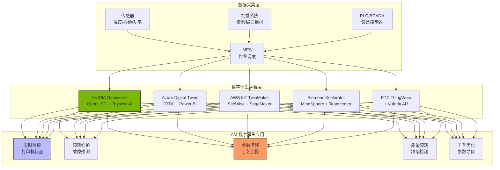
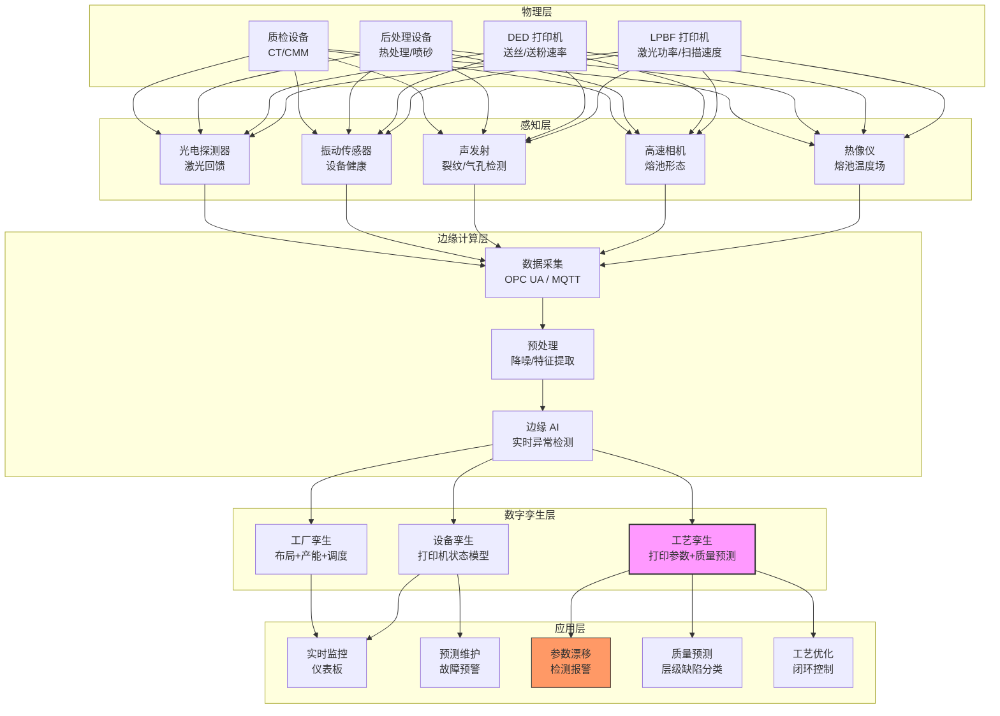
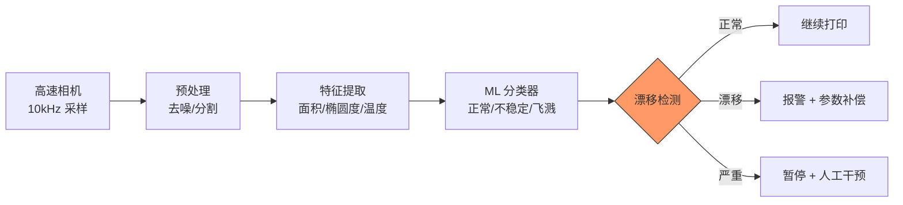
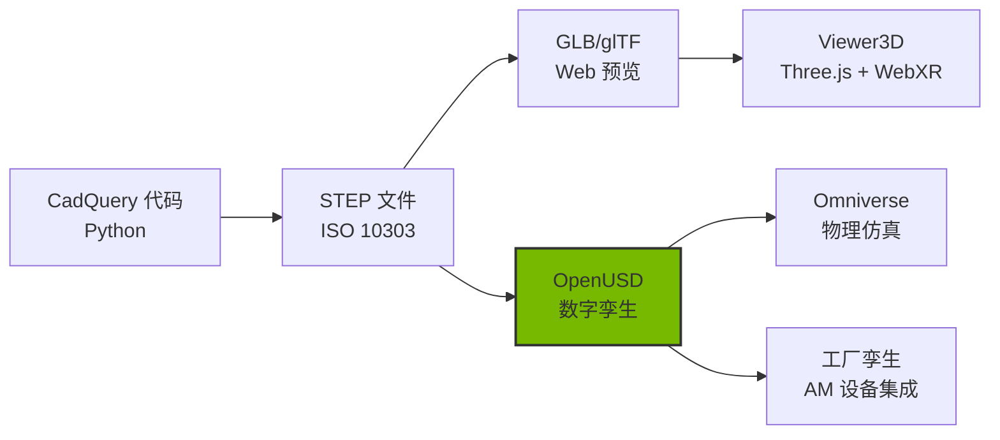

# 数字孪生制造监控方案深度调研

> [!abstract] 核心价值
> 本文系统调研了数字孪生（Digital Twin）在制造监控领域的主流平台与技术方案，涵盖 NVIDIA Omniverse（OpenUSD）AI 工厂数字孪生 Blueprint、Azure Digital Twins、AWS IoT TwinMaker、Siemens MindSphere/Xcelerator、PTC ThingWorx/Vuforia。重点分析了 AM（增材制造）工厂数字孪生架构——打印机状态监控、预测维护、工艺参数漂移检测、原位熔池监控。最后给出 OpenUSD 作为 3D 数据交换新标准的演进路径及 CADPilot V3 集成建议。

---

## 技术全景



---

## 1. NVIDIA Omniverse（OpenUSD）⭐

### 1.1 平台概述

> [!info] 核心定位
> NVIDIA Omniverse 是==基于 OpenUSD 的物理 AI 开发平台==，用于构建、模拟和优化物理世界的数字孪生。从 VFX/游戏扩展到工业制造和 AI 工厂。

| 维度 | 详情 |
|------|------|
| **基础** | OpenUSD（Universal Scene Description）开放标准 |
| **核心能力** | 物理精确模拟、多源数据融合、实时渲染、Physical AI 训练 |
| **部署** | Cloud（NVIDIA DGX Cloud）/ On-prem / 混合 |
| **生态** | 100+ 连接器（Autodesk、Siemens、PTC 等） |
| **许可** | Omniverse Enterprise（商业）/ 免费开发版可用 |

### 1.2 AI 工厂数字孪生 Blueprint

> [!tip] 2025 重大更新
> NVIDIA 发布 ==Omniverse Blueprint for AI Factory Digital Twins==，提供构建千兆瓦级 AI 工厂数字孪生的参考架构。

| 组件 | 功能 |
|------|------|
| **SimReady 资产** | 物理精确的 3D 设备模型（服务器/冷却/供电），内建物理属性 |
| **GB200 NVL72 模型** | AI 计算节点的高保真数字孪生 |
| **电力/冷却仿真** | 千兆瓦级设施的热力学、流体力学仿真 |
| **Physical AI 测试** | 在数字孪生中测试和训练机器人/自动化系统 |

#### 生态合作伙伴（2025–2026）

| 合作伙伴 | 贡献 |
|---------|------|
| **Siemens** | SimReady 3D 设备模型 + 标准化工作 |
| **Delta Electronics** | 电源/散热设备模型 |
| **Cadence** | 电子设计仿真集成 |
| **Schneider Electric + ETAP** | 配电系统仿真 |
| **Vertiv** | 冷却系统模型 |
| **Foxconn** | 24 万平方英尺 AI 工厂全设施数字孪生 |
| **Lucid Motors** | ==汽车工厂实时规划 + 机器人训练== |

#### DSX Blueprint（2025.10）

- 面向==多千兆瓦级 AI 工厂==的设计-模拟-优化流水线
- 与 Digital Realty 合作在弗吉尼亚建设 AI 工厂研究中心
- 结合 Omniverse 仿真 + OpenUSD 实现物理部署前的全流程验证

### 1.3 CADPilot 集成分析

| 方面 | 评估 |
|------|------|
| **数据桥接** | CADPilot STEP → USD 转换（CadQuery → OpenUSD Exporter） |
| **AM 工厂孪生** | Omniverse 模拟 AM 打印机 + 后处理设备布局和产能 |
| **Physical AI** | 在数字孪生中训练取件机器人、质检 AI |
| **局限** | GPU 计算密集（需 RTX/A6000+），部署成本高 |
| **推荐** | ==长期战略方向==——与 OpenUSD 标准对齐 |

---

## 2. 云平台数字孪生方案

### 2.1 Azure Digital Twins

| 维度 | 详情 |
|------|------|
| **定位** | 空间智能 + IoT 数据建模平台 |
| **建模语言** | ==DTDL==（Digital Twins Definition Language）：JSON-LD 格式描述实体关系 |
| **数据集成** | IoT Hub（设备连接）→ Digital Twins → Data Explorer / Power BI |
| **仿真** | 有限——侧重数据建模和关系图，非物理仿真 |
| **可视化** | Power BI 3D 视图 + 自定义 Three.js 前端 |
| **AI/ML** | Azure ML / Cognitive Services 集成 |
| **生态** | Dynamics 365（ERP/CRM）、Power Platform、Teams 深度集成 |
| **定价** | 按消息量计费，中等成本 |

#### DTDL 建模示例（AM 打印机）

```json
{
  "@type": "Interface",
  "@id": "dtmi:cadpilot:AMPrinter;1",
  "contents": [
    {
      "@type": "Telemetry",
      "name": "chamberTemperature",
      "schema": "double"
    },
    {
      "@type": "Telemetry",
      "name": "laserPower",
      "schema": "double"
    },
    {
      "@type": "Property",
      "name": "materialBatch",
      "schema": "string"
    },
    {
      "@type": "Relationship",
      "name": "currentBuildJob",
      "target": "dtmi:cadpilot:BuildJob;1"
    }
  ]
}
```

#### CADPilot 集成分析

- **优势**：DTDL 语义建模强大；与 Microsoft 企业生态无缝集成
- **局限**：物理仿真能力弱；3D 可视化需自建
- **推荐场景**：已使用 Azure 的企业客户

### 2.2 AWS IoT TwinMaker

| 维度 | 详情 |
|------|------|
| **定位** | 灵活的工业 IoT 数字孪生构建平台 |
| **数据源** | IoT SiteWise（工业数据）、S3、Timestream、第三方 |
| **AI/ML** | ==SageMaker== 集成——预测维护、异常检测 |
| **可视化** | Grafana 插件 + Amazon Managed Grafana |
| **3D 场景** | TwinMaker Scene Composer（基于 Three.js） |
| **扩展性** | 自定义数据连接器 + Lambda 函数 |
| **定价** | 按实体/属性计费，适合大规模部署 |

#### CADPilot 集成分析

- **优势**：灵活组合 AWS 服务；SageMaker 强大的 ML 能力；Grafana 监控成熟
- **局限**：需自行组合多个 AWS 服务，集成复杂度高
- **推荐场景**：大规模 AM 工厂集群监控

### 2.3 云平台对比

| 维度 | Azure Digital Twins | AWS IoT TwinMaker | NVIDIA Omniverse |
|------|--------------------|--------------------|-----------------|
| **建模** | ==DTDL 语义模型== | 实体-组件模型 | ==OpenUSD 物理模型== |
| **物理仿真** | ❌ | ❌ | ==✅ 物理精确== |
| **3D 可视化** | 需自建 | Grafana + Scene Composer | ==原生高保真渲染== |
| **AI/ML** | Azure ML | SageMaker | ==Omniverse AI== |
| **实时数据** | IoT Hub | IoT SiteWise | Omniverse Connectors |
| **成本** | 中等 | 中等 | 高（GPU 密集） |
| **开放标准** | DTDL（微软） | 私有 | ==OpenUSD（ISO 路径）== |
| **AM 适配** | 一般 | 较好 | ==最佳（物理仿真）== |

---

## 3. 工业巨头 IIoT 平台

### 3.1 Siemens MindSphere / Xcelerator

> [!info] 工业数字线程领导者
> Siemens 通过 ==Xcelerator 组合==（MindSphere + Teamcenter + Tecnomatix + NX）提供从设计到运维的完整数字线程。

| 维度 | 详情 |
|------|------|
| **MindSphere** | 云端 IIoT 操作系统，设备连接 + 数据分析 + 应用开发 |
| **Teamcenter** | PLM 核心——BOM/变更/配置管理，==与数字孪生双向同步== |
| **Tecnomatix** | 制造仿真——产线布局、机器人编程、人机工程分析 |
| **NX** | CAD/CAM/CAE 一体化，含 AM 设计模块 |
| **2025–2026 增强** | ==AI 驱动的预测维护模块==，生产场景仿真 |

#### 与 NVIDIA 合作

- Siemens 为 Omniverse Blueprint 提供 SimReady 3D 设备模型
- 共同推动 OpenUSD 在工业领域的标准化
- CFS（联邦聚变系统）使用 Siemens + NVIDIA 构建 SPARC 聚变反应堆数字孪生

#### CADPilot 集成分析

- **优势**：最完整的工业数字线程；Teamcenter PLM 行业标杆
- **局限**：==极高的许可成本和实施复杂度==；重型企业级方案
- **推荐**：大型制造企业客户的 AM 数字孪生方案

### 3.2 PTC ThingWorx + Vuforia

| 维度 | 详情 |
|------|------|
| **ThingWorx** | ==功能最完整的 IIoT 平台之一==：设备连接、数据建模、应用开发 |
| **Vuforia** | ==AR 维护/培训==——工程师戴 AR 眼镜，实时叠加设备数据和维修指导 |
| **Creo + Windchill** | PTC 的 CAD + PLM 系统，与 ThingWorx 数字孪生双向联动 |
| **差异化** | ==IoT + AR 无缝集成==：实时设备数据 → AR 叠加到物理设备上 |

#### AR 维护场景


#### CADPilot 集成分析

- **优势**：AR 维护场景独特且成熟；IoT 平台功能完整
- **局限**：与 PTC 自有 CAD/PLM 生态绑定较深
- **推荐**：需要 AR 现场维护引导的 AM 工厂

---

## 4. AM 工厂数字孪生架构

### 4.1 总体架构



### 4.2 打印机状态监控

| 监控参数 | 传感器 | 采样率 | 异常阈值 |
|---------|--------|--------|---------|
| **腔体温度** | 热电偶 | 1 Hz | ±5°C 偏差 |
| **激光功率** | 光功率计 | 10 kHz | ±2% 额定值 |
| **扫描速度** | 振镜编码器 | 100 kHz | ±1% 设定值 |
| **氧含量** | 氧传感器 | 1 Hz | <100 ppm |
| **保护气流量** | 流量计 | 1 Hz | ±5% 设定值 |
| **刮刀状态** | 视觉系统 | 每层 | 条纹/缺失检测 |
| **粉床均匀度** | 面阵相机 | 每层 | 粉末不均匀区域 |

### 4.3 预测维护

| 组件 | 故障模式 | 预测方法 | 预警周期 |
|------|---------|---------|---------|
| **激光器** | 功率衰减 | 功率趋势回归 + 寿命模型 | 500 小时前 |
| **振镜** | 定位偏移 | 校准偏差监控 | 100 小时前 |
| **刮刀** | 磨损/缺口 | 视觉检测 + 更换计数 | 50 层前 |
| **过滤系统** | 堵塞 | 压差传感器趋势 | 200 小时前 |
| **光学窗口** | 沉积/烧蚀 | 透射率监控 | 100 小时前 |
| **电机/轴承** | 振动异常 | FFT 频谱分析 | 1000 小时前 |

> [!info] 2026 预测维护趋势
> AI 驱动的预测维护在 2026 年从"实验性"演进为=="任务关键"==技术。制造企业默认采用 AI 预测分析、数字孪生仿真和实时异常检测来减少停机时间。

### 4.4 工艺参数漂移检测

> [!warning] 核心挑战
> AM 工艺参数漂移（Parameter Drift）是导致批次间质量不一致的主要原因。==实时检测漂移是数字孪生最高价值应用之一==。

#### 漂移来源

| 来源 | 漂移参数 | 影响 |
|------|---------|------|
| **粉末退化** | 流动性、粒度分布 | 铺粉不均 → 孔隙率 |
| **激光老化** | 实际功率 vs 设定值 | 能量密度不足 → 未熔合 |
| **光学污染** | 光斑质量 | 焊道宽度变化 |
| **环境变化** | 湿度、温度 | 氧化/水分吸附 |
| **热累积** | 基板预热效应 | 几何变形 |

#### 检测技术

| 技术 | 方法 | 成熟度 |
|------|------|--------|
| **熔池监控** | 高速相机 + ML 熔池形态分类 | ==★★★★==（最成熟） |
| **层面成像** | 面阵相机 + CNN 缺陷检测 | ★★★★ |
| **声发射** | 超声信号 + 异常检测 | ★★★☆ |
| **光谱分析** | 等离子体发射光谱 → 成分监控 | ★★☆☆ |
| **PINN** | 物理信息神经网络 → 稀疏数据下参数推断 | ★★★☆（2025 热点） |
| **多模态融合** | 热 + 视觉 + 声学多源数据联合建模 | ★★★☆ |

#### 熔池监控管线



> [!tip] 2025 研究前沿
> - ==物理信息神经网络（PINN）==在稀疏数据、参数漂移和未见几何形状下比纯数据驱动模型更可靠
> - ==多源熔池数据集编纂==（Nature Scientific Data, 2025）推动视觉分析标准化
> - 闭环控制目标：2025–2027 年实现激光功率/扫描策略/能量密度的==实时自适应调整==

### 4.5 质量预测与缺陷分类

| 缺陷类型 | 检测方法 | ML 模型 | 准确率 |
|---------|---------|--------|--------|
| **气孔（Porosity）** | 层面成像 + CT | CNN | 95%+ |
| **未熔合** | 熔池尺寸异常 | Random Forest | 90%+ |
| **裂纹** | 声发射 + 视觉 | LSTM | 88%+ |
| **球化（Balling）** | 熔池形态 | SVM | 92%+ |
| **翘曲变形** | 3D 扫描 | 有限元 + ML | 85%+ |
| **表面粗糙度** | 光学测量 | 回归模型 | 90%+ |

---

## 5. OpenUSD 作为 3D 数据交换新标准

### 5.1 里程碑：Core Specification 1.0（2025.12）

> [!tip] 关键发现
> Alliance for OpenUSD（AOUSD）于 2025 年 12 月发布 ==OpenUSD Core Specification 1.0==——首个面向产业的开放 3D 数据交换标准，已进入 ==ISO 标准化路径==。

| 维度 | 详情 |
|------|------|
| **版本** | Core Specification 1.0（2025.12.17） |
| **目标** | 终结 3D 数据碎片化，统一跨行业 3D 内容互操作 |
| **核心特性** | 高性能场景组合、层级继承、变体集、引用/载荷 |
| **1.1 路线图** | 2026 年发布——动画特性、大规模场景扩展、合规测试指南 |
| **标准化** | 正在推进 ==ISO 标准化==（第一步） |

### 5.2 AOUSD 成员与行业采纳

| 类别 | 成员 |
|------|------|
| **技术领导** | NVIDIA、Apple、Pixar、Autodesk、Adobe |
| **工业制造** | ==Siemens、PTC、Hexagon、Rockwell Automation、Schneider Electric== |
| **汽车** | Renault |
| **零售** | Amazon、IKEA、Lowe's |
| **游戏/VFX** | Epic Games、Unity |
| **地理空间** | Cesium、Esri |

### 5.3 OpenUSD vs 传统 3D 格式

| 格式 | 类型 | 场景组合 | 物理属性 | 层级编辑 | 工业采纳 |
|------|------|---------|---------|---------|---------|
| **OpenUSD** | 开放标准 | ==✅ 非破坏性层叠== | ✅ 完整 | ✅ | ==快速增长== |
| **STEP** | ISO 标准 | ❌ | ❌ | ❌ | 工业标杆 |
| **glTF/GLB** | Web 标准 | 有限 | 有限（PBR） | ❌ | Web 3D |
| **FBX** | Autodesk 私有 | 有限 | 有限 | ❌ | 动画/游戏 |
| **3MF** | AM 专用 | ❌ | AM 属性 | ❌ | AM 行业 |

### 5.4 CADPilot + OpenUSD 路径



> [!info] STEP → USD 转换
> 当前 CadQuery 输出 STEP 格式。通过 OCCT 的 USD Exporter（实验阶段）或 Pixar 的 usdStage API，可实现 ==STEP → USD 自动转换==，将 CAD 几何连同材料属性导入 OpenUSD 场景。

---

## 6. 综合评估与推荐

### 6.1 平台评分矩阵

| 平台 | AM 适配 | 物理仿真 | 开放标准 | 成本 | 生态 | 总分 |
|------|--------|---------|---------|------|------|------|
| **NVIDIA Omniverse** | ★★★★★ | ★★★★★ | ★★★★★ | ★★☆☆ | ★★★★ | ==19== |
| **Azure Digital Twins** | ★★★☆ | ★★☆☆ | ★★★☆ | ★★★★ | ★★★★★ | 16 |
| **AWS IoT TwinMaker** | ★★★★ | ★★☆☆ | ★★★☆ | ★★★★ | ★★★★ | 17 |
| **Siemens Xcelerator** | ★★★★★ | ★★★★ | ★★★☆ | ★☆☆☆ | ★★★★★ | 17 |
| **PTC ThingWorx** | ★★★★ | ★★★☆ | ★★★☆ | ★★☆☆ | ★★★★ | 16 |

### 6.2 推荐路径

> [!success] 短期（0–6 月）：轻量 AM 设备监控
> - 基于 MQTT/OPC UA 采集 AM 打印机基础遥测（温度/功率/气氛）
> - Grafana 仪表板实时展示（开源，零成本）
> - CADPilot 打印作业与设备状态关联（Build Job ID → 设备数据）
> - 简单异常阈值报警（温度偏差、氧含量超标）
> - 工作量：4–6 周后端开发

> [!success] 中期（6–18 月）：数字孪生 MVP + 预测维护
> - 选择 Azure Digital Twins 或 AWS IoT TwinMaker（按现有云栈决定）
> - DTDL/实体模型建模 AM 打印机 + 构建作业 + 材料批次
> - ML 预测维护模型（激光器/刮刀/过滤器寿命预测）
> - 熔池监控集成（如已有高速相机）→ 参数漂移检测 MVP
> - CADPilot 数字线程扩展：DrawingSpec → 打印参数 → 实时监控 → 质量预测

> [!success] 长期（18+ 月）：Omniverse + OpenUSD 全厂孪生
> - 采用 OpenUSD 作为 3D 数据交换核心标准
> - STEP → USD 自动转换管线
> - NVIDIA Omniverse 全厂物理仿真（布局优化 + 产能规划）
> - Physical AI：在数字孪生中训练质检机器人和取件自动化
> - 闭环工艺控制：参数漂移 → 实时补偿（激光功率/速度自适应）
> - AR 维护指导（PTC Vuforia 或 WebXR 方案）
> - OpenUSD 标准跟进：Core Spec 1.1（2026）→ ISO 标准化

---

## 7. 参考文献

1. NVIDIA, "Omniverse Blueprint for AI Factory Digital Twins", [blogs.nvidia.com](https://blogs.nvidia.com/blog/omniverse-blueprint-ai-factories-expands/)
2. NVIDIA, "Omniverse DSX Blueprint", [blogs.nvidia.com](https://blogs.nvidia.com/blog/omniverse-dsx-blueprint/)
3. NVIDIA, "OpenUSD Digital Twins Industrial Physical AI", [blogs.nvidia.com](https://blogs.nvidia.com/blog/openusd-digital-twins-industrial-physical-ai/)
4. NVIDIA, "Designing AI Factories Using OpenUSD and SimReady Assets", [developer.nvidia.com](https://developer.nvidia.com/blog/designing-ai-factories-using-openusd-and-simready-assets/)
5. AOUSD, "Core Specification 1.0 Announcement", [aousd.org](https://aousd.org/news/core-spec-announcement/)
6. MDPI, "Digital Twins, AI, and Cybersecurity in AM", [mdpi.com](https://www.mdpi.com/2075-1702/13/8/691)
7. Frontiers, "Generative and Predictive AI for Digital Twin Systems in Manufacturing", [frontiersin.org](https://www.frontiersin.org/journals/artificial-intelligence/articles/10.3389/frai.2025.1655470/full)
8. Nature, "Multi-source Melt Pool Compilation for AM", [nature.com](https://www.nature.com/articles/s41597-025-05597-2)
9. Springer, "Advancing ML for In-Situ Monitoring in Metal AM", [tandfonline.com](https://www.tandfonline.com/doi/full/10.1080/17452759.2025.2592732)
10. Springer, "Process Monitoring and ML for Defect Detection in Metal AM", [springer.com](https://link.springer.com/article/10.1007/s10845-023-02119-y)
11. Manufacturing Digital, "Best Digital Twin Solutions for Manufacturers 2025", [manufacturingdigital.com](https://manufacturingdigital.com/articles/best-digital-twin-solutions-manufacturers)
12. Inventiva, "Top 10 Industrial IoT Platforms 2026", [inventiva.co.in](https://www.inventiva.co.in/trends/top-10-industrial-iot-platforms-in-2026/)
13. AM Chronicle, "Digital Twin Integration in AM Systems", [amchronicle.com](https://amchronicle.com/insights/digital-twin-integration-in-additive-manufacturing-systems-revolutionizing-design-production-and-lifecycle-management/)
14. Priority Software, "Manufacturing Trends 2026", [priority-software.com](https://www.priority-software.com/resources/manufacturing-trends/)

---

> [!note] 交叉引用
> - [[plm-integration]] — PLM 集成方案（数字线程 + 打印批次追溯）
> - [[webxr-design-review]] — WebXR 设计评审（XR 可视化 + 数字孪生融合）
> - [[defect-detection-monitoring]] — 缺陷检测与监控研究
> - [[surrogate-models-simulation]] — 代理模型仿真研究
> - [[implementation-feasibility]] — 实施可行性评估
