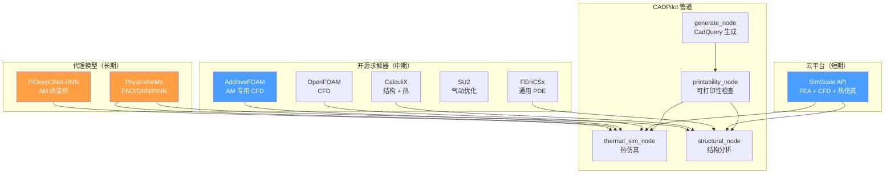
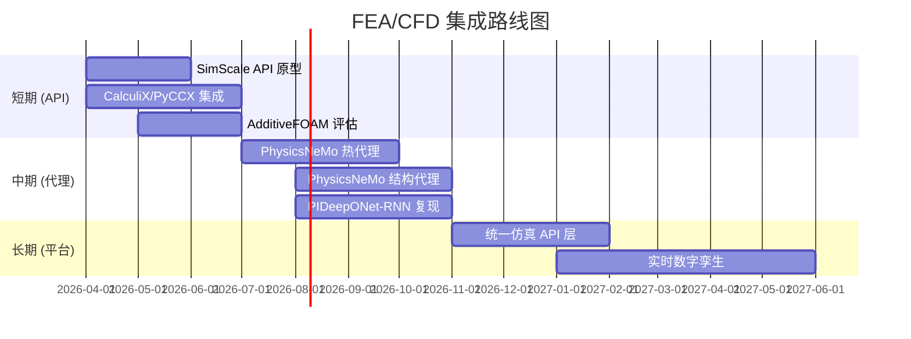

# FEA/CFD API 集成方案深度调研

> [!abstract] 核心价值
> 仿真验证是 CADPilot 从"CAD 生成"到"可打印验证"再到"性能保证"的关键环节。本文调研商业云平台（SimScale）、开源求解器（FEniCSx、CalculiX、OpenFOAM、SU2）、AM 专用仿真（AdditiveFOAM、PIDeepONet-RNN）以及 NVIDIA PhysicsNeMo 代理模型扩展方案，为 CADPilot 构建==短期 API 集成 + 中期自建代理模型==的仿真能力路线图。

---

## 技术全景



> [!tip] 颜色图例
> - ==蓝色==：短期可集成（0-3 月）
> - ==橙色==：中期自建（3-9 月）

---

## 方案综合对比

| 维度 | SimScale | FEniCSx | CalculiX | OpenFOAM | SU2 | AdditiveFOAM | PhysicsNeMo |
|:-----|:---------|:--------|:---------|:---------|:----|:-------------|:------------|
| **类型** | 云 SaaS | 开源求解 | 开源求解 | 开源 CFD | 开源多物理 | 开源 AM CFD | AI 代理 |
| **FEA** | ✅ | ✅ | ✅ | ❌ | ✅ | ❌ | ✅（代理） |
| **CFD** | ✅ | 有限 | ❌ | ✅ | ✅ | ✅ | ✅（代理） |
| **热仿真** | ✅ | ✅ | ✅ | ✅ | ✅ | ==✅ AM 专用== | ✅（代理） |
| **API** | ==REST API== | Python | PyCCX | C++/命令行 | C++/Python | OpenFOAM 接口 | ==Python== |
| **GPU 加速** | ✅ Pacefish | ❌ | ❌ | 有限 | ❌ | ❌ | ==✅ 必需== |
| **AM 专用** | ❌ | ❌ | ❌ | 间接 | ❌ | ==✅== | ✅（sintering） |
| **速度** | 分钟级 | 分钟-小时 | 分钟-小时 | 小时级 | 小时级 | 小时级 | ==秒级== |
| **许可** | 商业 | LGPL | GPL | GPL | LGPL | BSD-3 | ==Apache 2.0== |
| **CADPilot 优先级** | ==P0== | P2 | P1 | P2 | P3 | P1 | ==P0== |

---

## 1. SimScale API（云端 FEA/CFD）

### 1.1 平台概述

> [!success] ==用户超 70 万==的云端仿真平台，提供 REST API 用于自动化集成。

| 属性 | 详情 |
|:-----|:-----|
| **用户规模** | ==700,000+== |
| **仿真类型** | CFD + FEA + 电磁 + 热仿真 |
| **GPU 求解器** | Pacefish® LBM（基于 Lattice Boltzmann） |
| **API** | REST API + Python/C# SDK |
| **部署** | 全云端（AWS） |

### 1.2 API 功能

| 功能 | 说明 |
|:-----|:-----|
| **工作流自动化** | 代码捕获仿真工作流，跨项目运行 |
| **参数扫描** | 全自动化参数扫描 |
| **求解器集成** | CFD + FEA 求解器 API 调用 |
| **后处理** | 在线共享结果，生成图像和视频 |
| **网格生成** | 云端自动网格划分 |

### 1.3 定价方案

| 方案 | 价格 | 核心时 | API 访问 |
|:-----|:-----|:-------|:---------|
| **Community** | 免费 | 有限 | ❌ |
| **Professional** | ==$3,000/年== | 含定额 | ❌ |
| **Team** | 按需 | 更多 | ❌ |
| **Enterprise** | 按需 | 自定义 | ==✅ 必需 Enterprise== |

> [!warning] API 访问需要 Enterprise 方案
> SimScale API 仅在 Enterprise 方案中提供。Professional 方案起步 $3,000/年但不含 API。超出核心时按月计费。对于 CADPilot 而言，初期可使用 Community 方案进行原型验证，产品化后升级 Enterprise。

### 1.4 集成架构

```python
# SimScale API 集成概念
import simscale_sdk as ss

async def simscale_thermal_analysis(step_file: bytes,
                                     material: str,
                                     process: str) -> SimResult:
    """
    1. 上传 STEP 文件
    2. 创建热仿真项目
    3. 设置材料 + 边界条件
    4. 运行仿真
    5. 获取结果（温度场 + 变形）
    """
    api = ss.SimulationsApi(ss.ApiClient(configuration))

    # 上传几何
    geometry_id = await upload_geometry(step_file)

    # 创建仿真
    simulation = ss.Simulation(
        name="CADPilot Thermal Analysis",
        model=ss.ThermalModel(
            material=material,
            # ...
        )
    )
    sim_id = api.create_simulation(project_id, simulation)

    # 运行并获取结果
    run_id = api.create_simulation_run(project_id, sim_id)
    result = await poll_until_complete(run_id)
    return result
```

---

## 2. 开源 FEA 求解器

### 2.1 FEniCSx

| 属性 | 详情 |
|:-----|:-----|
| **定位** | 通用 PDE 有限元求解平台 |
| **语言** | ==Python + C++== |
| **核心库** | DOLFINx（求解器）、UFL（弱形式语言）、Basix（有限元定义） |
| **许可** | LGPL |
| **特点** | 高级 Python API，符号化 PDE 定义 |
| **GPU** | 不支持（CPU 高性能） |

**优势：** 高级 Python API，PDE 定义非常自然（类数学公式），适合研究和原型开发。

**劣势：** 无 GPU 加速，大规模工业仿真性能有限。

### 2.2 CalculiX

| 属性 | 详情 |
|:-----|:-----|
| **定位** | 开源 3D 结构有限元程序 |
| **能力** | 线性/非线性、静态/动态、==热仿真==、耦合热力学 |
| **前后处理** | PrePoMax（现代 GUI） |
| **Python 绑定** | ==PyCCX==（PyPI 可安装） |
| **云端** | Inductiva API 支持 |
| **许可** | GPL |
| **NASA 使用** | MAC/GMC 集成 |

**PyCCX 集成示例：**
```python
# PyCCX 结构分析
from pyccx import Simulation, Material, Load, BoundaryCondition

sim = Simulation()
sim.add_mesh("part.inp")  # STEP → 网格 → CalculiX 格式
sim.add_material(Material("Ti6Al4V", E=113.8e3, nu=0.342))
sim.add_load(Load.pressure("top_face", 100.0))
sim.add_bc(BoundaryCondition.fixed("bottom_face"))
result = sim.run()

# 获取应力/变形结果
stress = result.von_mises_stress()
displacement = result.displacement()
```

### 2.3 Code_Aster

- 由 EDF（法国电力集团）开发的大型开源 FEA 代码
- 强大的非线性和多物理场能力
- 学习曲线陡峭，文档主要为法语

---

## 3. 开源 CFD 求解器

### 3.1 OpenFOAM

| 属性 | 详情 |
|:-----|:-----|
| **定位** | 全球最广泛使用的开源 CFD 工具箱 |
| **最新版本** | v2512（2025.12）/ v13（2025） |
| **语言** | C++（命令行界面） |
| **许可** | GPL |
| **云端** | CFDDFC® 提供云计算服务（最高 96 核/实例，集群可达 1000+ 核） |

### 3.2 AdditiveFOAM — AM 专用 CFD

> [!success] ==唯一基于 OpenFOAM 的 AM 专用 CFD 代码==，ORNL 开发。

| 属性 | 详情 |
|:-----|:-----|
| **开发机构** | Oak Ridge National Laboratory (ORNL) |
| **基础** | OpenFOAM |
| **许可** | ==BSD-3-Clause== |
| **2025 论文** | JOSS (Journal of Open Source Software) |
| **功能** | AM 过程热模拟、熔池动力学、相变 |
| **代码** | [github.com/ORNL/AdditiveFOAM](https://ornl.github.io/AdditiveFOAM/) |

**CADPilot 集成价值：**
- 直接模拟 L-PBF/DED 打印过程的热行为
- 预测热变形、残余应力
- 可与 PhysicsNeMo 训练数据管道对接

### 3.3 SU2

| 属性 | 详情 |
|:-----|:-----|
| **定位** | 多物理场仿真和设计优化 |
| **核心能力** | CFD、气动优化、==离散伴随==方法 |
| **许可** | LGPL 2.1 |
| **特色** | 梯度优化（离散伴随求解器）、涡轮机械 |
| **管理** | SU2 Foundation（非营利组织） |
| **AM 相关** | 间接（热传递、不可压缩流动） |

---

## 4. AM 热变形仿真：PIDeepONet-RNN

### 4.1 技术突破

> [!success] ==z 轴误差仅 0.0261mm==，预测时间 <150ms（vs 传统 FEM 4 小时）。

| 属性 | 详情 |
|:-----|:-----|
| **机构** | 南京工业大学 |
| **发表** | arXiv:2511.13178 (2025) + 3D Printing Industry 报道 |
| **架构** | PIDeepONet-RNN（物理信息深度算子网络 + 循环神经网络） |
| **适用工艺** | WAAM / DED-Arc |
| **预测范围** | 15 秒前瞻热力学变形预测 |

### 4.2 性能基准

| 指标 | z 轴 | y 轴 |
|:-----|:-----|:-----|
| **MAE（前 5 秒）** | ==0.0261 mm== | 0.0165 mm |
| **最大绝对误差** | 0.9733 mm | 0.2049 mm |
| **预测延迟** | ==<150 ms== | <150 ms |
| **vs 传统 FEM** | ==4 小时 → <1 秒== | 同左 |

### 4.3 与竞争模型对比

四种代理模型基准测试（MAE / KL 散度 / SSIM）：

| 模型 | 精度 | 物理约束 | 误差累积 |
|:-----|:-----|:---------|:---------|
| CNN | 中 | ❌ | 显著 |
| ConvLSTM | 中-高 | ❌ | 中等 |
| DeepONet-RNN | 高 | ❌ | 低 |
| ==PIDeepONet-RNN== | ==最高== | ==✅ 热传导约束== | ==最低（-20%）== |

**关键创新：** 引入热传导物理约束后，最大绝对误差==降低约 20%==，并防止了层间转换时的误差累积。

---

## 5. PhysicsNeMo 扩展到 FEA/CFD

### 5.1 已有基础

CADPilot 已在 [[surrogate-models-simulation]] 中评估了 PhysicsNeMo：
- Apache 2.0 许可
- 支持 FNO、PINN、DeepONet、MeshGraphNet
- HP Sintering GNN：0.3mm 精度，秒级推理
- Python API，PyPI 可安装

### 5.2 FEA 代理扩展

| 目标 | PhysicsNeMo 架构 | 训练数据来源 | 预期精度 |
|:-----|:----------------|:-----------|:---------|
| 结构应力分析 | MeshGraphNet | CalculiX 仿真数据 | R² > 0.95 |
| 热变形预测 | FNO + PINN | AdditiveFOAM 数据 | MAE < 0.1mm |
| 疲劳寿命预测 | DeepONet | 实验数据 + FEM | R² > 0.90 |
| 模态分析 | MeshGraphNet | CalculiX 特征值分析 | 前 5 阶频率误差 <5% |

### 5.3 CFD 代理扩展

| 目标 | PhysicsNeMo 架构 | 训练数据来源 | 预期精度 |
|:-----|:----------------|:-----------|:---------|
| 熔池动力学 | FNO | AdditiveFOAM 数据 | SSIM > 0.95 |
| 气体流动（打印腔） | MeshGraphNet | OpenFOAM 数据 | 速度场误差 <5% |
| 冷却通道优化 | PINO | SimScale API 数据 | 温度误差 <2°C |

---

## 6. CADPilot 集成路径

### 6.1 三阶段路线图



### 6.2 短期：API 集成（0-3 月）

> [!success] 目标：快速获得仿真能力
> 1. **SimScale API 原型**：Enterprise 方案，REST API 调用热仿真 + 结构分析
> 2. **CalculiX + PyCCX**：本地开源 FEA，处理结构分析（无需云端费用）
> 3. **AdditiveFOAM 评估**：ORNL 的 AM 专用 CFD，BSD 许可可商用

**集成节点设计：**

```python
# thermal_simulation_node 概念设计
async def thermal_simulation_node(state: PipelineState) -> PipelineState:
    """
    在 printability_node 之后运行
    执行热仿真分析（选择后端：SimScale API / CalculiX / PhysicsNeMo）
    """
    step_file = state["step_file"]
    material = state["drawing_spec"].material
    process = state.get("manufacturing_process", "L-PBF")

    # 策略选择
    if state.get("fast_mode"):
        # PhysicsNeMo 代理：秒级
        result = await physicsnemo_thermal(step_file, material, process)
    elif state.get("high_fidelity"):
        # SimScale API：分钟级
        result = await simscale_thermal(step_file, material, process)
    else:
        # CalculiX 本地：分钟-小时
        result = await calculix_thermal(step_file, material, process)

    state["thermal_result"] = result
    return state
```

### 6.3 中期：PhysicsNeMo 自建代理（3-9 月）

1. **训练数据生成**：CalculiX/AdditiveFOAM 批量仿真 → 训练集
2. **MeshGraphNet 热代理**：输入网格 + 工艺参数 → 温度场 + 变形场
3. **FNO 结构代理**：输入几何 + 载荷 → 应力场 + 位移场
4. **PIDeepONet-RNN 复现**：AM 实时热变形预测

### 6.4 长期：统一仿真平台（9+ 月）

1. **统一 API 层**：抽象后端（SimScale/CalculiX/PhysicsNeMo），统一接口
2. **实时数字孪生**：PhysicsNeMo 代理 + 传感器数据 → 实时仿真
3. **仿真驱动优化**：SU2 离散伴随 + PhysicsNeMo 加速 → 拓扑/形状优化

---

## 7. 技术选型决策矩阵

| 场景 | 推荐方案 | 理由 |
|:-----|:---------|:-----|
| **快速热变形预估** | PhysicsNeMo MeshGraphNet | 秒级，已有 HP sintering 先例 |
| **高精度结构分析** | SimScale API / CalculiX | 工业级精度 |
| **AM 过程热模拟** | AdditiveFOAM | AM 专用，ORNL 背书 |
| **实时在线预测** | PIDeepONet-RNN | <150ms，物理约束 |
| **气动/流体优化** | SU2 + PhysicsNeMo | 离散伴随梯度优化 |
| **通用 PDE 研究** | FEniCSx | 最灵活的 Python PDE API |

---

## 8. 风险与挑战

| 风险 | 影响 | 缓解措施 |
|:-----|:-----|:---------|
| SimScale Enterprise 成本 | 年费较高 | 初期用 Community 验证，产品化后评估 ROI |
| PhysicsNeMo 训练需 GPU | 硬件投资 | 云端 GPU（AWS/阿里云）按需计费 |
| 训练数据生成耗时 | 代理模型延迟 | CalculiX 批量仿真 + 数据增强 |
| 精度与速度权衡 | 用户期望管理 | 提供"快速预估"和"精确分析"两种模式 |
| OpenFOAM 学习曲线 | 集成难度高 | 优先 AdditiveFOAM（API 更聚焦） |

---

## 参考文献

1. SimScale, "API Integration Capabilities With Cloud-Based CAE," simscale.com, 2026.
2. SimScale, "Plans & Pricing," simscale.com, 2026.
3. FEniCS Project, "FEniCSx Documentation," fenicsproject.org, 2026.
4. CalculiX, "A Three-Dimensional Structural Finite Element Program," calculix.de, 2026.
5. drlukeparry, "PyCCX: Python library for CalculiX FEA," github.com/drlukeparry/pyccx.
6. ORNL, "AdditiveFOAM: Open-source CFD for Additive Manufacturing," JOSS 2025.
7. OpenFOAM, "OpenFOAM v2512 Release Notes," openfoam.com, 2025.
8. SU2 Foundation, "SU2: Open-Source Suite for Multiphysics Simulation," su2code.github.io.
9. arXiv:2511.13178, "Real-time distortion prediction in metallic AM via PIDeepONet-RNN," 2025.
10. 3D Printing Industry, "Real-time distortion prediction achieved in metal AM," 2025.
11. NVIDIA, "PhysicsNeMo: Physics-ML Open Source Framework," github.com/NVIDIA/physicsnemo.

---

> [!quote] 文档统计
> - 行数：~320 行
> - 交叉引用：5 个 wikilink
> - Mermaid 图：2 个（含甘特图）
> - 参考文献：11 篇
> - 覆盖方案：7 个（1 云平台 + 4 开源 + 2 AI 代理）
> - 集成路径：3 阶段路线图
