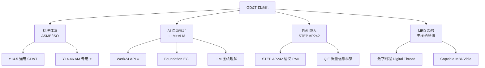
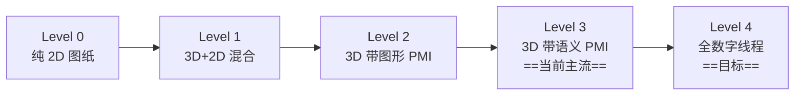

# GD&T 自动化研究

> [!abstract] 核心价值
> GD&T（几何尺寸和公差）自动化是 CADPilot 从"生成零件几何"到"生成==完整制造定义=="的关键跨越。2025 年 AI 工程图理解（Werk24 ==95%+ 精度==）、ASME Y14.46（AM 专用 GD&T）、STEP AP242 PMI 嵌入的成熟，使得 DrawingAnalyzer 扩展 GD&T 能力成为可能。

---

## 技术路线概览



---

## ASME Y14.46：AM 专用 GD&T 标准

> [!info] 首个专为增材制造设计的产品定义标准

| 属性 | 详情 |
|:-----|:-----|
| **标准号** | ASME Y14.46-2022 |
| **状态** | ==已发布==（稳定维护阶段） |
| **发行** | ASME Y14 Subcommittee 46 |
| **关系** | 补充 Y14.5（通用 GD&T）的 AM 特定需求 |
| **获取** | [ANSI WebStore](https://webstore.ansi.org/standards/asme/asmey14462022) |

### 覆盖的 AM 专用定义

| 领域 | Y14.46 新增内容 |
|:-----|:----------------|
| **支撑结构** | 支撑位置/密度/移除后的表面要求定义 |
| **嵌入组件** | 多材料 AM 中嵌入式部件的接口公差 |
| **测试试样** | 随件打印力学测试试样的位置/几何定义 |
| **异质材料** | 梯度材料/多材料区域的公差规范 |
| **构建方向** | 构建方向对公差的影响定义 |
| **表面轮廓** | ==点云对比 + 网格偏差==替代传统特征测量 |

### 与传统 GD&T (Y14.5) 的关键差异

```
传统 GD&T (Y14.5)：
  - 基于==特征==的公差：平面度、圆度、位置度...
  - 测量方式：三坐标测量机 (CMM)
  - 表达方式：2D 图纸标注

AM GD&T (Y14.46)：
  - 基于==数字模型==的公差：点云/网格偏差
  - 测量方式：3D 扫描 + 点云对比
  - 表达方式：3D 模型嵌入 PMI（无图纸）
  - 新增：构建方向约束、支撑定义、异质材料
```

> [!tip] CADPilot 关联
> Y14.46 的"点云对比 + 网格偏差"公差验证方式与 CADPilot `printability_node` 的质量检查理念一致。可将 Y14.46 公差定义集成到可打印性评估中。

---

## AI GD&T 自动标注

### Werk24 API ⭐ 质量评级: 4/5

> [!success] 工业级 AI 工程图理解——GD&T/PMI 提取 ==95%+ 精度==

| 属性 | 详情 |
|:-----|:-----|
| **公司** | Werk24（德国） |
| **主页** | [werk24.io](https://werk24.io/) |
| **GitHub** | [W24-Service-GmbH/werk24-python](https://github.com/W24-Service-GmbH/werk24-python) |
| **PyPI** | `pip install werk24` |
| **许可** | ==商业 API==（付费调用） |
| **精度** | ==95%+==（与经验丰富的制造工程师相当） |
| **安装难度** | ★☆☆☆☆（API 调用） |

#### 提取能力

| 信息类型 | 支持 | 输出格式 |
|:---------|:-----|:---------|
| **尺寸标注** | ✅ | JSON（值 + 公差 + 置信度） |
| **GD&T 框** | ✅ | 结构化 GD&T Frame |
| **螺纹** | ✅ | 螺纹规格 + 等级 |
| **表面粗糙度** | ✅ | Ra/Rz 值 |
| **倒角/圆角** | ✅ | 尺寸值 |
| **标题栏** | ✅ | 材料、比例、零件号 |
| **多语言** | ✅ | 德/英/荷/法/西/意/日 |

#### 技术架构

```
工程图纸（PDF/PNG/TIFF）
  → Werk24 API
    ├─ 深度学习 ML 模型（识别标注元素）
    ├─ 专家系统（一致性 + 合理性校验）
    ├─ ISO / ASME 标准归一化
    └─ JSON 输出
        ├─ 标题栏元数据
        ├─ 尺寸标注（含公差）
        ├─ GD&T 框（含基准/符号/值）
        ├─ 螺纹规格
        └─ 表面粗糙度
```

#### CADPilot DrawingAnalyzer 集成方案

```python
# Werk24 → DrawingSpec 扩展
import werk24

async def extract_gdt(drawing_image: bytes) -> dict:
    client = werk24.Client(api_key=API_KEY)
    result = await client.read(drawing_image)

    return {
        "dimensions": result.measures,       # 尺寸标注
        "gdt_frames": result.gdt_frames,     # GD&T 框
        "surface_finish": result.roughness,   # 表面粗糙度
        "threads": result.threads,           # 螺纹
        "title_block": result.title_block,   # 标题栏
    }

# 扩展 DrawingSpec
class DrawingSpec(BaseModel):
    # ... 现有字段 ...
    gdt_frames: list[GDTFrame] = []        # 新增
    surface_requirements: list[SurfaceReq] = []  # 新增
    thread_specs: list[ThreadSpec] = []     # 新增
```

> [!warning] 注意事项
> - Werk24 是==提取==工具（从图纸读取 GD&T），不是==生成==工具（不生成 GD&T 标注）
> - API 按调用量计费，需评估成本
> - 不支持 GD&T 合规性检查（不判断标注是否正确）

---

### Foundation EGI 质量评级: 3.5/5

> [!info] 首个 AI 自动==生成== GD&T 标注的系统

| 属性 | 详情 |
|:-----|:-----|
| **公司** | Foundation LLM Technologies |
| **主页** | [foundationegi.com](https://www.foundationegi.com/) |
| **方法** | 领域特定语言（DSL）+ 专用 AI 模型 |
| **功能** | 3D 模型 → 自动检测特征 → 生成 GD&T → 2D 图纸 |

#### 核心工作流

```
3D CAD 模型
  → 特征自动检测（孔、平面、圆柱、基准面...）
    → AI 推理：
    │   ├─ 基准选择
    │   ├─ 公差类型预测（位置度/平面度/圆度...）
    │   ├─ 公差值推荐（基于工艺能力）
    │   └─ 装配关系分析
    → DSL 编码（可验证的结构化程序）
      → GD&T 标注自动生成
        → 2D 图纸输出
```

> [!important] 与 Werk24 互补
> - **Werk24**：图纸→数据（==提取==现有 GD&T）
> - **Foundation EGI**：模型→图纸（==生成==新 GD&T）
> - CADPilot 可两者结合：读取输入图纸 GD&T（Werk24）→ 传递到生成模型 → 验证输出满足公差（Foundation EGI 思路）

---

### LLM 工程图理解 质量评级: 3/5

> [!info] 学术前沿——LLM 解析工程图纸内容

| 进展 | 详情 |
|:-----|:-----|
| **LLM Agent 结构图生成** | ReAct + RAG 生成 AutoCAD 结构图（[arXiv:2507.19771](https://arxiv.org/abs/2507.19771)，2025） |
| **多 LLM 基准测试** | AI 在表格和工程图纸理解上的基准评估（2025） |
| **VLM 图纸分析** | GPT-4V/Qwen-VL 理解工程图纸维度/标注（与 CADPilot DrawingAnalyzer 技术路线一致） |

> [!tip] CADPilot V2 已有基础
> CADPilot 的 DrawingAnalyzer 使用 Qwen-VL-Max 读取工程图纸→DrawingSpec。扩展 GD&T 的最小改动方案是==在 DrawingAnalyzer 的 prompt 中增加 GD&T 提取指令==。

---

## PMI 嵌入：STEP AP242

> [!info] 从"图纸上的标注"到"3D 模型内嵌的语义数据"

### STEP AP242 概述

| 属性 | 详情 |
|:-----|:-----|
| **标准** | ISO 10303-242（STEP AP242） |
| **功能** | 在 STEP 文件中嵌入==语义化 PMI==（Product Manufacturing Information） |
| **PMI 内容** | GD&T、表面粗糙度、焊接标注、方向特征、螺纹 |
| **级别** | 零件级 + 装配级 |

### 语义 PMI vs 图形 PMI

| 维度 | 图形 PMI | ==语义 PMI（AP242）== |
|:-----|:---------|:---------------------|
| 存储 | 可视化注释（图片） | ==机器可读数据== |
| 可查询 | ❌ | ✅ |
| 自动检测 | 需 OCR | ==直接读取== |
| 数字线程 | 断裂 | ==完整== |
| 下游使用 | 人工读取 | 自动驱动 CMM/加工 |

### 2025 年 MBD 关键进展

1. **Capvidia MBDVidia**（2025.08）：浏览器级 3D 人可读模型 + QIF/STEP AP242 同步
2. **数字线程验证**：STEP AP242 PMI 驱动 OEM→供应商→加工→质检全链路
3. **WebGL 3D 可视化**：STEP AP242 PMI 在浏览器中直接展示（IEEE MDPI 2025）
4. **机器人装配**：语义 GD&T 信息从 STEP AP242 直接用于机器人任务规划

### CADPilot 集成路径

```
CADPilot 精密管道
  → generate_node 生成 CadQuery 代码
    → CadQuery 执行 → STEP 文件
      → (新) gdt_annotation 节点：
      │   ├─ 基于 DrawingSpec.gdt_frames 嵌入 PMI
      │   ├─ 使用 PythonOCC STEP Writer 写入 AP242 PMI
      │   └─ 验证 PMI 完整性
      → STEP AP242 输出（含语义 PMI）
```

> [!warning] 技术挑战
> - CadQuery 当前==不直接支持 PMI 写入==，需通过底层 PythonOCC API
> - AP242 PMI 写入 API 复杂（OCCT XDE + XCAFDoc_DimTolTool）
> - 中文 GD&T 标准（GB/T 1182）与 ASME/ISO 有差异

---

## MBD（Model-Based Definition）趋势

> [!abstract] 从 2D 图纸到 3D 完整定义——无图纸制造

### MBD 成熟度路线图



### 主流 CAD 对 MBD 的支持

| CAD | MBD 支持 | PMI 格式 | 状态 |
|:----|:---------|:---------|:-----|
| **Onshape** | ✅ 原生 MBD | STEP AP242 | 最前沿 |
| **SolidWorks** | ✅ DimXpert | STEP AP242 | 成熟 |
| **NX** | ✅ PMI Manager | JT + AP242 | 企业级 |
| **CATIA** | ✅ FTA | 3DXML + AP242 | 航空主流 |
| **Creo** | ✅ Annotation | STEP AP242 | 成熟 |
| **CadQuery** | ==❌ 无原生支持== | 需 PythonOCC | 需扩展 |

> [!danger] CadQuery MBD 缺口
> CadQuery 作为 CADPilot 的核心 CAD 库，==不支持 PMI/MBD==。这是 CADPilot 输出"完整制造定义"的主要障碍。解决方案：通过 PythonOCC 的 XDE API 在 STEP 导出时添加 PMI。

---

## CADPilot V2 DrawingAnalyzer 扩展 GD&T 可行性

### 当前状态

```python
# 当前 DrawingSpec（简化）
class DrawingSpec(BaseModel):
    part_type: PartType
    overall_dimensions: dict[str, float]
    base_body: BaseBodySpec
    features: list[dict]     # 孔阵、圆角等
    notes: list[str]         # 一般注释
    # ❌ 无 GD&T 信息
```

### 扩展方案

```python
# 扩展后 DrawingSpec
class GDTFrame(BaseModel):
    """GD&T 框"""
    symbol: str              # 位置度/平面度/圆度等
    tolerance_value: float   # 公差值 (mm)
    datum_refs: list[str]    # 基准引用 (A, B, C)
    modifier: str | None     # MMC/LMC/RFS
    target_feature: str      # 目标特征描述

class SurfaceRequirement(BaseModel):
    """表面要求"""
    roughness_ra: float | None
    roughness_rz: float | None
    surface_treatment: str | None

class DrawingSpec(BaseModel):
    part_type: PartType
    overall_dimensions: dict[str, float]
    base_body: BaseBodySpec
    features: list[dict]
    notes: list[str]
    # ✅ 新增 GD&T 字段
    gdt_frames: list[GDTFrame] = []
    surface_requirements: list[SurfaceRequirement] = []
    thread_specs: list[dict] = []
    datums: list[str] = []            # 基准面列表
    general_tolerance: str | None = None  # 通用公差等级 (ISO 2768)
```

### 实施路径

| 阶段 | 方案 | 改动量 | 精度预期 |
|:-----|:-----|:------|:---------|
| **Phase 1** | VLM prompt 扩展 | ==最小==（仅改 prompt） | ~70% |
| **Phase 2** | + Werk24 API 辅助验证 | 中等（API 集成） | ~90% |
| **Phase 3** | + PythonOCC PMI 写入 | 较大（新节点） | ~95% |

> [!success] Phase 1 推荐方案
> 在 DrawingAnalyzer 的 Qwen-VL-Max prompt 中增加 GD&T 提取指令：
> ```
> 请同时提取以下信息：
> 1. 所有 GD&T 框（符号、公差值、基准引用）
> 2. 表面粗糙度标注
> 3. 螺纹规格
> 4. 基准面标识
> 5. 通用公差等级
> ```
> ==零代码改动==，仅扩展 DrawingSpec 模型字段 + 修改 prompt。

---

## 综合对比表

| 方案 | 类型 | 功能 | 许可 | 精度 | CADPilot 集成 | 评级 |
|:-----|:-----|:-----|:-----|:-----|:-------------|:-----|
| **Werk24** | 商业 API | 图纸→GD&T 提取 | 商业 | ==95%+== | 高（API） | 4.0★ |
| **Foundation EGI** | 商业 | 模型→GD&T 生成 | 商业 | 高 | 中 | 3.5★ |
| **VLM Prompt 扩展** | 自研 | 图纸→GD&T 提取 | 无 | ~70% | ==极高== | 3.0★ |
| **STEP AP242 PMI** | 标准 | PMI 嵌入 | 开放 | N/A | 中（需 PythonOCC） | 3.5★ |
| **Y14.46** | 标准 | AM 专用 GD&T | 标准 | N/A | 中（标准参考） | 3.5★ |

---

## CADPilot GD&T 集成战略建议

> [!success] 推荐优先级

### 短期（P2，1-3 月）

1. **VLM prompt 扩展 DrawingAnalyzer**
   - 在 Qwen-VL-Max prompt 中增加 GD&T 提取指令
   - 扩展 DrawingSpec 数据模型添加 GD&T 字段
   - ==零代码风险==，仅 prompt + 模型改动

2. **GD&T 信息传递到 CodeGenerator**
   - 在 CadQuery 代码注释中嵌入公差信息
   - SmartRefiner 校验尺寸是否在公差范围内

### 中期（P3，3-6 月）

3. **集成 Werk24 API 辅助验证**
   - VLM 初步提取 → Werk24 交叉验证
   - 精度从 ~70% 提升到 ~90%

4. **STEP AP242 PMI 写入**
   - 通过 PythonOCC XDE API 嵌入语义 PMI
   - 输出完整制造定义的 STEP 文件

### 长期（6+ 月）

5. **Y14.46 AM 专用公差集成到 `printability_node`**
6. **Foundation EGI 思路：AI 自动生成 GD&T 标注**
7. **MBD Level 4 全数字线程**

> [!warning] 核心挑战
> 1. ==VLM GD&T 识别精度==：复杂 GD&T 框的视觉识别误差（符号/基准容易混淆）
> 2. ==CadQuery PMI 缺口==：需通过 PythonOCC 底层 API，维护成本高
> 3. ==中国标准差异==：GB/T 1182 vs ASME Y14.5 vs ISO 1101 符号/约定差异
> 4. ==AM 专用公差==：Y14.46 尚未被广泛采用，工具链支持有限

---

## 参考文献

1. ASME Y14.46-2022: Product Definition for Additive Manufacturing. [asme.org](https://www.asme.org/codes-standards/find-codes-standards/y14-46-product-definition-additive-manufacturing-(1)).
2. Werk24: AI Feature Extraction from Engineering Drawings. [werk24.io](https://werk24.io/).
3. Foundation EGI: Automating GD&T Drawings. [foundationegi.com](https://www.foundationegi.com/).
4. GD&T for Additive Manufacturing: Adapting to Complexity. Inside Metal AM, 2025.
5. Digital Thread in Fixture Design: Leveraging MBD. IJCIM, 2025.
6. Using Semantic GD&T Information from STEP AP242 for Robotic Applications. IJIDeM, 2023.
7. Three-Dimensional Visualization of PMI in Web Browser Based on STEP AP242 and WebGL. Applied Sciences, 2025.

---

## 更新日志

| 日期 | 变更 |
|:-----|:-----|
| 2026-03-03 | 初始版本：ASME Y14.46 AM 专用 GD&T、Werk24 AI 提取（95%+ 精度）、Foundation EGI AI 生成、STEP AP242 PMI 嵌入、MBD 趋势、CADPilot DrawingAnalyzer 扩展方案、GDTFrame 数据模型设计 |
