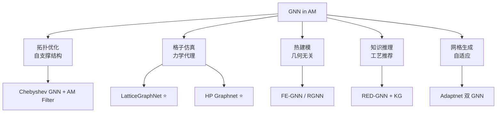

# GNN 拓扑优化与网格仿真

> [!abstract] 核心价值
> 图神经网络（GNN）将 mesh 天然映射为图结构，实现几何无关的热/力建模和自支撑结构优化。NVIDIA PhysicsNeMo 的开源化和 HP/Carbon3D 等企业的贡献使该方向快速走向工业化。

---

## 技术分支概览



---

## 关键模型（深入分析）

### GNN 自支撑结构拓扑优化 质量评级: 3.5/5

> [!info] 全可微分 GNN + AM Filter，消除传统 SIMP 灵敏度推导

| 属性 | 详情 |
|:-----|:-----|
| **论文** | [arXiv:2508.19169](https://arxiv.org/abs/2508.19169)（2025-08） |
| **框架** | PyTorch 全可微分 |
| **开源** | ==未公开代码== |
| **核心创新** | GNN 作为 neural field 参数化密度场 + 可微分 AM Filter |

#### 架构深度分析

**GNN 网络设计**：
- **图构建**：每个 FE 单元→图节点，共享面/边的单元互连
- **谱卷积**：Chebyshev 多项式近似（K 阶 = K-hop 邻域感受野）
- **特征增强**：Fourier Feature Mappings `γ(x) = [cos(2π·B·x), sin(2π·B·x)]`，克服低频偏置
- **输出**：每节点预测伪密度 ρ ∈ [0,1]（sigmoid 激活）

**AM 过滤器（全可微分）**：
```
优化循环（每次迭代）：
  1. GNN 前向传播 → 预测伪密度 ρ
  2. AM Filter → 过滤后密度 ρ̃（沿 z 轴逐层消除悬挑）
  3. SIMP 插值 → E(ρ̃) = ρ̃ᵖ·E₀
  4. FEA 求解 → 位移场 u、柔度 C、应力 σ
  5. 损失 = C + λ₁·max(V/V₀-f, 0) + λ₂·max(σ_pn-σ_allow, 0)
  6. Adam 优化器更新 GNN 权重（自动微分）
```
- 应力约束用 **p-norm 聚合** von Mises 应力：σ_pn = (Σ σᵢᵖ)^(1/p)
- AM Filter 嵌入为可微分算子，梯度通过 AD 自动传播

#### 与传统 SIMP/TopOpt 定量对比

| 特性 | 传统 SIMP/TopOpt | GNN Neural Field（本文） |
|:-----|:----------------|:------------------------|
| 设计变量 | 每单元一个密度变量 | GNN 权重（隐式参数化） |
| 灵敏度计算 | 需推导解析梯度 | ==自动微分，无需显式推导== |
| AM 约束添加 | 需推导新灵敏度 | 直接集成可微分 AM Filter |
| 应力约束 | 需 adjoint 方法 | p-norm + AD，无需 adjoint |
| 正则化 | 需密度过滤 + 投影 | GNN 架构自带隐式正则化 |
| 网格类型 | 通常限于结构化网格 | 支持结构化和非结构化网格 |

> [!warning] 复现评估
> 代码未开源，复现需从头实现 Chebyshev GNN + FEA + AM Filter，难度中等。基准测试：简支梁 + 悬臂梁，三种配置（无约束 / AM Filter / AM + 应力）。

#### CADPilot 集成路径

**推荐借鉴思想**用于 `apply_lattice` 节点：GNN 自支撑约束可确保生成结构无需额外支撑，减少后处理。

---

### LatticeGraphNet (Carbon3D + NVIDIA) ⭐ 质量评级: 4/5

> [!success] 双尺度 GNN 代理——从 48h FEM 到秒级推理

| 属性 | 详情 |
|:-----|:-----|
| **机构** | Carbon Inc. + NVIDIA |
| **论文** | [arXiv:2402.01045](https://arxiv.org/abs/2402.01045)（Engineering with Computers, 2024） |
| **框架** | NVIDIA PhysicsNeMo（==Apache 2.0==） |
| **精度** | 大多数预测 <1mm，平均 ~1.67% 结构尺寸 |
| **加速** | ==1000x-10000x==（vs FEM 48h-10天） |

#### 双尺度架构详解

```
LatticeGraphNet (LGN) 架构：

输入：格子结构几何 + 材料属性 + 载荷条件
  │
  ├─ LGN-i：粗尺度（Beam 表示）
  │   ├─ 编码：四面体网格 → 骨架梁表示
  │   ├─ 节点特征：梁节点位置、截面属性
  │   ├─ 边特征：梁长度、方向、连接关系
  │   ├─ MeshGraphNet 处理器：消息传递 → 粗位移预测
  │   └─ 输出：粗尺度节点位移（~1s/时间步）
  │
  └─ LGN-ii：细尺度（Tetrahedral Mesh）
      ├─ 输入：LGN-i 粗位移 + 细网格节点位置
      ├─ 映射学习：粗→细的位移场映射
      ├─ MeshGraphNet 处理器：细粒度消息传递
      └─ 输出：体素级精细位移（~5-7s/时间步）
```

#### MeshGraphNet 骨干配置

| 组件 | 配置 |
|:-----|:-----|
| 编码器 | 2 层 MLP，隐藏维度 128 |
| 处理器 | ==15 层消息传递 GNN==，隐藏维度 128 |
| 解码器 | 2 层 MLP，隐藏维度 128 |
| 消息聚合 | Summation aggregation |
| 边特征 | 位移向量 + 标量距离 |
| 节点特征 | 位置、速度、材料类型 |

> 15 层处理器 → 每节点可获取 15-hop 邻域信息，适合捕获远程物理效应

#### 性能指标

| 指标 | 数值 |
|:-----|:-----|
| 点对点误差 | <1mm，平均 ~1.67% 结构尺寸 |
| 推理时间（LGN-i） | ==~1s/时间步== |
| 推理时间（LGN-ii） | ~5-7s/时间步 |
| FEM 基线时间 | 48h ~ 10天/完整仿真 |
| 有效应变范围 | 至 25% 压缩应变 |
| 非线性行为 | 可预测屈曲等非线性响应 |

#### 支持的格子类型

Carbon3D 格子库：Kelvin (K)、Octet (O)、TPMS 族（Diamond / Neovius / Gyroid）、自定义设计

#### PhysicsNeMo 中的代码路径

```
physicsnemo/
├── models/meshgraphnet/        # MGN 核心模型
│   └── meshgraphnet.py
├── examples/
│   ├── additive_manufacturing/
│   │   └── sintering_physics/  # HP Graphnet（完整参考）
│   ├── cfd/
│   │   └── vortex_shedding_mgn/  # LGN 训练起始 recipe
│   └── structural_mechanics/
│       └── deforming_plate/    # MGN 结构力学示例
```

> [!warning] LatticeGraphNet 完整代码未直接在 PhysicsNeMo 仓库中公开，但核心组件 MeshGraphNet 可直接使用。开发路径：基于 vortex_shedding_mgn recipe → 扩展为双尺度架构。

---

### HP Virtual Foundry Graphnet ⭐ 质量评级: 4/5

→ 架构详见 [[surrogate-models-simulation#HP Virtual Foundry Graphnet]]

| 指标 | 数值 |
|:-----|:-----|
| 单步精度 | 0.7μm 均值偏差（63mm 测试件） |
| 完整烧结周期精度 | ==0.3mm==（~4h 物理烧结时间） |
| 代码 | [GitHub: physicsnemo/.../sintering_physics](https://github.com/NVIDIA/physicsnemo/tree/main/examples/additive_manufacturing/sintering_physics) |
| 许可 | ==Apache 2.0== |
| 损失函数选项 | standard, anchor, me, weighted, correlation, anchor_me |

---

### AM 知识图谱 + RED-GNN 质量评级: 3/5

| 属性 | 详情 |
|:-----|:-----|
| **论文** | [Applied Intelligence 2024](https://link.springer.com/article/10.1007/s10489-024-05757-8) |
| **问题** | 格子结构激光金属 AM 工艺参数推荐 |
| **RED-GNN 原始代码** | [GitHub: LARS-research/RED-GNN](https://github.com/LARS-research/RED-GNN)（WebConf 2022） |

#### 知识图谱设计

**实体类型**：

| 实体类别 | 示例 |
|:---------|:-----|
| 几何属性 | unit_cell_type, strut_diameter, strut_length, downskin_angle |
| 工艺参数 | laser_power, scan_speed, layer_thickness, hatch_spacing |
| 材料属性 | material_type, powder_size, density |
| 质量指标 | surface_roughness, porosity, mechanical_strength |

**关系定义**：
```
(头实体, 关系, 尾实体)
例：(BCC_lattice, isComposedOf, strut_0.5mm)
    (strut_0.5mm, requires, laser_power_200W)
    (laser_power_200W, with, scan_speed_800mm_s)
```

#### RED-GNN 图推理架构

| 组件 | 描述 |
|:-----|:-----|
| 关系有向图 (r-digraph) | 由重叠关系路径组成，捕获 KG 局部证据 |
| 动态规划编码 | 递归编码多个共享边的 r-digraph |
| 查询依赖注意力 | 根据不同查询选择强相关边 |
| 子图提取 | 基于封闭子图学习 |

**推理流程**：
```
给定查询：(BCC_lattice, requires, ?)
  → 提取封闭子图 → r-digraph 构建
  → 动态规划递归编码 → 注意力选择关键边
  → 排序候选实体 → 推荐最优工艺参数
```

**评估指标**：MRR、Hits@1/3/10，在归纳和转导推理中均优于基线。

---

### GNN 几何无关热建模 ⭐ 质量评级: 3.5/5

> [!success] 首个证明 GNN 可泛化到未见 AM 几何体的热建模方案

| 属性 | 详情 |
|:-----|:-----|
| **机构** | Northwestern University |
| **论文** | [Additive Manufacturing 2021](https://www.sciencedirect.com/science/article/abs/pii/S2214860421006011) |
| **后续** | RGNN 迁移学习版（Additive Manufacturing 2025, Vol. 109） |
| **工艺** | Directed Energy Deposition (DED) |
| **开源** | ==未开源== |

#### FE 启发的 GNN 架构

**图表示**：
- **节点**：FE 网格节点（热场采样点）
- **边**：基于六面体单元连接（每个六面体连接 8 节点）
- **关键洞见**：边连接模式与 FEM 刚度矩阵组装路径一致

**FE 启发的消息传递**：
```
传统 FEM：节点 i 的温度 ← Σ (刚度矩阵行 × 邻接节点温度)
GNN 类比：节点 i 的隐状态 ← Aggregate(MLP(邻域节点特征))

设计原则：
  - 每个节点向同一单元内的其他节点发送"消息"
  - 类似 FE 中局部单元贡献汇总到全局节点
  - 聚合操作模拟 FEM 全局刚度矩阵组装
```

**输入特征**：

| 特征 | 类型 |
|:-----|:-----|
| 节点空间坐标 (x,y,z) | 静态 |
| 当前温度 T(t) | 动态 |
| 激光位置/功率/速度 | 过程参数 |
| 材料热物性 | 全局条件 |

#### 长期热演化捕获机制

- **时空聚合**：消息传递同时在空间和时间维度上聚合
- **多层传播**：多层 GNN 叠加，热信息从热源沿网格逐步传播
- **递归预测**：当前步输出 → 下一步输入，捕获热历史累积效应
- **过程参数条件化**：激光功率、刀具路径、材料属性作为全局条件

#### 2025 年增强版 RGNN

| 改进 | 详情 |
|:-----|:-----|
| 迁移学习 | 预训练模型快速适配新材料 |
| 加速比 | ==405x== vs FEA |
| 跨材料泛化 | 成功预测不同材料系统的热行为 |
| 长时间验证 | 1000 步时间步新几何体上验证 |

---

### Adaptnet 双 GNN 网格生成 质量评级: 2.5/5

| 属性 | 详情 |
|:-----|:-----|
| **论文** | [Mathematics 2024](https://www.mdpi.com/2227-7390/12/18/2933) |
| **开源** | ==未开源== |
| **依赖工具** | Gmsh（开源网格生成器）、Mmg（开源 remesher） |

#### 双 GNN 流水线

```
CAD 几何 (STEP/IGES)
  │
  ├─ Meshnet (GNN #1)：初始网格生成
  │   ├─ 输入：CAD 几何特征（边界曲率、特征尺寸）
  │   ├─ 预测：局部网格尺寸 h
  │   └─ 传递给 Gmsh → 生成初始各向同性网格
  │
  └─ Graphnet (GNN #2)：自适应网格细化
      ├─ 两种模式：
      │   ├─ 直接模式：预测 Hessian 度量张量
      │   └─ 间接模式：先预测速度场 → 计算 Hessian
      ├─ 输出：各向异性度量场
      └─ 传递给 Mmg remesher → 生成自适应网格
```

**Hessian 度量张量**：M(x) = V·|Λ|·V^T，特征向量决定拉伸方向，特征值决定网格密度。Graphnet 直接预测度量分量，跳过传统"先求解物理场→再计算 Hessian"步骤。

**测试案例**：变形板（线弹性大变形）、圆柱绕流（稳态 Stokes 流）。

---

## 最新进展（2025-2026）

### PhysicsNeMo GNN 改进

| 版本 | 改进 |
|:-----|:-----|
| **25.08** | PyTorch Geometric 支持；MeshGraphNet float16/bfloat16 ==1.5-2x 加速==（>200k 节点）；Transformer Engine 集成 |
| **25.11** | 结构力学新示例；物理引导 GNN + KANs；**HybridMeshGraphNet**（双边类型：Mesh + World edges，适合大变形） |

### 多材料格子结构 GNN 逆设计（2025）

| 属性 | 详情 |
|:-----|:-----|
| **论文** | [Scientific Reports 2025](https://www.nature.com/articles/s41598-025-86812-3) |
| **创新** | 材料属性编码为图的==边特征==（非仅节点特征） |
| **功能** | 多目标优化：可调热膨胀 + 可调刚度 |

### DeepONet-GNN 复合架构（2025）

| 属性 | 详情 |
|:-----|:-----|
| **来源** | Additive Manufacturing 2025 |
| **架构** | DeepONet + 边缘感知双 GNN |
| **z 变形精度** | RMSE ==0.088mm== |
| **收敛速度** | 比基线快 ==50%== |

### 企业合作动态

| 合作 | 内容 |
|:-----|:-----|
| **nTop + Luminary + NVIDIA** | 参数化几何 + GPU 仿真 + PhysicsNeMo GNN，设计优化从数周→数小时 |
| **Siemens + NVIDIA** | 自主数字孪生 + 生成式仿真，PhysicsNeMo 开放模型 |
| **HP + NVIDIA** | Metal Jet 烧结变形预测，Apache 2.0 开源 |

---

## 核心框架

> [!tip] NVIDIA PhysicsNeMo
> Apache 2.0 开源，支持 MeshGraphNet、FNO、DeepONet、PINN。
> 含 AM 烧结物理示例代码。
> → 详见 [[surrogate-models-simulation#NVIDIA PhysicsNeMo]]

---

## 综合对比表

| 方向 | 代表工作 | GNN 类型 | 任务 | 精度 | 加速 | 开源 |
|:-----|:---------|:---------|:-----|:-----|:-----|:-----|
| 拓扑优化 | arXiv:2508.19169 | Chebyshev 谱 GNN | 自支撑结构 | 与 SIMP 可比 | AD 消除灵敏度推导 | ❌ |
| **格子仿真** | LatticeGraphNet | MeshGraphNet 双尺度 | 格子动力学 | <1mm 点误差 | ==1000-10000x== | PhysicsNeMo（部分） |
| 工艺推荐 | RED-GNN + KG | 关系有向图 GNN | 参数推荐 | MRR/Hits 领先 | 推理秒级 | RED-GNN 开源 |
| **热建模** | Mozaffar 2021/2025 | FE-GNN / RGNN | 温度场预测 | 高 | ==405x== vs FEA | ❌ |
| 网格生成 | Adaptnet 2024 | MeshGraphNets 双网络 | CAD→自适应网格 | 结构/流体验证 | 跳过 FE 求解 | ❌ |
| **烧结预测** | HP Graphnet | HybridMeshGraphNet | 金属烧结变形 | ==0.3mm / 0.7μm== | 数量级 | ==Apache 2.0== |
| 多材料逆设计 | Sci. Reports 2025 | 边特征 GNN | 格子逆设计 | 热膨胀+刚度 | 快速评估 | ❌ |

---

## 成熟度评估

| 应用 | 成熟度 | 开源 | 推荐 |
|:-----|:------|:-----|:-----|
| 金属烧结变形预测 | ★★★★ | HP Graphnet ==Apache 2.0== | ✅ 可直接参考 |
| 格子结构仿真代理 | ★★★☆ | PhysicsNeMo MGN 可用 | ✅ 中期探索 |
| 自支撑拓扑优化 | ★★★ | 未开源 | ⚠️ 需从头实现 |
| 几何无关热建模 | ★★★ | 未开源 | ⚠️ 中期探索 |
| 工艺参数推荐 | ★★☆ | RED-GNN 开源 | ⚠️ 数据构建成本高 |
| 自适应网格生成 | ★★ | 未开源 | ❌ 暂不推荐 |

---

## CADPilot 集成战略建议

> [!success] 推荐优先级

1. **中期（P1）**：参考 HP Graphnet + LatticeGraphNet 架构，在 PhysicsNeMo 上探索可打印性检查 PoC
   - 直接使用 PhysicsNeMo 的 MeshGraphNet 模块
   - 先跑通 sintering_physics 示例，理解训练流程
   - 扩展到 FDM/LPBF 变形预测

2. **中期（P2）**：评估 RGNN 几何无关热建模用于 `thermal_simulation`
   - 2025 版 405x 加速已达实用水平
   - 关键挑战：需要 DED/LPBF FEM 仿真数据作为 GT

3. **长期**：GNN 自支撑优化集成到 `apply_lattice`
   - 等待开源实现或自行实现 Chebyshev GNN + AM Filter
   - 可结合多材料逆设计方案

4. **长期**：AM 知识图谱辅助工艺推荐
   - RED-GNN 框架可用，但 AM 知识图谱构建成本高

---

## 更新日志

| 日期 | 变更 |
|:-----|:-----|
| 2026-03-03 | 深入研究更新：LatticeGraphNet 双尺度架构详解（MeshGraphNet 15层处理器、精度指标）；GNN 自支撑拓扑优化 Chebyshev 谱 GNN + AM Filter 机制；RED-GNN 知识推理架构和推理流程；FE-GNN 几何无关热建模机制及 2025 RGNN 405x 加速；Adaptnet 双 GNN + Hessian 度量；PhysicsNeMo 25.08/25.11 GNN 改进；企业合作动态；综合对比表 |
| 2026-03-03 | 初始版本 |
