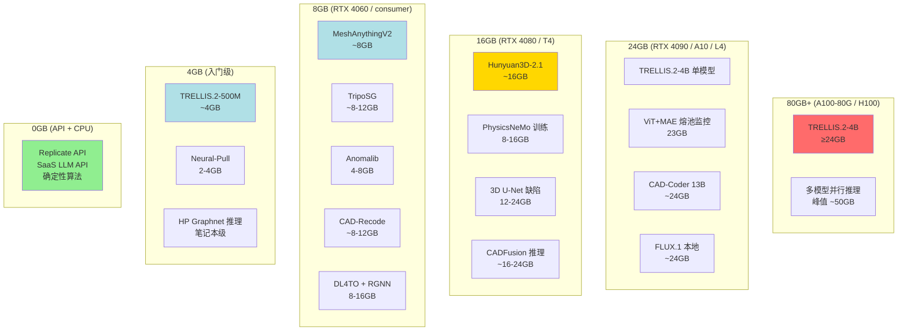
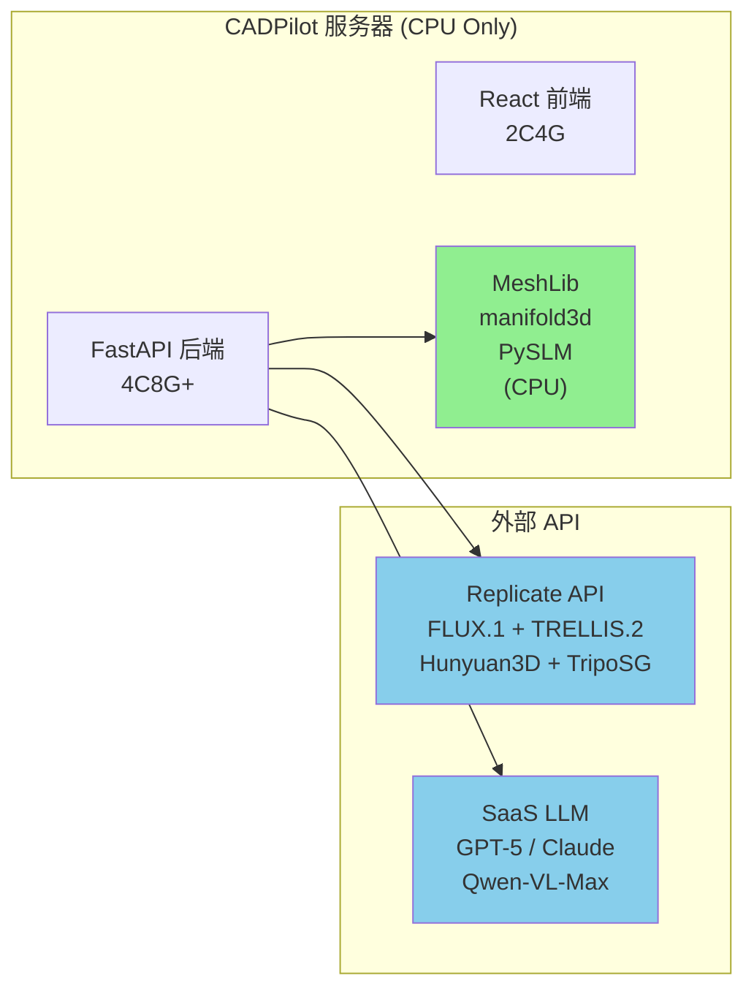
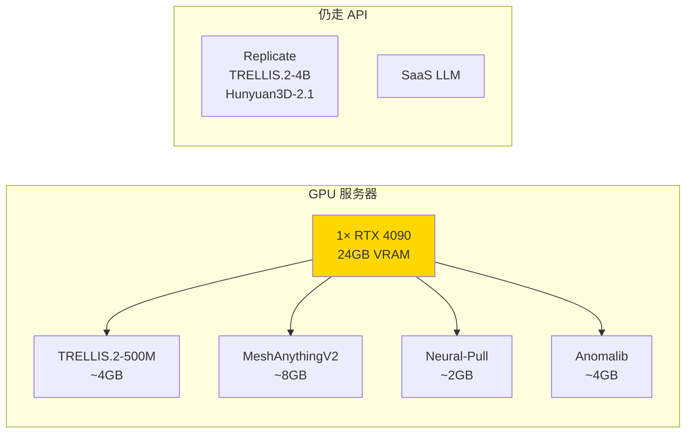
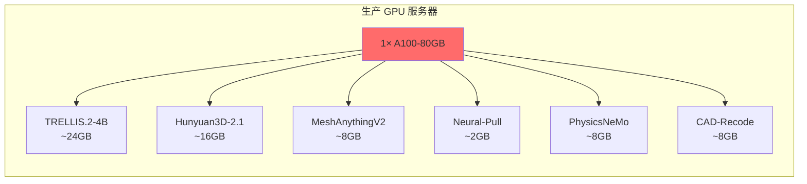
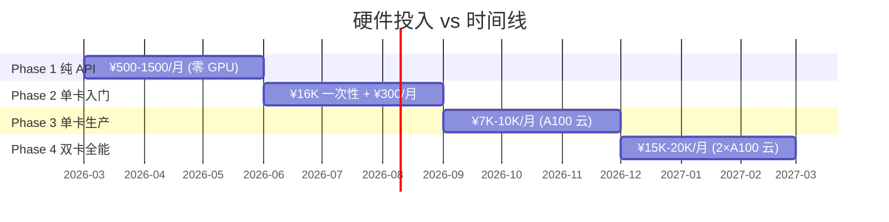

# CADPilot 硬件需求规划

> [!abstract] 核心价值
> 基于全部 ==21+ 技术方向 deep-analysis== 和 2 份 Action Plan 的模型部署需求，系统梳理 CADPilot 全管线节点的 GPU/VRAM 需求，制定分阶段硬件采购与部署策略。本文档是基础设施预算的直接输入。

> [!important] 关键结论
> 1. **短期零 GPU**：核心管线全部通过 API + CPU 运行，无需本地 GPU
> 2. **中期单卡覆盖**：1× A100-80GB 可同时加载全部中期模型（峰值 ~50GB）
> 3. **长期双卡并行**：过程监控 + 缺陷检测 + 热仿真并行推理需 2× A100-80GB
> 4. **训练需求独立**：模型微调/训练建议云端按需租用，不纳入常驻硬件

---

## 一、全节点模型部署需求

### 1.1 精密管道（Precision Pipeline）

| 管线节点 | 模型/工具 | 参数量 | VRAM | 部署方式 | 来源 |
|:---------|:---------|:------:|:----:|:---------|:-----|
| `generate_cadquery` | GPT-5 / Claude / Qwen-Coder | — | — | ==SaaS API== | 已有实现 |
| SmartRefiner VL 对比 | Qwen-VL-Max | — | — | ==SaaS API== | 已有实现 |
| SmartRefiner 多候选（中期） | CADFusion 推理 | 8B | ~16-24GB | 本地 / API | [[action-plan-generation-pipeline#Phase 3]] |

> [!note] 精密管道无本地 GPU 需求
> 代码生成和 VL 评估全部走 SaaS API（DashScope / OpenAI）。仅 Phase 3 多候选 SmartRefiner 可选本地 CADFusion 推理，但也可继续用 API。

### 1.2 有机管道（Organic Pipeline）

| 管线节点 | 模型 | 参数量 | VRAM | 推理延迟 | 部署方式 | 来源 |
|:---------|:-----|:------:|:----:|:---------|:---------|:-----|
| `text_to_image` | FLUX.1 Schnell | ~12B | ~24GB | ~3s | ==Replicate API==（短期）→ 本地（长期） | [[action-plan-organic-pipeline]] |
| `generate_raw_mesh` | TRELLIS.2-500M | 500M | ==~4GB== | ~8s (H100) | API → 本地 | [[action-plan-organic-pipeline]] |
| `generate_raw_mesh` | TRELLIS.2-4B | 4B | ==≥24GB== | ~60s (H100) | API → 本地 | [[image-text-to-3d-generation]] |
| `generate_raw_mesh` | Hunyuan3D-2.1 | ~2B | ~16GB | ~10s | API → 本地 | [[image-text-to-3d-generation]] |
| `generate_raw_mesh` | TripoSG | ~1B | ~8-12GB | ~10s | API → 本地 | [[image-text-to-3d-generation]] |
| `mesh_healer` 确定性 | MeshLib + manifold3d | — | ==CPU== | <1s | 本地（非 GPU） | [[mesh-processing-repair]] |
| `mesh_healer` AI fallback | Neural-Pull | ~2M | ==2-4GB== | 30-60min/件 | 本地 | [[mesh-processing-repair]] |
| `mesh_healer` 后处理 | MeshAnythingV2 | 350M | ==~8GB== | ~45s | 本地 | [[mesh-processing-repair]] |
| `mesh_scale` | 数值算法 | — | ==CPU== | <1s | 本地（非 GPU） | — |
| `printability` | 数值检查 | — | ==CPU== | <1s | 本地（非 GPU） | — |

### 1.3 逆向工程管线（中期新增）

| 管线节点 | 模型 | 参数量 | VRAM | 推理延迟 | 部署方式 | 来源 |
|:---------|:-----|:------:|:----:|:---------|:---------|:-----|
| `scan_to_cad` (照片) | CAD-Coder | 13B | ~24GB | 未知 | 本地 | [[action-plan-generation-pipeline#Phase 4]] |
| `scan_to_cad` (点云) | CAD-Recode | 2B | ==~8-12GB== | 未知 | 本地 Docker | [[reverse-engineering-scan-to-cad]] |

### 1.4 制造准备管线

| 管线节点 | 模型/工具 | 参数量 | VRAM | 推理延迟 | 部署方式 | 来源 |
|:---------|:---------|:------:|:----:|:---------|:---------|:-----|
| `orientation_optimizer` | PySLM + pymoo NSGA-II | — | ==CPU== | 秒级 | 本地 | [[build-orientation-support-optimization]] |
| `generate_supports` | PySLM BlockSupport | — | ==CPU== | 秒级 | 本地 | [[build-orientation-support-optimization]] |
| `slice_to_gcode` | OrcaSlicer / CuraEngine CLI | — | ==CPU== | 秒-分钟级 | Docker 容器 | [[slicer-integration-ai-params]] |
| `thermal_simulation` 代理 | PhysicsNeMo MeshGraphNet | — | ==8-16GB== | 秒级 | 本地 | [[surrogate-models-simulation]] |
| `thermal_simulation` 高级 | RGNN / LP-FNO | — | ==8-16GB== | 毫秒-秒级 | 本地 | [[gnn-topology-optimization]] |
| `apply_lattice` | DL4TO + pymoo | — | ==8-16GB== | 秒级 | 本地 | [[topology-optimization-tools]] |

### 1.5 质量与合规

| 管线节点 | 模型/工具 | 参数量 | VRAM | 推理延迟 | 部署方式 | 来源 |
|:---------|:---------|:------:|:----:|:---------|:---------|:-----|
| `(新) 过程监控` PoC | Anomalib PatchCore | — | ==4-8GB== | 实时 | 本地 + 边缘 | [[defect-detection-monitoring]] |
| `(新) 过程监控` 深度 | ViT + MAE 熔池监控 | MAE-Base | ==23GB== | 近实时 | 本地 | [[defect-detection-monitoring]] |
| `(新) 缺陷检测` 体积 | 3D U-Net | — | ==12-24GB== | 离线批处理 | 本地 | [[defect-detection-monitoring]] |
| `(新) 可打印性` | HP Graphnet (MeshGraphNet) | — | ==笔记本级== | 数秒 | 本地 | [[surrogate-models-simulation]] |
| `(新) 合规检查` | 规则引擎 + NLP/RAG | — | ==CPU== | 秒级 | 本地 | [[standards-compliance-automation]] |
| `(新) 自动报价` | CADEX MTK + XGBoost | — | ==CPU== | 秒级 | 本地 | [[automated-quoting-engine]] |

### 1.6 汇总：纯 CPU 节点（无 GPU 需求）

以下节点仅需 CPU，不计入 GPU 预算：

- `mesh_healer`（确定性算法：MeshLib + manifold3d）
- `mesh_scale`、`printability`（数值检查）
- `orientation_optimizer`、`generate_supports`（PySLM + pymoo）
- `slice_to_gcode`（OrcaSlicer Docker）
- `(新) 合规检查`（规则引擎）
- `(新) 自动报价`（CADEX MTK + ML）
- `(新) 可打印性` 基础版（HP Graphnet 笔记本级 GPU 即可）

---

## 二、VRAM 需求分层



---

## 三、分阶段部署策略

### Phase 1：纯 API + CPU（0-3 月）

> [!success] 零 GPU，立即可用



| 资源 | 规格 | 成本估算 |
|:-----|:-----|:---------|
| **服务器** | 4C 8GB+ RAM（无 GPU） | 云 ~¥200/月 |
| **Replicate API** | 按量付费 | ~$50-200/月（<100 次/天） |
| **SaaS LLM** | DashScope / OpenAI | 已有预算 |
| **总计** | — | ==~¥500-1500/月== |

**覆盖节点**：全部精密管道 + 全部有机管道 + mesh 修复（确定性）+ 切片 + 支撑 + 方向优化

### Phase 2：单卡本地验证（3-6 月）

> [!info] 中频使用，本地推理降低延迟和成本



| 资源 | 规格 | 成本估算 |
|:-----|:-----|:---------|
| **GPU 服务器** | 1× RTX 4090 24GB | 硬件 ~¥16,000 一次性 |
| **同时加载** | TRELLIS.2-500M(4) + MeshAnythingV2(8) + Neural-Pull(2) + Anomalib(4) | ==峰值 ~18GB / 24GB== |
| **API 降级** | Replicate 仅用于 4B 版本 / 备选模型 | ~$20-50/月 |
| **总计** | — | 一次性 ~¥16K + ==~¥300/月== |

**新增本地能力**：TRELLIS.2-500M 快速推理、MeshAnythingV2 面数优化、Neural-Pull AI 修复、Anomalib 缺陷检测 PoC

> [!warning] RTX 4090 限制
> - 无法加载 TRELLIS.2-4B（需 ≥24GB 且无余量）
> - 无法加载 CAD-Coder 13B
> - 多模型并行时需注意 VRAM 调度

### Phase 3：单卡生产（6-9 月）

> [!tip] A100-80GB 覆盖全部中期模型



| 资源 | 规格 | 成本估算 |
|:-----|:-----|:---------|
| **GPU 服务器** | 1× A100-80GB | 云 ~$1.5-2/h（~¥7,000-10,000/月 24×7） |
| **同时加载** | 按需切换，峰值不超过 2-3 模型 | ==峰值 ~50GB / 80GB== |
| **SaaS LLM** | 精密管道继续用 API | 已有预算 |

**全部中期模型可本地运行**：
- TRELLIS.2-4B（24GB）— 最高质量 3D 生成
- Hunyuan3D-2.1（16GB）— 形状精度优先
- TripoSG（8-12GB）— SDF 水密 mesh
- MeshAnythingV2（8GB）— 面数优化
- Neural-Pull（2GB）— AI 修复
- PhysicsNeMo MeshGraphNet（8-16GB）— 可打印性 / 热仿真
- CAD-Recode（8-12GB）— 逆向工程

> [!tip] VRAM 调度策略
> 80GB 无法同时加载全部模型（总和 ~90GB+），但管线是==串行执行==的——每次只有 1-2 个模型需要在 GPU 上。采用按需加载 + LRU 缓存策略：
> - 常驻：TRELLIS.2-4B（24GB，最高频）
> - 按需加载：其余模型推理完即释放
> - 80GB 足够同时驻留 2 个大模型 + 1 个小模型

### Phase 4：双卡全能（9-12 月）

> [!warning] 仅在过程监控 + 缺陷检测 + 实时推理并行场景才需要

| 资源 | 规格 | 用途 | 成本估算 |
|:-----|:-----|:-----|:---------|
| **GPU 1** | A100-80GB | 3D 生成 + 仿真 + 逆向工程 | ~$1.5-2/h |
| **GPU 2** | A100-80GB 或 A10-24GB | 过程监控（ViT+MAE 23GB）+ 缺陷检测 | ~$1-2/h |
| **总计** | 160GB VRAM（或 104GB） | 全节点并行 | ==~¥15,000-20,000/月== |

---

## 四、模型 VRAM 详情表

### 4.1 推理 VRAM（按需求从低到高排序）

| 模型 | 参数量 | VRAM | 精度 | 管线节点 | 阶段 |
|:-----|:------:|:----:|:----:|:---------|:----:|
| Neural-Pull | ~2M | ==2-4GB== | FP32 | `mesh_healer` AI fallback | 中期 |
| TRELLIS.2-500M | 500M | ==~4GB== | FP16 | `generate_raw_mesh` | 中期 |
| Anomalib PatchCore | — | ==4-8GB== | FP32 | `(新) 过程监控` | 中期 |
| HP Graphnet | — | ==<8GB== | FP32 | `(新) 可打印性` | 中期 |
| MeshAnythingV2 | 350M | ==~8GB== | FP16 | mesh 后处理 | 中期 |
| PhysicsNeMo MeshGraphNet | — | ==8-16GB== | FP32 | `thermal_simulation` | 中期 |
| DL4TO | — | ==8-16GB== | FP32 | `apply_lattice` | 中期 |
| RGNN | — | ==8-16GB== | FP32 | `thermal_simulation` | 长期 |
| CAD-Recode | 2B | ==~8-12GB== | FP16 | `scan_to_cad` | 中期 |
| TripoSG | ~1B | ==~8-12GB== | FP16 | `generate_raw_mesh` | 中期 |
| Hunyuan3D-2.1 | ~2B | ==~16GB== | FP16 | `generate_raw_mesh` | 中期 |
| 3D U-Net | — | ==12-24GB== | FP32 | `(新) 缺陷检测` | 长期 |
| ViT + MAE | MAE-Base | ==23GB== | FP32 | `(新) 过程监控` | 长期 |
| TRELLIS.2-4B | 4B | ==≥24GB== | FP16 | `generate_raw_mesh` | 中期 |
| CAD-Coder | 13B | ==~24GB== | FP16 | `scan_to_cad` | 中期 |
| FLUX.1（本地） | ~12B | ==~24GB== | FP16 | `text_to_image` | 长期 |
| CADFusion 推理 | 8B | ==~16-24GB== | FP16 | SmartRefiner | 长期 |

### 4.2 训练 VRAM（按需云端租用）

> [!warning] 训练需求不纳入常驻硬件预算，建议云端按需租用

| 模型 | 训练方式 | 训练 GPU 需求 | 训练时长 | 备注 |
|:-----|:---------|:-------------|:---------|:-----|
| CADFusion | LoRA r=32 微调 | 4× A6000-48GB | 未知 | 生产环境推理可单卡 |
| CAD-Llama | Adaptive Pretrain + LoRA | A100 ~50 GPU·h | ~50h | 仅在自训练场景 |
| PhysicsNeMo | MeshGraphNet 训练 | 单卡 8-16GB+ | 小时级 | 可在推理 GPU 上训练 |
| ViT + MAE | 微调 | A10 23GB | ~25h | 缺陷检测场景 |
| Text-to-CadQuery | 全量微调 7B | A100 | ~33h | 精密管道增强 |

---

## 五、成本对比



| 阶段 | 月成本 | 累计投入（到阶段末） | 能力覆盖 |
|:-----|:------:|:-------------------:|:---------|
| Phase 1（0-3 月） | ¥500-1,500 | ¥1,500-4,500 | 全管线（API） |
| Phase 2（3-6 月） | ¥300 + ¥16K 硬件 | ¥18,400-21,400 | + 本地轻量推理 |
| Phase 3（6-9 月） | ¥7,000-10,000 | ¥39,400-51,400 | + 全模型本地推理 |
| Phase 4（9-12 月） | ¥15,000-20,000 | ¥84,400-111,400 | + 并行实时监控 |

> [!tip] 自购 vs 云租对比（Phase 3）
>
> | 方式 | 初始投入 | 月成本 | 12 月总成本 | 优势 |
> |:-----|:---------|:------:|:----------:|:-----|
> | 云 A100-80GB | ¥0 | ¥7,000-10,000 | ¥84,000-120,000 | 零运维、弹性扩缩、按需开关 |
> | 自购 RTX 4090×2 | ~¥32,000 | ¥500（电费） | ~¥38,000 | 长期低成本、无网络延迟 |
> | 自购 A100-80GB | ~¥80,000-120,000 | ¥1,000（电费） | ~¥92,000-132,000 | 最大 VRAM、无限使用 |
>
> **推荐**：Phase 2 自购 RTX 4090，Phase 3 先云租 A100 验证负载，确认常驻需求后再决定自购。

---

## 六、推荐硬件方案

### 方案 A：最小起步（推荐）

```
Phase 1 → 纯 API，零硬件投入
Phase 2 → 自购 1× RTX 4090 (24GB)
Phase 3 → 云租 1× A100-80GB（按需）
```

**适合**：验证阶段、用户量 <100/天

### 方案 B：快速扩展

```
Phase 1 → 纯 API
Phase 2 → 直接云租 1× A100-80GB
Phase 3 → 2× A100-80GB（生产 + 监控）
```

**适合**：需快速上生产、不愿维护本地硬件

### 方案 C：自建全能

```
Phase 1 → 纯 API
Phase 2 → 自购工作站（2× RTX 4090, 48GB 总 VRAM）
Phase 3 → 升级为 A100/H100（自购或长期租）
```

**适合**：长期投入、对延迟和成本极度敏感

---

## 七、CPU 与内存需求

GPU 之外，以下为 CPU 和内存基线：

| 组件 | 最低配置 | 推荐配置 | 说明 |
|:-----|:---------|:---------|:-----|
| **CPU** | 8 核 | 16 核+ | CadQuery 执行 + OrcaSlicer 切片为 CPU 密集型 |
| **RAM** | 16GB | 32-64GB | MeshLib 处理大型 mesh（>1M faces）时内存敏感 |
| **存储** | 100GB SSD | 500GB NVMe SSD | 模型权重（TRELLIS.2-4B ~8GB）+ 临时文件 + Docker 镜像 |
| **网络** | 10Mbps | 100Mbps+ | API 调用 + 模型下载 + 前端资源 |

### 并发处理估算

| 场景 | CPU 核心 | RAM | GPU VRAM |
|:-----|:--------:|:---:|:--------:|
| 单用户全管线 | 4 核 | 8GB | 按模型 |
| 10 并发用户 | 16 核 | 32GB | 共享 GPU（排队） |
| 50 并发用户 | 32 核 | 64GB | 多 GPU / 推理服务器 |

---

## 八、风险评估

| 风险 | 概率 | 影响 | 缓解措施 |
|:-----|:----:|:----:|:---------|
| Replicate API 延迟波动大 | 中 | 中 | 设置 timeout + 用户可见进度条；Phase 2 本地化降低依赖 |
| RTX 4090 VRAM 不足以加载 4B 模型 | 确定 | 中 | 500M 版本覆盖大部分场景；4B 走 API |
| A100 云实例抢不到 | 低 | 高 | 预留实例 / 多云备选（AWS + GCP + 阿里云） |
| 模型权重更新导致 VRAM 变化 | 中 | 低 | 预留 20% VRAM 余量；关注上游 release notes |
| 多模型并行时 OOM | 中 | 中 | LRU 缓存策略 + 按需加载；管线串行执行天然降低并发 |

---

## 九、与 Roadmap 的对应

| Roadmap 条目 | GPU 需求级别 | 硬件阶段 |
|:-------------|:-----------|:---------|
| S1 CadQuery 数据集 | CPU | Phase 1 |
| S2 MeshAnythingV2 | ==8GB== | Phase 2 |
| S3 ECIP + SmartRefiner | API | Phase 1 |
| S5 PySLM | CPU | Phase 1 |
| S6 Anomalib PoC | ==4-8GB== | Phase 2 |
| S7 切片器 Docker | CPU | Phase 1 |
| S8 方向优化 | CPU | Phase 1 |
| ==M4 有机管道升级== | API → ==≥24GB== | Phase 1 → Phase 3 |
| M1 Neural-Pull | ==2-4GB== | Phase 2 |
| M2 PhysicsNeMo | ==8-16GB== | Phase 2-3 |
| M6 CADEX 报价 | CPU | Phase 2 |
| M7 SimScale FEA | API | Phase 2 |
| M8 CAD-Recode | ==8-12GB== | Phase 3 |

---

## 十、决策记录

| 日期 | 决策 | 理由 |
|:-----|:-----|:-----|
| 2026-03-04 | ==Phase 1 零 GPU== | Replicate API 覆盖全部 3D 生成模型，短期验证无需本地部署 |
| 2026-03-04 | ==RTX 4090 作为 Phase 2 首选== | 性价比最高（¥16K / 24GB），覆盖 500M 版本 + 轻量模型 |
| 2026-03-04 | ==训练需求云端按需== | 训练为一次性 / 低频操作，不值得常驻 GPU |
| 2026-03-04 | ==管线串行执行 + LRU 缓存== | 避免多模型并行 OOM，80GB A100 足够按需切换 |
| 2026-03-04 | ==Phase 3 先云后买== | 云租验证实际负载，确认需求后再决定自购 |

---

## 参考文献

1. NVIDIA A100 Tensor Core GPU - 80GB HBM2e, 2TB/s 带宽
2. NVIDIA RTX 4090 - 24GB GDDR6X, 1TB/s 带宽
3. Replicate Pricing: https://replicate.com/pricing
4. 各模型 VRAM 需求来源：见各 `[[deep-analysis]]` 文档中标注的原始论文和 GitHub README

---

## 更新日志

| 日期 | 变更 |
|:-----|:-----|
| 2026-03-04 | 初始版本：基于全部 21+ 研究方向梳理 GPU/VRAM 需求，制定 4 阶段硬件部署策略 |
