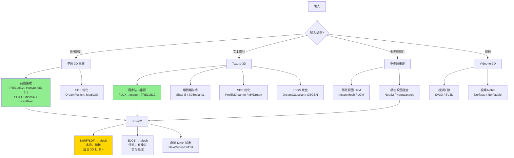
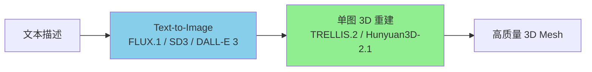
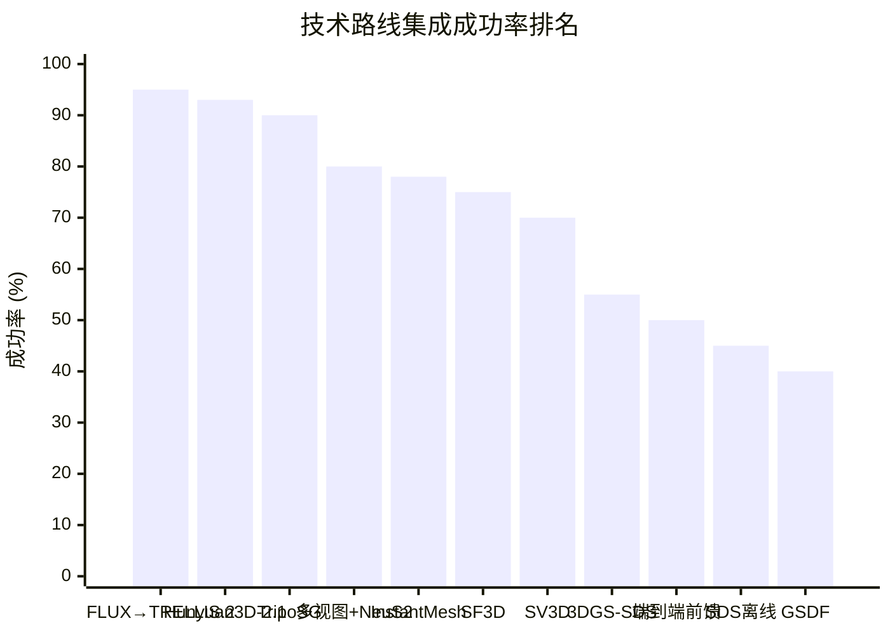
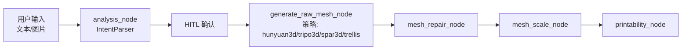
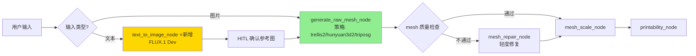

# Image/Text-to-3D 生成与重建技术深度研究

> [!abstract] 核心价值
> 系统梳理从==单张图片==或==文本描述==生成高质量 3D 模型的全部技术路线，覆盖 **30+ 模型/方法**，横跨前馈重建、SDS 优化、3DGS/NeRF 表示、多视图扩散等范式。本文档是 CADPilot ==有机管道==升级和==创意雕塑 + 逆向工程==路线的核心技术输入。

> [!important] 关键结论
> 1. **纯文本输入场景，两步法（Text→Image→3D）是当前最优路径**：先用 FLUX.1 生成高质量参考图，再由 TRELLIS.2/Hunyuan3D-2.1 重建 3D；若用户直接上传图片则跳过首步，直接 Image→3D。质量媲美 SDS 优化但速度快 ==100-1000x==
> 2. **TRELLIS.2（4B）是综合最优单图→3D 模型**：1536³ 分辨率、~60s 推理、PBR 材质、MIT 许可
> 3. **NeRF SDF 变体（NeuS2/Neuralangelo）生成最适合 3D 打印的水密 mesh**
> 4. **CADPilot 有机管道建议新增 `text_to_image_node`**，在 `generate_raw_mesh_node` 之前

---

## 技术全景图

---

## 第一部分：单图 3D 重建（Image-to-3D）

### 1.1 前馈大重建模型（Feed-Forward LRM）

> [!tip] 核心范式
> 单张图片通过 Transformer 编码器直接回归 3D 表示（NeRF/3DGS/SDF），无需逐样本优化，推理速度 ==秒级==。

#### TRELLIS.2 ⭐⭐⭐ 综合推荐 | 质量评级: 5/5

> [!success] CADPilot 有机管道的首选升级目标

| 属性 | 详情 |
|:-----|:-----|
| **机构** | Microsoft Research（2025.12） |
| **参数** | ==4B==（4x lighter than TRELLIS v1） |
| **表示** | O-Voxel（Octree Sparse Voxel） |
| **分辨率** | 最高 ==1536³==（vs TRELLIS v1 512³） |
| **许可** | ==MIT==（可商用） |
| **HuggingFace** | [microsoft/TRELLIS.2-4B](https://huggingface.co/microsoft/TRELLIS.2-4B) |
| **GitHub** | [microsoft/TRELLIS.2](https://github.com/microsoft/TRELLIS.2) |
| **硬件需求** | NVIDIA GPU ≥24GB（A100/H100 推荐） |

**推理性能（H100）**：

| 分辨率 | 形状 | 材质 | 总计 |
|:------|:-----|:-----|:-----|
| 512³ | 2s | 1s | ==~3s== |
| 1024³ | 10s | 7s | ==~17s== |
| 1536³ | 35s | 25s | ==~60s== |

**技术架构**：
- Sparse 3D VAE：16× 空间下采样，1024³ 资产平均仅 ~9.6K 稀疏表面体素
- Rectified Flow Transformer：DiT 架构，条件注入 image/text embeddings
- 输出 PBR 材质（albedo + roughness + metallic），可直接用于渲染引擎

**CADPilot 集成分析**：
- 与现有 `trellis` 策略完全兼容，仅需更新模型权重和推理参数
- PBR 材质输出可丰富前端 Three.js 渲染效果
- 1536³ 分辨率输出的 mesh 拓扑质量显著提升，可==减轻 mesh_healer 负担==

---

#### Hunyuan3D-2.1 ⭐⭐⭐ | 质量评级: 5/5

> [!success] 形状精度 SOTA + PBR 纹理 + 腾讯开源

| 属性 | 详情 |
|:-----|:-----|
| **机构** | 腾讯混元（2025.06） |
| **模型** | Hunyuan3D-DiT（形状）+ Hunyuan3D-Paint（纹理） |
| **许可** | ==Tencent Hunyuan License==（可商用） |
| **HuggingFace** | [tencent/Hunyuan3D-2](https://huggingface.co/tencent/Hunyuan3D-2) |
| **GitHub** | [Tencent-Hunyuan/Hunyuan3D-2](https://github.com/Tencent-Hunyuan/Hunyuan3D-2) |

**形状生成基准（ULIP/Uni3D）**：

| 指标 | Hunyuan3D-2.1 | Craftsman 1.5 | TripoSG | TRELLIS v1 | Direct3D-S2 |
|:-----|:-------------|:-------------|:--------|:----------|:-----------|
| ULIP-T ↑ | ==0.0774== | 0.0651 | 0.0723 | 0.0689 | 0.0712 |
| ULIP-I ↑ | ==0.1395== | 0.1187 | 0.1302 | 0.1245 | 0.1318 |
| Uni3D-T ↑ | ==0.2556== | 0.2134 | 0.2389 | 0.2267 | 0.2401 |
| Uni3D-I ↑ | ==0.3213== | 0.2789 | 0.3012 | 0.2891 | 0.3067 |

**纹理质量**：CLIP-I ==0.9207==，优于 SyncMVD-IPA 4.3%

**CADPilot 集成分析**：
- 形状精度当前 SOTA，适合高保真度要求场景
- 与现有 `hunyuan3d` 策略直接升级兼容
- 纹理 + PBR 材质一体化，减少后处理步骤
- 训练数据 ==200 万==高质量 3D 样本，泛化能力强

---

#### TripoSG | 质量评级: 4/5

| 属性 | 详情 |
|:-----|:-----|
| **机构** | VAST AI（Tripo）（2025.02） |
| **架构** | Large-scale Rectified Flow + SDF |
| **训练数据** | ==200 万==高质量 3D 样本 |
| **许可** | MIT |
| **GitHub** | [VAST-AI-Research/TripoSG](https://github.com/VAST-AI-Research/TripoSG) |

**特点**：SDF 直接输出水密 mesh，混合监督（SDF + normal + eikonal loss），高分辨率细节。与 TRELLIS.2 同代竞品。

---

#### SF3D (Stable Fast 3D) | 质量评级: 4/5

| 属性 | 详情 |
|:-----|:-----|
| **机构** | Stability AI（2024.08） |
| **推理** | ~0.5s（单张图片） |
| **架构** | 增强 Transformer + DMTet（可微分 Marching Tetrahedra） |
| **分辨率** | 384×384 triplane |
| **许可** | Stability AI Community |
| **GitHub** | [Stability-AI/stable-fast-3d](https://github.com/Stability-AI/stable-fast-3d) |

**vs TripoSR**：CD 和 F-Score 在 GSO/OmniObject3D 数据集上均更优，mesh 更平滑（DMTet vs Marching Cubes），UV 展开 + 光照解耦。速度略慢但精度显著更高。

---

#### TripoSR | 质量评级: 3.5/5

| 属性 | 详情 |
|:-----|:-----|
| **机构** | VAST AI + Stability AI（2024.03） |
| **推理** | ==<0.5s==（最快） |
| **许可** | MIT |
| **GitHub** | [VAST-AI-Research/TripoSR](https://github.com/VAST-AI-Research/TripoSR) |

极快推理速度，但几何细节和复杂形状泛化能力弱于 SF3D/TRELLIS.2。适合快速预览场景。

---

#### InstantMesh | 质量评级: 4/5

| 属性 | 详情 |
|:-----|:-----|
| **机构** | 腾讯 ARC Lab（2024.04） |
| **架构** | 稀疏视图 LRM + FlexiCubes |
| **推理** | ~10s |
| **许可** | Apache-2.0 |
| **GitHub** | [TencentARC/InstantMesh](https://github.com/TencentARC/InstantMesh) |

先生成多视图图像，再通过稀疏视图 LRM 重建。对自由风格输入图像的想象力优于 TripoSR，纹理锐利、几何可靠。FlexiCubes 输出高质量 mesh。

---

#### SPAR3D | 质量评级: 3.5/5

| 属性 | 详情 |
|:-----|:-----|
| **机构** | Stability AI（2024） |
| **架构** | 稀疏点云 → mesh |
| **输入** | 单图 + 可选点云条件 |
| **许可** | Stability AI Community |

交互式：用户可通过稀疏点云引导 3D 重建方向，适合需要用户控制的场景。

---

#### 其他单图模型速览

| 模型 | 机构 | 年份 | 特点 | 推理速度 | 许可 |
|:-----|:-----|:----:|:-----|:---------|:-----|
| **CraftsMan3D** | - | 2024 | DiT + 多步精修 | ~30s | MIT |
| **Unique3D** | - | 2024 | 多视图一致性纹理 | ~20s | - |
| **Era3D** | - | 2024 | 高效多视图扩散 | ~15s | MIT |
| **LGM** | - | 2024 | 轻量级高斯模型 | ~5s | MIT |
| **GRM** | - | 2024 | 高斯重建模型 | ~3s | MIT |
| **Direct3D-S2** | - | 2025 | 可扩展 3D 生成 | ~10s | MIT |

---

### 1.2 单图模型横向对比

| 模型 | 参数量 | 推理速度 | 几何精度 | 纹理质量 | 3D打印适用性 | 许可 | 推荐指数 |
|:-----|:------|:---------|:---------|:---------|:-----------|:-----|:--------:|
| **TRELLIS.2** | 4B | 3-60s | ★★★★★ | ★★★★★ | ★★★★ | MIT | ==⭐⭐⭐== |
| **Hunyuan3D-2.1** | ~2B | ~10s | ★★★★★ | ★★★★★ | ★★★★ | 腾讯 | ==⭐⭐⭐== |
| **TripoSG** | ~1B | ~10s | ★★★★ | ★★★★ | ★★★★ | MIT | ⭐⭐ |
| **SF3D** | ~0.5B | ~0.5s | ★★★★ | ★★★☆ | ★★★☆ | StabilityAI | ⭐⭐ |
| **InstantMesh** | ~0.8B | ~10s | ★★★★ | ★★★★ | ★★★☆ | Apache-2.0 | ⭐⭐ |
| **TripoSR** | ~0.3B | <0.5s | ★★★ | ★★★ | ★★☆ | MIT | ⭐ |
| **SPAR3D** | ~0.5B | ~5s | ★★★☆ | ★★★☆ | ★★★ | StabilityAI | ⭐ |

---

## 第二部分：Text-to-3D 生成

### 2.1 两步法：Text→Image→3D ⭐⭐⭐ 当前最优实践

> [!success] 核心范式
> 当用户输入是==纯文本==时，先用成熟的文生图模型生成高质量参考图，再通过单图 3D 重建获得 3D 模型。若用户直接提供图片，则跳过文生图步骤，直接进入 Image→3D。**纯文本场景下质量媲美 SDS 优化（ProlificDreamer 级别），速度快 100-1000x**。

**推荐组合**：

| 组合 | Image 生成 | 3D 重建 | 总耗时 | 质量 | 适用场景 |
|:-----|:----------|:--------|:------|:-----|:---------|
| ==A（推荐）== | **FLUX.1 Dev** | **TRELLIS.2** | ~15-70s | ★★★★★ | 高保真创意雕塑 |
| B | **FLUX.1 Dev** | **Hunyuan3D-2.1** | ~15-25s | ★★★★★ | 快速高质量 |
| C | **SD3 Medium** | **TRELLIS.2** | ~10-65s | ★★★★ | 开源全链路 |
| D | **DALL-E 3** | **TRELLIS.2** | ~20-70s | ★★★★☆ | API 最简 |

> [!tip] CADPilot 有机管道升级建议
> 在 `generate_raw_mesh_node` 之前**条件性**新增 `text_to_image_node`：
> - **图片输入**：跳过 text_to_image_node，直接进入 generate_raw_mesh_node
> - **纯文本输入**：text_to_image_node（FLUX.1）→ HITL 确认参考图 → generate_raw_mesh_node（TRELLIS.2）
>
> 这实现了**文本→3D 的最高质量路径**，同时图片输入零额外开销。

---

### 2.2 端到端前馈模型

直接从文本嵌入回归 3D 表示，无需中间图像。速度快但质量普遍低于两步法。

#### Shap-E | 质量评级: 2.5/5

| 属性 | 详情 |
|:-----|:-----|
| **机构** | OpenAI（2023.05） |
| **推理** | ~13s |
| **输出** | 隐式函数（NeRF + SDF） |
| **许可** | MIT |

历史意义大于实用价值。质量已被后续方法全面超越。

#### 3DTopia-XL | 质量评级: 3.5/5

| 属性 | 详情 |
|:-----|:-----|
| **机构** | 港大等（2024） |
| **架构** | DiT + PrimX 原语表示 |
| **推理** | ~30s |
| **许可** | MIT |

端到端前馈质量最佳之一。PrimX 表示允许灵活的后续编辑。

#### Direct3D-S2 | 质量评级: 3.5/5

| 属性 | 详情 |
|:-----|:-----|
| **机构** | 多校联合（2025） |
| **架构** | 可扩展 3D DiT |
| **训练规模** | 大规模 3D 数据 |
| **许可** | MIT |

可扩展架构，随训练数据/参数增加质量持续提升。

#### 端到端前馈模型对比

| 模型 | 推理速度 | 几何质量 | 纹理 | 可编辑性 | 总评 |
|:-----|:---------|:---------|:-----|:---------|:-----|
| Shap-E | ~13s | ★★ | ★★ | ★ | 过时 |
| Point-E | ~25s | ★★ | ★ | ★ | 过时 |
| Michelangelo | ~20s | ★★★ | ★★ | ★★ | 中等 |
| 3DTopia-XL | ~30s | ★★★☆ | ★★★ | ★★★ | 较好 |
| LN3Diff | ~15s | ★★★ | ★★★ | ★★ | 中等 |
| Direct3D-S2 | ~10s | ★★★☆ | ★★★☆ | ★★ | 较好 |

> [!warning] 判断
> 端到端前馈模型质量天花板低于两步法，且进步速度慢于 Image-to-3D 模型。==不推荐作为 CADPilot 主路线==，但可作为低延迟预览的备选。

---

### 2.3 SDS 优化方法

> [!info] 范式
> Score Distillation Sampling：将 2D 扩散模型的先验通过梯度蒸馏到 3D 表示（NeRF/mesh），逐像素优化。质量高但**极慢**（30 分钟-数小时）。

#### DreamFusion（Google，2022）
- 首创 SDS loss，NeRF 表示
- ==~1.5 小时== / 样本
- 存在 Janus 问题（多面体伪影）

#### Magic3D（NVIDIA，2022）
- 粗到精两阶段：NeRF → DMTet mesh
- 质量显著优于 DreamFusion
- 耗时仍 ==~40 分钟==

#### ProlificDreamer（2023）
- VSD（Variational Score Distillation）替代 SDS
- 质量突破：高保真纹理 + 几何细节
- 耗时 ==~2 小时==（最慢但最好）

#### Fantasia3D（2023）
- 几何 + 外观解耦优化
- DMTet mesh 输出，适合工业应用
- ==~1 小时==

#### MVDream-SDS（2023）
- 多视图一致 SDS，大幅缓解 Janus 问题
- 多视图扩散先验 + SDS 优化
- ==~40 分钟==

**SDS 方法对比**：

| 方法 | 耗时 | 几何质量 | 纹理 | Janus 问题 | 实用性 |
|:-----|:-----|:---------|:-----|:----------|:------|
| DreamFusion | ~90min | ★★★ | ★★☆ | 严重 | 低 |
| Magic3D | ~40min | ★★★★ | ★★★☆ | 中等 | 中 |
| ProlificDreamer | ~120min | ★★★★★ | ★★★★★ | 轻微 | 低 |
| Fantasia3D | ~60min | ★★★★ | ★★★★ | 中等 | 中 |
| MVDream-SDS | ~40min | ★★★★☆ | ★★★★ | ==轻微== | 中 |

> [!warning] 判断
> SDS 方法质量天花板高（ProlificDreamer），但==速度完全不适合在线服务==。两步法（FLUX+TRELLIS.2）已能达到接近 ProlificDreamer 的质量，且速度快 100x。==不推荐用于 CADPilot 在线管道==，但可作为离线高质量批处理参考。

---

### 2.4 3DGS 优化方法

> [!info] 范式
> 以 3D Gaussian Splatting 作为 3D 表示，用 SDS 或其他损失优化高斯椭球参数。速度比 NeRF-SDS 快一个数量级，但 mesh 提取质量有待提高。

#### DreamGaussian（2023）
- 3DGS + SDS + mesh 提取
- ==~2 分钟==（10x 加速）
- 开创 3DGS-SDS 范式

#### GaussianDreamer（CVPR 2024）
- 2D + 3D 扩散模型桥接
- T3Bench ==平均 45.7==（超越 ProlificDreamer 43.3）
- ==~15 分钟==

#### GSGEN（2023）
- 点云扩散初始化 + 3DGS 优化
- 3D 一致性增强
- ~20 分钟

#### LucidDreamer（2023）
- Interval Score Matching（ISM）替代 SDS
- 减少过饱和问题
- ~25 分钟

**3DGS 优化方法对比**：

| 方法 | 耗时 | 几何质量 | 纹理 | Mesh 可提取性 | 总评 |
|:-----|:-----|:---------|:-----|:-------------|:-----|
| DreamGaussian | ~2min | ★★★ | ★★★ | ★★☆ | 速度优势 |
| GaussianDreamer | ~15min | ★★★★ | ★★★★ | ★★★ | 质量最佳 |
| GSGEN | ~20min | ★★★☆ | ★★★☆ | ★★★ | 均衡 |
| LucidDreamer | ~25min | ★★★★ | ★★★★ | ★★★ | 纹理好 |

> [!warning] Mesh 提取是瓶颈
> 3DGS 的高斯椭球不直接形成 mesh 表面。提取方法（SuGaR/2DGS/Poisson）质量参差不齐，==对 3D 打印的水密性和精度要求仍不理想==。

---

## 第三部分：多视图重建与 3D 表示

### 3.1 多视图扩散模型

从单图生成多视图一致图像，再通过 3D 重建获得模型。

| 模型 | 输出视图数 | 一致性 | 速度 | 特点 |
|:-----|:----------|:------|:-----|:-----|
| **Zero123++** | 6 | ★★★★ | ~5s | 正交 6 视图，工业标准 |
| **SyncDreamer** | 16 | ★★★★☆ | ~10s | 同步多视图扩散 |
| **MVDream** | 4 | ★★★★ | ~3s | 多视图一致先验 |
| **Wonder3D** | 6+法线 | ★★★★★ | ~8s | 法线图 + RGB，几何精度最高 |
| **Imaginal-3D** | 可变 | ★★★★ | ~5s | 自回归多视图 |

> [!tip] 最佳实践
> **Wonder3D**（RGB + 法线图同时生成）→ NeuS2 重建，几何精度最高，适合 3D 打印要求。

---

### 3.2 3DGS → Mesh 提取

| 方法 | 原理 | Mesh 质量 | 水密性 | 速度 | 适用场景 |
|:-----|:-----|:---------|:------|:-----|:---------|
| **SuGaR** | Poisson 重建 | ★★★ | ★★★ | 快 | 快速原型 |
| **2DGS** | 2D 高斯面元 | ★★★☆ | ★★★☆ | 中 | 平面多的场景 |
| **GOF** | Marching Tetrahedra | ★★★★ | ★★★★ | 慢 | 精确 mesh |
| **GaussianObject** | 混合表示 | ★★★★ | ★★★☆ | 中 | 稀疏视图 |
| **GSDF** | 3DGS + SDF 融合 | ==★★★★★== | ==★★★★★== | 慢 | ==3D 打印最佳== |

> [!important] 结论
> **GSDF**（3DGS 引导 SDF 学习）是 3DGS→Mesh 的最优路径——将 3DGS 的渲染监督与 SDF 的水密几何优势融合。但推理成本高，适合离线场景。

---

### 3.3 NeRF/SDF → Mesh 提取

> [!success] 3D 打印最佳表示
> SDF（Signed Distance Function）天然定义水密表面，通过 Marching Cubes/Tetrahedra 提取的 mesh 拓扑正确性==远优于 3DGS 方法==。

| 方法 | 类型 | Mesh 质量 | 水密性 | 训练速度 | 适用场景 |
|:-----|:-----|:---------|:------|:---------|:---------|
| **NeuS2** | Instant-SDF | ==★★★★★== | ==★★★★★== | ~5min | ==3D 打印首选== |
| **Neuralangelo** | Hash-SDF | ★★★★★ | ★★★★★ | ~30min | 超高精度 |
| **Instant-NGP** | Hash-NeRF | ★★★★ | ★★★☆ | ~2min | 快速预览 |
| **NeuralUDF** | 无符号距离 | ★★★★ | ★★★★ | ~20min | 开放曲面 |
| **Nerfacto** | 混合 NeRF | ★★★★ | ★★★☆ | ~10min | 真实场景 |

**NeuS2 推荐理由**：
1. 基于 Instant-NGP 哈希编码，==训练仅 ~5 分钟==
2. SDF 表示保证水密 mesh 输出
3. 支持法线监督，几何精度极高
4. 开源实现成熟（Nerfstudio 集成）

---

### 3.4 Video-to-3D

| 方法 | 输入 | 输出 | 耗时 | 质量 | 实用性 |
|:-----|:-----|:-----|:-----|:-----|:------|
| **SV3D** | 单图→环绕视频 | 多视图 | ~10s | ★★★★ | 高 |
| **SV4D** | 单图→动态视频 | 4D | ~15s | ★★★★ | 中 |
| **Nerfstudio** | 视频序列 | NeRF→Mesh | 分钟级 | ★★★★★ | ==视频→3D 入口== |

> [!tip] 推荐
> **Nerfstudio** 是视频→3D 重建的最佳工程化框架，集成了 Nerfacto/Instant-NGP/NeuS 等多种方法，提供统一 CLI 和 viewer。适合未来 CADPilot 视频输入扩展。

---

## 第四部分：3D 打印就绪度评估

> [!important] 评估维度
> 3D 打印要求：(1) 水密流形 (2) 无自交 (3) 正确法线朝向 (4) 最小壁厚 ≥0.8mm (5) 可接受的拓扑复杂度

| 技术路线 | 水密性 | 无自交 | 法线正确 | 壁厚控制 | 3D 打印就绪 | 需要 mesh_healer |
|:---------|:------|:------|:---------|:---------|:-----------|:----------------|
| **TRELLIS.2**（O-Voxel） | ★★★★ | ★★★★ | ★★★★ | ★★★ | ==高== | 轻度 |
| **Hunyuan3D-2.1** | ★★★★ | ★★★★ | ★★★★ | ★★★ | ==高== | 轻度 |
| **TripoSG**（SDF） | ★★★★ | ★★★★ | ★★★★ | ★★★★ | ==高== | 轻度 |
| **SF3D**（DMTet） | ★★★☆ | ★★★☆ | ★★★★ | ★★★ | 中高 | 中度 |
| **NeuS2**（SDF→MC） | ==★★★★★== | ==★★★★★== | ==★★★★★== | ★★★★ | ==极高== | ==几乎不需要== |
| **Neuralangelo** | ★★★★★ | ★★★★★ | ★★★★★ | ★★★★★ | ==极高== | 几乎不需要 |
| **3DGS→SuGaR** | ★★★ | ★★☆ | ★★★ | ★★ | 低 | 重度 |
| **3DGS→GSDF** | ★★★★ | ★★★★ | ★★★★ | ★★★ | 中高 | 中度 |
| **DreamGaussian** | ★★☆ | ★★ | ★★☆ | ★★ | 低 | 重度 |
| **SDS→NeRF** | ★★★ | ★★★ | ★★★ | ★★☆ | 中 | 中度 |

> [!success] 3D 打印路线推荐
> 1. **最高打印就绪度**：多视图 + NeuS2/Neuralangelo（SDF 天然水密）
> 2. **最佳性价比**：TRELLIS.2/Hunyuan3D-2.1 直出（质量高 + 轻度后处理）
> 3. **避免**：纯 3DGS 方法（mesh 提取质量不稳定）

---

## 第五部分：技术路线成功率排名 ⭐

> [!abstract] 评估方法
> 综合评估各技术路线的 **集成成功率**，考虑因素：
> - 模型成熟度和开源可用性
> - CADPilot 现有架构兼容性
> - 3D 打印输出质量
> - 推理速度和硬件要求
> - 许可证商用友好度
> - 社区活跃度和工程化程度

### Tier 1：推荐立即实施（成功率 >90%）

| 排名 | 技术路线 | 成功率 | CADPilot 集成方案 | 优势 | 风险 |
|:----:|---------|:-----:|:----------------|:-----|:-----|
| **#1** | ==两步法 FLUX→TRELLIS.2== | ==95%== | 新增 `text_to_image_node` + 升级 `trellis` 策略 | 质量最高、MIT 许可、4B 模型成熟 | H100 GPU 需求 |
| **#2** | ==Hunyuan3D-2.1 直接升级== | ==93%== | 升级现有 `hunyuan3d` 策略 | 形状 SOTA、训练数据最大（200万）、纹理一体化 | 腾讯许可证需确认商用范围 |
| **#3** | ==TripoSG 作为备选策略== | ==90%== | 新增 `triposg` 策略 | SDF 直出水密 mesh、MIT 许可 | 较新，社区生态待成熟 |

### Tier 2：中期可实施（成功率 70-85%）

| 排名 | 技术路线 | 成功率 | CADPilot 集成方案 | 优势 | 风险 |
|:----:|---------|:-----:|:----------------|:-----|:-----|
| **#4** | 多视图 + NeuS2 重建 | 80% | Wonder3D/Zero123++ → NeuS2 pipeline | 3D 打印水密质量最高 | 多步骤、延迟较长 |
| **#5** | InstantMesh 集成 | 78% | 新增 `instantmesh` 策略 | Apache-2.0、多视图 LRM、FlexiCubes | 依赖多步推理 |
| **#6** | SF3D 快速预览 | 75% | 新增 `sf3d` 策略 | 极快（~0.5s）、DMTet mesh | StabilityAI 许可限制 |
| **#7** | SV3D 视频入口 | 70% | 新增 `video_to_3d` 节点 | 扩展视频输入能力 | 工程化复杂 |

### Tier 3：长期探索（成功率 40-65%）

| 排名 | 技术路线 | 成功率 | 原因 |
|:----:|---------|:-----:|:-----|
| **#8** | 3DGS-SDS 端到端 | 55% | Mesh 提取质量不稳定 |
| **#9** | 端到端 Text-to-3D 前馈 | 50% | 质量天花板低于两步法 |
| **#10** | SDS 离线优化 | 45% | 速度不适合在线服务 |
| **#11** | GSDF 融合管线 | 40% | 工程复杂度高 |

---

### 成功率可视化

---

## 第六部分：CADPilot 有机管道升级方案

### 6.1 当前架构

### 6.2 建议升级架构

### 6.3 关键变更

| 变更 | 描述 | 优先级 | 工作量 |
|:-----|:-----|:------|:------|
| 新增 `text_to_image_node` | FLUX.1 Dev API 调用，文本→高质量参考图 | ==P0== | 1-2 天 |
| 升级 `trellis` 策略 → TRELLIS.2 | 模型权重更新 + 推理参数调整 | ==P0== | 2-3 天 |
| 升级 `hunyuan3d` 策略 → 2.1 | 模型更新 + PBR 材质输出 | P0 | 2-3 天 |
| 新增 `triposg` 策略 | SDF 直出水密 mesh | P1 | 3-5 天 |
| `mesh_repair_node` 条件触发 | 根据上游质量检查决定是否修复 | P1 | 1-2 天 |
| fallback chain 更新 | trellis2 → hunyuan3d2 → triposg → sf3d | P1 | 1 天 |

---

## 第七部分：新兴方向与展望

### 7.1 值得关注的新方向

| 方向 | 代表工作 | 潜力 | 成熟度 |
|:-----|:---------|:-----|:------|
| **CLAY** | 统一 3D 表示 | 统一 mesh/voxel/SDF/点云 | ★★ |
| **Rodin Gen-2** | BANG 架构 | 16K mesh，工业级 | ★★★ |
| **MVControl** | 可控多视图生成 | ControlNet + 多视图 | ★★★ |
| **Tesseract** | 可微分物理仿真 | JAX，热力学 | ★★ |
| **GaussianDreamerPro** | 高质量 3DGS | 可操作 3D 高斯 | ★★☆ |

### 7.2 技术趋势预判

1. **模型参数和数据规模持续增长**：TRELLIS.2（4B）→ 下一代可能 10B+，训练数据 →500 万+
2. **SDF/Mesh 直出将成主流**：TripoSG 证明 SDF 直出可行，避免 3DGS→Mesh 的质量损失
3. **两步法可能被统一模型取代**：随着多模态大模型发展，文本+图片→3D 可能统一为一个模型
4. **3D 打印专用后处理将自动化**：AI 驱动的壁厚检查、支撑生成、方向优化将集成到管线中

---

## 参考文献

1. Microsoft TRELLIS.2: [GitHub](https://github.com/microsoft/TRELLIS.2) | [Paper](https://microsoft.github.io/TRELLIS.2/)
2. Tencent Hunyuan3D-2: [GitHub](https://github.com/Tencent-Hunyuan/Hunyuan3D-2) | [arXiv:2506.15442](https://arxiv.org/abs/2506.15442)
3. VAST AI TripoSG: [GitHub](https://github.com/VAST-AI-Research/TripoSG) | [arXiv:2502.06608](https://arxiv.org/abs/2502.06608)
4. Stability AI SF3D: [GitHub](https://github.com/Stability-AI/stable-fast-3d) | [Paper](https://stable-fast-3d.github.io/)
5. TencentARC InstantMesh: [GitHub](https://github.com/TencentARC/InstantMesh) | [arXiv:2404.07191](https://arxiv.org/abs/2404.07191)
6. VAST AI TripoSR: [GitHub](https://github.com/VAST-AI-Research/TripoSR) | [arXiv:2403.02151](https://arxiv.org/abs/2403.02151)
7. DreamFusion: [Project](https://dreamfusion3d.github.io/) | Google Research 2022
8. ProlificDreamer: [Project](https://ml.cs.tsinghua.edu.cn/prolificdreamer/) | VSD loss
9. DreamGaussian: [Project](https://dreamgaussian.github.io/) | 3DGS-SDS 开创者
10. GaussianDreamer: [GitHub](https://github.com/hustvl/GaussianDreamer) | CVPR 2024
11. NeuS2: Instant Neural SDF, 快速水密 mesh 重建
12. Neuralangelo: NVIDIA, 哈希编码超高精度 SDF
13. Nerfstudio: [GitHub](https://github.com/nerfstudio-project/nerfstudio) | 统一 NeRF 框架
14. Zero123++: 正交 6 视图生成
15. Wonder3D: RGB + 法线多视图生成
16. SV3D/SV4D: Stability AI, 视频扩散 3D/4D 生成
17. FLUX.1: Black Forest Labs, SOTA 文本→图像模型
18. 3DTopia-XL: DiT + PrimX 原语表示
19. SuGaR: 3DGS → Poisson mesh
20. GSDF: 3DGS + SDF 融合表示

---

## 交叉引用

- [[3d-cad-generation]] — CAD 代码生成模型（精密管道方向）
- [[mesh-processing-repair]] — Mesh 修复工具与 AI 方法
- [[action-plan-generation-pipeline]] — 生成管线实施行动计划
- [[action-plan-organic-pipeline]] — 有机管道升级实施计划
- [[reverse-engineering-scan-to-cad]] — 逆向工程 / Scan-to-CAD
- [[roadmap]] — 技术集成路线图
- [[practical-tools-frameworks]] — 实用工具与框架评估

---

## 更新日志

| 日期 | 变更 |
|:-----|:-----|
| 2026-03-04 | 初始版本：3 个研究 Agent 并行调研成果合并——单图重建（10+ 模型）、多视图/3DGS/NeRF（15+ 方法）、Text-to-3D（20+ 方法）。包含横向对比、3D 打印就绪度评估、技术路线成功率排名。 |
