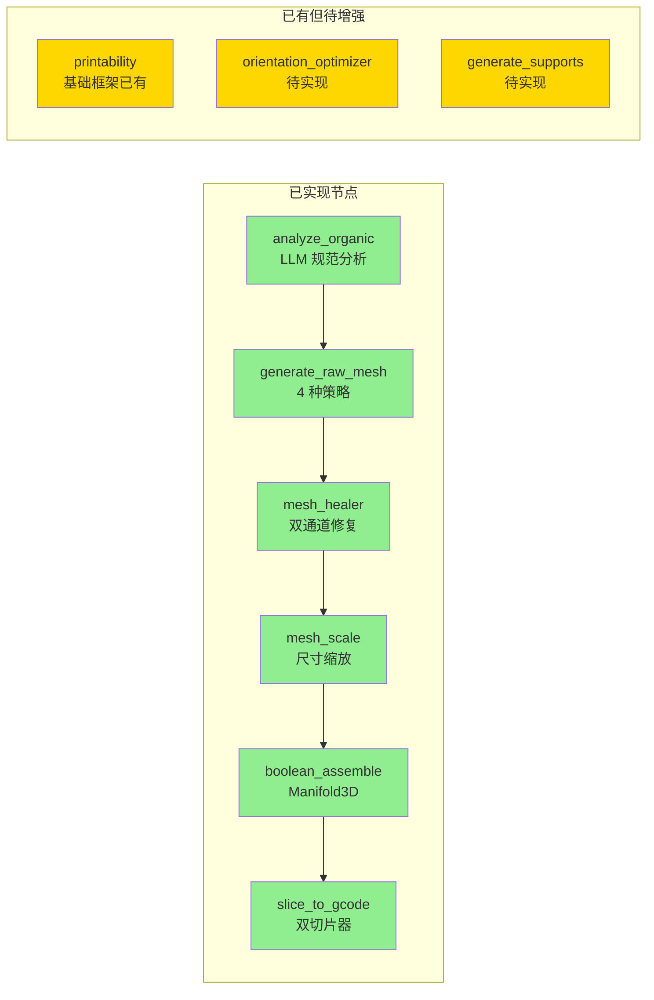
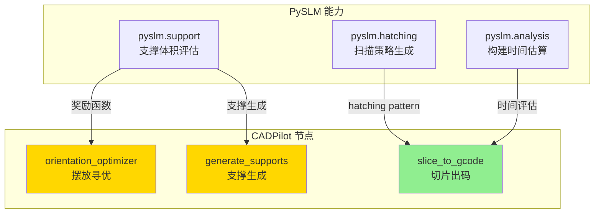
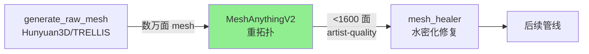
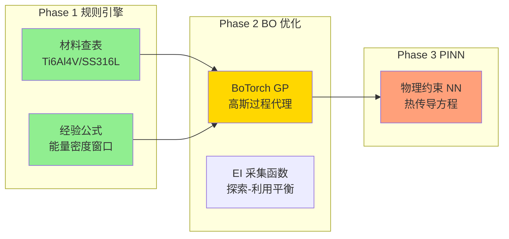
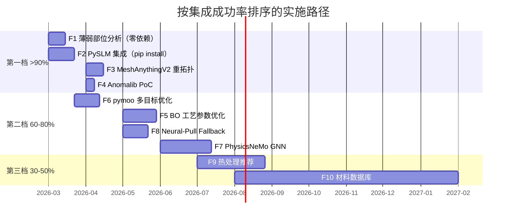
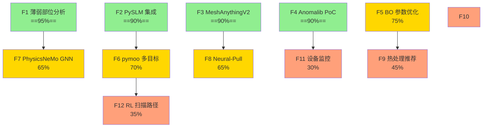

# 集成可行性评估与实施路径图

> [!abstract] 定位
> 基于全部研究成果（==20+ 技术方向 deep-analysis== + 6 个工艺能力研究项目 + 30 个工具/框架评估），==结合 CADPilot V3 的实际代码状态==，对每个方案进行落地可行性评估。不是"理论上可行"，而是"基于现有代码库能否成功集成"。
>
> **覆盖范围**：AI 核心能力（7）+ 制造工艺链（3）+ CAD/AI 扩展（3）+ 工业化集成（5）+ 生态前沿（3）+ 人机协同（1）

> [!important] 评估方法论
> 本评估以三个硬约束为基准：
> 1. **依赖就绪度**：是否已装 / `pip install` 一行可装 / 需要编译或硬件
> 2. **管线映射清晰度**：是否有明确的现有节点可扩展，还是需要新建完整子系统
> 3. **数据/环境依赖**：是否需要训练数据集、GPU 推理服务、或实体设备

---

## 项目现状基线

> [!success] CADPilot V3 已实现能力
> 以下为评估的**起点**——已有代码和依赖，决定了集成的最短路径。

### 已实现的 LangGraph 管线节点



### 已安装的关键依赖

| 依赖 | 版本 | 许可证 | 当前用途 | ==潜在扩展用途== |
|:-----|:-----|:-------|:---------|:----------------|
| `trimesh` | ≥4.5.0 | MIT | mesh I/O、基础变换 | ==壁厚射线法分析、尖角二面角检测== |
| `manifold3d` | ≥3.0.0 | Apache 2.0 | `boolean_assemble` CSG | ==流形修复增强== |
| `meshlib` | ≥3.1.1 | 双重许可 | `mesh_healer` 算法通道 | ==体素化修复、测量== |
| `pymeshfix` | ≥0.18.0 | MIT | `mesh_healer` 孔洞修补 | 已充分利用 |
| `cadquery` | ≥2.4.0 | Apache 2.0 | `generate_cadquery` | ==BREP 拓扑查询（封闭腔体检测）== |
| `langgraph` | ≥0.3.0 | MIT | 管线编排 | 新节点注册（策略模式） |
| `langchain` | ≥0.3.18 | MIT | LLM 链 | 工艺参数 LLM 推理 |

### 已实现的策略层

| 策略类型 | 已有策略 | 扩展空间 |
|:---------|:---------|:---------|
| 生成策略 | Hunyuan3D、Tripo3D、SPAR3D、TRELLIS | + MeshAnythingV2 后处理 |
| 修复策略 | Algorithm（meshlab + pymeshfix + manifold3d）、Neural（HTTP） | + PySLM 悬臂检测 |
| 切片策略 | PrusaSlicer、OrcaSlicer | + PySLM hatching |
| 布尔策略 | Manifold3D | 已充分 |

---

## 第一档：成功率 >90%

> [!tip] 共同特征
> 依赖已装或 `pip install` 一行安装；有清晰的 Python API；直接映射到已有或相邻管线节点；不需要 GPU 或额外硬件。

### F1. P2 薄弱部位几何分析（规则引擎层）

| 属性 | 详情 |
|:-----|:-----|
| **成功率** | ==95%== |
| **映射节点** | 增强 `printability`（`backend/core/printability.py` ==已有框架==） |
| **新增依赖** | ==零==（trimesh + CadQuery + manifold3d 已装） |
| **工作量** | 1-2 周 |
| **预期效果** | AM 十大失败模式中的 4-5 种可检测（壁厚不足、悬臂过大、封闭腔体、尖角应力集中） |

> [!success] 为什么成功率最高
> - `backend/core/printability.py` 已有可打印性检查框架，只需往里填充具体算法
> - 4 种检测全部是**纯几何计算**，不需要 ML 模型或训练数据
> - 所需的 3 个库（trimesh、CadQuery、manifold3d）已在 `pyproject.toml` 中
> - [[am-process-capabilities-analysis#P2|P2 深入研究]]已给出完整算法实现代码

#### 4 种检测算法与已有依赖映射

| 检测类型 | 算法 | 依赖库 | 已装? | API |
|:---------|:-----|:-------|:------|:----|
| 壁厚分析 | 射线法（双向射线求最近交点距离） | `trimesh` | ✅ | `trimesh.proximity.closest_point` |
| 悬臂检测 | 面法向量 vs 构建方向夹角 | `trimesh` | ✅ | `mesh.face_normals` |
| 封闭腔体 | BREP 拓扑分析（Shell 遍历） | `cadquery` | ✅ | `shape.Shells()` / `.Faces()` |
| 尖角检测 | 相邻面二面角计算 | `trimesh` | ✅ | `trimesh.graph.face_adjacency_angles` |

#### 集成方案

```python
# 节点位置：generate_cadquery/generate_raw_mesh → printability_analyzer → orientation_optimizer
# 文件：backend/core/printability.py（已有框架，扩展即可）

@dataclass
class WeaknessReport:
    type: str           # "thin_wall" | "overhang" | "cavity" | "sharp_angle"
    severity: str       # "critical" | "warning" | "info"
    location: list      # [x, y, z] 位置坐标
    value: float        # 壁厚(mm) / 悬臂角(°) / 二面角(°)
    threshold: float    # 阈值
    suggestion: str     # 修复建议

class PrintabilityAnalyzer:
    """利用已有依赖实现 4 种薄弱部位检测"""

    def analyze_wall_thickness(self, mesh: trimesh.Trimesh, min_wall: float = 0.8) -> list[WeaknessReport]: ...
    def analyze_overhangs(self, mesh: trimesh.Trimesh, max_angle: float = 45.0) -> list[WeaknessReport]: ...
    def analyze_cavities(self, shape) -> list[WeaknessReport]: ...  # CadQuery Shape
    def analyze_sharp_angles(self, mesh: trimesh.Trimesh, min_angle: float = 30.0) -> list[WeaknessReport]: ...
```

> [!info] 参考
> → 算法实现详见 [[am-process-capabilities-analysis#P2|P2 深入研究]]
> → 工具 API 详见 [[practical-tools-frameworks#trimesh]]、[[practical-tools-frameworks#CadQuery]]

---

### F2. PySLM 集成（一库三节点）

| 属性 | 详情 |
|:-----|:-----|
| **成功率** | ==90%== |
| **映射节点** | `orientation_optimizer` + `generate_supports` + `slice_to_gcode`（==3 个节点==） |
| **新增依赖** | `pip install PythonSLM`（LGPL-2.1，动态链接无 copyleft 风险） |
| **工作量** | 2-3 周 |
| **预期效果** | 金属 AM 核心能力（hatching 扫描策略、支撑体积评估、构建时间估算） |

> [!success] 为什么成功率高
> - 纯 CPU 运行，无 GPU 要求
> - `pip install` 一行安装，基于 trimesh（==已装==）
> - 160★ 活跃维护（2026 年仍有更新）
> - LangGraph 策略注册表（`backend/graph/registry.py`）支持动态添加新策略

#### 三节点集成映射



#### 策略注册方案

```python
# backend/graph/strategies/slice/pyslm_hatcher.py（新增策略）
class PySLMHatchingStrategy(SliceStrategy):
    """PySLM hatching 扫描策略——金属 AM 专用"""

    async def execute(self, mesh_path: str, params: dict) -> SliceResult:
        import pyslm
        from pyslm import hatching

        part = pyslm.Part()
        part.setGeometry(mesh_path)

        myHatcher = hatching.BasicIslandHatcher()
        myHatcher.islandWidth = params.get("island_width", 5.0)
        myHatcher.hatchDistance = params.get("hatch_distance", 0.08)  # mm

        # 逐层切片 + hatching
        layers = []
        for z in pyslm.generateSliceHeights(part, params.get("layer_height", 0.03)):
            geom = part.getVectorSlice(z)
            layer = myHatcher.hatch(geom)
            layers.append(layer)

        return SliceResult(layers=layers, build_time=pyslm.analysis.getBuildTime(layers))

# 注册到策略表
registry.register("slice", "pyslm_hatching", PySLMHatchingStrategy)
```

> [!warning] 风险点
> - LGPL-2.1 许可证：通过 `import pyslm` 动态调用即可，==不修改 PySLM 源码则无 copyleft 义务==
> - API 文档较薄，部分功能需阅读源码
> - 金属 AM 参数（功率/速度/间距）需要领域知识配置默认值

> [!info] 参考
> → 工具评估详见 [[practical-tools-frameworks#PySLM]]
> → 管线集成设计详见 [[am-process-capabilities-analysis#P1|P1 深入研究]]

---

### F3. MeshAnythingV2 重拓扑

| 属性 | 详情 |
|:-----|:-----|
| **成功率** | ==90%== |
| **映射节点** | `generate_raw_mesh` 后处理（插入在生成→修复之间） |
| **新增依赖** | MeshAnythingV2 模型（MIT 许可），需 GPU 推理 |
| **工作量** | 1-2 周 |
| **预期效果** | 生成 mesh 从数万面降至 <1600 面，大幅减轻 `mesh_healer` 压力 |

> [!success] 为什么成功率高
> - `generate_raw_mesh` 节点已有 4 种策略（Hunyuan3D/Tripo3D/SPAR3D/TRELLIS），策略注册机制成熟
> - `heal/neural.py` ==已预留 HTTP 端点调用框架==，MeshAnythingV2 可复用同一模式
> - MIT 许可，无合规风险
> - 与现有 mesh_healer 形成级联：生成 → 重拓扑 → 修复

#### 级联管线



> [!info] 参考
> → 模型评估详见 [[mesh-processing-repair#MeshAnythingV2]]
> → 集成位置详见 [[roadmap#S2]]

---

### F4. Anomalib 缺陷检测 PoC

| 属性 | 详情 |
|:-----|:-----|
| **成功率** | ==90%==（PoC 级别） |
| **映射节点** | 新增离线工具（不接入实时管线） |
| **新增依赖** | `pip install anomalib`（Apache 2.0） |
| **工作量** | 1 周 PoC |
| **预期效果** | 验证 PatchCore 在 AM 表面缺陷场景的 baseline 性能 |

> [!success] 为什么成功率高
> - PatchCore ==零标注==启动（仅需正常样本即可训练）
> - `pip install` 一行安装，Intel 维护，4K★
> - 先做离线图像分析 demo，==不需要接入实时管线==
> - 3D-ADAM 数据集（14K 扫描）可直接使用

> [!warning] 注意
> 此 PoC 验证的是**离线检测能力**。要接入实时管线需要后续与设备传感器的集成（属于第三档 P6）。

> [!info] 参考
> → 工具评估详见 [[practical-tools-frameworks#Anomalib]]
> → 缺陷检测研究详见 [[defect-detection-monitoring]]
> → 数据集详见 [[am-datasets-catalog#3D-ADAM]]

---

## 第二档：成功率 60-80%

> [!info] 共同特征
> 技术路径清晰、工具成熟，但需要额外的**数据准备**、**GPU 推理环境**、或**较复杂的集成工作**。

### F5. P1 工艺参数优化（BO 阶段）

| 属性 | 详情 |
|:-----|:-----|
| **成功率** | ==75%== |
| **映射节点** | 新增 `optimize_process_params`（`slice_to_gcode` 前置） |
| **新增依赖** | `pip install botorch`（MIT） |
| **工作量** | 3-4 周 |
| **关键障碍** | ==需要"功率-速度-间距 → 致密度/粗糙度"实验数据集==（50-100 组起步） |

> [!question] 为什么不是第一档？
> BoTorch 本身 `pip install` 即可，API 完善。但贝叶斯优化==需要真实的工艺-质量映射数据==才能启动。没有数据，算法再好也是空转。
>
> **数据获取路径**（按可行性排序）：
> 1. NIST AM-Bench 公开数据（==免费==，但格式需清洗）
> 2. 文献整理（50-100 篇论文中提取参数-质量表格）
> 3. Kaggle AM 数据集（零散但可用）
> 4. 企业合作获取实验数据（最可靠但周期长）

#### 三阶段演进



| 阶段 | 数据需求 | 预期精度 | 时间 |
|:-----|:---------|:---------|:-----|
| Phase 1 规则引擎 | 0（硬编码经验值） | 基线 | 1 周 |
| Phase 2 BO | 50-100 组实验数据 | 致密度 99.5%+ | 2-3 周 |
| Phase 3 PINN | 1000+ 仿真数据 | 致密度 99.9% | 2-3 月 |

> [!info] 参考
> → 技术路线详见 [[am-process-capabilities-analysis#P1|P1 深入研究]]
> → BoTorch 集成代码示例见 P1 深入研究中的"开源工具与代码评估"小节
> → AIDED 框架（R²=0.995）见 P1 深入研究中的"最新论文"小节

---

### F6. pymoo 多目标方向优化

| 属性 | 详情 |
|:-----|:-----|
| **成功率** | ==70%== |
| **映射节点** | 增强 `orientation_optimizer`（从单目标→多目标） |
| **新增依赖** | `pip install pymoo`（Apache 2.0） |
| **工作量** | 2-3 周 |
| **关键障碍** | ==依赖 F2（PySLM）提供支撑体积和打印时间评估函数== |

> [!question] 为什么不是第一档？
> pymoo 本身成熟可靠（Apache 2.0，20+ 算法），但**目标函数的定义依赖 PySLM 的评估能力**。必须先完成 F2 PySLM 集成，才能将支撑体积、打印时间、表面质量作为 NSGA-II 的优化目标。

#### 优化目标定义

```python
import pymoo
from pymoo.core.problem import Problem

class OrientationProblem(Problem):
    """三目标方向优化：最小化支撑体积 + 打印时间 + 表面粗糙度"""

    def __init__(self, mesh, pyslm_part):
        super().__init__(n_var=2, n_obj=3, xl=[0, 0], xu=[180, 360])
        # n_var=2: 绕 X 轴旋转角, 绕 Z 轴旋转角
        # n_obj=3: 支撑体积, 打印时间, 表面粗糙度
        self.mesh = mesh
        self.part = pyslm_part

    def _evaluate(self, X, out, *args, **kwargs):
        f1 = [pyslm.support.getProjectedSupportArea(self.part, rotation=x) for x in X]  # 支撑体积
        f2 = [pyslm.analysis.getBuildTime(self.part, rotation=x) for x in X]             # 打印时间
        f3 = [estimate_surface_roughness(self.mesh, rotation=x) for x in X]               # 表面粗糙度
        out["F"] = np.column_stack([f1, f2, f3])
```

> [!info] 参考
> → P3 深入研究中的 pymoo 集成方案 [[am-process-capabilities-analysis#P3|P3 形性协同优化]]
> → 量化指标：协同优化 vs 独立优化——打印时间 -27%、支撑体积 -40-60%

---

### F7. PhysicsNeMo GNN 可打印性预测

| 属性 | 详情 |
|:-----|:-----|
| **成功率** | ==65%== |
| **映射节点** | 增强 `printability`（几何规则 + GNN 混合） |
| **新增依赖** | `pip install nvidia-physicsnemo`（Apache 2.0） |
| **工作量** | 4-6 周 |
| **关键障碍** | ==需要 GPU 推理环境 + AM 变形训练数据== |

> [!question] 为什么低于第一档？
> PhysicsNeMo 框架本身极优秀（Apache 2.0，NVIDIA 维护），HP Graphnet 已有 AM 烧结变形预测的预训练模型（63mm 零件平均偏差 0.7μm）。但：
> 1. 需要 GPU 推理服务（8-16GB VRAM）
> 2. 预训练模型针对特定材料/工艺，泛化到 CADPilot 用户场景需要 fine-tune
> 3. fine-tune 需要 FEM 仿真数据作为 Ground Truth

> [!tip] 降级方案
> 如果 GPU 不可用，==先用 F1 的几何规则作为第一层==，PhysicsNeMo GNN 作为后续增强。两层可独立运行。

> [!info] 参考
> → HP Graphnet 评估详见 [[gnn-topology-optimization#HP Graphnet]]
> → PhysicsNeMo 工具评估详见 [[practical-tools-frameworks#PhysicsNeMo]]

---

### F8. Neural-Pull AI 修复 Fallback

| 属性 | 详情 |
|:-----|:-----|
| **成功率** | ==65%== |
| **映射节点** | 增强 `mesh_healer`（Neural 策略通道） |
| **新增依赖** | Neural-Pull 模型部署（MIT） |
| **工作量** | 2-3 周 |
| **关键障碍** | ==需要部署 GPU 推理服务==（`heal/neural.py` 已预留 HTTP 端点） |

> [!success] 有利条件
> `backend/graph/strategies/heal/neural.py` ==已有完整的 HTTP 调用框架==，只需在服务端部署 Neural-Pull 模型并暴露 `/v1/repair` 端点。客户端代码无需修改。

> [!info] 参考
> → Neural-Pull 评估详见 [[mesh-processing-repair#Neural-Pull]]
> → 当前 neural 策略代码：`backend/graph/strategies/heal/neural.py`

---

## 第三档：成功率 30-50%

> [!warning] 共同特征
> 方向正确、技术路径可见，但依赖**外部数据/硬件/领域知识**，不确定性高。

### F9. P4 热处理参数推荐

| 属性 | 详情 |
|:-----|:-----|
| **成功率** | ==45%== |
| **映射节点** | 新增 `recommend_heat_treatment` |
| **新增依赖** | `pycalphad`（MIT）+ `scheil`（MIT）+ 热力学数据库（TDB 文件） |
| **关键障碍** | 需要==材料科学领域知识==深度参与 + TDB 文件获取有门槛 |

> [!question] 为什么成功率低？
> `pycalphad` 和 `scheil` 是优秀的 MIT 工具（pip 可装），但：
> - CALPHAD 计算需要 ==TDB（热力学数据库文件）==，开源 TDB 仅覆盖少数合金体系
> - 从"相组成预测"到"热处理参数推荐"需要大量领域知识（TTT/CCT 图解读、显微组织-力学性能映射）
> - Agentic AM（94% 准确率）的 LLM+MCP+CALPHAD 方案有启发性，但需要自建 MCP 工具链

> [!info] 参考
> → P4 深入研究 [[am-process-capabilities-analysis#P4|热处理参数推荐]]
> → 工具评估 [[am-process-capabilities-analysis#P4|pycalphad + scheil + MaterialsMap]]

---

### F10. P5 材料-工艺数据库

| 属性 | 详情 |
|:-----|:-----|
| **成功率** | ==40%== |
| **映射节点** | 全管线共享基础数据层 |
| **关键障碍** | ==公开 AM 数据太分散==；NIST AMMD 有 schema 但数据量小；手工整理成本高 |

> [!question] 为什么成功率低？
> 技术栈（MongoDB + pymatgen + matminer + FastAPI）都是成熟工具，问题是**数据本身**：
> - 没有一个现成的、结构化的 AM 粉末特性数据库
> - 材料-工艺-性能的关联数据分散在期刊论文中
> - Phase 1 手工录入 10 种常见材料就需要数周的文献调研

> [!tip] 降级方案
> 先从 ==NIST AMMD RESTful API== 做数据代理（不自建数据库），查询已有的结构化数据。Phase 2 再考虑自建。

> [!info] 参考
> → P5 深入研究 [[am-process-capabilities-analysis#P5|材料-工艺数据库]]
> → NIST AMMD 评估 [[am-process-capabilities-analysis#P5|NIST AMMD]]

---

### F11. P6 设备一致性监控

| 属性 | 详情 |
|:-----|:-----|
| **成功率** | ==30%== |
| **映射节点** | 新增完整子系统（设备层→采集层→数字孪生层→AI 层） |
| **关键障碍** | ==必须连接实体打印设备==；传感器硬件采购；OPC-UA 协议栈复杂 |

> [!danger] 硬约束
> 这是所有方案中唯一一个**需要物理硬件**的。无论软件方案多成熟（Autodesk MCF BSD、DTU OpenAM），没有实体打印机和传感器就无法验证。

> [!tip] 最小可行路径
> 如果能获得一台 ==FDM 打印机==（成本最低），可以先做：
> 1. OPC-UA/MQTT 数据采集 PoC
> 2. Anomalib 实时表面缺陷检测
> 3. 再逐步迁移到金属 AM

> [!info] 参考
> → P6 深入研究 [[am-process-capabilities-analysis#P6|设备一致性监控]]
> → 数字孪生平台 [[am-process-capabilities-analysis#P6|DTU OpenAM + Autodesk MCF]]

---

### F12. RL 扫描路径优化

| 属性 | 详情 |
|:-----|:-----|
| **成功率** | ==35%== |
| **映射节点** | 增强 `slice_to_gcode`（扫描路径 agent） |
| **关键障碍** | ==仅论文，无开源代码==；sim-to-real 迁移验证需要实体设备；训练环境搭建成本高 |

> [!info] 参考
> → [[reinforcement-learning-am#扫描路径优化]]
> → 2025 CPR-DQN 进展 [[reinforcement-learning-am#2025-2026 最新进展]]

---

## 综合评估矩阵

| 编号 | 方案 | 成功率 | 新增依赖 | 数据需求 | GPU | 工作量 | 预期价值 |
|:-----|:-----|:-------|:---------|:---------|:----|:-------|:---------|
| ==F1== | ==P2 薄弱部位分析== | ==95%== | ==零== | 无 | 否 | 1-2 周 | ==极高== |
| ==F2== | ==PySLM 集成== | ==90%== | 1 个 pip | 无 | 否 | 2-3 周 | ==极高== |
| ==F3== | ==MeshAnythingV2== | ==90%== | 模型部署 | 无 | ==是== | 1-2 周 | ==高== |
| ==F4== | ==Anomalib PoC== | ==90%== | 1 个 pip | 3D-ADAM | 否 | 1 周 | 高 |
| F5 | BO 工艺参数优化 | 75% | 1 个 pip | ==需要== | 否 | 3-4 周 | ==极高== |
| F6 | pymoo 多目标优化 | 70% | 1 个 pip | 无 | 否 | 2-3 周 | 高 |
| F7 | PhysicsNeMo GNN | 65% | 1 个 pip | ==需要== | ==是== | 4-6 周 | 高 |
| F8 | Neural-Pull Fallback | 65% | 模型部署 | 无 | ==是== | 2-3 周 | 高 |
| F9 | 热处理推荐 | 45% | 2 个 pip + TDB | ==需要== | 否 | 6-8 周 | 中高 |
| F10 | 材料数据库 | 40% | 3 个 pip | ==大量== | 否 | 3-6 月 | 中 |
| F11 | 设备监控 | 30% | 完整子系统 | N/A | 否 | 6-12 月 | 高（长期） |
| F12 | RL 扫描路径 | 35% | RL 框架 | ==需要== | ==是== | 3-6 月 | 中 |

---

## 推荐实施路径



### 依赖关系



### 阶段性里程碑

> [!success] Milestone 1（Month 1-2 完成）——管线能力扩展
> - ✅ F1 + F2 完成后：管线从 6 节点扩展到 8-9 节点
> - ✅ 可打印性检查从零覆盖提升到 AM 十大失败模式中的 4-5 种
> - ✅ 金属 AM 核心能力（hatching、支撑评估）就位
> - **量化指标**：打印失败率预期从 15-30% 降至 <5%（几何规则层）

> [!info] Milestone 2（Month 3-4 完成）——mesh 质量提升 + 缺陷检测验证
> - ✅ F3 完成后：生成 mesh 面数降低一个数量级（数万→<1600）
> - ✅ F4 完成后：Anomalib baseline 建立，验证 AM 缺陷检测可行性
> - **量化指标**：mesh_healer 成功率预期从 ~80% 提升到 >95%

> [!tip] Milestone 3（Month 5-8 完成）——智能优化层
> - ✅ F5 + F6 完成后：从"人工指定参数"升级为"AI 搜索最优参数"
> - ✅ F7 + F8 完成后：可打印性从几何规则扩展到 GNN 物理预测
> - **量化指标**：方向优化搜索支撑体积减少 40-60%（pymoo Pareto 前沿 vs 单目标）

---

## 许可证合规一览

> [!tip] 所有第一档和第二档方案均为商用友好许可

| 许可证 | 风险等级 | 涉及方案 | 合规要点 |
|:-------|:---------|:---------|:---------|
| ==Apache 2.0== | ==无== | manifold3d、Anomalib、PhysicsNeMo、pymoo | 自由商用，保留版权声明 |
| ==MIT== | ==无== | trimesh、BoTorch、Optuna、Neural-Pull、MeshAnythingV2 | 自由商用，保留许可声明 |
| ==LGPL-2.1== | ==低== | PySLM | 动态链接（`import pyslm`）无 copyleft 义务；==不修改源码即可== |
| 双重许可 | 中 | MeshLib | ==已安装==，学术免费/商用付费，需评估商业化时的许可费 |
| AGPL-3.0 | 高 | CuraEngine、YOLOv8 | 网络使用需开源，==建议通过 CLI 子进程隔离调用== |

---

## 与现有研究文档的交叉引用

| 本文方案 | 对应研究文档 | 关键章节 |
|:---------|:------------|:---------|
| F1 薄弱部位分析 | [[am-process-capabilities-analysis#P2]] | 算法实现、PrintabilityAnalyzer 设计 |
| F2 PySLM 集成 | [[practical-tools-frameworks#PySLM]]、[[am-process-capabilities-analysis#P1]] | 工具评估、集成代码示例 |
| F3 MeshAnythingV2 | [[mesh-processing-repair#MeshAnythingV2]]、[[roadmap#S2]] | 模型评估、级联方案 |
| F4 Anomalib PoC | [[practical-tools-frameworks#Anomalib]]、[[defect-detection-monitoring]] | 算法评估、数据集 |
| F5 BO 工艺参数 | [[am-process-capabilities-analysis#P1]] | BoTorch 代码、AIDED 框架、数据方案 |
| F6 pymoo 多目标 | [[am-process-capabilities-analysis#P3]] | NSGA-II/III 对比、pymoo 集成 |
| F7 PhysicsNeMo | [[practical-tools-frameworks#PhysicsNeMo]]、[[gnn-topology-optimization]] | HP Graphnet、训练 pipeline |
| F8 Neural-Pull | [[mesh-processing-repair#Neural-Pull]]、[[roadmap#M1]] | 水密化评估、部署方案 |
| F9 热处理推荐 | [[am-process-capabilities-analysis#P4]] | pycalphad、CALPHAD+ML、KG |
| F10 材料数据库 | [[am-process-capabilities-analysis#P5]] | NIST AMMD、pymatgen、schema |
| F11 设备监控 | [[am-process-capabilities-analysis#P6]] | 传感器、数字孪生、OPC-UA |
| F12 RL 扫描路径 | [[reinforcement-learning-am]] | DRL Toolpath、CPR-DQN |

---

## 差距补全研究的新增集成候选

> [!info] 扩展评估
> 2026-03-03 差距补全研究新增 13 个技术方向，以下为初步集成可行性评估。详细评估将在各方向 PoC 完成后更新。

### 制造工艺链

| 方案 | 预估成功率 | 关键依赖 | 对应研究 |
|:-----|:----------|:---------|:---------|
| OrcaSlicer Docker 集成 | ==85%== | Docker 环境、AGPL 隔离 | [[slicer-integration-ai-params]] |
| PySLM 多目标方向优化（pymoo） | ==80%== | F2 PySLM 已完成 | [[build-orientation-support-optimization]] |
| XGBoost 表面粗糙度预测 | 70% | 训练数据（文献整理） | [[post-processing-optimization]] |

### CAD/AI 扩展

| 方案 | 预估成功率 | 关键依赖 | 对应研究 |
|:-----|:----------|:---------|:---------|
| CAD-Recode Scan-to-CAD | 70% | GPU + ==CC-BY-NC 许可谈判== | [[reverse-engineering-scan-to-cad]] |
| DL4TO 拓扑优化 | ==80%== | PyTorch、MIT 许可 | [[topology-optimization-tools]] |
| VLM prompt GD&T 扩展 | ==85%== | 零代码风险 | [[gdt-automation]] |

### 工业化集成

| 方案 | 预估成功率 | 关键依赖 | 对应研究 |
|:-----|:----------|:---------|:---------|
| CADEX MTK 报价引擎 | 75% | CADEX SDK 许可、特征模型 | [[automated-quoting-engine]] |
| SimScale API FEA 集成 | 70% | API key、网络延迟 | [[fea-cfd-api-integration]] |
| 合规规则引擎 | ==80%== | 标准文本解析 | [[standards-compliance-automation]] |
| NIST AMMD 材料代理 | 60% | API 稳定性、数据完整度 | [[am-materials-database-psp]] |
| AMPOWER 碳足迹模型 | 65% | 排放因子数据 | [[carbon-footprint-lca]] |

### 生态前沿（长期，不评估短期成功率）

| 方案 | 时间线 | 对应研究 |
|:-----|:-------|:---------|
| PLM Git→Odoo→Onshape 渐进集成 | 6-12 月 | [[plm-integration]] |
| @react-three/xr WebXR 扩展 | 6-9 月 | [[webxr-design-review]] |
| NVIDIA Omniverse 数字孪生 | 12+ 月 | [[digital-twin-manufacturing]] |

---

## 更新日志

| 日期 | 变更 |
|:-----|:-----|
| 2026-03-03 | ==第二次更新==：根据差距补全研究（13 篇新文档），新增"差距补全研究的新增集成候选"章节，覆盖制造工艺链/CAD AI 扩展/工业化集成/生态前沿 4 个方向 14 个新增候选方案的初步可行性评估 |
| 2026-03-03 | 初始版本：基于全部研究成果 + 项目代码现状分析，评估 12 个集成方案的可行性，按成功率分三档，给出推荐实施路径和里程碑 |
