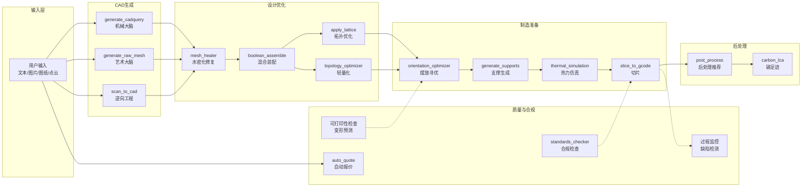
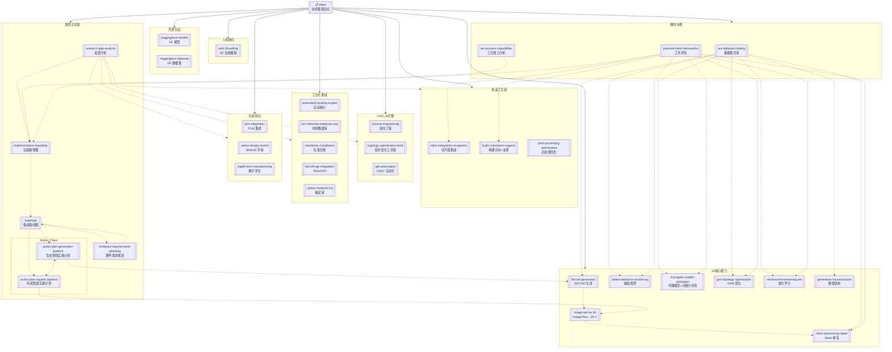

# AI 驱动 3D 打印技术图谱

> [!abstract] 定位
> 本知识库系统梳理了 AI 在 3D 打印（增材制造）全管线中的前沿技术、开源模型与数据集。以 **AI 技术方向**为主轴，覆盖从 CAD 生成到后处理的完整流程，为 CADPilot 项目的优化迭代提供持续更新的技术情报。

> [!success] 研究进度
> ==21+ 个技术方向/课题==已完成深度分析（`deep-analysis`），覆盖 AI 核心能力（==8 个==，含新增 Image/Text→3D）、制造工艺链（3 个）、CAD/AI 扩展（3 个）、工业化集成（5 个）、生态前沿（3 个）、人机协同（1 个）。

---

## 一、AI 核心能力（8 方向）

> [!tip] 3D/CAD 生成模型 `deep-analysis` ✅
> **核心价值**：文本/图像→参数化 CAD 或 3D mesh，管线的入口能力
> **代表模型**：CADFusion、Text-to-CadQuery、TRELLIS.2、Hunyuan3D-2、SPAR3D、CAD-Llama、STEP-LLM
> **2025 更新**：+7 新系统（CAD-MLLM、==CADDesigner==、CAD-Recode、EvoCAD、CQAsk、CadVLM、Neural CAD）
> **成熟度**：★★★★ | **开源模型**：15+ | **关联节点**：`generate_cadquery`, `generate_raw_mesh`
> → 详见 [[3d-cad-generation]]（1067 行）

> [!tip] Image/Text-to-3D 生成与重建 `deep-analysis` ✅ ⭐ 新增
> **核心价值**：单图/文本→高质量 3D mesh，有机管道和创意雕塑路线的核心技术输入
> **最优路线**：==两步法 FLUX→TRELLIS.2==（成功率 95%）、Hunyuan3D-2.1（93%）、TripoSG（90%）
> **覆盖范围**：30+ 模型/方法——前馈重建、SDS 优化、3DGS/NeRF、多视图扩散、Video-to-3D
> **关键结论**：两步法（Text→Image→3D）是当前最优实践；NeRF SDF 变体最适合 3D 打印
> **成熟度**：★★★★ | **开源模型**：20+ | **关联节点**：`generate_raw_mesh`, `mesh_healer`, `(新) text_to_image`
> → 详见 [[image-text-to-3d-generation]]（~500 行）

> [!tip] 网格处理与 AI 修复 `deep-analysis` ✅
> **核心价值**：将 AI 生成的"脏 mesh"转化为工业可用的水密实体
> **代表模型**：MeshAnythingV2、Neural-Pull、DeepSDF、Point2Mesh
> **工具**：==MeshLib==、==manifold3d==、trimesh
> **成熟度**：★★★ | **开源模型**：5+ | **关联节点**：`mesh_healer`, `generate_raw_mesh`
> → 详见 [[mesh-processing-repair]] | 工具评估 → [[practical-tools-frameworks#网格处理工具]]

> [!tip] 缺陷检测与过程监控 `deep-analysis` ✅
> **核心价值**：原位实时检测 AM 缺陷（孔隙、未熔合、飞溅、键孔），闭环质量控制
> **代表模型**：YOLOv8（mAP 95.7%）、ViT+MAE（99%）、3D U-Net（IOU 88.4%）、LLM-3D Print
> **工具**：==Anomalib v2.2==（Intel，最大开源异常检测集合）
> **成熟度**：★★★★ | **开源模型**：5+ | **关联节点**：`(新) 过程监控`, `mesh_healer`
> → 详见 [[defect-detection-monitoring]] | 工具评估 → [[practical-tools-frameworks#Anomalib]]

> [!info] 代理模型替代 FEM 仿真 `deep-analysis` ✅
> **核心价值**：用 PINN/FNO/DeepONet 替代 ABAQUS/ANSYS，加速 1000-10万倍
> **代表框架**：NVIDIA PhysicsNeMo（Apache 2.0）、AM_DeepONet、LP-FNO
> **2025 更新**：+可微分仿真章节（PhiFlow、Tesseract-JAX、Taichi、NVIDIA Warp）
> **成熟度**：★★★☆ | **开源框架**：3+ | **关联节点**：`thermal_simulation`, `(新) 可打印性检查`
> → 详见 [[surrogate-models-simulation]]（570 行）| 工具评估 → [[practical-tools-frameworks#PhysicsNeMo]]

> [!info] GNN 拓扑优化与网格仿真 `deep-analysis` ✅
> **核心价值**：几何无关的热/力建模，自支撑结构优化
> **代表模型**：LatticeGraphNet（==1000-10000x==）、HP Graphnet（Apache 2.0）、RGNN（==405x==）
> **成熟度**：★★★ | **开源模型**：2+ | **关联节点**：`apply_lattice`, `thermal_simulation`
> → 详见 [[gnn-topology-optimization]]

> [!warning] 强化学习工艺控制 `deep-analysis` ✅
> **核心价值**：自适应调参、扫描路径优化、原位缺陷修正
> **代表项目**：ThermalControlLPBF-DRL（PPO）、DRL Toolpath（DQN）、Learn to Rotate
> **工具**：==PySLM==（160★, pip install, 切片+hatching+支撑）
> **成熟度**：★★☆ | **开源项目**：2（CMU + PySLM） | **关联节点**：`orientation_optimizer`, `generate_supports`, `slice_to_gcode`
> → 详见 [[reinforcement-learning-am]] | 工具评估 → [[practical-tools-frameworks#PySLM]]

> [!info] 微观结构生成与逆设计 `deep-analysis` ✅
> **核心价值**：文本/性能目标→材料微观结构，逆向设计超材料
> **代表模型**：MIND（SIGGRAPH 2025, 误差 1.27%）、Txt2Microstruct-Net、Design-GenNO
> **成熟度**：★★☆ | **开源模型**：2+ | **关联节点**：`apply_lattice`, `(新) 材料优化`
> → 详见 [[generative-microstructure]]

---

## 二、制造工艺链（3 课题） ⭐ 新增

> [!tip] 切片器集成与 AI 参数优化 `deep-analysis` ✅
> **核心价值**：PrusaSlicer/OrcaSlicer/CuraEngine API 集成 + AI 动态参数优化
> **关键发现**：==所有主流开源切片器均为 AGPL 许可==，需 Docker 容器化隔离
> **AI 路径**：规则引擎 → XGBoost/LightGBM → 闭环 RL
> **关联节点**：`slice_to_gcode`
> → 详见 [[slicer-integration-ai-params]]（817 行）

> [!tip] 构建方向 + 支撑结构优化 `deep-analysis` ✅
> **核心价值**：多目标优化摆放方向（支撑最小化 + 表面质量 + 构建时间）、智能支撑生成、零件嵌套
> **推荐组合**：==PySLM 悬垂分析 + pymoo NSGA-II + Learn to Rotate GRL==
> **关联节点**：`orientation_optimizer`, `generate_supports`
> → 详见 [[build-orientation-support-optimization]]（775 行）

> [!info] 后处理优化 `deep-analysis` ✅
> **核心价值**：表面精整（激光抛光/ECP/AFM）、热处理仿真、ML 质量预测
> **关键发现**：XGBoost 表面粗糙度预测 ==R²=97-99.86%==；PhysicsNeMo 代理仿真替代商用热处理仿真
> **关联节点**：`(新) 后处理推荐`
> → 详见 [[post-processing-optimization]]（649 行）

---

## 三、CAD/AI 扩展（3 课题） ⭐ 新增

> [!tip] 逆向工程 / Scan-to-CAD `deep-analysis` ✅
> **核心价值**：3D 扫描点云→参数化 CAD 模型，开启逆向工程管线
> **推荐**：==CAD-Recode==（ICCV 2025，点云→CadQuery，CD 改善 10x）与 CADPilot CadQuery 内核完美契合
> **商业标杆**：Geomagic Design X（4.5★）、QUICKSURFACE（2025 最佳获奖）
> **关联节点**：`(新) scan_to_cad`
> → 详见 [[reverse-engineering-scan-to-cad]]（452 行）

> [!tip] 拓扑优化工具链 `deep-analysis` ✅
> **核心价值**：经典 TO + AI 驱动 TO + 晶格结构 + 多目标优化工具链评估
> **推荐组合**：==DL4TO==（PyTorch 原生 TO，MIT）+ ==pymoo==（NSGA-II/III，Apache 2.0）+ Gyroid TPMS
> **生成式设计**：nTopology（4.5★）、Autodesk Fusion GD
> **关联节点**：`apply_lattice`
> → 详见 [[topology-optimization-tools]]（537 行）

> [!info] GD&T 自动化 `deep-analysis` ✅
> **核心价值**：ASME Y14.46 AM 专用 GD&T + AI 自动标注 + MBD/PMI
> **推荐**：VLM prompt 扩展（P2 零代码风险）→ ==Werk24 API== 交叉验证 → PythonOCC STEP AP242 PMI 写入
> **障碍**：CadQuery 无原生 MBD/PMI 支持，需 PythonOCC XDE API
> **关联节点**：扩展 DrawingAnalyzer
> → 详见 [[gdt-automation]]（432 行）

---

## 四、工业化集成（5 课题） ⭐ 新增

> [!tip] 自动报价引擎 `deep-analysis` ✅
> **核心价值**：零件几何→成本/交期/DFM 反馈，秒级自动报价
> **推荐**：==CADEX MTK Python SDK==（特征识别+DFM，免版税）→ XGBoost/LightGBM → 3D CNN 端到端
> **竞品参考**：Xometry IQE（神经网络定价，无公开 API）、3D Spark（报价+CO₂追踪）
> → 详见 [[automated-quoting-engine]]（504 行）

> [!tip] AM 材料数据库与 PSP `deep-analysis` ✅
> **核心价值**：材料-工艺-性能（PSP）关系建模 + AI 合金设计
> **数据库**：Materials Project（15 万+）、NIST AMMD、Citrine Informatics、AFLOW（数百万）
> **前沿**：Hybrid-LLM-GNN 比纯 GNN 提升 25%；==AlloyGPT== 端到端正/逆向合金设计
> → 详见 [[am-materials-database-psp]]（479 行）

> [!info] 标准与合规自动化 `deep-analysis` ✅
> **核心价值**：ISO/ASTM 52920/52930/52954 + 航空 AS9100→IA9100 + 医疗 ISO 13485
> **关键发现**：==AS9100 将在 2026 年底升级为 IA9100==，转向数据驱动决策
> **自动化**：3 层设计（规则引擎 → NLP+RAG 标准解读 → ML 风险分级）
> → 详见 [[standards-compliance-automation]]（444 行）

> [!info] FEA/CFD API 集成 `deep-analysis` ✅
> **核心价值**：SimScale 云端 API + 开源 FEA/CFD + AM 热变形仿真
> **突破**：==PIDeepONet-RNN== 实现 z 轴误差 0.0261mm，<150ms（vs FEM 4 小时）
> **推荐**：短期 SimScale API + CalculiX → 中期 PhysicsNeMo 代理 → 长期统一平台
> **开源发现**：==AdditiveFOAM==（ORNL，唯一 AM 专用开源 CFD，BSD）
> → 详见 [[fea-cfd-api-integration]]（461 行）

> [!warning] 碳足迹与 LCA `deep-analysis` ✅
> **核心价值**：AM 碳排放量化 + EU CBAM 合规 + ML 自动 LCA
> **关键数据**：AM 预计减排 ==1.3-5.3 亿吨 CO₂==；Wire Arc DED ~80% 碳减排
> **合规驱动**：==EU CBAM 2026.01.01 正式征收碳关税==
> **推荐**：AMPOWER 方法论 → ML 几何特征→碳足迹预测
> → 详见 [[carbon-footprint-lca]]（384 行）

---

## 五、生态前沿（3 课题） ⭐ 新增

> [!info] PLM 集成方案 `deep-analysis` ✅
> **核心价值**：产品生命周期管理 + 3D 模型版本控制 + 数字线程 + AM 批次追溯
> **推荐**：短期 Git（代码即 CAD）→ 中期 ==Odoo PLM==（开源+ERP 一体化）→ 长期 Onshape+Arena
> **协作**：CRDT/OT 实时协作 CAD（Figma 模式参考）
> → 详见 [[plm-integration]]（472 行）

> [!info] WebXR 设计评审 `deep-analysis` ✅
> **核心价值**：浏览器端 VR/AR 3D 模型评审 + 手部/眼动追踪
> **推荐**：==@react-three/xr== 零迁移成本扩展现有 Viewer3D
> **最佳开发平台**：Meta Quest 3
> **关联节点**：扩展 Viewer3D
> → 详见 [[webxr-design-review]]（566 行）

> [!info] 数字孪生制造监控 `deep-analysis` ✅
> **核心价值**：NVIDIA Omniverse + OpenUSD + AM 工厂实时监控/预测维护
> **推荐**：短期 Grafana + MQTT → 中期 Azure Digital Twins → 长期 ==NVIDIA Omniverse==
> **标准化**：==OpenUSD Core Spec 1.0==（2025.12）
> → 详见 [[digital-twin-manufacturing]]（513 行）

---

## 六、人机协同 ⭐ 新增

> [!tip] Web 端 3D 模型在线编辑 `研究完成` ✅
> **核心价值**：补充 AI 管道 15-40% 不完美场景，形成 AI↔人双向协同闭环
> **推荐**：==混合分层架构==（轻操作前端 Three.js + 重操作后端 CadQuery + AI 辅助 LLM）
> **竞争格局**：CADPilot 在线编辑能力 ★★☆☆☆，竞品（Zoo/Fusion/Onshape）★★★★☆+
> → 详见 [[web-3d-editing-feasibility/README|Web 端 3D 在线编辑可行性研究]]（4 篇系列文档）

---

## 七、横向专题

> [!example] HuggingFace 开源生态 `deep-analysis` ✅
> **模型目录**：40+ 个相关模型（3D 生成、CAD、mesh 处理）→ [[huggingface-models]]
> **数据集目录**：20+ 个数据集（CAD、缺陷、G-code、微观结构）→ [[huggingface-datasets]]

> [!example] AM 数据集全景目录
> 汇总 7 个研究方向中发现的全部可用数据集，按用途分类，标注规模/许可/下载方式
> → 详见 [[am-datasets-catalog]]

> [!example] 实用工具与框架评估
> PySLM、Anomalib、PhysicsNeMo、MeshLib、manifold3d、CuraEngine 等可直接部署的工具深度评估
> → 详见 [[practical-tools-frameworks]]

> [!example] 增材工艺能力分析与管线映射
> 基于工业 AM 全流程要素（粉末→工艺→设计→后处理），识别 6 个可研究项目
> → 详见 [[am-process-capabilities-analysis]]

---

## 八、规划与实施

> [!abstract] 研究领域差距分析
> 对照 12 大技术领域、35+ 细分方向，识别 ==13 个未覆盖领域== + ==5 个需深化领域==，按 P0/P1/P2 优先级
> → 详见 [[research-gap-analysis]]

> [!abstract] 集成可行性评估与实施路径图
> 结合 V3 代码现状（已有依赖、已实现节点），对 12 个候选方案按集成成功率分三档评估（>90% / 60-80% / 30-50%）
> → 详见 [[implementation-feasibility]]

> [!abstract] 技术集成路线图（总览）
> 短/中/长期路线图（S1-S8, M1-M10, L1-L12），含 Gantt 图、依赖关系、优先级总览。部分条目已产出详细实施计划（见下方 Action Plans）。
> → 详见 [[roadmap]]

### Action Plans（路线图条目的详细实施计划）

> [!tip] 以下文档是对 [[roadmap]] 中特定条目的深化——基于深度研究 + 项目代码分析，产出可直接用于开发的代码级实施方案。

> [!success] 生成管线实施计划 `action-plan`
> 覆盖 ==Roadmap S1/S3/M8==。4 阶段：ECIP Prompt 重构（精密管道 ==2.7x== 首次通过率提升）→ ~~TRELLIS.2 升级（已被下方取代）~~ → 多候选+VLM 评分 SmartRefiner → 逆向工程节点。
> **研究来源**：[[3d-cad-generation]]
> → 详见 [[action-plan-generation-pipeline]]（452 行）

> [!success] 有机管道升级实施计划 `action-plan`
> 覆盖 ==Roadmap M4==（完全取代并升级为 P0）。==淘汰 Tripo3D/SPAR3D==，3 模型并列（TRELLIS.2 默认、Hunyuan3D-2.1、TripoSG），==Replicate 统一 API==，无 fallback 用户显式选择。4 阶段：Provider 重构 → text_to_image 两步法 → mesh_repair 条件触发 → 效果对比调优。含 ==14 文件变更清单==、Gantt 图、风险评估。
> **研究来源**：[[image-text-to-3d-generation]]
> → 详见 [[action-plan-organic-pipeline]]（600 行）

> [!abstract] 硬件需求规划 `deep-analysis`
> 全管线 ==30+ 模型/工具== 的 GPU/VRAM 需求梳理，4 阶段部署策略：零 GPU（API）→ RTX 4090（24GB）→ A100-80GB → 双卡全能。含成本对比、自购 vs 云租分析、并发估算。
> **研究来源**：全部 21+ deep-analysis 文档 + 2 份 Action Plan
> → 详见 [[hardware-requirements-planning]]

---

## 成熟度矩阵

### AI 核心能力

| 技术方向 | 工业成熟度 | 开源可用性 | HF 生态 | 对 CADPilot 价值 | 深度分析 |
|:---------|:----------|:----------|:--------|:----------------|:---------|
| [[3d-cad-generation\|3D/CAD 生成]] | ★★★★ | ★★★★ | ★★★★★ | ==极高== | ✅ |
| [[image-text-to-3d-generation\|Image/Text→3D 生成]] | ★★★★ | ★★★★★ | ★★★★★ | ==极高== | ✅ |
| [[mesh-processing-repair\|Mesh 修复]] | ★★★ | ★★★ | ★★ | ==极高== | ✅ |
| [[defect-detection-monitoring\|缺陷检测]] | ★★★★ | ★★★☆ | ★★★ | 高 | ✅ |
| [[surrogate-models-simulation\|代理模型+可微分仿真]] | ★★★☆ | ★★★☆ | ★★ | 高 | ✅ |
| [[gnn-topology-optimization\|GNN 优化]] | ★★★ | ★★★ | ★ | 中 | ✅ |
| [[reinforcement-learning-am\|强化学习]] | ★★ | ★☆ | ☆ | 中 | ✅ |
| [[generative-microstructure\|微观结构]] | ★★ | ★★ | ★ | 低（长期） | ✅ |

### 新增课题（差距补全）

| 技术方向 | 工业成熟度 | 开源可用性 | 对 CADPilot 价值 | 优先级 | 深度分析 |
|:---------|:----------|:----------|:----------------|:------|:---------|
| [[slicer-integration-ai-params\|切片器集成]] | ★★★★ | ★★★★ | ==极高== | P0 | ✅ |
| [[build-orientation-support-optimization\|构建方向+支撑]] | ★★★★ | ★★★☆ | ==极高== | P0 | ✅ |
| [[reverse-engineering-scan-to-cad\|逆向工程]] | ★★★ | ★★★ | 高 | P1 | ✅ |
| [[topology-optimization-tools\|拓扑优化工具链]] | ★★★★ | ★★★★ | 高 | P1 | ✅ |
| [[automated-quoting-engine\|自动报价]] | ★★★ | ★★ | 高 | P1 | ✅ |
| [[am-materials-database-psp\|材料数据库]] | ★★★★ | ★★★ | 中 | P1 | ✅ |
| [[standards-compliance-automation\|标准合规]] | ★★★ | ★★ | 高 | P1 | ✅ |
| [[fea-cfd-api-integration\|FEA/CFD 集成]] | ★★★★ | ★★★ | 高 | P1 | ✅ |
| [[post-processing-optimization\|后处理优化]] | ★★★ | ★★ | 中 | P2 | ✅ |
| [[gdt-automation\|GD&T 自动化]] | ★★★ | ★★ | 中 | P2 | ✅ |
| [[plm-integration\|PLM 集成]] | ★★★★ | ★★★ | 中（长期高） | P2 | ✅ |
| [[webxr-design-review\|WebXR 评审]] | ★★★ | ★★★★ | 低（长期中） | P2 | ✅ |
| [[digital-twin-manufacturing\|数字孪生]] | ★★★★ | ★★★ | 低（长期高） | P2 | ✅ |
| [[carbon-footprint-lca\|碳足迹/LCA]] | ★★☆ | ★★ | 中 | P2 | ✅ |

---

## 管线节点→技术映射

| 管线节点 | 首选技术 | 备选/新发现 | 详情链接 |
|:---------|:--------|:-----------|:---------|
| `generate_cadquery` | LLM + [[3d-cad-generation#Text-to-CadQuery\|Text-to-CadQuery]] | ==CADDesigner ECIP==、CAD-Recode | [[3d-cad-generation]] |
| `generate_raw_mesh` | ==TRELLIS.2==（4B, MIT）+ ==Hunyuan3D-2.1== | TripoSG, SF3D, InstantMesh | [[image-text-to-3d-generation]] |
| `text_to_image` ⭐新 | ==FLUX.1 Dev==（两步法首选） | SD3, DALL-E 3 | [[image-text-to-3d-generation#两步法]] |
| `scan_to_cad` ⭐ | ==CAD-Recode==（点云→CadQuery） | Point2CAD, Geomagic Design X | [[reverse-engineering-scan-to-cad]] |
| `mesh_healer` | ==MeshLib== + Neural-Pull fallback | DeepSDF, MeshAnythingV2 | [[mesh-processing-repair]] |
| `boolean_assemble` | ==manifold3d==（确定性算法优先） | MeshLib | [[practical-tools-frameworks#manifold3d]] |
| `apply_lattice` | ==DL4TO== + ==pymoo== + Gyroid TPMS | GenTO, nTopology | [[topology-optimization-tools]] |
| `orientation_optimizer` | ==PySLM== + pymoo NSGA-II | Learn to Rotate RL | [[build-orientation-support-optimization]] |
| `generate_supports` | ==PySLM== BlockSupport + OrcaSlicer tree | 空间殖民算法 | [[build-orientation-support-optimization]] |
| `thermal_simulation` | FNO/PINN + ==PhiFlow== 可微分仿真 | RGNN 405x, PhysicsNeMo | [[surrogate-models-simulation]] |
| `slice_to_gcode` | ==OrcaSlicer/CuraEngine== Docker + PySLM | AI 动态层厚 | [[slicer-integration-ai-params]] |
| (新) 过程监控 | ==Anomalib== PatchCore + YOLOv8 | LLM-3D Print | [[defect-detection-monitoring]] |
| (新) 可打印性 | HP Graphnet GNN | PIDeepONet-RNN | [[fea-cfd-api-integration]] |
| (新) 合规检查 ⭐ | 规则引擎 + NLP+RAG | Werk24 GD&T | [[standards-compliance-automation]]、[[gdt-automation]] |
| (新) 自动报价 ⭐ | ==CADEX MTK== + XGBoost | Xometry IQE 参考 | [[automated-quoting-engine]] |
| (新) 后处理推荐 ⭐ | XGBoost 粗糙度预测 + Bayesian 优化 | DANTE/Ansys | [[post-processing-optimization]] |
| (新) 碳足迹 ⭐ | AMPOWER 方法论 + ML 预测 | OpenLCA | [[carbon-footprint-lca]] |

---

## 集成路线图

→ 技术路线图详见 [[roadmap]]
→ ==可行性评估与实施路径详见 [[implementation-feasibility]]==

| 阶段 | 时间 | 重点 |
|:-----|:-----|:-----|
| **短期** | 0-3 月 | CadQuery 数据集微调；MeshAnythingV2 集成；==PySLM 集成==；==Anomalib PoC==；==切片器 Docker 集成== |
| **中期** | 3-6 月 | Neural-Pull AI fallback；PhysicsNeMo GNN PoC；==RGNN 热建模==；RL 方向优化；==CADEX MTK 报价 PoC==；==SimScale API== |
| **长期** | 6-12 月 | DRL 扫描路径；PINN/FNO 热仿真；微观结构逆设计；==PLM 集成==；==WebXR 评审==；==数字孪生==；==碳足迹 LCA== |

---

## 知识库结构

---

## 数据来源

本知识库基于以下调研报告整合：

- [[2026-03-03-deep-research-ai-models-metal-am|深度调研：AI 模型在金属 AM 中的应用]]（2026-03-03）
- [[2026-03-02-sota-technology-research|SOTA 技术预研与选型]]（2026-03-02）
- [[2026-03-02-global-ai-models-research|全球 AI 3D 模型深度科研]]（2026-03-02）
- [[2026-03-02-global-ai-models-availability|模型可用性分析]]（2026-03-02）
- [[2026-03-02-models-vs-algorithms|模型与算法边界划分]]（2026-03-02）
- [[2026-03-02-algorithms-vs-models-strategy|混合架构战略]]（2026-03-02）
- [[2026-03-02-node-challenges-analysis|节点技术挑战分析]]（2026-03-02）
- 差距补全研究（2026-03-03）：4 个研究 Agent 并行执行 18 个课题

---

## 更新日志

| 日期         | 变更                                                                                                                                                                                                                  |
| :--------- | :------------------------------------------------------------------------------------------------------------------------------------------------------------------------------------------------------------------ |
| 2026-03-04 | ==第八次更新==：重构「规划与实施」板块——引入 Action Plan 子分类，统一文件命名为 `action-plan-*.md`；`implementation-action-plan` → `action-plan-generation-pipeline`，`organic-pipeline-upgrade-roadmap` → `action-plan-organic-pipeline`。更新 [[roadmap]] 添加「详细实施计划索引」、M4 升级为 P0、S1/S3/M8 标记实施计划链接。更新知识库结构图（Action Plans 子图） |
| 2026-03-04 | 第七次更新：新增 [[action-plan-organic-pipeline\|有机管道升级实施计划]]（600 行）——淘汰 Tripo3D/SPAR3D，确定 3 模型架构（TRELLIS.2/Hunyuan3D-2.1/TripoSG），Replicate 统一 API，4 阶段实施计划，14 文件变更清单。更新知识库结构图 |
| 2026-03-04 | 第六次更新：新增 [[image-text-to-3d-generation\|Image/Text-to-3D 生成与重建技术深度研究]]（~500 行），3 个研究 Agent 并行调研——覆盖 30+ 模型/方法，包含单图重建、多视图/3DGS/NeRF、Text-to-3D 全景，横向对比、3D 打印就绪度评估、==11 条技术路线成功率排名==。更新成熟度矩阵（AI 核心能力 7→8 方向）、知识库结构图   |
| 2026-03-03 | ==第五次更新==：差距补全研究完成——新增 13 篇深度分析文档（制造工艺链 3 篇、CAD/AI 扩展 3 篇、工业化集成 5 篇、生态前沿 3 篇），更新 2 篇现有文档（3d-cad-generation +150 行、surrogate-models-simulation +250 行），新增人机协同分区（3D 在线编辑），全面更新成熟度矩阵、管线映射、知识库结构图。总计 ==~9,000 行新增研究内容== |
| 2026-03-03 | 第四次更新：新增 [[research-gap-analysis\|研究领域差距分析]]（13 个未覆盖 + 5 个需深化领域，P0/P1/P2 优先级）；更新知识库结构图                                                                                                                              |
| 2026-03-03 | 第三次更新：新增 [[implementation-feasibility\|集成可行性评估与实施路径图]]；更新知识库结构图（添加 APC 和 IF 节点）；更新集成路线图引用                                                                                                                           |
| 2026-03-03 | 第二次更新：全部 7 方向 deep-analysis 完成标记；新增横向专题（[[am-datasets-catalog]]、[[practical-tools-frameworks]]）；更新管线节点映射（PySLM、Anomalib、RGNN 405x）；新增知识库结构图；更新路线图摘要                                                                 |
| 2026-03-03 | 初始版本：基于深度调研创建技术图谱                                                                                                                                                                                                   |
