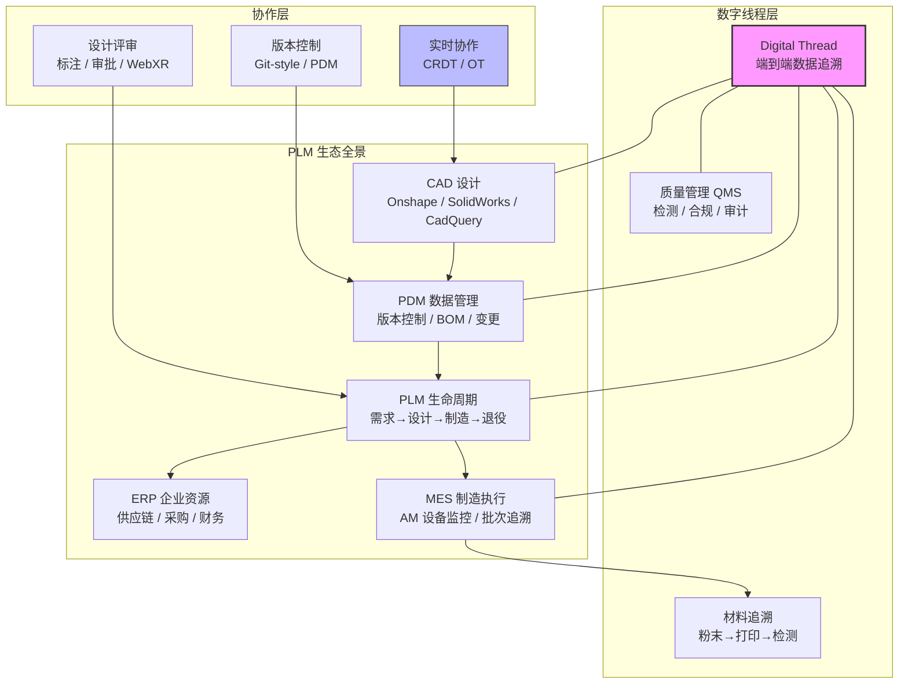
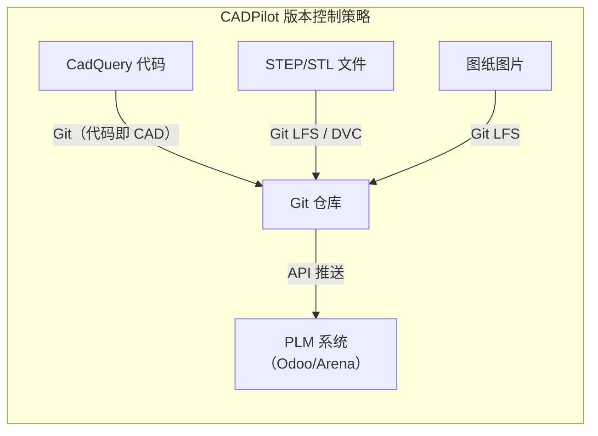
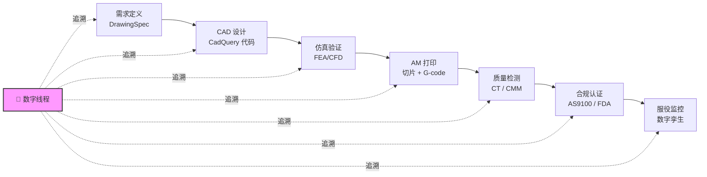
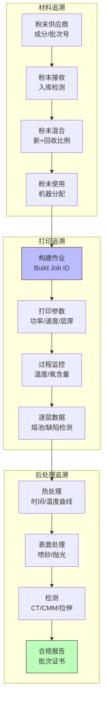

# PLM 集成方案深度调研

> [!abstract] 核心价值
> 本文系统调研了产品生命周期管理（PLM）集成方案，涵盖云原生商业平台（Onshape+Arena、Duro Labs、Nora IPLM）、开源方案（OpenPLM、DocDokuPLM、Odoo PLM）、3D 模型版本控制（Onshape 内置 vs Git LFS vs 专用 PDM）、数字线程（Digital Thread）、AM 打印批次追溯，以及 CRDT/OT 实时协作 CAD 的技术基础。最终给出 CADPilot V3 的短/中/长期集成推荐路径。

---

## 技术全景

---

## 1. 云原生商业 PLM 平台

### 1.1 Onshape + Arena（PTC 云原生全栈）⭐

> [!info] 核心定位
> PTC 旗下==唯一全云原生 CAD+PDM+PLM 一体化方案==，2025 年底扩展到 GovCloud（ITAR/EAR 合规），2026 年发布 MBD（Model-Based Definition）能力。

| 维度 | 详情 |
|------|------|
| **架构** | SaaS，单一数据库，零安装，24/7 云端访问 |
| **版本控制** | ==Git-style 分支/合并==：Branch → 并行迭代 → Merge → Version 冻结 |
| **BOM 同步** | 一键同步 Onshape BOM → Arena PLM，含 3D 缩略图和属性映射 |
| **变更管理** | Onshape Release → Arena ECO 自动触发，修订号双向引用 |
| **自动产出** | 审批时自动生成 2D PDF + 3D STEP 文件（无需人工导出） |
| **协作** | 同时编辑 + Follow Mode + 实时标注 + Arena Scribe 消息集成 |
| **存储** | 无限存储，无额外云费用 |
| **API** | REST API，可拉取零件号、BOM、属性等，支持第三方系统集成 |
| **合规** | Arena GovCloud（AWS）：ITAR/EAR，SOC 2，FDA 21 CFR Part 11 |
| **定价** | Onshape Enterprise（含 Arena Connection）；Arena Launch / Scale 计划 |

#### Onshape 版本控制工作流

#### 2025–2026 关键更新

- **2025.12**：Onshape Government + Arena GovCloud Connection（AWS），面向国防/航空等受管制行业
- **2026.02**：==MBD（Model-Based Definition）==内置能力发布——在 3D 模型中直接标注 GD&T 和制造信息，减少 2D 图纸依赖
- **2025 版本管理增强**：实时版本历史面板、可视化 Merge 线、跨 Feature Library 版本合并优化

#### CADPilot 集成分析

| 方面 | 评估 |
|------|------|
| **API 集成** | REST API 成熟，可通过 API 将 CADPilot 生成的 STEP 文件推送到 Onshape |
| **BOM 映射** | CADPilot DrawingSpec 的 features/dimensions 可映射为 Onshape 属性 |
| **变更追踪** | 自动 ECO 流程适合 CADPilot 的 SmartRefiner 迭代场景 |
| **局限** | 商业授权成本高；CadQuery 代码需转换为 Onshape Feature Script 或 STEP 中间格式 |

---

### 1.2 Duro Labs（Altium 旗下云原生 PLM）

> [!info] 核心定位
> API-first 云原生 PLM，专注硬件公司（航天、机器人、IoT、消费电子）。2025.06 发布 Duro Design 重建版，2025.12 被 ==Altium 收购==。

| 维度 | 详情 |
|------|------|
| **架构** | 云原生 + AI 增强，即开即用 |
| **核心能力** | BOM 管理、修订控制、变更流程、供应链协作 |
| **API** | ==API-first 架构==，预建 CAD/MES/ERP 集成，开放 API 可连接任意工具 |
| **AI 能力** | AI 驱动的 BOM 分析、成本估算、供应链风险预测 |
| **客户** | SpaceX 供应链企业、工业机器人公司、IoT 硬件团队 |
| **收购影响** | Altium（PCB EDA 巨头）收购后可能深化电子+机械一体化 PLM |
| **定价** | SaaS 按用户计费，面向中小硬件团队 |

#### CADPilot 集成分析

- **优势**：API-first 设计天然适合程序化集成；轻量级适合初创团队
- **局限**：被收购后战略方向不确定；偏重电子硬件，机械/AM 专用功能较弱
- **推荐场景**：CADPilot 用户中硬件创业团队的快速 PLM 接入

---

### 1.3 Nora IPLM（创新+PLM 融合平台）

> [!info] 核心定位
> IPLM（Innovation & Product Lifecycle Management）==将创新管理原生嵌入 PLM==，覆盖从创意到市场反馈的全周期。

| 维度 | 详情 |
|------|------|
| **差异化** | 传统 PLM 从设计开始；IPLM 从==创意捕获 → 概念验证 → 需求定义==开始 |
| **五大支柱** | 集中创新、需求验证、灵活产品结构、敏捷工作流、数据驱动决策 |
| **BOM 管理** | 多级 BOM + 变体配置，关联需求追溯 |
| **AI 能力** | AI 驱动的设计优化建议、供应链预测、自动化任务分配 |
| **集成** | SolidWorks 原生集成，CAD 修订 → PLM 自动同步 |
| **定价** | 云端 SaaS，面向中小企业，价格低于传统 PLM |

#### IPLM vs 传统 PLM 对比

| 方面 | 传统 PLM | IPLM（Nora） |
|------|----------|-------------|
| **范围** | 设计→生产 | ==创意→市场反馈== |
| **创新管理** | 无或第三方 | 内建核心功能 |
| **界面** | 复杂陈旧 | 现代简洁 |
| **协作** | 功能可用但孤岛化 | 实时跨职能协作 |
| **数据分析** | 报表导向 | ==实时影响分析==（成本/交期/需求） |

#### CADPilot 集成分析

- **优势**：创新到执行的全链路匹配 CADPilot 的"自然语言→3D 模型"理念
- **局限**：相对年轻，生态集成不如 PTC 成熟
- **推荐场景**：强调创新驱动产品开发的团队

---

## 2. 开源/中小企业 PLM 方案

### 2.1 方案对比总览

| 方案 | 许可 | 核心能力 | BOM | 变更管理 | ERP 集成 | 活跃度 |
|------|------|---------|-----|---------|---------|--------|
| **OpenPLM** | GPL | 零件/文档/版本管理 | ✅ | ✅ | ❌ | 低维护 |
| **DocDokuPLM** | EPL | 文档+产品结构+工作流 | ✅ | ✅ | 有限 | 中等 |
| **Odoo PLM** | LGPL | PLM+MRP+MES+QMS 一体化 | ✅ | ✅ | ==内建== | ==高== |
| **PLMore** | OSS | 云原生现代 PLM | ✅ | ✅ | 开发中 | 新兴 |
| **nanoPLM** | OSS | FreeCAD 原生 PLM | 基础 | 基础 | ❌ | 小众 |

### 2.2 OpenPLM

- **定位**：面向产品的 PLM 开源软件，统一组织各团队的产品开发活动
- **核心功能**：零件定义、BOM 管理、文档管理、版本控制、层次结构、变更历史
- **适用场景**：离散制造中需要基础追溯的小型团队
- **局限**：社区不活跃，功能较基础，无现代 UI

### 2.3 DocDokuPLM

- **定位**：Java 实现的开源 PLM，提供文档和产品结构管理
- **核心功能**：生命周期状态管理、工作流控制、3D 查看器、RESTful API
- **优势**：企业级工作流支持，可通过插件扩展
- **局限**：社区规模有限

### 2.4 Odoo PLM（推荐 SME 方案）⭐

> [!tip] 推荐理由
> Odoo 是==唯一将 PLM 与 ERP/MRP/MES/QMS 完全内建集成==的开源平台，无数据孤岛，实时可见。

| 维度 | 详情 |
|------|------|
| **版本** | Odoo 19（2025 最新），Community（免费）+ Enterprise |
| **PLM 模块** | 工程变更、版本追踪、BOM 管理，与制造/库存深度集成 |
| **MRP 集成** | 多级 BOM → 生产工单 → 车间调度，全流程数字化 |
| **质量管理** | 多阶段质量检查、统计过程控制（SPC） |
| **实施周期** | ==8–14 周==（同一数据库、统一 UI、共享工作流引擎） |
| **CAD 集成** | 通过 OpenBOM 桥接 CAD → Odoo 的 BOM 同步 |

#### Odoo 19 制造新特性（2025）

- 智能排产引擎（AI 辅助产能规划）
- 实时仪表板（生产/质量/库存联动视图）
- 条形码增强工作流（扫码入库/出库/质检）
- 深化 PLM 集成（工程变更→生产工单自动联动）

#### CADPilot 集成分析

- **路径**：CADPilot STEP 输出 → OpenBOM / 自定义 API → Odoo PLM BOM
- **优势**：免费开源，自托管可控，ERP 一体化
- **推荐**：中小 AM 企业的首选 PLM+ERP 方案

### 2.5 新兴方案

- **PLMore**：现代云原生开源 PLM，对标 Windchill/Teamcenter 但免费，技术栈新但功能不完整
- **nanoPLM**：FreeCAD 原生支持，适合小型机械制造商，功能极简

---

## 3. 3D 模型版本控制方案对比

### 3.1 方案矩阵

| 方案 | 类型 | 原理 | 优势 | 劣势 | 适用场景 |
|------|------|------|------|------|---------|
| **Onshape 内置** | SaaS 原生 | 云端 Git-style 分支/合并 | ==实时协作、零配置、合并冲突可视化== | 锁定 Onshape 生态、商业授权 | 纯 Onshape 团队 |
| **Git LFS** | 开源 | Git + Large File Storage | 开发者熟悉、CI/CD 集成 | 二进制文件无法 diff/merge、存储成本 | 代码+CAD 混合仓库 |
| **Azure DevOps** | 云端 | Git + 内置 LFS（免费存储） | ==无额外 LFS 成本==、企业级权限 | 微软生态绑定 | 已用 Azure 的团队 |
| **专用 PDM** | 商业 | Vault/Teamcenter/SolidWorks PDM | 深度 CAD 集成、审批工作流 | 成本高、部署复杂、厂商锁定 | 大型制造企业 |
| **Anchorpoint** | SaaS | Git 底层 + 艺术家友好 UI | 3D 预览、标签搜索、文件锁定 | 偏游戏/影视，非工程 CAD | 3D 资产密集型团队 |

### 3.2 CADPilot 推荐方案

> [!tip] CADPilot 的独特优势
> CADPilot 采用=="代码即 CAD"==模式（CadQuery Python 代码 → STEP），代码天然适合 Git 版本控制。这使得 CADPilot 相比传统 CAD（二进制格式）在版本管理上具有根本性优势：
> - 代码 diff 可读（参数修改一目了然）
> - 分支/合并如同软件开发
> - CI/CD 可自动执行代码 → STEP → 校验

---

## 4. 数字线程（Digital Thread）

### 4.1 概念与架构

数字线程是一个==端到端的数据追溯链路==，将设计意图、制造执行、质量检测和服务运维连成连续的数字通道。

### 4.2 AM 领域数字线程标准

| 标准 | 组织 | 覆盖范围 |
|------|------|---------|
| **STEP/STEP-NC** | ISO 10303 | 设计→制造的几何+工艺数据交换 |
| **MTConnect** | MTConnect Institute | 设备数据采集（实时工艺参数） |
| **QIF** | DMSC | 质量信息框架（检测结果交换） |
| **OPC UA** | OPC Foundation | 工业物联网通信（设备互联） |
| **ISO 23247** | ISO | 制造业数字孪生参考框架 |
| **3MF** | 3MF Consortium | AM 专用文件格式（含材料+颜色信息） |

### 4.3 2026 市场趋势

- AM 市场预计 2026 年达到 ==~$44.5B==（近三倍增长）
- 数字线程从"愿景"升级为=="采购要求"==——高保障项目（航空/国防/医疗）已将完整追溯链作为合同条件
- AI 驱动的层级异常检测：ML 算法逐层检测 AM 打印缺陷，IoT 打印机数据实时馈入 MES
- ==材料谱系（Material Genealogy）==成为标配：粉末批次 → 混合历史 → 打印参数 → 零件检测

### 4.4 CADPilot 数字线程集成

| 阶段 | CADPilot 现有能力 | 数字线程扩展 |
|------|------------------|-------------|
| 需求 | DrawingSpec（VL 读图） | 需求 ID → 设计追溯 |
| 设计 | CadQuery 代码 + STEP | 代码版本 → Git commit hash 追溯 |
| 生成 | SmartRefiner 三层校验 | 校验日志 → 质量记录 |
| 切片 | printability_node | 切片参数 → G-code 版本关联 |
| 打印 | —（待扩展） | 设备参数 + 材料批次追溯 |
| 检测 | —（待扩展） | CT/CMM 数据 → 合规报告 |

---

## 5. AM 打印批次追溯

### 5.1 追溯链路模型

### 5.2 关键 MES 平台

| 平台 | 特色 | AM 追溯能力 |
|------|------|-----------|
| **Authentise** | AM 专用 MES | ==数字粉末追踪==：批次谱系、重用计数、混合记录自动关联 |
| **Materialise Streamics** | 工业级 AM MES | 构建作业管理、材料追溯报告、设备利用率分析 |
| **AMIS Runtime** | 2026 新平台 | 自动化 AM 工厂编排、实时过程监控、API 驱动集成 |
| **3YOURMIND** | AM 工作流 | 订单→报价→排产→追溯全流程 |

### 5.3 CADPilot 集成路径

- **短期**：CADPilot printability_node 输出切片参数报告，附带唯一 Build Job ID
- **中期**：通过 API 与 Authentise/Materialise MES 集成，实现"设计→打印→检测"追溯
- **长期**：完整数字线程——DrawingSpec ID → CadQuery Git Hash → STEP 版本 → Build Job → 检测报告

---

## 6. CRDT/OT 实时协作 CAD 技术基础

### 6.1 技术对比

| 维度 | OT（Operational Transform） | CRDT（Conflict-free Replicated Data Types） | Figma 混合方案 |
|------|---------------------------|--------------------------------------------|----|
| **原理** | 中央服务器变换并发操作 | 数据结构自身保证冲突自由 | Last-Writer-Wins 寄存器 + 中央权威 |
| **代表** | Google Docs | Automerge, Yjs | Figma |
| **一致性** | 服务器保证 | 最终一致（eventual） | 中央服务器最终裁决 |
| **离线支持** | 弱 | ==强==（本地优先） | 中等 |
| **复杂度** | 变换函数复杂度高 | 数据结构设计复杂 | 工程化平衡 |
| **3D 适用** | 文本/列表操作为主 | 树/图结构可扩展 | 2D Canvas 验证 |

### 6.2 Figma 模式详解

Figma 的实时协作经验对 CAD 领域极具参考价值：

1. **非 OT 也非纯 CRDT**：采用 Last-Writer-Wins 寄存器（类 CRDT），但通过中央服务器排序（类 OT）
2. **属性粒度冲突解决**：每个对象的每个属性独立解决冲突，而非操作级别
3. **Eg-walker 算法**（2026 Code Layers 新增）：将编辑表示为有向无环因果事件图，==像 Git Rebase 一样重排分叉分支为线性序列==
4. **光标/选区广播**：P2P 式广播用户光标位置，不经服务器持久化

### 6.3 3D CAD 实时协作挑战

| 挑战 | 2D（Figma） | 3D CAD |
|------|------------|--------|
| 数据模型 | 平面属性树 | ==BREP 拓扑图==（面/边/顶点关系） |
| 操作粒度 | 属性修改 | 布尔运算（全局拓扑变化） |
| 合并冲突 | 最后写入胜出 | 几何约束可能矛盾 |
| 传输量 | KB 级 | MB 级（网格数据） |
| 验证 | 视觉检查 | 几何有效性（流形/自交检测） |

### 6.4 CADPilot 实时协作方案

> [!warning] 技术难度评估
> 3D CAD 实时协作远比 2D 设计复杂。建议采用==分层协作==策略而非尝试 BREP 级实时合并。

**推荐的分层协作架构**：

| 层级 | 协作模式 | 技术方案 |
|------|---------|---------|
| **参数层** | 实时协作 | CRDT（Yjs）同步 DrawingSpec 参数 |
| **代码层** | 准实时 | Git-style 分支+OT 编辑（如 Monaco Editor） |
| **几何层** | 异步 | 服务端 CadQuery 执行 → 推送 STEP 更新 |
| **可视层** | 实时 | Three.js 场景同步（光标+视角广播） |

---

## 7. 综合评估与推荐路径

### 7.1 方案评分矩阵

| 方案 | API 集成 | AM 适配 | 成本 | 成熟度 | 开源 | 总分 |
|------|---------|--------|------|--------|------|------|
| **Onshape+Arena** | ★★★★ | ★★★☆ | ★★☆☆ | ★★★★★ | ❌ | 14 |
| **Duro Design** | ★★★★★ | ★★★☆ | ★★★☆ | ★★★☆ | ❌ | 14 |
| **Nora IPLM** | ★★★☆ | ★★☆☆ | ★★★★ | ★★☆☆ | ❌ | 11 |
| **Odoo PLM** | ★★★☆ | ★★★☆ | ★★★★★ | ★★★★ | ✅ | ==15== |
| **OpenPLM** | ★★☆☆ | ★★☆☆ | ★★★★★ | ★★☆☆ | ✅ | 11 |
| **DocDokuPLM** | ★★★☆ | ★★☆☆ | ★★★★★ | ★★★☆ | ✅ | 13 |
| **Git+LFS** | ★★★★★ | ★★★★ | ★★★★★ | ★★★★ | ✅ | ==18== |

### 7.2 推荐路径

> [!success] 短期（0–6 月）：代码即 CAD + Git 原生版本控制
> - CadQuery Python 代码通过 Git 管理（分支/合并/diff/CI）
> - STEP/STL 通过 Git LFS 或 DVC 管理
> - 实现 Build Job ID 元数据关联（设计→切片追溯）
> - 成本：零（使用现有 Git 基础设施）

> [!success] 中期（6–18 月）：Odoo PLM 集成 + 数字线程
> - 部署 Odoo Community（自托管），启用 PLM + MRP + Quality 模块
> - 开发 CADPilot → Odoo API 桥接：DrawingSpec → BOM → 生产工单
> - 集成 AM MES（Authentise 或自建）实现打印批次追溯
> - CRDT 参数同步 MVP（Yjs + DrawingSpec）
> - 成本：低（开源 + 自研 API）

> [!success] 长期（18+ 月）：企业级 PLM + 完整数字线程
> - 高端客户：Onshape+Arena 集成（REST API 双向同步）
> - 完整数字线程：需求 → 设计（Git Hash）→ 仿真 → 打印（Build Job）→ 检测 → 合规
> - 分层实时协作：参数 CRDT + 代码 OT + Three.js 视角广播
> - 合规认证：FDA 21 CFR Part 11 / AS9100 追溯链路
> - 成本：中高（商业 PLM 授权 + 集成开发）

---

## 8. 参考文献

1. PTC, "Connecting Arena PLM and Onshape", [onshape.com/en/blog/connecting-cad-pdm-plm](https://www.onshape.com/en/blog/connecting-cad-pdm-plm)
2. PTC, "Onshape-Arena Connection Features", [onshape.com/en/features/onshape-arena-connection](https://www.onshape.com/en/features/onshape-arena-connection)
3. PTC, "Onshape MBD Capabilities Launch 2026", [ptc.com/en/news/2026/ptc-launches-onshape-mbd-capabilites](https://www.ptc.com/en/news/2026/ptc-launches-onshape-mbd-capabilites)
4. Onshape, "Git-Style Version Control for CAD", [onshape.com/en/blog/git-style-version-control-cad-data-management](https://www.onshape.com/en/blog/git-style-version-control-cad-data-management)
5. Duro Labs, "Cloud-Native PLM", [durolabs.co](https://durolabs.co/)
6. Nora IPLM, "What is IPLM", [noraplm.com/product/platform/what-is-iplm/](https://www.noraplm.com/product/platform/what-is-iplm/)
7. Odoo, "CAD/PDM/PLM and Odoo Integration", [odoo.com/event/odoo-experience-2025](https://www.odoo.com/event/odoo-experience-2025-6601/track/from-design-to-business-the-power-of-cadpdmplm-and-odoo-integration-7865)
8. OpenBOM, "OpenBOM + Odoo PLM-ERP Integration", [openbom.com/blog/introducing-openbom-odoo](https://www.openbom.com/blog/introducing-openbom-odoo-seamless-plm-erp-integration-for-manufacturers)
9. Authentise, "Future of Material Management in AM", [authentise.com/post/future-of-material-management](https://www.authentise.com/post/future-of-material-management-in-additive-manufacturing)
10. Figma, "How Figma's Multiplayer Technology Works", [figma.com/blog/how-figmas-multiplayer-technology-works](https://www.figma.com/blog/how-figmas-multiplayer-technology-works/)
11. Figma, "Canvas, Meet Code: Building Figma's Code Layers", [figma.com/blog/building-figmas-code-layers](https://www.figma.com/blog/building-figmas-code-layers/)
12. SelectHub, "5 Best Open-Source PLM Software 2026", [selecthub.com/plm/open-source-plm-software](https://www.selecthub.com/plm/open-source-plm-software/)
13. Kensington Additive, "Top Five Trends in AM for 2026", [kensingtonadditive.com](https://www.kensingtonadditive.com/2025/11/26/top-five-trends-in-additive-manufacturing-for-2026/)
14. 3D Printing Industry, "Six Fault Lines Reshaping AM 2026–2028", [3dprintingindustry.com](https://3dprintingindustry.com/news/six-fault-lines-that-will-reshape-additive-manufacturing-2026-2028-249230/)

---

> [!note] 交叉引用
> - [[webxr-design-review]] — WebXR 设计评审方案（实时协作的可视化扩展）
> - [[digital-twin-manufacturing]] — 数字孪生制造监控（数字线程的运维延伸）
> - [[implementation-feasibility]] — 实施可行性评估
> - [[3d-cad-generation]] — 3D CAD 生成模型调研（AI 生成+PLM 管理的结合点）
