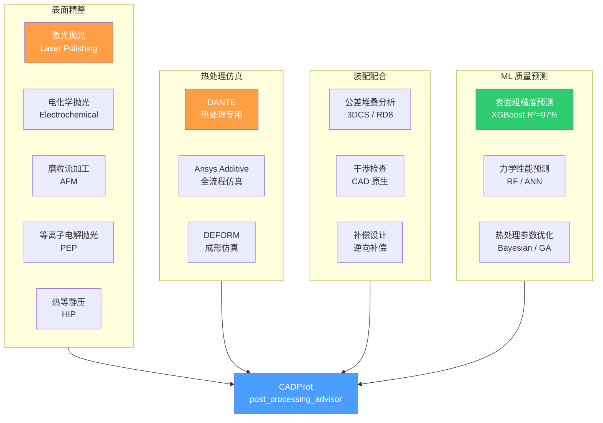
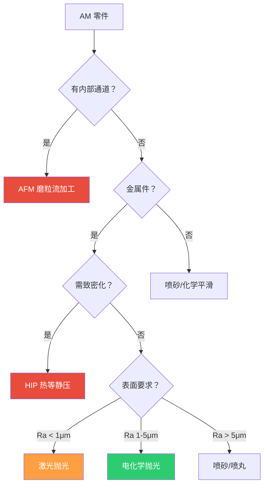
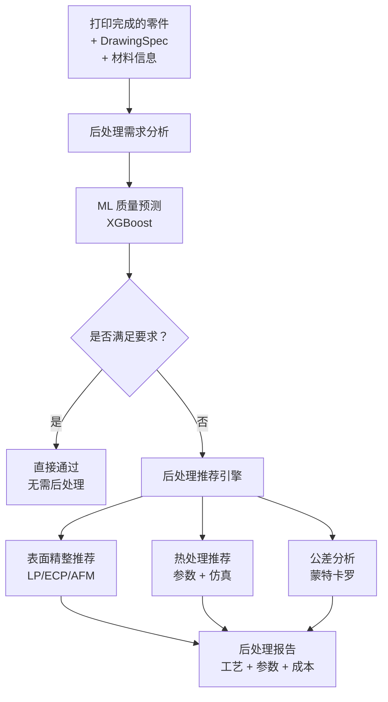

# 后处理优化研究

> [!abstract] 核心价值
> AM 后处理占总制造成本的==30-70%==，涵盖支撑移除、表面精整、热处理和质量检测。本文档调研表面精整技术（激光抛光、电化学抛光、AFM、HIP）、热处理仿真（DANTE、Ansys、DEFORM）、装配配合分析以及==ML 驱动的质量预测==（XGBoost R²=97%+），为 CADPilot V3 `post_processing_advisor` 节点提供技术选型。

---

## 技术全景



---

## 表面精整技术

### 技术对比矩阵

| 技术 | 原理 | 粗糙度改善 | 适用表面 | 自动化 | 成本 |
|:-----|:-----|:----------|:---------|:------|:-----|
| **激光抛光** | 激光重熔表面层 | Ra 10μm → ==1μm== | 外表面 | ==高== | 高 |
| **电化学抛光 (ECP)** | 阳极溶解峰值 | Ra 11.5μm → ==1.7μm== | 内外表面 | 中 | 中 |
| **等离子电解抛光 (PEP)** | 等离子体放电抛光 | ==粗糙度降低 90%== | 复杂几何 | 中 | 中 |
| **磨粒流加工 (AFM)** | 磨料流过内腔 | Ra 7.7μm → ==1.8μm== | ==内部通道== | 高 | 中 |
| **HIP** | 高温高压致密化 | 孔隙消除 | 体积缺陷 | 高 | ==高== |
| **喷砂/喷丸** | 磨粒冲击表面 | Ra 改善 30-50% | 外表面 | 高 | ==低== |

---

### 激光抛光 (Laser Polishing)

| 属性 | 详情 |
|:-----|:-----|
| **原理** | 激光束重熔金属表面薄层，在重力和表面张力作用下流平 |
| **效果** | Ra 10μm → 1μm（金属 L-PBF 零件） |
| **材料** | Ti6Al4V、不锈钢、镍基合金、铝合金 |
| **优势** | 非接触式、可自动化、适合复杂外表面 |
| **局限** | ==仅外表面==；设备昂贵；可能改变微观组织 |

#### 工艺参数

| 参数 | 典型范围 | 影响 |
|:-----|:---------|:-----|
| 激光功率 | 50-500 W | 重熔深度 |
| 扫描速度 | 100-1000 mm/s | 热输入控制 |
| 扫描间距 | 10-100 μm | 覆盖均匀性 |
| 脉冲模式 | CW / 脉冲 | 表面形态控制 |

> [!info] CADPilot 关联
> 激光抛光参数可通过 ML 优化。作为 `post_processing_advisor` 的推荐输出之一。

---

### 电化学抛光 (ECP)

| 属性 | 详情 |
|:-----|:-----|
| **原理** | 电解液中阳极溶解，==优先溶解表面凸起== |
| **效果** | Ra 11.5μm → 1.73μm（HR-2 不锈钢 SLM 件） |
| **优势** | ==无工具磨损==；不影响硬度；==可处理内表面== |
| **2025 进展** | 预溶解 ECP 提升 AM 合金表面均匀性 |

#### 变体技术

| 变体 | 特点 | 适用 |
|:-----|:-----|:-----|
| 传统 ECP | 恒电位/恒电流 | 通用外/内表面 |
| ==PEP（等离子电解抛光）== | 高电压等离子放电 | Ti6Al4V（==粗糙度降 90%==，300V/20min） |
| 脉冲 ECP | 脉冲电流改善均匀性 | 精密内腔 |
| 预溶解 ECP | 先溶解 Si 相再抛光 | AlSi10Mg AM 件 |

---

### 磨粒流加工 (AFM)

| 属性 | 详情 |
|:-----|:-----|
| **原理** | 含磨粒的粘弹性介质在压力下流过零件内腔 |
| **效果** | Ra 7.7μm → 1.8μm（SLM 内部通道） |
| **优势** | ==唯一可处理复杂内部通道的方法== |
| **最小通道** | ==40μm 直径==（精密喷嘴） |
| **代表厂商** | Extrude Hone |

#### 2025 年进展

| 进展 | 详情 |
|:-----|:-----|
| 液态金属驱动 AFM (LM-AF) | 解决内角抛光不均匀问题 |
| 生物降解磨料介质 | 半乳甘露聚糖基介质，==粗糙度降低 75%+== |
| 材料去除预测 | ML 模型预测 AFM 去除量，实现补偿设计 |

> [!tip] CADPilot 价值
> AFM 是处理 AM 内部通道的关键后处理手段。`post_processing_advisor` 可根据零件内腔几何自动推荐 AFM 工艺参数。

---

### 热等静压 (HIP)

| 属性 | 详情 |
|:-----|:-----|
| **原理** | 高温（1000-1200°C）+ 高压（100-200 MPa）惰性气体 → 闭合内部孔隙 |
| **效果** | ==100% 致密化==；疲劳性能提升 2-10x |
| **适用** | 航空航天、医疗植入物、发电设备 |
| **致密化机制** | 塑性变形（初期） → 蠕变 + 扩散（后期） |

#### HIP 参数

| 参数 | 典型范围 | 影响 |
|:-----|:---------|:-----|
| 温度 | 900-1200°C | 材料相变 + 蠕变速率 |
| 压力 | 100-200 MPa | 孔隙闭合驱动力 |
| 保温时间 | 2-4 小时 | 致密化程度 |
| 气体 | 氩气 | 避免氧化 |
| 冷却速率 | 可控 | 微观组织调控 |

#### 2025 年研究进展

| 方向 | 详情 |
|:-----|:-----|
| HIP + AM 工艺链 | 将 HIP 集成到 AM 后处理标准工作流 |
| 合金特异性参数 | Ti6Al4V / IN718 / 316L 各需不同 HIP 参数 |
| 近净成型 HIP (NNSHIP) | 粉末冶金 + HIP 一体化 |
| Hiperbaric 新设备 | Formnext 2025 展出 AM 专用 HIP 设备 |

> [!warning] 成本考量
> HIP 设备投资 $500K-$5M+，==单件处理成本 $50-$500==。仅在高价值零件（航空、医疗）中经济可行。CADPilot 应根据零件价值和性能要求有条件推荐。

---

### 表面精整决策树



---

## 热处理仿真

### 仿真工具对比

| 工具 | 开发商 | 许可证 | 核心能力 | AM 专用 | 集成 |
|:-----|:------|:------|:---------|:------|:-----|
| **DANTE** | Dante Solutions | ==商用== | 热处理变形/相变/硬度预测 | 部分 | Ansys/Abaqus |
| **Ansys Additive** | Ansys | ==商用== | ==全 AM 流程仿真== | ==是== | Ansys Workbench |
| **DEFORM** | SFTC | ==商用== | 金属成形/热处理 | 部分 | 独立 |
| **Simufact** | Hexagon | 商用 | AM 过程仿真 | 是 | MSC 生态 |
| **PhysicsNeMo** | NVIDIA | ==Apache 2.0== | ==ML 代理仿真== | 研究中 | PyTorch |

---

### DANTE 热处理仿真

| 属性 | 详情 |
|:-----|:-----|
| **官网** | [dante-solutions.com](https://dante-solutions.com/) |
| **定位** | ==钢材热处理仿真专用== |
| **核心能力** | 变形预测、相变计算、硬度分布、残余应力 |
| **FEA 集成** | Ansys Mechanical / Abaqus 用户子程序 |
| **许可证** | 商用付费 |

#### 核心功能

| 功能 | 说明 |
|:-----|:-----|
| **相变建模** | 奥氏体化、马氏体/贝氏体/珠光体转变 |
| **变形预测** | 淬火变形、回火变形、渗碳变形 |
| **硬度计算** | 基于相组分的硬度分布预测 |
| **残余应力** | 热处理后残余应力场 |
| **AM 扩展** | 液/固相变潜热模型（焊接/AM 熔池仿真） |

#### CADPilot 集成评估

| 维度 | 评分 | 说明 |
|:-----|:-----|:-----|
| 技术价值 | ★★★★★ | 热处理仿真领域金标准 |
| 集成可行性 | ★★ | 需 Ansys/Abaqus 许可 + DANTE 许可 |
| 成本 | ==高== | 多重商业许可 |
| **推荐** | **P3 长期** | 仅在工业级客户需求时考虑 |

---

### Ansys Additive

| 属性 | 详情 |
|:-----|:-----|
| **官网** | [ansys.com/additive](https://www.ansys.com/products/additive) |
| **版本** | 2025 R2 |
| **核心能力** | 热变形仿真、应力预测、工艺参数优化 |

#### 2025 R2 新特性

| 特性 | 说明 |
|:-----|:-----|
| 热仿真精度提升 | 改进的热源模型和网格自适应 |
| 应变预测增强 | 更准确的残余应力-应变计算 |
| 工艺参数控制 | 扫描策略 + 功率 + 速度联合优化 |
| 互操作性改进 | 与 CAD/CAM 工具链更好集成 |

> [!info] CADPilot 评估
> Ansys Additive 是最全面的 AM 仿真平台，但高昂的许可费用（$50K+/年）限制了集成可行性。短期建议使用 [[surrogate-models-simulation|PhysicsNeMo 代理仿真]] 替代。

---

### DEFORM

| 属性 | 详情 |
|:-----|:-----|
| **官网** | deform.com |
| **开发商** | Scientific Forming Technologies Corporation (SFTC) |
| **核心能力** | 金属成形仿真（锻造、挤压、轧制）+ 热处理 |
| **AM 应用** | DED 过程仿真、残余应力预测 |

---

### 开源替代方案

> [!success] 推荐：PhysicsNeMo MeshGraphNet 代理仿真

| 方案 | 说明 | 推荐级别 |
|:-----|:-----|:---------|
| **PhysicsNeMo MeshGraphNet** | GNN 代理仿真，秒级推理 | ==P2 推荐== |
| **FEniCS/Firedrake** | 开源 FEM 框架 | P3 辅助 |
| **Elmer FEM** | 开源多物理场 | P3 辅助 |

```python
# PhysicsNeMo 代理仿真伪代码
from physicsnemo.models.meshgraphnet import MeshGraphNet

# 训练：FEM 仿真数据 → MeshGraphNet
model = MeshGraphNet(
    input_dim_nodes=11,   # 节点特征（温度、材料、约束）
    output_dim=3,         # 预测变形 (dx, dy, dz)
    processor_size=15,    # 消息传递层数
)

# 推理：秒级预测热处理后变形
displacement = model(node_features, edge_index, edge_features)
# → torch.Size([N_nodes, 3])  ~100ms 推理
```

> [!tip] 替代策略
> 用 PhysicsNeMo 训练代理仿真模型，以==小时级 FEM → 秒级推理==的方式替代商用仿真软件。需要的前提：训练数据生成（用开源 FEM 或少量商用仿真结果）。

---

## 装配配合分析

### 公差堆叠分析

#### 工具对比

| 工具 | 开发商 | 特点 | 许可证 | 推荐 |
|:-----|:------|:-----|:------|:-----|
| **3DCS Variation Analyst** | DCS | CAD 集成，蒙特卡罗仿真 | 商用 | P3 |
| **RD8** | RD8 Tech | ==CAD 无关==，STEP 文件通用 | 商用 | P3 |
| **Creo EZ Tolerance** | PTC | Creo 原生 | 商用 | 不适用 |
| **Inventor Tolerance** | Autodesk | Inventor 原生 | 商用 | 不适用 |
| **自研蒙特卡罗** | - | Python 实现 | ==免费== | ==P1== |

#### Python 蒙特卡罗公差分析

```python
import numpy as np
from dataclasses import dataclass

@dataclass
class Tolerance:
    nominal: float     # 公称尺寸 (mm)
    plus: float        # 上偏差
    minus: float       # 下偏差

def monte_carlo_stack(
    tolerances: list[Tolerance],
    n_simulations: int = 100_000,
) -> dict:
    """蒙特卡罗公差堆叠分析"""
    results = np.zeros(n_simulations)
    for tol in tolerances:
        # 假设正态分布，3σ 覆盖公差带
        mean = tol.nominal + (tol.plus + tol.minus) / 2
        std = (tol.plus - tol.minus) / 6  # 3σ
        samples = np.random.normal(mean, std, n_simulations)
        results += samples

    return {
        "mean": float(np.mean(results)),
        "std": float(np.std(results)),
        "min": float(np.min(results)),
        "max": float(np.max(results)),
        "cpk": float(
            min(
                (np.mean(results) - np.min(results)),
                (np.max(results) - np.mean(results)),
            ) / (3 * np.std(results))
        ),
    }
```

### AM 零件尺寸补偿

| 补偿类型 | 方法 | 说明 |
|:---------|:-----|:-----|
| **均匀缩放** | 全局缩放因子 | 简单但不精确 |
| **逆向补偿** | FEM 变形取反 | ==精确但需仿真== |
| **ML 补偿** | 学习变形模式 | 数据驱动，可泛化 |
| **迭代补偿** | 打印-测量-调整 | 经验积累，收敛慢 |

> [!success] CADPilot 推荐路径
> 1. **P0**：简单均匀缩放（基于材料和工艺经验值）
> 2. **P1**：Python 蒙特卡罗公差分析
> 3. **P2**：ML 变形预测 + 逆向补偿

---

## ML 驱动的质量预测

### 表面粗糙度预测

#### 2025 年关键成果

| 论文/方法 | 算法 | R² | 应用 | 来源 |
|:---------|:-----|:---|:-----|:-----|
| ML 表面粗糙度（垂直方向） | 集成模型 | ==97.06%== | FDM 打印件 | ScienceDirect 2025 |
| 牙科精密原型 | ==XGBoost== | ==99.86%== | SLA 牙科件 | Scientific Reports 2025 |
| AM 表面粗糙度 | XGBoost | ==96.34%== | 通用 AM | Applied Sciences 2025 |
| 化学-机械后处理 | 集成 ML | 高 | 牙科 AM | Progress in AM 2025 |
| 激光原位锻造 | 深度学习 | 高 | Ti6Al4V DED | V&PP 2025 |

#### XGBoost 粗糙度预测流程

```mermaid
graph LR
    INPUT[输入特征] --> TRAIN[XGBoost 训练]
    TRAIN --> MODEL[预测模型<br>R²=97%+]
    MODEL --> PRED[粗糙度预测<br>Ra (μm)]
    PRED --> DECISION{满足要求？}
    DECISION -->|是| PASS[通过]
    DECISION -->|否| ADJUST[调整参数<br>或推荐后处理]

    subgraph FEATURES["输入特征空间"]
        LH[层厚]
        PS[打印速度]
        ET[挤出温度]
        ID[填充密度]
        BO[构建方向角度]
        MAT[材料类型]
    end

    FEATURES --> INPUT
```

#### CADPilot 集成方案

```python
import xgboost as xgb
import numpy as np
from pydantic import BaseModel

class RoughnessFeatures(BaseModel):
    """表面粗糙度预测特征"""
    layer_height: float       # mm
    print_speed: float        # mm/s
    extrusion_temp: float     # °C
    infill_density: float     # %
    build_angle: float        # 度
    material_type: str        # PLA/ABS/PETG/Ti6Al4V/316L

class RoughnessPrediction(BaseModel):
    """预测结果"""
    predicted_ra: float       # μm
    confidence: float         # 0-1
    post_process_needed: bool
    recommended_process: str | None

def predict_roughness(
    features: RoughnessFeatures,
    model: xgb.XGBRegressor,
) -> RoughnessPrediction:
    """预测 AM 零件表面粗糙度"""
    X = np.array([[
        features.layer_height,
        features.print_speed,
        features.extrusion_temp,
        features.infill_density,
        features.build_angle,
    ]])
    ra = model.predict(X)[0]

    # 根据预测推荐后处理
    if ra < 1.0:
        process = None
        needed = False
    elif ra < 5.0:
        process = "电化学抛光"
        needed = True
    else:
        process = "激光抛光 + 电化学抛光"
        needed = True

    return RoughnessPrediction(
        predicted_ra=ra,
        confidence=0.97,
        post_process_needed=needed,
        recommended_process=process,
    )
```

---

### AI 热处理参数优化

#### 方法对比

| 方法 | 优势 | 数据需求 | 推荐 |
|:-----|:-----|:---------|:-----|
| **Bayesian 优化** | 少量试验即可收敛 | ==低==（10-50 组） | ==P2 推荐== |
| **遗传算法 (GA)** | 全局搜索，多目标 | 中（100+ 组） | P2 |
| **Random Forest** | 特征重要性分析 | 中 | P1 辅助 |
| **Neural Network** | 高精度非线性建模 | ==高==（1000+ 组） | P3 |
| **物理信息 NN (PINN)** | 结合物理方程约束 | 中 | P3 |

#### Bayesian 优化示例

```python
from skopt import gp_minimize
from skopt.space import Real

def heat_treatment_objective(params):
    """热处理参数目标函数（模拟或实验）"""
    temp, time, cooling_rate = params
    # 目标：最大化硬度，最小化变形
    # 此处替换为实际仿真或实验结果
    hardness = simulate_hardness(temp, time, cooling_rate)
    distortion = simulate_distortion(temp, time, cooling_rate)
    return -(hardness - 10 * distortion)  # 最小化负目标

# 参数搜索空间
space = [
    Real(800, 1200, name="temperature_C"),     # 温度
    Real(0.5, 4.0, name="hold_time_h"),        # 保温时间
    Real(1.0, 50.0, name="cooling_rate_Cps"),  # 冷却速率
]

# Bayesian 优化（仅需 20-50 次评估）
result = gp_minimize(
    heat_treatment_objective,
    space,
    n_calls=50,
    random_state=42,
)
print(f"最优参数: T={result.x[0]:.0f}°C, "
      f"t={result.x[1]:.1f}h, "
      f"CR={result.x[2]:.1f}°C/s")
```

---

### 力学性能预测

| 模型 | 预测目标 | 输入 | R² | 来源 |
|:-----|:---------|:-----|:---|:-----|
| Random Forest | 拉伸强度 | 打印参数 + 材料 | ==95%+== | Nature SR 2025 |
| XGBoost | 弯曲强度 | 层厚/速度/温度 | 93%+ | IJAMT 2025 |
| ANN | 综合力学 | 全参数 | 90%+ | ASME 2024 |
| LSTM | ==逆向预测打印参数== | 应力-应变曲线 | 高 | V&PP 2024 |

> [!tip] 逆向预测的价值
> LSTM 从目标力学性能曲线==反推最优打印参数==，实现"设计即制造"——用户指定力学需求，AI 自动生成打印参数。

---

## CADPilot `post_processing_advisor` 节点设计

### 架构设计



### 推荐技术栈

| 层 | 短期（P1） | 中期（P2） | 长期（P3） |
|:---|:----------|:----------|:----------|
| **质量预测** | 规则引擎 | ==XGBoost 预测== | 多模型集成 |
| **表面精整** | 决策树推荐 | ML 参数优化 | 闭环实时调整 |
| **热处理** | 查表法 | ==Bayesian 优化== | PhysicsNeMo 代理仿真 |
| **公差分析** | 均匀缩放补偿 | ==蒙特卡罗分析== | ML 变形逆向补偿 |
| **装配检查** | CadQuery 碰撞检测 | 公差堆叠 + 干涉 | 数字孪生验证 |

---

## 集成优先级路线图

> [!success] 分三阶段实施

### Phase 1（P1，1-2 月）

| 行动项 | 说明 |
|:-------|:-----|
| 规则引擎质量评估 | 基于零件类型 + 材料 + 工艺推荐后处理 |
| 表面精整决策树 | 实现上述 mermaid 决策树逻辑 |
| 蒙特卡罗公差分析 | Python 实现，集成到 `post_processing_advisor` |

### Phase 2（P2，2-4 月）

| 行动项 | 说明 |
|:-------|:-----|
| ==XGBoost 粗糙度预测== | 训练 R²=97%+ 模型 |
| ==Bayesian 热处理优化== | skopt 实现，50 次评估收敛 |
| ML 力学性能预测 | Random Forest / XGBoost 多目标 |
| 逆向补偿设计 | 基于预测变形的尺寸补偿 |

### Phase 3（P3，4+ 月）

| 行动项 | 说明 |
|:-------|:-----|
| PhysicsNeMo 代理仿真 | MeshGraphNet 热变形预测 |
| 闭环质量优化 | 打印-检测-调整反馈环 |
| 数字孪生验证 | 虚拟装配 + 配合检查 |

---

## 风险评估

| 风险 | 级别 | 影响 | 缓解方案 |
|:-----|:-----|:-----|:---------|
| 仿真软件许可费 | ==高== | DANTE/Ansys 年费 $50K+ | PhysicsNeMo 代理仿真替代 |
| ML 训练数据不足 | 中 | 粗糙度/力学预测需标注数据 | 公开数据集 + 合成数据 |
| 后处理工艺多样性 | 中 | 不同材料/工艺需不同后处理 | 模块化推荐引擎 |
| 精度验证困难 | 中 | 预测结果需实验验证 | 与实验室合作验证 |
| 公差分析范围 | 低 | AM 零件公差数据库不完善 | 逐步积累工艺数据 |

> [!danger] 关键风险
> 商用仿真软件（DANTE、Ansys、DEFORM）的==高昂许可费用==是最大障碍。建议使用 PhysicsNeMo 等开源 ML 框架构建代理仿真模型，以==秒级推理==替代==小时级 FEM==。

---

## 参考文献

1. Laser Polishing for AM: A Review. IJAMT 2022. [doi:10.1007/s00170-022-08840-x](https://link.springer.com/article/10.1007/s00170-022-08840-x)
2. PEP for Ti6Al4V AM Parts. Technologies 2024. [doi:10.3390/technologies13120553](https://www.mdpi.com/2227-7080/13/12/553)
3. Abrasive Machining of AM Metal Parts. Materials 2025. [doi:10.3390/ma18061249](https://pmc.ncbi.nlm.nih.gov/articles/PMC11944133/)
4. AFM Internal Channel Polishing. Micromachines 2025. [doi:10.3390/mi16090987](https://www.mdpi.com/2072-666X/16/9/987)
5. HIP for AM Components. Progress in AM 2025. [doi:10.1007/s40964-025-01320-0](https://link.springer.com/article/10.1007/s40964-025-01320-0)
6. DANTE Heat Treatment Simulation. [dante-solutions.com](https://dante-solutions.com/)
7. Ansys Additive 2025 R2. [ansys.com/additive](https://www.ansys.com/products/additive)
8. ML Surface Roughness Prediction (R²=97%). ScienceDirect 2025. [doi:10.1016/j.measurement.2025.116890](https://www.sciencedirect.com/science/article/pii/S2666790825001697)
9. XGBoost Dental Roughness (R²=99.86%). Scientific Reports 2025. [doi:10.1038/s41598-025-17487-z](https://www.nature.com/articles/s41598-025-17487-z)
10. Multi-objective FDM via Random Forest. Nature SR 2025. [doi:10.1038/s41598-025-01016-z](https://www.nature.com/articles/s41598-025-01016-z)
11. RD8 Tolerance Analysis. [rd8.tech](https://www.rd8.tech/)
12. Post-Process Treatments for AM: Comprehensive Review. JMEP 2023. [doi:10.1007/s11665-023-08051-9](https://link.springer.com/article/10.1007/s11665-023-08051-9)

---

## 更新日志

| 日期 | 变更 |
|:-----|:-----|
| 2026-03-03 | 初始版本：表面精整技术对比（激光抛光/ECP/PEP/AFM/HIP）；热处理仿真工具评估（DANTE/Ansys/DEFORM）；装配配合分析（公差堆叠 + 蒙特卡罗）；ML 质量预测（XGBoost R²=97%+ 粗糙度 + RF 力学性能 + Bayesian 热处理优化）；post_processing_advisor 节点架构设计；三阶段路线图 |
