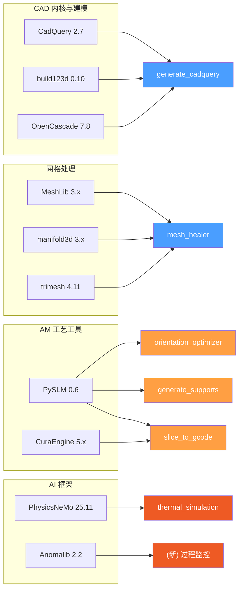
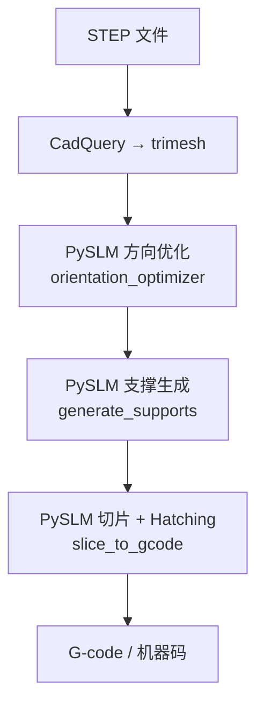
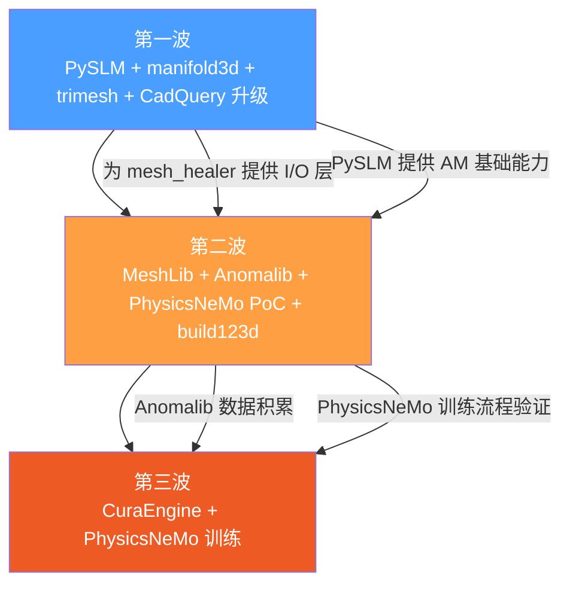

# 实用工具与框架深度评估

> [!abstract] 定位
> 本文档从 CADPilot 7 个 AI 研究方向中提取==可直接部署使用的开源工具和框架==，按 CAD 内核、网格处理、AM 工艺、AI 框架四大类别进行深度评估。每个工具均包含安装验证、代码示例、性能基准和 CADPilot 管线集成分析，为技术选型和集成决策提供依据。

---

## 工具全景



> [!tip] 颜色图例
> - ==蓝色==：短期可集成（P0-P1，1-2 月）
> - ==橙色==：中期集成（P1-P2，2-4 月）
> - ==红色==：长期探索（P2+，4+ 月）

---

## 评估方法论

每个工具从以下 8 个维度进行标准化评估：

| 维度 | 指标 | 权重 |
|:-----|:-----|:-----|
| **基本信息** | GitHub stars / 许可证 / 语言 / 最新版本 | 参考 |
| **核心功能** | 功能完备性，与 CADPilot 需求匹配度 | ★★★★★ |
| **代码示例** | Python API 可用性，10-20 行即可验证 | ★★★★ |
| **安装部署** | `pip install` 一行安装 vs 编译依赖 | ★★★★ |
| **性能指标** | 基准测试数据，运行时间/内存占用 | ★★★ |
| **社区活跃度** | issue 响应、更新频率、贡献者数量 | ★★★ |
| **集成分析** | 对应管线节点、集成难度、预期价值 | ★★★★★ |
| **风险评估** | 许可证兼容性、维护风险、依赖冲突 | ★★★★ |

**评分体系**：每工具给出综合推荐星级（★-★★★★★），其中 ★★★★+ 为推荐集成。

---

## CAD 内核与建模

### CadQuery 2.7 / build123d 0.10

> [!success] CADPilot 当前核心 CAD 引擎

| 属性 | CadQuery | build123d |
|:-----|:---------|:----------|
| **GitHub** | [CadQuery/cadquery](https://github.com/CadQuery/cadquery) | [gumyr/build123d](https://github.com/gumyr/build123d) |
| **Stars** | ~9.5K | ~1.8K |
| **许可证** | ==Apache 2.0== | ==Apache 2.0== |
| **最新版本** | ==2.7.0==（2026-02-13） | 0.10.0 |
| **Python** | 3.9+ | 3.9+ |
| **CAD 内核** | OCCT 7.8（via OCP） | OCCT 7.8（via OCP） |
| **安装** | `pip install cadquery` | `pip install build123d` |
| **API 风格** | Fluent API（方法链） | Context Manager（上下文管理器） |

#### 核心功能对比

| 功能 | CadQuery | build123d |
|:-----|:---------|:----------|
| Sketch + Extrude | ✅ | ✅ |
| Revolve / Loft / Sweep | ✅ | ✅ |
| Boolean (union/cut/intersect) | ✅ | ✅ |
| Fillet / Chamfer | ✅ | ✅ |
| Assembly | ✅ | ✅ |
| STEP / STL / BREP 导出 | ✅ | ✅ |
| 曲面贴合（wrap） | ❌ | ==✅ Face.wrap== |
| 代数操作符 (+, -, &) | ❌ | ==✅== |

#### CadQuery 代码示例

```python
import cadquery as cq

# 创建阶梯轴零件
result = (
    cq.Workplane("XY")
    .circle(20)                    # 底部圆 R20
    .extrude(30)                   # 拉伸 30mm
    .faces(">Z")
    .workplane()
    .circle(15)                    # 中段圆 R15
    .extrude(20)                   # 拉伸 20mm
    .faces(">Z")
    .workplane()
    .circle(10)                    # 顶部圆 R10
    .extrude(15)                   # 拉伸 15mm
    .edges("|Z").fillet(2)         # 所有竖直边倒圆角 R2
)

# 导出 STEP 文件
cq.exporters.export(result, "stepped_shaft.step")
```

#### build123d 代码示例

```python
from build123d import *

# 等价的阶梯轴——上下文管理器风格
with BuildPart() as part:
    Cylinder(radius=20, height=30)
    with BuildPart(mode=Mode.ADD):
        with Locations((0, 0, 30)):
            Cylinder(radius=15, height=20)
        with Locations((0, 0, 50)):
            Cylinder(radius=10, height=15)
    fillet(part.edges().filter_by(Axis.Z), radius=2)

# 导出
part.part.export_step("stepped_shaft.step")
```

#### CADPilot 集成分析

| 维度 | 分析 |
|:-----|:-----|
| **对应节点** | `generate_cadquery` |
| **当前状态** | CadQuery 2.4.0 已深度集成到 V2 管线 |
| **升级路径** | CadQuery 2.4 → 2.7（平滑升级，API 向后兼容） |
| **build123d 价值** | 更 Pythonic 的 API，LLM 生成代码更自然；与 CadQuery 共享 OCP 底层，对象可互转 |
| **集成难度** | ==低==（pip 升级即可） |
| **风险** | Apache 2.0 无许可风险；两者共享 OCCT 底层，依赖链稳定 |

> [!tip] 建议
> - 短期保持 CadQuery 作为主引擎，升级到 2.7.0
> - 中期评估 build123d 作为补充——其代数操作符风格更适合 LLM 代码生成
> - 两者对象通过 OCP 底层互通，可同时使用

**综合评级：★★★★★**

---

### OpenCascade Technology (OCCT)

| 属性 | 详情 |
|:-----|:-----|
| **官网** | [dev.opencascade.org](https://dev.opencascade.org) |
| **当前版本** | 7.8.x |
| **许可证** | ==LGPL 2.1==（可商用） |
| **语言** | C++，Python binding 通过 OCP / PythonOCC |
| **地位** | CadQuery 和 build123d 的底层引擎 |

#### Python 绑定生态

| 绑定 | 维护方 | 特点 |
|:-----|:------|:-----|
| **OCP** (cadquery-ocp) | CadQuery 社区 | CadQuery/build123d 使用；自动化绑定，版本同步快 |
| **PythonOCC** | Thomas Paviot | 更薄的包装层；CADFusion 等学术项目使用 |

> [!info] CADPilot 关联
> OCCT 是所有 BREP 操作的基石。CADPilot 不直接调用 OCCT API，而是通过 CadQuery 抽象层使用。了解 OCCT 能力边界有助于评估 CadQuery 代码生成的可行性范围。

**综合评级：★★★★★**（基础设施，无需直接集成）

---

## 网格处理工具

### MeshLib

> [!warning] 许可证需注意：非 OSI 开源，商用需授权

| 属性 | 详情 |
|:-----|:-----|
| **GitHub** | [MeshInspector/MeshLib](https://github.com/MeshInspector/MeshLib)（~735★） |
| **许可证** | ==双重许可：学术免费 / 商用付费==（非 OSI 开源） |
| **语言** | C++，Python/C#/C 绑定 |
| **最新版本** | 3.1.x |
| **安装** | `pip install meshlib` |
| **平台** | Windows / macOS / Linux / WebAssembly |

#### 核心功能清单

| 功能类别 | 具体能力 |
|:---------|:---------|
| **网格修复** | 去自相交、填孔、法线统一、组件分离 |
| **布尔运算** | 基于体素的快速布尔（union / diff / intersect） |
| **体素化** | Mesh → 体素 → Mesh 双向转换 |
| **平滑** | Laplacian / Freeform / Relax 平滑 |
| **分割** | 基于曲率的半自动分割 |
| **测量** | 距离图、等值线、投影、交线计算 |
| **格式** | STL / OBJ / PLY / OFF / 3MF 等 |

#### 代码示例

```python
import meshlib.mrmeshpy as mr

# 加载 mesh
mesh = mr.loadMesh("broken_part.stl")

# 修复：去除退化面 + 填孔 + 统一法线
params = mr.FixSelfIntersectionsParams()
mr.fixSelfIntersections(mesh, params)

holes = mr.findHoles(mesh)
for hole in holes:
    mr.fillHole(mesh, hole)

mr.fixNonManifoldEdges(mesh)

# 体素化修复（终极手段）
voxel_params = mr.MeshToVolumeParams()
voxel_params.voxelSize = 0.5  # mm
volume = mr.meshToVolume(mesh, voxel_params)
repaired = mr.volumeToMesh(volume)

# 导出
mr.saveMesh(repaired, "repaired_part.stl")
```

#### 性能指标

| 操作 | MeshLib | trimesh | 倍率 |
|:-----|:-------|:--------|:-----|
| 布尔运算（10K 面） | ~50ms | ~500ms | ==10x== |
| 体素化修复（100K 面） | ~200ms | N/A | - |
| 加载 STL（1M 面） | ~100ms | ~300ms | 3x |

> [!info] 来源：MeshLib 官方宣称 "up to 10x faster than other SDKs"

#### CADPilot 集成分析

| 维度 | 分析 |
|:-----|:-----|
| **对应节点** | `mesh_healer`（==首选确定性修复通道==） |
| **集成难度** | ==低==（pip install，Python API 完善） |
| **预期价值** | ==高==——覆盖 80%+ 常见 mesh 缺陷的快速确定性修复 |
| **关键限制** | 高分辨率体素化可能 OOM；==商用需购买许可== |

#### 风险评估

| 风险 | 级别 | 缓解方案 |
|:-----|:-----|:---------|
| ==许可证限制== | ==高== | 学术/评估免费；商用前需签订许可协议 |
| 高精度 OOM | 中 | 设置体素大小上限，OOM 时降级到 AI 修复 |
| 依赖冲突 | 低 | 预编译 wheel，无 Python 依赖冲突 |

**综合评级：★★★★**（功能强大但许可证限制需评估）

---

### manifold3d

> [!success] 保证流形输出的 CSG 布尔运算——性能领先 1000x

| 属性 | 详情 |
|:-----|:-----|
| **GitHub** | [elalish/manifold](https://github.com/elalish/manifold)（==~1.8K★==） |
| **许可证** | ==Apache 2.0==（可商用） |
| **作者** | Emmett Lalish（Weta FX） |
| **语言** | C++，Python / JS / WASM 绑定 |
| **最新版本** | 3.1.1（PyPI） |
| **安装** | `pip install manifold3d` |

#### 核心功能

| 功能 | 说明 |
|:-----|:-----|
| **CSG 布尔** | Union / Difference / Intersection，==保证输出流形== |
| **构造操作** | Extrude / Revolve / Level Set |
| **变换** | Translate / Rotate / Scale / Mirror |
| **查询** | Volume / Surface Area / Bounding Box / Is Empty |
| **导入导出** | 内部 mesh 格式，可与 trimesh 互转 |

#### 性能基准

| 对比对象 | manifold3d 优势 |
|:---------|:---------------|
| JSCAD/CSharpCAD BSP | ==1000x== 更快 |
| CGAL fast-csg | ==5-30x== 更快 |
| OpenSCAD (CGAL) | OpenSCAD + Manifold backend 5-30x 加速 |

#### 代码示例

```python
import manifold3d as m3d
import numpy as np

# 创建基本体
cube = m3d.Manifold.cube([20, 20, 20], center=True)
sphere = m3d.Manifold.sphere(12, circular_segments=64)
cylinder = m3d.Manifold.cylinder(30, 5, circular_segments=32)

# CSG 布尔运算（保证流形输出）
result = cube - sphere          # 差集：球形掏空
result = result + cylinder      # 并集：加圆柱

# 验证流形性
assert result.status() == m3d.Manifold.Error.NoError
print(f"Volume: {result.volume():.2f} mm^3")
print(f"Is empty: {result.is_empty()}")

# 导出为 trimesh 格式
mesh = result.to_mesh()
vertices = np.array(mesh.vert_properties[:, :3])
faces = np.array(mesh.tri_verts)
```

#### CADPilot 集成分析

| 维度 | 分析 |
|:-----|:-----|
| **对应节点** | `mesh_healer`（布尔清理）、`boolean_assemble`（==CSG 装配==） |
| **集成难度** | ==低==（pip install，纯 Python API） |
| **预期价值** | ==高==——PySLM 支撑生成已使用 manifold3d 作为 CSG 后端 |
| **关键优势** | Apache 2.0 无许可风险；保证流形输出消除后处理 |

#### 风险评估

| 风险 | 级别 | 缓解方案 |
|:-----|:-----|:---------|
| 许可证 | ==无风险== | Apache 2.0 |
| 仅做布尔 | 低 | 与 MeshLib/trimesh 配合使用 |
| 输入需为流形 | 中 | 先用 MeshLib 修复，再用 manifold 做布尔 |

**综合评级：★★★★★**

---

### trimesh

> [!info] Python 网格处理生态核心——2.9K+ stars，MIT 许可

| 属性 | 详情 |
|:-----|:-----|
| **GitHub** | [mikedh/trimesh](https://github.com/mikedh/trimesh)（==~3.3K★==） |
| **许可证** | ==MIT==（可商用） |
| **语言** | 纯 Python |
| **最新版本** | ==4.11.2== |
| **安装** | `pip install trimesh` |
| **硬依赖** | 仅 numpy |

#### 核心功能清单

| 功能类别 | 具体能力 |
|:---------|:---------|
| **格式支持** | STL / OBJ / PLY / GLTF / GLB / 3MF / OFF / DAE 等 |
| **基础修复** | fill_holes / fix_normals / fix_winding / merge_vertices |
| **几何分析** | is_watertight / volume / center_mass / inertia / bounds |
| **采样** | 表面采样（sample_surface）/ 体积采样 |
| **光线追踪** | ray-mesh intersection（embree 加速） |
| **凸包** | convex_hull（scipy 后端） |
| **场景图** | Scene / Transform Tree |
| **可视化** | pyglet / three.js / pyrender |
| **基本体** | Box / Cylinder / Sphere / Extrusion |

#### 代码示例

```python
import trimesh
import numpy as np

# 加载 mesh
mesh = trimesh.load("part.stl")

# 基本属性检查
print(f"Watertight: {mesh.is_watertight}")
print(f"Volume: {mesh.volume:.2f} mm^3")
print(f"Faces: {len(mesh.faces)}")
print(f"Bounds: {mesh.bounds}")

# 基础修复
trimesh.repair.fix_normals(mesh)
trimesh.repair.fix_winding(mesh)
trimesh.repair.fill_holes(mesh)

# 表面采样（用于 Neural-Pull 等 AI 修复输入）
points, face_idx = trimesh.sample.sample_surface(mesh, 100000)

# 导出
mesh.export("repaired.stl")

# Chamfer Distance 计算（修复质量评估）
from scipy.spatial import cKDTree
pts_a = mesh.sample(10000)
pts_b = trimesh.load("reference.stl").sample(10000)
d1, _ = cKDTree(pts_a).query(pts_b)
d2, _ = cKDTree(pts_b).query(pts_a)
cd = (np.mean(d1**2) + np.mean(d2**2)) / 2
```

#### 与 MeshLib 互补性分析

| 能力 | trimesh | MeshLib | 互补策略 |
|:-----|:--------|:--------|:---------|
| 格式支持 | ==广泛==（20+） | 中等（10+） | trimesh 做 I/O |
| 基础修复 | 弱（仅简单孔洞） | ==强==（自相交/非流形/体素） | MeshLib 做修复 |
| 几何分析 | ==强== | 强 | 均可 |
| 采样 | ==便捷==（一行） | 中等 | trimesh 做采样 |
| 光线追踪 | 中（embree） | 快（C++ native） | 按需选择 |
| 可视化 | ==强==（多后端） | 中等 | trimesh 做可视化 |
| 许可证 | ==MIT== | ==商用付费== | trimesh 更安全 |

> [!tip] 最佳实践
> 在 CADPilot `mesh_healer` 中，trimesh 作为==数据管道层==（I/O、采样、分析、可视化），MeshLib 或 manifold3d 作为==计算引擎层==（修复、布尔）。

#### CADPilot 集成分析

| 维度 | 分析 |
|:-----|:-----|
| **对应节点** | `mesh_healer`（I/O + 分析）、全管线（格式转换） |
| **当前状态** | ==已被 PySLM 依赖==（PySLM 基于 trimesh v4.0） |
| **集成难度** | ==极低==（已在依赖树中） |
| **预期价值** | 高——作为网格处理的统一数据层 |

**综合评级：★★★★☆**（生态位明确，修复能力有限但互补性强）

---

## AM 工艺工具

### PySLM

> [!success] ==推荐短期集成==——覆盖切片/hatching/支撑/方向优化，LGPL-2.1 可商用

| 属性 | 详情 |
|:-----|:-----|
| **GitHub** | [drlukeparry/pyslm](https://github.com/drlukeparry/pyslm)（==~160★==） |
| **许可证** | ==LGPL-2.1==（可商用，衍生代码需开源） |
| **作者** | Dr. Luke Parry（University of Warwick） |
| **PyPI** | `pip install PythonSLM` |
| **文档** | [pyslm.readthedocs.io](https://pyslm.readthedocs.io) |
| **最新版本** | ==0.6.x== |
| **Python** | 3.8+ |
| **关键依赖** | trimesh v4.0 / pyclipr (Clipper 2) / manifold3d / numpy |
| **状态** | ==活跃维护==（2026 年持续更新） |

#### 核心功能矩阵

| 模块 | 功能 | 技术实现 | CADPilot 节点 |
|:-----|:-----|:---------|:-------------|
| **Slicing** | 3D 模型切片 | trimesh v4.0 | `slice_to_gcode` |
| **Hatching** | 扫描策略生成 | Meander / Island / Stripe | `slice_to_gcode` |
| **Support Generation** | 支撑结构生成 | ==GPU GLSL 射线追踪 + manifold3d CSG== | `generate_supports` |
| **Overhang Analysis** | 悬垂区域识别 | 网格连通性 + 投影法 | `orientation_optimizer` |
| **Build-time Estimation** | 构建时间估算 | 参数化模型 | 全局信息 |
| **Orientation Optimization** | 构建方向优化 | 支撑体积最小化 | `orientation_optimizer` |

#### Hatching 代码示例

```python
import pyslm
import pyslm.hatching as hatching
import trimesh

# 1. 加载 3D 模型
mesh = trimesh.load("part.stl")

# 2. 配置 hatching 参数
myHatcher = hatching.StripeHatcher()
myHatcher.stripeWidth = 5.0          # 条纹宽度 (mm)
myHatcher.hatchAngle = 10            # hatching 角度 (度)
myHatcher.volumeOffsetHatch = 0.08   # 体积偏移 (mm)
myHatcher.spotCompensation = 0.06    # 光斑补偿 (mm)
myHatcher.numInnerContours = 2       # 内轮廓数
myHatcher.numOuterContours = 1       # 外轮廓数

# 3. 切片
layers = pyslm.Part.getVectorSlice(mesh, z=5.0)

# 4. 生成 hatching
layer = myHatcher.hatch(layers)
print(f"Scan vectors: {len(layer.geometry)}")
print(f"Contours: {layer.numContours()}")
```

#### Support Generation 代码示例

```python
import pyslm
import pyslm.support as support
import trimesh

# 1. 加载模型
mesh = trimesh.load("part.stl")
part = pyslm.Part("MyPart")
part.setGeometry(mesh)
part.rotation = [0, 0, 0]

# 2. 悬垂分析
overhangAngle = 45.0  # 度
overhangMesh = pyslm.support.getOverhangMesh(
    part, overhangAngle
)

# 3. 生成块状支撑
supportGen = support.BlockSupportGenerator()
supportGen.rayProjectionResolution = 0.5  # mm
supportGen.innerSupportEdgeGap = 1.0      # mm

supports = supportGen.generate(part, overhangMesh)
print(f"Support volume: {supports.volume:.2f} mm^3")
```

#### 安装与验证

```bash
# 安装（纯 Python，无需编译器）
pip install PythonSLM

# 可选 GPU 加速（需 OpenGL 支持）
pip install PythonSLM[gpu]

# 验证安装
python -c "
import pyslm
import pyslm.hatching as hatching
print(f'PySLM version: {pyslm.__version__}')
print('Modules: slicing, hatching, support, analysis')
"
```

#### CADPilot 集成方案



| 维度 | 分析 |
|:-----|:-----|
| **对应节点** | `orientation_optimizer` + `generate_supports` + `slice_to_gcode` |
| **集成难度** | ==低==（pip install，Python API） |
| **预期价值** | ==极高==——一个库覆盖 3 个管线节点 |
| **LGPL 合规** | LGPL-2.1 允许商用；CADPilot 调用 PySLM API 不触发 copyleft |
| **依赖兼容** | trimesh 已在 CADPilot 依赖树中；manifold3d 为 Apache 2.0 |

#### 风险评估

| 风险 | 级别 | 缓解方案 |
|:-----|:-----|:---------|
| LGPL copyleft | ==低== | API 调用不触发；若需修改 PySLM 源码则修改部分需开源 |
| 学术项目维护 | 中 | 单人维护但持续活跃；可 fork 自维护 |
| GPU 支撑生成需 OpenGL | 低 | CPU fallback 可用；云环境可用 headless OpenGL |
| 仅适用 L-PBF/SLM | 中 | FDM 切片仍需 CuraEngine 补充 |

**综合评级：★★★★★**（==最高优先级集成推荐==）

---

### CuraEngine

> [!info] 最成熟的开源 FDM 切片引擎——UltiMaker 维护

| 属性 | 详情 |
|:-----|:-----|
| **GitHub** | [Ultimaker/CuraEngine](https://github.com/Ultimaker/CuraEngine) |
| **许可证** | ==AGPL-3.0== |
| **语言** | C++ |
| **维护方** | UltiMaker (Ultimaker) |
| **通信协议** | Protobuf (Arcus) / CLI |
| **适用工艺** | ==FDM/FFF==（熔融沉积） |

#### CLI 使用方式

```bash
# 基本切片命令
CuraEngine slice \
    -j printer_definition.def.json \
    -l model.stl \
    -o output.gcode \
    -s layer_height=0.2 \
    -s infill_sparse_density=20 \
    -s speed_print=60 \
    -s support_enable=true

# 参数说明
# -j  加载打印机定义文件（JSON）
# -l  加载 STL 模型
# -o  输出 G-code 文件
# -s  设置切片参数 key=value
```

#### 关键切片参数

| 参数 | 说明 | 典型值 |
|:-----|:-----|:------|
| `layer_height` | 层高 (mm) | 0.1 - 0.3 |
| `infill_sparse_density` | 填充密度 (%) | 10 - 100 |
| `speed_print` | 打印速度 (mm/s) | 30 - 120 |
| `support_enable` | 启用支撑 | true / false |
| `support_angle` | 支撑角度 (度) | 45 - 60 |
| `wall_thickness` | 壁厚 (mm) | 0.8 - 1.6 |
| `retraction_enable` | 回抽 | true / false |

#### Python 集成方案

```python
import subprocess
import json
import tempfile

def slice_stl_to_gcode(
    stl_path: str,
    output_path: str,
    printer_def: str,
    params: dict | None = None,
) -> str:
    """通过 CuraEngine CLI 切片 STL → G-code"""
    cmd = [
        "CuraEngine", "slice",
        "-j", printer_def,
        "-l", stl_path,
        "-o", output_path,
    ]

    # 添加自定义参数
    default_params = {
        "layer_height": "0.2",
        "infill_sparse_density": "20",
        "speed_print": "60",
    }
    if params:
        default_params.update(params)

    for key, value in default_params.items():
        cmd.extend(["-s", f"{key}={value}"])

    result = subprocess.run(cmd, capture_output=True, text=True)
    if result.returncode != 0:
        raise RuntimeError(f"CuraEngine failed: {result.stderr}")

    return output_path
```

#### CADPilot 集成分析

| 维度 | 分析 |
|:-----|:-----|
| **对应节点** | `slice_to_gcode`（FDM 专用） |
| **集成难度** | ==中==（需编译 C++ 或使用预编译包；CLI 调用简单但参数管理复杂） |
| **与 PySLM 互补** | PySLM 面向 SLM/L-PBF 金属打印；CuraEngine 面向 FDM/FFF 塑料打印 |
| **AGPL 合规** | ==需注意==：AGPL 要求网络使用也需开源；CLI 子进程调用方式可规避 |

#### 风险评估

| 风险 | 级别 | 缓解方案 |
|:-----|:-----|:---------|
| ==AGPL-3.0 许可== | ==高== | 通过子进程调用（不链接），避免 AGPL 传染 |
| 参数管理复杂 | 中 | 封装参数模板，预设常用打印机配置 |
| 打印机定义依赖 | 中 | 使用 Cura 社区的开源 printer definition JSON |
| C++ 编译依赖 | 中 | 使用预编译的系统包（`apt install cura-engine`） |

**综合评级：★★★☆☆**（FDM 场景有价值但集成成本较高）

---

## AI 框架

### PhysicsNeMo (NVIDIA)

> [!success] 最成熟的物理-ML 开源框架——Apache 2.0，pip 一行安装

| 属性 | 详情 |
|:-----|:-----|
| **GitHub** | [NVIDIA/physicsnemo](https://github.com/NVIDIA/physicsnemo) |
| **许可证** | ==Apache 2.0==（可商用） |
| **PyPI** | `pip install nvidia-physicsnemo` |
| **最新版本** | ==25.11==（2025 年 11 月） |
| **GPU 需求** | 推理：单 GPU（甚至笔记本级）；训练：8-16GB VRAM+ |
| **文档** | [docs.nvidia.com/physicsnemo](https://docs.nvidia.com/physicsnemo/latest/) |

#### 支持的模型架构

| 架构类别 | 具体模型 | AM 适用场景 |
|:---------|:---------|:-----------|
| **神经算子** | FNO / PINO / DeepONet / ==DoMINO== | 热场预测、变形预测 |
| **GNN** | ==MeshGraphNet== / HybridMGN / X-MGN | 烧结变形、格子力学 |
| **扩散模型** | Diffusion Models | 生成式物理模拟 |
| **PINN** | Physics-Informed NN | 约束物理方程 |
| **序列模型** | RNN / SwinVRNN / Transformer | 时间序列预测 |
| **几何** | CSG Modeling (`physicsnemo.sym.geometry`) | CAD 几何处理 |

#### 版本更新亮点

| 版本 | 关键改进 |
|:-----|:---------|
| **25.08** | PyTorch Geometric 支持；MeshGraphNet float16/bfloat16 ==1.5-2x 加速==（>200K 节点）；Transformer Engine 集成 |
| **25.11** | 结构力学新示例；物理引导 GNN + KANs；==HybridMeshGraphNet==（双边类型：Mesh + World edges）；X-MeshGraphNet（分布式扩展） |

#### MeshGraphNet 代码示例

```python
import torch
from physicsnemo.models.meshgraphnet import MeshGraphNet

# 初始化 MeshGraphNet 模型
model = MeshGraphNet(
    input_dim_nodes=11,       # 节点特征维度
    input_dim_edges=3,        # 边特征维度
    output_dim=3,             # 输出维度（3D 位移）
    processor_size=15,        # 消息传递层数
    mlp_activation_fn="silu",
    num_layers_node_processor=2,
    num_layers_edge_processor=2,
    hidden_dim_processor=128,
)

# 准备图数据
node_features = torch.randn(1000, 11)  # 1000 节点
edge_index = torch.randint(0, 1000, (2, 5000))  # 5000 边
edge_features = torch.randn(5000, 3)

# 前向推理
displacement = model(node_features, edge_index, edge_features)
print(f"Predicted displacement shape: {displacement.shape}")
# → torch.Size([1000, 3])
```

#### AM 示例代码路径

```
physicsnemo/examples/
├── additive_manufacturing/
│   └── sintering_physics/      # HP Graphnet 烧结变形预测
│       ├── conf/config.yaml
│       ├── train.py
│       ├── inference.py
│       └── render_rollout.py
├── cfd/
│   └── vortex_shedding_mgn/    # MeshGraphNet CFD 示例
└── structural_mechanics/
    └── deforming_plate/         # 结构力学示例
```

#### 安装与验证

```bash
# 方式 1: PyPI（推荐）
pip install nvidia-physicsnemo

# 方式 2: 指定 CUDA + 扩展
pip install "nvidia-physicsnemo[cu12,nn-extras]"

# 方式 3: 开发模式
git clone https://github.com/NVIDIA/physicsnemo.git
cd physicsnemo && uv sync --extra cu13

# 验证
python -c "
import physicsnemo
from physicsnemo.models.meshgraphnet import MeshGraphNet
print('PhysicsNeMo loaded successfully')
print(f'MeshGraphNet available: True')
"
```

#### CADPilot 集成分析

| 维度 | 分析 |
|:-----|:-----|
| **对应节点** | `thermal_simulation`、`(新) 可打印性检查` |
| **集成难度** | ==中==（安装简单，但需训练数据和 GPU） |
| **预期价值** | ==极高==——从小时级 FEM 到秒级推理 |
| **关键瓶颈** | ==训练数据==——需大量 FEM 仿真结果作为 ground truth |
| **推荐路径** | 先跑通 sintering_physics 示例 → 理解训练流程 → 生成 FDM/LPBF 训练数据 |

#### 风险评估

| 风险 | 级别 | 缓解方案 |
|:-----|:-----|:---------|
| 许可证 | ==无风险== | Apache 2.0 |
| GPU 依赖 | 中 | 推理可在笔记本级 GPU；训练需 8GB+ VRAM |
| 训练数据缺失 | ==高== | 使用开源 FEM 仿真生成；参考 HP 7 个几何体基线 |
| NVIDIA 生态绑定 | 低 | PyTorch 原生，非 NVIDIA 专属硬件 |

**综合评级：★★★★☆**（框架质量极高，数据瓶颈决定实际价值）

---

### Anomalib (Intel)

> [!success] 最大的开源异常检测算法集合——AM 缺陷检测快速 PoC

| 属性 | 详情 |
|:-----|:-----|
| **GitHub** | [open-edge-platform/anomalib](https://github.com/open-edge-platform/anomalib) |
| **许可证** | ==Apache 2.0==（可商用） |
| **PyPI** | `pip install anomalib` |
| **最新版本** | ==2.2.0== |
| **依赖** | Python 3.10+, PyTorch 2.6+, Lightning 2.2+ |
| **部署** | ==OpenVINO== 导出，支持边缘推理 |
| **UI** | Anomalib Studio（低/无代码 Web 应用） |

#### 支持的算法（完整列表）

| 算法 | 类型 | 特点 | AM 适用性 |
|:-----|:-----|:-----|:---------|
| **PatchCore** | Memory Bank | 速度/精度最优平衡；v2.2 训练加速 ==30%== | ==高==（表面缺陷） |
| **PaDiM** | Embedding | 轻量，推理快 | 高 |
| **EfficientAD** | Knowledge Distill | 极快推理 | 高 |
| **STFPM** | Teacher-Student | 结构特征提取 | 中 |
| **DRAEM** | Reconstruction | 支持合成数据训练 | 中 |
| **WinCLIP** | Zero-shot | 无需训练数据 | ==高==（冷启动） |
| **UniNet** | Contrastive (CVPR 2025) | ==最新 SOTA== | 高 |
| **Dinomaly** | Encoder-Decoder (CVPR 2025) | DINOv2 后端 | 高 |
| **FastFlow** | Normalizing Flow | 实时推理 | 中 |
| **DfKDE** | Density Estimation | 轻量级 | 低 |

#### v2.2 新特性

- ==3D-ADAM 数据集==原生支持（AM 3D 缺陷检测）
- PatchCore coreset 选择加速 ==~30%==
- Memory bank 模型（PatchCore / PaDiM / DfKDE）内存优化
- 异常分数直方图可视化
- BMAD 医疗异常检测 benchmark

#### 代码示例

```python
from anomalib.data import MVTec
from anomalib.models import Patchcore
from anomalib.engine import Engine

# 1. 准备数据（MVTec 为例，可替换为 AM 数据）
datamodule = MVTec(
    root="./datasets/MVTec",
    category="metal_nut",       # 金属零件
    image_size=(256, 256),
    train_batch_size=32,
    eval_batch_size=32,
)

# 2. 初始化模型
model = Patchcore(
    backbone="wide_resnet50_2",
    layers_to_extract=["layer2", "layer3"],
    coreset_sampling_ratio=0.1,
)

# 3. 训练 + 评估
engine = Engine(
    max_epochs=1,               # PatchCore 仅需 1 epoch
    accelerator="auto",
)
engine.fit(model=model, datamodule=datamodule)
engine.test(model=model, datamodule=datamodule)

# 4. 导出 OpenVINO（边缘部署）
engine.export(
    model=model,
    export_mode="openvino",
)
```

#### AM 缺陷检测场景适用性

| 缺陷类型 | 推荐算法 | 理由 |
|:---------|:---------|:-----|
| 表面孔隙 | PatchCore | 纹理异常检测强项 |
| 层分离 | EfficientAD | 结构变化检测 |
| 翘曲 | DRAEM | 几何变形 + 合成数据训练 |
| 未知缺陷（冷启动） | ==WinCLIP== | 零样本，无需训练数据 |
| 大规模部署 | PaDiM | 推理速度最快 |

#### CADPilot 集成分析

| 维度 | 分析 |
|:-----|:-----|
| **对应节点** | `(新) 过程监控`（下游节点） |
| **集成难度** | ==低==（pip install，高层 API） |
| **预期价值** | 高——AM 质量检测 PoC 可在数小时内搭建 |
| **数据需求** | PatchCore：50-100 张正常图片即可；WinCLIP：==零样本== |
| **部署方案** | OpenVINO 导出 → 边缘设备推理；或直接 PyTorch 推理 |

#### 风险评估

| 风险 | 级别 | 缓解方案 |
|:-----|:-----|:---------|
| 许可证 | ==无风险== | Apache 2.0 |
| AM 数据不足 | 中 | 使用 3D-ADAM（14K 扫描）或合成数据 |
| PyTorch 版本兼容 | 低 | 锁定 PyTorch 2.6+ |
| 非 AM 专用 | 低 | 通用异常检测框架，AM 场景需 fine-tune |

**综合评级：★★★★☆**（快速 PoC 价值极高，AM 专用需额外数据工作）

---

## 工具对比矩阵

### 综合对比表

| 工具 | Stars | 许可证 | 安装 | 速度 | CADPilot 节点 | 集成难度 | 推荐 |
|:-----|:------|:------|:-----|:-----|:-------------|:---------|:-----|
| **CadQuery** | ~9.5K | Apache 2.0 | `pip` | ★★★★ | generate_cadquery | ==低== | ★★★★★ |
| **build123d** | ~1.8K | Apache 2.0 | `pip` | ★★★★ | generate_cadquery | ==低== | ★★★★ |
| **MeshLib** | ~735 | ==商用付费== | `pip` | ★★★★★ | mesh_healer | ==低== | ★★★★ |
| **manifold3d** | ~1.8K | Apache 2.0 | `pip` | ★★★★★ | mesh_healer, boolean | ==低== | ★★★★★ |
| **trimesh** | ~3.3K | MIT | `pip` | ★★★ | 全管线 I/O | ==极低== | ★★★★ |
| **PySLM** | ~160 | LGPL-2.1 | `pip` | ★★★★ | 3 个节点 | ==低== | ==★★★★★== |
| **CuraEngine** | ~1.5K | ==AGPL-3.0== | 编译/apt | ★★★★★ | slice_to_gcode | 中 | ★★★ |
| **PhysicsNeMo** | ~2K | Apache 2.0 | `pip` | ★★★★★ | thermal_simulation | 中 | ★★★★ |
| **Anomalib** | ~4K | Apache 2.0 | `pip` | ★★★★ | 过程监控 | ==低== | ★★★★ |

### 许可证兼容性矩阵

| 许可证 | 商用 | Copyleft | CADPilot 风险 | 涉及工具 |
|:-------|:-----|:---------|:-------------|:---------|
| **Apache 2.0** | ==✅ 自由商用== | ❌ | ==无== | CadQuery, build123d, manifold3d, PhysicsNeMo, Anomalib |
| **MIT** | ==✅ 自由商用== | ❌ | ==无== | trimesh |
| **LGPL-2.1** | ✅ API 调用安全 | ⚠️ 修改需开源 | ==低== | PySLM |
| **AGPL-3.0** | ⚠️ 网络使用需开源 | ==✅ 强 copyleft== | ==中== | CuraEngine |
| **商用付费** | ⚠️ 需购买 | N/A | ==高== | MeshLib |

---

## CADPilot 集成优先级推荐

> [!success] 总体策略：从确定性工具到 AI 框架，分三波集成

### 第一波：短期集成（P0-P1，1-2 月）

| 优先级 | 工具 | 节点 | 行动项 |
|:-------|:-----|:-----|:------|
| ==P0== | **PySLM** | `orientation_optimizer` + `generate_supports` + `slice_to_gcode` | `pip install PythonSLM`；编写 wrapper 对接管线 |
| P0 | **manifold3d** | `mesh_healer` (CSG) + `boolean_assemble` | `pip install manifold3d`；已被 PySLM 依赖 |
| P0 | **trimesh** (升级) | 全管线 I/O | 升级到 v4.11；统一 mesh 数据层 |
| P1 | **CadQuery** (升级) | `generate_cadquery` | 从 2.4.0 升级到 2.7.0 |

> [!example] 第一波集成后的管线覆盖
> ```
> generate_cadquery  → CadQuery 2.7 (已有，升级)
> mesh_healer        → trimesh I/O + manifold3d CSG (新增)
> orientation_optimizer → PySLM overhang analysis (新增)
> generate_supports  → PySLM support generation (新增)
> slice_to_gcode     → PySLM slicing + hatching (新增)
> ```

### 第二波：中期增强（P1-P2，2-4 月）

| 优先级 | 工具 | 节点 | 行动项 |
|:-------|:-----|:-----|:------|
| P1 | **MeshLib** | `mesh_healer` (确定性修复) | 评估许可证费用；作为 trimesh 修复能力的增强 |
| P1 | **Anomalib** | `(新) 过程监控` | PatchCore + 3D-ADAM 数据集建立缺陷检测 PoC |
| P2 | **PhysicsNeMo** | `thermal_simulation` | 跑通 sintering_physics 示例；评估训练数据生成方案 |
| P2 | **build123d** | `generate_cadquery` (补充) | 评估 LLM 代码生成在 build123d API 下的表现 |

### 第三波：长期探索（P2+，4+ 月）

| 优先级 | 工具 | 节点 | 行动项 |
|:-------|:-----|:-----|:------|
| P2 | **CuraEngine** | `slice_to_gcode` (FDM) | 封装 CLI wrapper；解决 AGPL 合规问题 |
| P2+ | **PhysicsNeMo MeshGraphNet** | 可打印性检查 | 训练 LPBF/FDM 变形预测模型 |

### 依赖关系图



### 预期收益

| 波次 | 新增管线能力 | 集成工作量 | ROI |
|:-----|:-----------|:----------|:----|
| **第一波** | 方向优化 + 支撑生成 + 切片 + CSG 布尔 | ~2 周 | ==极高== |
| **第二波** | 确定性 mesh 修复 + 缺陷检测 PoC + 热仿真 PoC | ~4 周 | 高 |
| **第三波** | FDM 切片 + AI 变形预测 | ~6 周 | 中 |

---

## 更新日志

| 日期 | 变更 |
|:-----|:-----|
| 2026-03-03 | 初始版本：8 个工具深度评估（CadQuery/build123d, MeshLib, manifold3d, trimesh, PySLM, CuraEngine, PhysicsNeMo, Anomalib）；许可证兼容性矩阵；三波集成路线图；代码示例和安装指南 |
