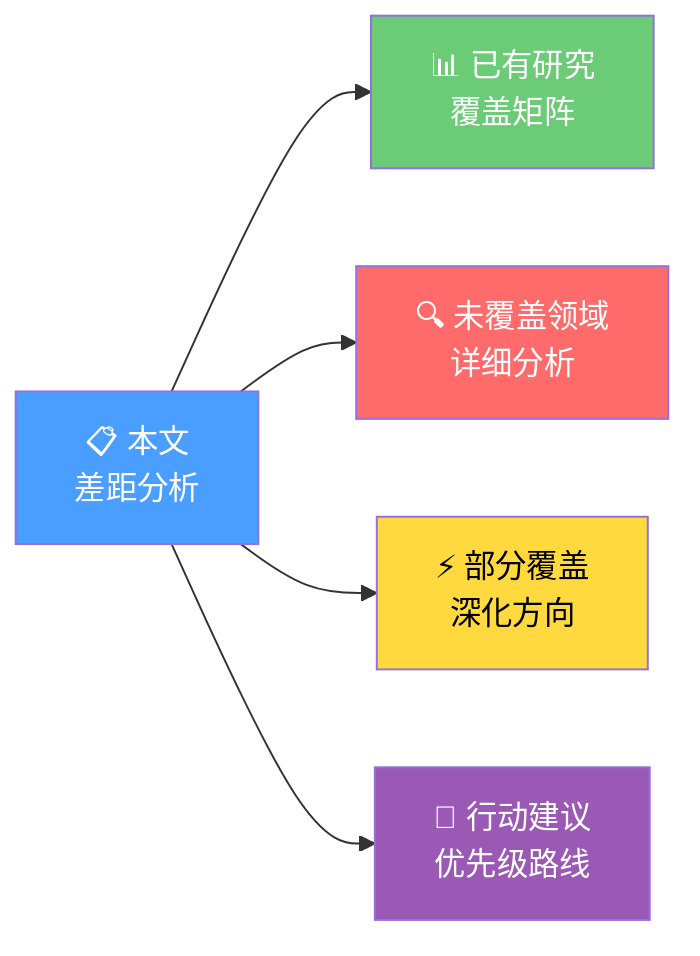
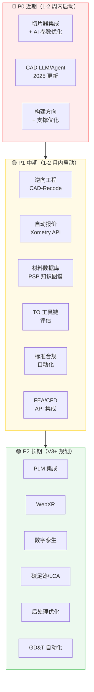

# AI 驱动工业 3D 全流程平台：研究领域差距分析

> [!abstract] 摘要
> 基于 CADPilot 已有 ==15 篇研究文档 + 42 篇规划文档 + 11 个 OpenSpec 变更== 的全面盘点，
> 对照 AI 驱动工业 3D 设计/后处理全流程平台所需的 ==12 大技术领域、35+ 细分方向== 进行差距分析。
> 识别出 **13 个未覆盖领域** 和 **5 个部分覆盖需深化领域**，并按优先级排序。

---

## 文档导航

> [!tip] 阅读指南
> - 先看 [[#1. 已有研究覆盖矩阵]]，了解现有资产
> - 重点看 [[#2. 未覆盖领域详细分析]]，识别关键空白
> - 最后看 [[#4. 行动建议与优先级路线]]，决定下一步

---

## 1. 已有研究覆盖矩阵

> [!done] CADPilot 已完成深度研究的 7 大技术方向

| 领域 | 已有文档 | 覆盖深度 | 状态 |
|------|---------|:--------:|:----:|
| 3D/CAD 生成模型 | [[3d-cad-generation\|3d-cad-generation.md]] | ★★★★★ | 充分 |
| 网格处理与 AI 修复 | [[mesh-processing-repair\|mesh-processing-repair.md]] | ★★★★★ | 充分 |
| 缺陷检测与过程监控 | [[defect-detection-monitoring\|defect-detection-monitoring.md]] | ★★★★☆ | 充分 |
| 代理模型替代 FEM 仿真 | [[surrogate-models-simulation\|surrogate-models-simulation.md]] | ★★★★★ | 充分 |
| GNN 拓扑优化 | [[gnn-topology-optimization\|gnn-topology-optimization.md]] | ★★★★☆ | 充分 |
| 强化学习工艺控制 | [[reinforcement-learning-am\|reinforcement-learning-am.md]] | ★★★★☆ | 充分 |
| 微观结构生成与逆设计 | [[generative-microstructure\|generative-microstructure.md]] | ★★★★☆ | 充分 |

> [!done] 已完成的横向研究与支撑文档

| 领域 | 已有文档 | 覆盖深度 |
|------|---------|:--------:|
| AM 数据集全景 | [[am-datasets-catalog\|am-datasets-catalog.md]] | ★★★★★ |
| 实用工具与框架评估 | [[practical-tools-frameworks\|practical-tools-frameworks.md]] | ★★★★☆ |
| HuggingFace 模型/数据集 | [[huggingface-models\|huggingface-models.md]]、[[huggingface-datasets\|huggingface-datasets.md]] | ★★★★☆ |
| 集成可行性评估 | [[implementation-feasibility\|implementation-feasibility.md]] | ★★★★★ |
| AI 技术集成路线图 | [[roadmap\|roadmap.md]] | ★★★★☆ |
| AM 工艺能力分析 | [[am-process-capabilities-analysis\|am-process-capabilities-analysis.md]] | ★★★☆☆ |
| Web 3D 编辑可行性 | [[web-3d-editing-feasibility/README\|web-3d-editing-feasibility/]] | ★★★★★ |

> [!info] 覆盖统计
> - 研究文档：15 篇（含 Web 3D 编辑子目录 4 篇）
> - 规划文档：42+ 篇（V2/V3/商业化/里程碑等）
> - OpenSpec 变更：11 个活跃 + 3 个已归档
> - 战略文档：9 篇（ai-3d-printing-strategy/）
> - 端到端架构：12 篇（end-to-end-architecture/）

---

## 2. 未覆盖领域详细分析

> [!failure] 以下 13 个领域在现有文档体系中 ==完全缺失==，需要新建研究

### 2.1 仿真与分析集成

> [!danger] 差距等级：高
> 代理模型研究（PhysicsNeMo）已有，但==传统 FEA/CFD 工具集成方案完全缺失==。

#### 2.1.1 云端/浏览器 FEA 集成

| 维度 | 内容 |
|------|------|
| **缺什么** | 如何将 FEA 验证嵌入 CADPilot 设计循环 |
| **为什么重要** | 3D 打印零件的应力/变形验证是工业级必备功能 |
| **关键技术** | SimScale API（云端 FEA）、FEniCS（开源 PDE 求解）、CalculiX（结构/热） |
| **推荐方案** | 短期 API 集成 SimScale；中期基于 PhysicsNeMo 构建 AI 代理模型 |
| **研究工作量** | 1-2 周调研 + PoC |

#### 2.1.2 CFD 流体仿真

| 维度 | 内容 |
|------|------|
| **缺什么** | 冷却水道/流道设计的仿真验证方案 |
| **为什么重要** | 金属 AM 零件的内部冷却通道是独特优势，需要 CFD 验证 |
| **关键技术** | OpenFOAM（开源 CFD）、SU2（气动优化）、SimScale GPU LBM |
| **推荐方案** | SimScale API 集成，长期自建轻量 CFD |
| **研究工作量** | 1 周调研 |

#### 2.1.3 3D 打印热仿真

| 维度 | 内容 |
|------|------|
| **缺什么** | 金属 AM 过程的热变形预测与残余应力分析 |
| **为什么重要** | PIDeepONet-RNN 模型已实现 z 轴误差 0.0261mm 的实时预测 |
| **关键技术** | NVIDIA PhysicsNeMo（已有研究基础）、Tesseract（可微分仿真） |
| **推荐方案** | 基于已有 PhysicsNeMo 研究，扩展到 AM 热变形场景 |
| **研究工作量** | 1 周（已有基础，聚焦 AM 场景） |

---

### 2.2 制造工艺规划

> [!danger] 差距等级：==极高==
> 这是从"设计"到"制造"最关键的桥梁，==几乎完全空白==。

#### 2.2.1 切片器集成与 AI 参数优化

| 维度 | 内容 |
|------|------|
| **缺什么** | 切片器选型、集成方案、AI 驱动参数优化 |
| **当前状态** | `slice_to_gcode` 节点已设计（Phase 2），但无底层技术调研 |
| **关键技术** | PrusaSlicer/OrcaSlicer（FDM 开源）、CuraEngine（开源引擎）、Aibuild（AI 五轴） |
| **AI 方向** | 动态层厚、实时参数预测、多轴无支撑切片 |
| **研究工作量** | ==2-3 周==（对标 Cura/PrusaSlicer API + AI 参数优化方案） |

#### 2.2.2 构建方向优化

| 维度 | 内容 |
|------|------|
| **缺什么** | 最优打印方向的自动计算（支撑最少 + 表面质量最优 + 时间最短） |
| **为什么重要** | 方向选择直接影响支撑用量（成本 10-15%）、表面质量、力学性能 |
| **关键技术** | NSGA-II/III 多目标优化 + FEA 约束、CNN 分类器、RL 方向探索 |
| **研究工作量** | 1-2 周 |

#### 2.2.3 支撑结构智能生成

| 维度 | 内容 |
|------|------|
| **缺什么** | AI 驱动的最小支撑生成策略 |
| **为什么重要** | 支撑去除增加 10-15% 成本，影响表面质量 |
| **关键技术** | GAN/扩散模型生成支撑拓扑、RL 最小支撑策略、Aibuild 无支撑多轴 |
| **研究工作量** | 1-2 周 |

#### 2.2.4 嵌套/装箱优化

| 维度 | 内容 |
|------|------|
| **缺什么** | 构建腔内零件排列优化（SLS/金属 AM 批量打印） |
| **关键技术** | AI 装箱 + 蒙特卡罗模拟、CoreTechnologie AI 嵌套、Materialise Magics |
| **研究工作量** | 1 周 |

---

### 2.3 材料与工艺数据库

> [!warning] 差距等级：高
> 材料选择是 3D 打印设计的==第一步决策==，目前完全缺失。

#### 2.3.1 AM 材料性能数据库

| 维度 | 内容 |
|------|------|
| **缺什么** | 材料-工艺-性能关系（PSP）知识库、材料推荐系统 |
| **为什么重要** | 同一材料在不同机器/参数下性能差异显著；ML 预测替代高通量实验 |
| **关键数据库** | Materials Project（15 万种）、NIST MIDAS（AM 专属）、Citrine（AI 平台） |
| **AI 方向** | PSP 预测模型、GNN 微观结构-性能关系、知识图谱 |
| **研究工作量** | ==2 周==（数据库对比 + 知识图谱设计） |

---

### 2.4 逆向工程

> [!warning] 差距等级：高
> 从实物到可编辑 CAD 是重要的==输入扩展通道==。

#### 2.4.1 点云到参数化 CAD 重建

| 维度 | 内容 |
|------|------|
| **缺什么** | 3D 扫描 → 可编辑参数化 CAD 的 AI 管线 |
| **为什么重要** | 旧零件数字化、竞品分析、医疗植入定制 |
| **2025 前沿** | **Point2CAD**（ETH，点云→B-Rep）、==**CAD-Recode**==（ICCV 2025，点云→CadQuery 代码，Chamfer 距离提升 10 倍） |
| **与 CADPilot 契合度** | ==极高== — CAD-Recode 直接输出 CadQuery 代码，与后端内核完全一致 |
| **研究工作量** | ==2-3 周==（复现 CAD-Recode + 集成评估） |

---

### 2.5 成本与供应链

> [!warning] 差距等级：高
> "设计-报价-制造"闭环是==商业化的核心增值点==。

#### 2.5.1 自动报价引擎

| 维度 | 内容 |
|------|------|
| **缺什么** | 基于 CAD 几何特征的即时成本估算 + DFM 反馈 |
| **标杆** | **Xometry**：神经网络定价，秒级返回价格+交期+DFM 反馈，2026 年扩展企业级交期预测 |
| **其他方案** | 3D Spark、Fictiv、CADEX Manufacturing Toolkit |
| **推荐方案** | 短期集成 Xometry API；中期自建特征成本模型 |
| **研究工作量** | 1-2 周（API 集成评估 + 自建模型设计） |

#### 2.5.2 碳足迹与可持续性

| 维度 | 内容 |
|------|------|
| **缺什么** | 制造碳排放量化、AM vs 传统工艺 LCA 对比 |
| **关键工具** | AMPOWER Calculator（金属 AM CO2）、3D Spark（集成报价+碳追踪）、OpenLCA（开源 LCA） |
| **研究工作量** | 1 周 |

---

### 2.6 标准与合规

> [!warning] 差距等级：中高
> 航空/医疗客户的==准入门槛==。

#### 2.6.1 ISO/ASTM AM 标准体系

| 维度 | 内容 |
|------|------|
| **缺什么** | AM 标准合规检查的自动化方案 |
| **核心标准** | ISO/ASTM 52920（工艺资质）、52930（金属 LPBF）、52954（风险分级）、52967:2024（航空分类） |
| **行业 QMS** | 航空 AS9100、医疗 ISO 13485、核能 ASME NQA-1 |
| **研究工作量** | 1-2 周（标准梳理 + 平台合规检查功能设计） |

#### 2.6.2 GD&T 自动化

| 维度 | 内容 |
|------|------|
| **缺什么** | AI 驱动的 GD&T 标注生成/验证 |
| **关键技术** | LLM + 工程图纸理解、ASME Y14.46（AM 专用 GD&T）、PMI 嵌入（STEP AP242） |
| **与 CADPilot 契合度** | 高 — V2 DrawingAnalyzer 已具备工程图理解能力，可扩展 |
| **研究工作量** | 1-2 周 |

---

### 2.7 协作与 PLM

> [!info] 差距等级：中
> 企业级功能，==非核心但长期需要==。

#### 2.7.1 PLM 集成方案

| 维度 | 内容 |
|------|------|
| **缺什么** | 产品生命周期管理、打印批次追溯、数字线程 |
| **关键平台** | Onshape+Arena（PTC 云原生）、OpenPLM（开源）、Odoo Manufacturing |
| **研究工作量** | 1 周（选型评估） |

#### 2.7.2 3D 模型版本控制

| 维度 | 内容 |
|------|------|
| **缺什么** | CAD 文件的分支/合并/版本追溯方案 |
| **方案对比** | Onshape（类 Git 内置）、Git LFS（中小团队）、专用 PDM |
| **研究工作量** | 0.5 周 |

---

### 2.8 AR/VR 与数字孪生

> [!info] 差距等级：中低
> 增值功能，==V3+ 考虑==。

#### 2.8.1 WebXR 设计评审

| 维度 | 内容 |
|------|------|
| **缺什么** | 浏览器内 AR/VR 3D 模型评审方案 |
| **技术基础** | Three.js（已在 V3 前端）+ WebXR Device API，扩展成本低 |
| **研究工作量** | 0.5 周 |

#### 2.8.2 数字孪生（制造监控）

| 维度 | 内容 |
|------|------|
| **缺什么** | 打印设备实时监控、预测维护 |
| **关键平台** | NVIDIA Omniverse（OpenUSD）、Azure Digital Twins |
| **研究工作量** | 1 周 |

---

### 2.9 后处理优化

> [!info] 差距等级：中
> 完整制造链的==最后一环==。

#### 2.9.1 表面精整与热处理仿真

| 维度 | 内容 |
|------|------|
| **缺什么** | 后处理工艺选择与参数优化 |
| **关键工艺** | 激光抛光、电化学抛光、HIP、消应力退火 |
| **AI 方向** | ML 表面粗糙度预测（XGBoost R²=97%）、AI 热处理参数优化 |
| **研究工作量** | 1 周 |

---

## 3. 部分覆盖需深化领域

> [!warning] 以下 5 个领域已有初步研究，但 ==需要补充更新或深化==

### 3.1 CAD 专用 LLM/Agent（需更新）

> [!tip] 已有：[[3d-cad-generation|3d-cad-generation.md]] 覆盖了 CADFusion、Text-to-CadQuery 等
> ==缺失：2025 年爆发的新系统未覆盖==

| 新系统 | 来源 | 突破点 |
|--------|------|--------|
| **CAD-MLLM** | 学术 | ==首个多模态条件参数化 CAD 生成==（文本/图片/点云→指令序列） |
| **CADDesigner** | 学术（2025.08） | Agent 架构 + ECIP 范式 + 迭代视觉反馈 |
| **CAD-Recode** | ICCV 2025 | ==点云→CadQuery 代码==，Chamfer 距离提升 10 倍 |
| **STEP-LLM** | 学术（2026.01） | 自然语言→STEP 直接生成 |
| **EvoCAD** | 学术 | 进化方法重建 CadQuery 代码 |
| **LLMs for CAD 综述** | arXiv 2025.05 | 首个系统性综述，梳理趋势与机会 |

> [!success] 关键发现
> ==CadQuery 被学术界广泛选择优于 OpenSCAD==，原因：
> 1. Python 生态更适合 LLM 代码生成
> 2. CadQuery 的"设计意图"方法对复杂对象更简洁
>
> 这验证了 CADPilot 选择 CadQuery 作为 CAD 内核的技术路线正确性。

**行动**：更新 `3d-cad-generation.md`，补充 2025 年新系统评估

---

### 3.2 拓扑优化工具链（需深化）

> [!tip] 已有：[[gnn-topology-optimization|gnn-topology-optimization.md]] 覆盖了 GNN 方法
> ==缺失：实际可集成的 TO 工具库评估==

| 需补充内容 | 关键工具 |
|-----------|---------|
| 经典 TO 库 | TopOpt（Python SIMP）、DL4TO（PyTorch 3D TO）、JAX-SSO（可微分 FEA） |
| 生成式设计平台 | nTopology（隐式建模+晶格）、Autodesk Fusion GD |
| AI 驱动 TO | GenTO（多样化解生成）、RL-TO（PPO，减重 40%） |
| 晶格结构生成 | L-system、Voronoi 晶格、物理可解释 VAE |
| 多目标优化 | pymoo（NSGA-II/III）、BoTorch（贝叶斯多目标） |

**行动**：新建 `topology-optimization-tools.md`，聚焦可集成工具评估

---

### 3.3 文生 3D 基础模型（需更新）

> [!tip] 已有：[[3d-cad-generation|3d-cad-generation.md]] + TRELLIS/PhysicsNeMo 深研
> ==缺失：TRELLIS.2 和 Autodesk Neural CAD 等 2025 新进展==

| 新进展 | 突破点 |
|--------|--------|
| **TRELLIS.2** | 原生紧凑结构化潜在空间，NIM 加速 20% |
| **Autodesk Neural CAD** | ==文本→可编辑 CAD==，基于设计模式训练的基础模型（AU 2025） |
| **CadVLM** | Autodesk Research，端到端视觉语言模型操作工程草图 |

**行动**：更新 TRELLIS 深研文档，新增 Autodesk Neural CAD 评估

---

### 3.4 可微分 CAD/仿真（新兴方向）

> [!tip] 现有研究未涉及，但与已有代理模型研究有交叉

| 框架 | 特点 |
|------|------|
| **Tesseract-JAX** | 端到端可微分仿真→优化设计变量 |
| **PhiFlow** | PyTorch/TF/JAX 可微分物理仿真 |
| **Taichi** / **NVIDIA Warp** | GPU 加速可微分物理 |

**行动**：在 `surrogate-models-simulation.md` 中追加可微分仿真章节

---

### 3.5 多模态工程图理解（需更新）

> [!tip] 已有：V2 DrawingAnalyzer（qwen-vl-max）
> ==缺失：2025 年专用 VLM 模型评估==

| 新系统 | 特点 |
|--------|------|
| **CadVLM** (Autodesk) | 端到端视觉语言模型，支持草图自动补全/约束/条件生成 |
| **CAD-Coder** (MIT) | 开源 VLM 微调，图像→CadQuery |

**行动**：更新 V2 DrawingAnalyzer 技术报告，评估 CadVLM/CAD-Coder 替代方案

---

## 4. 行动建议与优先级路线

### 4.1 总览：差距热力图

### 4.2 P0 近期行动（==1-2 周内启动==）

> [!danger] 直接影响 V3 管道设计和产品竞争力

| # | 研究课题 | 工作量 | 产出 | 理由 |
|:-:|---------|:------:|------|------|
| 1 | ==切片器集成与 AI 参数优化== | 2-3 周 | 选型报告 + API 集成设计 | `slice_to_gcode` 节点已设计但缺底层技术调研 |
| 2 | CAD 专用 LLM/Agent 2025 更新 | 1 周 | 更新 `3d-cad-generation.md` | CAD-MLLM/CADDesigner/CAD-Recode 等 6 个新系统需评估 |
| 3 | 构建方向 + 支撑结构优化 | 1-2 周 | 算法选型 + 集成方案 | 3D 打印核心功能，直接影响成本和质量 |

### 4.3 P1 中期行动（==1-2 月内启动==）

> [!warning] 差异化功能和商业化核心

| # | 研究课题 | 工作量 | 产出 | 理由 |
|:-:|---------|:------:|------|------|
| 4 | 逆向工程（CAD-Recode 评估） | 2-3 周 | PoC + 集成方案 | 输出 CadQuery 代码，与 CADPilot 内核完美契合 |
| 5 | 自动报价引擎 | 1-2 周 | API 集成方案 + 自建模型设计 | Xometry 已验证市场，商业价值高 |
| 6 | AM 材料性能数据库 | 2 周 | 数据库对比 + 知识图谱设计 | 材料选择是设计第一步决策 |
| 7 | 拓扑优化工具链评估 | 1-2 周 | 工具选型 + 集成 PoC | 轻量化是 AM 核心价值主张 |
| 8 | 标准合规自动化 | 1-2 周 | 标准梳理 + 合规检查设计 | 航空/医疗客户准入要求 |
| 9 | FEA/CFD API 集成 | 1-2 周 | SimScale API 集成方案 | 结构/热验证是工业级必备 |

### 4.4 P2 长期规划（==V3+ 阶段==）

> [!info] 增值功能与生态扩展

| # | 研究课题 | 工作量 | 触发条件 |
|:-:|---------|:------:|---------|
| 10 | PLM 集成 | 1 周 | 企业客户需求明确时 |
| 11 | WebXR 设计评审 | 0.5 周 | Three.js 已在 V3，扩展成本低 |
| 12 | 数字孪生 | 1 周 | 硬件 IoT 集成需求明确时 |
| 13 | 碳足迹/LCA | 1 周 | ESG 合规需求驱动 |
| 14 | 后处理优化 | 1 周 | 制造链完整性需求 |
| 15 | GD&T 自动化 | 1-2 周 | 利用 V2 DrawingAnalyzer 扩展 |

---

### 4.5 资源估算汇总

> [!abstract] 全部研究工作量估算

| 优先级 | 课题数 | 总工作量 | 交付物 |
|:------:|:------:|:--------:|--------|
| P0 | 3 | ==4-6 周== | 3 篇研究文档 + 1 个更新 |
| P1 | 6 | ==8-13 周== | 6 篇研究文档 + 1 个 PoC |
| P2 | 6 | ==5-8 周== | 6 篇研究文档 |
| **合计** | **15** | **17-27 周** | **15 篇文档 + 1 PoC** |

> [!tip] 关键发现
> 1. ==CadQuery 路线已获学术界验证== — 多个 2025 顶会系统选择 CadQuery 作为输出目标
> 2. ==制造工艺规划是最大空白== — 切片/方向/支撑三个子方向均未研究
> 3. ==CAD-Recode 是最高潜力集成目标== — 点云→CadQuery 代码，天然与 CADPilot 兼容
> 4. ==Xometry 模式可快速复用== — API 集成即可实现设计-报价闭环
> 5. ==2025 年是 CAD+LLM 爆发年== — 6 个新系统集中出现，需持续跟踪

---

## 5. 与现有文档的关联

> [!note] 交叉引用

| 本文领域 | 关联的已有文档 |
|---------|---------------|
| 切片器集成 | Phase 2 `slice_to_gcode` 节点设计 |
| CAD LLM 更新 | [[3d-cad-generation\|3d-cad-generation.md]]、V3 IntentParser |
| 构建方向优化 | [[reinforcement-learning-am\|RL 工艺控制]] |
| 逆向工程 | [[mesh-processing-repair\|网格处理]]、Web 3D 编辑 |
| 材料数据库 | [[am-datasets-catalog\|AM 数据集目录]] |
| FEA/CFD | [[surrogate-models-simulation\|代理模型]]、PhysicsNeMo 深研 |
| 拓扑优化工具 | [[gnn-topology-optimization\|GNN TO]] |
| 缺陷检测深化 | [[defect-detection-monitoring\|缺陷检测]] |
| 标准合规 | 产品商业化全栈设计 |

---

> [!quote] 结语
> CADPilot 在 AI 3D 生成的核心管道上已有深厚积累（7 大技术方向 + 15 篇深度研究），
> 但从"设计工具"走向"全流程制造平台"，==制造工艺规划、材料数据库、逆向工程、成本估算== 四个方向是最关键的补全项。
> P0 行动（4-6 周）聚焦在直接影响 V3 管道的切片器、CAD LLM 更新和构建方向优化，
> 可与 V3 管道开发 **并行推进**。
