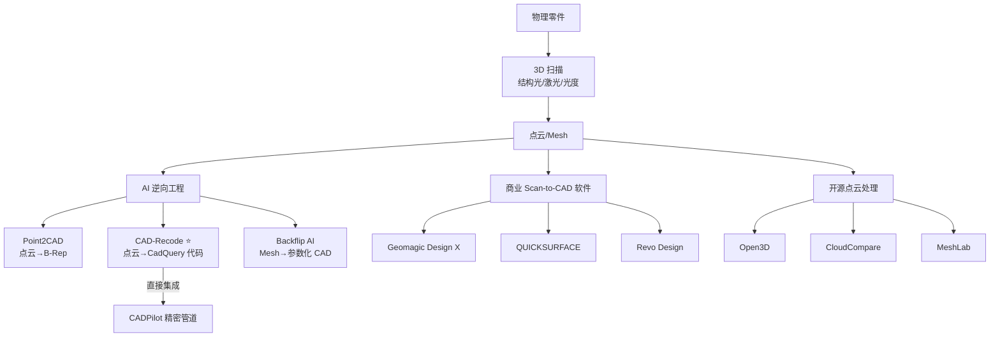
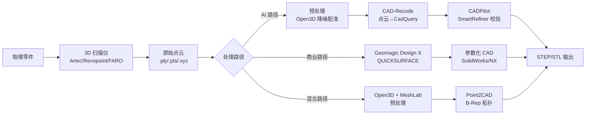

# 逆向工程 / Scan-to-CAD 技术研究

> [!abstract] 核心价值
> 从 3D 扫描点云自动重建参数化 CAD 模型，是连接物理世界与数字设计的关键桥梁。CAD-Recode（ICCV 2025）首次实现==点云→CadQuery 代码==，与 CADPilot 精密管道完美契合，使 Scan-to-CAD 成为可落地的新管线。

---

## 技术路线概览



---

## AI 驱动的逆向工程（深入分析）

### CAD-Recode ⭐ 质量评级: 4/5

> [!success] ==ICCV 2025==——点云→CadQuery 代码，与 CADPilot CadQuery 内核完美契合

| 属性 | 详情 |
|:-----|:-----|
| **会议** | ==ICCV 2025== |
| **论文** | [arXiv:2412.14042](https://arxiv.org/abs/2412.14042) |
| **GitHub** | [filaPro/cad-recode](https://github.com/filaPro/cad-recode) |
| **HuggingFace** | [filapro/cad-recode](https://huggingface.co/filapro/cad-recode)（模型 v1/v1.5 + 数据集） |
| **参数** | 2B（Qwen2-1.5B + 单层线性投影层） |
| **许可** | ==CC-BY-NC 4.0==（非商业） |
| **训练数据** | ==100 万==程序化生成 CadQuery sketch-extrude 序列 |
| **安装难度** | ★★★☆☆（Docker 推荐，5 分钟启动） |

#### 架构深度分析

```
3D 点云（x, y, z 坐标集合）
  │
  ├─ 线性投影层（Point Encoder）
  │   将点云特征映射到 LLM token 空间
  │
  ├─ Qwen2-1.5B（保持原始 tokenizer）
  │   自回归生成 CadQuery Python 代码
  │
  └─ CadQuery 执行引擎
      → STEP / STL / OBJ 文件
```

**训练数据的独特优势**：
- 100 万规模程序化生成，比 DeepCAD（160K）丰富 ==6x==
- 数据分布偏向更复杂模型（更多边/面），泛化性更好
- 包含 v1 和 v1.5 两个版本，v1.5 进一步改进

#### 性能基准

| 基准数据集 | 指标 | 性能 |
|:-----------|:-----|:-----|
| DeepCAD | Chamfer Distance ↓ | 改善 ==10x==（SOTA） |
| Fusion360 Gallery | 综合精度 | ==SOTA== |
| CC3D | 综合精度 | ==SOTA== |

#### CADPilot 集成方案

```
物理零件
  → 3D 扫描（Artec/Revopoint/FARO）
    → 点云预处理（Open3D 降噪/配准）
      → CAD-Recode 推理
        → CadQuery Python 代码
          → CADPilot generate_node 执行
            → SmartRefiner 质量校验
              → STEP/STL 输出
```

> [!warning] 集成注意事项
> - CC-BY-NC 许可==限制商业使用==，生产环境需考虑自训练方案
> - 当前仅支持 sketch-extrude 操作，不含 revolve/loft/sweep
> - 实际扫描点云（含噪声）vs 合成点云（干净）可能有精度差距

#### 部署指南

```bash
# 方式 1: Docker（推荐，5 分钟）
docker run -it --rm --gpus "device=0" \
  -v .:/work/cad-recode \
  filapro/cad-recode:latest \
  python inference.py --input <point_cloud.npy>

# 方式 2: 源码安装
git clone https://github.com/filaPro/cad-recode.git && cd cad-recode
# 按 Dockerfile 安装依赖
pip install -r requirements.txt

# 下载预训练模型
# v1: huggingface.co/filapro/cad-recode
# v1.5: huggingface.co/filapro/cad-recode-v1.5
```

---

### Point2CAD ⭐ 质量评级: 3.5/5

> [!info] ==CVPR 2024==——ETH Zurich，点云→B-Rep 拓扑重建

| 属性 | 详情 |
|:-----|:-----|
| **会议** | ==CVPR 2024== |
| **论文** | [arXiv:2312.04962](https://arxiv.org/abs/2312.04962) |
| **GitHub** | [prs-eth/point2cad](https://github.com/prs-eth/point2cad) |
| **机构** | ETH Zurich + University of Zurich |
| **许可** | ==CC-BY-NC 4.0==（非商业） |
| **安装难度** | ★★★★☆（PyMesh 原生依赖复杂，推荐 Docker） |
| **方法** | 混合解析-神经网络方法 |

#### 五阶段模块化管线

```
3D 点云 (x, y, z, surface_id)
  │
  ├─ Stage 1: 点云标注（ParseNet/HPNet）
  │   每个点分配表面簇标签
  │
  ├─ Stage 2: 表面拟合
  │   每个簇 → 几何基元或参数化曲面
  │   使用 geomfitty 库 + 神经表征
  │
  ├─ Stage 3: 表面扩展与求交
  │   解析表面延展 → 计算交线
  │
  ├─ Stage 4: 拓扑推断
  │   从交线推断边-面拓扑关系
  │
  └─ Stage 5: 表面裁剪
      按拓扑关系裁剪 → B-Rep 输出
```

**输出三种结果**：
- `unclipped`：初始拟合表面
- `clipped`：裁剪后表面
- `topo`：完整拓扑（边、角、面关系）

#### 与 CAD-Recode 对比

| 维度 | Point2CAD | CAD-Recode |
|:-----|:----------|:-----------|
| **输出格式** | B-Rep（面/边/角拓扑） | ==CadQuery 代码==（可编辑） |
| **方法** | 混合解析-神经网络 | 端到端 LLM 生成 |
| **可编辑性** | 低（B-Rep 难以参数化编辑） | ==高（Python 代码可直接修改）== |
| **拓扑质量** | 高（显式拓扑推断） | 中（隐式 sketch-extrude） |
| **CADPilot 兼容** | 低（需转换） | ==高（原生 CadQuery）== |
| **训练数据** | ParseNet/HPNet 预训练 | 100 万 CadQuery 序列 |

> [!tip] CADPilot 价值
> Point2CAD 的 B-Rep 输出精度更高（显式拓扑），但==不可编辑==。对 CADPilot 而言，CAD-Recode 的 CadQuery 代码输出更有价值。可考虑混合方案：Point2CAD 做拓扑验证 + CAD-Recode 做代码生成。

---

### Backflip AI 质量评级: 3.5/5

> [!info] 商业 AI Scan-to-CAD——一键生成参数化 CAD 特征树

| 属性 | 详情 |
|:-----|:-----|
| **公司** | Backflip AI |
| **主页** | [backflip.ai](https://www.backflip.ai/) |
| **训练数据** | ==1 亿+== 合成 3D 几何体（号称全球最大） |
| **许可** | ==商业==（Beta 阶段） |
| **输出** | 参数化 CAD（Onshape 原生 / STEP 导出） |
| **集成** | SolidWorks 插件、Web App |

#### 核心能力

```
3D 扫描 Mesh
  → Backflip AI 云端 GPU 处理
    → 生成 4 个参数化变体
      → 用户选择最优方案
        → 自动在 CAD 软件中构建特征树
          （sketch → extrude → revolve → fillet...）
```

**关键指标**：
- 训练效率比同类 ==60x==
- 推理速度比同类 ==10x==
- 空间分辨率比同类 ==100x==

> [!warning] 局限
> - 商业闭源，Beta 阶段定价未公布
> - 云端处理依赖网络连接
> - 不输出 CadQuery 代码（输出 Onshape/STEP）

---

## 商业 Scan-to-CAD 软件

### Geomagic Design X ⭐ 质量评级: 4.5/5

> [!success] 行业标准 Scan-to-CAD 软件——Hexagon 旗下

| 属性 | 详情 |
|:-----|:-----|
| **厂商** | Hexagon（原 3D Systems） |
| **许可** | 商业（Go/Plus/Pro 三个版本） |
| **功能** | 点云/Mesh → 基于历史的参数化 CAD |
| **CAD 集成** | LiveTransfer™ 到 SolidWorks/NX/Creo/CATIA |
| **速度** | 比传统方法快 ==3-10x== |
| **获奖** | 行业公认 #1 逆向工程软件 |

**核心能力**：
- 导入 Mesh/点云/中性 CAD/扫描文件
- 自动特征识别（平面/圆柱/锥面/球面）
- 有机曲面自动拟合（自由曲面 NURBS）
- 实时偏差分析（扫描 vs CAD 对比）
- LiveTransfer™ 设计历史直接传输到目标 CAD

> [!tip] CADPilot 关联
> Geomagic Design X 是 CADPilot Scan-to-CAD 管线的参考标准。AI 方案（CAD-Recode）的精度目标应以 Design X 为基准。

---

### QUICKSURFACE 质量评级: 3.5/5

> [!info] ==2025 年度最佳 Scan-to-CAD 方案==——SME News 评选

| 属性 | 详情 |
|:-----|:-----|
| **厂商** | QUICKSURFACE |
| **版本** | Lite / Pro / SolidWorks 插件 |
| **许可** | 商业（永久 / 订阅，30 天试用） |
| **功能** | Mesh/点云 → 参数化/曲面 CAD |
| **AI 功能** | ==AI 自动曲面拟合==（Pro 版） |
| **获奖** | SME News "Best 3D Scan-to-CAD Solution 2025" |

**Pro 版核心操作**：
- 自动分割 + AI 曲面拟合
- Loft/Sweep/Extrude/Revolve
- 可变圆角/倒角
- 布尔运算 + 混合建模
- 实时偏差分析器
- 2026 新增：圆角检测重建、变半径圆角、壳体/空腔

---

### Revo Design 质量评级: 3/5

| 属性 | 详情 |
|:-----|:-----|
| **厂商** | Revopoint |
| **功能** | Revopoint 扫描仪 → 逆向工程 |
| **特点** | 与 Revopoint 硬件无缝集成 |
| **生态** | Revo Scan → Revo Design → Revo Measure |

---

## 3D 扫描硬件

### 硬件对比

| 设备 | 厂商 | 精度 | 扫描速度 | 价格区间 | 适用场景 |
|:-----|:-----|:-----|:---------|:---------|:---------|
| **Artec Leo** | Artec 3D | ==0.1mm== | 高（无线） | $$$$ | 中大型零件，无需连线 |
| **Artec Eva** | Artec 3D | 0.1mm | 1800 万点/秒 | $$$ | 中型零件，全色 3D |
| **MIRACO** | Revopoint | 0.05mm | 高 | $$ | 消费级高精度 |
| **FARO 系列** | FARO | <0.05mm | 高 | $$$$$ | 大型环境/工厂 |

### 扫描到 CAD 工作流



---

## NeRF/3DGS 在工业检测中的应用

> [!info] 新兴方向——从图片集重建 3D 模型，替代传统扫描

| 技术 | 优势 | 挑战 | 工业应用成熟度 |
|:-----|:-----|:-----|:-------------|
| **NeRF** | 高精度重建，少量图片输入 | 计算资源密集，实时性差 | ★★☆☆☆ |
| **3DGS** | ==快速渲染==，接近实时 | 薄表面和精细几何细节困难 | ★★☆☆☆ |
| **混合方案** | 结合两者优势 | 研究阶段 | ★☆☆☆☆ |

### 工业应用场景

1. **虚拟设施巡检**：NeRF 从少量图片重建工厂环境 3D 模型
2. **质量检测**：3DGS 重建→与 CAD 设计模型偏差分析
3. **数字孪生**：实时 3D 场景重建用于制造监控

> [!warning] 当前局限
> - NeRF/3DGS 生成的是==视觉级 mesh==，非参数化 CAD（不可编辑）
> - 工业零件的精细特征（螺纹、小孔、锐边）重建精度不足
> - 需要结合传统 3D 扫描获取高精度几何数据
> - 对 CADPilot 短期价值有限，==建议长期跟踪==

---

## 开源点云处理工具

### Open3D ⭐ 质量评级: 4.5/5

| 属性 | 详情 |
|:-----|:-----|
| **GitHub** | [isl-org/Open3D](https://github.com/isl-org/Open3D) |
| **许可** | ==MIT== |
| **语言** | Python + C++ 前端 |
| **功能** | 点云处理、3D 重建、可视化 |
| **特点** | GPU 加速、张量后端 |

**CADPilot 集成价值**：
- 点云降噪（statistical/radius outlier removal）
- 点云配准（ICP、Global Registration）
- 法线估计（用于 CAD-Recode 输入预处理）
- 可视化（点云/mesh 渲染）

### CloudCompare ⭐ 质量评级: 4/5

| 属性 | 详情 |
|:-----|:-----|
| **主页** | [danielgm.net/cc](https://www.danielgm.net/cc/) |
| **许可** | ==GPL v2== |
| **功能** | 点云编辑、配准、分割、距离计算、统计分析 |
| **特点** | 处理海量数据集（亿级点） |
| **开发者** | Daniel Girardeau-Montaut（原 EDF R&D） |

### MeshLab 质量评级: 3.5/5

| 属性 | 详情 |
|:-----|:-----|
| **主页** | [meshlab.net](https://www.meshlab.net/) |
| **许可** | ==GPL v3== |
| **最新版** | 2025.07（ARM64 支持 + 3MF 格式） |
| **功能** | Mesh 编辑、清理、修复、渲染、纹理、转换 |
| **Python** | PyMeshLab 接口 |

---

## 综合对比表

| 方案 | 类型 | 输出格式 | 许可 | 精度 | 可编辑性 | CADPilot 兼容 | 评级 |
|:-----|:-----|:---------|:-----|:-----|:---------|:-------------|:-----|
| **CAD-Recode** | AI 学术 | ==CadQuery 代码== | CC-BY-NC | SOTA | ==极高== | ==极高== | 4.0★ |
| **Point2CAD** | AI 学术 | B-Rep | CC-BY-NC | 高 | 低 | 中 | 3.5★ |
| **Backflip AI** | AI 商业 | STEP/Onshape | 商业 | 高 | 高 | 低 | 3.5★ |
| **Geomagic Design X** | 商业 | 原生 CAD | 商业 | ==极高== | ==极高== | 低（需转换） | 4.5★ |
| **QUICKSURFACE** | 商业 | CAD/STEP | 商业 | 高 | 高 | 低 | 3.5★ |
| **Open3D** | 开源工具 | 点云/Mesh | MIT | N/A | N/A | ==高（预处理）== | 4.5★ |

---

## CADPilot Scan-to-CAD 管线设计建议

> [!success] 推荐优先级

### 短期（P1，1-3 月）

1. **基于 CAD-Recode 构建 PoC**
   - Open3D 预处理 → CAD-Recode 推理 → CadQuery 代码
   - 直接对接 CADPilot `generate_node` + `SmartRefiner`
   - 注意 CC-BY-NC 许可限制

2. **集成 Open3D 作为点云预处理工具**
   - `uv add open3d` 一行安装
   - 降噪、配准、法线估计标准管线

### 中期（P2，3-6 月）

3. **自训练 CadQuery 逆向工程模型**
   - 使用 CAD-Recode 100 万数据集（或自生成）
   - 基于 Qwen2 系列微调，规避 CC-BY-NC 限制
   - 扩展操作支持（revolve/loft/sweep）

4. **评估 Point2CAD B-Rep 输出作为辅助验证**
   - B-Rep 拓扑验证 + CadQuery 代码生成双轨方案

### 长期（6+ 月）

5. **跟踪 Backflip AI 的参数化 CAD 重建方案**
6. **NeRF/3DGS 在工业检测场景的成熟度**
7. **QUICKSURFACE AI 功能的开放 API 可能性**

> [!warning] 核心挑战
> 1. ==许可问题==：CAD-Recode 和 Point2CAD 均为 CC-BY-NC，商业使用需自训练
> 2. ==操作覆盖==：当前 AI 方案仅支持 sketch-extrude，CADPilot 需要 revolve/loft/sweep
> 3. ==真实扫描 vs 合成数据==：模型在干净合成数据上训练，真实扫描含噪声/遮挡
> 4. ==硬件成本==：工业级 3D 扫描仪价格不菲（Artec Leo ~¥25 万）

---

## 参考文献

1. CAD-Recode: Reverse Engineering CAD Code from Point Clouds. ICCV 2025. [arXiv:2412.14042](https://arxiv.org/abs/2412.14042).
2. Point2CAD: Reverse Engineering CAD Models from 3D Point Clouds. CVPR 2024. [arXiv:2312.04962](https://arxiv.org/abs/2312.04962).
3. Geomagic Design X. Hexagon. [hexagon.com/products/geomagic-design-x](https://hexagon.com/products/geomagic-design-x).
4. QUICKSURFACE: From 3D Scan to CAD. [quicksurface.com](https://www.quicksurface.com/).
5. Backflip AI: 3D Generative AI for Scan-to-CAD. [backflip.ai](https://www.backflip.ai/).
6. Open3D: A Modern Library for 3D Data Processing. [open3d.org](http://www.open3d.org/).
7. 3D Reconstruction and Precision Evaluation of Industrial Components via Gaussian Splatting. Computers & Graphics, 2025.
8. Neural Radiance Fields in the Industrial and Robotics Domain. Robotics and CIM, 2024.

---

## 更新日志

| 日期 | 变更 |
|:-----|:-----|
| 2026-03-03 | 初始版本：CAD-Recode 深度分析（ICCV 2025）、Point2CAD（CVPR 2024）、Backflip AI、Geomagic Design X、QUICKSURFACE、Revo Design、3D 扫描硬件对比、NeRF/3DGS 工业应用、Open3D/CloudCompare/MeshLab 工具链、CADPilot 管线设计建议 |
