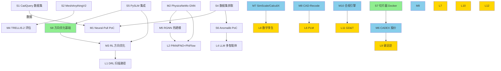
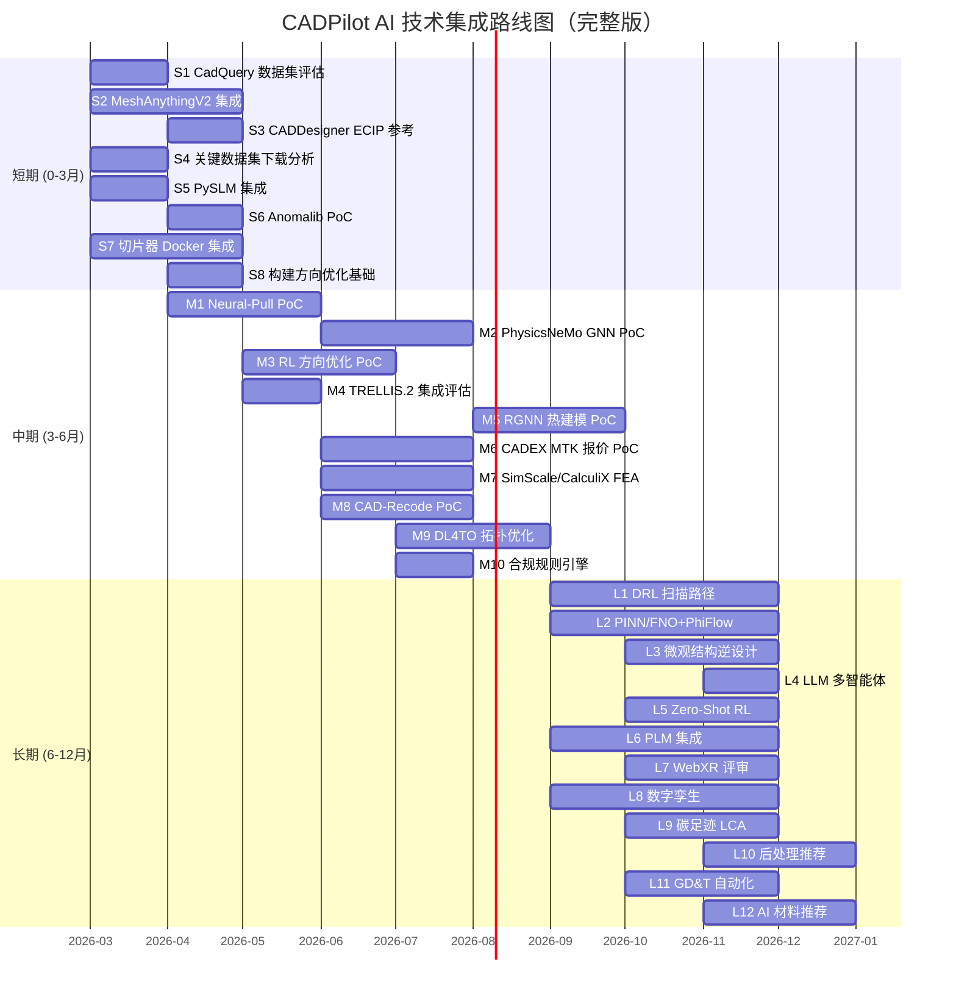

# CADPilot AI 技术集成路线图

> [!abstract] 定位
> 基于技术图谱全部 ==20+ 方向 deep-analysis== 完成，为 CADPilot 项目制定 AI 技术集成的短/中/长期路线图。每项行动标注优先级、依赖、预期收益和风险。
>
> 部分路线图条目经过深入研究后已产出==详细实施计划==（Action Plan），包含代码级变更清单、验收标准和 Gantt 图，可直接作为开发输入。

> [!tip] 可行性评估
> 结合项目代码现状的==落地可行性评估==已独立成文 → 详见 [[implementation-feasibility]]

---

## 详细实施计划索引

> [!success] 以下路线图条目已完成深入研究，产出了可直接用于开发的实施计划。

| 实施计划                                          | 覆盖路线图条目                                                                              | 研究来源                            | 行数  |
| :-------------------------------------------- | :----------------------------------------------------------------------------------- | :------------------------------ | :-: |
| [[action-plan-generation-pipeline\|生成管线实施计划]] | S1、S3（Phase 1 ECIP）；~~M4~~（Phase 2，已被下方取代）；S3（Phase 3 SmartRefiner）；M8（Phase 4 逆向工程） | [[3d-cad-generation]]           | 452 |
| [[action-plan-organic-pipeline\|有机管道升级实施计划]]  | ==M4==（完全取代）；新增 text_to_image_node、mesh_repair 条件触发                                  | [[image-text-to-3d-generation]] | 600 |

> [!important] M4 状态变更
> 原 M4「TRELLIS.2 集成评估」已通过 [[action-plan-organic-pipeline]] 完成深入研究并做出确定性决策：
> - ==淘汰 Tripo3D/SPAR3D==，保留 TRELLIS.2（默认）+ Hunyuan3D-2.1 + TripoSG
> - ==Replicate 统一 API==，去掉自动 fallback
> - 新增 `text_to_image_node`（两步法），`mesh_repair` 条件触发
> - M4 从「中期评估」升级为「短期实施」

---

## 短期（0-3 月）：可直接集成

> [!tip] 目标：利用现有开源资产提升核心管线能力

### S1. 评估 CadQuery 数据集微调 Code Generator 📋

| 属性 | 详情 |
|:-----|:-----|
| **优先级** | ==P0== |
| **行动** | 下载 [[huggingface-datasets#ThomasTheMaker/cadquery\|ThomasTheMaker/cadquery]]（147K 条），分析数据质量、覆盖零件类型、CadQuery API 版本兼容性 |
| **预期收益** | 提升 `generate_cadquery` 对工业零件的代码生成准确率 |
| **风险** | 数据质量不均、CadQuery API 版本差异 |
| **依赖** | 无 |
| **参考** | [[3d-cad-generation#Text-to-CadQuery]] |
| ==**实施计划**== | → [[action-plan-generation-pipeline#Phase 1：ECIP Prompt 重构（精密管道）\|Phase 1 ECIP]]（数据辅助） |

### S2. 集成 MeshAnythingV2 到 mesh 后处理

| 属性 | 详情 |
|:-----|:-----|
| **优先级** | ==P0== |
| **行动** | 在 `generate_raw_mesh` 节点内部加入 MeshAnythingV2 后处理步骤 |
| **预期收益** | 将生成 mesh 从数万面降至 <1600 面 artist-quality |
| **许可** | MIT（可商用） |
| **依赖** | GPU 推理环境 |
| **参考** | [[mesh-processing-repair#MeshAnythingV2]] |

### S3. 参考 CADFusion/CADDesigner 反馈机制 📋

| 属性 | 详情 |
|:-----|:-----|
| **优先级** | P1 |
| **行动** | 研究 CADFusion VLM 反馈 + ==CADDesigner ECIP 范式==（迭代视觉反馈），评估增强 SmartRefiner |
| **预期收益** | 提升 SmartRefiner 修复闭环质量；ECIP 是 P0 优化方向 |
| **参考** | [[3d-cad-generation#CADFusion]]、[[3d-cad-generation#CADDesigner]] |
| ==**实施计划**== | → [[action-plan-generation-pipeline#Phase 1：ECIP Prompt 重构（精密管道）\|Phase 1 ECIP]]（2.7x 首次通过率）+ [[action-plan-generation-pipeline#Phase 3：多候选 + VLM 量化评分（SmartRefiner 增强）\|Phase 3 SmartRefiner]] |

### S4. 下载并分析关键数据集

| 属性 | 详情 |
|:-----|:-----|
| **优先级** | P1 |
| **行动** | 下载并评估关键数据集（详见 [[am-datasets-catalog]]） |
| **数据集** | Thingi10K、3D-ADAM（14K 扫描）、Melt-Pool-Kinetics（48.6GB）、MICRO2D（87K）、NIST AM-Bench 2025 |
| **预期收益** | 建立测试基准和数据资产 |

### S5. ==集成 PySLM 到 V3 管线==

| 属性 | 详情 |
|:-----|:-----|
| **优先级** | ==P1== |
| **行动** | `pip install PythonSLM`，集成到 `slice_to_gcode` + `generate_supports` + `orientation_optimizer` |
| **预期收益** | 一个库覆盖三个管线节点基础能力 |
| **许可** | LGPL-2.1 |
| **参考** | [[reinforcement-learning-am#PySLM]]、[[practical-tools-frameworks#PySLM]] |

### S6. ==Anomalib 缺陷检测 PoC==

| 属性 | 详情 |
|:-----|:-----|
| **优先级** | P1 |
| **行动** | `pip install anomalib`，用 PatchCore 在 3D-ADAM 上建立 baseline |
| **预期收益** | ==零标注==快速启动缺陷检测 PoC |
| **许可** | Apache 2.0 |
| **参考** | [[defect-detection-monitoring#Anomalib v2.2]] |

### S7. ==切片器 Docker 集成== ⭐ 新增

| 属性 | 详情 |
|:-----|:-----|
| **优先级** | ==P0== |
| **行动** | OrcaSlicer CLI Docker 容器化（隔离 AGPL 许可），集成到 `slice_to_gcode` 节点 |
| **预期收益** | 生产级切片能力（FDM），保护 CADPilot 许可证清洁 |
| **风险** | ==AGPL 许可传染性==，必须 Docker 隔离 |
| **参考** | [[slicer-integration-ai-params]] |

### S8. ==构建方向优化基础== ⭐ 新增

| 属性 | 详情 |
|:-----|:-----|
| **优先级** | P1 |
| **行动** | PySLM 悬垂分析 + pymoo NSGA-II 多目标优化（支撑体积 + 表面质量 + 构建时间） |
| **预期收益** | `orientation_optimizer` 从单目标升级为多目标优化 |
| **依赖** | S5 PySLM 集成 |
| **参考** | [[build-orientation-support-optimization]] |

---

## 中期（3-6 月）：PoC 验证

> [!info] 目标：验证关键技术方向的可行性

### M1. Neural-Pull 作为 mesh_healer AI Fallback

| 属性 | 详情 |
|:-----|:-----|
| **优先级** | ==P0== |
| **行动** | 部署 Neural-Pull（MIT），在 Thingi10K 上验证水密化修复效果 |
| **预期收益** | 解决 `mesh_healer` 传统算法 OOM 时的 AI 兜底 |
| **依赖** | GPU、S4 数据 |
| **参考** | [[mesh-processing-repair#Neural-Pull]] |

### M2. PhysicsNeMo GNN 可打印性检查 PoC

| 属性 | 详情 |
|:-----|:-----|
| **优先级** | P1 |
| **行动** | 基于 PhysicsNeMo（Apache 2.0），训练变形预测 GNN |
| **预期收益** | 秒级可打印性评估 |
| **依赖** | GPU、FEM 仿真数据 |
| **参考** | [[surrogate-models-simulation]]、[[gnn-topology-optimization]] |

### M3. RL 方向优化 PoC

| 属性 | 详情 |
|:-----|:-----|
| **优先级** | P2 |
| **行动** | Learn to Rotate 方法 + PySLM 奖励函数 |
| **依赖** | S5、S8 |
| **参考** | [[reinforcement-learning-am]]、[[build-orientation-support-optimization]] |

### ~~M4. TRELLIS.2 集成评估~~ → 有机管道升级（已决策）📋

> [!success] 本条目已完成深入研究，升级为确定性实施计划

| 属性 | 详情 |
|:-----|:-----|
| **优先级** | ==P0==（从 P1 提升） |
| **行动** | ==淘汰 Tripo3D/SPAR3D==，实施 TRELLIS.2（默认）+ Hunyuan3D-2.1 + TripoSG 三模型架构；Replicate 统一 API；新增 `text_to_image_node` 两步法；`mesh_repair` 条件触发 |
| **预期收益** | 有机管道 Mesh 质量跃升（成功率 90-95%），去掉黑盒 SaaS 依赖 |
| **参考** | [[image-text-to-3d-generation]]、[[3d-cad-generation#TRELLIS]] |
| ==**实施计划**== | → [[action-plan-organic-pipeline]]（600 行，4 阶段，14 文件变更清单） |

### M5. ==RGNN 几何无关热建模 PoC==

| 属性 | 详情 |
|:-----|:-----|
| **优先级** | P2 |
| **行动** | RGNN（405x 加速）用于 `thermal_simulation` |
| **依赖** | M2 的 PhysicsNeMo 经验 |
| **参考** | [[gnn-topology-optimization]] |

### M6. ==CADEX MTK 自动报价 PoC== ⭐ 新增

| 属性 | 详情 |
|:-----|:-----|
| **优先级** | P1 |
| **行动** | 集成 CADEX MTK Python SDK（特征识别+DFM），构建规则引擎报价 baseline |
| **预期收益** | 零件自动报价能力（几何特征→成本估算+可制造性反馈） |
| **许可** | 免版税商用 |
| **参考** | [[automated-quoting-engine]] |

### M7. ==SimScale API + CalculiX FEA 集成== ⭐ 新增

| 属性 | 详情 |
|:-----|:-----|
| **优先级** | P1 |
| **行动** | SimScale REST API 集成（云端 FEA/CFD）+ CalculiX 本地 fallback |
| **预期收益** | CADPilot 获得 FEA 仿真能力，无需自建求解器 |
| **参考** | [[fea-cfd-api-integration]] |

### M8. ==CAD-Recode Scan-to-CAD PoC== ⭐ 新增 📋

| 属性 | 详情 |
|:-----|:-----|
| **优先级** | P1 |
| **行动** | 部署 CAD-Recode（点云→CadQuery，ICCV 2025），验证工业零件逆向能力 |
| **预期收益** | 开启逆向工程管线，与 CadQuery 内核完美契合 |
| **风险** | ==CC-BY-NC 许可==，商用需授权谈判 |
| **参考** | [[reverse-engineering-scan-to-cad#CAD-Recode]] |
| ==**实施计划**== | → [[action-plan-generation-pipeline#Phase 4：逆向工程节点（中期规划）\|Phase 4 逆向工程]] |

### M9. ==DL4TO + pymoo 拓扑优化集成== ⭐ 新增

| 属性 | 详情 |
|:-----|:-----|
| **优先级** | P2 |
| **行动** | DL4TO（PyTorch 原生 TO，MIT）+ pymoo NSGA-II 集成到 `apply_lattice` |
| **预期收益** | AI 驱动轻量化优化 + Gyroid TPMS 晶格生成 |
| **参考** | [[topology-optimization-tools]] |

### M10. ==合规检查规则引擎== ⭐ 新增

| 属性 | 详情 |
|:-----|:-----|
| **优先级** | P2 |
| **行动** | 基于 ISO/ASTM 52920 核心条款构建规则引擎，自动检查材料/工艺/检测合规性 |
| **预期收益** | 自动化 AM 合规检查，为航空/医疗认证铺路 |
| **参考** | [[standards-compliance-automation]] |

---

## 长期（6-12 月）：前沿跟踪与平台扩展

> [!warning] 目标：储备下一代技术，构建全流程平台能力

### L1. DRL 扫描路径优化

| 属性 | 详情 |
|:-----|:-----|
| **跟踪目标** | DQN 扫描路径（变形减少 47%）、CPR-DQN（超越 Rainbow DQN） |
| **当前状态** | ==仅论文，无开源代码== |
| **参考** | [[reinforcement-learning-am#扫描路径优化]] |

### L2. PINN/FNO 实时热仿真 + PhiFlow 可微分仿真

| 属性 | 详情 |
|:-----|:-----|
| **跟踪目标** | LP-FNO（10 万倍加速）、MeltpoolINR + ==PhiFlow==（MIT，最成熟可微分仿真框架） |
| **参考** | [[surrogate-models-simulation]] |

### L3. 微观结构逆设计

| 属性 | 详情 |
|:-----|:-----|
| **跟踪目标** | MIND（SIGGRAPH 2025, 误差 1.27%）、GrainPaint 物理信息扩散 |
| **参考** | [[generative-microstructure]] |

### L4. LLM 多智能体过程监控

| 属性 | 详情 |
|:-----|:-----|
| **跟踪目标** | LLM-3D Print 分层多智能体（==LangChain + LangGraph==，与 CADPilot 同栈） |
| **参考** | [[defect-detection-monitoring#LLM-3D Print 多智能体]] |

### L5. ==零样本 Sim-to-Real RL 部署==

| 属性 | 详情 |
|:-----|:-----|
| **跟踪目标** | 2025 年首次零样本仿真到真实设备迁移 |
| **触发条件** | CADPilot 连接实体打印机 |
| **参考** | [[reinforcement-learning-am#2025-2026 最新进展]] |

### L6. ==PLM + 数字线程集成== ⭐ 新增

| 属性 | 详情 |
|:-----|:-----|
| **行动** | 短期 Git 版本控制 → 中期 Odoo PLM → 长期 Onshape+Arena |
| **预期收益** | 设计意图→制造执行全链路追溯、AM 批次追溯 |
| **参考** | [[plm-integration]] |

### L7. ==WebXR 设计评审== ⭐ 新增

| 属性 | 详情 |
|:-----|:-----|
| **行动** | @react-three/xr 零迁移成本扩展 Viewer3D → VR/AR 3D 评审 |
| **预期收益** | 沉浸式设计评审，利用现有 Three.js 基础设施 |
| **参考** | [[webxr-design-review]] |

### L8. ==数字孪生制造监控== ⭐ 新增

| 属性 | 详情 |
|:-----|:-----|
| **行动** | Grafana + MQTT 监控 → Azure Digital Twins → NVIDIA Omniverse（OpenUSD） |
| **预期收益** | AM 工厂实时状态监控、预测维护、工艺参数漂移检测 |
| **参考** | [[digital-twin-manufacturing]] |

### L9. ==碳足迹与 LCA 集成== ⭐ 新增

| 属性 | 详情 |
|:-----|:-----|
| **行动** | AMPOWER 方法论迁移 + ML 几何→碳足迹预测 |
| **预期收益** | EU CBAM 合规、绿色制造竞争力 |
| **驱动力** | ==EU CBAM 2026.01.01 正式征收碳关税== |
| **参考** | [[carbon-footprint-lca]] |

### L10. ==后处理推荐引擎== ⭐ 新增

| 属性 | 详情 |
|:-----|:-----|
| **行动** | XGBoost 表面粗糙度预测（R²=97%）+ Bayesian 热处理参数优化 |
| **预期收益** | 从零件几何自动推荐最优后处理方案 |
| **参考** | [[post-processing-optimization]] |

### L11. ==GD&T 自动化== ⭐ 新增

| 属性 | 详情 |
|:-----|:-----|
| **行动** | VLM prompt 扩展 → Werk24 API → PythonOCC AP242 PMI |
| **预期收益** | 自动 GD&T 标注+检查，迈向 MBD |
| **参考** | [[gdt-automation]] |

### L12. ==AI 材料推荐== ⭐ 新增

| 属性 | 详情 |
|:-----|:-----|
| **行动** | Materials Project + NIST AMMD → 知识图谱 + LLM 决策支持 |
| **预期收益** | 基于零件需求自动推荐最优 AM 材料+工艺参数 |
| **参考** | [[am-materials-database-psp]] |

---

## 依赖关系

---

## 路线图可视化

---

## 优先级总览

### 短期

| 编号 | 行动 | 优先级 | 管线节点 | 工具/模型 | 依赖 |
|:-----|:-----|:-------|:---------|:----------|:-----|
| S1 📋 | CadQuery 数据集评估 | ==P0== | `generate_cadquery` | HF Dataset | 无 |
| S2 | MeshAnythingV2 集成 | ==P0== | `generate_raw_mesh` | MeshAnythingV2 | GPU |
| ==S7== | ==切片器 Docker 集成== | ==P0== | `slice_to_gcode` | OrcaSlicer/CuraEngine | Docker |
| S3 📋 | CADDesigner ECIP 参考 | P1 | SmartRefiner | CADDesigner | 无 |
| S4 | 数据集获取 | P1 | 多个 | 3D-ADAM 等 | 无 |
| S5 | PySLM 集成 | P1 | `slice`, `supports`, `orientation` | PySLM | 无 |
| S6 | Anomalib PoC | P1 | `(新) 过程监控` | Anomalib | S4 |
| ==S8== | ==构建方向优化== | P1 | `orientation_optimizer` | PySLM + pymoo | S5 |

### 中期

| 编号 | 行动 | 优先级 | 管线节点 | 工具/模型 | 依赖 |
|:-----|:-----|:-------|:---------|:----------|:-----|
| M1 | Neural-Pull PoC | ==P0== | `mesh_healer` | Neural-Pull | S4 |
| M2 | PhysicsNeMo GNN PoC | P1 | `(新) 可打印性` | PhysicsNeMo | GPU |
| ==M4 📋== | ==有机管道升级（已决策）== | ==P0== | `generate_raw_mesh` | TRELLIS.2+Hunyuan3D+TripoSG | 无 |
| ==M6== | ==CADEX MTK 报价== | P1 | `(新) 自动报价` | CADEX MTK | 无 |
| ==M7== | ==SimScale/CalculiX FEA== | P1 | `thermal_simulation` | SimScale API | 无 |
| ==M8 📋== | ==CAD-Recode PoC== | P1 | `(新) scan_to_cad` | CAD-Recode | 无 |
| M3 | RL 方向优化 | P2 | `orientation_optimizer` | RL + PySLM | S5, S8 |
| M5 | RGNN 热建模 PoC | P2 | `thermal_simulation` | RGNN | M2 |
| ==M9== | ==DL4TO 拓扑优化== | P2 | `apply_lattice` | DL4TO + pymoo | 无 |
| ==M10== | ==合规规则引擎== | P2 | `(新) 合规检查` | 规则引擎 | 无 |

### 长期

| 编号 | 行动 | 优先级 | 管线节点 | 触发条件 |
|:-----|:-----|:-------|:---------|:---------|
| L1 | DRL 扫描路径 | 跟踪 | `slice_to_gcode` | 开源化 |
| L2 | PINN/FNO + PhiFlow | 跟踪 | `thermal_simulation` | 数据可用 |
| L3 | 微观结构逆设计 | 跟踪 | `apply_lattice` | 功能扩展 |
| L4 | LLM 多智能体 | 跟踪 | `(新) 过程监控` | 功能扩展 |
| L5 | Zero-Shot RL | 跟踪 | 实体打印机 | 硬件连接 |
| ==L6== | ==PLM 集成== | 实施 | 全平台 | 产品化 |
| ==L7== | ==WebXR 评审== | 实施 | Viewer3D | 产品化 |
| ==L8== | ==数字孪生== | 实施 | 全平台 | 产品化 |
| ==L9== | ==碳足迹 LCA== | 实施 | `(新) 碳足迹` | EU CBAM |
| ==L10== | ==后处理推荐== | 实施 | `(新) 后处理` | 产品化 |
| ==L11== | ==GD&T 自动化== | 实施 | DrawingAnalyzer | 产品化 |
| ==L12== | ==AI 材料推荐== | 实施 | `(新) 材料选择` | 产品化 |

---

## 更新日志

| 日期 | 变更 |
|:-----|:-----|
| 2026-03-04 | ==第四次更新==：新增「详细实施计划索引」板块，建立路线图条目→Action Plan 双向链接。M4 从「中期评估」升级为「短期 P0 实施」（基于有机管道深入研究决策）。S1/S3/M8 标记实施计划链接（📋）。更新 frontmatter related 字段 |
| 2026-03-03 | 第三次更新：根据差距补全研究（13 篇新文档），新增 S7/S8（短期）、M6-M10（中期）、L6-L12（长期）共 12 项新行动；更新 S3 添加 CADDesigner ECIP；更新 M4 为 TRELLIS.2；更新 L2 添加 PhiFlow；全面更新依赖图、Gantt 图和优先级总览 |
| 2026-03-03 | 第二次更新：新增 S5 PySLM、S6 Anomalib、M5 RGNN、L5 Zero-Shot RL |
| 2026-03-03 | 初始版本：基于深度调研创建路线图 |
