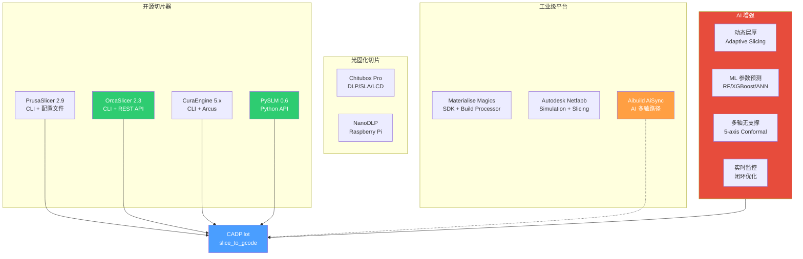
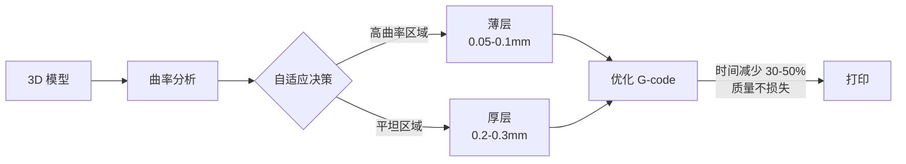
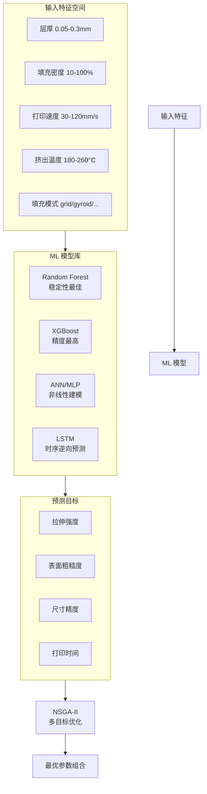
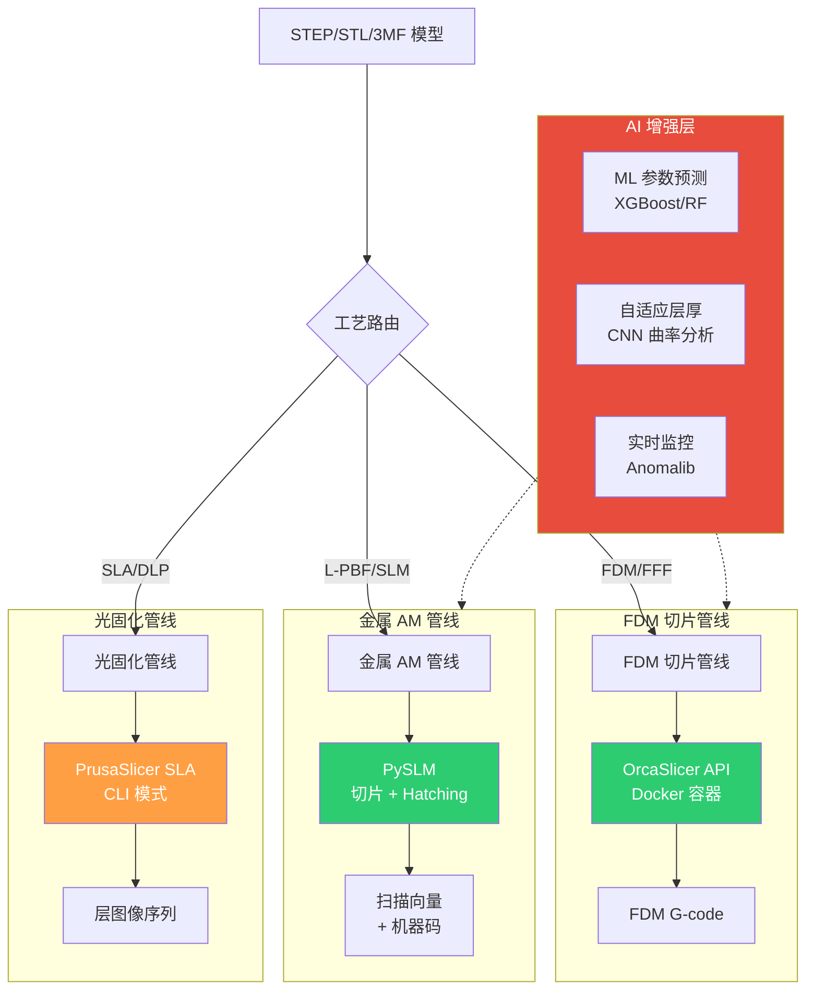
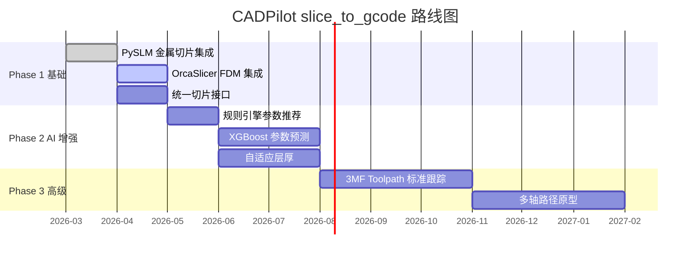

# 切片器集成与 AI 参数优化研究

> [!abstract] 核心价值
> 本文档全面调研 3D 打印切片器生态，从==开源 FDM 切片器==（PrusaSlicer/OrcaSlicer/CuraEngine）到==工业级 AM 平台==（Materialise Magics/Autodesk Netfabb/Aibuild），再到==AI 驱动的参数优化==（动态层厚、ML 参数预测、多轴无支撑切片）。为 CADPilot V3 `slice_to_gcode` 节点的技术底座选型提供决策依据，并明确 AI 增强切片的中长期路径。

---

## 技术全景



> [!tip] 颜色图例
> - ==绿色==：推荐短期集成（P0-P1）
> - ==蓝色==：CADPilot 目标节点
> - ==橙色==：中期评估（P2）
> - ==红色==：长期 AI 增强方向

---

## 开源 FDM 切片器对比

### 综合对比表

| 特性 | PrusaSlicer 2.9 | OrcaSlicer 2.3 | CuraEngine 5.x | PySLM 0.6 |
|:-----|:----------------|:---------------|:---------------|:----------|
| **许可证** | ==AGPL-3.0== | ==AGPL-3.0== | ==AGPL-3.0== | ==LGPL-2.1== |
| **语言** | C++ | C++ (fork of PS) | C++ | ==Python== |
| **GitHub Stars** | ~13K | ~9K | ~1.5K | ~160 |
| **CLI 支持** | ✅ 完善 | ✅ 完善 | ✅ 基础 | ✅ Python API |
| **REST API** | ❌ | ==✅ orcaslicer-api== | ❌ | ✅ 原生 |
| **Docker 部署** | ❌ 官方不支持 | ==✅ linuxserver/docker== | ❌ 需自建 | ✅ pip install |
| **多打印机支持** | Prusa 系列 + 通用 | ==广泛==（Bambu/Voron/Creality 等） | UltiMaker 优化 | L-PBF/SLM 金属 |
| **自适应层高** | ✅ | ✅ | ✅ | ❌ |
| **树形支撑** | ✅ | ==✅ 增强== | ✅ | 块状支撑 |
| **多材料** | ✅ MMU2S | ✅ AMS | ✅ | ❌ |
| **适用工艺** | FDM/SLA | ==FDM== | FDM | ==L-PBF/SLM== |
| **Python 集成难度** | 中（CLI 封装） | ==低==（REST API） | 中（CLI/Arcus） | ==极低==（原生） |

---

### PrusaSlicer 2.9

| 属性 | 详情 |
|:-----|:-----|
| **GitHub** | [prusa3d/PrusaSlicer](https://github.com/prusa3d/PrusaSlicer)（~13K★） |
| **许可证** | AGPL-3.0 |
| **最新版本** | 2.9.x（2026-03） |
| **CLI 文档** | [Command-Line-Interface Wiki](https://github.com/prusa3d/PrusaSlicer/wiki/Command-Line-Interface) |

#### CLI 集成方式

```bash
# FDM G-code 导出
prusa-slicer -g model.stl \
    --load print_config.ini \
    --load filament_config.ini \
    --load printer_config.ini \
    -o output.gcode

# SLA 导出
prusa-slicer --export-sla model.stl \
    --load sla_print.ini \
    --load sla_material.ini \
    --load sla_printer.ini

# 常用参数覆盖
prusa-slicer -g model.stl \
    --layer-height 0.2 \
    --fill-density 20% \
    --support-material \
    -o output.gcode
```

#### Python 封装示例

```python
import subprocess
from pathlib import Path

def prusa_slice(
    stl_path: str,
    output_path: str,
    configs: list[str],
    overrides: dict[str, str] | None = None,
) -> Path:
    """通过 PrusaSlicer CLI 切片"""
    cmd = ["prusa-slicer", "-g", stl_path, "-o", output_path]
    for cfg in configs:
        cmd.extend(["--load", cfg])
    if overrides:
        for key, val in overrides.items():
            cmd.extend([f"--{key}", val])

    result = subprocess.run(cmd, capture_output=True, text=True)
    if result.returncode != 0:
        raise RuntimeError(f"PrusaSlicer failed: {result.stderr}")
    return Path(output_path)
```

> [!warning] AGPL 合规风险
> PrusaSlicer 使用 AGPL-3.0 许可证。若 CADPilot 通过 CLI 子进程调用（不链接代码），可规避 AGPL 传染。但需注意：
> - 不可将 PrusaSlicer 源码嵌入 CADPilot
> - CLI 参数管理复杂，无官方 REST API
> - 配置文件格式为 INI（非 JSON/YAML），解析不便

#### CADPilot 集成评估

| 维度 | 评分 | 说明 |
|:-----|:-----|:-----|
| 功能覆盖 | ★★★★ | FDM + SLA 双模式，参数丰富 |
| 集成难度 | ★★☆ | 仅 CLI，无 API；配置 INI 格式 |
| 许可证风险 | ★★☆ | AGPL，需 CLI 隔离 |
| 社区生态 | ★★★★★ | 13K+ stars，活跃维护 |
| **推荐优先级** | **P2** | 作为 FDM 备选方案 |

---

### OrcaSlicer 2.3

| 属性 | 详情 |
|:-----|:-----|
| **GitHub** | [OrcaSlicer/OrcaSlicer](https://github.com/OrcaSlicer/OrcaSlicer)（~9K★） |
| **许可证** | AGPL-3.0 |
| **基于** | PrusaSlicer / BambuStudio fork |
| **亮点** | ==最广泛的打印机兼容性==；增强的树形支撑；Klipper 原生支持 |

#### CLI 模式

```bash
# 基本切片
orca-slicer --export-gcode model.3mf -o output.gcode

# 导出切片数据
orca-slicer --export-slicedata ./slice_output/ model.3mf

# 导出 3MF 项目
orca-slicer --export-3mf project.3mf model.stl

# 批量处理多板件
orca-slicer --export-gcode multi_plate.3mf  # 自动处理所有板件
```

#### orcaslicer-api（REST API 封装）

> [!success] ==推荐集成方案==——生产级 REST API 封装

| 属性 | 详情 |
|:-----|:-----|
| **GitHub** | [escalopa/orcaslicer-api](https://github.com/escalopa/orcaslicer-api) |
| **架构** | Docker + FastAPI + OrcaSlicer CLI |
| **API** | RESTful + OpenAPI/Swagger |
| **输入格式** | STL / STEP / 3MF |
| **输出** | G-code / 3MF 项目 / 元数据（打印时间、耗材量） |
| **部署** | Docker Compose，一键启动 |

```python
# orcaslicer-api Python 客户端示例
from orcaslicer_api import OrcaSlicerClient

client = OrcaSlicerClient(base_url="http://localhost:8000")

# 上传并切片
job = client.slice(
    model_path="part.stl",
    printer_profile="bambu_x1c",
    print_profile="0.20mm_standard",
    filament_profile="generic_pla",
)

# 获取结果
gcode = client.get_gcode(job.id)
metadata = client.get_metadata(job.id)
print(f"Print time: {metadata.print_time_min} min")
print(f"Filament: {metadata.filament_usage_g} g")
```

#### Docker 部署方案

```yaml
# docker-compose.yml (linuxserver/docker-orcaslicer)
services:
  orcaslicer:
    image: lscr.io/linuxserver/orcaslicer:latest
    environment:
      - PUID=1000
      - PGID=1000
    volumes:
      - ./config:/config
      - ./models:/models
    ports:
      - "3000:3000"  # Web UI (noVNC)
```

#### CADPilot 集成评估

| 维度 | 评分 | 说明 |
|:-----|:-----|:-----|
| 功能覆盖 | ★★★★★ | 最广打印机兼容性，增强型树形支撑 |
| 集成难度 | ==★★★★== | orcaslicer-api 提供 REST API + Docker |
| 许可证风险 | ★★☆ | AGPL，Docker 容器化隔离 |
| 社区生态 | ★★★★ | 9K+ stars，活跃 fork 社区 |
| **推荐优先级** | ==**P1**== | FDM 切片首选方案 |

---

### CuraEngine 5.x

> 详细评估见 [[practical-tools-frameworks]]

| 属性 | 详情 |
|:-----|:-----|
| **GitHub** | [Ultimaker/CuraEngine](https://github.com/Ultimaker/CuraEngine)（~1.5K★） |
| **许可证** | ==AGPL-3.0== |
| **维护方** | UltiMaker |
| **通信** | CLI + Arcus（Protobuf Socket） |

#### 与 OrcaSlicer 对比

| 维度 | CuraEngine | OrcaSlicer |
|:-----|:-----------|:-----------|
| 打印机支持 | UltiMaker 优化 | ==广泛==（Bambu/Voron/Creality） |
| API 可用性 | CLI only | ==REST API 可用== |
| 参数管理 | JSON printer definition | 3MF 项目文件 |
| Docker 支持 | 需自建镜像 | ==linuxserver 官方== |
| Python 集成 | subprocess 封装 | ==orcaslicer-api 客户端== |
| **CADPilot 推荐** | **P2 备选** | ==**P1 首选**== |

> [!info] 选型结论
> OrcaSlicer 在打印机兼容性、API 可用性、Docker 支持方面全面优于 CuraEngine。==推荐 OrcaSlicer 作为 FDM 切片首选==，CuraEngine 作为备选。

---

### PySLM 0.6（金属 AM 切片）

> 详细评估见 [[practical-tools-frameworks]]

| 属性 | 详情 |
|:-----|:-----|
| **GitHub** | [drlukeparry/pyslm](https://github.com/drlukeparry/pyslm)（~160★） |
| **许可证** | ==LGPL-2.1==（商用友好） |
| **适用工艺** | ==L-PBF/SLM 金属 AM== |
| **核心能力** | 切片 + Hatching + 支撑生成 + 方向优化 |

#### PySLM vs FDM 切片器功能互补

| 能力 | PySLM | FDM 切片器 |
|:-----|:------|:----------|
| 切片 | ✅ 通用切片 | ✅ FDM 优化 |
| 扫描策略 | ==✅ Meander/Island/Stripe== | ❌ |
| 支撑生成 | ==✅ GPU GLSL 射线追踪== | ✅ 树形/线性 |
| 构建方向优化 | ==✅ 悬垂分析== | ❌ |
| G-code 生成 | ❌（扫描向量输出） | ==✅ 完整 G-code== |
| 适用工艺 | ==L-PBF/SLM== | FDM/FFF |

> [!success] 互补策略
> - ==PySLM 覆盖金属 AM 管线==：`orientation_optimizer` + `generate_supports` + 切片/hatching
> - ==OrcaSlicer 覆盖 FDM 管线==：桌面级 3D 打印完整 G-code 生成
> - 两者合并可覆盖 CADPilot 的全工艺切片需求

---

## 工业级 AM 平台

### Materialise Magics + SDK

| 属性 | 详情 |
|:-----|:-----|
| **官网** | [materialise.com/magics](https://www.materialise.com/en/industrial/software/magics-data-build-preparation) |
| **许可证** | ==商用付费==（年订阅） |
| **SDK** | Python 脚本自动化 + Build Processor SDK |
| **定位** | ==工业级 AM 数据准备与切片== |

#### 核心能力

| 功能 | 说明 |
|:-----|:-----|
| **数据准备** | STL 修复、标记、纹理贴图、格子结构 |
| **Build Processor** | 与 100+ 打印机 OEM 集成的切片引擎 |
| **NxG Build Processor** | 新一代 BP，支持 nTop Implicit 几何 |
| **自动化 SDK** | Python 脚本自动化 AM 工作流 |
| **SGE** | Materialise Simulation Gateway（仿真集成） |

#### CADPilot 集成评估

| 维度 | 评分 | 说明 |
|:-----|:-----|:-----|
| 功能覆盖 | ★★★★★ | 工业级完整 AM 数据准备 |
| 集成难度 | ★★★ | SDK 可用，但需付费许可 |
| 许可证风险 | ==高== | 年订阅费用高（$5K-$50K+/年） |
| **推荐优先级** | **P3 长期** | 仅在面向工业客户时考虑 |

---

### Autodesk Netfabb

| 属性 | 详情 |
|:-----|:-----|
| **官网** | [autodesk.com/netfabb](https://www.autodesk.com/products/netfabb) |
| **许可证** | ==商用付费==（Autodesk 订阅） |
| **定位** | AM 仿真 + 设计优化 + 切片 |

#### 核心能力

- STL 修复 + 网格优化
- ==热变形仿真==（FEA 集成）
- 支撑结构自动生成
- 嵌套 / 装箱优化
- 多种切片策略（金属/聚合物）

> [!info] CADPilot 评估
> Netfabb 的热变形仿真能力有价值，但高昂的许可证费用和封闭 API 限制了集成可行性。==短期不建议集成==。

---

### Aibuild AiSync

| 属性 | 详情 |
|:-----|:-----|
| **官网** | [ai-build.com](https://ai-build.com/) |
| **许可证** | ==商用 SaaS== |
| **亮点** | ==AI 驱动的多轴无支撑路径规划== |
| **合作** | 3MF Consortium（多轴 Toolpath 扩展标准制定） |
| **新品** | Generative Machine 5 轴桌面级 AM（2026 Q1 出货） |

#### 技术亮点

1. **AI 多轴路径生成**：自动将 3 轴打印转为 5 轴共形打印，==消除支撑结构==
2. **GPT-4 驱动的 AiSync**：用户输入自然语言指令 → AI 自动生成优化 toolpath
3. **云端切片**：上传模型 → 云端高性能计算 → 流式推送指令到打印机
4. **开放 API**：高级用户可创建自定义 operator 和 workflow
5. **3MF Toolpath 标准**：参与制定多轴沉积过程的标准化机器控制格式

#### 适用场景

| 场景 | 适用性 | 说明 |
|:-----|:------|:-----|
| 大型聚合物挤出 | ==高== | 机械臂 AM（LFAM） |
| 金属 DED/WAAM | ==高== | 电弧/激光熔覆 |
| 混凝土/陶瓷 | 中 | 建筑级 AM |
| 桌面 FDM | ==新增== | Generative Machine 5 轴桌面 |

#### CADPilot 集成评估

| 维度 | 评分 | 说明 |
|:-----|:-----|:-----|
| 技术创新 | ★★★★★ | AI 多轴路径规划是未来方向 |
| 集成可行性 | ★★ | SaaS 模式，API 未公开文档 |
| 许可证 | ==高风险== | 商用 SaaS 定价 |
| **推荐优先级** | ==**P2 技术跟踪**== | 关注开放 API + 3MF Toolpath 标准 |

> [!tip] 战略建议
> Aibuild 的多轴无支撑路径规划代表 AM 切片的未来方向。CADPilot 应：
> 1. 短期跟踪 3MF Toolpath Extension 标准进展
> 2. 中期评估其 API 可用性
> 3. 长期考虑自研轻量级多轴路径算法（参考 Aibuild 理念）

---

## 光固化切片器

### Chitubox

| 属性 | 详情 |
|:-----|:-----|
| **官网** | [chitubox.com](https://www.chitubox.com/) |
| **版本** | Basic（免费）/ Advanced / Pro（付费） |
| **适用** | DLP / SLA / LCD 光固化 |
| **开发商** | CBD-Tech（深圳） |

#### 核心能力

| 功能 | 说明 |
|:-----|:-----|
| 切片 | UV 固化层图像生成 |
| 自动支撑 | ==ChituAction==：一键预处理 |
| 树形支撑 | 新版增强 |
| 空心化 | 减少树脂用量 |
| 打印机兼容 | Elegoo / Anycubic / Phrozen 等 |

#### CADPilot 集成评估

| 维度 | 评分 | 说明 |
|:-----|:-----|:-----|
| API 可用性 | ★☆ | ==无公开 API/SDK== |
| 集成可行性 | ★☆ | 封闭软件，无 CLI |
| **推荐优先级** | **P3 不推荐** | 光固化需求通过 PrusaSlicer SLA 模式覆盖 |

---

## AI 驱动的切片优化

### 动态层厚（Adaptive Layer Height）

#### 技术原理



#### 当前实现状态

| 切片器 | 实现方式 | 效果 |
|:-------|:---------|:-----|
| PrusaSlicer | 基于几何曲率的规则引擎 | ==时间减少 ~30%==，质量保持 |
| OrcaSlicer | 继承 PrusaSlicer 实现 | 同上 |
| Cura | "Adaptive Layers" 插件 | 类似效果 |

#### AI 增强方向

> [!success] CADPilot 可探索的 AI 增强路径

1. **CNN 曲率预测**：用卷积网络分析 mesh 表面曲率分布，生成逐层最优层厚映射
2. **RL 动态调参**：强化学习代理在切片过程中实时调整层厚 + 速度 + 温度
3. **GAN 层高优化**：生成对抗网络学习"质量-速度"帕累托最优的层厚分布

> [!info] 参考论文
> - Coruzant (2025): "Adaptive Slicing: The AI Algorithm Making 3D Printing Smarter"——综述了 ML 驱动的自适应切片方法

---

### ML 打印参数预测

#### 2025 年关键研究成果

| 论文 | 方法 | 任务 | 关键指标 | 来源 |
|:-----|:-----|:-----|:---------|:-----|
| Multi-objective FDM Optimization | ==Random Forest + NSGA-II== | ABS 力学性能预测 | 预测精度提升 ==40%+==（vs RSM） | Nature Scientific Reports 2025 |
| Surface Roughness Prediction | ==XGBoost== | 牙科精密原型表面粗糙度 | 最佳超参搜索性能 | Scientific Reports 2025 |
| Surface Quality & Durability | KNN / RF / XGBoost | 综合打印质量预测 | 多模型集成 | Progress in Additive Manufacturing 2025 |
| Autonomous FDM Optimization | ==Data-driven Pipeline== | 实时异常检测 + 自主优化 | 闭环控制 | Virtual and Physical Prototyping 2025 |
| LSTM Parameter Prediction | ==LSTM 逆向预测== | 从力学曲线反推打印参数 | 端到端 | Virtual and Physical Prototyping 2024 |

#### ML 参数预测架构



#### CADPilot `slice_to_gcode` AI 增强方案

> [!success] 推荐实施路径

**Phase 1（短期，P1）**：==基于规则的参数推荐==
```python
# 伪代码：基于零件特征的参数推荐
def recommend_params(drawing_spec: DrawingSpec) -> SlicingParams:
    """基于 DrawingSpec 推荐切片参数"""
    params = SlicingParams()

    # 根据零件尺寸选择层厚
    max_dim = max(drawing_spec.overall_dimensions.values())
    if max_dim < 50:
        params.layer_height = 0.1  # 小件精细
    elif max_dim < 200:
        params.layer_height = 0.2  # 中件标准
    else:
        params.layer_height = 0.3  # 大件快速

    # 根据零件类型选择填充
    if drawing_spec.part_type in ("GEAR", "BRACKET"):
        params.infill_density = 80  # 受力件高填充
    else:
        params.infill_density = 20  # 展示件低填充

    return params
```

**Phase 2（中期，P2）**：==ML 参数预测==
- 训练 XGBoost/Random Forest 模型
- 输入：零件几何特征 + 材料属性 + 质量要求
- 输出：最优打印参数组合
- 数据来源：公开数据集 + 用户反馈积累

**Phase 3（长期，P3）**：==闭环优化==
- 打印结果反馈 → 模型持续学习
- 实时异常检测 + 自动参数调整
- RL 代理在线优化（参考 [[reinforcement-learning-am]]）

---

### 多轴无支撑切片

#### 技术概述

| 维度 | 3 轴传统切片 | 5 轴共形切片 |
|:-----|:-----------|:-----------|
| 打印方向 | 固定 Z 轴 | ==动态旋转== |
| 支撑需求 | 悬垂 >45° 需支撑 | ==大幅减少/消除== |
| 表面质量 | 层纹明显 | ==共形贴合，质量提升== |
| 路径规划 | 2.5D 切片 | ==真 3D 路径== |
| 设备要求 | 标准 3 轴 | 5 轴机械臂/旋转平台 |
| 代表方案 | PrusaSlicer / OrcaSlicer | ==Aibuild AiSync== |

#### Aibuild 无支撑策略

1. **自动分区**：将模型分为多个打印区域
2. **方向优化**：每个区域独立计算最优打印方向
3. **共形切片**：沿曲面生成 toolpath，而非平面切片
4. **碰撞检测**：避免打印头与已打印部分碰撞
5. **路径平滑**：优化轴间过渡，减少机械冲击

#### CADPilot 集成路径

> [!tip] 渐进策略
> 1. **短期**：使用 PySLM 悬垂分析 + 构建方向优化，==减少==支撑需求
> 2. **中期**：参考 Aibuild 理念，实现简单的 2.5D 分区切片
> 3. **长期**：集成 3MF Toolpath Extension，支持真 5 轴路径输出

---

## CADPilot `slice_to_gcode` 节点技术底座选型

### 架构设计



### 推荐技术栈

| 工艺 | 短期（P0-P1） | 中期（P2） | 长期（P3） |
|:-----|:-------------|:----------|:----------|
| **FDM** | ==OrcaSlicer API==（Docker） | + ML 参数预测 | + 多轴路径 |
| **L-PBF/SLM** | ==PySLM==（Python 原生） | + RL 扫描优化 | + 实时热控 |
| **SLA/DLP** | PrusaSlicer CLI（SLA 模式） | 专用库评估 | Chitubox API（如开放） |
| **AI 增强** | 规则引擎参数推荐 | ==XGBoost 参数预测== | 闭环 RL 优化 |

### 技术底座对比矩阵

| 评估维度 | OrcaSlicer API | PySLM | CuraEngine | PrusaSlicer |
|:---------|:-------------|:------|:-----------|:-----------|
| **集成难度** | ==低==（REST） | ==极低==（Python） | 中（CLI） | 中（CLI） |
| **许可证风险** | 中（AGPL + Docker 隔离） | ==低==（LGPL） | 中（AGPL） | 中（AGPL） |
| **功能完整性** | ★★★★★ | ★★★★ | ★★★★ | ★★★★ |
| **AI 扩展性** | ★★★ | ==★★★★★== | ★★ | ★★ |
| **Docker 支持** | ==★★★★★== | ★★★ | ★★ | ★★ |
| **适用工艺** | FDM | ==L-PBF/SLM== | FDM | FDM + SLA |
| **CADPilot 推荐** | ==P1 FDM== | ==P0 金属 AM== | P2 备选 | P2 SLA |

---

## API 集成方案评估

### 集成模式对比

| 模式 | 实现方式 | 优势 | 劣势 | 推荐场景 |
|:-----|:--------|:-----|:-----|:---------|
| **CLI 子进程** | `subprocess.run()` | 简单；AGPL 安全 | 慢；参数管理复杂 | PrusaSlicer SLA |
| **REST API** | HTTP 调用 | 解耦；可扩展；异步 | 需维护服务 | ==OrcaSlicer（推荐）== |
| **Python 原生** | `import pyslm` | 最快；灵活；可扩展 | 仅限 PySLM 生态 | ==PySLM（推荐）== |
| **Socket/Protobuf** | Arcus 协议 | CuraEngine 原生 | 复杂；文档少 | 不推荐 |

### 统一切片接口设计

```python
from abc import ABC, abstractmethod
from pydantic import BaseModel

class SlicingParams(BaseModel):
    """统一切片参数"""
    layer_height: float = 0.2          # mm
    infill_density: int = 20           # %
    print_speed: float = 60.0          # mm/s
    support_enable: bool = True
    material: str = "PLA"
    printer_profile: str = "generic"

class SlicingResult(BaseModel):
    """统一切片结果"""
    gcode_path: str | None = None
    scan_vectors_path: str | None = None
    layer_images_dir: str | None = None
    print_time_min: float = 0
    material_usage_g: float = 0
    layer_count: int = 0

class BaseSlicer(ABC):
    """切片器抽象接口"""

    @abstractmethod
    async def slice(
        self, model_path: str, params: SlicingParams
    ) -> SlicingResult:
        """执行切片"""
        ...

    @abstractmethod
    def supports_process(self, process: str) -> bool:
        """是否支持指定工艺"""
        ...
```

---

## 集成优先级路线图

> [!success] 分三阶段实施

### Phase 1：基础切片能力（P0-P1，1-2 月）

| 优先级 | 工具 | 节点 | 行动项 |
|:-------|:-----|:-----|:------|
| ==P0== | **PySLM** | `slice_to_gcode`（金属） | `pip install PythonSLM`；封装 `MetalSlicer` |
| P1 | **OrcaSlicer API** | `slice_to_gcode`（FDM） | Docker 部署 orcaslicer-api；封装 `FDMSlicer` |
| P1 | **统一接口** | `slice_to_gcode` | 实现 `BaseSlicer` 抽象 + 工艺路由 |

### Phase 2：AI 增强切片（P1-P2，2-4 月）

| 优先级 | 方向 | 节点 | 行动项 |
|:-------|:-----|:-----|:------|
| P1 | **规则引擎参数推荐** | `slice_to_gcode` | 基于 DrawingSpec 的参数映射 |
| P2 | **ML 参数预测** | `slice_to_gcode` | XGBoost 模型训练 + 推理集成 |
| P2 | **自适应层厚** | `slice_to_gcode` | CNN 曲率分析 + 动态层厚生成 |

### Phase 3：高级切片能力（P2+，4+ 月）

| 优先级 | 方向 | 节点 | 行动项 |
|:-------|:-----|:-----|:------|
| P2 | **3MF Toolpath 标准** | `slice_to_gcode` | 跟踪 Aibuild + 3MF Consortium 进展 |
| P2+ | **多轴路径规划** | `slice_to_gcode` | 原型验证 2.5D 分区切片 |
| P3 | **闭环 RL 优化** | 全管线 | 参考 [[reinforcement-learning-am]] 实施 |

### 路线图依赖关系



---

## 风险评估

| 风险 | 级别 | 影响 | 缓解方案 |
|:-----|:-----|:-----|:---------|
| ==AGPL 许可证传染== | 中 | OrcaSlicer/CuraEngine 代码不可嵌入 | Docker 容器化隔离 + CLI 子进程调用 |
| OrcaSlicer API 维护风险 | 中 | 第三方项目，非官方维护 | 可 fork 自维护；或自建 CLI 封装 |
| PySLM 单人维护 | 低 | Dr. Luke Parry 为唯一维护者 | LGPL 允许 fork；核心功能稳定 |
| ML 参数预测数据不足 | 中 | 训练数据积累需时间 | 先用规则引擎；公开数据集补充 |
| 多轴路径算法复杂 | 高 | 5 轴路径规划是 NP-hard 问题 | 长期跟踪 Aibuild + 学术进展 |

> [!danger] 关键风险
> AGPL 许可证是最需要关注的法律风险。==必须通过 Docker 容器化或 CLI 子进程调用来隔离 AGPL 代码==，避免 copyleft 传染到 CADPilot 主代码库。

---

## 参考文献

1. OrcaSlicer GitHub Repository. [github.com/OrcaSlicer/OrcaSlicer](https://github.com/OrcaSlicer/OrcaSlicer)
2. escalopa/orcaslicer-api. [github.com/escalopa/orcaslicer-api](https://github.com/escalopa/orcaslicer-api)
3. PrusaSlicer CLI Wiki. [github.com/prusa3d/PrusaSlicer/wiki/Command-Line-Interface](https://github.com/prusa3d/PrusaSlicer/wiki/Command-Line-Interface)
4. CuraEngine Repository. [github.com/Ultimaker/CuraEngine](https://github.com/Ultimaker/CuraEngine)
5. PySLM Documentation. [pyslm.readthedocs.io](https://pyslm.readthedocs.io)
6. Aibuild Software Platform. [ai-build.com/software](https://ai-build.com/software/)
7. Materialise Magics SDK. [materialise.com/magics-software-development-kit](https://www.materialise.com/en/industrial/software/magics-software-development-kit)
8. AI Build joins 3MF Consortium (2025). [3mf.io](https://3mf.io/news/2025/03/ai-build-join-the-3mf-consortium-to-help-develop-the-toolpath-extension-for-multi-axis-3d-printing/)
9. Multi-objective FDM Optimization via ML. Nature Scientific Reports (2025). [doi.org/10.1038/s41598-025-01016-z](https://www.nature.com/articles/s41598-025-01016-z)
10. ML Surface Roughness Prediction. Scientific Reports (2025). [doi.org/10.1038/s41598-025-17487-z](https://www.nature.com/articles/s41598-025-17487-z)
11. Autonomous FDM Optimization. Virtual and Physical Prototyping (2025). [doi.org/10.1080/17452759.2025.2545523](https://www.tandfonline.com/doi/full/10.1080/17452759.2025.2545523)
12. AI-Driven Innovations in 3D Printing (MDPI 2025). [doi.org/10.3390/jmmp9100329](https://www.mdpi.com/2504-4494/9/10/329)
13. Adaptive Slicing: AI Algorithm (Coruzant 2025). [coruzant.com](https://coruzant.com/3d-printing/adaptive-slicing-ai-3d-printing-smarter/)

---

## 更新日志

| 日期 | 变更 |
|:-----|:-----|
| 2026-03-03 | 初始版本：切片器全景对比（PrusaSlicer/OrcaSlicer/CuraEngine/PySLM）；工业级平台评估（Materialise Magics/Netfabb/Aibuild）；AI 增强切片（动态层厚/ML 参数预测/多轴无支撑）；CADPilot slice_to_gcode 技术底座选型；三阶段路线图 |
