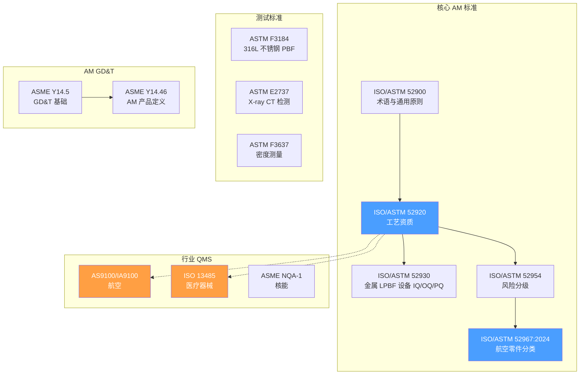
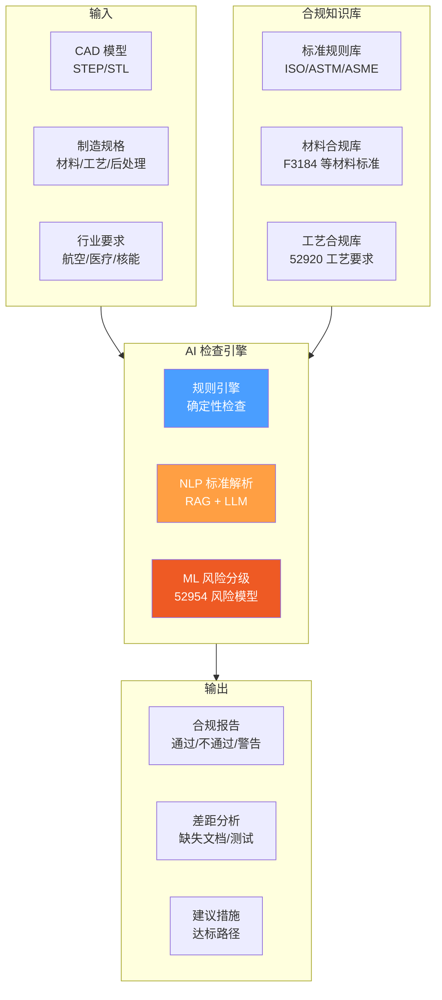

# AM 标准与合规自动化深度调研

> [!abstract] 核心价值
> 增材制造正从原型制造向终端零件生产转型，==标准合规是产品化的必经之路==。本文系统调研 ISO/ASTM AM 标准体系、行业 QMS（航空 AS9100→IA9100、医疗 ISO 13485）、AM 专用 GD&T（ASME Y14.46）以及 AI 驱动的自动化合规检查技术，为 CADPilot 构建合规检查模块提供技术路线。

---

## 标准体系全景



---

## 1. ISO/ASTM AM 核心标准

### 1.1 ISO/ASTM 52920:2023 — 工艺资质

> [!success] ==AM 工业化最重要的标准==，定义了 AM 工艺和生产场所的资质要求。

| 属性 | 详情 |
|:-----|:-----|
| **全称** | Additive manufacturing — Qualification principles — Requirements for industrial AM processes and production sites |
| **版本** | ISO/ASTM 52920:2023 |
| **范围** | 独立于材料和制造方法的通用要求 |
| **核心内容** | 设备确认、工艺验证、质量控制、文档管理 |
| **认证机构** | TÜV SÜD 等第三方认证 |

**关键要求矩阵：**

| 要求域 | 具体内容 | 自动化潜力 |
|:-------|:---------|:-----------|
| 设备确认（IQ/OQ/PQ） | 安装/运行/性能确认 | ★★★☆☆ |
| 工艺参数控制 | 功率/速度/层厚/气氛 | ==★★★★★== |
| 材料管理 | 粉末表征/回收/追溯 | ★★★★☆ |
| 质量控制 | 过程监控/检测/记录 | ==★★★★★== |
| 人员资质 | 培训/认证 | ★★☆☆☆ |
| 文档管理 | 工艺规范/记录/追溯 | ★★★★☆ |

### 1.2 ISO/ASTM 52930 — 金属 LPBF 设备

| 属性 | 详情 |
|:-----|:-----|
| **全称** | Installation, operation and performance (IQ/OQ/PQ) of PBF-LB equipment |
| **版本** | ISO/ASTM/TS 52930:2021 |
| **范围** | 激光粉床熔融（L-PBF）设备专用 |
| **核心内容** | 安装确认（IQ）→ 运行确认（OQ）→ 性能确认（PQ）三阶段 |

### 1.3 ISO/ASTM 52954 — 风险分级

| 属性 | 详情 |
|:-----|:-----|
| **范围** | AM 零件风险分级方法 |
| **核心** | 基于零件功能、失效后果、使用环境进行风险等级划分 |
| **意义** | 决定检测深度和质量要求等级 |

### 1.4 ISO/ASTM 52967:2024 — 航空零件分类

> [!info] ==最新 2024 年发布==，专门针对航空 AM 零件分类。

| 属性 | 详情 |
|:-----|:-----|
| **全称** | AM for aerospace — General principles — Part classifications for AM parts used in aviation |
| **版本** | ISO/ASTM 52967:2024 |
| **范围** | 航空用 AM 零件的分类体系 |
| **分类维度** | 结构重要性、失效后果、飞行安全影响 |

---

## 2. 测试标准

### 2.1 综合对比

| 标准 | 全称 | 目的 | 适用工艺 |
|:-----|:-----|:-----|:---------|
| **ASTM F3184** | AM 不锈钢 (UNS S31603) PBF 规范 | 316L 力学性能要求 | L-PBF, E-PBF |
| **ASTM E2737** | X-ray CT 检测 | 内部缺陷无损检测 | 所有金属 AM |
| **ASTM F3637** | AM 金属相对密度测量 | 孔隙率/密度控制 | PBF-LB |

### 2.2 ASTM F3184 — 316L 不锈钢 PBF

- 规定激光和电子束粉床熔融工艺制造 316L 不锈钢零件的要求
- 包含力学性能最低要求（抗拉强度、屈服强度、延伸率）
- 当前版本：F3184-16(2023)

### 2.3 ASTM F3637 — 密度测量

- 支持 PBF-LB 工艺和参数开发
- 零件验收标准和过程控制测试
- 解决 AM 固有的体积缺陷导致相对密度降低的问题

### 2.4 ASTM E2737 — CT 检测

- X 射线计算机断层扫描（CT）检测方法
- 检测 AM 零件内部缺陷（孔隙、裂纹、夹杂）
- 与 [[defect-detection-monitoring]] 中的 AI 缺陷检测互补

---

## 3. 行业 QMS（质量管理体系）

### 3.1 AS9100 → IA9100（航空）

> [!warning] ==2026 年重大变化==：AS9100 将升级为 IA9100。

| 属性 | AS9100（当前） | IA9100（2026 年底） |
|:-----|:--------------|:-------------------|
| **发布** | 现行标准 | 2026 年底发布终稿 |
| **过渡期** | — | 发布后 2-3 年 |
| **核心变化** | 文档驱动 | ==数据驱动决策== |
| **新增重点** | — | 预测性、伦理、安全、可持续、网络安全 |

**IA9100 数据驱动新要求：**
- 关键产品特性（KPC）验证
- 统计过程控制（SPC）
- 测量系统分析（MSA）
- 综合控制计划
- 实验设计（DOE）
- 过程能力研究

**ASTM AM 认证（与 QMS 互补）：**
- AM 专属审计：覆盖过程控制、追溯性、风险管理
- 覆盖全部 7 种 AM 工艺类别
- 2026 年初扩展合格制造商名单（QML）

### 3.2 ISO 13485（医疗器械）

> [!info] 2025 年多家 AM 企业获得 ISO 13485 认证，标志医疗 AM 产业化加速。

| 里程碑 | 企业 | 时间 |
|:-------|:-----|:-----|
| ISO 13485 AM 产线资质 | OECHSLERhealth | 2025.08 |
| ISO 13485 AM 中心认证 | ABCorp 3D（Boston） | 2025.04 |
| ISO 13485 QMS 认证 | Lithoz（陶瓷 3D 打印） | 2025 |
| ISO 13485 第二设施 | Stratasys Direct（Eden Prairie） | 2025.07 |

**医疗 AM 合规要求：**
- ISO 7 和 ISO 8 级洁净室
- 文档化和验证的工作流
- 生物相容性材料认证
- 完整的追溯链（设计→材料→工艺→检测→交付）

### 3.3 ASME NQA-1（核能）

- 核级质量保证要求
- 最严格的追溯和文档控制
- AM 在核能领域的应用正在探索阶段

---

## 4. ASME Y14.46 — AM 产品定义（GD&T）

### 4.1 标准概述

> [!success] ==唯一专门针对 AM 的 GD&T 标准==，扩展 Y14.5 以覆盖 AM 特有特征。

| 属性 | 详情 |
|:-----|:-----|
| **全称** | Product Definition for Additive Manufacturing |
| **版本** | ASME Y14.46-2017（Draft Standard for Trial Use） |
| **状态** | 2022 年进入稳定维护 |
| **基础** | 扩展 ASME Y14.5 GD&T 标准 |

### 4.2 AM 特有内容

| 特征类别 | Y14.46 覆盖内容 |
|:---------|:---------------|
| **支撑结构** | 支撑区域标注、去支撑要求 |
| **构建方向** | 构建方向标注对尺寸公差的影响 |
| **装配体** | AM 一体化打印装配体的定义 |
| **嵌入组件** | 打印过程中嵌入电子/传感器 |
| **测试试样** | 同批次测试试样要求 |
| **异质材料** | 多材料/梯度材料定义 |
| **表面质量** | AM 特有表面粗糙度标注 |

### 4.3 CADPilot 集成价值

ASME Y14.46 的 AM 特有标注可直接映射到 CADPilot 的 `DrawingSpec`：

| Y14.46 概念 | DrawingSpec 对应 | 实现方式 |
|:-----------|:----------------|:---------|
| 构建方向 | `build_orientation` | orientation_optimizer 节点 |
| 支撑区域 | `support_regions` | generate_supports 节点 |
| 表面质量 | `surface_finish` | printability_node |
| 测试试样 | `test_coupon_spec` | 新增字段 |
| 异质材料 | `material_gradient` | organic 管道扩展 |

---

## 5. AI 驱动合规自动化

### 5.1 技术架构



### 5.2 自动化合规检查设计

**Level 1 — 确定性规则检查（短期可实现）：**

| 检查项 | 标准来源 | 检查方法 | 自动化程度 |
|:-------|:---------|:---------|:-----------|
| 壁厚最小值 | ISO 52920 + 工艺规范 | 几何分析 | ==全自动== |
| 孔径/特征最小尺寸 | ASME Y14.46 + 机器能力 | 特征识别 | ==全自动== |
| 材料属性达标 | ASTM F3184 | 数据库比对 | 全自动 |
| 密度要求 | ASTM F3637 | 预测模型 | 半自动 |
| 支撑可去除性 | 设计规范 | 几何分析 | 全自动 |
| 构建方向约束 | 表面质量要求 | 优化算法 | ==全自动== |

**Level 2 — NLP + RAG 标准解读（中期）：**

```python
# 概念设计：LLM + RAG 标准合规查询
class ComplianceRAG:
    """基于标准文档的 RAG 合规检查系统"""

    def __init__(self):
        self.vector_store = load_standards_embeddings([
            "ISO_ASTM_52920.pdf",
            "ASTM_F3184.pdf",
            "ASME_Y14_46.pdf",
            # ...
        ])

    def check_compliance(self, part_spec: DrawingSpec,
                         industry: str) -> ComplianceReport:
        """
        1. 根据行业确定适用标准集
        2. RAG 检索相关标准条款
        3. LLM 分析零件是否满足要求
        4. 生成合规报告（通过/不通过/需补充信息）
        """
        pass
```

**Level 3 — ML 风险分级（长期）：**
- 基于 ISO/ASTM 52954 风险分级框架
- 自动评估零件失效后果和使用环境
- 确定检测深度和质量控制要求等级

### 5.3 现有 AI 合规工具参考

| 工具 | 功能 | 制造相关 | 参考价值 |
|:-----|:-----|:---------|:---------|
| **RegScale** | AI 合规管理系统 | 间接 | ★★★☆☆ |
| **ComplianceQuest** | 预测性 IQC | ==直接== | ★★★★☆ |
| **Signify** | 制造合规自动化 | 直接 | ★★★★☆ |

**关键趋势：**
- AI 将监管审查时间从数周缩短至数小时
- LLM + RAG 可解释多国标准定义差异
- 预测性检验（Predictive IQC）基于供应商趋势和历史 NCR 动态调整检验计划
- 持续自改进的质量控制系统（操作员反馈闭环）

---

## 6. CADPilot 标准合规路径

### 6.1 产品化合规路线图

| 阶段 | 时间 | 目标 | 行动 |
|:-----|:-----|:-----|:-----|
| **MVP** | 0-3 月 | 基础合规检查 | 壁厚/孔径/材料属性规则检查 |
| **行业版** | 3-6 月 | 航空/医疗入门 | ISO 52920 基础检查 + 文档模板 |
| **企业版** | 6-12 月 | 完整合规平台 | RAG 标准解读 + 风险分级 + 审计追溯 |

### 6.2 集成到 LangGraph 管道

```python
# 新增 compliance_checker_node
async def compliance_checker_node(state: PipelineState) -> PipelineState:
    """
    在 printability_node 之后运行
    检查零件是否满足目标行业标准要求
    """
    spec = state["drawing_spec"]
    industry = state.get("target_industry", "general")

    # Level 1: 规则检查
    rule_results = rule_engine.check(spec, industry)

    # Level 2: RAG 标准查询（中期）
    # rag_results = compliance_rag.check(spec, industry)

    state["compliance_report"] = {
        "passed": rule_results.all_passed,
        "checks": rule_results.checks,
        "warnings": rule_results.warnings,
        "missing_docs": rule_results.missing_docs,
    }
    return state
```

---

## 7. 推荐路径

> [!success] 短期（0-3 月）— 基础合规
> 1. **构建标准规则库**：ISO 52920 通用要求 + ASTM F3184/F3637 材料测试要求
> 2. **几何合规检查**：壁厚、最小孔径、悬垂角度（复用 CADEX MTK，参见 [[automated-quoting-engine]]）
> 3. **合规报告生成**：在 printability_node 输出中附加合规状态

> [!success] 中期（3-6 月）— 行业化
> 1. **航空合规模块**：ISO/ASTM 52967 零件分类 + AS9100/IA9100 要求映射
> 2. **医疗合规模块**：ISO 13485 QMS 检查项 + 生物相容性材料验证
> 3. **RAG 标准解读**：嵌入标准文档，LLM 回答"此零件是否满足 X 标准"
> 4. **材料追溯链**：材料批号 → 工艺参数 → 检测记录 → 零件 ID

> [!success] 长期（6-12 月）— 智能合规平台
> 1. **ML 风险分级**：基于 ISO/ASTM 52954 自动评估零件风险等级
> 2. **预测性质量控制**：基于历史数据预测质量风险
> 3. **多国标准协调**：AI 跨映射 US/EU/Asia 标准差异
> 4. **审计追溯平台**：完整的数字化合规证据链
> 5. **ASME Y14.46 集成**：AM 特有 GD&T 标注自动化（参见 [[gd-t-automation]]）

---

## 8. 风险与挑战

| 风险 | 影响 | 缓解措施 |
|:-----|:-----|:---------|
| 标准频繁更新 | 规则库维护成本 | NLP 自动监控标准更新 |
| IA9100 2026 过渡 | 合规要求变化 | 提前研究 IA9100 草案 |
| 标准文档版权 | 无法直接嵌入 | RAG 索引标准摘要+引用 |
| 行业认证门槛 | 需第三方审计 | 聚焦设计端合规，非生产认证 |
| 多行业覆盖 | 开发资源分散 | 优先航空（最大市场） |

---

## 参考文献

1. ISO/ASTM 52920:2023, "Additive manufacturing — Qualification principles — Requirements for industrial AM processes and production sites."
2. ISO/ASTM 52967:2024, "Additive manufacturing for aerospace — General principles — Part classifications for AM parts used in aviation."
3. ISO/ASTM/TS 52930:2021, "Installation, operation and performance (IQ/OQ/PQ) of PBF-LB equipment."
4. ASTM F3184-16(2023), "Specification for AM Stainless Steel Alloy (UNS S31603) with Powder Bed Fusion."
5. ASTM F3637-23, "Guide for AM of Metal — Finished Part Properties — Methods for Relative Density Measurement."
6. ASME Y14.46-2017, "Product Definition for Additive Manufacturing."
7. IAQG, "IA9100 Series Standards Due for Release in 2026," cvgstrategy.com.
8. OECHSLERhealth, "ISO 13485 AM Production Line Qualification," VoxelMatters, 2025.
9. ASTM, "AM Certification and Qualified Manufacturer List," amcoe.org, 2026.
10. amsight/Qualified AM, "Whitepaper on QM and Certification in AM," Formnext 2025.

---

> [!quote] 文档统计
> - 行数：~310 行
> - 交叉引用：5 个 wikilink
> - Mermaid 图：2 个
> - 参考文献：10 篇
> - 覆盖标准：10+ 个（ISO/ASTM/ASME/行业 QMS）
> - 合规自动化设计：3 个层级
