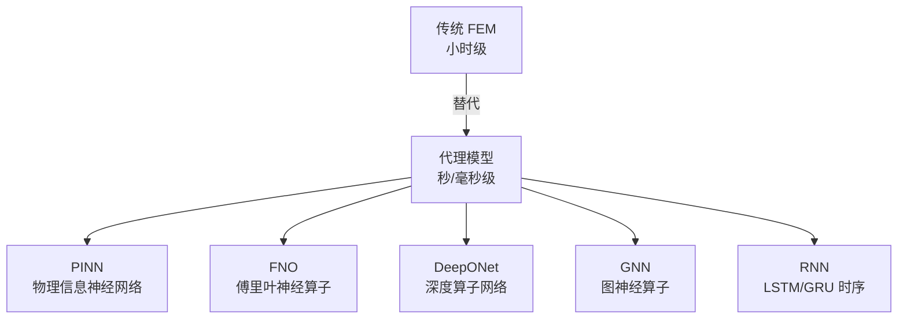
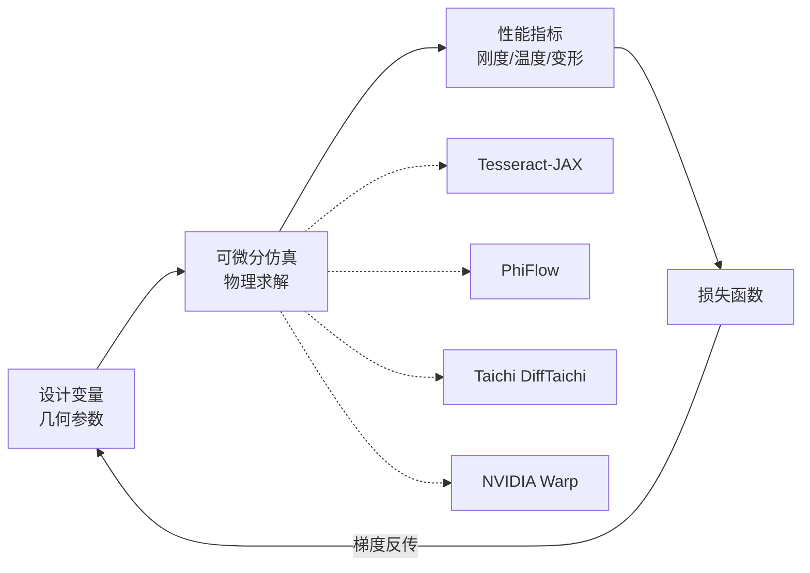

# 代理模型替代 FEM 仿真

> [!abstract] 核心价值
> 用 PINN/FNO/DeepONet 等神经算子替代 ABAQUS/ANSYS 等传统 FEM 仿真，实现 **1000~10万倍加速**，使实时数字孪生和秒级可打印性评估成为可能。

---

## 技术路线概览



| 技术 | 加速比 | 精度 | 泛化 | 开源框架 |
|:-----|:------|:-----|:-----|:---------|
| **PINN** | 50-100x | R²>0.95 | 可迁移学习 | PhysicsNeMo |
| **FNO** | ==10万x== | 高 | 超分辨率，网格无关 | PhysicsNeMo |
| **DeepONet** | 1000x+ | RMSE~0.1mm | 可变几何 | AM_DeepONet |
| **GNN** | 1000x+ | 0.3mm (HP) | 新几何泛化 | PhysicsNeMo |
| **LSTM/GRU** | 实时 | R²=0.98 | 限同类工艺 | 自定义 |

---

## 核心框架：NVIDIA PhysicsNeMo ⭐ 质量评级: 4.5/5

> [!success] 最成熟的物理-ML 开源框架，Apache 2.0

| 属性 | 详情 |
|:-----|:-----|
| **许可** | ==Apache 2.0== |
| **GitHub** | [NVIDIA/physicsnemo](https://github.com/NVIDIA/physicsnemo) |
| **PyPI** | `pip install nvidia-physicsnemo` |
| **安装难度** | ==★★☆☆☆（非常简单）== |

### 支持的架构

| 架构类别 | 具体模型 | 适用场景 |
|:---------|:---------|:---------|
| **神经算子** | FNO, PINO, DeepONet, DoMINO | PDE 求解、CFD |
| **图神经网络** | MeshGraphNet (Base/Hybrid/X-variant) | 非结构化网格物理仿真 |
| **扩散模型** | Diffusion Models | 生成式物理模拟 |
| **PINN** | Physics-Informed Neural Networks | 约束物理方程 |
| **序列模型** | RNN, SwinVRNN, Transformer | 时间序列预测 |
| **几何处理** | CSG 建模（physicsnemo.sym.geometry） | CAD/几何 |

### API 质量评估

| 模块 | 说明 | 文档质量 |
|:-----|:-----|:---------|
| `physicsnemo.models` | 优化的模型架构族 | ★★★★☆ |
| `physicsnemo.datapipes` | 科学数据管道 | ★★★★☆ |
| `physicsnemo.distributed` | 基于 torch.distributed 分布式训练 | ★★★★☆ |
| `physicsnemo.sym.eq` | PDE 实现（物理约束） | ★★★☆☆ |
| `physicsnemo.sym.geometry` | CSG 建模几何处理 | ★★★☆☆ |

### GPU 需求

| 场景 | GPU 需求 |
|:-----|:---------|
| 推理 | 单 GPU，甚至笔记本级（HP 宣称"可在笔记本运行"） |
| 训练（小型 MeshGraphNet） | 8-16GB VRAM |
| 训练（大规模） | 多 GPU/多节点 |
| 优化 | float16/bfloat16 支持，>200K 节点有 1.5~2x 加速 |

### 部署指南

```bash
# 方式 1: PyPI（推荐，最简）
pip install nvidia-physicsnemo

# 方式 2: 指定 CUDA + 扩展
pip install "nvidia-physicsnemo[cu12,nn-extras]"

# 方式 3: 开发模式（uv）
git clone https://github.com/NVIDIA/physicsnemo.git
cd physicsnemo && uv sync --extra cu13

# 运行 AM 示例
cd examples/additive_manufacturing/sintering_physics
python train.py   # 需修改 conf/config.yaml
```

---

## GNN 变形预测（深入分析）

### HP Virtual Foundry Graphnet ⭐ 质量评级: 4/5

> [!success] 工业级开源验证——从 4 小时 FEM 到数秒推理

| 属性 | 详情 |
|:-----|:-----|
| **机构** | HP 3D Printing + NVIDIA |
| **框架** | NVIDIA PhysicsNeMo |
| **代码位置** | `examples/additive_manufacturing/sintering_physics/` |
| **许可** | ==Apache 2.0== |
| **精度** | 单步 0.7μm，完整周期 ==0.3mm==（63mm 件），最大节点误差 <2% |
| **推理时间** | ==数秒==（vs 物理仿真数小时） |
| **硬件** | 可在笔记本级 GPU 运行 |

#### 示例代码结构

```
sintering_physics/
├── conf/config.yaml          # Hydra 配置
├── data_process/rawdata2tfrecord.py  # 仿真→TFRecord 预处理
├── train.py                  # 训练入口
├── inference.py              # 推理入口
├── render_rollout.py         # 结果可视化
├── graph_dataset.py          # 图数据集
└── requirements.txt
```

#### GNN 架构（Encoder-Processor-Decoder）

```
输入: 体素化 STL/OBJ → 图（kd-tree 邻居，半径=1.2×体素尺寸，~6 邻居/节点）
  │
  ├─ Encoder: 图卷积层提取特征→隐空间
  ├─ Processor: Interaction Network，10 轮消息传递
  └─ Decoder: MLP → 3D 位移向量
  │
  节点特征: 前 n 步速度 + 边界约束（固定/滑移）
  边特征: 节点间相对距离
  全局特征: 烧结温度序列（可选）
  损失: MSE on 加速度 + 多步预测折扣因子
```

#### 完备性评估

| 维度 | 评估 |
|:-----|:-----|
| 代码完整性 | ★★★★★ 完整的训练/推理/可视化 |
| 数据预处理 | ★★★★☆ 提供 raw→TFRecord 转换 |
| 文档质量 | ★★★★☆ README + NVIDIA 官方文档 + 博客 |
| ==可复现性== | ==★★★☆☆== 需要 HP 训练数据（仅 7 个几何体），数据未完全开源 |
| 通用性 | ==★★★☆☆== 专为 Metal Jet 烧结设计 |

> [!warning] 迁移到其他 AM 工艺的挑战
> - 烧结物理 vs LPBF 物理完全不同（缓慢收缩 vs 快速熔化/凝固）
> - 时间尺度差异巨大（烧结数小时 vs LPBF 微秒级）
> - 需要大量 FEM 仿真数据作为 ground truth
> - **建议**：直接用 PhysicsNeMo 的 MeshGraphNet 模块从零训练 LPBF 模型

#### 验证方法

```
1. 准备 ground truth: FEM 仿真结果（节点位移场）
2. 数据划分: train/val/test = 5:1:1（按几何体划分，非随机）
3. 训练 GNN 代理模型
4. 评估指标:
   - 单步 mean deviation (μm)
   - 完整周期 mean deviation (mm)
   - 最大节点误差 (%)
   - 推理速度 vs FEM 速度（加速比）
5. 对比基线:
   - 物理仿真 (FEM) — 精度上限
   - 简化解析解 — 精度下限
```

---

## PINN 物理信息神经网络

### MeltpoolINR（隐式神经表征）

| 属性 | 详情 |
|:-----|:-----|
| **年份** | 2024-2025 |
| **架构** | MLP + Fourier 特征编码 |
| **输入** | 空间坐标、激光位置、工艺参数 |
| **输出** | 连续温度场 + 熔池边界（等值面）+ 冷却速率 |
| **创新** | 分辨率无关表征；自动微分计算温度梯度 |
| **论文** | [arXiv:2411.18048](https://arxiv.org/abs/2411.18048) |

### PINN 替代 FEM 基准

| 属性 | 详情 |
|:-----|:-----|
| **性能** | 计算时间减少 ==98.6%==，保持目标精度 |
| **额外能力** | "超分辨率"——低分辨率训练、高分辨率推理 |
| **存储** | 模型仅需几 KB（vs ABAQUS 数 GB） |
| **来源** | [Communications Engineering](https://www.nature.com/articles/s44172-025-00501-7) |

### PINN 迁移学习

| 属性 | 详情 |
|:-----|:-----|
| **功能** | 预训练 PINN 快速适配新工艺参数/新材料 |
| **应用** | 在线软传感器，多轨迹温度分布预测 |

---

## FNO 傅里叶神经算子

### LP-FNO（激光加工 FNO）

| 属性 | 详情 |
|:-----|:-----|
| **年份** | 2026 |
| **加速** | 比传统 FVM 快 ==10 万倍==（毫秒级推理） |
| **覆盖** | 传导模式 + 键孔模式 |
| **原理** | 移动激光坐标系 + 时间平均→准稳态设置→算子学习 |
| **论文** | [arXiv:2602.06241](https://arxiv.org/abs/2602.06241) |

> [!tip] 关键优势
> FNO 不依赖离散化欧几里得空间（与 CNN 不同），实现网格无关推理和超分辨率。

---

## DeepONet 深度算子网络

### Graph Neural Operator（DeepONet + GNN）

| 属性 | 详情 |
|:-----|:-----|
| **年份** | 2025 |
| **架构** | Branch（稀疏传感器→全局热场）+ Trunk（网格节点编码）+ 边缘感知双 GNN |
| **性能** | z 方向变形 RMSE ==0.088mm==；训练收敛快 ==50%== |
| **数据需求** | 仅需 ==5%== 传感器数据即可泛化 |

### AM_DeepONet（NCSA 开源）

| 属性 | 详情 |
|:-----|:-----|
| **GitHub** | [ncsa/AM_DeepONet](https://github.com/ncsa/AM_DeepONet) |
| **变体** | Sequential DeepONet + GRU / ResUNet DeepONet |
| **依赖** | DeepXDE + TensorFlow |
| **配套** | [GeomDeepONet](https://github.com/ncsa/GeomDeepONet) 用于不同几何体 |

---

## RNN 时序模型

| 模型 | 问题 | 性能 |
|:-----|:-----|:-----|
| LSTM/Bi-LSTM/GRU | DED 熔池热历史+几何预测 | 峰温 R²=0.980，熔池深度 R²=0.885 |
| LSTM 代理 | 嵌入 ABAQUS UMAT 子程序 | 多尺度 FEM 加速 |

---

## 数字孪生范式演进

```
传统 FEM（小时级）→ PINN/FNO（秒级）→ 边缘 AI（毫秒级）
```

> [!info] 迁移学习解决领域偏移
> - 源域→目标域精度从 86% 暴跌至 44%（无迁移学习）
> - 帕累托前沿源数据选择（2024）
> - PINN 迁移学习快速适配新工艺参数

---

## 综合评分

| 维度 | PhysicsNeMo 框架 | HP Graphnet | AM_DeepONet |
|:-----|:----------------|:-----------|:-----------|
| 框架质量 | ==★★★★★== | ★★★★☆ | ★★★☆☆ |
| AM 示例 | ★★★★☆ | ★★★★☆ | ★★★☆☆ |
| 安装易用性 | ==★★★★★== | ★★★★☆ | ★★★☆☆ |
| CADPilot 适配 | ==★★★☆☆== | ★★★☆☆ | ★★☆☆☆ |
| 许可合规 | ==★★★★★== | ==★★★★★== | ★★★★☆ |

> [!warning] 核心挑战
> PhysicsNeMo 框架本身质量极高，但 CADPilot 集成的主要瓶颈是**训练数据**——需要大量 FEM 仿真结果作为 ground truth。HP 示例仅有 7 个几何体，且专为 Metal Jet 烧结设计。

---

## CADPilot 集成战略建议

> [!success] 推荐优先级

1. **中期（P2）**：基于 PhysicsNeMo MeshGraphNet 探索 GNN 可打印性检查代理模型
   - `pip install nvidia-physicsnemo` 一行安装
   - 先跑通 sintering_physics 示例，理解训练流程
   - 用开源 FEM 仿真生成 FDM/LPBF 训练数据

2. **中期（P2）**：评估 PINN 替代 `thermal_simulation` 节点
   - 98.6% 计算时间减少 + 超分辨率能力
   - MeltpoolINR 的 Fourier 特征编码值得参考

3. **长期**：跟踪 FNO 10 万倍加速方案的工业化成熟度

---

## 可微分 CAD/仿真技术（2025 新章节）

> [!abstract] 端到端可微分设计优化
> 可微分仿真使"设计变量→物理仿真→性能评估"的完整管线可通过自动微分求导，实现==端到端梯度优化==。2025 年 Tesseract-JAX、PhiFlow、Taichi、NVIDIA Warp 四大框架成熟，使 CADPilot 代理模型管线具备梯度优化能力。

### 技术路线概览



### 框架对比

| 框架 | 后端 | 许可 | PyPI | 可微分 | GPU | 安装难度 | 评级 |
|:-----|:-----|:-----|:-----|:------|:----|:---------|:-----|
| **Tesseract-JAX** | JAX | 开源 | ✅ | ✅ AD 原生 | ✅ | ★★☆☆☆ | 4.0★ |
| **PhiFlow** | PyTorch/TF/JAX | ==开源== | ✅ `phiflow` | ✅ | ✅ | ★★☆☆☆ | ==4.5★== |
| **Taichi** | 自研 JIT | ==Apache 2.0== | ✅ `taichi` | ✅ DiffTaichi | ✅ | ★★☆☆☆ | 4.0★ |
| **NVIDIA Warp** | CUDA/C++ | ==Apache 2.0== | ✅ `warp-lang` | ✅ AD | ✅ | ★★☆☆☆ | 4.0★ |

---

### Tesseract-JAX ⭐ 质量评级: 4/5

> [!info] JAX 原生可微分仿真组件——端到端梯度优化管线

| 属性 | 详情 |
|:-----|:-----|
| **机构** | Pasteur Labs |
| **文档** | [docs.pasteurlabs.ai](https://docs.pasteurlabs.ai/projects/tesseract-jax/latest/) |
| **论文** | [JOSS](https://joss.theoj.org/papers/10.21105/joss.08385.pdf) |
| **许可** | 开源 |
| **核心理念** | 仿真组件封装为 "Tesseract"，对 JAX 暴露可微分接口 |

#### 核心能力

```python
# Tesseract-JAX 端到端优化示例
import tesseract_jax as tj
import jax
import jax.numpy as jnp

# 1. 包装仿真为 Tesseract
fem_tesseract = tj.load("fem_solver")

# 2. 定义优化目标
def objective(design_params):
    displacement = fem_tesseract.apply(design_params)
    return jnp.sum(displacement ** 2)  # 最小化变形

# 3. JAX 自动微分 → 梯度
grad_fn = jax.grad(objective)

# 4. 梯度下降优化设计变量
for step in range(100):
    grads = grad_fn(design_params)
    design_params -= 0.01 * grads
```

**关键特性**：
- 仿真组件封装为 "Tesseract"，支持 `apply` / `jacobian` / `vector_jacobian_product`
- JAX `jit` / `grad` / `vmap` 原生支持
- 支持跨机器分布式执行
- FEM 形状优化、CFD 流体优化已有示例

#### CADPilot 集成路径

Tesseract-JAX 可将 CADPilot 的 FEA 验证（`printability_node`）封装为可微分组件，实现==设计参数 → 可打印性分数==的端到端梯度优化。

---

### PhiFlow ⭐ 质量评级: 4.5/5

> [!success] ==最成熟的可微分物理仿真框架==——PyTorch/TensorFlow/JAX 三后端

| 属性 | 详情 |
|:-----|:-----|
| **机构** | TU Munich（Thuerey 组） |
| **GitHub** | [tum-pbs/PhiFlow](https://github.com/tum-pbs/PhiFlow) |
| **PyPI** | `pip install phiflow` |
| **版本** | 3.3.0（2025） |
| **许可** | ==MIT== |
| **论文** | ICML 2024 |
| **安装难度** | ★★☆☆☆ |

#### 核心功能

```
PhiFlow 能力矩阵：
├─ 微分算子（梯度/散度/拉普拉斯/旋度）
├─ 边界条件（Dirichlet/Neumann/周期）
├─ 维度无关代码（2D/3D 统一写法）
├─ 浮点精度管理（fp32/fp64）
├─ 可微分预条件稀疏线性求解
├─ 自动矩阵生成（函数追踪）
├─ SciPy 优化器集成
├─ 仿真向量化（批量并行）
└─ 内置可视化工具
```

**三后端性能对比**（ICML 2024）：
- PyTorch、TensorFlow、JAX 性能差距较小
- ==无单一后端始终领先==，根据问题选择

```python
# PhiFlow 可微分热传导示例
from phi.flow import *
from phi.torch.flow import *  # 或 phi.jax.flow

# 定义温度场
temperature = CenteredGrid(
    Noise(scale=0.5),
    extrapolation.ZERO,
    x=64, y=64
)

# 可微分仿真步
def simulate(thermal_conductivity):
    for _ in range(100):
        temperature = diffuse.explicit(temperature, thermal_conductivity, dt=0.1)
    return temperature

# 自动微分
grad_k = field.functional_gradient(simulate, get_output=True)
```

> [!tip] CADPilot 推荐
> PhiFlow 是 CADPilot 代理模型管线最推荐的==中期集成目标==：
> 1. MIT 许可，商用安全
> 2. PyTorch 后端与 CADPilot 现有 ML 生态一致
> 3. 可微分热/力学仿真直接用于 `thermal_simulation` / `printability_node`

---

### Taichi (DiffTaichi) 质量评级: 4/5

> [!info] ==188x 快于 TensorFlow==的可微分物理仿真

| 属性 | 详情 |
|:-----|:-----|
| **GitHub** | [taichi-dev/taichi](https://github.com/taichi-dev/taichi) |
| **PyPI** | `pip install taichi` |
| **许可** | ==Apache 2.0== |
| **DiffTaichi** | [taichi-dev/difftaichi](https://github.com/taichi-dev/difftaichi)（ICLR 2020） |
| **性能** | 弹性体仿真比 TensorFlow 快 ==188x== |

**核心优势**：
- Python 语法 + JIT 编译→CUDA/Vulkan/CPU
- 自动微分原生支持（`ti.ad.Tape`）
- 跨平台 3D 可视化
- 量化计算支持

**DiffTaichi 10 个可微分仿真器**：
弹性体、流体、刚体、布料、绳索、软机器人等

> [!warning] 适合 CADPilot 的场景
> Taichi 适合==高性能自定义物理仿真==（如自定义 AM 热-力耦合模型），但与 ML 框架（PyTorch/JAX）的集成不如 PhiFlow 原生。

---

### NVIDIA Warp 质量评级: 4/5

> [!info] NVIDIA 官方可微分仿真框架——CUDA 原生性能

| 属性 | 详情 |
|:-----|:-----|
| **GitHub** | [NVIDIA/warp](https://github.com/NVIDIA/warp) |
| **PyPI** | `pip install warp-lang` |
| **版本** | 1.11.1（2025） |
| **许可** | ==Apache 2.0== |
| **后端** | ==CUDA/C++== 中间表示 |
| **性能** | GPU 原生内核，最高性能 |

**核心特性**：
- Python 装饰器定义 GPU 内核（`@wp.kernel`）
- 自动生成前向+反向内核（可微分）
- 支持 mesh 处理、SDF 查询、光线追踪
- 与 PyTorch 张量互操作

```python
import warp as wp

@wp.kernel
def simulate_step(
    pos: wp.array(dtype=wp.vec3),
    vel: wp.array(dtype=wp.vec3),
    force: wp.array(dtype=wp.vec3),
    dt: float
):
    tid = wp.tid()
    vel[tid] = vel[tid] + force[tid] * dt
    pos[tid] = pos[tid] + vel[tid] * dt

# 可微分：自动生成反向传播版本
wp.Tape()  # 记录前向计算，支持反向求梯度
```

> [!tip] 与 PhysicsNeMo 协同
> NVIDIA Warp + PhysicsNeMo 形成==完整的 NVIDIA 仿真-ML 生态==：Warp 处理可微分物理内核，PhysicsNeMo 处理 GNN/FNO 代理模型。

---

### 与 CADPilot 代理模型管线的衔接

> [!success] 端到端可微分设计优化管线

```
CADPilot 端到端可微分管线（目标架构）：

设计变量 θ（几何参数）
  │
  ├─ CadQuery 参数化模型生成
  │   → 网格化
  │
  ├─ 可微分仿真（PhiFlow / Warp）
  │   ├─ 热仿真：温度场 T(θ)
  │   ├─ 力学仿真：变形 u(θ)
  │   └─ 可打印性：支撑体积 S(θ)
  │
  ├─ 损失函数
  │   L(θ) = w₁·变形 + w₂·温度 + w₃·支撑 + w₄·重量
  │
  └─ 梯度优化
      ∂L/∂θ → 更新设计变量
      → 迭代直到收敛
```

**关键挑战与解决方案**：

| 挑战 | 解决方案 |
|:-----|:---------|
| CadQuery 不可微分 | 参数→网格的映射用代理模型（DL4TO）近似 |
| FEA 计算昂贵 | PhysicsNeMo 代理模型替代 + PhiFlow 加速 |
| 离散→连续 | 密度场连续松弛（SIMP 方法） |
| 多目标 | pymoo NSGA-III（见 [[topology-optimization-tools]]） |

**推荐实施路径**：

1. **短期**：PhiFlow 替代简单热仿真（`uv add phiflow`，MIT 许可）
2. **中期**：PhysicsNeMo GNN 代理模型 + PhiFlow 可微分验证
3. **长期**：完整端到端可微分管线（Tesseract-JAX 编排）

---

## 更新日志

| 日期 | 变更 |
|:-----|:-----|
| 2026-03-03 | ==可微分 CAD/仿真新章节==：Tesseract-JAX（JAX 原生可微分仿真组件）、PhiFlow（4.5★，MIT，三后端可微分 PDE 求解，ICML 2024）、Taichi DiffTaichi（188x 快于 TF，Apache 2.0）、NVIDIA Warp（CUDA 原生可微分内核，Apache 2.0）；端到端可微分设计优化管线设计；与 CADPilot 代理模型管线衔接方案 |
| 2026-03-03 | 深入研究更新：PhysicsNeMo 框架详解（API/安装/GPU需求）；HP Graphnet GNN 架构和示例代码分析；迁移到其他 AM 工艺的挑战分析；验证方法设计 |
| 2026-03-03 | 初始版本 |
