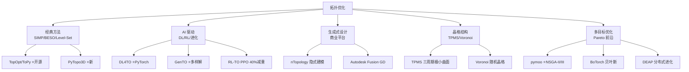

# 拓扑优化工具链评估

> [!abstract] 核心价值
> 拓扑优化（TO）是 CADPilot 从"生成零件"到"生成==最优零件=="的关键技术升级。2025 年 AI 驱动 TO（GenTO、RL-TO）、可微分 FEA（JAX-SSO）和深度学习晶格设计（DL4TO）的成熟，使得集成到 `apply_lattice` 节点的路径清晰可行。

---

## 技术路线概览



---

## 经典拓扑优化（开源）

### TopOpt（DTU） 质量评级: 3.5/5

> [!info] 丹麦技术大学官方 Python TO 库——SIMP + MMA

| 属性 | 详情 |
|:-----|:-----|
| **来源** | DTU TopOpt Group |
| **GitHub** | [zfergus/topopt](https://github.com/zfergus/topopt) |
| **PyPI** | `pip install topopt` |
| **许可** | MIT |
| **方法** | SIMP + MMA（Method of Moving Asymptotes） |
| **文档** | [topopt.readthedocs.io](https://topopt.readthedocs.io/) |
| **安装难度** | ★★☆☆☆（简单） |

**核心功能**：
- 最小柔度（最大刚度）问题
- SIMP 材料插值（密度 → 弹性模量）
- MMA 优化器（高效收敛）
- 2D/3D 支持

> [!tip] CADPilot 价值
> 作为基线参考实现，可用于验证 AI 方法的优化质量。

---

### ToPy 质量评级: 2.5/5

| 属性 | 详情 |
|:-----|:-----|
| **GitHub** | [williamhunter/topy](https://github.com/williamhunter/topy) |
| **许可** | MIT |
| **功能** | 柔度、机构综合、热传导 TO |
| **状态** | ==维护停滞==（2005-2009 开发，Python 3 兼容不完全） |

---

### PyTopo3D ⭐ 质量评级: 3.5/5（新发现）

> [!info] 2025 年新发布——填补 Python 3D SIMP 实现空白

| 属性 | 详情 |
|:-----|:-----|
| **论文** | [arXiv:2504.05604](https://arxiv.org/abs/2504.05604)（2025.04） |
| **方法** | 3D SIMP + OC（Optimality Criteria） |
| **功能** | 三维拓扑优化，密度过滤，多种边界条件 |
| **特点** | 开源、教育友好、可扩展 |

---

## AI 驱动拓扑优化（深入分析）

### DL4TO ⭐ 质量评级: 4/5

> [!success] PyTorch 原生 3D TO 库——深度学习与拓扑优化无缝集成

| 属性 | 详情 |
|:-----|:-----|
| **机构** | University of Bremen |
| **GitHub** | [dl4to/dl4to](https://github.com/dl4to/dl4to) |
| **文档** | [dl4to.github.io](https://dl4to.github.io/dl4to/) |
| **许可** | ==MIT== |
| **框架** | ==PyTorch== |
| **安装** | `pip install dl4to` |
| **安装难度** | ★★☆☆☆（简单） |

#### 核心能力

```
DL4TO 功能矩阵：
├─ SIMP 拓扑优化（可微分物理）
├─ 自定义/公共数据集导入
├─ 深度学习管线构建
│   ├─ 监督学习：密度场映射
│   ├─ 无监督学习：PDE 求解器
│   └─ 神经重参数化：神经网络参数化密度场
├─ 3D 体素网格交互可视化
└─ SELTO 数据集支持（Zenodo）
```

**关键特性**：
- ==PyTorch 原生==：梯度自动微分，无缝集成神经网络
- 结构化网格上的线弹性 FEA
- 支持监督/无监督/重参数化三种训练模式
- SELTO 公开数据集（3D TO 基准）

#### CADPilot 集成路径

> [!tip] ==推荐作为 `apply_lattice` 节点的 TO 引擎==

1. **直接使用 SIMP 求解器**：生成密度场 → 阈值化 → 网格
2. **深度学习加速**：训练代理模型替代迭代求解（10-100x 加速）
3. **神经重参数化**：用神经网络隐式正则化密度场

```bash
# 安装
uv add dl4to

# 快速示例
from dl4to.datasets import BasicDataset
from dl4to.models import DensityModel
from dl4to.solvers import SIMPSolver
```

---

### GenTO ⭐ 质量评级: 4/5（新发现）

> [!success] ==首个数据无关的 solver-in-the-loop 多样化 TO==——生成多组差异化最优解

| 属性 | 详情 |
|:-----|:-----|
| **论文** | [arXiv:2502.13174](https://arxiv.org/abs/2502.13174)（2025.02） |
| **GitHub** | [ml-jku/Generative-Topology-Optimization](https://github.com/ml-jku/Generative-Topology-Optimization) |
| **机构** | JKU Linz（奥地利） |
| **方法** | 神经网络 + 物理求解器循环 + 显式多样性约束 |
| **优势** | ==最高多样性 + 近最优 + 数量级加速== |

#### 核心架构

```
GenTO 训练循环：
  │
  ├─ 神经网络 → 生成密度场 ρ
  │
  ├─ 物理求解器 → FEA 计算柔度 C(ρ)
  │
  ├─ 多样性约束 → 显式正则化不同解之间的差异
  │
  └─ 损失函数 = C(ρ) + λ·体积约束 + μ·多样性项
      │
      反向传播更新神经网络权重
```

**关键创新**：
- **数据无关**：不需要预生成 TO 数据集，直接 solver-in-the-loop 训练
- **显式多样性约束**：确保生成的多组解结构差异最大化
- **并行生成**：训练完成后，==一次前向传播生成多组最优解==
- 支持 2D 和 3D 问题

> [!important] CADPilot 关键价值
> GenTO 可让 CADPilot 一次生成==多个差异化但都满足约束的设计方案==，用户从中选择。这与 CADPilot 的 HITL（Human-in-the-Loop）交互设计完美匹配。

---

### RL-TO（PPO 拓扑优化） 质量评级: 3.5/5

> [!info] 强化学习驱动——PPO 代理迭代移除材料，减重 ==40%==

| 属性 | 详情 |
|:-----|:-----|
| **论文** | [MethodsX 2025](https://www.sciencedirect.com/science/article/pii/S2215016125003838) |
| **方法** | PPO（Proximal Policy Optimization）+ FEA 反馈 |
| **性能** | 比 SIMP/Level-Set 减重 ==40%== |
| **约束** | Von Mises ≤ 300 MPa，位移 ≤ 0.5 mm |
| **收敛** | ~70 episodes 训练收敛 |

#### RL-TO 框架

```
设计空间（有限元网格）
  │
  ├─ 状态：当前材料分布 + 应力/位移场
  ├─ 动作：移除/保留每个单元
  ├─ 奖励：重量减少 - 约束违反惩罚
  │
  PPO 策略网络（DNN）
    → 迭代优化材料布局
      → FEA 验证（Von Mises + 位移检查）
        → 最终轻量化结构
```

> [!tip] 与 GenTO 互补
> RL-TO 擅长==单目标极限轻量化==（40% 减重），GenTO 擅长==多样化解生成==。可组合使用。

---

### cGAN + ResUNet TO 质量评级: 3/5

| 属性 | 详情 |
|:-----|:-----|
| **方法** | 条件 GAN + ResUNet 生成器 |
| **特点** | 实时生成复杂度可控的优化结构 |
| **来源** | [ScienceDirect 2025](https://www.sciencedirect.com/science/article/abs/pii/S2352431625000331) |
| **能力** | 边界条件→优化密度场，毫秒级推理 |

---

## 可微分 FEA 框架

### JAX-SSO ⭐ 质量评级: 4/5

> [!success] JAX 原生可微分 FEA——自动微分 + GPU 加速 + 神经网络集成

| 属性 | 详情 |
|:-----|:-----|
| **论文** | [arXiv:2407.20026](https://arxiv.org/abs/2407.20026) |
| **GitHub** | [GaoyuanWu/JaxSSO](https://github.com/GaoyuanWu/JaxSSO) |
| **PyPI** | `pip install jaxsso` |
| **许可** | 开源 |
| **开发者** | Gaoyuan Wu @ Princeton |
| **安装难度** | ★★☆☆☆ |

#### 核心能力

- ==自动微分==：JAX AD 自动计算灵敏度，无需手动推导 adjoint 方法
- ==GPU 加速==：JAX XLA 编译，大规模 FEA 加速
- 支持桁架、梁、壳体结构
- 形状优化、厚度优化、形状+拓扑联合优化
- PINN 训练的物理约束来源

```python
# JAX-SSO 使用示例
import jaxsso as jss

# 定义结构
structure = jss.Structure(nodes, elements, boundary_conditions)

# 可微分求解
displacement = jss.solve(structure)

# 自动计算灵敏度
grad_compliance = jax.grad(jss.compliance)(structure)
```

> [!tip] 与 DL4TO 互补
> JAX-SSO 提供==底层可微分 FEA==，DL4TO 提供==上层 TO 管线==。可组合：用 JAX-SSO 替换 DL4TO 的内置 FEA 求解器。

### JAX-FEM 质量评级: 3.5/5

| 属性 | 详情 |
|:-----|:-----|
| **GitHub** | [deepmodeling/jax-fem](https://github.com/deepmodeling/jax-fem) |
| **特点** | 3D 可微分 FEA，自动逆设计，机理数据科学 |
| **论文** | Computer Physics Communications, 2023 |

---

## 生成式设计平台（商业）

### nTopology (nTop) 质量评级: 4.5/5

> [!success] ==隐式建模 + 场驱动设计==——工业级晶格/TO 平台

| 属性 | 详情 |
|:-----|:-----|
| **厂商** | nTop（原 nTopology） |
| **许可** | ==商业==（企业订阅） |
| **核心技术** | ==隐式建模==（每个实体=单个数学方程） |
| **最新版** | nTop 3.0（GPU 加速） |
| **合作** | nTop + Luminary + NVIDIA（PhysicsNeMo 集成） |

#### 核心能力

```
nTop 工作流：
├─ 隐式几何内核（无 mesh 几何表示）
├─ Field-Driven Design（逐点控制晶格参数）
├─ 内置拓扑优化（AM 约束感知）
├─ 晶格库（Gyroid/Diamond/Octet/自定义）
├─ 自动后处理（平滑 + 可打印性检查）
└─ GPU 加速仿真
```

**晶格类型支持**：

| 类型 | 示例 | 特性 |
|:-----|:-----|:-----|
| **TPMS** | Gyroid, Diamond, Neovius | 自支撑，各向同性，高比强 |
| **Strut-based** | Octet, BCC, FCC | 可控方向性 |
| **Voronoi** | 随机/受控 | 仿生设计 |
| **自定义** | 用户定义单元 | 最大灵活性 |

> [!warning] CADPilot 集成挑战
> nTop 为闭源商业软件，无 Python API。但其==设计理念==（隐式建模 + 场驱动晶格）可指导 CADPilot `apply_lattice` 节点的架构设计。

---

### Autodesk Fusion Generative Design 质量评级: 3.5/5

| 属性 | 详情 |
|:-----|:-----|
| **厂商** | Autodesk |
| **许可** | 商业（Fusion 订阅含 GD） |
| **方法** | 云端多方案并行 TO |
| **特点** | 多目标（质量/刚度/成本）+ AM 约束 |

---

## 晶格结构设计

### TPMS（三周期极小曲面）

> [!info] 2025 年 AM 晶格的主流选择——自支撑 + 高比强度

| TPMS 类型 | 公式特点 | AM 友好度 | 典型应用 |
|:-----------|:---------|:---------|:---------|
| **Gyroid** | 完全互连通道 | ==极高==（天然自支撑） | 骨植入、热交换器 |
| **Diamond** | 双相互连 | 高 | 结构承载 |
| **Neovius** | 高表面积 | 中 | 过滤、催化 |
| **Schwarz P** | 简单函数 | 高 | 隔音、缓冲 |

**数学表达**：
```python
# Gyroid TPMS
def gyroid(x, y, z, period=1.0, offset=0.0):
    k = 2 * np.pi / period
    return np.sin(k*x)*np.cos(k*y) + np.sin(k*y)*np.cos(k*z) + np.sin(k*z)*np.cos(k*x) - offset
```

### 晶格设计策略综述（2025）

两大互补方向（ScienceDirect 2025 综述）：
1. **物理模型驱动**：单元拓扑→功能梯度→保形映射，可解释性强
2. **数据驱动**：VAE/GAN 学习几何-性能潜在空间，设计覆盖面广

> [!tip] CADPilot `apply_lattice` 建议
> 优先支持 ==Gyroid TPMS==（自支撑 + 打印友好），参数化公式简单，可直接在 CadQuery 中实现。

---

## 多目标优化框架

### pymoo ⭐ 质量评级: 4.5/5

> [!success] Python 多目标优化标准库——NSGA-II/III 官方合作实现

| 属性 | 详情 |
|:-----|:-----|
| **GitHub** | [anyoptimization/pymoo](https://github.com/anyoptimization/pymoo) |
| **PyPI** | `pip install pymoo` |
| **文档** | [pymoo.org](https://pymoo.org/) |
| **许可** | ==Apache 2.0== |
| **安装难度** | ★☆☆☆☆（极简） |

#### 算法矩阵

| 类别 | 算法 | 适用场景 |
|:-----|:-----|:---------|
| **双目标** | NSGA-II, R-NSGA-II, CMOPSO | 2-3 目标 Pareto |
| **多目标** | ==NSGA-III==, R-NSGA-III, U-NSGA-III, MOEA/D | 3+ 目标 |
| **单目标** | GA, DE, CMA-ES, PSO | 基准对比 |
| **约束处理** | 内置约束违反度排序 | AM 约束 |

#### CADPilot 集成方案

```python
from pymoo.algorithms.moo import NSGA2
from pymoo.problems import get_problem
from pymoo.optimize import minimize

# 多目标拓扑优化：最小重量 + 最大刚度 + 最小支撑体积
problem = CADPilotTOProblem(
    objectives=["weight", "compliance", "support_volume"],
    constraints=["von_mises <= 300", "displacement <= 0.5"]
)

algorithm = NSGA2(pop_size=100, n_offsprings=50)
result = minimize(problem, algorithm, termination=("n_gen", 200))

# 获取 Pareto 前沿
pareto_front = result.F  # 多组非支配解
```

---

### BoTorch 质量评级: 4/5

> [!info] PyTorch 原生贝叶斯优化——样本高效的多目标优化

| 属性 | 详情 |
|:-----|:-----|
| **GitHub** | [pytorch/botorch](https://github.com/pytorch/botorch) |
| **许可** | ==MIT== |
| **依赖** | PyTorch + GPyTorch |
| **特点** | 贝叶斯多目标优化，采样高效 |

**vs pymoo 对比**：

| 维度 | pymoo | BoTorch |
|:-----|:------|:--------|
| 方法 | 进化算法（种群） | 贝叶斯（代理模型） |
| 样本效率 | 低（需大量评估） | ==高==（适合昂贵仿真） |
| 并行性 | 种群并行 | 批次并行 |
| 适用 | 评估廉价时 | ==FEA 评估昂贵时== |

> [!tip] 推荐组合
> ==pymoo（快速探索）→ BoTorch（精细优化）== 的两阶段策略。pymoo 先找到大致 Pareto 前沿，BoTorch 在关键区域精细采样。

---

### DEAP 质量评级: 3.5/5

| 属性 | 详情 |
|:-----|:-----|
| **GitHub** | [DEAP/deap](https://github.com/DEAP/deap) |
| **PyPI** | `pip install deap` |
| **许可** | LGPL-3.0 |
| **特点** | 分布式进化算法，高度可定制 |
| **机构** | Université Laval |

---

## 综合对比表

| 工具 | 类型 | 许可 | 方法 | 3D | GPU | PyPI | CADPilot 适配 | 评级 |
|:-----|:-----|:-----|:-----|:---|:----|:-----|:-------------|:-----|
| **DL4TO** | DL+TO | ==MIT== | SIMP+DL | ✅ | ✅ | ✅ | ==高== | 4.0★ |
| **GenTO** | DL+TO | 开源 | NN+Solver | ✅ | ✅ | ❌ | ==高== | 4.0★ |
| **JAX-SSO** | 可微分 FEA | 开源 | JAX AD | ✅ | ✅ | ✅ | 高 | 4.0★ |
| **pymoo** | 多目标优化 | ==Apache 2.0== | NSGA-II/III | — | ❌ | ✅ | ==极高== | 4.5★ |
| **BoTorch** | 贝叶斯优化 | ==MIT== | GP+EHVI | — | ✅ | ✅ | 高 | 4.0★ |
| **TopOpt** | 经典 TO | MIT | SIMP+MMA | ✅ | ❌ | ✅ | 中 | 3.5★ |
| **PyTopo3D** | 经典 TO | 开源 | 3D SIMP+OC | ✅ | ❌ | ❌ | 中 | 3.5★ |
| **RL-TO** | RL+TO | 学术 | PPO+FEA | ✅ | ✅ | ❌ | 中 | 3.5★ |
| **nTopology** | 商业平台 | 商业 | 隐式+TO | ✅ | ✅ | ❌ | 低（闭源） | 4.5★ |
| **DEAP** | 进化框架 | LGPL | GA/GP/PSO | — | ❌ | ✅ | 中 | 3.5★ |

---

## CADPilot `apply_lattice` 节点工具选型

> [!success] 推荐优先级

### 短期（P1，1-3 月）

1. **pymoo 作为多目标优化引擎**
   - `uv add pymoo` 一行安装
   - NSGA-II/III 处理 重量/刚度/支撑体积 多目标
   - 约束处理内置，直接对接 AM 约束

2. **DL4TO 作为 TO 求解器**
   - `uv add dl4to` 安装
   - SIMP 求解 + 可选深度学习加速
   - MIT 许可，商用安全

3. **Gyroid TPMS 作为首选晶格类型**
   - 数学公式简单，CadQuery 可直接实现
   - 天然自支撑，打印友好

### 中期（P2，3-6 月）

4. **GenTO 多样化设计方案生成**
   - 一次生成多组差异化最优解
   - 与 HITL 交互设计完美匹配

5. **JAX-SSO 替换内置 FEA 求解器**
   - 自动微分消除手动灵敏度推导
   - GPU 加速大规模问题

6. **BoTorch 精细优化关键区域**
   - pymoo 粗筛 → BoTorch 精细化

### 长期（6+ 月）

7. **RL-TO 探索极限轻量化**（40% 减重能力）
8. **参考 nTopology 场驱动设计理念设计 CADPilot 晶格 API**
9. **可微分晶格-仿真-优化端到端管线**（见 [[surrogate-models-simulation]]、[[gnn-topology-optimization]]）

> [!warning] 核心挑战
> 1. ==FEA 计算成本==：TO 每次迭代需 FEA 求解，大规模 3D 问题数小时级
> 2. ==CadQuery 晶格表达==：TPMS 公式→CadQuery 几何需要隐式曲面→mesh→B-Rep 转换
> 3. ==AM 约束集成==：自支撑角度、最小壁厚、最大悬挑等需嵌入优化目标
> 4. ==后处理==：TO 密度场→光滑几何→可打印 mesh 的管线较复杂

---

## 参考文献

1. DL4TO: A Deep Learning Library for Sample-Efficient Topology Optimization. GSI 2023. [github.com/dl4to/dl4to](https://github.com/dl4to/dl4to).
2. Generative Topology Optimization: Exploring Diverse Solutions in Structural Design. arXiv:2502.13174, 2025.
3. JAX-SSO: Differentiable FEA Solver for Structural Optimization. [arXiv:2407.20026](https://arxiv.org/abs/2407.20026).
4. Reinforcement Learning-based Topology Optimization for Generative Designed Lightweight Structures. MethodsX, 2025.
5. Pymoo: Multi-Objective Optimization in Python. IEEE Access, 2020. [pymoo.org](https://pymoo.org/).
6. PyTopo3D: A Python Framework for 3D SIMP-based Topology Optimization. [arXiv:2504.05604](https://arxiv.org/abs/2504.05604), 2025.
7. Generative Design Strategies for AM of Lattice Structures: A Review. Materials & Design, 2025.
8. nTopology: Computational Design Platform. [ntop.com](https://www.ntop.com/).

---

## 更新日志

| 日期 | 变更 |
|:-----|:-----|
| 2026-03-03 | 初始版本：经典 TO（TopOpt/ToPy/PyTopo3D）、AI TO（DL4TO/GenTO/RL-TO/cGAN）、可微分 FEA（JAX-SSO/JAX-FEM）、生成式设计（nTopology/Fusion GD）、晶格设计（TPMS/Voronoi）、多目标优化（pymoo/BoTorch/DEAP）、CADPilot apply_lattice 工具选型建议 |
