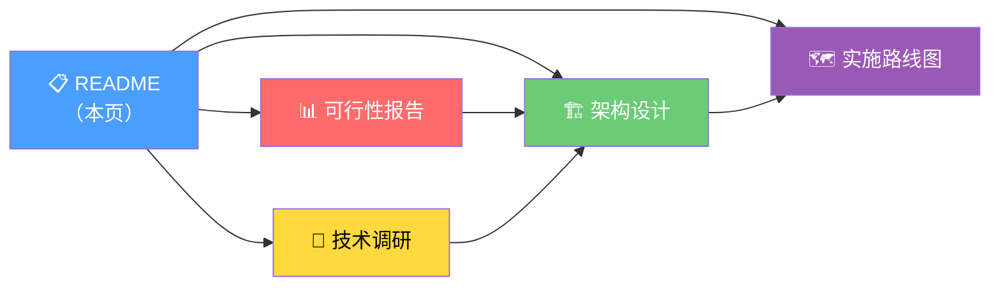
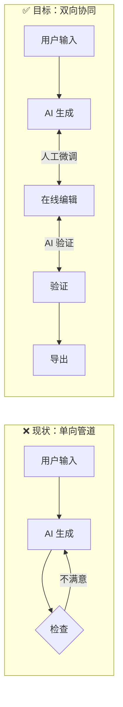

# Web 端 3D 模型在线编辑可行性研究

> [!abstract] 研究概述
> CADPilot 人机协同 3D 编辑能力研究与方案设计。
> 分析是否有必要、有可能实现类似传统工业 CAD 的 3D 模型在线编辑功能，
> 以补充 AI 管道覆盖不到的场景，实现真正的 ==人与 AI 协同驱动== 的 3D 模型设计和后处理。

---

## 核心结论

> [!success] 必要性：★★★★☆（高）
> 补充 AI 管道 15-40% 不完美场景，形成双向协同闭环，是 2026 年行业标准趋势。

> [!success] 可行性：★★★★☆（中高）
> 技术成熟（Three.js WebGPU + WASM CAD 内核），增量扩展成本可控。

> [!tip] 推荐路径
> ==混合分层架构==，从「选择与度量」起步，渐进式演进至 AI 辅助编辑。
> Phase A 可与 V3 管道开发 **立即并行启动**。

---

## 文档导航

| 序号 | 文档 | 内容 | 阅读建议 |
|:----:|------|------|---------|
| 1 | [[feasibility-report\|可行性分析报告]] | 必要性 + 可行性 + 风险评估 + 结论 | ==必读==，决策入口 |
| 2 | [[technology-landscape\|技术全景调研]] | 开源/商业 Web CAD、AI 集成、渲染技术 | 技术背景参考 |
| 3 | [[architecture-design\|混合分层架构设计]] | 5 级编辑能力、前后端组件、API、数据流 | 技术方案核心 |
| 4 | [[implementation-roadmap\|分阶段实施路线图]] | Phase A~D 任务分解、里程碑、资源 | 落地执行参考 |

---

## 研究背景

> [!question] 核心问题
> CADPilot V3 管道采用单向「输入 → AI 生成 → 输出」流程，
> 用户仅能在参数确认环节通过表单干预。
> **AI 生成结果不完美时，用户无法直接在 3D 场景中修正。**

---

## 快速行动项

- [ ] 评审本研究报告，确认方向
- [ ] 启动 [[implementation-roadmap#Phase A 选择与度量|Phase A]] 详细设计（前端 Viewer3D 扩展）
- [ ] 评估 opencascade.js 自定义构建的包体积和加载时间
- [ ] 调研 Zoo / Autodesk 的 AI 编辑交互模式，为 Phase D 储备灵感
