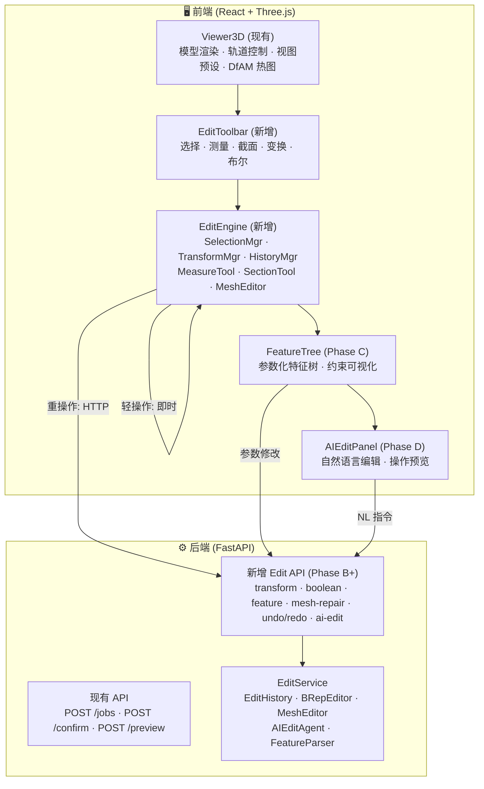
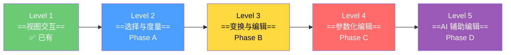
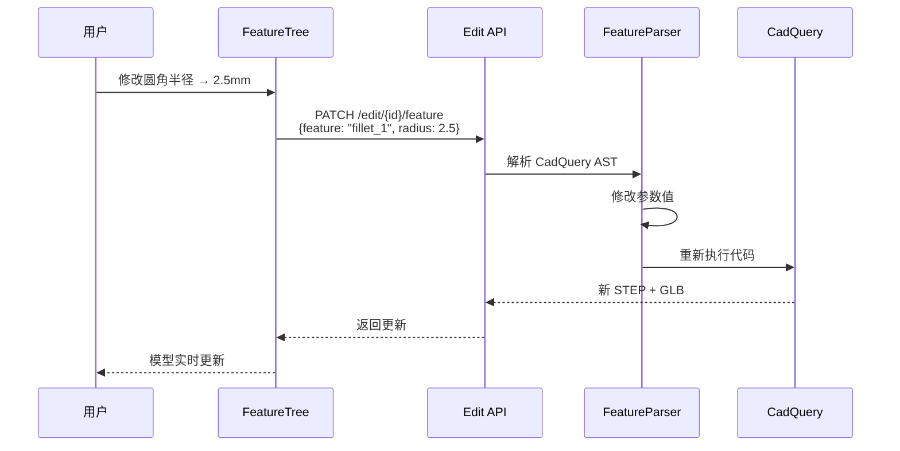
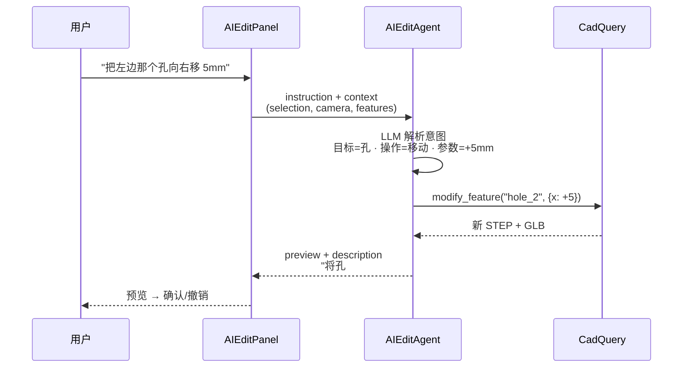
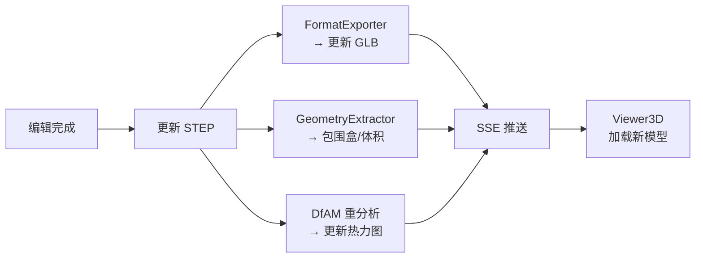

# 混合分层架构设计方案

> [!info] 导航
> ← [[README|研究首页]] · ← [[technology-landscape|技术调研]] · → [[implementation-roadmap|路线图]]

---

## 1. 设计原则

> [!abstract] 五条核心原则
> 1. **渐进增强** — 从只读交互到完整编辑，每个层级独立交付价值
> 2. **混合执行** — 轻操作前端即时执行，重操作后端 CadQuery 求值
> 3. **双路径编辑** — 参数化模型走 B-Rep，有机形态走网格
> 4. **管道兼容** — 编辑是管道的==补充==，不替代管道
> 5. **最小侵入** — 扩展现有组件，避免引入全新子系统

---

## 2. 整体架构



---

## 3. 分层编辑能力设计

### 五级编辑能力



### Level 1: 视图交互（已有）

> [!done] 已实现
>
> | 能力 | 实现方式 | 文件 |
> |------|---------|------|
> | 3D 模型渲染 | GLTFLoader + Three.js | `Viewer3D/index.tsx` |
> | 轨道相机控制 | OrbitControls | `Viewer3D/index.tsx` |
> | 视图预设 | 正/俯/侧/等轴 | `ViewControls.tsx` |
> | 线框切换 | wireframe toggle | `ViewControls.tsx` |
> | DfAM 热力图 | ShaderMaterial + vertex colors | `DfamShader.ts` |

### Level 2: 选择与度量（Phase A）

> [!tip] 纯前端，==无需后端参与==

> [!example]- SelectionManager — 核心选择系统
> ```typescript
> interface SelectionManager {
>   mode: 'face' | 'edge' | 'vertex' | 'body';
>   selected: Set<number>;          // 选中的面/边/顶点索引
>   highlighted: number | null;     // 悬停高亮
>
>   onPointerMove(event: PointerEvent): void;   // Raycaster 悬停检测
>   onPointerDown(event: PointerEvent): void;   // 点击选择
>   setMode(mode: SelectionMode): void;
>   clear(): void;
> }
> ```

> [!example]- MeasureTool — 测量工具
> ```typescript
> interface MeasureTool {
>   measureDistance(p1: Vector3, p2: Vector3): number;
>   measureAngle(p1: Vector3, p2: Vector3, p3: Vector3): number;
>   measureArea(faceIndex: number): number;
>   renderAnnotation(type: 'distance' | 'angle' | 'area', value: number): void;
> }
> ```

> [!example]- SectionTool — 截面工具
> ```typescript
> interface SectionTool {
>   plane: Plane;
>   enabled: boolean;
>   setPlane(normal: Vector3, distance: number): void;
>   toggleVisibility(): void;
>   getClippingPlane(): THREE.Plane;  // renderer.clippingPlanes
> }
> ```

**技术实现要点**：
- 射线拾取：`Three.Raycaster` + BufferGeometry face 索引
- 面高亮：修改选中面的 material color / emissive
- 边检测：`EdgesGeometry` 提取边 → 最近边检测
- 截面：`renderer.clippingPlanes` + Stencil Buffer 填充
- 标注渲染：`CSS2DRenderer` 或 `Sprite` 叠加

### Level 3: 变换与简单编辑（Phase B）

> [!important] 前端 vs 后端分工

| 操作 | 执行位置 | 原因 |
|------|:--------:|------|
| 移动/旋转/缩放整体 | 🖥️ 前端 | 仅变换矩阵，无需重算 |
| 简单 CSG（基元） | 🖥️ 前端 Manifold | 轻量级，即时响应 |
| 顶点拖拽 | 🖥️ 前端 | 直接操作 BufferGeometry |
| 参数化特征修改 | ⚙️ ==后端== | 需 CadQuery 重新求值 |
| 复杂布尔运算 | ⚙️ ==后端== | CadQuery 精度更高 |
| 网格修复 | ⚙️ ==后端== | trimesh/MeshHealer 更强 |

> [!example]- 核心接口定义
> ```typescript
> // TransformManager — 变换系统
> interface TransformManager {
>   mode: 'translate' | 'rotate' | 'scale';
>   space: 'local' | 'world';
>   attach(object: Object3D): void;
>   detach(): void;
>   onTransformEnd(): EditCommand;
> }
>
> // MeshEditor — 前端网格编辑（有机形态）
> interface MeshEditor {
>   dragVertex(index: number, newPos: Vector3): void;
>   extrudeFace(faceIndex: number, distance: number): void;
>   deleteFace(faceIndex: number): void;
>   booleanAdd(primitive: PrimitiveSpec): Mesh;
>   booleanSubtract(primitive: PrimitiveSpec): Mesh;
> }
>
> // HistoryManager — 操作历史 (Command Pattern)
> interface HistoryManager {
>   undoStack: EditCommand[];
>   redoStack: EditCommand[];
>   execute(command: EditCommand): void;
>   undo(): void;
>   redo(): void;
> }
>
> interface EditCommand {
>   type: string;
>   params: Record<string, unknown>;
>   execute(): void;
>   undo(): void;
>   description: string;
> }
> ```

### Level 4: 参数化编辑（Phase C）

> [!important] 需要前后端深度配合



> [!example]- FeatureParser 后端实现
> ```python
> class FeatureParser:
>     """从 CadQuery 代码中解析参数化特征树"""
>
>     def parse(self, cadquery_code: str) -> FeatureTree:
>         """AST 分析 CadQuery 方法链，识别 .fillet() .chamfer() .hole() 等"""
>         pass
>
>     def modify_feature(self, code: str, feature_id: str, new_params: dict) -> str:
>         """修改特征参数，返回新代码"""
>         pass
>
>     def rebuild(self, modified_code: str) -> tuple[Path, bytes]:
>         """重新执行代码，返回 (STEP路径, GLB字节)"""
>         pass
> ```

### Level 5: AI 辅助编辑（Phase D）



---

## 4. 数据流设计

### 4.1 CadJobState 扩展

> [!example]- 新增编辑状态字段
> ```python
> class CadJobState(TypedDict):
>     # --- 现有字段 ---
>     job_id: str
>     input_type: str
>     step_path: Optional[str]
>     model_url: Optional[str]
>     # ...
>
>     # --- 新增编辑状态 ---
>     edit_history: list[EditCommand]       # 编辑操作历史
>     edit_snapshot_paths: list[str]        # 每步 STEP 快照
>     current_edit_version: int             # 当前版本号
>     feature_tree: Optional[FeatureTree]   # 解析后的特征树
>     is_edited: bool                       # 标记与原始生成的差异
> ```

### 4.2 编辑后重新验证



---

## 5. 前端组件结构

```
frontend/src/components/
├── Viewer3D/                    # 现有，扩展
│   ├── index.tsx                # 添加 editMode 切换
│   ├── ViewControls.tsx
│   ├── DfamShader.ts
│   └── HeatmapLegend.tsx
│
├── Editor3D/                    # ✨ 新增
│   ├── index.tsx                # 编辑模式容器
│   ├── EditToolbar.tsx          # 工具栏
│   ├── SelectionManager.tsx     # 选择系统 ← Phase A
│   ├── MeasureTool.tsx          # 测量工具 ← Phase A
│   ├── SectionTool.tsx          # 截面工具 ← Phase A
│   ├── TransformControls.tsx    # 变换控件 ← Phase B
│   ├── MeshEditor.tsx           # 网格编辑 ← Phase B
│   ├── BooleanTool.tsx          # 布尔工具 ← Phase B
│   ├── HistoryPanel.tsx         # 历史面板 ← Phase B
│   ├── FeatureTree.tsx          # 特征树   ← Phase C
│   └── AIEditPanel.tsx          # AI 编辑  ← Phase D
│
├── hooks/                       # ✨ 新增
│   ├── useSelection.ts
│   ├── useEditHistory.ts
│   ├── useTransform.ts
│   └── useMeshEdit.ts
│
└── stores/
    └── editStore.ts             # ✨ Zustand 编辑状态
```

---

## 6. 后端模块结构

```
backend/
├── api/v1/
│   ├── edit.py                  # ✨ 编辑 API 路由
│   └── ...                      # 现有路由不变
│
├── core/
│   ├── edit_service.py          # ✨ 编辑服务核心
│   ├── brep_editor.py           # ✨ B-Rep 编辑操作
│   ├── mesh_editor.py           # ✨ 网格编辑操作
│   ├── edit_history.py          # ✨ 编辑历史管理
│   ├── feature_parser.py        # ✨ CadQuery 特征解析
│   ├── ai_edit_agent.py         # ✨ AI 编辑 Agent (Phase D)
│   └── ...                      # 现有核心模块不变
│
└── graph/
    └── state.py                 # 扩展 CadJobState
```

---

## 7. 新增 API 端点

> [!example]- Edit API 完整定义 (Phase B+)
>
> | 端点 | 方法 | 描述 | Phase |
> |------|------|------|:-----:|
> | `/api/v1/edit/{job_id}/transform` | POST | 应用变换矩阵到 STEP | B |
> | `/api/v1/edit/{job_id}/boolean` | POST | CSG 布尔运算 | B |
> | `/api/v1/edit/{job_id}/mesh-repair` | POST | 网格修复（填洞/平滑） | B |
> | `/api/v1/edit/{job_id}/undo` | POST | 撤销上一步 | B |
> | `/api/v1/edit/{job_id}/redo` | POST | 重做 | B |
> | `/api/v1/edit/{job_id}/feature` | POST | 修改参数化特征 | C |
> | `/api/v1/edit/{job_id}/ai-edit` | POST | 自然语言编辑指令 | D |

---

## 8. 性能目标

### 前端延迟

| 操作 | 目标 | 策略 |
|------|:----:|------|
| 悬停高亮 | < 16ms | Raycaster + GPU picking |
| 点击选择 | < 50ms | BVH 空间索引 |
| 变换拖拽 | < 16ms | TransformControls 原生 |
| 截面切割 | < 100ms | clippingPlanes (GPU) |
| 网格 CSG | < 500ms | Manifold WASM + Web Worker |

### 后端延迟

| 操作 | 目标 | 策略 |
|------|:----:|------|
| 参数修改 → 重算 | < 3s | CadQuery 增量执行 + 缓存 |
| 布尔运算 | < 5s | CadQuery + 结果缓存 |
| DfAM 重分析 | < 10s | 异步 + SSE 推送 |
| AI 编辑指令 | < 5s | LLM → CadQuery 流式预览 |

### 内存优化策略

> [!tip] 四项优化
> - **LOD 渲染** — 远距离用低多边形
> - **按需加载** — 编辑模式时才加载 WASM
> - **Web Worker** — Manifold CSG 不阻塞主线程
> - **GLB 差量更新** — 仅传输变化的网格数据

---

## 9. 安全考量

| 风险 | 缓解策略 |
|------|---------|
| CadQuery 代码注入 | 已有 Jinja2 沙箱环境 (TemplateEngine) |
| WASM 内存溢出 | Memory Limit + 超时中断 |
| 大文件 DoS | API 限制上传大小和频率 |
| 编辑操作竞态 | Job 级别乐观锁（版本号） |

---

> [!info] 继续阅读
> → [[implementation-roadmap|分阶段实施路线图]]：详细任务分解与资源估算
