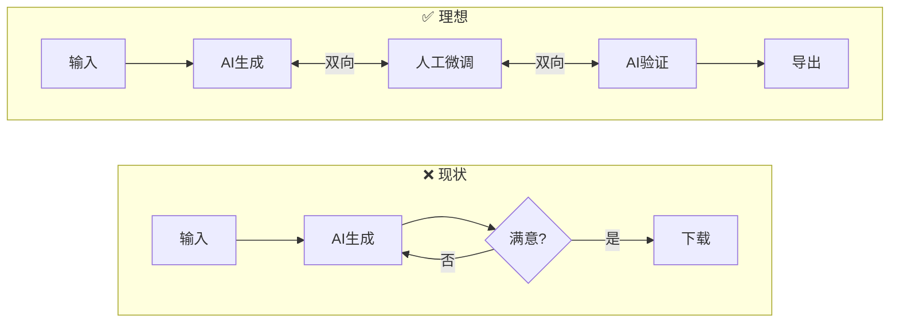

# 可行性分析报告

> [!info] 导航
> ← 返回 [[README|研究首页]] · 下一步 → [[technology-landscape|技术调研]] → [[architecture-design|架构设计]] → [[implementation-roadmap|路线图]]

---

## 1. 研究目标

分析 CADPilot 是否有必要、有可能实现类似传统工业 CAD 软件的 3D 模型在线编辑功能，
以补充 AI 管道覆盖不到的处理任务，实现真正的人与 AI 协同驱动的 3D 模型设计和后处理。

---

## 2. 当前 CADPilot 3D 能力现状

### 2.1 已有能力

> [!done] 已实现的 3D 功能
>
> | 能力 | 技术栈 | 位置 |
> |------|--------|------|
> | 3D 模型预览 | Three.js + @react-three/fiber + GLTFLoader | `Viewer3D/` |
> | 轨道相机控制 | OrbitControls + 视图预设 | `ViewControls.tsx` |
> | 线框模式切换 | 实体/线框动态切换 | `Viewer3D/index.tsx` |
> | DfAM 热力图 | 自定义 ShaderMaterial + 顶点颜色 | `DfamShader.ts` |
> | 参数化实时预览 | CadQuery → STEP → GLB → 前端 | `PrecisionWorkbench/` |
> | 格式转换 | STEP ↔ STL ↔ GLB ↔ 3MF | `format_exporter.py` |
> | 参数表单交互 | 滑块/输入框/开关 + 约束警告 | `ParamForm/` |

### 2.2 缺失能力

> [!failure] 在线编辑相关能力全部缺失
>
> | 能力 | 影响范围 |
> |------|---------|
> | 3D 场景内拾取/选择 | 无法选中面/边/顶点进行操作 |
> | 几何体直接编辑 | 无法拖拽、移动、旋转子对象 |
> | 特征级参数编辑 | 无法直接修改孔径、圆角半径等 |
> | CSG 布尔运算交互 | 无法在浏览器中做加/减/交 |
> | 操作历史 / Undo-Redo | RollbackTracker 存在但未集成到 UI |
> | 2D 草图约束编辑 | 无草图编辑器 |
> | 截面查看 / 测量工具 | 无法查看内部或度量距离 |

### 2.3 管道中需要人工干预但缺乏工具的环节

> [!warning] 核心痛点
> 约 ==60%== 的「修改参数重新生成」操作可通过轻量级在线编辑直接解决。

| 环节 | 当前应对 | 理想方式 | 节省时间 |
|------|---------|---------|---------|
| AI 生成孔位偏移 | 修改参数重新生成 (5-30s) | 直接 3D 拖拽移动 | ~90% |
| 多余特征需删除 | 重写 prompt 重试 | CSG 减法删除 | ~90% |
| 壁厚不均需加厚 | ==无法处理== | 网格编辑加厚 | 从无到有 |
| 有机网格破损 | 放弃（失败率 ~15%） | 手动修复网格 | 从无到有 |
| 悬垂角过大 | 只能查看报告 | 添加支撑几何体 | 从无到有 |
| 两零件装配对齐 | 无装配功能 | 变换对齐操作 | 从无到有 |
| 圆角尺寸微调 | 拖滑块等预览反复 | 3D 中拖拽调整 | ~80% |

---

## 3. 必要性分析

### 3.1 产品视角

> [!danger] 当前管道的核心限制
> 单向生成流程，缺乏编辑闭环。每次「重新生成」意味着：
> - 完整管道重新执行（5-30 秒延迟）
> - 可能引入新的不可预测变化
> - 用户对生成结果的==控制感弱==

### 3.2 竞争格局

> [!warning] CADPilot 在线编辑能力在竞品中处于落后位置

| 竞品 | AI 生成 | 在线编辑 | 融合度 |
|------|---------|---------|--------|
| **Zoo (KittyCAD)** | Text-to-CAD B-Rep | 完整参数化 + Zookeeper Agent | ★★★★★ |
| **Autodesk Fusion + AI** | Text→原生几何 + 命令生成 | Fusion 全功能 | ★★★★★ |
| **Onshape (PTC)** | AI Advisor | 工业级全功能 | ★★★★☆ |
| **AdamCAD** | NL→参数化 CAD | 基础参数化 | ★★★☆☆ |
| **MecAgent** | 文本→3D + 标准检查 | 集成主流 CAD | ★★★☆☆ |
| ==**CADPilot**== | Text/Drawing/Organic→3D | ==仅参数表单== | ==★★☆☆☆== |

### 3.3 必要性结论

> [!success] 评级：★★★★☆（高）
> - 补充 AI 管道 15-40% 的不完美场景，避免反复「重新生成」
> - 形成 AI ↔ 人工双向协同闭环，是 ==2026 年行业标准趋势==
> - 竞品已全面布局，不做则差距持续拉大
> - 即使只实现 Level 2（选择与度量），也能显著提升产品体验

---

## 4. 技术可行性分析

### 4.1 关键技术就绪度

| 技术 | 成熟度 | 与 CADPilot 兼容性 | 风险 |
|------|--------|-------------------|------|
| Three.js + WebGPU | ★★★★★ | 已在用，升级即可 | 低 |
| opencascade.js (WASM) | ★★★★☆ | 与后端 CadQuery/OCCT 一致 | 中 |
| Manifold CSG (WASM) | ★★★★☆ | 后端已用 manifold3d | 低 |
| Three.js Raycaster | ★★★★★ | 原生 API，零依赖 | 极低 |
| WebGPU Compute Shader | ★★★★☆ | Safari 26 后全浏览器支持 | 低 |
| trimesh（后端网格） | ★★★★★ | 已在用 | 极低 |

> [!tip] 详细技术调研
> 完整的技术全景分析见 → [[technology-landscape|技术全景调研]]

### 4.2 方案对比

| 方案 | 工作量 | 兼容性 | 编辑能力 | 推荐 |
|------|--------|--------|---------|------|
| A: 纯网格编辑 | 2-3 月 | ★★★★★ | 基础 | ★★★☆☆ |
| B: OCCT WASM 完整 | 6-12 月 | ★★★★☆ | 工业级 | ★★☆☆☆ |
| ==**C: 混合分层**== | ==3-5 月== | ==★★★★★== | ==渐进式 80%== | ==★★★★★== |
| D: 集成开源编辑器 | 2-4 月 | ★★★☆☆ | 取决于项目 | ★★★☆☆ |

### 4.3 推荐方案

> [!tip] 混合分层架构
> - **轻操作**（选择、度量、变换、简单网格编辑）→ ==前端 Three.js 即时执行==
> - **重操作**（参数化特征修改、B-Rep 布尔运算）→ ==后端 CadQuery 执行==
> - **AI 辅助**（自然语言编辑指令翻译）→ ==后端 LLM + CadQuery 联合==
>
> 详细设计见 → [[architecture-design|混合分层架构设计]]

### 4.4 可行性结论

> [!success] 评级：★★★★☆（中高）
> - 所有关键技术已成熟且有生产验证
> - CADPilot 已有 3D 预览基础设施，增量扩展成本可控
> - 混合方案避免了「从零构建 Onshape」的不切实际路径
> - Phase A 起步仅需 ==1-2 个月==，风险极低

---

## 5. 风险评估

> [!danger] 高严重度风险

| 风险 | 严重度 | 可能性 | 缓解策略 |
|------|:------:|:------:|---------|
| 网格编辑后精度丢失 | 🔴 高 | 🟡 中 | 参数化路径保持 B-Rep，仅有机形态用网格编辑 |
| 编辑状态与管道同步 | 🔴 高 | 🟡 中 | 扩展 CadJobState，单一数据源 |

> [!warning] 中严重度风险

| 风险 | 严重度 | 可能性 | 缓解策略 |
|------|:------:|:------:|---------|
| WASM 包过大 | 🟡 中 | 🟠 高 | 自定义构建裁剪；按需懒加载；gzip |
| 浏览器内存不足 | 🟡 中 | 🟢 低 | LOD 渲染 + 八叉树 + 后端降采样 |
| 开发影响 V3 交付 | 🟡 中 | 🟡 中 | Phase A 独立于管道，可并行推进 |
| 用户学习成本 | 🟢 低 | 🟢 低 | 渐进式引入，Level 1-2 无新概念 |

---

## 6. 总结与建议

> [!abstract] 四条核心结论
> 1. **有必要** — 在线编辑是 AI→人→AI 协同闭环的关键缺失环节
> 2. **技术可行** — Three.js WebGPU + WASM CAD 内核 + 后端 CadQuery 成熟可控
> 3. **渐进实施** — 从选择与度量起步，逐步演进到 AI 辅助编辑
> 4. **立即可做** — Phase A 不依赖后端改动，可与 V3 管道 ==并行启动==

### 下一步行动

- [ ] 评审本研究报告，确认方向
- [ ] 启动 [[implementation-roadmap#Phase A 选择与度量|Phase A]] 详细设计
- [ ] 评估 opencascade.js 自定义构建的包体积
- [ ] 调研 Zoo / Autodesk 的 AI 编辑交互模式

> [!tip] 继续阅读
> → [[technology-landscape|技术全景调研]]：了解行业技术格局
> → [[architecture-design|架构设计]]：查看详细技术方案
> → [[implementation-roadmap|路线图]]：查看分阶段实施计划
