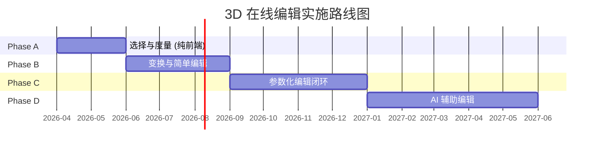

# 分阶段实施路线图

> [!info] 导航
> ← [[README|研究首页]] · ← [[architecture-design|架构设计]] · 参考 [[technology-landscape|技术调研]]

---

## 总览



> [!abstract] 四阶段概览
>
> | Phase | 名称 | 周期 | 实现层 | 核心交付 |
> |:-----:|------|:----:|--------|---------|
> | ==A== | 选择与度量 | 1-2 月 | 纯前端 | 选中/高亮 · 测量 · 截面 · 标注 |
> | **B** | 变换与简单编辑 | 2-3 月 | 前端+后端 | 移动/旋转 · CSG · 网格修补 · Undo |
> | **C** | 参数化编辑闭环 | 3-4 月 | 前后端深度配合 | 特征树 · 参数修改 · 约束可视化 |
> | **D** | AI 辅助编辑 | 4-6 月 | LLM + CadQuery | NL 编辑指令 · 自动修复建议 |

---

## Phase A: 选择与度量

> [!tip] 立即可启动，与 V3 管道开发 ==完全并行==

### 目标

让用户能在 3D 场景中「指出」问题位置、精确度量、查看模型内部。
==即使不编辑，也显著提升 AI 生成后的审查体验。==

### 功能范围

| 功能 | 优先级 | 实现层 |
|------|:------:|:------:|
| 面/边选择与高亮 | P0 | 前端 |
| 两点距离测量 | P0 | 前端 |
| 截面查看（任意平面） | P0 | 前端 |
| 三点角度测量 | P1 | 前端 |
| 面积计算 | P1 | 前端 |
| 3D 文字标注 | P1 | 前端 |
| 法向量显示 | P2 | 前端 |
| 曲率可视化 | P2 | 前端 |

### 技术任务

> [!example]- A.1 选择系统 (SelectionManager) — 3-5 天
> **文件**：`frontend/src/components/Editor3D/SelectionManager.tsx`
>
> - [ ] Three.js Raycaster 射线拾取
> - [ ] BufferGeometry face index → 反查顶点/边
> - [ ] 面选择模式：高亮整个三角面
> - [ ] 边选择模式：EdgesGeometry → 最近边检测
> - [ ] 多选支持：Shift+Click 追加选择
> - [ ] 选择反馈：发光材质 + 信息面板
>
> 依赖：无后端依赖

> [!example]- A.2 测量工具 (MeasureTool) — 3-5 天
> **文件**：`frontend/src/components/Editor3D/MeasureTool.tsx`
>
> - [ ] 两点距离：点击 → 欧氏距离 → 标注线 + 数值
> - [ ] 三点角度：计算夹角 → 角度弧 + 数值
> - [ ] 面积：选中面 → 三角形面积之和
> - [ ] 标注渲染：CSS2DRenderer (HTML overlay) + 引导线
>
> 依赖：A.1 选择系统

> [!example]- A.3 截面工具 (SectionTool) — 3-5 天
> **文件**：`frontend/src/components/Editor3D/SectionTool.tsx`
>
> - [ ] 截面平面定义（法向量 + 偏移距离）
> - [ ] `renderer.clippingPlanes` 裁剪渲染
> - [ ] Stencil Buffer 截面轮廓线
> - [ ] 截面平面拖拽控制
> - [ ] 快捷预设：XY / XZ / YZ 三主平面
>
> 依赖：无

> [!example]- A.4 编辑工具栏 (EditToolbar) — 2-3 天
> **文件**：`frontend/src/components/Editor3D/EditToolbar.tsx`
>
> - [ ] 工具模式切换按钮组
> - [ ] 选择模式子菜单（面/边/顶点）
> - [ ] 当前选择信息面板
> - [ ] 快捷键绑定
>
> 依赖：A.1-A.3

> [!example]- A.5 集成到 Viewer3D — 2-3 天
> **修改**：`frontend/src/components/Viewer3D/index.tsx`
>
> - [ ] 添加 `editMode: boolean` 状态
> - [ ] editMode 启用时加载 Editor3D
> - [ ] 解决 OrbitControls 与编辑工具的输入冲突
> - [ ] 工具栏布局与 ViewControls 整合
>
> 依赖：A.1-A.4

### Phase A 总结

> [!success] Phase A 总结
>
> | 维度 | 详情 |
> |------|------|
> | 总工时 | ==15-20 个工作日== |
> | 新增文件 | 5-7 个前端组件 |
> | 后端改动 | 无 |
> | 风险 | 🟢 低（纯前端，不影响现有功能） |
> | 可并行 | ✅ 与 V3 管道完全并行 |

---

## Phase B: 变换与简单编辑

> [!important] 处理 ==60%== 的「重新生成」场景

### 目标

用户可以直接移动、删除、添加几何体，配合 Undo/Redo 操作历史。

### 功能范围

| 功能 | 优先级 | 实现层 |
|------|:------:|--------|
| 整体移动/旋转/缩放 | P0 | 前端 |
| Undo / Redo | P0 | 前端 + 后端 |
| CSG 添加/减去基元 | P0 | 前端 Manifold + 后端 |
| 顶点拖拽（有机） | P1 | 前端 |
| 面挤出（有机） | P1 | 前端 |
| 网格修补 | P1 | 后端 trimesh |
| 操作历史面板 | P1 | 前端 |
| 编辑后自动 DfAM | P2 | 后端 |

### 技术任务

> [!example]- B.1 变换控件 — 5-7 天
> - [ ] Three.js TransformControls 集成
> - [ ] 平移/旋转/缩放模式切换 + 坐标系切换
> - [ ] 网格吸附（可选）
> - [ ] 变换完成 → 生成 TransformCommand
> - [ ] 前端即时（Object3D.matrix）；后端持久化（STEP 变换）

> [!example]- B.2 操作历史系统 — 5-7 天
> - [ ] Command Pattern 基类：`execute()` / `undo()` / `description`
> - [ ] UndoStack + RedoStack
> - [ ] 前端操作 → 即时撤销
> - [ ] 后端操作 → STEP 快照撤销
> - [ ] 操作历史面板 UI

> [!example]- B.3 布尔运算工具 — 7-10 天
> - [ ] 基元选择器（长方体/圆柱/球体/圆锥）
> - [ ] 基元参数面板 + 操作选择（加/减/交）
> - [ ] 前端预览：Manifold WASM 实时计算
> - [ ] 确认后发送后端 CadQuery 精确执行

> [!example]- B.4 网格编辑工具（有机形态） — 7-10 天
> - [ ] 顶点拖拽 → 更新 BufferGeometry
> - [ ] 面挤出 → 沿法线方向
> - [ ] 网格平滑 → Laplacian
> - [ ] 填补空洞 → 边界边检测 + 三角化

> [!example]- B.5 后端编辑 API — 10-15 天
> 新增文件：
> - `backend/api/v1/edit.py`
> - `backend/core/edit_service.py`
> - `backend/core/brep_editor.py`
> - `backend/core/edit_history.py`
>
> API 端点见 [[architecture-design#7. 新增 API 端点|架构设计 - API 定义]]

> [!example]- B.6 编辑后自动验证 — 3-5 天
> - [ ] 编辑完成 → 自动触发 FormatExporter 更新 GLB
> - [ ] 可选触发 GeometryExtractor 更新包围盒/体积
> - [ ] 可选触发 DfAM 重分析（异步 + SSE）

### Phase B 总结

> [!warning] Phase B 总结
>
> | 维度 | 详情 |
> |------|------|
> | 总工时 | ==40-55 个工作日== |
> | 新增前端 | 5-8 个组件 |
> | 新增后端 | 4-5 个模块，5 个 API 端点 |
> | 风险 | 🟡 中（前后端联调、Manifold WASM 集成） |
> | 依赖 | Phase A 完成 |

---

## Phase C: 参数化编辑闭环

> [!important] 特征级参数修改，==无需重走全管道==

### 目标

在 3D 场景中可视化特征树并直接修改参数，实现参数化编辑闭环。

### 功能范围

| 功能 | 优先级 | 实现层 |
|------|:------:|--------|
| CadQuery 代码特征解析 | P0 | 后端 |
| 特征树面板 | P0 | 前端 |
| 特征参数直接修改 | P0 | 前后端 |
| 特征高亮（3D 标识面） | P1 | 前端 |
| 约束关系可视化 | P1 | 前端 |
| 参数历史比较 | P2 | 前后端 |
| 版本分支 | P2 | 后端 |

### 技术任务

> [!example]- C.1 CadQuery 特征解析器 — 15-20 天
> **文件**：`backend/core/feature_parser.py`
>
> - [ ] AST 分析 CadQuery 方法调用链
> - [ ] 识别 `.fillet()` `.chamfer()` `.hole()` `.extrude()` `.revolve()` 等
> - [ ] 提取参数名、当前值、合法范围
> - [ ] 构建 FeatureTree 数据结构
> - [ ] 参数修改 → 代码替换 → 重新执行
>
> > [!warning] 关键挑战
> > - CadQuery 方法链可能很复杂
> > - 部分参数是表达式而非字面值
> > - 需要处理模板渲染后的代码

> [!example]- C.2 特征树面板 — 10-15 天
> **文件**：`frontend/src/components/Editor3D/FeatureTree.tsx`
>
> - [ ] 树形结构展示特征列表
> - [ ] 类型图标 + 参数摘要
> - [ ] 展开节点 → 参数编辑表单（复用 ParamField）
> - [ ] debounce → `POST /api/v1/edit/{id}/feature`
> - [ ] 悬停特征 → 3D 中对应面/边高亮

> [!example]- C.3 增量重算与差量更新 — 10-15 天
> - [ ] 后端修改 CadQuery 参数 → 重新执行
> - [ ] 只重新生成变化的 GLB 部分
> - [ ] 前端接收更新 → 平滑过渡动画
> - [ ] 失败回退：新参数导致几何错误时恢复原值

### Phase C 总结

> [!danger] Phase C 总结
>
> | 维度 | 详情 |
> |------|------|
> | 总工时 | ==40-55 个工作日== |
> | 核心难点 | CadQuery 代码 AST 解析 |
> | 风险 | 🟠 中高（CadQuery 代码多样性） |
> | 依赖 | Phase B 完成 |

---

## Phase D: AI 辅助编辑

> [!important] 自然语言驱动编辑 — ==终极目标==

### 目标

用户用中文/英文描述编辑意图，AI 翻译为具体操作并执行。

### 功能范围

| 功能 | 优先级 | 实现层 |
|------|:------:|--------|
| 自然语言→编辑操作翻译 | P0 | 后端 LLM |
| 上下文感知 | P0 | 前后端 |
| 操作预览与确认 | P0 | 前端 |
| 多轮对话编辑 | P1 | 后端 |
| DfAM 问题自动修复建议 | P1 | 后端 |
| 批量编辑指令 | P2 | 后端 |
| 设计意图学习 | P2 | 后端 ML |

### 技术任务

> [!example]- D.1 AI 编辑 Agent — 15-20 天
> **文件**：`backend/core/ai_edit_agent.py`
>
> - [ ] 接收 NL 指令 + 上下文（选择、几何、特征树）
> - [ ] LLM 解析：目标识别 + 操作类型 + 参数提取
> - [ ] 映射到 FeatureModify / Boolean / Transform
> - [ ] 执行并生成预览
> - [ ] 返回结果描述 + 确认请求
>
> Prompt 要点：几何摘要、工程术语、中英文混合支持

> [!example]- D.2 前端 AI 编辑面板 — 7-10 天
> **文件**：`frontend/src/components/Editor3D/AIEditPanel.tsx`
>
> - [ ] 聊天式输入界面
> - [ ] 编辑前/后模型对比预览
> - [ ] 确认/撤销按钮
> - [ ] 历史对话记录 + 快捷指令建议

> [!example]- D.3 DfAM 自动修复建议 — 10-15 天
> - [ ] DfAM 检测问题 → AIEditAgent 生成修复方案
> - [ ] 前端展示建议（如 "建议添加 2mm 壁厚"）
> - [ ] 一键应用 → 执行编辑 → 重新验证

### Phase D 总结

> [!danger] Phase D 总结
>
> | 维度 | 详情 |
> |------|------|
> | 总工时 | ==35-50 个工作日== |
> | 核心难点 | LLM 对 CAD 编辑操作的准确翻译 |
> | 风险 | 🔴 高（AI 理解准确率、边界情况） |
> | 依赖 | Phase C 完成 |

---

## 关键里程碑


---

## 资源需求估算

| Phase | 前端 | 后端 | AI/ML | 总人天 |
|:-----:|:----:|:----:|:-----:|:------:|
| A | 15-20 天 | 0 | 0 | ==15-20== |
| B | 20-30 天 | 15-25 天 | 0 | ==35-55== |
| C | 15-20 天 | 25-35 天 | 0 | ==40-55== |
| D | 10-15 天 | 15-20 天 | 10-15 天 | ==35-50== |
| **总计** | **60-85 天** | **55-80 天** | **10-15 天** | **125-180** |

---

## 技术依赖

> [!example]- Phase A — 无新增依赖
> Three.js Raycaster、EdgesGeometry、CSS2DRenderer 均为内置。
> 可选 `@react-three/drei` 中的 TransformControls 工具。

> [!example]- Phase B — 前端新增 manifold-3d
> ```bash
> cd frontend && npm install manifold-3d    # Manifold WASM CSG
> # 后端无新增（CadQuery、trimesh、manifold3d 均已安装）
> ```

> [!example]- Phase C — 后端可选 astunparse
> ```bash
> uv add astunparse    # Python AST 操作辅助库
> ```

> [!example]- Phase D — 无新增
> 后端 LangChain 已安装，复用现有 LLM 基础设施。

---

## 启动建议

> [!todo] 行动计划
> - [ ] ==立即启动 Phase A== — 纯前端，15-20 天可交付
> - [ ] Phase A 期间评估 opencascade.js 自定义构建可行性
> - [ ] Phase B 前设计 Edit API 契约，前后端对齐
> - [ ] Phase C 前收集 CadQuery 代码样本，评估 AST 解析难度
> - [ ] Phase D 前调研 Zoo Zookeeper / Autodesk Assistant 交互模式

---

> [!info] 相关文档
> - [[README|研究首页]] — 总览与核心结论
> - [[feasibility-report|可行性报告]] — 必要性与可行性分析
> - [[technology-landscape|技术调研]] — 行业技术全景
> - [[architecture-design|架构设计]] — 混合分层方案详细设计
