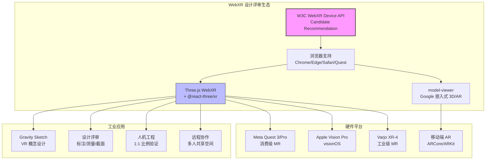
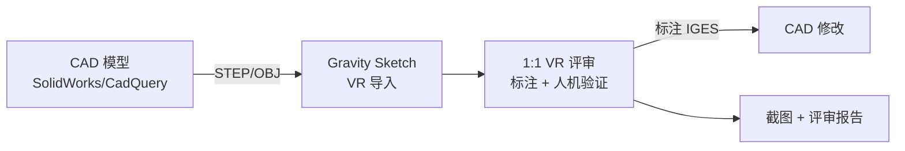
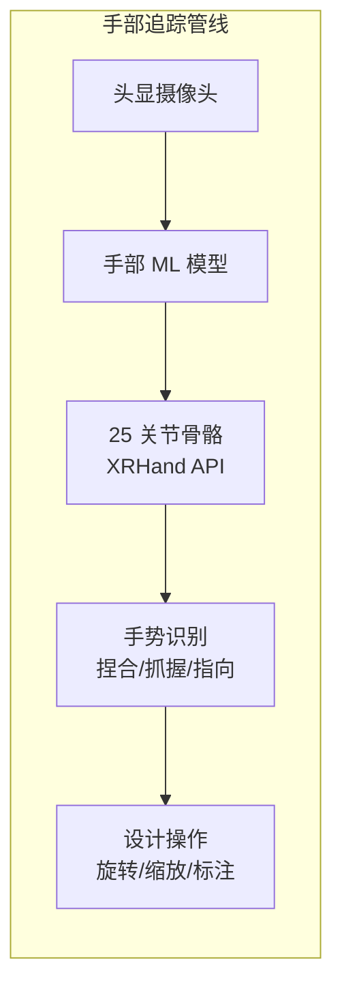
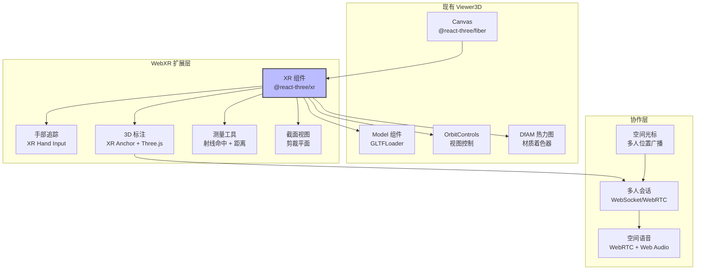

# WebXR 设计评审方案深度调研

> [!abstract] 核心价值
> 本文系统调研了 WebXR 技术在工业 CAD 设计评审中的应用方案，涵盖 WebXR Device API（W3C 标准）及浏览器支持现状、Three.js WebXR 模块与 @react-three/xr 扩展、Google model-viewer 嵌入式 3D/AR 查看、Gravity Sketch（VR CAD 设计）、Varjo（工业级 XR 头显）、Apple Vision Pro，以及手部追踪、眼动追踪、空间音频等交互 API。最终给出 CADPilot V3 Viewer3D 扩展 WebXR 的分阶段方案。

---

## 技术全景



---

## 1. WebXR Device API（W3C 标准）

### 1.1 规范状态

| 维度 | 详情 |
|------|------|
| **标准阶段** | ==W3C Candidate Recommendation Draft==（2025.10.01） |
| **治理文件** | W3C Process Document（2025.08.18） |
| **核心能力** | immersive-vr、immersive-ar、inline 三种会话模式 |
| **输入模式** | 控制器、手部追踪、注视+捏合（transient-pointer，Apple 贡献） |
| **空间追踪** | 6DoF 头部追踪、XRReferenceSpace（local/bounded-floor/unbounded） |

### 1.2 浏览器支持矩阵（2026.03 更新）

| 浏览器 | VR 支持 | AR 支持 | 手部追踪 | 备注 |
|--------|--------|--------|---------|------|
| **Chrome Desktop** (79+) | ✅ | ✅ | ✅（via Quest） | 最完整支持 |
| **Chrome Android** | ✅ | ✅（ARCore） | ❌ | AR 通过 Scene Viewer |
| **Edge** (79+) | ✅ | ✅ | ✅ | Chromium 内核，等同 Chrome |
| **Safari visionOS** | ✅ | ==❌（仅 VR）== | ✅（注视+捏合） | Apple 私有 transient-pointer 模式 |
| **Safari macOS/iOS** | ❌ | 部分（Quick Look） | ❌ | 仅 USDZ Quick Look AR |
| **Firefox Desktop** | ✅ | ✅ | ✅ | 完整支持 |
| **Firefox Android** | ==❌== | ==❌== | ❌ | 不支持 WebXR |
| **Meta Quest Browser** | ✅ | ✅（Passthrough） | ✅ | ==最佳 WebXR 平台==（平面检测/锚点/命中测试） |
| **Samsung Internet** (13+) | ❌ | ✅ | ❌ | Galaxy 设备 AR 优化 |
| **Opera** (58+) | ✅ | ✅ | 有限 | 桌面+移动端 |

> [!warning] 关键发现
> ==Safari visionOS 目前仅支持 immersive-vr，不支持 immersive-ar（Passthrough）==。Apple 的 AR 体验仍通过原生 visionOS API 而非 WebXR 实现。Meta Quest Browser 是当前 WebXR 功能最全的平台。

### 1.3 WebXR 模块扩展

| 模块 | 状态 | 功能 |
|------|------|------|
| **WebXR Hit Test** | Draft | 射线与真实表面碰撞检测 |
| **WebXR Anchors** | Draft | 空间锚点持久化 |
| **WebXR Plane Detection** | Draft | 平面检测（桌面/墙面/地板） |
| **WebXR Hand Input** | Draft | 25 关节手部骨骼追踪 |
| **WebXR Mesh Detection** | Proposal | 环境网格重建 |
| **WebXR DOM Overlay** | Experimental | XR 场景中显示 HTML UI |
| **WebXR Depth Sensing** | Draft | 深度图获取（遮挡处理） |
| **WebXR Layers** | Draft | 高清纹理图层（减少伪影） |

---

## 2. Three.js WebXR 集成方案

### 2.1 @react-three/xr（PMNDRS 生态）⭐

> [!tip] CADPilot 最佳选择
> CADPilot V3 前端已使用 ==@react-three/fiber + @react-three/drei==，@react-three/xr 是自然扩展路径，零架构迁移成本。

| 维度 | 详情 |
|------|------|
| **包名** | `@react-three/xr` |
| **版本** | v6.6.29（2026.01） |
| **语言** | TypeScript（98.9%） |
| **Stars** | 2.6k |
| **安装** | `npm install @react-three/xr@latest` |

#### 核心 API

```typescript
import { createXRStore, XR } from '@react-three/xr'

// 创建 XR Store
const xrStore = createXRStore()

// 在 Canvas 中启用 XR
function App() {
  return (
    <>
      <button onClick={() => xrStore.enterVR()}>进入 VR</button>
      <button onClick={() => xrStore.enterAR()}>进入 AR</button>
      <Canvas>
        <XR store={xrStore}>
          {/* 现有 Viewer3D 内容 */}
          <Model url={modelUrl} />
          <OrbitControls />
          <Environment preset="studio" />
        </XR>
      </Canvas>
    </>
  )
}
```

#### 支持的 XR 功能

| 功能 | 支持 | 说明 |
|------|------|------|
| VR 会话 | ✅ | `enterVR()` |
| AR 会话 | ✅ | `enterAR()`，含 Passthrough |
| 手部追踪 | ✅ | 25 关节骨骼模型 |
| 控制器输入 | ✅ | 按钮/摇杆/触控板映射 |
| 命中测试 | ✅ | 射线与真实表面碰撞 |
| 空间锚点 | ✅ | 持久化 3D 标注位置 |
| 平面检测 | ✅ | 桌面放置 AR 模型 |
| DOM Overlay | ✅ | XR 中显示 HTML 控件 |
| 物体检测 | ✅ | 环境物体识别 |
| 传送 | ✅ | VR 空间中的移动 |
| Gamepad | ✅ | 控制器 Gamepad API |
| 多输入源 | ✅ | 控制器 + 手部同时使用 |

#### 路线图

- 即将支持：XR 手势识别、全身追踪

### 2.2 Three.js 原生 WebXR

Three.js 内置 `WebXRManager`，适合非 React 项目：

| 方案 | 适用场景 | 与 CADPilot 匹配度 |
|------|---------|------------------|
| `renderer.xr` | 原生 Three.js 项目 | ★★☆（需重写） |
| `@react-three/xr` | React + R3F 项目 | ==★★★★★==（零迁移） |
| A-Frame | 快速原型 | ★★☆（框架冲突） |
| Babylon.js | 独立 3D 引擎 | ★☆☆（完全替换） |

---

## 3. Google model-viewer

### 3.1 概述

| 维度 | 详情 |
|------|------|
| **类型** | Web Component（`<model-viewer>` 自定义元素） |
| **许可** | Apache 2.0 |
| **包名** | `@google/model-viewer` |
| **支持格式** | ==glTF/GLB==（3D）、USDZ（iOS AR） |
| **浏览器** | 所有常青浏览器最近两个主版本 |

### 3.2 核心能力

| 功能 | 说明 |
|------|------|
| **嵌入式 3D** | 单行 HTML 标签即可嵌入可交互 3D 模型 |
| **AR 查看** | Android（WebXR/Scene Viewer）+ iOS（Quick Look） |
| **动画** | 支持 glTF 动画播放和控制 |
| **环境光照** | HDRI 环境映射 + 调色 |
| **注释标签** | 3D 空间中的 HTML 热点标签 |
| **相机控制** | 自动旋转、缩放限制、初始视角设定 |
| **懒加载** | `loading="lazy"` + `reveal="interaction"` |
| **无障碍** | 内置键盘导航和屏幕阅读器支持 |

### 3.3 AR 模式支持

| 平台 | AR 方式 | 格式 |
|------|--------|------|
| Android（ARCore） | WebXR / Scene Viewer | glTF/GLB |
| iOS | Quick Look | ==USDZ==（自动转换） |
| visionOS | 有限支持 | USDZ |

### 3.4 CADPilot 集成分析

| 方面 | 评估 |
|------|------|
| **嵌入场景** | 零件库页面、订单确认页、移动端预览 |
| **优势** | 零代码嵌入、移动端 AR 开箱即用、无障碍支持 |
| **局限** | 不支持 STEP 格式（需转换为 GLB）；交互能力有限（无测量/截面） |
| **推荐** | ==用于轻量预览/客户展示==，不替代 Viewer3D 核心功能 |

---

## 4. VR/XR CAD 设计工具

### 4.1 Gravity Sketch（VR 概念设计）

| 维度 | 详情 |
|------|------|
| **定位** | 沉浸式 3D 概念设计 + 协作评审工作区 |
| **平台** | Meta Quest（独立）、Steam VR（PC VR） |
| **核心能力** | VR 空间中手绘 3D 曲线/曲面、实时协作标注、1:1 比例人机验证 |
| **导出格式** | IGES、FBX、OBJ → 导入 SolidWorks/Rhino/Alias |
| **行业应用** | 汽车设计（概念车外观）、消费品（人机工程验证）、航空（无人机线缆布局） |
| **设计评审** | ==沉浸式 3D 评审==：实时/异步反馈 + 3D 空间标注 + 编辑 |

#### 评审工作流



#### CADPilot 集成分析

- **路径**：CADPilot STEP → OBJ 转换 → Gravity Sketch 导入评审
- **价值**：概念阶段快速验证造型意图，特别适合 organic 管道的输出
- **局限**：需要 VR 头显；非浏览器方案，无法嵌入 Web 平台

### 4.2 Varjo XR-4（工业级 MR 头显）

> [!info] 工业级标杆
> Varjo XR-4 系列是==当前最高视觉保真度的工业 MR 头显==，面向航空/汽车/国防等要求设计评审精度的场景。

| 维度 | XR-4 标准版 | XR-4 Focal Edition | XR-4 Secure Edition |
|------|-----------|-------------------|-------------------|
| **分辨率** | 3840×3744/eye | 3840×3744/eye | 3840×3744/eye |
| **像素密度** | 51 PPD | ==51 PPD（Passthrough 也达到）== | 51 PPD |
| **FOV** | 120°×105° | 120°×105° | 120°×105° |
| **色域** | 96% DCI-P3 / 98% sRGB | 96% DCI-P3 | 96% DCI-P3 |
| **LiDAR** | ✅ 深度感知 | ✅ + 自动对焦相机 | ✅ |
| **眼动追踪** | ✅ 内置 | ✅ | ✅ |
| **安全** | 标准 | 标准 | ==离线模式 / 数据隔离== |
| **追踪** | SteamVR / 外部基站 | SteamVR | SteamVR |

#### 软件生态

- 100+ 第三方应用支持
- 引擎集成：Unreal Engine、Unity、Autodesk VRED
- ==WebXR 支持==：通过 SteamVR + 浏览器间接支持

#### CADPilot 集成分析

- **场景**：高保真设计评审（航空/医疗零件尺寸验证）
- **路径**：CADPilot STEP → Three.js GLB → WebXR（浏览器）→ Varjo 显示
- **价值**：51 PPD 可在 VR 中看清 0.1mm 级工程特征
- **局限**：售价 $3,990+；需 PC + 基站；面向企业客户

### 4.3 Apple Vision Pro

| 维度 | 详情 |
|------|------|
| **visionOS** | v26（2025.09，第三个主版本） |
| **WebXR 支持** | ==仅 immersive-vr==（AR 模块不支持） |
| **输入模式** | 注视+捏合（transient-pointer，WebXR 标准贡献） |
| **企业应用** | BIM 模型评审、手术规划、数据可视化 |
| **WebXR 使能** | visionOS 2+ 默认启用，无需 Feature Flag |

#### CADPilot 集成分析

- **优势**：高分辨率、自然交互（注视+手势）、无需控制器
- **局限**：AR Passthrough 尚未开放 WebXR；生态封闭；价格高（$3,499）
- **推荐**：作为==高端展示渠道==，VR 模式下浏览 CADPilot 3D 模型

### 4.4 Meta Quest 3/Pro

| 维度 | 详情 |
|------|------|
| **WebXR 支持** | ==最完整==（VR + AR + 手部追踪 + 平面检测 + 锚点 + 命中测试） |
| **价格** | Quest 3: $499 / Quest Pro: $999 |
| **开发友好度** | 最佳——Meta Quest Browser 对 WebXR 支持最全 |
| **分辨率** | 2064×2208/eye（Quest 3） |

#### CADPilot 集成分析

- **最佳开发/测试平台**：功能最全、价格最低、开发者社区最活跃
- **AR 评审**：Passthrough AR 可将 CADPilot 模型放置在真实桌面上，==1:1 比例评审==
- **推荐**：作为 CADPilot WebXR 主要目标平台

---

## 5. 交互 API 深度分析

### 5.1 手部追踪（WebXR Hand Input）



| 手势 | 设计操作映射 | 实现方式 |
|------|-----------|---------|
| **捏合** | 选中/拾取零件 | XRInputSource + select 事件 |
| **双手缩放** | 模型缩放 | 双手距离变化计算 scale |
| **抓握旋转** | 模型旋转 | 抓握后手部旋转映射 quaternion |
| **指向** | 标注位置 | 食指射线 → 命中测试 |
| **张开手掌** | 打开菜单 | 手掌检测 + DOM Overlay |

### 5.2 眼动追踪

| 平台 | 眼动追踪 | WebXR 支持 | 用例 |
|------|---------|-----------|------|
| Varjo XR-4 | ✅ 高精度 | 间接（SteamVR） | 注视热力图、视觉疲劳检测 |
| Apple Vision Pro | ✅ 核心交互 | ✅（transient-pointer） | ==注视+捏合选中== |
| Meta Quest Pro | ✅ | 有限 | 注视渲染优化（Foveated） |
| Meta Quest 3 | ❌ | — | — |

> [!info] WebXR 眼动追踪规范
> 当前 WebXR 标准中，眼动追踪通过 `targetRaySpace` 的 `gaze` 输入模式间接暴露。W3C 规范已预留未来扩展眼动追踪 API 的接口，但==显式的 WebXR Eye Tracking API 尚未标准化==。

### 5.3 空间音频

| 技术 | 说明 | WebXR 兼容 |
|------|------|-----------|
| **Web Audio API** | 浏览器原生 3D 音频（PannerNode） | ✅ 完全兼容 |
| **Resonance Audio**（Google） | HRTF 空间音频 SDK | ✅ Web 版可用 |
| **Ambisonics** | 球面谐波环绕声 | ✅ 通过 Web Audio |
| **HRTF** | 头相关传递函数 → 精准 3D 定位 | ✅ PannerNode.hrtf |

#### 设计评审中的空间音频应用

- **碰撞音效**：零件插入到位时播放定位声反馈
- **空间标注**：团队成员的语音标注定位到 3D 空间中
- **注意力引导**：声音引导关注特定设计特征
- **远程协作**：空间化的多人语音（位置感知）

---

## 6. CADPilot V3 Viewer3D 扩展方案

### 6.1 现有架构分析

CADPilot V3 Viewer3D 当前技术栈：

```
Viewer3D/index.tsx
├── @react-three/fiber (Canvas)
├── @react-three/drei (OrbitControls, Center, Environment)
├── GLTFLoader (模型加载)
├── DfamShader.ts (DfAM 热力图)
├── ViewControls.tsx (视图控制 UI)
└── HeatmapLegend.tsx (图例)
```

### 6.2 WebXR 扩展架构



### 6.3 分阶段实施计划

#### Phase 1：VR 查看（2–4 周）

> [!success] 最小可行 XR 体验

**改动范围**：仅修改 `Viewer3D/index.tsx`，添加 XR 入口

```typescript
// 新增依赖：npm install @react-three/xr@latest
import { createXRStore, XR } from '@react-three/xr'

const xrStore = createXRStore({
  hand: { model: false },  // 暂不显示手部模型
})

// Viewer3D 组件中
<Canvas>
  <XR store={xrStore}>
    <Model url={modelUrl} wireframe={wireframe} />
    <OrbitControls />  // XR 模式下自动切换为 XR 控制
    <Environment preset="studio" />
  </XR>
</Canvas>

// UI 添加 VR/AR 按钮
{xrStore.getState().isSupported && (
  <>
    <Button onClick={() => xrStore.enterVR()}>VR 评审</Button>
    <Button onClick={() => xrStore.enterAR()}>AR 查看</Button>
  </>
)}
```

**支持平台**：
- Meta Quest 3/Pro（VR + AR）
- Apple Vision Pro（VR only）
- PC VR（SteamVR 头显）

#### Phase 2：交互工具（4–8 周）

| 工具 | 实现方式 | 优先级 |
|------|---------|--------|
| **3D 标注** | XR Anchor API + Three.js Sprite 文本 | P1 |
| **测量** | 两点命中测试 → 距离/角度显示 | P1 |
| **截面** | Three.js ClippingPlane + 手部拖拽 | P2 |
| **缩放/旋转** | 双手手势 → transform 映射 | P1 |
| **零件高亮** | 射线选中 → 材质切换 | P1 |

#### Phase 3：协作评审（8–16 周）

| 功能 | 技术方案 | 复杂度 |
|------|---------|--------|
| **多人空间** | WebSocket 广播用户 Transform | 中 |
| **空间光标** | 每用户渲染 3D 光标（类 Figma 多人光标） | 低 |
| **语音通话** | WebRTC + Resonance Audio 空间化 | 高 |
| **标注同步** | CRDT 同步标注数据 | 中 |
| **会话录制** | Canvas 截图 + 标注序列化 | 低 |

#### Phase 4：model-viewer 轻量集成（2–4 周，可并行）

```html
<!-- 零件库、订单确认等轻量场景 -->
<model-viewer
  src="/api/v1/models/{id}/preview.glb"
  ar
  camera-controls
  auto-rotate
  poster="/api/v1/models/{id}/thumbnail.png"
  alt="CADPilot 生成的 3D 模型"
>
  <button slot="ar-button">在 AR 中查看</button>
</model-viewer>
```

### 6.4 技术决策矩阵

| 决策点 | 推荐方案 | 理由 |
|--------|---------|------|
| **XR 框架** | @react-three/xr | ==已用 R3F，零迁移成本== |
| **主要目标设备** | Meta Quest 3 | WebXR 支持最全、价格最低 |
| **AR 嵌入** | model-viewer | 轻量嵌入、移动端 AR 开箱即用 |
| **协作通信** | WebSocket + WebRTC | 轻量 + 已有后端 FastAPI 基础 |
| **3D 格式** | GLB | 已用 GLTFLoader，无需格式迁移 |
| **工业级评审** | Varjo XR-4 + WebXR | 高端客户专用渠道 |

---

## 7. 竞品参考

### 7.1 工业 CAD WebXR 实践

| 产品 | 方案 | WebXR | 特色 |
|------|------|-------|------|
| **Onshape** | 浏览器原生 CAD | 有限 | 内置 VR 查看模式 |
| **Autodesk VRED** | 原生 VR 评审 | ❌ | OpenXR 原生，非 WebXR |
| **Siemens NX VR** | 原生 VR | ❌ | Varjo 深度集成 |
| **Shapr3D** | iPad + Vision Pro | 原生 | visionOS 原生 App |
| **CADPilot（计划）** | ==Web 原生 + WebXR== | ✅ | 浏览器内 VR/AR，零安装 |

> [!tip] CADPilot 差异化优势
> 大多数工业 CAD 的 VR 方案需要原生应用安装。CADPilot 通过 ==WebXR 实现浏览器内零安装 VR/AR 评审==，这在工业 CAD 领域是显著的差异化。

---

## 8. 推荐路径

> [!success] 短期（0–3 月）：VR 查看 + AR 预览
> - 在 Viewer3D 中集成 @react-three/xr，添加 "VR 评审" / "AR 查看" 按钮
> - 集成 model-viewer 用于零件库/客户展示等轻量场景
> - 目标设备：Meta Quest 3（开发测试）+ 移动端 AR（model-viewer）
> - 工作量：==2–4 周前端开发==

> [!success] 中期（3–9 月）：交互评审工具
> - 实现 3D 标注、测量、截面、手势操控
> - 多人评审 MVP（WebSocket 空间光标 + WebRTC 语音）
> - 扩展平台：Apple Vision Pro（VR 模式）、Varjo XR-4
> - 工作量：8–12 周

> [!success] 长期（9+ 月）：沉浸式协作平台
> - CRDT 标注同步 + 会话录制/回放
> - Gravity Sketch 风格的 VR 空间概念修改
> - 眼动追踪热力图（可用性分析）
> - 空间音频协作会议
> - 与 PLM 系统集成（评审记录 → 变更单）

---

## 9. 参考文献

1. W3C, "WebXR Device API", [w3.org/TR/webxr/](https://www.w3.org/TR/webxr/)
2. MDN, "WebXR Device API", [developer.mozilla.org/en-US/docs/Web/API/WebXR_Device_API](https://developer.mozilla.org/en-US/docs/Web/API/WebXR_Device_API)
3. PMNDRS, "@react-three/xr", [github.com/pmndrs/xr](https://github.com/pmndrs/xr)
4. Google, "model-viewer Web Component", [modelviewer.dev](https://modelviewer.dev/)
5. Google, "model-viewer GitHub", [github.com/google/model-viewer](https://github.com/google/model-viewer)
6. Gravity Sketch, "Product", [gravitysketch.com/products/](https://gravitysketch.com/products/)
7. Varjo, "XR-4 Series", [varjo.com/products/xr-4](https://varjo.com/products/xr-4/)
8. MadXR, "WebXR Browser-Based Immersive Experiences 2026", [madxr.io](https://www.madxr.io/webxr-browser-immersive-experiences-2026.html)
9. BrowserStack, "WebXR Compatible Browsers", [browserstack.com/guide/webxr-and-compatible-browsers](https://www.browserstack.com/guide/webxr-and-compatible-browsers)
10. Can I Use, "WebXR Device API", [caniuse.com/webxr](https://caniuse.com/webxr)
11. Apple, "visionOS WebXR", [developer.apple.com/forums/tags/webxr](https://developer.apple.com/forums/tags/webxr)
12. Three.js Resources, "Best VR Headsets for WebXR 2026", [threejsresources.com](https://threejsresources.com/vr/blog/best-vr-headsets-with-webxr-support-for-three-js-developers-2026)

---

> [!note] 交叉引用
> - [[plm-integration]] — PLM 集成方案（评审记录→变更单的 PLM 联动）
> - [[digital-twin-manufacturing]] — 数字孪生制造监控（XR 可视化+数字孪生的融合）
> - [[web-3d-editing-feasibility/technology-landscape]] — Web 3D 编辑技术全景（Three.js/WebGPU 技术基础）
> - [[implementation-feasibility]] — 实施可行性评估
